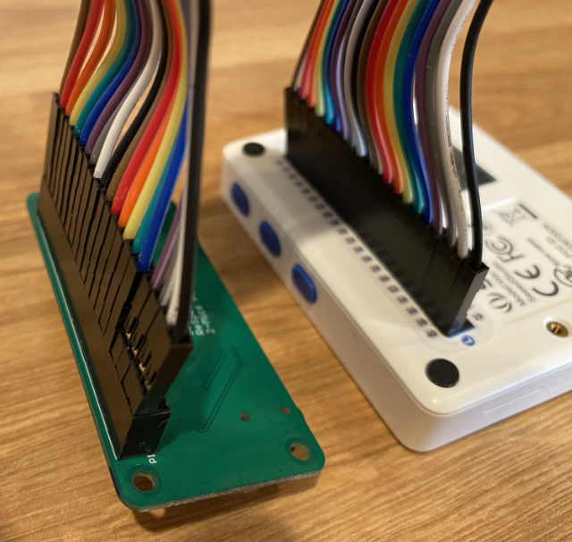
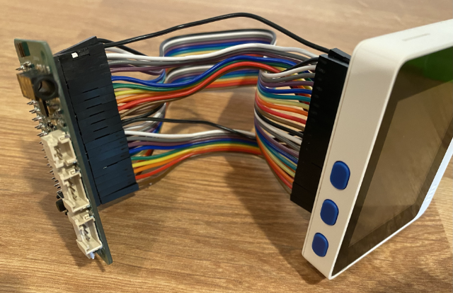

<!--
CO_OP_TRANSLATOR_METADATA:
{
  "original_hash": "93d352de36526b8990e41dd538100324",
  "translation_date": "2025-08-27T14:21:17+00:00",
  "source_file": "6-consumer/lessons/1-speech-recognition/wio-terminal-microphone.md",
  "language_code": "bn"
}
-->
# আপনার মাইক্রোফোন এবং স্পিকার কনফিগার করুন - Wio Terminal

এই পাঠের এই অংশে, আপনি আপনার Wio Terminal-এ স্পিকার যোগ করবেন। Wio Terminal-এ ইতিমধ্যেই একটি বিল্ট-ইন মাইক্রোফোন রয়েছে, যা কথোপকথন রেকর্ড করার জন্য ব্যবহার করা যেতে পারে।

## হার্ডওয়্যার

Wio Terminal-এ ইতিমধ্যেই একটি মাইক্রোফোন রয়েছে, যা অডিও রেকর্ড করার জন্য এবং কথোপকথন শনাক্ত করার জন্য ব্যবহার করা যেতে পারে।

স্পিকার যোগ করতে, আপনি [ReSpeaker 2-Mics Pi Hat](https://www.seeedstudio.com/ReSpeaker-2-Mics-Pi-HAT.html) ব্যবহার করতে পারেন। এটি একটি বাহ্যিক বোর্ড, যেখানে ২টি MEMS মাইক্রোফোন, একটি স্পিকার সংযোগকারী এবং একটি হেডফোন সকেট রয়েছে।

আপনাকে হেডফোন, একটি ৩.৫ মিমি জ্যাক সহ স্পিকার, অথবা JST সংযোগকারী সহ একটি স্পিকার যেমন [Mono Enclosed Speaker - 2W 6 Ohm](https://www.seeedstudio.com/Mono-Enclosed-Speaker-2W-6-Ohm-p-2832.html) যোগ করতে হবে।

ReSpeaker 2-Mics Pi Hat সংযোগ করতে, আপনাকে ৪০ পিন-টু-পিন (পুরুষ-টু-পুরুষ) জাম্পার কেবল প্রয়োজন হবে।

> 💁 যদি আপনি সোল্ডারিং করতে স্বাচ্ছন্দ্যবোধ করেন, তাহলে আপনি [40 Pin Raspberry Pi Hat Adapter Board For Wio Terminal](https://www.seeedstudio.com/40-Pin-Raspberry-Pi-Hat-Adapter-Board-For-Wio-Terminal-p-4730.html) ব্যবহার করতে পারেন ReSpeaker সংযোগ করার জন্য।

আপনাকে একটি SD কার্ডও প্রয়োজন হবে অডিও ডাউনলোড এবং প্লেব্যাক করার জন্য। Wio Terminal শুধুমাত্র ১৬GB পর্যন্ত SD কার্ড সমর্থন করে এবং এগুলো FAT32 বা exFAT ফাইল সিস্টেমে ফরম্যাট করা থাকতে হবে।

### কাজ - ReSpeaker Pi Hat সংযোগ করুন

1. Wio Terminal বন্ধ অবস্থায়, ReSpeaker 2-Mics Pi Hat-কে Wio Terminal-এর সাথে জাম্পার কেবল এবং GPIO সকেট ব্যবহার করে সংযুক্ত করুন:

    পিনগুলো এইভাবে সংযুক্ত করতে হবে:

    

1. ReSpeaker এবং Wio Terminal-কে GPIO সকেটগুলো উপরের দিকে এবং বাম দিকে অবস্থান করুন।

1. ReSpeaker-এর GPIO সকেটের উপরের বাম দিক থেকে শুরু করুন। ReSpeaker-এর উপরের বাম সকেট থেকে Wio Terminal-এর উপরের বাম সকেটে একটি পিন-টু-পিন জাম্পার কেবল সংযুক্ত করুন।

1. বাম দিকের GPIO সকেটগুলোতে এই প্রক্রিয়া চালিয়ে যান। নিশ্চিত করুন যে পিনগুলো দৃঢ়ভাবে সংযুক্ত রয়েছে।

    

    

    > 💁 যদি আপনার জাম্পার কেবলগুলো রিবনে সংযুক্ত থাকে, তাহলে সেগুলো একসাথে রাখুন - এটি নিশ্চিত করতে সহজ হবে যে সব কেবল সঠিকভাবে সংযুক্ত হয়েছে।

1. ReSpeaker এবং Wio Terminal-এর ডান দিকের GPIO সকেটগুলো ব্যবহার করে একই প্রক্রিয়া পুনরাবৃত্তি করুন। এই কেবলগুলো ইতিমধ্যে সংযুক্ত কেবলগুলোর চারপাশে যেতে হবে।

    

    

    > 💁 যদি আপনার জাম্পার কেবলগুলো রিবনে সংযুক্ত থাকে, তাহলে সেগুলো দুই ভাগে ভাগ করুন। একটি রিবন প্রতিটি দিক দিয়ে বিদ্যমান কেবলগুলোর পাশে নিয়ে যান।

    > 💁 আপনি পিনগুলোকে একটি ব্লকে ধরে রাখতে স্টিকি টেপ ব্যবহার করতে পারেন যাতে সংযোগ করার সময় কোনো পিন বেরিয়ে না যায়।
    >
    > 

1. আপনাকে একটি স্পিকার যোগ করতে হবে।

    * যদি আপনি JST কেবল সহ একটি স্পিকার ব্যবহার করেন, তাহলে এটি ReSpeaker-এর JST পোর্টে সংযুক্ত করুন।

      

    * যদি আপনি ৩.৫ মিমি জ্যাক সহ একটি স্পিকার বা হেডফোন ব্যবহার করেন, তাহলে এটি ৩.৫ মিমি জ্যাক সকেটে প্রবেশ করান।

      

### কাজ - SD কার্ড সেট আপ করুন

1. SD কার্ডটি আপনার কম্পিউটারে সংযুক্ত করুন, যদি আপনার কম্পিউটারে SD কার্ড স্লট না থাকে তাহলে একটি বাহ্যিক রিডার ব্যবহার করুন।

1. আপনার কম্পিউটারে উপযুক্ত টুল ব্যবহার করে SD কার্ডটি ফরম্যাট করুন, নিশ্চিত করুন যে এটি FAT32 বা exFAT ফাইল সিস্টেম ব্যবহার করছে।

1. SD কার্ডটি Wio Terminal-এর SD কার্ড স্লটে প্রবেশ করান, যা পাওয়ার বোতামের ঠিক নিচে বাম দিকে অবস্থিত। নিশ্চিত করুন যে কার্ডটি সম্পূর্ণভাবে প্রবেশ করেছে এবং ক্লিক করেছে - এটি সম্পূর্ণভাবে প্রবেশ করানোর জন্য একটি পাতলা টুল বা অন্য SD কার্ড প্রয়োজন হতে পারে।

    

    > 💁 SD কার্ড বের করতে, আপনাকে এটি সামান্য চাপ দিতে হবে এবং এটি বেরিয়ে আসবে। এটি করতে একটি পাতলা টুল যেমন একটি ফ্ল্যাট-হেড স্ক্রু ড্রাইভার বা অন্য SD কার্ড প্রয়োজন হবে।

---

**অস্বীকৃতি**:  
এই নথিটি AI অনুবাদ পরিষেবা [Co-op Translator](https://github.com/Azure/co-op-translator) ব্যবহার করে অনুবাদ করা হয়েছে। আমরা যথাসাধ্য সঠিকতা নিশ্চিত করার চেষ্টা করি, তবে অনুগ্রহ করে মনে রাখবেন যে স্বয়ংক্রিয় অনুবাদে ত্রুটি বা অসঙ্গতি থাকতে পারে। মূল ভাষায় থাকা নথিটিকে প্রামাণিক উৎস হিসেবে বিবেচনা করা উচিত। গুরুত্বপূর্ণ তথ্যের জন্য, পেশাদার মানব অনুবাদ সুপারিশ করা হয়। এই অনুবাদ ব্যবহারের ফলে কোনো ভুল বোঝাবুঝি বা ভুল ব্যাখ্যা হলে আমরা দায়বদ্ধ থাকব না।