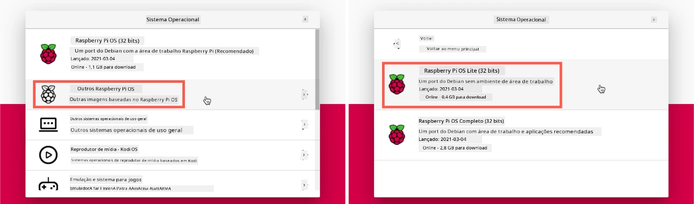
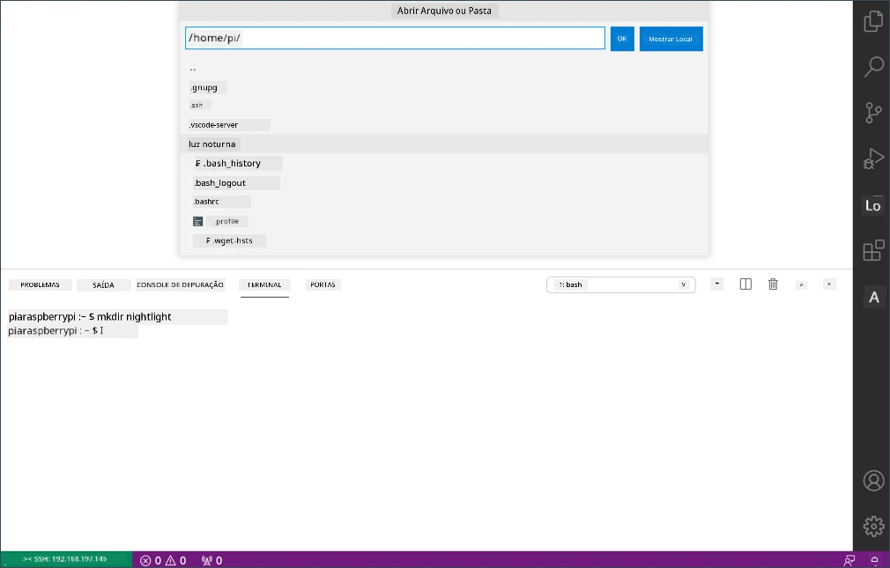

<!--
CO_OP_TRANSLATOR_METADATA:
{
  "original_hash": "8ff0d0a1d29832bb896b9c103b69a452",
  "translation_date": "2025-08-28T03:36:56+00:00",
  "source_file": "1-getting-started/lessons/1-introduction-to-iot/pi.md",
  "language_code": "br"
}
-->
# Raspberry Pi

O [Raspberry Pi](https://raspberrypi.org) é um computador de placa única. Você pode adicionar sensores e atuadores usando uma ampla variedade de dispositivos e ecossistemas. Para estas lições, utilizaremos um ecossistema de hardware chamado [Grove](https://www.seeedstudio.com/category/Grove-c-1003.html). Você programará seu Pi e acessará os sensores Grove usando Python.


## Configuração

Se você estiver usando um Raspberry Pi como seu hardware IoT, tem duas opções: pode trabalhar diretamente no Pi para realizar todas as lições e programar, ou pode se conectar remotamente a um Pi 'headless' (sem monitor, teclado ou mouse) e programar a partir do seu computador.

Antes de começar, você também precisará conectar o Grove Base Hat ao seu Pi.

### Tarefa - configuração

Instale o Grove Base Hat no seu Pi e configure o Pi.

1. Conecte o Grove Base Hat ao seu Pi. O soquete do hat se encaixa sobre todos os pinos GPIO do Pi, deslizando até o final para fixar-se firmemente na base. Ele ficará sobre o Pi, cobrindo-o.

    

1. Decida como deseja programar seu Pi e vá para a seção correspondente abaixo:

    * [Trabalhar diretamente no seu Pi](../../../../../1-getting-started/lessons/1-introduction-to-iot)
    * [Acesso remoto para programar o Pi](../../../../../1-getting-started/lessons/1-introduction-to-iot)

### Trabalhar diretamente no seu Pi

Se você deseja trabalhar diretamente no seu Pi, pode usar a versão desktop do Raspberry Pi OS e instalar todas as ferramentas necessárias.

#### Tarefa - trabalhar diretamente no seu Pi

Configure seu Pi para desenvolvimento.

1. Siga as instruções no [guia de configuração do Raspberry Pi](https://projects.raspberrypi.org/en/projects/raspberry-pi-setting-up) para configurar seu Pi, conectá-lo a um teclado/mouse/monitor, conectá-lo à sua rede Wi-Fi ou Ethernet e atualizar o software.

Para programar o Pi usando os sensores e atuadores Grove, você precisará instalar um editor para escrever o código do dispositivo, além de várias bibliotecas e ferramentas que interagem com o hardware Grove.

1. Após o reinício do seu Pi, abra o Terminal clicando no ícone **Terminal** na barra de menu superior ou escolha *Menu -> Acessórios -> Terminal*.

1. Execute o seguinte comando para garantir que o sistema operacional e o software instalado estejam atualizados:

    ```sh
    sudo apt update && sudo apt full-upgrade --yes
    ```

1. Execute os seguintes comandos para instalar todas as bibliotecas necessárias para o hardware Grove:

    ```sh
    sudo apt install git python3-dev python3-pip --yes

    git clone https://github.com/Seeed-Studio/grove.py
    cd grove.py
    sudo pip3 install .

    sudo raspi-config nonint do_i2c 0
    ```

    Isso começa instalando o Git, junto com o Pip para instalar pacotes Python.

    Uma das características mais poderosas do Python é a capacidade de instalar [pacotes Pip](https://pypi.org) - pacotes de código escritos por outras pessoas e publicados na Internet. Você pode instalar um pacote Pip no seu computador com um único comando e usá-lo no seu código.

    Os pacotes Python do Seeed Grove precisam ser instalados a partir do código-fonte. Esses comandos clonarão o repositório contendo o código-fonte desse pacote e o instalarão localmente.

    > 💁 Por padrão, quando você instala um pacote, ele fica disponível em todo o computador, o que pode causar problemas com versões de pacotes - como uma aplicação depender de uma versão específica que pode ser quebrada ao instalar uma nova versão para outra aplicação. Para contornar esse problema, você pode usar um [ambiente virtual Python](https://docs.python.org/3/library/venv.html), essencialmente uma cópia do Python em uma pasta dedicada, onde os pacotes Pip são instalados apenas nessa pasta. No entanto, você não usará ambientes virtuais ao trabalhar com o Pi. O script de instalação do Grove instala os pacotes Python do Grove globalmente, então, para usar um ambiente virtual, seria necessário configurá-lo e reinstalar manualmente os pacotes do Grove dentro dele. É mais fácil usar pacotes globais, especialmente porque muitos desenvolvedores de Pi preferem regravar um cartão SD limpo para cada projeto.

    Por fim, isso habilita a interface I<sup>2</sup>C.

1. Reinicie o Pi usando o menu ou executando o seguinte comando no Terminal:

    ```sh
    sudo reboot
    ```

1. Após o reinício do Pi, abra novamente o Terminal e execute o seguinte comando para instalar o [Visual Studio Code (VS Code)](https://code.visualstudio.com?WT.mc_id=academic-17441-jabenn) - este será o editor usado para escrever o código do dispositivo em Python.

    ```sh
    sudo apt install code
    ```

    Após a instalação, o VS Code estará disponível no menu superior.

    > 💁 Você é livre para usar qualquer IDE ou editor Python de sua preferência para estas lições, mas as instruções serão baseadas no uso do VS Code.

1. Instale o Pylance. Esta é uma extensão para o VS Code que fornece suporte à linguagem Python. Consulte a [documentação da extensão Pylance](https://marketplace.visualstudio.com/items?WT.mc_id=academic-17441-jabenn&itemName=ms-python.vscode-pylance) para obter instruções sobre como instalar esta extensão no VS Code.

### Acesso remoto para programar o Pi

Em vez de programar diretamente no Pi, ele pode ser executado no modo 'headless', ou seja, sem estar conectado a um teclado/mouse/monitor. Você pode configurá-lo e programá-lo a partir do seu computador usando o Visual Studio Code.

#### Configurar o sistema operacional do Pi

Para programar remotamente, o sistema operacional do Pi precisa ser instalado em um cartão SD.

##### Tarefa - configurar o sistema operacional do Pi

Configure o sistema operacional do Pi no modo headless.

1. Baixe o **Raspberry Pi Imager** na [página de software do Raspberry Pi OS](https://www.raspberrypi.org/software/) e instale-o.

1. Insira um cartão SD no seu computador, usando um adaptador, se necessário.

1. Abra o Raspberry Pi Imager.

1. No Raspberry Pi Imager, selecione o botão **CHOOSE OS**, depois escolha *Raspberry Pi OS (Other)* e, em seguida, *Raspberry Pi OS Lite (32-bit)*.

    

    > 💁 O Raspberry Pi OS Lite é uma versão do sistema operacional que não possui interface gráfica ou ferramentas baseadas em UI. Isso não é necessário para um Pi headless e torna a instalação menor e o tempo de inicialização mais rápido.

1. Selecione o botão **CHOOSE STORAGE** e escolha seu cartão SD.

1. Abra as **Opções Avançadas** pressionando `Ctrl+Shift+X`. Essas opções permitem pré-configurar o sistema operacional do Raspberry Pi antes de gravá-lo no cartão SD.

    1. Marque a caixa **Enable SSH** e defina uma senha para o usuário `pi`. Esta será a senha usada para fazer login no Pi mais tarde.

    1. Se você planeja conectar o Pi via Wi-Fi, marque a caixa **Configure WiFi** e insira o SSID e a senha da sua rede Wi-Fi, além de selecionar seu país de Wi-Fi. Não é necessário fazer isso se você usar um cabo Ethernet. Certifique-se de que a rede à qual você se conecta seja a mesma do seu computador.

    1. Marque a caixa **Set locale settings** e configure seu país e fuso horário.

    1. Selecione o botão **SAVE**.

1. Clique no botão **WRITE** para gravar o sistema operacional no cartão SD. Se estiver usando macOS, será solicitado que você insira sua senha, pois a ferramenta subjacente que grava imagens de disco precisa de acesso privilegiado.

O sistema operacional será gravado no cartão SD e, ao finalizar, o cartão será ejetado pelo sistema operacional, e você será notificado. Remova o cartão SD do computador, insira-o no Pi, ligue o Pi e aguarde cerca de 2 minutos para que ele inicialize corretamente.

#### Conectar-se ao Pi

O próximo passo é acessar o Pi remotamente. Isso pode ser feito usando `ssh`, disponível no macOS, Linux e versões recentes do Windows.

##### Tarefa - conectar-se ao Pi

Acesse o Pi remotamente.

1. Abra um Terminal ou Prompt de Comando e insira o seguinte comando para conectar-se ao Pi:

    ```sh
    ssh pi@raspberrypi.local
    ```

    Se você estiver usando uma versão mais antiga do Windows que não possui `ssh` instalado, pode usar o OpenSSH. As instruções de instalação estão na [documentação de instalação do OpenSSH](https://docs.microsoft.com//windows-server/administration/openssh/openssh_install_firstuse?WT.mc_id=academic-17441-jabenn).

1. Isso deve conectar-se ao seu Pi e solicitar a senha.

    A capacidade de encontrar computadores na sua rede usando `<hostname>.local` é uma adição relativamente recente ao Linux e Windows. Se você estiver usando Linux ou Windows e receber erros sobre o nome do host não encontrado, será necessário instalar software adicional para habilitar o ZeroConf networking (também chamado de Bonjour pela Apple):

    1. Se estiver usando Linux, instale o Avahi com o seguinte comando:

        ```sh
        sudo apt-get install avahi-daemon
        ```

    1. Se estiver usando Windows, a maneira mais fácil de habilitar o ZeroConf é instalar o [Bonjour Print Services for Windows](http://support.apple.com/kb/DL999). Você também pode instalar o [iTunes para Windows](https://www.apple.com/itunes/download/) para obter uma versão mais recente da ferramenta (que não está disponível separadamente).

    > 💁 Se você não conseguir se conectar usando `raspberrypi.local`, pode usar o endereço IP do seu Pi. Consulte a [documentação de endereço IP do Raspberry Pi](https://www.raspberrypi.org/documentation/remote-access/ip-address.md) para instruções sobre como obter o endereço IP.

1. Insira a senha que você definiu nas Opções Avançadas do Raspberry Pi Imager.

#### Configurar software no Pi

Depois de conectado ao Pi, você precisa garantir que o sistema operacional esteja atualizado e instalar várias bibliotecas e ferramentas que interagem com o hardware Grove.

##### Tarefa - configurar software no Pi

Configure o software instalado no Pi e instale as bibliotecas Grove.

1. A partir da sua sessão `ssh`, execute o seguinte comando para atualizar e reiniciar o Pi:

    ```sh
    sudo apt update && sudo apt full-upgrade --yes && sudo reboot
    ```

    O Pi será atualizado e reiniciado. A sessão `ssh` será encerrada quando o Pi for reiniciado, então aguarde cerca de 30 segundos e reconecte-se.

1. Na sessão `ssh` reconectada, execute os seguintes comandos para instalar todas as bibliotecas necessárias para o hardware Grove:

    ```sh
    sudo apt install git python3-dev python3-pip --yes

    git clone https://github.com/Seeed-Studio/grove.py
    cd grove.py
    sudo pip3 install .

    sudo raspi-config nonint do_i2c 0
    ```

    Isso começa instalando o Git, junto com o Pip para instalar pacotes Python.

    Uma das características mais poderosas do Python é a capacidade de instalar [pacotes Pip](https://pypi.org) - pacotes de código escritos por outras pessoas e publicados na Internet. Você pode instalar um pacote Pip no seu computador com um único comando e usá-lo no seu código.

    Os pacotes Python do Seeed Grove precisam ser instalados a partir do código-fonte. Esses comandos clonarão o repositório contendo o código-fonte desse pacote e o instalarão localmente.

    > 💁 Por padrão, quando você instala um pacote, ele fica disponível em todo o computador, o que pode causar problemas com versões de pacotes - como uma aplicação depender de uma versão específica que pode ser quebrada ao instalar uma nova versão para outra aplicação. Para contornar esse problema, você pode usar um [ambiente virtual Python](https://docs.python.org/3/library/venv.html), essencialmente uma cópia do Python em uma pasta dedicada, onde os pacotes Pip são instalados apenas nessa pasta. No entanto, você não usará ambientes virtuais ao trabalhar com o Pi. O script de instalação do Grove instala os pacotes Python do Grove globalmente, então, para usar um ambiente virtual, seria necessário configurá-lo e reinstalar manualmente os pacotes do Grove dentro dele. É mais fácil usar pacotes globais, especialmente porque muitos desenvolvedores de Pi preferem regravar um cartão SD limpo para cada projeto.

    Por fim, isso habilita a interface I<sup>2</sup>C.

1. Reinicie o Pi executando o seguinte comando:

    ```sh
    sudo reboot
    ```

    A sessão `ssh` será encerrada quando o Pi for reiniciado. Não é necessário reconectar.

#### Configurar o VS Code para acesso remoto

Depois que o Pi estiver configurado, você poderá se conectar a ele usando o Visual Studio Code (VS Code) a partir do seu computador - este é um editor de texto gratuito para desenvolvedores que você usará para escrever o código do dispositivo em Python.

##### Tarefa - configurar o VS Code para acesso remoto

Instale o software necessário e conecte-se remotamente ao seu Pi.

1. Instale o VS Code no seu computador seguindo a [documentação do VS Code](https://code.visualstudio.com?WT.mc_id=academic-17441-jabenn).

1. Siga as instruções na [documentação de desenvolvimento remoto do VS Code usando SSH](https://code.visualstudio.com/docs/remote/ssh?WT.mc_id=academic-17441-jabenn) para instalar os componentes necessários.

1. Seguindo as mesmas instruções, conecte o VS Code ao Pi.

1. Uma vez conectado, siga as instruções de [gerenciamento de extensões](https://code.visualstudio.com/docs/remote/ssh#_managing-extensions?WT.mc_id=academic-17441-jabenn) para instalar remotamente a extensão [Pylance](https://marketplace.visualstudio.com/items?WT.mc_id=academic-17441-jabenn&itemName=ms-python.vscode-pylance) no Pi.

## Olá, mundo
É tradicional, ao começar com uma nova linguagem de programação ou tecnologia, criar um aplicativo 'Hello World' - um pequeno programa que exibe algo como o texto `"Hello World"` para mostrar que todas as ferramentas estão configuradas corretamente.

O aplicativo Hello World para o Pi garantirá que você tenha o Python e o Visual Studio Code instalados corretamente.

Este aplicativo estará em uma pasta chamada `nightlight`, e será reutilizado com códigos diferentes em partes posteriores desta tarefa para construir o aplicativo de luz noturna.

### Tarefa - hello world

Crie o aplicativo Hello World.

1. Abra o VS Code, diretamente no Pi ou no seu computador conectado ao Pi usando a extensão Remote SSH.

1. Abra o Terminal do VS Code selecionando *Terminal -> New Terminal*, ou pressionando `` CTRL+` ``. Ele será aberto no diretório inicial do usuário `pi`.

1. Execute os seguintes comandos para criar um diretório para o seu código e criar um arquivo Python chamado `app.py` dentro desse diretório:

    ```sh
    mkdir nightlight
    cd nightlight
    touch app.py
    ```

1. Abra esta pasta no VS Code selecionando *File -> Open...* e escolhendo a pasta *nightlight*, depois selecione **OK**.

    

1. Abra o arquivo `app.py` no explorador do VS Code e adicione o seguinte código:

    ```python
    print('Hello World!')
    ```

    A função `print` exibe no console o que for passado para ela.

1. No Terminal do VS Code, execute o seguinte comando para rodar seu aplicativo Python:

    ```sh
    python app.py
    ```

    > 💁 Pode ser necessário chamar explicitamente `python3` para executar este código se você tiver o Python 2 instalado além do Python 3 (a versão mais recente). Se o Python 2 estiver instalado, chamar `python` usará o Python 2 em vez do Python 3. Por padrão, as versões mais recentes do Raspberry Pi OS possuem apenas o Python 3 instalado.

    A seguinte saída aparecerá no terminal:

    ```output
    pi@raspberrypi:~/nightlight $ python3 app.py
    Hello World!
    ```

> 💁 Você pode encontrar este código na pasta [code/pi](../../../../../1-getting-started/lessons/1-introduction-to-iot/code/pi).

😀 Seu programa 'Hello World' foi um sucesso!

---

**Aviso Legal**:  
Este documento foi traduzido utilizando o serviço de tradução por IA [Co-op Translator](https://github.com/Azure/co-op-translator). Embora nos esforcemos para garantir a precisão, esteja ciente de que traduções automatizadas podem conter erros ou imprecisões. O documento original em seu idioma nativo deve ser considerado a fonte autoritativa. Para informações críticas, recomenda-se a tradução profissional realizada por humanos. Não nos responsabilizamos por quaisquer mal-entendidos ou interpretações equivocadas decorrentes do uso desta tradução.