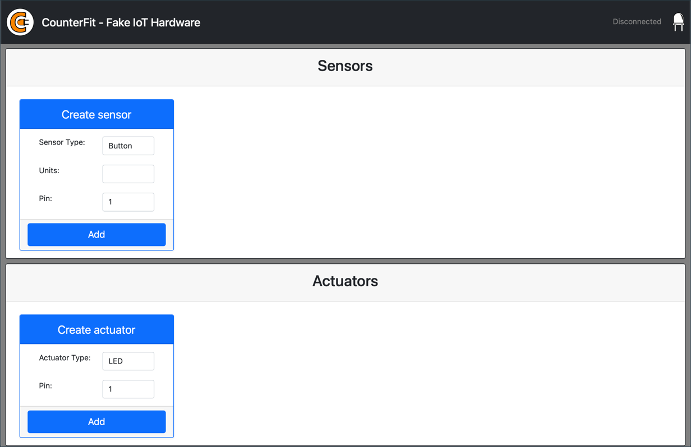

<!--
CO_OP_TRANSLATOR_METADATA:
{
  "original_hash": "52b4de6144b2efdced7797a5339d6035",
  "translation_date": "2025-08-28T03:35:50+00:00",
  "source_file": "1-getting-started/lessons/1-introduction-to-iot/virtual-device.md",
  "language_code": "br"
}
-->
# Computador de placa única virtual

Em vez de comprar um dispositivo IoT, junto com sensores e atuadores, você pode usar seu computador para simular hardware IoT. O [projeto CounterFit](https://github.com/CounterFit-IoT/CounterFit) permite que você execute um aplicativo localmente que simula hardware IoT, como sensores e atuadores, e acesse esses sensores e atuadores a partir de código Python local, escrito da mesma forma que você faria em um Raspberry Pi usando hardware físico.

## Configuração

Para usar o CounterFit, você precisará instalar alguns softwares gratuitos no seu computador.

### Tarefa

Instale o software necessário.

1. Instale o Python. Consulte a [página de downloads do Python](https://www.python.org/downloads/) para instruções sobre como instalar a versão mais recente do Python.

1. Instale o Visual Studio Code (VS Code). Este será o editor que você usará para escrever o código do dispositivo virtual em Python. Consulte a [documentação do VS Code](https://code.visualstudio.com?WT.mc_id=academic-17441-jabenn) para instruções sobre como instalar o VS Code.

    > 💁 Você está livre para usar qualquer IDE ou editor de Python para estas lições, caso tenha uma ferramenta preferida, mas as lições fornecerão instruções baseadas no uso do VS Code.

1. Instale a extensão Pylance do VS Code. Esta é uma extensão para o VS Code que oferece suporte à linguagem Python. Consulte a [documentação da extensão Pylance](https://marketplace.visualstudio.com/items?WT.mc_id=academic-17441-jabenn&itemName=ms-python.vscode-pylance) para instruções sobre como instalar esta extensão no VS Code.

As instruções para instalar e configurar o aplicativo CounterFit serão fornecidas no momento relevante nas instruções da tarefa, pois ele é instalado por projeto.

## Olá Mundo

É tradicional, ao começar com uma nova linguagem de programação ou tecnologia, criar um aplicativo 'Olá Mundo' - um pequeno aplicativo que exibe algo como o texto `"Olá Mundo"` para mostrar que todas as ferramentas estão configuradas corretamente.

O aplicativo Olá Mundo para o hardware IoT virtual garantirá que você tenha o Python e o Visual Studio Code instalados corretamente. Ele também se conectará ao CounterFit para os sensores e atuadores IoT virtuais. Não usará nenhum hardware, apenas se conectará para provar que tudo está funcionando.

Este aplicativo estará em uma pasta chamada `nightlight`, e será reutilizado com diferentes códigos em partes posteriores desta tarefa para construir o aplicativo de luz noturna.

### Configurar um ambiente virtual Python

Uma das características poderosas do Python é a capacidade de instalar [pacotes Pip](https://pypi.org) - pacotes de código escritos por outras pessoas e publicados na Internet. Você pode instalar um pacote Pip no seu computador com um único comando e, em seguida, usar esse pacote no seu código. Você usará o Pip para instalar um pacote que se comunica com o CounterFit.

Por padrão, quando você instala um pacote, ele fica disponível em todo o seu computador, e isso pode levar a problemas com versões de pacotes - como um aplicativo depender de uma versão de um pacote que quebra quando você instala uma nova versão para outro aplicativo. Para contornar esse problema, você pode usar um [ambiente virtual Python](https://docs.python.org/3/library/venv.html), essencialmente uma cópia do Python em uma pasta dedicada, e quando você instala pacotes Pip, eles são instalados apenas nessa pasta.

> 💁 Se você estiver usando um Raspberry Pi, então não configurou um ambiente virtual nesse dispositivo para gerenciar pacotes Pip, em vez disso, está usando pacotes globais, já que os pacotes Grove são instalados globalmente pelo script de instalação.

#### Tarefa - configurar um ambiente virtual Python

Configure um ambiente virtual Python e instale os pacotes Pip para o CounterFit.

1. No seu terminal ou linha de comando, execute o seguinte em um local de sua escolha para criar e navegar até um novo diretório:

    ```sh
    mkdir nightlight
    cd nightlight
    ```

1. Agora execute o seguinte para criar um ambiente virtual na pasta `.venv`:

    ```sh
    python3 -m venv .venv
    ```

    > 💁 Você precisa chamar explicitamente `python3` para criar o ambiente virtual, caso tenha o Python 2 instalado além do Python 3 (a versão mais recente). Se você tiver o Python 2 instalado, chamar `python` usará o Python 2 em vez do Python 3.

1. Ative o ambiente virtual:

    * No Windows:
        * Se estiver usando o Prompt de Comando ou o Prompt de Comando pelo Windows Terminal, execute:

            ```cmd
            .venv\Scripts\activate.bat
            ```

        * Se estiver usando o PowerShell, execute:

            ```powershell
            .\.venv\Scripts\Activate.ps1
            ```

            > Se você receber um erro sobre scripts não poderem ser executados neste sistema, será necessário habilitar a execução de scripts configurando uma política de execução apropriada. Você pode fazer isso iniciando o PowerShell como administrador e executando o seguinte comando:

            ```powershell
            Set-ExecutionPolicy -ExecutionPolicy Unrestricted
            ```

            Digite `Y` quando solicitado a confirmar. Em seguida, reinicie o PowerShell e tente novamente.

            Você pode redefinir essa política de execução posteriormente, se necessário. Você pode ler mais sobre isso na [página de Políticas de Execução na documentação da Microsoft](https://docs.microsoft.com/powershell/module/microsoft.powershell.core/about/about_execution_policies?WT.mc_id=academic-17441-jabenn).

    * No macOS ou Linux, execute:

        ```cmd
        source ./.venv/bin/activate
        ```

    > 💁 Esses comandos devem ser executados no mesmo local onde você executou o comando para criar o ambiente virtual. Você nunca precisará navegar para dentro da pasta `.venv`, sempre deve executar o comando de ativação e quaisquer comandos para instalar pacotes ou executar código a partir da pasta onde estava ao criar o ambiente virtual.

1. Uma vez que o ambiente virtual foi ativado, o comando padrão `python` executará a versão do Python que foi usada para criar o ambiente virtual. Execute o seguinte para obter a versão:

    ```sh
    python --version
    ```

    A saída deve conter o seguinte:

    ```output
    (.venv) ➜  nightlight python --version
    Python 3.9.1
    ```

    > 💁 Sua versão do Python pode ser diferente - desde que seja a versão 3.6 ou superior, está tudo certo. Caso contrário, exclua esta pasta, instale uma versão mais recente do Python e tente novamente.

1. Execute os seguintes comandos para instalar os pacotes Pip para o CounterFit. Esses pacotes incluem o aplicativo principal do CounterFit, bem como shims para hardware Grove. Esses shims permitem que você escreva código como se estivesse programando usando sensores e atuadores físicos do ecossistema Grove, mas conectados a dispositivos IoT virtuais.

    ```sh
    pip install CounterFit
    pip install counterfit-connection
    pip install counterfit-shims-grove
    ```

    Esses pacotes Pip serão instalados apenas no ambiente virtual e não estarão disponíveis fora dele.

### Escreva o código

Depois que o ambiente virtual Python estiver pronto, você pode escrever o código para o aplicativo 'Olá Mundo'.

#### Tarefa - escreva o código

Crie um aplicativo Python para imprimir `"Olá Mundo"` no console.

1. No seu terminal ou linha de comando, execute o seguinte dentro do ambiente virtual para criar um arquivo Python chamado `app.py`:

    * No Windows, execute:

        ```cmd
        type nul > app.py
        ```

    * No macOS ou Linux, execute:

        ```cmd
        touch app.py
        ```

1. Abra a pasta atual no VS Code:

    ```sh
    code .
    ```

    > 💁 Se o seu terminal retornar `command not found` no macOS, significa que o VS Code não foi adicionado ao seu PATH. Você pode adicionar o VS Code ao seu PATH seguindo as instruções na [seção de Lançamento pela linha de comando da documentação do VS Code](https://code.visualstudio.com/docs/setup/mac?WT.mc_id=academic-17441-jabenn#_launching-from-the-command-line) e executar o comando novamente. O VS Code é adicionado ao PATH por padrão no Windows e Linux.

1. Quando o VS Code for iniciado, ele ativará o ambiente virtual Python. O ambiente virtual selecionado aparecerá na barra de status inferior:

    

1. Se o Terminal do VS Code já estiver em execução quando o VS Code for iniciado, ele não terá o ambiente virtual ativado. A maneira mais fácil de resolver isso é encerrar o terminal usando o botão **Kill the active terminal instance**:

    

    Você pode verificar se o terminal tem o ambiente virtual ativado, pois o nome do ambiente virtual será um prefixo no prompt do terminal. Por exemplo, pode ser:

    ```sh
    (.venv) ➜  nightlight
    ```

    Se você não tiver `.venv` como prefixo no prompt, o ambiente virtual não está ativo no terminal.

1. Inicie um novo terminal do VS Code selecionando *Terminal -> New Terminal*, ou pressionando `` CTRL+` ``. O novo terminal carregará o ambiente virtual, e a chamada para ativá-lo aparecerá no terminal. O prompt também terá o nome do ambiente virtual (`.venv`):

    ```output
    ➜  nightlight source .venv/bin/activate
    (.venv) ➜  nightlight 
    ```

1. Abra o arquivo `app.py` no explorador do VS Code e adicione o seguinte código:

    ```python
    print('Hello World!')
    ```

    A função `print` imprime o que for passado para ela no console.

1. No terminal do VS Code, execute o seguinte para rodar seu aplicativo Python:

    ```sh
    python app.py
    ```

    A seguinte saída aparecerá:

    ```output
    (.venv) ➜  nightlight python app.py 
    Hello World!
    ```

😀 Seu programa 'Olá Mundo' foi um sucesso!

### Conecte o 'hardware'

Como um segundo passo do 'Olá Mundo', você executará o aplicativo CounterFit e conectará seu código a ele. Este é o equivalente virtual de conectar algum hardware IoT a um kit de desenvolvimento.

#### Tarefa - conecte o 'hardware'

1. No terminal do VS Code, inicie o aplicativo CounterFit com o seguinte comando:

    ```sh
    counterfit
    ```

    O aplicativo começará a ser executado e abrirá no seu navegador:

    

    Ele será marcado como *Disconnected*, com o LED no canto superior direito apagado.

1. Adicione o seguinte código ao topo do arquivo `app.py`:

    ```python
    from counterfit_connection import CounterFitConnection
    CounterFitConnection.init('127.0.0.1', 5000)
    ```

    Este código importa a classe `CounterFitConnection` do módulo `counterfit_connection`, que vem do pacote pip `counterfit-connection` instalado anteriormente. Em seguida, inicializa uma conexão com o aplicativo CounterFit rodando em `127.0.0.1`, que é um endereço IP que você pode sempre usar para acessar seu computador local (frequentemente chamado de *localhost*), na porta 5000.

    > 💁 Se você tiver outros aplicativos rodando na porta 5000, pode alterar isso atualizando a porta no código e executando o CounterFit usando `CounterFit --port <port_number>`, substituindo `<port_number>` pela porta que deseja usar.

1. Você precisará iniciar um novo terminal do VS Code selecionando o botão **Create a new integrated terminal**. Isso porque o aplicativo CounterFit está rodando no terminal atual.

    

1. No novo terminal, execute o arquivo `app.py` como antes. O status do CounterFit mudará para **Connected** e o LED acenderá.

    

> 💁 Você pode encontrar este código na pasta [code/virtual-device](../../../../../1-getting-started/lessons/1-introduction-to-iot/code/virtual-device).

😀 Sua conexão com o hardware foi um sucesso!

---

**Aviso Legal**:  
Este documento foi traduzido utilizando o serviço de tradução por IA [Co-op Translator](https://github.com/Azure/co-op-translator). Embora nos esforcemos para garantir a precisão, esteja ciente de que traduções automatizadas podem conter erros ou imprecisões. O documento original em seu idioma nativo deve ser considerado a fonte autoritativa. Para informações críticas, recomenda-se a tradução profissional realizada por humanos. Não nos responsabilizamos por quaisquer mal-entendidos ou interpretações equivocadas decorrentes do uso desta tradução.