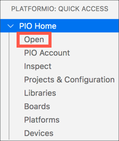

<!--
CO_OP_TRANSLATOR_METADATA:
{
  "original_hash": "a4f0c166010e31fd7b6ca20bc88dec6d",
  "translation_date": "2025-08-28T03:38:34+00:00",
  "source_file": "1-getting-started/lessons/1-introduction-to-iot/wio-terminal.md",
  "language_code": "br"
}
-->
# Wio Terminal

O [Wio Terminal da Seeed Studios](https://www.seeedstudio.com/Wio-Terminal-p-4509.html) é um microcontrolador compatível com Arduino, com WiFi e alguns sensores e atuadores integrados, além de portas para adicionar mais sensores e atuadores, utilizando um ecossistema de hardware chamado [Grove](https://www.seeedstudio.com/category/Grove-c-1003.html).


## Configuração

Para usar o Wio Terminal, você precisará instalar alguns softwares gratuitos no seu computador. Também será necessário atualizar o firmware do Wio Terminal antes de conectá-lo ao WiFi.

### Tarefa - configuração

Instale o software necessário e atualize o firmware.

1. Instale o Visual Studio Code (VS Code). Este será o editor que você usará para escrever o código do dispositivo em C/C++. Consulte a [documentação do VS Code](https://code.visualstudio.com?WT.mc_id=academic-17441-jabenn) para obter instruções sobre como instalar o VS Code.

    > 💁 Outro IDE popular para desenvolvimento com Arduino é o [Arduino IDE](https://www.arduino.cc/en/software). Se você já estiver familiarizado com essa ferramenta, pode usá-la em vez do VS Code e do PlatformIO, mas as lições fornecerão instruções baseadas no uso do VS Code.

1. Instale a extensão PlatformIO para o VS Code. Esta é uma extensão para o VS Code que suporta a programação de microcontroladores em C/C++. Consulte a [documentação da extensão PlatformIO](https://marketplace.visualstudio.com/items?WT.mc_id=academic-17441-jabenn&itemName=platformio.platformio-ide) para obter instruções sobre como instalar esta extensão no VS Code. Essa extensão depende da extensão Microsoft C/C++ para trabalhar com código C e C++, que será instalada automaticamente ao instalar o PlatformIO.

1. Conecte o Wio Terminal ao seu computador. O Wio Terminal possui uma porta USB-C na parte inferior, que deve ser conectada a uma porta USB do seu computador. O Wio Terminal vem com um cabo USB-C para USB-A, mas se o seu computador tiver apenas portas USB-C, você precisará de um cabo USB-C ou um adaptador USB-A para USB-C.

1. Siga as instruções na [documentação de visão geral do WiFi no Wiki do Wio Terminal](https://wiki.seeedstudio.com/Wio-Terminal-Network-Overview/) para configurar o Wio Terminal e atualizar o firmware.

## Hello World

É tradicional, ao começar com uma nova linguagem de programação ou tecnologia, criar um aplicativo 'Hello World' - um pequeno programa que exibe algo como o texto `"Hello World"` para mostrar que todas as ferramentas estão configuradas corretamente.

O aplicativo Hello World para o Wio Terminal garantirá que você tenha o Visual Studio Code instalado corretamente com o PlatformIO e configurado para desenvolvimento de microcontroladores.

### Criar um projeto no PlatformIO

O primeiro passo é criar um novo projeto usando o PlatformIO configurado para o Wio Terminal.

#### Tarefa - criar um projeto no PlatformIO

Crie o projeto no PlatformIO.

1. Conecte o Wio Terminal ao seu computador.

1. Abra o VS Code.

1. O ícone do PlatformIO estará na barra de menu lateral:

    

    Selecione este item de menu e, em seguida, selecione *PIO Home -> Open*.

    

1. Na tela de boas-vindas, selecione o botão **+ New Project**.

    

1. Configure o projeto no *Project Wizard*:

    1. Nomeie seu projeto como `nightlight`.

    1. No menu suspenso *Board*, digite `WIO` para filtrar as placas e selecione *Seeeduino Wio Terminal*.

    1. Deixe o *Framework* como *Arduino*.

    1. Mantenha a caixa de seleção *Use default location* marcada ou desmarque-a e selecione um local para o seu projeto.

    1. Selecione o botão **Finish**.

    

    O PlatformIO fará o download dos componentes necessários para compilar o código para o Wio Terminal e criará seu projeto. Isso pode levar alguns minutos.

### Investigar o projeto no PlatformIO

O explorador do VS Code mostrará vários arquivos e pastas criados pelo assistente do PlatformIO.

#### Pastas

* `.pio` - esta pasta contém dados temporários necessários pelo PlatformIO, como bibliotecas ou código compilado. Ela é recriada automaticamente se excluída, e você não precisa adicioná-la ao controle de versão se estiver compartilhando seu projeto em sites como o GitHub.
* `.vscode` - esta pasta contém a configuração usada pelo PlatformIO e pelo VS Code. Ela é recriada automaticamente se excluída, e você não precisa adicioná-la ao controle de versão se estiver compartilhando seu projeto em sites como o GitHub.
* `include` - esta pasta é para arquivos de cabeçalho externos necessários ao adicionar bibliotecas adicionais ao seu código. Você não usará esta pasta em nenhuma destas lições.
* `lib` - esta pasta é para bibliotecas externas que você deseja chamar a partir do seu código. Você não usará esta pasta em nenhuma destas lições.
* `src` - esta pasta contém o código-fonte principal do seu aplicativo. Inicialmente, ela conterá um único arquivo - `main.cpp`.
* `test` - esta pasta é onde você colocaria quaisquer testes unitários para o seu código.

#### Arquivos

* `main.cpp` - este arquivo na pasta `src` contém o ponto de entrada para o seu aplicativo. Abra este arquivo, e ele conterá o seguinte código:

    ```cpp
    #include <Arduino.h>
    
    void setup() {
      // put your setup code here, to run once:
    }
    
    void loop() {
      // put your main code here, to run repeatedly:
    }
    ```

    Quando o dispositivo é iniciado, o framework Arduino executa a função `setup` uma vez e, em seguida, executa a função `loop` repetidamente até que o dispositivo seja desligado.

* `.gitignore` - este arquivo lista os arquivos e diretórios a serem ignorados ao adicionar seu código ao controle de versão git, como ao fazer upload para um repositório no GitHub.

* `platformio.ini` - este arquivo contém a configuração para o seu dispositivo e aplicativo. Abra este arquivo, e ele conterá o seguinte código:

    ```ini
    [env:seeed_wio_terminal]
    platform = atmelsam
    board = seeed_wio_terminal
    framework = arduino
    ```

    A seção `[env:seeed_wio_terminal]` possui a configuração para o Wio Terminal. Você pode ter várias seções `env` para que seu código possa ser compilado para várias placas.

    Os outros valores correspondem à configuração do assistente de projeto:

  * `platform = atmelsam` define o hardware que o Wio Terminal usa (um microcontrolador baseado em ATSAMD51).
  * `board = seeed_wio_terminal` define o tipo de placa do microcontrolador (o Wio Terminal).
  * `framework = arduino` define que este projeto está usando o framework Arduino.

### Escrever o aplicativo Hello World

Agora você está pronto para escrever o aplicativo Hello World.

#### Tarefa - escrever o aplicativo Hello World

Escreva o aplicativo Hello World.

1. Abra o arquivo `main.cpp` no VS Code.

1. Altere o código para corresponder ao seguinte:

    ```cpp
    #include <Arduino.h>

    void setup()
    {
        Serial.begin(9600);

        while (!Serial)
            ; // Wait for Serial to be ready
    
        delay(1000);
    }
    
    void loop()
    {
        Serial.println("Hello World");
        delay(5000);
    }
    ```

    A função `setup` inicializa uma conexão com a porta serial - neste caso, a porta USB usada para conectar o Wio Terminal ao seu computador. O parâmetro `9600` é a [taxa de transmissão](https://wikipedia.org/wiki/Symbol_rate) (também conhecida como taxa de símbolos), ou a velocidade com que os dados serão enviados pela porta serial em bits por segundo. Essa configuração significa que 9.600 bits (0s e 1s) de dados são enviados a cada segundo. Em seguida, ela aguarda a porta serial estar pronta.

    A função `loop` envia a linha `Hello World!` para a porta serial, ou seja, os caracteres de `Hello World!` junto com um caractere de nova linha. Em seguida, ela aguarda 5.000 milissegundos ou 5 segundos. Após o término do `loop`, ele é executado novamente, e assim por diante, enquanto o microcontrolador estiver ligado.

1. Coloque o Wio Terminal no modo de upload. Você precisará fazer isso toda vez que enviar um novo código para o dispositivo:

    1. Puxe o interruptor de energia para baixo duas vezes rapidamente - ele retornará automaticamente para a posição ligada a cada vez.

    1. Verifique o LED azul de status à direita da porta USB. Ele deve estar pulsando.
    
    [](https://youtu.be/LeKU_7zLRrQ)
    
    Clique na imagem acima para assistir a um vídeo mostrando como fazer isso.

1. Compile e envie o código para o Wio Terminal.

    1. Abra o painel de comandos do VS Code.

    1. Digite `PlatformIO Upload` para buscar a opção de upload e selecione *PlatformIO: Upload*.

        

        O PlatformIO compilará automaticamente o código, se necessário, antes de enviá-lo.

    1. O código será compilado e enviado para o Wio Terminal.

        > 💁 Se você estiver usando macOS, uma notificação sobre um *DISCO NÃO EJETADO CORRETAMENTE* aparecerá. Isso ocorre porque o Wio Terminal é montado como uma unidade durante o processo de gravação e é desconectado quando o código compilado é gravado no dispositivo. Você pode ignorar essa notificação.

    ⚠️ Se você receber erros sobre a porta de upload estar indisponível, primeiro certifique-se de que o Wio Terminal está conectado ao seu computador, ligado usando o interruptor no lado esquerdo da tela e configurado no modo de upload. A luz verde na parte inferior deve estar acesa, e a luz azul deve estar pulsando. Se o erro persistir, puxe o interruptor de ligar/desligar para baixo duas vezes rapidamente novamente para forçar o Wio Terminal ao modo de upload e tente o upload novamente.

O PlatformIO possui um Monitor Serial que pode monitorar os dados enviados pelo cabo USB do Wio Terminal. Isso permite monitorar os dados enviados pelo comando `Serial.println("Hello World");`.

1. Abra o painel de comandos do VS Code.

1. Digite `PlatformIO Serial` para buscar a opção de Monitor Serial e selecione *PlatformIO: Serial Monitor*.

    

    Um novo terminal será aberto, e os dados enviados pela porta serial serão exibidos neste terminal:

    ```output
    > Executing task: platformio device monitor <
    
    --- Available filters and text transformations: colorize, debug, default, direct, hexlify, log2file, nocontrol, printable, send_on_enter, time
    --- More details at http://bit.ly/pio-monitor-filters
    --- Miniterm on /dev/cu.usbmodem101  9600,8,N,1 ---
    --- Quit: Ctrl+C | Menu: Ctrl+T | Help: Ctrl+T followed by Ctrl+H ---
    Hello World
    Hello World
    ```

    `Hello World` será exibido no monitor serial a cada 5 segundos.

> 💁 Você pode encontrar este código na pasta [code/wio-terminal](../../../../../1-getting-started/lessons/1-introduction-to-iot/code/wio-terminal).

😀 Seu programa 'Hello World' foi um sucesso!

---

**Aviso Legal**:  
Este documento foi traduzido utilizando o serviço de tradução por IA [Co-op Translator](https://github.com/Azure/co-op-translator). Embora nos esforcemos para garantir a precisão, esteja ciente de que traduções automatizadas podem conter erros ou imprecisões. O documento original em seu idioma nativo deve ser considerado a fonte autoritativa. Para informações críticas, recomenda-se a tradução profissional realizada por humanos. Não nos responsabilizamos por quaisquer mal-entendidos ou interpretações equivocadas decorrentes do uso desta tradução.