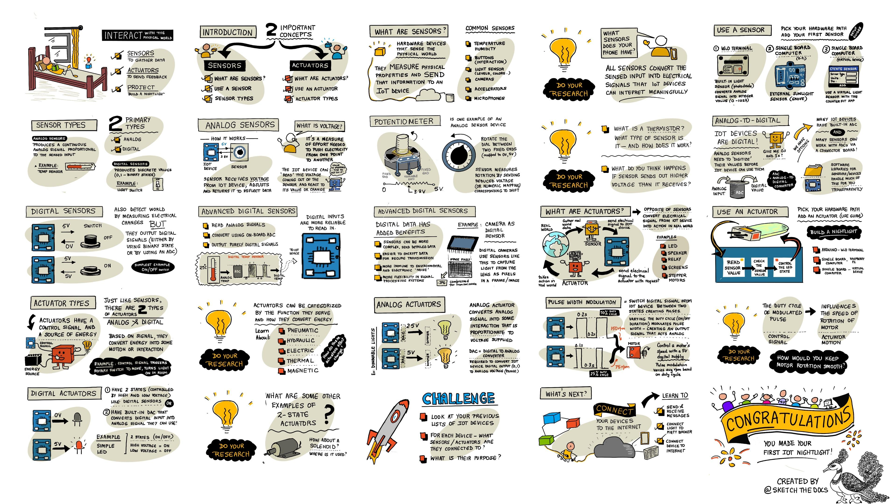

<!--
CO_OP_TRANSLATOR_METADATA:
{
  "original_hash": "e9ee00eb5fc55922a73762acc542166b",
  "translation_date": "2025-08-28T03:39:44+00:00",
  "source_file": "1-getting-started/lessons/3-sensors-and-actuators/README.md",
  "language_code": "br"
}
-->
# Interaja com o mundo físico com sensores e atuadores



> Ilustração por [Nitya Narasimhan](https://github.com/nitya). Clique na imagem para uma versão maior.

Esta lição foi ensinada como parte da série [Hello IoT](https://youtube.com/playlist?list=PLmsFUfdnGr3xRts0TIwyaHyQuHaNQcb6-) do [Microsoft Reactor](https://developer.microsoft.com/reactor/?WT.mc_id=academic-17441-jabenn). A lição foi apresentada em 2 vídeos - uma aula de 1 hora e uma sessão de perguntas e respostas de 1 hora, explorando mais a fundo partes da lição e respondendo a dúvidas.

[](https://youtu.be/Lqalu1v6aF4)

[](https://youtu.be/qR3ekcMlLWA)

> 🎥 Clique nas imagens acima para assistir aos vídeos

## Questionário pré-aula

[Questionário pré-aula](https://black-meadow-040d15503.1.azurestaticapps.net/quiz/5)

## Introdução

Esta lição apresenta dois conceitos importantes para o seu dispositivo IoT - sensores e atuadores. Você também terá a oportunidade de trabalhar com ambos, adicionando um sensor de luz ao seu projeto IoT e, em seguida, um LED controlado pelos níveis de luz, criando efetivamente uma luz noturna.

Nesta lição, abordaremos:

* [O que são sensores?](../../../../../1-getting-started/lessons/3-sensors-and-actuators)
* [Usar um sensor](../../../../../1-getting-started/lessons/3-sensors-and-actuators)
* [Tipos de sensores](../../../../../1-getting-started/lessons/3-sensors-and-actuators)
* [O que são atuadores?](../../../../../1-getting-started/lessons/3-sensors-and-actuators)
* [Usar um atuador](../../../../../1-getting-started/lessons/3-sensors-and-actuators)
* [Tipos de atuadores](../../../../../1-getting-started/lessons/3-sensors-and-actuators)

## O que são sensores?

Sensores são dispositivos de hardware que percebem o mundo físico - ou seja, medem uma ou mais propriedades ao seu redor e enviam as informações para um dispositivo IoT. Os sensores abrangem uma ampla gama de dispositivos, pois há muitas coisas que podem ser medidas, desde propriedades naturais, como a temperatura do ar, até interações físicas, como movimento.

Alguns sensores comuns incluem:

* Sensores de temperatura - medem a temperatura do ar ou do objeto em que estão imersos. Para hobbistas e desenvolvedores, esses sensores geralmente são combinados com sensores de pressão atmosférica e umidade em um único dispositivo.
* Botões - detectam quando são pressionados.
* Sensores de luz - detectam níveis de luz e podem ser específicos para cores, luz UV, luz IR ou luz visível geral.
* Câmeras - capturam uma representação visual do mundo tirando uma foto ou transmitindo vídeo.
* Acelerômetros - detectam movimento em várias direções.
* Microfones - captam som, seja o nível geral de som ou som direcional.

✅ Faça uma pesquisa. Quais sensores o seu celular possui?

Todos os sensores têm algo em comum - eles convertem o que detectam em um sinal elétrico que pode ser interpretado por um dispositivo IoT. A forma como esse sinal elétrico é interpretado depende do sensor, bem como do protocolo de comunicação usado para se comunicar com o dispositivo IoT.

## Usar um sensor

Siga o guia relevante abaixo para adicionar um sensor ao seu dispositivo IoT:

* [Arduino - Wio Terminal](wio-terminal-sensor.md)
* [Computador de placa única - Raspberry Pi](pi-sensor.md)
* [Computador de placa única - Dispositivo virtual](virtual-device-sensor.md)

## Tipos de sensores

Os sensores podem ser analógicos ou digitais.

### Sensores analógicos

Alguns dos sensores mais básicos são analógicos. Esses sensores recebem uma tensão do dispositivo IoT, os componentes do sensor ajustam essa tensão, e a tensão que retorna do sensor é medida para fornecer o valor do sensor.

> 🎓 Tensão é uma medida de quanta força existe para mover eletricidade de um lugar para outro, como do terminal positivo de uma bateria para o terminal negativo. Por exemplo, uma bateria AA padrão é de 1,5V (V é o símbolo para volts) e pode empurrar eletricidade com a força de 1,5V do terminal positivo para o terminal negativo. Diferentes componentes elétricos requerem diferentes tensões para funcionar. Por exemplo, um LED pode acender com entre 2-3V, mas uma lâmpada incandescente de 100W precisaria de 240V. Você pode ler mais sobre tensão na [página sobre Tensão na Wikipedia](https://wikipedia.org/wiki/Voltage).

Um exemplo disso é um potenciômetro. Este é um botão que você pode girar entre duas posições, e o sensor mede a rotação.


O dispositivo IoT enviará um sinal elétrico para o potenciômetro em uma determinada tensão, como 5 volts (5V). À medida que o potenciômetro é ajustado, ele altera a tensão que sai do outro lado. Imagine que você tem um potenciômetro rotulado como um botão que vai de 0 a [11](https://wikipedia.org/wiki/Up_to_eleven), como um botão de volume em um amplificador. Quando o potenciômetro está na posição totalmente desligada (0), 0V (0 volts) sairão. Quando está na posição totalmente ligada (11), 5V (5 volts) sairão.

> 🎓 Esta é uma simplificação, e você pode ler mais sobre potenciômetros e resistores variáveis na [página sobre Potenciômetros na Wikipedia](https://wikipedia.org/wiki/Potentiometer).

A tensão que sai do sensor é então lida pelo dispositivo IoT, e o dispositivo pode responder a ela. Dependendo do sensor, essa tensão pode ser um valor arbitrário ou pode corresponder a uma unidade padrão. Por exemplo, um sensor de temperatura analógico baseado em um [termistor](https://wikipedia.org/wiki/Thermistor) altera sua resistência dependendo da temperatura. A tensão de saída pode então ser convertida em uma temperatura em Kelvin, e correspondentemente em °C ou °F, por cálculos no código.

✅ O que você acha que acontece se o sensor retornar uma tensão maior do que a enviada (por exemplo, vinda de uma fonte de alimentação externa)? ⛔️ NÃO teste isso.

#### Conversão de analógico para digital

Dispositivos IoT são digitais - eles não conseguem trabalhar com valores analógicos, apenas com 0s e 1s. Isso significa que os valores dos sensores analógicos precisam ser convertidos para um sinal digital antes de serem processados. Muitos dispositivos IoT possuem conversores analógico-para-digital (ADCs) para converter entradas analógicas em representações digitais de seus valores. Sensores também podem trabalhar com ADCs por meio de uma placa de conexão. Por exemplo, no ecossistema Seeed Grove com um Raspberry Pi, sensores analógicos se conectam a portas específicas em um 'hat' que fica no Pi conectado aos pinos GPIO do Pi, e este hat possui um ADC para converter a tensão em um sinal digital que pode ser enviado pelos pinos GPIO do Pi.

Imagine que você tem um sensor de luz analógico conectado a um dispositivo IoT que usa 3,3V e está retornando um valor de 1V. Este 1V não significa nada no mundo digital, então precisa ser convertido. A tensão será convertida para um valor analógico usando uma escala dependendo do dispositivo e do sensor. Um exemplo é o sensor de luz Seeed Grove, que gera valores de 0 a 1.023. Para este sensor operando a 3,3V, uma saída de 1V seria um valor de 300. Um dispositivo IoT não consegue lidar com 300 como um valor analógico, então o valor seria convertido para `0000000100101100`, a representação binária de 300 pelo hat Grove. Isso seria então processado pelo dispositivo IoT.

✅ Se você não conhece o sistema binário, faça uma pequena pesquisa para aprender como os números são representados por 0s e 1s. A [lição introdutória ao sistema binário do BBC Bitesize](https://www.bbc.co.uk/bitesize/guides/zwsbwmn/revision/1) é um ótimo lugar para começar.

Do ponto de vista da programação, tudo isso geralmente é tratado por bibliotecas que acompanham os sensores, então você não precisa se preocupar com essa conversão. Para o sensor de luz Grove, você usaria a biblioteca Python e chamaria a propriedade `light`, ou usaria a biblioteca Arduino e chamaria `analogRead` para obter um valor de 300.

### Sensores digitais

Sensores digitais, assim como os analógicos, detectam o mundo ao seu redor usando mudanças na tensão elétrica. A diferença é que eles geram um sinal digital, seja medindo apenas dois estados ou usando um ADC embutido. Sensores digitais estão se tornando cada vez mais comuns para evitar a necessidade de usar um ADC em uma placa de conexão ou no próprio dispositivo IoT.

O sensor digital mais simples é um botão ou interruptor. Este é um sensor com dois estados, ligado ou desligado.


Pinos em dispositivos IoT, como os pinos GPIO, podem medir esse sinal diretamente como 0 ou 1. Se a tensão enviada for a mesma que a tensão retornada, o valor lido é 1; caso contrário, o valor lido é 0. Não há necessidade de converter o sinal, ele só pode ser 1 ou 0.

> 💁 Tensões nunca são exatas, especialmente porque os componentes em um sensor terão alguma resistência, então geralmente há uma tolerância. Por exemplo, os pinos GPIO de um Raspberry Pi operam a 3,3V e leem um sinal de retorno acima de 1,8V como 1 e abaixo de 1,8V como 0.

* 3,3V entram no botão. O botão está desligado, então 0V saem, dando um valor de 0.
* 3,3V entram no botão. O botão está ligado, então 3,3V saem, dando um valor de 1.

Sensores digitais mais avançados leem valores analógicos e os convertem usando ADCs integrados para sinais digitais. Por exemplo, um sensor de temperatura digital ainda usará um termopar da mesma forma que um sensor analógico e ainda medirá a mudança na tensão causada pela resistência do termopar na temperatura atual. Em vez de retornar um valor analógico e depender do dispositivo ou da placa de conexão para converter para um sinal digital, um ADC embutido no sensor converterá o valor e o enviará como uma série de 0s e 1s para o dispositivo IoT. Esses 0s e 1s são enviados da mesma forma que o sinal digital de um botão, com 1 sendo a tensão total e 0 sendo 0V.


O envio de dados digitais permite que os sensores se tornem mais complexos e enviem dados mais detalhados, até mesmo dados criptografados para sensores seguros. Um exemplo é uma câmera. Este é um sensor que captura uma imagem e a envia como dados digitais contendo essa imagem, geralmente em um formato compactado como JPEG, para ser lida pelo dispositivo IoT. Ela pode até transmitir vídeo capturando imagens e enviando ou o quadro completo de cada vez ou um fluxo de vídeo compactado.

## O que são atuadores?

Atuadores são o oposto de sensores - eles convertem um sinal elétrico do seu dispositivo IoT em uma interação com o mundo físico, como emitir luz ou som, ou mover um motor.

Alguns atuadores comuns incluem:

* LED - emitem luz quando ligados.
* Alto-falante - emitem som com base no sinal enviado a eles, desde um buzzer básico até um alto-falante de áudio que pode tocar música.
* Motor de passo - convertem um sinal em uma quantidade definida de rotação, como girar um botão 90°.
* Relé - são interruptores que podem ser ligados ou desligados por um sinal elétrico. Eles permitem que uma pequena tensão de um dispositivo IoT ligue tensões maiores.
* Telas - são atuadores mais complexos e exibem informações em um display de múltiplos segmentos. As telas variam de displays LED simples a monitores de vídeo de alta resolução.

✅ Faça uma pesquisa. Quais atuadores o seu celular possui?

## Usar um atuador

Siga o guia relevante abaixo para adicionar um atuador ao seu dispositivo IoT, controlado pelo sensor, para construir uma luz noturna IoT. Ela coletará os níveis de luz do sensor de luz e usará um atuador na forma de um LED para emitir luz quando o nível de luz detectado for muito baixo.


* [Arduino - Wio Terminal](wio-terminal-actuator.md)
* [Computador de placa única - Raspberry Pi](pi-actuator.md)
* [Computador de placa única - Dispositivo virtual](virtual-device-actuator.md)

## Tipos de atuadores

Assim como os sensores, os atuadores podem ser analógicos ou digitais.

### Atuadores analógicos

Atuadores analógicos recebem um sinal analógico e o convertem em algum tipo de interação, onde a interação muda com base na tensão fornecida.

Um exemplo é uma luz dimerizável, como as que você pode ter em sua casa. A quantidade de tensão fornecida à luz determina o quão brilhante ela será.


Assim como acontece com sensores, o dispositivo IoT trabalha com sinais digitais, não analógicos. Isso significa que, para enviar um sinal analógico, o dispositivo IoT precisa de um conversor digital para analógico (DAC), seja diretamente no dispositivo IoT ou em uma placa de conexão. Esse conversor transforma os 0s e 1s do dispositivo IoT em uma voltagem analógica que o atuador pode utilizar.

✅ O que você acha que acontece se o dispositivo IoT enviar uma voltagem maior do que o atuador pode suportar?  
⛔️ NÃO teste isso.

#### Modulação por Largura de Pulso (PWM)

Outra opção para converter sinais digitais de um dispositivo IoT em um sinal analógico é a modulação por largura de pulso (PWM). Isso envolve o envio de vários pulsos digitais curtos que simulam um sinal analógico.

Por exemplo, você pode usar PWM para controlar a velocidade de um motor.

Imagine que você está controlando um motor com uma fonte de 5V. Você envia um pulso curto para o motor, alternando a voltagem para alta (5V) por dois centésimos de segundo (0,02s). Nesse tempo, o motor pode girar um décimo de uma rotação, ou 36°. O sinal então pausa por dois centésimos de segundo (0,02s), enviando um sinal baixo (0V). Cada ciclo de ligado e desligado dura 0,04s. O ciclo então se repete.


Isso significa que, em um segundo, você tem 25 pulsos de 5V com duração de 0,02s que giram o motor, cada um seguido por uma pausa de 0,02s com 0V, onde o motor não gira. Cada pulso gira o motor um décimo de uma rotação, o que significa que o motor completa 2,5 rotações por segundo. Você usou um sinal digital para girar o motor a 2,5 rotações por segundo, ou 150 [rotações por minuto](https://wikipedia.org/wiki/Revolutions_per_minute) (uma medida não padronizada de velocidade de rotação).

```output
25 pulses per second x 0.1 rotations per pulse = 2.5 rotations per second
2.5 rotations per second x 60 seconds in a minute = 150rpm
```

> 🎓 Quando um sinal PWM está ligado por metade do tempo e desligado pela outra metade, isso é chamado de [ciclo de trabalho de 50%](https://wikipedia.org/wiki/Duty_cycle). Ciclos de trabalho são medidos como a porcentagem de tempo em que o sinal está no estado ligado em comparação ao estado desligado.


Você pode alterar a velocidade do motor mudando o tamanho dos pulsos. Por exemplo, com o mesmo motor, você pode manter o mesmo tempo de ciclo de 0,04s, reduzindo o pulso ligado para 0,01s e aumentando o pulso desligado para 0,03s. Você tem o mesmo número de pulsos por segundo (25), mas cada pulso ligado tem metade do comprimento. Um pulso com metade do comprimento gira o motor um vigésimo de uma rotação, e com 25 pulsos por segundo, o motor completará 1,25 rotações por segundo ou 75rpm. Alterando a velocidade dos pulsos de um sinal digital, você reduziu pela metade a velocidade de um motor analógico.

```output
25 pulses per second x 0.05 rotations per pulse = 1.25 rotations per second
1.25 rotations per second x 60 seconds in a minute = 75rpm
```

✅ Como você manteria a rotação do motor suave, especialmente em baixas velocidades? Você usaria um pequeno número de pulsos longos com pausas longas ou muitos pulsos muito curtos com pausas muito curtas?

> 💁 Alguns sensores também usam PWM para converter sinais analógicos em digitais.

> 🎓 Você pode ler mais sobre modulação por largura de pulso na [página de modulação por largura de pulso na Wikipedia](https://wikipedia.org/wiki/Pulse-width_modulation).

### Atuadores digitais

Atuadores digitais, assim como sensores digitais, possuem dois estados controlados por uma voltagem alta ou baixa ou possuem um DAC embutido que pode converter um sinal digital em um analógico.

Um atuador digital simples é um LED. Quando um dispositivo envia um sinal digital de 1, uma voltagem alta é enviada, acendendo o LED. Quando um sinal digital de 0 é enviado, a voltagem cai para 0V e o LED se apaga.


✅ Que outros atuadores simples de 2 estados você consegue pensar? Um exemplo é um solenóide, que é um eletroímã que pode ser ativado para realizar ações como mover o trinco de uma porta, travando ou destravando-a.

Atuadores digitais mais avançados, como telas, exigem que os dados digitais sejam enviados em formatos específicos. Geralmente, eles vêm com bibliotecas que facilitam o envio dos dados corretos para controlá-los.

---

## 🚀 Desafio

O desafio nas duas últimas lições foi listar o maior número possível de dispositivos IoT que você tem em casa, na escola ou no trabalho e decidir se eles são baseados em microcontroladores ou computadores de placa única, ou até mesmo uma mistura de ambos.

Para cada dispositivo listado, quais sensores e atuadores estão conectados a eles? Qual é o propósito de cada sensor e atuador conectado a esses dispositivos?

## Questionário pós-aula

[Questionário pós-aula](https://black-meadow-040d15503.1.azurestaticapps.net/quiz/6)

## Revisão e Autoestudo

* Leia sobre eletricidade e circuitos no [ThingLearn](http://thinglearn.jenlooper.com/curriculum/).  
* Leia sobre os diferentes tipos de sensores de temperatura no [guia de sensores de temperatura da Seeed Studios](https://www.seeedstudio.com/blog/2019/10/14/temperature-sensors-for-arduino-projects/).  
* Leia sobre LEDs na [página de LEDs na Wikipedia](https://wikipedia.org/wiki/Light-emitting_diode).  

## Tarefa

[Pesquise sensores e atuadores](assignment.md)  

---

**Aviso Legal**:  
Este documento foi traduzido utilizando o serviço de tradução por IA [Co-op Translator](https://github.com/Azure/co-op-translator). Embora nos esforcemos para garantir a precisão, esteja ciente de que traduções automatizadas podem conter erros ou imprecisões. O documento original em seu idioma nativo deve ser considerado a fonte autoritativa. Para informações críticas, recomenda-se a tradução profissional realizada por humanos. Não nos responsabilizamos por quaisquer mal-entendidos ou interpretações equivocadas decorrentes do uso desta tradução.