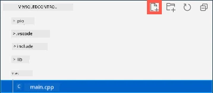

<!--
CO_OP_TRANSLATOR_METADATA:
{
  "original_hash": "d6faf0e8d3c2d6d20c0aef2a305dab18",
  "translation_date": "2025-08-28T03:31:10+00:00",
  "source_file": "1-getting-started/lessons/4-connect-internet/wio-terminal-mqtt.md",
  "language_code": "br"
}
-->
# Controle sua luz noturna pela Internet - Wio Terminal

O dispositivo IoT precisa ser programado para se comunicar com *test.mosquitto.org* usando MQTT para enviar valores de telemetria com a leitura do sensor de luz e receber comandos para controlar o LED.

Nesta parte da lição, você conectará seu Wio Terminal a um broker MQTT.

## Instale as bibliotecas Arduino de WiFi e MQTT

Para se comunicar com o broker MQTT, você precisa instalar algumas bibliotecas Arduino para usar o chip WiFi no Wio Terminal e se comunicar com o MQTT. Ao desenvolver para dispositivos Arduino, você pode usar uma ampla gama de bibliotecas que contêm código de código aberto e implementam uma enorme variedade de funcionalidades. A Seeed publica bibliotecas para o Wio Terminal que permitem a comunicação via WiFi. Outros desenvolvedores publicaram bibliotecas para se comunicar com brokers MQTT, e você usará essas bibliotecas com seu dispositivo.

Essas bibliotecas são fornecidas como código-fonte que pode ser importado automaticamente para o PlatformIO e compilado para o seu dispositivo. Dessa forma, as bibliotecas Arduino funcionarão em qualquer dispositivo que suporte o framework Arduino, desde que o dispositivo tenha o hardware específico necessário para essa biblioteca. Algumas bibliotecas, como as bibliotecas WiFi da Seeed, são específicas para determinados hardwares.

As bibliotecas podem ser instaladas globalmente e compiladas, se necessário, ou em um projeto específico. Para esta tarefa, as bibliotecas serão instaladas no projeto.

✅ Você pode aprender mais sobre gerenciamento de bibliotecas e como encontrar e instalar bibliotecas na [documentação de bibliotecas do PlatformIO](https://docs.platformio.org/en/latest/librarymanager/index.html).

### Tarefa - instale as bibliotecas Arduino de WiFi e MQTT

Instale as bibliotecas Arduino.

1. Abra o projeto da luz noturna no VS Code.

1. Adicione o seguinte ao final do arquivo `platformio.ini`:

    ```ini
    lib_deps =
        seeed-studio/Seeed Arduino rpcWiFi @ 1.0.5
        seeed-studio/Seeed Arduino FS @ 2.1.1
        seeed-studio/Seeed Arduino SFUD @ 2.0.2
        seeed-studio/Seeed Arduino rpcUnified @ 2.1.3
        seeed-studio/Seeed_Arduino_mbedtls @ 3.0.1
    ```

    Isso importa as bibliotecas WiFi da Seeed. A sintaxe `@ <number>` refere-se a uma versão específica da biblioteca.

    > 💁 Você pode remover o `@ <number>` para sempre usar a versão mais recente das bibliotecas, mas não há garantias de que as versões mais recentes funcionarão com o código abaixo. O código aqui foi testado com esta versão das bibliotecas.

    Isso é tudo o que você precisa fazer para adicionar as bibliotecas. Na próxima vez que o PlatformIO compilar o projeto, ele fará o download do código-fonte dessas bibliotecas e o compilará no seu projeto.

1. Adicione o seguinte ao `lib_deps`:

    ```ini
    knolleary/PubSubClient @ 2.8
    ```

    Isso importa o [PubSubClient](https://github.com/knolleary/pubsubclient), um cliente MQTT para Arduino.

## Conecte-se ao WiFi

Agora o Wio Terminal pode ser conectado ao WiFi.

### Tarefa - conectar ao WiFi

Conecte o Wio Terminal ao WiFi.

1. Crie um novo arquivo na pasta `src` chamado `config.h`. Você pode fazer isso selecionando a pasta `src` ou o arquivo `main.cpp` dentro dela e clicando no botão **Novo arquivo** no explorador. Esse botão só aparece quando o cursor está sobre o explorador.

    

1. Adicione o seguinte código a este arquivo para definir constantes para suas credenciais de WiFi:

    ```cpp
    #pragma once

    #include <string>
    
    using namespace std;
    
    // WiFi credentials
    const char *SSID = "<SSID>";
    const char *PASSWORD = "<PASSWORD>";
    ```

    Substitua `<SSID>` pelo SSID do seu WiFi. Substitua `<PASSWORD>` pela senha do seu WiFi.

1. Abra o arquivo `main.cpp`.

1. Adicione as seguintes diretivas `#include` ao topo do arquivo:

    ```cpp
    #include <PubSubClient.h>
    #include <rpcWiFi.h>
    #include <SPI.h>
    
    #include "config.h"
    ```

    Isso inclui os arquivos de cabeçalho das bibliotecas que você adicionou anteriormente, bem como o arquivo de cabeçalho de configuração. Esses arquivos de cabeçalho são necessários para informar ao PlatformIO para incluir o código das bibliotecas. Sem incluir explicitamente esses arquivos de cabeçalho, parte do código não será compilada e você receberá erros de compilação.

1. Adicione o seguinte código acima da função `setup`:

    ```cpp
    void connectWiFi()
    {
        while (WiFi.status() != WL_CONNECTED)
        {
            Serial.println("Connecting to WiFi..");
            WiFi.begin(SSID, PASSWORD);
            delay(500);
        }
    
        Serial.println("Connected!");
    }
    ```

    Este código faz um loop enquanto o dispositivo não está conectado ao WiFi e tenta a conexão usando o SSID e a senha do arquivo de cabeçalho de configuração.

1. Adicione uma chamada para esta função no final da função `setup`, após os pinos terem sido configurados.

    ```cpp
    connectWiFi();
    ```

1. Envie este código para o seu dispositivo para verificar se a conexão WiFi está funcionando. Você deve ver isso no monitor serial.

    ```output
    > Executing task: platformio device monitor <
    
    --- Available filters and text transformations: colorize, debug, default, direct, hexlify, log2file, nocontrol, printable, send_on_enter, time
    --- More details at http://bit.ly/pio-monitor-filters
    --- Miniterm on /dev/cu.usbmodem1101  9600,8,N,1 ---
    --- Quit: Ctrl+C | Menu: Ctrl+T | Help: Ctrl+T followed by Ctrl+H ---
    Connecting to WiFi..
    Connected!
    ```

## Conecte-se ao MQTT

Depois que o Wio Terminal estiver conectado ao WiFi, ele poderá se conectar ao broker MQTT.

### Tarefa - conectar ao MQTT

Conecte-se ao broker MQTT.

1. Adicione o seguinte código ao final do arquivo `config.h` para definir os detalhes de conexão do broker MQTT:

    ```cpp
    // MQTT settings
    const string ID = "<ID>";
    
    const string BROKER = "test.mosquitto.org";
    const string CLIENT_NAME = ID + "nightlight_client";
    ```

    Substitua `<ID>` por um ID único que será usado como o nome deste cliente do dispositivo e, posteriormente, para os tópicos que este dispositivo publicará e assinará. O broker *test.mosquitto.org* é público e usado por muitas pessoas, incluindo outros estudantes que estão realizando esta tarefa. Ter um nome de cliente MQTT único e nomes de tópicos únicos garante que seu código não entre em conflito com o de outras pessoas. Você também precisará deste ID ao criar o código do servidor mais tarde nesta tarefa.

    > 💁 Você pode usar um site como [GUIDGen](https://www.guidgen.com) para gerar um ID único.

    O `BROKER` é o URL do broker MQTT.

    O `CLIENT_NAME` é um nome único para este cliente MQTT no broker.

1. Abra o arquivo `main.cpp` e adicione o seguinte código abaixo da função `connectWiFi` e acima da função `setup`:

    ```cpp
    WiFiClient wioClient;
    PubSubClient client(wioClient);
    ```

    Este código cria um cliente WiFi usando as bibliotecas WiFi do Wio Terminal e o utiliza para criar um cliente MQTT.

1. Abaixo deste código, adicione o seguinte:

    ```cpp
    void reconnectMQTTClient()
    {
        while (!client.connected())
        {
            Serial.print("Attempting MQTT connection...");
    
            if (client.connect(CLIENT_NAME.c_str()))
            {
                Serial.println("connected");
            }
            else
            {
                Serial.print("Retying in 5 seconds - failed, rc=");
                Serial.println(client.state());
                
                delay(5000);
            }
        }
    }
    ```

    Esta função testa a conexão com o broker MQTT e reconecta caso não esteja conectado. Ela faz um loop enquanto não está conectado e tenta conectar usando o nome único do cliente definido no arquivo de cabeçalho de configuração.

    Se a conexão falhar, ela tenta novamente após 5 segundos.

1. Adicione o seguinte código abaixo da função `reconnectMQTTClient`:

    ```cpp
    void createMQTTClient()
    {
        client.setServer(BROKER.c_str(), 1883);
        reconnectMQTTClient();
    }
    ```

    Este código define o broker MQTT para o cliente, bem como configura o callback para quando uma mensagem for recebida. Em seguida, tenta conectar ao broker.

1. Chame a função `createMQTTClient` na função `setup` após a conexão WiFi ser estabelecida.

1. Substitua toda a função `loop` pelo seguinte:

    ```cpp
    void loop()
    {
        reconnectMQTTClient();
        client.loop();
    
        delay(2000);
    }
    ```

    Este código começa reconectando ao broker MQTT. Essas conexões podem ser facilmente interrompidas, então vale a pena verificar regularmente e reconectar, se necessário. Em seguida, chama o método `loop` no cliente MQTT para processar quaisquer mensagens que estejam chegando no tópico assinado. Este aplicativo é single-threaded, então as mensagens não podem ser recebidas em uma thread de fundo; portanto, é necessário alocar tempo na thread principal para processar quaisquer mensagens que estejam aguardando na conexão de rede.

    Por fim, um atraso de 2 segundos garante que os níveis de luz não sejam enviados com muita frequência, reduzindo o consumo de energia do dispositivo.

1. Envie o código para o seu Wio Terminal e use o Monitor Serial para ver o dispositivo conectando-se ao WiFi e ao MQTT.

    ```output
    > Executing task: platformio device monitor <
    
    source /Users/jimbennett/GitHub/IoT-For-Beginners/1-getting-started/lessons/4-connect-internet/code-mqtt/wio-terminal/nightlight/.venv/bin/activate
    --- Available filters and text transformations: colorize, debug, default, direct, hexlify, log2file, nocontrol, printable, send_on_enter, time
    --- More details at http://bit.ly/pio-monitor-filters
    --- Miniterm on /dev/cu.usbmodem1201  9600,8,N,1 ---
    --- Quit: Ctrl+C | Menu: Ctrl+T | Help: Ctrl+T followed by Ctrl+H ---
    Connecting to WiFi..
    Connected!
    Attempting MQTT connection...connected
    ```

> 💁 Você pode encontrar este código na pasta [code-mqtt/wio-terminal](../../../../../1-getting-started/lessons/4-connect-internet/code-mqtt/wio-terminal).

😀 Você conectou com sucesso seu dispositivo a um broker MQTT.

---

**Aviso Legal**:  
Este documento foi traduzido utilizando o serviço de tradução por IA [Co-op Translator](https://github.com/Azure/co-op-translator). Embora nos esforcemos para garantir a precisão, esteja ciente de que traduções automatizadas podem conter erros ou imprecisões. O documento original em seu idioma nativo deve ser considerado a fonte autoritativa. Para informações críticas, recomenda-se a tradução profissional realizada por humanos. Não nos responsabilizamos por quaisquer mal-entendidos ou interpretações equivocadas decorrentes do uso desta tradução.