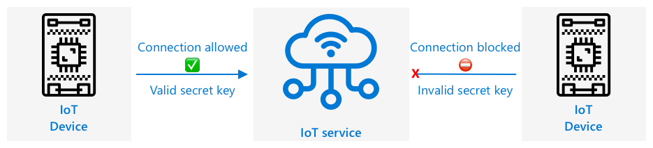

<!--
CO_OP_TRANSLATOR_METADATA:
{
  "original_hash": "4d8e7a066d75b625e7a979c14157041d",
  "translation_date": "2025-08-28T04:04:38+00:00",
  "source_file": "2-farm/lessons/4-migrate-your-plant-to-the-cloud/README.md",
  "language_code": "br"
}
-->
# Migre sua planta para a nuvem


> Ilustração por [Nitya Narasimhan](https://github.com/nitya). Clique na imagem para uma versão maior.

Esta lição foi ensinada como parte da série [IoT para Iniciantes - Agricultura Digital](https://youtube.com/playlist?list=PLmsFUfdnGr3yCutmcVg6eAUEfsGiFXgcx) do [Microsoft Reactor](https://developer.microsoft.com/reactor/?WT.mc_id=academic-17441-jabenn).

[](https://youtu.be/bNxjopXkhvk)

## Questionário pré-aula

[Questionário pré-aula](https://black-meadow-040d15503.1.azurestaticapps.net/quiz/15)

## Introdução

Na última lição, você aprendeu como conectar sua planta a um broker MQTT e controlar um relé a partir de um código de servidor executado localmente. Isso forma o núcleo de um sistema automatizado de irrigação conectado à internet, usado desde plantas individuais em casa até fazendas comerciais.

O dispositivo IoT se comunicou com um broker MQTT público para demonstrar os princípios, mas essa não é a forma mais confiável ou segura. Nesta lição, você aprenderá sobre a nuvem e as capacidades de IoT oferecidas por serviços de nuvem pública. Também aprenderá como migrar sua planta de um broker MQTT público para um desses serviços de nuvem.

Nesta lição, abordaremos:

* [O que é a nuvem?](../../../../../2-farm/lessons/4-migrate-your-plant-to-the-cloud)
* [Criar uma assinatura de nuvem](../../../../../2-farm/lessons/4-migrate-your-plant-to-the-cloud)
* [Serviços de IoT na nuvem](../../../../../2-farm/lessons/4-migrate-your-plant-to-the-cloud)
* [Criar um serviço de IoT na nuvem](../../../../../2-farm/lessons/4-migrate-your-plant-to-the-cloud)
* [Comunicar-se com o IoT Hub](../../../../../2-farm/lessons/4-migrate-your-plant-to-the-cloud)
* [Conectar seu dispositivo ao serviço de IoT](../../../../../2-farm/lessons/4-migrate-your-plant-to-the-cloud)

## O que é a nuvem?

Antes da nuvem, quando uma empresa queria oferecer serviços aos seus funcionários (como bancos de dados ou armazenamento de arquivos) ou ao público (como sites), ela construía e operava um data center. Isso podia variar de uma sala com poucos computadores até um prédio com muitos computadores. A empresa gerenciava tudo, incluindo:

* Compra de computadores
* Manutenção de hardware
* Energia e refrigeração
* Rede
* Segurança, incluindo proteger o prédio e o software nos computadores
* Instalação e atualização de software

Isso podia ser muito caro, exigir uma ampla gama de funcionários qualificados e ser muito lento para mudanças quando necessário. Por exemplo, se uma loja online precisasse se preparar para uma temporada de férias movimentada, teria que planejar meses antes para comprar mais hardware, configurá-lo, instalá-lo e instalar o software para gerenciar as vendas. Após a temporada de férias, com a queda nas vendas, os computadores comprados ficariam ociosos até a próxima temporada movimentada.

✅ Você acha que isso permitiria que as empresas se adaptassem rapidamente? Se uma loja de roupas online ficasse popular de repente porque uma celebridade foi vista usando suas roupas, ela conseguiria aumentar sua capacidade computacional rapidamente para lidar com o aumento repentino de pedidos?

### O computador de outra pessoa

A nuvem é frequentemente chamada de "o computador de outra pessoa" como uma brincadeira. A ideia inicial era simples: em vez de comprar computadores, você aluga o computador de outra pessoa. Essa "outra pessoa", um provedor de computação em nuvem, gerenciaria enormes data centers. Eles seriam responsáveis por comprar e instalar o hardware, gerenciar energia e refrigeração, rede, segurança do prédio, atualizações de hardware e software, tudo. Como cliente, você alugaria os computadores necessários, alugando mais conforme a demanda aumentasse e reduzindo o número alugado se a demanda diminuísse. Esses data centers estão espalhados pelo mundo.


Esses data centers podem ter vários quilômetros quadrados de tamanho. As imagens acima foram tiradas há alguns anos em um data center da nuvem da Microsoft e mostram o tamanho inicial, junto com uma expansão planejada. A área limpa para a expansão tem mais de 5 quilômetros quadrados.

> 💁 Esses data centers exigem quantidades tão grandes de energia que alguns possuem suas próprias usinas. Por causa de seu tamanho e do nível de investimento dos provedores de nuvem, eles geralmente são muito ecológicos. São mais eficientes do que inúmeros pequenos data centers, operam principalmente com energia renovável e os provedores de nuvem trabalham arduamente para reduzir o desperdício, cortar o uso de água e replantar florestas para compensar as áreas desmatadas para construir os data centers. Você pode ler mais sobre como um provedor de nuvem está trabalhando em sustentabilidade no [site de sustentabilidade do Azure](https://azure.microsoft.com/global-infrastructure/sustainability/?WT.mc_id=academic-17441-jabenn).

✅ Faça uma pesquisa: Leia sobre as principais nuvens, como [Azure da Microsoft](https://azure.microsoft.com/?WT.mc_id=academic-17441-jabenn) ou [GCP do Google](https://cloud.google.com). Quantos data centers eles possuem e onde estão localizados no mundo?

Usar a nuvem reduz os custos para as empresas e permite que elas se concentrem no que fazem de melhor, deixando a expertise em computação em nuvem nas mãos do provedor. As empresas não precisam mais alugar ou comprar espaço em data centers, pagar diferentes fornecedores por conectividade e energia ou contratar especialistas. Em vez disso, podem pagar uma única fatura mensal ao provedor de nuvem para cuidar de tudo.

O provedor de nuvem pode então usar economias de escala para reduzir os custos, comprando computadores em grandes quantidades a preços mais baixos, investindo em ferramentas para reduzir o trabalho de manutenção e até projetando e construindo seu próprio hardware para melhorar sua oferta de nuvem.

### Microsoft Azure

Azure é a nuvem para desenvolvedores da Microsoft, e é a nuvem que você usará nestas lições. O vídeo abaixo oferece uma breve visão geral do Azure:

[](https://www.microsoft.com/videoplayer/embed/RE4Ibng?WT.mc_id=academic-17441-jabenn)

## Criar uma assinatura de nuvem

Para usar serviços na nuvem, você precisará se inscrever em uma assinatura com um provedor de nuvem. Para esta lição, você se inscreverá em uma assinatura do Microsoft Azure. Se você já possui uma assinatura do Azure, pode pular esta tarefa. Os detalhes da assinatura descritos aqui estão corretos no momento da escrita, mas podem mudar.

> 💁 Se você estiver acessando estas lições por meio de sua escola, pode já ter uma assinatura do Azure disponível. Verifique com seu professor.

Existem dois tipos diferentes de assinatura gratuita do Azure que você pode se inscrever:

* **Azure para Estudantes** - Esta é uma assinatura projetada para estudantes com 18 anos ou mais. Você não precisa de um cartão de crédito para se inscrever e usa seu endereço de e-mail escolar para validar que é estudante. Ao se inscrever, você recebe US$100 para gastar em recursos de nuvem, além de serviços gratuitos, incluindo uma versão gratuita de um serviço de IoT. Isso dura 12 meses e pode ser renovado a cada ano enquanto você permanecer estudante.

* **Assinatura gratuita do Azure** - Esta é uma assinatura para qualquer pessoa que não seja estudante. Você precisará de um cartão de crédito para se inscrever, mas seu cartão não será cobrado, sendo usado apenas para verificar que você é uma pessoa real, não um robô. Você recebe US$200 de crédito para usar nos primeiros 30 dias em qualquer serviço, além de níveis gratuitos de serviços do Azure. Depois que seu crédito for usado, seu cartão não será cobrado, a menos que você converta para uma assinatura paga conforme o uso.

> 💁 A Microsoft oferece uma assinatura Azure para Estudantes Starter para estudantes menores de 18 anos, mas no momento da escrita isso não suporta serviços de IoT.

### Tarefa - inscreva-se em uma assinatura gratuita de nuvem

Se você é estudante com 18 anos ou mais, pode se inscrever em uma assinatura Azure para Estudantes. Você precisará validar com um endereço de e-mail escolar. Isso pode ser feito de duas maneiras:

* Inscreva-se no pacote de desenvolvedor estudantil do GitHub em [education.github.com/pack](https://education.github.com/pack). Isso dá acesso a uma variedade de ferramentas e ofertas, incluindo GitHub e Microsoft Azure. Depois de se inscrever no pacote de desenvolvedor, você pode ativar a oferta Azure para Estudantes.

* Inscreva-se diretamente em uma conta Azure para Estudantes em [azure.microsoft.com/free/students](https://azure.microsoft.com/free/students/?WT.mc_id=academic-17441-jabenn).

> ⚠️ Se seu endereço de e-mail escolar não for reconhecido, abra uma [issue neste repositório](https://github.com/Microsoft/IoT-For-Beginners/issues) e verificaremos se ele pode ser adicionado à lista de permissões do Azure para Estudantes.

Se você não é estudante ou não possui um endereço de e-mail escolar válido, pode se inscrever em uma assinatura gratuita do Azure.

* Inscreva-se em uma assinatura gratuita do Azure em [azure.microsoft.com/free](https://azure.microsoft.com/free/?WT.mc_id=academic-17441-jabenn)

## Serviços de IoT na nuvem

O broker MQTT público que você tem usado é uma ótima ferramenta para aprendizado, mas possui várias desvantagens como ferramenta para uso comercial:

* Confiabilidade - é um serviço gratuito sem garantias e pode ser desativado a qualquer momento
* Segurança - é público, então qualquer pessoa pode ouvir sua telemetria ou enviar comandos para controlar seu hardware
* Desempenho - foi projetado para apenas algumas mensagens de teste, então não suportaria um grande volume de mensagens sendo enviadas
* Descoberta - não há como saber quais dispositivos estão conectados

Os serviços de IoT na nuvem resolvem esses problemas. Eles são mantidos por grandes provedores de nuvem que investem fortemente em confiabilidade e estão disponíveis para corrigir quaisquer problemas que possam surgir. Eles possuem segurança integrada para impedir que hackers leiam seus dados ou enviem comandos maliciosos. Além disso, são de alto desempenho, capazes de lidar com muitos milhões de mensagens todos os dias, aproveitando a escalabilidade da nuvem conforme necessário.

> 💁 Embora você pague por essas vantagens com uma taxa mensal, a maioria dos provedores de nuvem oferece uma versão gratuita de seus serviços de IoT com um número limitado de mensagens por dia ou dispositivos que podem se conectar. Essa versão gratuita geralmente é mais do que suficiente para um desenvolvedor aprender sobre o serviço. Nesta lição, você usará uma versão gratuita.

Dispositivos IoT se conectam a um serviço de nuvem usando um SDK de dispositivo (uma biblioteca que fornece código para trabalhar com os recursos do serviço) ou diretamente via um protocolo de comunicação como MQTT ou HTTP. O SDK de dispositivo geralmente é a rota mais fácil, pois lida com tudo para você, como saber quais tópicos publicar ou assinar e como gerenciar a segurança.


Seu dispositivo então se comunica com outras partes de sua aplicação por meio desse serviço - semelhante à forma como você enviou telemetria e recebeu comandos via MQTT. Isso geralmente é feito usando um SDK de serviço ou uma biblioteca semelhante. As mensagens vêm do seu dispositivo para o serviço, onde outros componentes da sua aplicação podem lê-las, e mensagens podem ser enviadas de volta ao seu dispositivo.



Esses serviços implementam segurança conhecendo todos os dispositivos que podem se conectar e enviar dados, seja registrando os dispositivos previamente no serviço ou fornecendo aos dispositivos chaves secretas ou certificados que podem usar para se registrar no serviço na primeira vez que se conectarem. Dispositivos desconhecidos não conseguem se conectar; se tentarem, o serviço rejeita a conexão e ignora as mensagens enviadas por eles.

✅ Faça uma pesquisa: Qual é a desvantagem de ter um serviço de IoT aberto onde qualquer dispositivo ou código pode se conectar? Você consegue encontrar exemplos específicos de hackers aproveitando essa situação?

Outros componentes da sua aplicação podem se conectar ao serviço de IoT e aprender sobre todos os dispositivos conectados ou registrados, além de se comunicar diretamente com eles, seja em massa ou individualmente.
💁 Os serviços de IoT também implementam capacidades adicionais, e os provedores de nuvem possuem serviços e aplicativos extras que podem ser conectados ao serviço. Por exemplo, se você quiser armazenar todas as mensagens de telemetria enviadas por todos os dispositivos em um banco de dados, geralmente basta alguns cliques na ferramenta de configuração do provedor de nuvem para conectar o serviço a um banco de dados e transmitir os dados.
## Criar um serviço de IoT na nuvem

Agora que você tem uma assinatura do Azure, pode se inscrever em um serviço de IoT. O serviço de IoT da Microsoft é chamado Azure IoT Hub.


O vídeo abaixo oferece uma breve visão geral do Azure IoT Hub:

[](https://www.youtube.com/watch?v=smuZaZZXKsU)

> 🎥 Clique na imagem acima para assistir ao vídeo

✅ Reserve um momento para fazer uma pesquisa e leia a visão geral do IoT Hub na [documentação do Microsoft IoT Hub](https://docs.microsoft.com/azure/iot-hub/about-iot-hub?WT.mc_id=academic-17441-jabenn).

Os serviços de nuvem disponíveis no Azure podem ser configurados por meio de um portal baseado na web ou por meio de uma interface de linha de comando (CLI). Para esta tarefa, você usará o CLI.

### Tarefa - instalar o Azure CLI

Para usar o Azure CLI, primeiro ele deve ser instalado no seu PC ou Mac.

1. Siga as instruções na [documentação do Azure CLI](https://docs.microsoft.com/cli/azure/install-azure-cli?WT.mc_id=academic-17441-jabenn) para instalar o CLI.

1. O Azure CLI suporta várias extensões que adicionam capacidades para gerenciar uma ampla gama de serviços do Azure. Instale a extensão IoT executando o seguinte comando na sua linha de comando ou terminal:

    ```sh
    az extension add --name azure-iot
    ```

1. Na sua linha de comando ou terminal, execute o seguinte comando para fazer login na sua assinatura do Azure a partir do Azure CLI.

    ```sh
    az login
    ```

    Uma página da web será aberta no seu navegador padrão. Faça login usando a conta que você usou para se inscrever na sua assinatura do Azure. Depois de fazer login, você pode fechar a aba do navegador.

1. Se você tiver várias assinaturas do Azure, como uma fornecida pela escola e sua própria assinatura do Azure para Estudantes, será necessário selecionar a que deseja usar. Execute o seguinte comando para listar todas as assinaturas às quais você tem acesso:

    ```sh
    az account list --output table
    ```

    Na saída, você verá o nome de cada assinatura junto com seu `SubscriptionId`.

    ```output
    ➜  ~ az account list --output table
    Name                    CloudName    SubscriptionId                        State    IsDefault
    ----------------------  -----------  ------------------------------------  -------  -----------
    School-subscription     AzureCloud   cb30cde9-814a-42f0-a111-754cb788e4e1  Enabled  True
    Azure for Students      AzureCloud   fa51c31b-162c-4599-add6-781def2e1fbf  Enabled  False
    ```

    Para selecionar a assinatura que deseja usar, utilize o seguinte comando:

    ```sh
    az account set --subscription <SubscriptionId>
    ```

    Substitua `<SubscriptionId>` pelo Id da assinatura que deseja usar. Após executar este comando, execute novamente o comando para listar suas contas. Você verá que a coluna `IsDefault` estará marcada como `True` para a assinatura que acabou de definir.

### Tarefa - criar um grupo de recursos

Os serviços do Azure, como instâncias do IoT Hub, máquinas virtuais, bancos de dados ou serviços de IA, são chamados de **recursos**. Todo recurso precisa estar dentro de um **Grupo de Recursos**, uma agrupação lógica de um ou mais recursos.

> 💁 Usar grupos de recursos significa que você pode gerenciar vários serviços de uma vez. Por exemplo, depois de concluir todas as lições deste projeto, você pode excluir o grupo de recursos, e todos os recursos nele serão excluídos automaticamente.

1. Existem vários data centers do Azure ao redor do mundo, divididos em regiões. Quando você cria um recurso ou grupo de recursos no Azure, precisa especificar onde deseja que ele seja criado. Execute o seguinte comando para obter a lista de locais:

    ```sh
    az account list-locations --output table
    ```

    Você verá uma lista de locais. Esta lista será longa.

    > 💁 No momento da redação, existem 65 locais onde você pode implantar.

    ```output
        ➜  ~ az account list-locations --output table
    DisplayName               Name                 RegionalDisplayName
    ------------------------  -------------------  -------------------------------------
    East US                   eastus               (US) East US
    East US 2                 eastus2              (US) East US 2
    South Central US          southcentralus       (US) South Central US
    ...
    ```

    Anote o valor da coluna `Name` da região mais próxima de você. Você pode encontrar as regiões em um mapa na [página de geografias do Azure](https://azure.microsoft.com/global-infrastructure/geographies/?WT.mc_id=academic-17441-jabenn).

1. Execute o seguinte comando para criar um grupo de recursos chamado `soil-moisture-sensor`. Os nomes dos grupos de recursos precisam ser exclusivos na sua assinatura.

    ```sh
    az group create --name soil-moisture-sensor \
                    --location <location>
    ```

    Substitua `<location>` pelo local que você selecionou na etapa anterior.

### Tarefa - criar um IoT Hub

Agora você pode criar um recurso IoT Hub no seu grupo de recursos.

1. Use o seguinte comando para criar seu recurso IoT Hub:

    ```sh
    az iot hub create --resource-group soil-moisture-sensor \
                      --sku F1 \
                      --partition-count 2 \
                      --name <hub_name>
    ```

    Substitua `<hub_name>` por um nome para o seu hub. Este nome precisa ser globalmente único - ou seja, nenhum outro IoT Hub criado por qualquer pessoa pode ter o mesmo nome. Este nome é usado em uma URL que aponta para o hub, então precisa ser único. Use algo como `soil-moisture-sensor-` e adicione um identificador único no final, como algumas palavras aleatórias ou seu nome.

    A opção `--sku F1` indica que será usado um nível gratuito. O nível gratuito suporta 8.000 mensagens por dia, juntamente com a maioria dos recursos dos níveis pagos.

    > 🎓 Diferentes níveis de preços dos serviços do Azure são chamados de tiers. Cada tier tem um custo diferente e oferece diferentes recursos ou volumes de dados.

    > 💁 Se você quiser saber mais sobre preços, pode conferir o [guia de preços do Azure IoT Hub](https://azure.microsoft.com/pricing/details/iot-hub/?WT.mc_id=academic-17441-jabenn).

    A opção `--partition-count 2` define quantos fluxos de dados o IoT Hub suporta. Mais partições reduzem o bloqueio de dados quando várias coisas leem e escrevem no IoT Hub. Partições estão fora do escopo destas lições, mas este valor precisa ser definido para criar um IoT Hub de nível gratuito.

    > 💁 Você só pode ter um IoT Hub de nível gratuito por assinatura.

O IoT Hub será criado. Pode levar um minuto ou mais para concluir.

## Comunicar-se com o IoT Hub

Na lição anterior, você usou MQTT e enviou mensagens de ida e volta em diferentes tópicos, com os diferentes tópicos tendo diferentes propósitos. Em vez de enviar mensagens por diferentes tópicos, o IoT Hub tem várias maneiras definidas para o dispositivo se comunicar com o Hub ou para o Hub se comunicar com o dispositivo.

> 💁 Por trás das cenas, essa comunicação entre o IoT Hub e seu dispositivo pode usar MQTT, HTTPS ou AMQP.

* Mensagens de dispositivo para nuvem (D2C) - são mensagens enviadas de um dispositivo para o IoT Hub, como telemetria. Elas podem ser lidas do IoT Hub pelo código do seu aplicativo.

    > 🎓 Por trás das cenas, o IoT Hub usa um serviço do Azure chamado [Event Hubs](https://docs.microsoft.com/azure/event-hubs/?WT.mc_id=academic-17441-jabenn). Quando você escreve código para ler mensagens enviadas ao hub, elas geralmente são chamadas de eventos.

* Mensagens de nuvem para dispositivo (C2D) - são mensagens enviadas do código do aplicativo, via IoT Hub, para um dispositivo IoT.

* Solicitações de método direto - são mensagens enviadas do código do aplicativo via IoT Hub para um dispositivo IoT para solicitar que o dispositivo faça algo, como controlar um atuador. Essas mensagens exigem uma resposta para que o código do aplicativo possa saber se foram processadas com sucesso.

* Gêmeos de dispositivos - são documentos JSON mantidos sincronizados entre o dispositivo e o IoT Hub, usados para armazenar configurações ou outras propriedades relatadas pelo dispositivo ou que devem ser definidas no dispositivo (conhecidas como desejadas) pelo IoT Hub.

O IoT Hub pode armazenar mensagens e solicitações de método direto por um período de tempo configurável (padrão de um dia), então, se um dispositivo ou código de aplicativo perder a conexão, ele ainda poderá recuperar mensagens enviadas enquanto estava offline após reconectar. Os gêmeos de dispositivos são mantidos permanentemente no IoT Hub, então, a qualquer momento, um dispositivo pode se reconectar e obter o gêmeo de dispositivo mais recente.

✅ Faça uma pesquisa: Leia mais sobre esses tipos de mensagens na [orientação de comunicações de dispositivo para nuvem](https://docs.microsoft.com/azure/iot-hub/iot-hub-devguide-d2c-guidance?WT.mc_id=academic-17441-jabenn) e na [orientação de comunicações de nuvem para dispositivo](https://docs.microsoft.com/azure/iot-hub/iot-hub-devguide-c2d-guidance?WT.mc_id=academic-17441-jabenn) na documentação do IoT Hub.

## Conectar seu dispositivo ao serviço de IoT

Depois que o hub for criado, seu dispositivo IoT poderá se conectar a ele. Apenas dispositivos registrados podem se conectar a um serviço, então você precisará registrar seu dispositivo primeiro. Quando você registra, pode obter uma string de conexão que o dispositivo pode usar para se conectar. Essa string de conexão é específica do dispositivo e contém informações sobre o IoT Hub, o dispositivo e uma chave secreta que permitirá que este dispositivo se conecte.

> 🎓 Uma string de conexão é um termo genérico para um texto que contém detalhes de conexão. Elas são usadas ao conectar-se a IoT Hubs, bancos de dados e muitos outros serviços. Geralmente consistem em um identificador para o serviço, como uma URL, e informações de segurança, como uma chave secreta. Elas são passadas para SDKs para conectar-se ao serviço.

> ⚠️ Strings de conexão devem ser mantidas seguras! A segurança será abordada em mais detalhes em uma lição futura.

### Tarefa - registrar seu dispositivo IoT

O dispositivo IoT pode ser registrado no seu IoT Hub usando o Azure CLI.

1. Execute o seguinte comando para registrar um dispositivo:

    ```sh
    az iot hub device-identity create --device-id soil-moisture-sensor \
                                      --hub-name <hub_name>
    ```

    Substitua `<hub_name>` pelo nome que você usou para seu IoT Hub.

    Isso criará um dispositivo com um ID de `soil-moisture-sensor`.

1. Quando seu dispositivo IoT se conectar ao seu IoT Hub usando o SDK, ele precisará usar uma string de conexão que fornece a URL do hub, juntamente com uma chave secreta. Execute o seguinte comando para obter a string de conexão:

    ```sh
    az iot hub device-identity connection-string show --device-id soil-moisture-sensor \
                                                      --output table \
                                                      --hub-name <hub_name>
    ```

    Substitua `<hub_name>` pelo nome que você usou para seu IoT Hub.

1. Armazene a string de conexão exibida na saída, pois você precisará dela mais tarde.

### Tarefa - conectar seu dispositivo IoT à nuvem

Siga o guia relevante para conectar seu dispositivo IoT à nuvem:

* [Arduino - Wio Terminal](wio-terminal-connect-hub.md)
* [Computador de placa única - Raspberry Pi/Dispositivo IoT Virtual](single-board-computer-connect-hub.md)

### Tarefa - monitorar eventos

Por enquanto, você não atualizará o código do servidor. Em vez disso, pode usar o Azure CLI para monitorar eventos do seu dispositivo IoT.

1. Certifique-se de que seu dispositivo IoT está funcionando e enviando valores de telemetria de umidade do solo.

1. Execute o seguinte comando no seu prompt de comando ou terminal para monitorar mensagens enviadas ao seu IoT Hub:

    ```sh
    az iot hub monitor-events --hub-name <hub_name>
    ```

    Substitua `<hub_name>` pelo nome que você usou para seu IoT Hub.

    Você verá mensagens aparecerem na saída do console à medida que são enviadas pelo seu dispositivo IoT.

    ```output
    Starting event monitor, use ctrl-c to stop...
    {
        "event": {
            "origin": "soil-moisture-sensor",
            "module": "",
            "interface": "",
            "component": "",
            "payload": "{\"soil_moisture\": 376}"
        }
    },
    {
        "event": {
            "origin": "soil-moisture-sensor",
            "module": "",
            "interface": "",
            "component": "",
            "payload": "{\"soil_moisture\": 381}"
        }
    }
    ```

    O conteúdo do `payload` corresponderá à mensagem enviada pelo seu dispositivo IoT.

    > No momento da redação, a extensão `az iot` não está funcionando totalmente em dispositivos Apple Silicon. Se você estiver usando um dispositivo Apple Silicon, precisará monitorar as mensagens de outra forma, como usando o [Azure IoT Tools para Visual Studio Code](https://docs.microsoft.com/en-us/azure/iot-hub/iot-hub-vscode-iot-toolkit-cloud-device-messaging).

1. Essas mensagens têm várias propriedades anexadas automaticamente, como o timestamp em que foram enviadas. Essas propriedades são conhecidas como *anotações*. Para visualizar todas as anotações de mensagens, use o seguinte comando:

    ```sh
    az iot hub monitor-events --properties anno --hub-name <hub_name>
    ```

    Substitua `<hub_name>` pelo nome que você usou para seu IoT Hub.

    Você verá mensagens aparecerem na saída do console à medida que são enviadas pelo seu dispositivo IoT.

    ```output
    Starting event monitor, use ctrl-c to stop...
    {
        "event": {
            "origin": "soil-moisture-sensor",
            "module": "",
            "interface": "",
            "component": "",
            "properties": {},
            "annotations": {
                "iothub-connection-device-id": "soil-moisture-sensor",
                "iothub-connection-auth-method": "{\"scope\":\"device\",\"type\":\"sas\",\"issuer\":\"iothub\",\"acceptingIpFilterRule\":null}",
                "iothub-connection-auth-generation-id": "637553997165220462",
                "iothub-enqueuedtime": 1619976150288,
                "iothub-message-source": "Telemetry",
                "x-opt-sequence-number": 1379,
                "x-opt-offset": "550576",
                "x-opt-enqueued-time": 1619976150277
            },
            "payload": "{\"soil_moisture\": 381}"
        }
    }
    ```

    Os valores de tempo nas anotações estão em [tempo UNIX](https://wikipedia.org/wiki/Unix_time), representando o número de segundos desde a meia-noite de 1º de janeiro de 1970.

    Saia do monitor de eventos quando terminar.

### Tarefa - controlar seu dispositivo IoT

Você também pode usar o Azure CLI para chamar métodos diretos no seu dispositivo IoT.

1. Execute o seguinte comando no seu prompt de comando ou terminal para invocar o método `relay_on` no dispositivo IoT:

    ```sh
    az iot hub invoke-device-method --device-id soil-moisture-sensor \
                                    --method-name relay_on \
                                    --method-payload '{}' \
                                    --hub-name <hub_name>
    ```

    Substitua `
<hub_name>
` com o nome que você usou para o seu IoT Hub.

Isso envia uma solicitação de método direto para o método especificado por `method-name`. Métodos diretos podem receber um payload contendo dados para o método, e isso pode ser especificado no parâmetro `method-payload` como JSON.

Você verá o relé ligar e a saída correspondente do seu dispositivo IoT:

```output
    Direct method received -  relay_on
    ```

1. Repita o passo acima, mas defina o `--method-name` como `relay_off`. Você verá o relé desligar e a saída correspondente do dispositivo IoT.

---

## 🚀 Desafio

O nível gratuito do IoT Hub permite 8.000 mensagens por dia. O código que você escreveu envia mensagens de telemetria a cada 10 segundos. Quantas mensagens por dia são enviadas com uma mensagem a cada 10 segundos?

Pense em com que frequência as medições de umidade do solo devem ser enviadas. Como você pode alterar seu código para permanecer dentro do nível gratuito e verificar com a frequência necessária, mas sem exagerar? E se você quisesse adicionar um segundo dispositivo?

## Questionário pós-aula

[Questionário pós-aula](https://black-meadow-040d15503.1.azurestaticapps.net/quiz/16)

## Revisão e Autoestudo

O SDK do IoT Hub é de código aberto tanto para Arduino quanto para Python. Nos repositórios de código no GitHub, há vários exemplos mostrando como trabalhar com diferentes recursos do IoT Hub.

* Se você estiver usando um Wio Terminal, confira os [exemplos de Arduino no GitHub](https://github.com/Azure/azure-iot-pal-arduino/tree/master/pal/samples)
* Se você estiver usando um Raspberry Pi ou dispositivo virtual, confira os [exemplos de Python no GitHub](https://github.com/Azure/azure-iot-sdk-python/tree/master/azure-iot-hub/samples)

## Tarefa

[Aprenda sobre serviços em nuvem](assignment.md)

---

**Aviso Legal**:  
Este documento foi traduzido utilizando o serviço de tradução por IA [Co-op Translator](https://github.com/Azure/co-op-translator). Embora nos esforcemos para garantir a precisão, esteja ciente de que traduções automatizadas podem conter erros ou imprecisões. O documento original em seu idioma nativo deve ser considerado a fonte autoritativa. Para informações críticas, recomenda-se a tradução profissional realizada por humanos. Não nos responsabilizamos por quaisquer mal-entendidos ou interpretações equivocadas decorrentes do uso desta tradução.