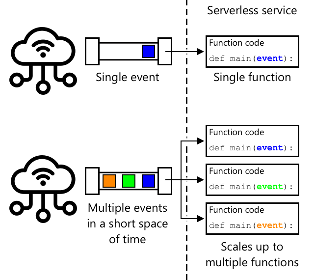

<!--
CO_OP_TRANSLATOR_METADATA:
{
  "original_hash": "5f2d2f4a5a023c93ab34a0cc5b47c0c4",
  "translation_date": "2025-08-28T03:57:44+00:00",
  "source_file": "2-farm/lessons/5-migrate-application-to-the-cloud/README.md",
  "language_code": "br"
}
-->
# Migre a lógica da sua aplicação para a nuvem


> Ilustração por [Nitya Narasimhan](https://github.com/nitya). Clique na imagem para uma versão maior.

Esta lição foi ensinada como parte da série [IoT para Iniciantes - Projeto 2: Agricultura Digital](https://youtube.com/playlist?list=PLmsFUfdnGr3yCutmcVg6eAUEfsGiFXgcx) do [Microsoft Reactor](https://developer.microsoft.com/reactor/?WT.mc_id=academic-17441-jabenn).

[](https://youtu.be/VVZDcs5u1_I)

## Questionário pré-aula

[Questionário pré-aula](https://black-meadow-040d15503.1.azurestaticapps.net/quiz/17)

## Introdução

Na última lição, você aprendeu como conectar o monitoramento de umidade do solo da planta e o controle de relé a um serviço de IoT baseado na nuvem. O próximo passo é mover o código do servidor que controla o tempo do relé para a nuvem. Nesta lição, você aprenderá como fazer isso usando funções serverless.

Nesta lição, abordaremos:

* [O que é serverless?](../../../../../2-farm/lessons/5-migrate-application-to-the-cloud)
* [Crie uma aplicação serverless](../../../../../2-farm/lessons/5-migrate-application-to-the-cloud)
* [Crie um gatilho de evento do IoT Hub](../../../../../2-farm/lessons/5-migrate-application-to-the-cloud)
* [Envie solicitações de método direto a partir de código serverless](../../../../../2-farm/lessons/5-migrate-application-to-the-cloud)
* [Implante seu código serverless na nuvem](../../../../../2-farm/lessons/5-migrate-application-to-the-cloud)

## O que é serverless?

Serverless, ou computação sem servidor, envolve criar pequenos blocos de código que são executados na nuvem em resposta a diferentes tipos de eventos. Quando o evento ocorre, seu código é executado e recebe dados sobre o evento. Esses eventos podem vir de várias fontes, incluindo requisições web, mensagens colocadas em uma fila, alterações em dados de um banco de dados ou mensagens enviadas a um serviço de IoT por dispositivos IoT.


> 💁 Se você já usou gatilhos de banco de dados antes, pode pensar nisso como algo semelhante: código sendo acionado por um evento, como a inserção de uma linha.



Seu código só é executado quando o evento ocorre, não há nada mantendo seu código ativo em outros momentos. O evento acontece, seu código é carregado e executado. Isso torna o serverless muito escalável - se muitos eventos ocorrerem ao mesmo tempo, o provedor de nuvem pode executar sua função quantas vezes forem necessárias simultaneamente, utilizando os servidores disponíveis. A desvantagem disso é que, se você precisar compartilhar informações entre eventos, será necessário armazená-las em algum lugar, como um banco de dados, em vez de mantê-las na memória.

Seu código é escrito como uma função que recebe detalhes sobre o evento como parâmetro. Você pode usar uma ampla gama de linguagens de programação para escrever essas funções serverless.

> 🎓 Serverless também é conhecido como Functions as a Service (FaaS), já que cada gatilho de evento é implementado como uma função no código.

Apesar do nome, serverless realmente utiliza servidores. O nome se refere ao fato de que, como desenvolvedor, você não precisa se preocupar com os servidores necessários para executar seu código; tudo o que importa é que seu código seja executado em resposta a um evento. O provedor de nuvem possui um *runtime* serverless que gerencia a alocação de servidores, rede, armazenamento, CPU, memória e tudo mais necessário para executar seu código. Nesse modelo, você não paga por servidor, mas sim pelo tempo em que seu código está sendo executado e pela quantidade de memória utilizada.

> 💰 Serverless é uma das formas mais econômicas de executar código na nuvem. Por exemplo, no momento da escrita, um provedor de nuvem permite que todas as suas funções serverless sejam executadas um total combinado de 1.000.000 vezes por mês antes de começar a cobrar, e depois disso cobra US$0,20 por cada 1.000.000 execuções. Quando seu código não está sendo executado, você não paga.

Como desenvolvedor de IoT, o modelo serverless é ideal. Você pode escrever uma função que é chamada em resposta a mensagens enviadas por qualquer dispositivo IoT conectado ao seu serviço de IoT hospedado na nuvem. Seu código lidará com todas as mensagens enviadas, mas só será executado quando necessário.

✅ Relembre o código que você escreveu como servidor ouvindo mensagens via MQTT. Como isso poderia ser executado na nuvem usando serverless? Como você acha que o código precisaria ser alterado para suportar computação serverless?

> 💁 O modelo serverless está se expandindo para outros serviços de nuvem além da execução de código. Por exemplo, bancos de dados serverless estão disponíveis na nuvem usando um modelo de preços serverless, onde você paga por cada solicitação feita ao banco de dados, como uma consulta ou inserção, geralmente com preços baseados na quantidade de trabalho necessário para atender à solicitação. Por exemplo, uma única seleção de uma linha com base em uma chave primária custará menos do que uma operação complexa que junta várias tabelas e retorna milhares de linhas.

## Crie uma aplicação serverless

O serviço de computação serverless da Microsoft é chamado Azure Functions.


O vídeo curto abaixo oferece uma visão geral do Azure Functions.

[](https://www.youtube.com/watch?v=8-jz5f_JyEQ)

> 🎥 Clique na imagem acima para assistir ao vídeo.

✅ Reserve um momento para pesquisar e ler a visão geral do Azure Functions na [documentação do Microsoft Azure Functions](https://docs.microsoft.com/azure/azure-functions/functions-overview?WT.mc_id=academic-17441-jabenn).

Para escrever Azure Functions, você começa com um aplicativo de funções na linguagem de sua escolha. O Azure Functions suporta, por padrão, Python, JavaScript, TypeScript, C#, F#, Java e Powershell. Nesta lição, você aprenderá como escrever um aplicativo de funções em Python.

> 💁 O Azure Functions também suporta manipuladores personalizados, permitindo que você escreva suas funções em qualquer linguagem que suporte requisições HTTP, incluindo linguagens mais antigas como COBOL.

Os aplicativos de funções consistem em um ou mais *gatilhos* - funções que respondem a eventos. Você pode ter vários gatilhos dentro de um único aplicativo de funções, todos compartilhando uma configuração comum. Por exemplo, no arquivo de configuração do seu aplicativo de funções, você pode ter os detalhes de conexão do seu IoT Hub, e todas as funções no aplicativo podem usar isso para se conectar e ouvir eventos.

### Tarefa - instale as ferramentas do Azure Functions

> No momento da escrita, as ferramentas de código do Azure Functions não estão totalmente funcionais em Macs com Apple Silicon para projetos em Python. Você precisará usar um Mac baseado em Intel, PC com Windows ou PC com Linux.

Uma ótima funcionalidade do Azure Functions é que você pode executá-lo localmente. O mesmo runtime usado na nuvem pode ser executado no seu computador, permitindo que você escreva código que responde a mensagens de IoT e o execute localmente. Você pode até depurar seu código enquanto os eventos são tratados. Quando estiver satisfeito com seu código, ele pode ser implantado na nuvem.

As ferramentas do Azure Functions estão disponíveis como uma CLI, conhecida como Azure Functions Core Tools.

1. Instale as ferramentas principais do Azure Functions seguindo as instruções na [documentação do Azure Functions Core Tools](https://docs.microsoft.com/azure/azure-functions/functions-run-local?WT.mc_id=academic-17441-jabenn).

1. Instale a extensão do Azure Functions para o VS Code. Esta extensão oferece suporte para criar, depurar e implantar funções do Azure. Consulte a [documentação da extensão do Azure Functions](https://marketplace.visualstudio.com/items?WT.mc_id=academic-17441-jabenn&itemName=ms-azuretools.vscode-azurefunctions) para instruções sobre como instalar esta extensão no VS Code.

Quando você implanta seu aplicativo de funções do Azure na nuvem, ele precisa usar uma pequena quantidade de armazenamento na nuvem para armazenar coisas como os arquivos do aplicativo e arquivos de log. Quando você executa seu aplicativo de funções localmente, ainda precisa se conectar ao armazenamento na nuvem, mas em vez de usar armazenamento real na nuvem, você pode usar um emulador de armazenamento chamado [Azurite](https://github.com/Azure/Azurite). Ele é executado localmente, mas age como armazenamento na nuvem.

> 🎓 No Azure, o armazenamento que o Azure Functions usa é uma Conta de Armazenamento do Azure. Essas contas podem armazenar arquivos, blobs, dados em tabelas ou dados em filas. Você pode compartilhar uma conta de armazenamento entre vários aplicativos, como um aplicativo de funções e um aplicativo web.

1. O Azurite é um aplicativo Node.js, então você precisará instalar o Node.js. Você pode encontrar as instruções de download e instalação no [site do Node.js](https://nodejs.org/). Se estiver usando um Mac, também pode instalá-lo pelo [Homebrew](https://formulae.brew.sh/formula/node).

1. Instale o Azurite usando o seguinte comando (`npm` é uma ferramenta instalada junto com o Node.js):

    ```sh
    npm install -g azurite
    ```

1. Crie uma pasta chamada `azurite` para o Azurite usar para armazenar dados:

    ```sh
    mkdir azurite
    ```

1. Execute o Azurite, passando esta nova pasta:

    ```sh
    azurite --location azurite
    ```

    O emulador de armazenamento Azurite será iniciado e estará pronto para o runtime local do Functions se conectar.

    ```output
    ➜  ~ azurite --location azurite  
    Azurite Blob service is starting at http://127.0.0.1:10000
    Azurite Blob service is successfully listening at http://127.0.0.1:10000
    Azurite Queue service is starting at http://127.0.0.1:10001
    Azurite Queue service is successfully listening at http://127.0.0.1:10001
    Azurite Table service is starting at http://127.0.0.1:10002
    Azurite Table service is successfully listening at http://127.0.0.1:10002
    ```

### Tarefa - crie um projeto Azure Functions

A CLI do Azure Functions pode ser usada para criar um novo aplicativo de funções.

1. Crie uma pasta para seu aplicativo de funções e navegue até ela. Chame-a de `soil-moisture-trigger`.

    ```sh
    mkdir soil-moisture-trigger
    cd soil-moisture-trigger
    ```

1. Crie um ambiente virtual Python dentro desta pasta:

    ```sh
    python3 -m venv .venv
    ```

1. Ative o ambiente virtual:

    * No Windows:
        * Se estiver usando o Prompt de Comando ou o Prompt de Comando pelo Windows Terminal, execute:

            ```cmd
            .venv\Scripts\activate.bat
            ```

        * Se estiver usando o PowerShell, execute:

            ```powershell
            .\.venv\Scripts\Activate.ps1
            ```

    * No macOS ou Linux, execute:

        ```cmd
        source ./.venv/bin/activate
        ```

    > 💁 Esses comandos devem ser executados do mesmo local onde você executou o comando para criar o ambiente virtual. Você nunca precisará navegar para dentro da pasta `.venv`; sempre execute o comando de ativação e quaisquer comandos para instalar pacotes ou executar código a partir da pasta onde você estava ao criar o ambiente virtual.

1. Execute o seguinte comando para criar um aplicativo de funções nesta pasta:

    ```sh
    func init --worker-runtime python soil-moisture-trigger
    ```

    Isso criará três arquivos dentro da pasta atual:

    * `host.json` - este documento JSON contém configurações para seu aplicativo de funções. Você não precisará modificar essas configurações.
    * `local.settings.json` - este documento JSON contém configurações que seu aplicativo usaria ao ser executado localmente, como strings de conexão para seu IoT Hub. Essas configurações são apenas locais e não devem ser adicionadas ao controle de código-fonte. Quando você implantar o aplicativo na nuvem, essas configurações não serão implantadas; em vez disso, suas configurações serão carregadas a partir das configurações do aplicativo. Isso será abordado mais tarde nesta lição.
    * `requirements.txt` - este é um [arquivo de requisitos do Pip](https://pip.pypa.io/en/stable/user_guide/#requirements-files) que contém os pacotes Pip necessários para executar seu aplicativo de funções.

1. O arquivo `local.settings.json` possui uma configuração para a conta de armazenamento que o aplicativo de funções usará. Por padrão, esta configuração está vazia e precisa ser definida. Para se conectar ao emulador de armazenamento local Azurite, defina este valor como:

    ```json
    "AzureWebJobsStorage": "UseDevelopmentStorage=true",
    ```

1. Instale os pacotes Pip necessários usando o arquivo de requisitos:

    ```sh
    pip install -r requirements.txt
    ```

    > 💁 Os pacotes Pip necessários precisam estar neste arquivo, para que, quando o aplicativo de funções for implantado na nuvem, o runtime possa garantir que os pacotes corretos sejam instalados.

1. Para testar se tudo está funcionando corretamente, você pode iniciar o runtime de funções. Execute o seguinte comando para fazer isso:

    ```sh
    func start
    ```

    Você verá o runtime iniciar e informar que não encontrou nenhuma função de trabalho (gatilhos).

    ```output
    (.venv) ➜  soil-moisture-trigger func start
    Found Python version 3.9.1 (python3).
    
    Azure Functions Core Tools
    Core Tools Version:       3.0.3442 Commit hash: 6bfab24b2743f8421475d996402c398d2fe4a9e0  (64-bit)
    Function Runtime Version: 3.0.15417.0
    
    [2021-05-05T01:24:46.795Z] No job functions found.
    ```
> ⚠️ Se você receber uma notificação de firewall, conceda acesso, pois o aplicativo `func` precisa ser capaz de ler e escrever na sua rede.
> ⚠️ Se você estiver usando macOS, pode haver avisos na saída:
>
> ```output
    > (.venv) ➜  soil-moisture-trigger func start
    > Found Python version 3.9.1 (python3).
    >
    > Azure Functions Core Tools
    > Core Tools Version:       3.0.3442 Commit hash: 6bfab24b2743f8421475d996402c398d2fe4a9e0  (64-bit)
    > Function Runtime Version: 3.0.15417.0
    >
    > [2021-06-16T08:18:28.315Z] Cannot create directory for shared memory usage: /dev/shm/AzureFunctions
    > [2021-06-16T08:18:28.316Z] System.IO.FileSystem: Access to the path '/dev/shm/AzureFunctions' is denied. Operation not permitted.
    > [2021-06-16T08:18:30.361Z] No job functions found.
    > ```
>
> Você pode ignorá-los, desde que o aplicativo Functions inicie corretamente e liste as funções em execução. Conforme mencionado [nesta pergunta no Microsoft Docs Q&A](https://docs.microsoft.com/answers/questions/396617/azure-functions-core-tools-error-osx-devshmazurefu.html?WT.mc_id=academic-17441-jabenn), isso pode ser ignorado.

1. Pare o aplicativo Functions pressionando `ctrl+c`.

1. Abra a pasta atual no VS Code, seja abrindo o VS Code e depois esta pasta, ou executando o seguinte comando:

    ```sh
    code .
    ```

    O VS Code detectará seu projeto Functions e exibirá uma notificação dizendo:

    ```output
    Detected an Azure Functions Project in folder "soil-moisture-trigger" that may have been created outside of
    VS Code. Initialize for optimal use with VS Code?
    ```

    

    Selecione **Sim** nesta notificação.

1. Certifique-se de que o ambiente virtual do Python está em execução no terminal do VS Code. Finalize e reinicie, se necessário.

## Criar um gatilho de evento do IoT Hub

O aplicativo Functions é a estrutura do seu código serverless. Para responder a eventos do IoT Hub, você pode adicionar um gatilho do IoT Hub a este aplicativo. Esse gatilho precisa se conectar ao fluxo de mensagens enviadas ao IoT Hub e responder a elas. Para obter esse fluxo de mensagens, seu gatilho precisa se conectar ao *endpoint compatível com Event Hub* do IoT Hub.

O IoT Hub é baseado em outro serviço do Azure chamado Azure Event Hubs. O Event Hubs é um serviço que permite enviar e receber mensagens, e o IoT Hub estende isso para adicionar recursos para dispositivos IoT. A forma de se conectar para ler mensagens do IoT Hub é a mesma que seria usada com o Event Hubs.

✅ Faça uma pesquisa: Leia a visão geral do Event Hubs na [documentação do Azure Event Hubs](https://docs.microsoft.com/azure/event-hubs/event-hubs-about?WT.mc_id=academic-17441-jabenn). Como os recursos básicos se comparam ao IoT Hub?

Para que um dispositivo IoT se conecte ao IoT Hub, ele precisa usar uma chave secreta que garante que apenas dispositivos autorizados possam se conectar. O mesmo se aplica ao conectar-se para ler mensagens; seu código precisará de uma string de conexão que contenha uma chave secreta, juntamente com os detalhes do IoT Hub.

> 💁 A string de conexão padrão que você obtém tem permissões de **iothubowner**, o que dá a qualquer código que a utilize permissões completas no IoT Hub. Idealmente, você deve se conectar com o menor nível de permissões necessário. Isso será abordado na próxima lição.

Depois que seu gatilho estiver conectado, o código dentro da função será chamado para cada mensagem enviada ao IoT Hub, independentemente de qual dispositivo a enviou. O gatilho passará a mensagem como um parâmetro.

### Tarefa - obter a string de conexão do endpoint compatível com Event Hub

1. No terminal do VS Code, execute o seguinte comando para obter a string de conexão para o endpoint compatível com Event Hub do IoT Hub:

    ```sh
    az iot hub connection-string show --default-eventhub \
                                      --output table \
                                      --hub-name <hub_name>
    ```

    Substitua `<hub_name>` pelo nome que você usou para o IoT Hub.

1. No VS Code, abra o arquivo `local.settings.json`. Adicione o seguinte valor adicional dentro da seção `Values`:

    ```json
    "IOT_HUB_CONNECTION_STRING": "<connection string>"
    ```

    Substitua `<connection string>` pelo valor obtido na etapa anterior. Você precisará adicionar uma vírgula após a linha acima para que seja um JSON válido.

### Tarefa - criar um gatilho de evento

Agora você está pronto para criar o gatilho de evento.

1. No terminal do VS Code, execute o seguinte comando dentro da pasta `soil-moisture-trigger`:

    ```sh
    func new --name iot-hub-trigger --template "Azure Event Hub trigger"
    ```

    Isso cria uma nova Function chamada `iot-hub-trigger`. O gatilho se conectará ao endpoint compatível com Event Hub no IoT Hub, permitindo que você use um gatilho de Event Hub. Não há um gatilho específico para IoT Hub.

Isso criará uma pasta dentro da pasta `soil-moisture-trigger` chamada `iot-hub-trigger`, que conterá esta função. Esta pasta terá os seguintes arquivos:

* `__init__.py` - este é o arquivo de código Python que contém o gatilho, usando a convenção padrão de nomes de arquivos Python para transformar esta pasta em um módulo Python.

    Este arquivo conterá o seguinte código:

    ```python
    import logging

    import azure.functions as func


    def main(event: func.EventHubEvent):
        logging.info('Python EventHub trigger processed an event: %s',
                    event.get_body().decode('utf-8'))
    ```

    O núcleo do gatilho é a função `main`. É esta função que é chamada com os eventos do IoT Hub. Esta função tem um parâmetro chamado `event` que contém um `EventHubEvent`. Sempre que uma mensagem é enviada ao IoT Hub, esta função é chamada passando essa mensagem como o `event`, juntamente com propriedades que são as mesmas das anotações que você viu na última lição.

    O núcleo desta função registra o evento.

* `function.json` - este arquivo contém a configuração do gatilho. A configuração principal está em uma seção chamada `bindings`. Um binding é o termo para uma conexão entre o Azure Functions e outros serviços do Azure. Esta função tem um binding de entrada para um Event Hub - ela se conecta a um Event Hub e recebe dados.

    > 💁 Você também pode ter bindings de saída para que a saída de uma função seja enviada para outro serviço. Por exemplo, você poderia adicionar um binding de saída para um banco de dados e retornar o evento do IoT Hub da função, e ele seria automaticamente inserido no banco de dados.

    ✅ Faça uma pesquisa: Leia sobre bindings na [documentação de conceitos de gatilhos e bindings do Azure Functions](https://docs.microsoft.com/azure/azure-functions/functions-triggers-bindings?WT.mc_id=academic-17441-jabenn&tabs=python).

    A seção `bindings` inclui a configuração para o binding. Os valores de interesse são:

  * `"type": "eventHubTrigger"` - isso informa à função que ela precisa ouvir eventos de um Event Hub
  * `"name": "events"` - este é o nome do parâmetro a ser usado para os eventos do Event Hub. Isso corresponde ao nome do parâmetro na função `main` no código Python.
  * `"direction": "in"` - este é um binding de entrada, os dados do Event Hub entram na função
  * `"connection": ""` - isso define o nome da configuração para ler a string de conexão. Ao executar localmente, isso lerá esta configuração do arquivo `local.settings.json`.

    > 💁 A string de conexão não pode ser armazenada no arquivo `function.json`, ela deve ser lida das configurações. Isso é para evitar que você exponha acidentalmente sua string de conexão.

1. Devido a [um bug no template do Azure Functions](https://github.com/Azure/azure-functions-templates/issues/1250), o arquivo `function.json` tem um valor incorreto para o campo `cardinality`. Atualize este campo de `many` para `one`:

    ```json
    "cardinality": "one",
    ```

1. Atualize o valor de `"connection"` no arquivo `function.json` para apontar para o novo valor que você adicionou ao arquivo `local.settings.json`:

    ```json
    "connection": "IOT_HUB_CONNECTION_STRING",
    ```

    > 💁 Lembre-se - isso precisa apontar para a configuração, não conter a string de conexão real.

1. A string de conexão contém o valor `eventHubName`, então o valor para isso no arquivo `function.json` precisa ser limpo. Atualize este valor para uma string vazia:

    ```json
    "eventHubName": "",
    ```

### Tarefa - executar o gatilho de evento

1. Certifique-se de que você não está executando o monitor de eventos do IoT Hub. Se isso estiver em execução ao mesmo tempo que o aplicativo Functions, o aplicativo Functions não conseguirá se conectar e consumir eventos.

    > 💁 Vários aplicativos podem se conectar aos endpoints do IoT Hub usando diferentes *grupos de consumidores*. Isso será abordado em uma lição posterior.

1. Para executar o aplicativo Functions, execute o seguinte comando no terminal do VS Code:

    ```sh
    func start
    ```

    O aplicativo Functions será iniciado e descobrirá a função `iot-hub-trigger`. Ele processará quaisquer eventos que já tenham sido enviados ao IoT Hub no último dia.

    ```output
    (.venv) ➜  soil-moisture-trigger func start
    Found Python version 3.9.1 (python3).
    
    Azure Functions Core Tools
    Core Tools Version:       3.0.3442 Commit hash: 6bfab24b2743f8421475d996402c398d2fe4a9e0  (64-bit)
    Function Runtime Version: 3.0.15417.0
    
    Functions:
    
            iot-hub-trigger: eventHubTrigger
    
    For detailed output, run func with --verbose flag.
    [2021-05-05T02:44:07.517Z] Worker process started and initialized.
    [2021-05-05T02:44:09.202Z] Executing 'Functions.iot-hub-trigger' (Reason='(null)', Id=802803a5-eae9-4401-a1f4-176631456ce4)
    [2021-05-05T02:44:09.205Z] Trigger Details: PartitionId: 0, Offset: 1011240-1011632, EnqueueTimeUtc: 2021-05-04T19:04:04.2030000Z-2021-05-04T19:04:04.3900000Z, SequenceNumber: 2546-2547, Count: 2
    [2021-05-05T02:44:09.352Z] Python EventHub trigger processed an event: {"soil_moisture":628}
    [2021-05-05T02:44:09.354Z] Python EventHub trigger processed an event: {"soil_moisture":624}
    [2021-05-05T02:44:09.395Z] Executed 'Functions.iot-hub-trigger' (Succeeded, Id=802803a5-eae9-4401-a1f4-176631456ce4, Duration=245ms)
    ```

    Cada chamada para a função será cercada por um bloco `Executing 'Functions.iot-hub-trigger'`/`Executed 'Functions.iot-hub-trigger'` na saída, para que você possa ver quantas mensagens foram processadas em cada chamada de função.

1. Certifique-se de que seu dispositivo IoT está em execução. Você verá novas mensagens de umidade do solo aparecendo no aplicativo Functions.

1. Pare e reinicie o aplicativo Functions. Você verá que ele não processará mensagens anteriores novamente, apenas processará novas mensagens.

> 💁 O VS Code também suporta depuração de suas Functions. Você pode definir pontos de interrupção clicando na borda ao lado do início de cada linha de código, colocando o cursor em uma linha de código e selecionando *Executar -> Alternar ponto de interrupção*, ou pressionando `F9`. Você pode iniciar o depurador selecionando *Executar -> Iniciar depuração*, pressionando `F5`, ou selecionando o painel *Executar e depurar* e clicando no botão **Iniciar depuração**. Fazendo isso, você pode ver os detalhes dos eventos sendo processados.

#### Solução de problemas

* Se você receber o seguinte erro:

    ```output
    The listener for function 'Functions.iot-hub-trigger' was unable to start. Microsoft.WindowsAzure.Storage: Connection refused. System.Net.Http: Connection refused. System.Private.CoreLib: Connection refused.
    ```

    Verifique se o Azurite está em execução e se você configurou o `AzureWebJobsStorage` no arquivo `local.settings.json` como `UseDevelopmentStorage=true`.

* Se você receber o seguinte erro:

    ```output
    System.Private.CoreLib: Exception while executing function: Functions.iot-hub-trigger. System.Private.CoreLib: Result: Failure Exception: AttributeError: 'list' object has no attribute 'get_body'
    ```

    Verifique se você configurou o `cardinality` no arquivo `function.json` como `one`.

* Se você receber o seguinte erro:

    ```output
    Azure.Messaging.EventHubs: The path to an Event Hub may be specified as part of the connection string or as a separate value, but not both.  Please verify that your connection string does not have the `EntityPath` token if you are passing an explicit Event Hub name. (Parameter 'connectionString').
    ```

    Verifique se você configurou o `eventHubName` no arquivo `function.json` como uma string vazia.

## Enviar solicitações de método direto a partir de código serverless

Até agora, seu aplicativo Functions está ouvindo mensagens do IoT Hub usando o endpoint compatível com Event Hub. Agora você precisa enviar comandos para o dispositivo IoT. Isso é feito usando uma conexão diferente com o IoT Hub via *Registry Manager*. O Registry Manager é uma ferramenta que permite ver quais dispositivos estão registrados no IoT Hub e se comunicar com esses dispositivos enviando mensagens de nuvem para dispositivo, solicitações de método direto ou atualizando o device twin. Você também pode usá-lo para registrar, atualizar ou excluir dispositivos IoT do IoT Hub.

Para se conectar ao Registry Manager, você precisa de uma string de conexão.

### Tarefa - obter a string de conexão do Registry Manager

1. Para obter a string de conexão, execute o seguinte comando:

    ```sh
    az iot hub connection-string show --policy-name service \
                                      --output table \
                                      --hub-name <hub_name>
    ```

    Substitua `<hub_name>` pelo nome que você usou para o IoT Hub.

    A string de conexão é solicitada para a política *ServiceConnect* usando o parâmetro `--policy-name service`. Quando você solicita uma string de conexão, pode especificar quais permissões essa string permitirá. A política ServiceConnect permite que seu código se conecte e envie mensagens para dispositivos IoT.

    ✅ Faça uma pesquisa: Leia sobre as diferentes políticas na [documentação de permissões do IoT Hub](https://docs.microsoft.com/azure/iot-hub/iot-hub-devguide-security#iot-hub-permissions?WT.mc_id=academic-17441-jabenn)

1. No VS Code, abra o arquivo `local.settings.json`. Adicione o seguinte valor adicional dentro da seção `Values`:

    ```json
    "REGISTRY_MANAGER_CONNECTION_STRING": "<connection string>"
    ```

    Substitua `<connection string>` pelo valor obtido na etapa anterior. Você precisará adicionar uma vírgula após a linha acima para que seja um JSON válido.

### Tarefa - enviar uma solicitação de método direto para um dispositivo

1. O SDK para o Registry Manager está disponível via um pacote Pip. Adicione a seguinte linha ao arquivo `requirements.txt` para adicionar a dependência deste pacote:

    ```sh
    azure-iot-hub
    ```

1. Certifique-se de que o terminal do VS Code tenha o ambiente virtual ativado e execute o seguinte comando para instalar os pacotes Pip:

    ```sh
    pip install -r requirements.txt
    ```

1. Adicione as seguintes importações ao arquivo `__init__.py`:

    ```python
    import json
    import os
    from azure.iot.hub import IoTHubRegistryManager
    from azure.iot.hub.models import CloudToDeviceMethod
    ```

    Isso importa algumas bibliotecas do sistema, bem como as bibliotecas para interagir com o Registry Manager e enviar solicitações de método direto.

1. Remova o código de dentro do método `main`, mas mantenha o método em si.

1. No método `main`, adicione o seguinte código:

    ```python
    body = json.loads(event.get_body().decode('utf-8'))
    device_id = event.iothub_metadata['connection-device-id']

    logging.info(f'Received message: {body} from {device_id}')
    ```

    Este código extrai o corpo do evento, que contém a mensagem JSON enviada pelo dispositivo IoT.

    Em seguida, ele obtém o ID do dispositivo das anotações passadas com a mensagem. O corpo do evento contém a mensagem enviada como telemetria, e o dicionário `iothub_metadata` contém propriedades definidas pelo IoT Hub, como o ID do dispositivo do remetente e o horário em que a mensagem foi enviada.

    Essas informações são então registradas. Você verá este registro no terminal ao executar o aplicativo Function localmente.

1. Abaixo disso, adicione o seguinte código:

    ```python
    soil_moisture = body['soil_moisture']

    if soil_moisture > 450:
        direct_method = CloudToDeviceMethod(method_name='relay_on', payload='{}')
    else:
        direct_method = CloudToDeviceMethod(method_name='relay_off', payload='{}')
    ```

    Este código obtém a umidade do solo da mensagem. Em seguida, verifica a umidade do solo e, dependendo do valor, cria uma classe auxiliar para a solicitação de método direto para o método `relay_on` ou `relay_off`. A solicitação do método não precisa de um payload, então um documento JSON vazio é enviado.

1. Abaixo disso, adicione o seguinte código:

    ```python
    logging.info(f'Sending direct method request for {direct_method.method_name} for device {device_id}')

    registry_manager_connection_string = os.environ['REGISTRY_MANAGER_CONNECTION_STRING']
    registry_manager = IoTHubRegistryManager(registry_manager_connection_string)
    ```
Este código carrega a `REGISTRY_MANAGER_CONNECTION_STRING` do arquivo `local.settings.json`. Os valores neste arquivo são disponibilizados como variáveis de ambiente, e podem ser lidos usando a função `os.environ`, que retorna um dicionário com todas as variáveis de ambiente.

> 💁 Quando este código é implantado na nuvem, os valores no arquivo `local.settings.json` serão configurados como *Application Settings*, e podem ser lidos a partir das variáveis de ambiente.

O código então cria uma instância da classe auxiliar Registry Manager usando a string de conexão.

1. Abaixo disso, adicione o seguinte código:

    ```python
    registry_manager.invoke_device_method(device_id, direct_method)

    logging.info('Direct method request sent!')
    ```

    Este código instrui o registry manager a enviar a solicitação de método direto para o dispositivo que enviou a telemetria.

    > 💁 Nas versões do aplicativo que você criou em lições anteriores usando MQTT, os comandos de controle do relé eram enviados para todos os dispositivos. O código assumia que você teria apenas um dispositivo. Esta versão do código envia a solicitação de método para um único dispositivo, funcionando corretamente caso você tenha múltiplas configurações de sensores de umidade e relés, enviando a solicitação de método direto para o dispositivo correto.

1. Execute o aplicativo Functions e certifique-se de que seu dispositivo IoT está enviando dados. Você verá as mensagens sendo processadas e as solicitações de método direto sendo enviadas. Mova o sensor de umidade do solo para dentro e fora do solo para ver os valores mudarem e o relé ligar e desligar.

> 💁 Você pode encontrar este código na pasta [code/functions](../../../../../2-farm/lessons/5-migrate-application-to-the-cloud/code/functions).

## Implante seu código serverless na nuvem

Seu código está funcionando localmente, então o próximo passo é implantar o aplicativo Functions na nuvem.

### Tarefa - criar os recursos na nuvem

Seu aplicativo Functions precisa ser implantado em um recurso Functions App no Azure, dentro do Resource Group que você criou para seu IoT Hub. Você também precisará criar uma Storage Account no Azure para substituir o emulador que está rodando localmente.

1. Execute o seguinte comando para criar uma Storage Account:

    ```sh
    az storage account create --resource-group soil-moisture-sensor \
                              --sku Standard_LRS \
                              --name <storage_name> 
    ```

    Substitua `<storage_name>` por um nome para sua Storage Account. Este nome precisa ser globalmente único, pois faz parte da URL usada para acessar a Storage Account. Você pode usar apenas letras minúsculas e números para este nome, sem outros caracteres, e ele é limitado a 24 caracteres. Use algo como `sms` e adicione um identificador único no final, como algumas palavras aleatórias ou seu nome.

    A opção `--sku Standard_LRS` seleciona o nível de preço, escolhendo a conta geral de menor custo. Não há uma camada gratuita de armazenamento, e você paga pelo que usar. Os custos são relativamente baixos, com o armazenamento mais caro custando menos de US$0,05 por mês por gigabyte armazenado.

    ✅ Leia mais sobre preços na [página de preços do Azure Storage Account](https://azure.microsoft.com/pricing/details/storage/?WT.mc_id=academic-17441-jabenn)

1. Execute o seguinte comando para criar um Function App:

    ```sh
    az functionapp create --resource-group soil-moisture-sensor \
                          --runtime python \
                          --functions-version 3 \
                          --os-type Linux \
                          --consumption-plan-location <location> \
                          --storage-account <storage_name> \
                          --name <functions_app_name>
    ```

    Substitua `<location>` pela localização que você usou ao criar o Resource Group na lição anterior.

    Substitua `<storage_name>` pelo nome da Storage Account que você criou na etapa anterior.

    Substitua `<functions_app_name>` por um nome único para seu Function App. Este nome precisa ser globalmente único, pois faz parte de uma URL que pode ser usada para acessar o Function App. Use algo como `soil-moisture-sensor-` e adicione um identificador único no final, como algumas palavras aleatórias ou seu nome.

    A opção `--functions-version 3` define a versão do Azure Functions a ser usada. A versão 3 é a mais recente.

    A opção `--os-type Linux` informa ao runtime do Functions para usar Linux como sistema operacional para hospedar essas funções. Functions podem ser hospedados em Linux ou Windows, dependendo da linguagem de programação usada. Aplicativos Python são suportados apenas em Linux.

### Tarefa - carregar suas configurações de aplicativo

Quando você desenvolveu seu Function App, armazenou algumas configurações no arquivo `local.settings.json` para as strings de conexão do seu IoT Hub. Estas precisam ser escritas como Application Settings no Function App no Azure para que possam ser usadas pelo seu código.

> 🎓 O arquivo `local.settings.json` é apenas para configurações de desenvolvimento local e não deve ser incluído no controle de versão, como o GitHub. Quando implantado na nuvem, Application Settings são usados. Application Settings são pares de chave/valor hospedados na nuvem e são lidos a partir de variáveis de ambiente, seja no seu código ou pelo runtime ao conectar seu código ao IoT Hub.

1. Execute o seguinte comando para definir a configuração `IOT_HUB_CONNECTION_STRING` nas Application Settings do Function App:

    ```sh
    az functionapp config appsettings set --resource-group soil-moisture-sensor \
                                          --name <functions_app_name> \
                                          --settings "IOT_HUB_CONNECTION_STRING=<connection string>"
    ```

    Substitua `<functions_app_name>` pelo nome que você usou para seu Function App.

    Substitua `<connection string>` pelo valor de `IOT_HUB_CONNECTION_STRING` do seu arquivo `local.settings.json`.

1. Repita o passo acima, mas defina o valor de `REGISTRY_MANAGER_CONNECTION_STRING` para o valor correspondente do seu arquivo `local.settings.json`.

Quando você executar esses comandos, eles também exibirão uma lista de todas as Application Settings do Function App. Você pode usar isso para verificar se seus valores estão configurados corretamente.

> 💁 Você verá um valor já configurado para `AzureWebJobsStorage`. No seu arquivo `local.settings.json`, isso foi configurado para usar o emulador de armazenamento local. Quando você criou o Function App, passou a Storage Account como um parâmetro, e isso foi configurado automaticamente nesta configuração.

### Tarefa - implantar seu Function App na nuvem

Agora que o Function App está pronto, seu código pode ser implantado.

1. Execute o seguinte comando no terminal do VS Code para publicar seu Function App:

    ```sh
    func azure functionapp publish <functions_app_name>
    ```

    Substitua `<functions_app_name>` pelo nome que você usou para seu Function App.

O código será empacotado e enviado para o Function App, onde será implantado e iniciado. Haverá uma grande quantidade de saída no console, terminando com a confirmação da implantação e uma lista das funções implantadas. Neste caso, a lista conterá apenas o trigger.

```output
Deployment successful.
Remote build succeeded!
Syncing triggers...
Functions in soil-moisture-sensor:
    iot-hub-trigger - [eventHubTrigger]
```

Certifique-se de que seu dispositivo IoT está funcionando. Altere os níveis de umidade ajustando a umidade do solo ou movendo o sensor para dentro e fora do solo. Você verá o relé ligar e desligar conforme a umidade do solo muda.

---

## 🚀 Desafio

Na lição anterior, você gerenciou o tempo do relé ao cancelar a inscrição de mensagens MQTT enquanto o relé estava ligado e por um curto período após ser desligado. Você não pode usar este método aqui - não é possível cancelar a inscrição do seu trigger do IoT Hub.

Pense em diferentes maneiras de lidar com isso no seu Function App.

## Questionário pós-aula

[Questionário pós-aula](https://black-meadow-040d15503.1.azurestaticapps.net/quiz/18)

## Revisão e Autoestudo

* Leia sobre computação serverless na [página de computação serverless na Wikipedia](https://wikipedia.org/wiki/Serverless_computing)
* Leia sobre o uso de serverless no Azure, incluindo mais exemplos, no [post do blog do Azure sobre serverless para suas necessidades de IoT](https://azure.microsoft.com/blog/go-serverless-for-your-iot-needs/?WT.mc_id=academic-17441-jabenn)
* Aprenda mais sobre Azure Functions no [canal do YouTube do Azure Functions](https://www.youtube.com/c/AzureFunctions)

## Tarefa

[Adicionar controle manual do relé](assignment.md)

---

**Aviso Legal**:  
Este documento foi traduzido utilizando o serviço de tradução por IA [Co-op Translator](https://github.com/Azure/co-op-translator). Embora nos esforcemos para garantir a precisão, esteja ciente de que traduções automatizadas podem conter erros ou imprecisões. O documento original em seu idioma nativo deve ser considerado a fonte autoritativa. Para informações críticas, recomenda-se a tradução profissional realizada por humanos. Não nos responsabilizamos por quaisquer mal-entendidos ou interpretações equivocadas decorrentes do uso desta tradução.