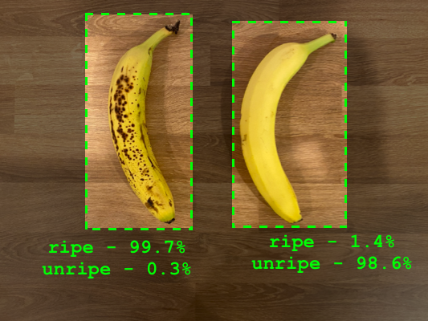
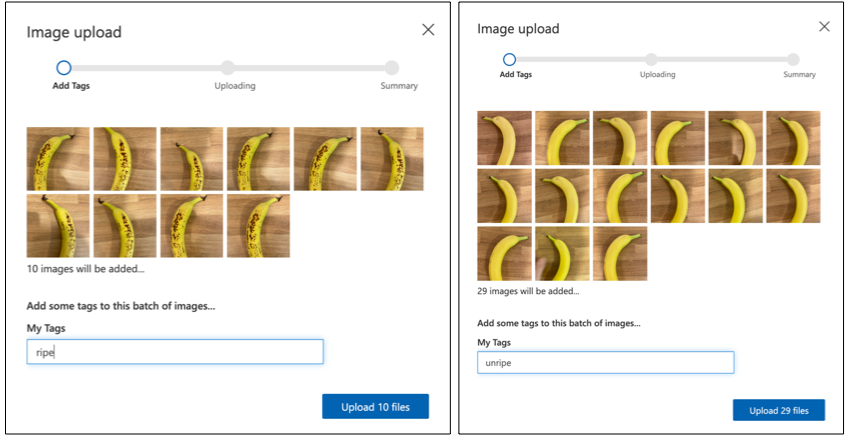

<!--
CO_OP_TRANSLATOR_METADATA:
{
  "original_hash": "f5e63c916d2dd97d58be12aaf76bd9f1",
  "translation_date": "2025-08-28T02:36:24+00:00",
  "source_file": "4-manufacturing/lessons/1-train-fruit-detector/README.md",
  "language_code": "br"
}
-->
# Treine um detector de qualidade de frutas


> Ilustração por [Nitya Narasimhan](https://github.com/nitya). Clique na imagem para uma versão maior.

Este vídeo oferece uma visão geral do serviço Azure Custom Vision, que será abordado nesta lição.

[](https://www.youtube.com/watch?v=TETcDLJlWR4)

> 🎥 Clique na imagem acima para assistir ao vídeo

## Questionário pré-aula

[Questionário pré-aula](https://black-meadow-040d15503.1.azurestaticapps.net/quiz/29)

## Introdução

O recente avanço da Inteligência Artificial (IA) e do Machine Learning (ML) está proporcionando uma ampla gama de capacidades para os desenvolvedores de hoje. Modelos de ML podem ser treinados para reconhecer diferentes elementos em imagens, incluindo frutas não maduras, e isso pode ser usado em dispositivos IoT para ajudar a classificar produtos, seja durante a colheita ou no processamento em fábricas ou armazéns.

Nesta lição, você aprenderá sobre classificação de imagens - usando modelos de ML para distinguir entre imagens de diferentes objetos. Você aprenderá como treinar um classificador de imagens para diferenciar entre frutas boas e ruins, sejam elas verdes, maduras demais, machucadas ou podres.

Nesta lição, abordaremos:

* [Usando IA e ML para classificar alimentos](../../../../../4-manufacturing/lessons/1-train-fruit-detector)
* [Classificação de imagens via Machine Learning](../../../../../4-manufacturing/lessons/1-train-fruit-detector)
* [Treinar um classificador de imagens](../../../../../4-manufacturing/lessons/1-train-fruit-detector)
* [Testar seu classificador de imagens](../../../../../4-manufacturing/lessons/1-train-fruit-detector)
* [Re-treinar seu classificador de imagens](../../../../../4-manufacturing/lessons/1-train-fruit-detector)

## Usando IA e ML para classificar alimentos

Alimentar a população global é um desafio, especialmente a um preço que torne os alimentos acessíveis para todos. Um dos maiores custos é a mão de obra, então os agricultores estão cada vez mais recorrendo à automação e ferramentas como IoT para reduzir esses custos. A colheita manual é trabalhosa (e muitas vezes exaustiva), e está sendo substituída por máquinas, especialmente em países mais ricos. Apesar da economia no custo de usar máquinas para colher, há uma desvantagem - a capacidade de classificar os alimentos durante a colheita.

Nem todas as culturas amadurecem de forma uniforme. Tomates, por exemplo, podem ainda ter alguns frutos verdes no pé quando a maioria já está pronta para a colheita. Embora seja um desperdício colher esses frutos verdes, é mais barato e fácil para o agricultor colher tudo de uma vez com máquinas e descartar os produtos não maduros posteriormente.

✅ Observe diferentes frutas ou vegetais, seja crescendo em fazendas ou no seu jardim, ou em lojas. Eles estão todos no mesmo estágio de maturação ou você percebe variações?

O surgimento da colheita automatizada transferiu a classificação dos produtos da colheita para a fábrica. Os alimentos viajavam em longas esteiras transportadoras com equipes de pessoas selecionando os produtos e removendo qualquer coisa que não atendesse ao padrão de qualidade exigido. A colheita ficou mais barata graças às máquinas, mas ainda havia um custo para classificar os alimentos manualmente.


A próxima evolução foi o uso de máquinas para classificar, seja integradas à colheitadeira ou nas plantas de processamento. A primeira geração dessas máquinas usava sensores ópticos para detectar cores, controlando atuadores para empurrar tomates verdes para uma lixeira usando alavancas ou jatos de ar, deixando os tomates vermelhos continuarem em uma rede de esteiras transportadoras.

Neste vídeo, à medida que os tomates caem de uma esteira para outra, os tomates verdes são detectados e jogados em uma lixeira usando alavancas.

✅ Quais condições seriam necessárias em uma fábrica ou no campo para que esses sensores ópticos funcionassem corretamente?

As evoluções mais recentes dessas máquinas de classificação aproveitam a IA e o ML, usando modelos treinados para distinguir produtos bons de ruins, não apenas por diferenças óbvias de cor, como tomates verdes versus vermelhos, mas por diferenças mais sutis na aparência que podem indicar doenças ou machucados.

## Classificação de imagens via Machine Learning

A programação tradicional é onde você pega dados, aplica um algoritmo a esses dados e obtém um resultado. Por exemplo, no último projeto, você usou coordenadas de GPS e uma geofence, aplicou um algoritmo fornecido pelo Azure Maps e obteve um resultado indicando se o ponto estava dentro ou fora da geofence. Você insere mais dados e obtém mais resultados.


O aprendizado de máquina inverte esse processo - você começa com dados e saídas conhecidas, e o algoritmo de aprendizado de máquina aprende com os dados. Você pode então usar esse algoritmo treinado, chamado de *modelo de aprendizado de máquina* ou *modelo*, para inserir novos dados e obter novas saídas.

> 🎓 O processo de um algoritmo de aprendizado de máquina aprender com os dados é chamado de *treinamento*. As entradas e saídas conhecidas são chamadas de *dados de treinamento*.

Por exemplo, você poderia fornecer a um modelo milhões de fotos de bananas verdes como dados de entrada de treinamento, com a saída de treinamento definida como `verde`, e milhões de fotos de bananas maduras como dados de treinamento com a saída definida como `madura`. O algoritmo de ML então criará um modelo com base nesses dados. Você pode então fornecer a esse modelo uma nova foto de uma banana, e ele preverá se a nova foto é de uma banana madura ou verde.

> 🎓 Os resultados dos modelos de ML são chamados de *previsões*.



Os modelos de ML não fornecem uma resposta binária; em vez disso, eles fornecem probabilidades. Por exemplo, um modelo pode receber uma foto de uma banana e prever `madura` com 99,7% e `verde` com 0,3%. Seu código então escolheria a melhor previsão e decidiria que a banana está madura.

O modelo de ML usado para detectar imagens como essa é chamado de *classificador de imagens* - ele recebe imagens rotuladas e classifica novas imagens com base nesses rótulos.

> 💁 Isso é uma simplificação, e existem muitas outras maneiras de treinar modelos que nem sempre precisam de saídas rotuladas, como o aprendizado não supervisionado. Se você quiser aprender mais sobre ML, confira [ML para iniciantes, um currículo de 24 lições sobre Machine Learning](https://aka.ms/ML-beginners).

## Treinar um classificador de imagens

Para treinar com sucesso um classificador de imagens, você precisa de milhões de imagens. No entanto, uma vez que você tenha um classificador de imagens treinado em milhões ou bilhões de imagens variadas, é possível reutilizá-lo e re-treiná-lo com um pequeno conjunto de imagens para obter ótimos resultados, usando um processo chamado *transfer learning*.

> 🎓 Transfer learning é quando você transfere o aprendizado de um modelo de ML existente para um novo modelo com base em novos dados.

Uma vez que um classificador de imagens foi treinado para uma ampla variedade de imagens, seus componentes internos são ótimos para reconhecer formas, cores e padrões. O transfer learning permite que o modelo use o que já aprendeu para reconhecer partes de imagens e aplique isso ao reconhecimento de novas imagens.


Você pode pensar nisso como os livros de formas para crianças, onde, uma vez que você reconhece um semicírculo, um retângulo e um triângulo, pode reconhecer um barco à vela ou um gato, dependendo da configuração dessas formas. O classificador de imagens pode reconhecer as formas, e o transfer learning ensina quais combinações formam um barco ou um gato - ou uma banana madura.

Existem várias ferramentas que podem ajudá-lo a fazer isso, incluindo serviços baseados em nuvem que permitem treinar seu modelo e usá-lo por meio de APIs web.

> 💁 Treinar esses modelos exige muito poder computacional, geralmente por meio de Unidades de Processamento Gráfico (GPUs). O mesmo hardware especializado que faz os jogos no seu Xbox parecerem incríveis também pode ser usado para treinar modelos de aprendizado de máquina. Ao usar a nuvem, você pode alugar tempo em computadores poderosos com GPUs para treinar esses modelos, obtendo acesso ao poder computacional necessário apenas pelo tempo que precisar.

## Custom Vision

O Custom Vision é uma ferramenta baseada na nuvem para treinar classificadores de imagens. Ele permite treinar um classificador usando apenas um pequeno número de imagens. Você pode fazer upload de imagens por meio de um portal web, API ou SDK, atribuindo a cada imagem uma *tag* que classifica essa imagem. Depois, você treina o modelo e o testa para ver como ele se sai. Quando estiver satisfeito com o modelo, pode publicar versões dele que podem ser acessadas por meio de uma API web ou SDK.


> 💁 Você pode treinar um modelo Custom Vision com apenas 5 imagens por classificação, mas mais imagens geram melhores resultados. Resultados mais precisos podem ser obtidos com pelo menos 30 imagens.

O Custom Vision faz parte de uma gama de ferramentas de IA da Microsoft chamadas Cognitive Services. Essas ferramentas de IA podem ser usadas sem nenhum treinamento ou com uma pequena quantidade de treinamento. Elas incluem reconhecimento e tradução de fala, compreensão de linguagem e análise de imagens. Estão disponíveis com um nível gratuito como serviços no Azure.

> 💁 O nível gratuito é mais do que suficiente para criar um modelo, treiná-lo e usá-lo para desenvolvimento. Você pode ler sobre os limites do nível gratuito na [página de Limites e Cotas do Custom Vision na documentação da Microsoft](https://docs.microsoft.com/azure/cognitive-services/custom-vision-service/limits-and-quotas?WT.mc_id=academic-17441-jabenn).

### Tarefa - criar um recurso de serviços cognitivos

Para usar o Custom Vision, primeiro você precisa criar dois recursos de serviços cognitivos no Azure usando o Azure CLI, um para treinamento e outro para previsão.

1. Crie um Grupo de Recursos para este projeto chamado `fruit-quality-detector`.

1. Use o seguinte comando para criar um recurso gratuito de treinamento do Custom Vision:

    ```sh
    az cognitiveservices account create --name fruit-quality-detector-training \
                                        --resource-group fruit-quality-detector \
                                        --kind CustomVision.Training \
                                        --sku F0 \
                                        --yes \
                                        --location <location>
    ```

    Substitua `<location>` pela localização usada ao criar o Grupo de Recursos.

    Isso criará um recurso de treinamento do Custom Vision no seu Grupo de Recursos. Ele será chamado `fruit-quality-detector-training` e usará o SKU `F0`, que é o nível gratuito. A opção `--yes` significa que você concorda com os termos e condições dos serviços cognitivos.

> 💁 Use o SKU `S0` se você já tiver uma conta gratuita usando qualquer um dos Serviços Cognitivos.

1. Use o seguinte comando para criar um recurso gratuito de previsão do Custom Vision:

    ```sh
    az cognitiveservices account create --name fruit-quality-detector-prediction \
                                        --resource-group fruit-quality-detector \
                                        --kind CustomVision.Prediction \
                                        --sku F0 \
                                        --yes \
                                        --location <location>
    ```

    Substitua `<location>` pela localização usada ao criar o Grupo de Recursos.

    Isso criará um recurso de previsão do Custom Vision no seu Grupo de Recursos. Ele será chamado `fruit-quality-detector-prediction` e usará o SKU `F0`, que é o nível gratuito. A opção `--yes` significa que você concorda com os termos e condições dos serviços cognitivos.

### Tarefa - criar um projeto de classificador de imagens

1. Acesse o portal do Custom Vision em [CustomVision.ai](https://customvision.ai) e faça login com a conta Microsoft usada para seu Azure.

1. Siga a [seção de criação de um novo projeto no guia de início rápido para criar um classificador na documentação da Microsoft](https://docs.microsoft.com/azure/cognitive-services/custom-vision-service/getting-started-build-a-classifier?WT.mc_id=academic-17441-jabenn#create-a-new-project) para criar um novo projeto no Custom Vision. A interface pode mudar, e esses documentos são sempre a referência mais atualizada.

    Nomeie seu projeto como `fruit-quality-detector`.

    Ao criar seu projeto, certifique-se de usar o recurso `fruit-quality-detector-training` criado anteriormente. Use o tipo de projeto *Classificação*, o tipo de classificação *Multiclasse* e o domínio *Alimentos*.

    

✅ Reserve um tempo para explorar a interface do Custom Vision para seu classificador de imagens.

### Tarefa - treinar seu projeto de classificador de imagens

Para treinar um classificador de imagens, você precisará de várias fotos de frutas, tanto de boa quanto de má qualidade, para rotular como boas e ruins, como uma banana madura e uma madura demais.
💁 Esses classificadores podem classificar imagens de qualquer coisa, então, se você não tiver frutas de diferentes qualidades à disposição, pode usar dois tipos diferentes de frutas, ou gatos e cachorros!
Idealmente, cada foto deve mostrar apenas a fruta, com um fundo consistente ou uma ampla variedade de fundos. Certifique-se de que não haja nada no fundo que seja específico para frutas maduras ou verdes.

> 💁 É importante não ter fundos específicos ou itens que não estejam relacionados ao objeto sendo classificado para cada etiqueta. Caso contrário, o classificador pode acabar classificando com base no fundo. Houve um classificador de câncer de pele que foi treinado com imagens de pintas normais e cancerígenas, e as pintas cancerígenas sempre tinham réguas ao lado para medir o tamanho. Descobriu-se que o classificador era quase 100% preciso em identificar réguas nas imagens, e não pintas cancerígenas.

Classificadores de imagem operam em resoluções muito baixas. Por exemplo, o Custom Vision pode usar imagens de treinamento e previsão de até 10240x10240, mas treina e executa o modelo em imagens de 227x227. Imagens maiores são reduzidas para esse tamanho, então certifique-se de que o objeto que você está classificando ocupe uma grande parte da imagem. Caso contrário, ele pode ficar pequeno demais na imagem reduzida usada pelo classificador.

1. Reúna fotos para o seu classificador. Você precisará de pelo menos 5 fotos para cada etiqueta para treinar o classificador, mas quanto mais, melhor. Também será necessário algumas imagens adicionais para testar o classificador. Essas imagens devem ser diferentes, mas do mesmo objeto. Por exemplo:

    * Usando 2 bananas maduras, tire algumas fotos de cada uma de diferentes ângulos, tirando pelo menos 7 fotos (5 para treinar, 2 para testar), mas idealmente mais.

        

    * Repita o mesmo processo usando 2 bananas verdes.

    Você deve ter pelo menos 10 imagens de treinamento, com pelo menos 5 maduras e 5 verdes, e 4 imagens de teste, 2 maduras e 2 verdes. Suas imagens devem ser em formato png ou jpeg, com tamanho menor que 6MB. Se você as criar com um iPhone, por exemplo, elas podem ser imagens HEIC de alta resolução, então será necessário convertê-las e possivelmente reduzi-las. Quanto mais imagens, melhor, e você deve ter um número semelhante de maduras e verdes.

    Se você não tiver frutas maduras e verdes, pode usar frutas diferentes ou quaisquer dois objetos disponíveis. Também é possível encontrar algumas imagens de exemplo na pasta [images](../../../../../4-manufacturing/lessons/1-train-fruit-detector/images) de bananas maduras e verdes que você pode usar.

1. Siga a seção [fazer upload e marcar imagens do guia rápido para criar um classificador nos documentos da Microsoft](https://docs.microsoft.com/azure/cognitive-services/custom-vision-service/getting-started-build-a-classifier?WT.mc_id=academic-17441-jabenn#upload-and-tag-images) para fazer upload das suas imagens de treinamento. Marque as frutas maduras como `ripe` e as frutas verdes como `unripe`.

    

1. Siga a seção [treinar o classificador do guia rápido para criar um classificador nos documentos da Microsoft](https://docs.microsoft.com/azure/cognitive-services/custom-vision-service/getting-started-build-a-classifier?WT.mc_id=academic-17441-jabenn#train-the-classifier) para treinar o classificador de imagens com suas imagens enviadas.

    Você terá a opção de tipo de treinamento. Selecione **Treinamento Rápido**.

O classificador será treinado. O processo levará alguns minutos para ser concluído.

> 🍌 Se você decidir comer sua fruta enquanto o classificador está sendo treinado, certifique-se de ter imagens suficientes para testar antes!

## Teste seu classificador de imagens

Depois que o classificador estiver treinado, você pode testá-lo fornecendo uma nova imagem para classificar.

### Tarefa - teste seu classificador de imagens

1. Siga a seção [testar seu modelo nos documentos da Microsoft](https://docs.microsoft.com/azure/cognitive-services/custom-vision-service/test-your-model?WT.mc_id=academic-17441-jabenn#test-your-model) para testar seu classificador de imagens. Use as imagens de teste que você criou anteriormente, e não as imagens usadas para treinamento.

    

1. Teste todas as imagens de teste que você tiver e observe as probabilidades.

## Re-treine seu classificador de imagens

Quando você testar seu classificador, ele pode não fornecer os resultados esperados. Classificadores de imagem usam aprendizado de máquina para fazer previsões sobre o que está em uma imagem, com base em probabilidades de que determinadas características da imagem correspondam a uma etiqueta específica. Ele não entende o que está na imagem - não sabe o que é uma banana ou o que faz uma banana ser uma banana em vez de um barco. Você pode melhorar seu classificador re-treinando-o com imagens que ele classifica incorretamente.

Cada vez que você faz uma previsão usando a opção de teste rápido, a imagem e os resultados são armazenados. Você pode usar essas imagens para re-treinar seu modelo.

### Tarefa - re-treine seu classificador de imagens

1. Siga a seção [usar a imagem prevista para treinamento nos documentos da Microsoft](https://docs.microsoft.com/azure/cognitive-services/custom-vision-service/test-your-model?WT.mc_id=academic-17441-jabenn#use-the-predicted-image-for-training) para re-treinar seu modelo, usando a etiqueta correta para cada imagem.

1. Depois que seu modelo for re-treinado, teste com novas imagens.

---

## 🚀 Desafio

O que você acha que aconteceria se você usasse uma foto de um morango com um modelo treinado em bananas, ou uma foto de uma banana inflável, ou uma pessoa vestida com uma fantasia de banana, ou até mesmo um personagem amarelo de desenho animado como alguém dos Simpsons?

Experimente e veja quais são as previsões. Você pode encontrar imagens para testar usando [Busca de Imagens do Bing](https://www.bing.com/images/trending).

## Quiz pós-aula

[Quiz pós-aula](https://black-meadow-040d15503.1.azurestaticapps.net/quiz/30)

## Revisão e Autoestudo

* Quando você treinou seu classificador, deve ter visto valores para *Precisão*, *Recall* e *AP* que avaliam o modelo criado. Leia sobre o que esses valores significam na seção [avaliar o classificador do guia rápido para criar um classificador nos documentos da Microsoft](https://docs.microsoft.com/azure/cognitive-services/custom-vision-service/getting-started-build-a-classifier?WT.mc_id=academic-17441-jabenn#evaluate-the-classifier)
* Leia sobre como melhorar seu classificador na seção [como melhorar seu modelo Custom Vision nos documentos da Microsoft](https://docs.microsoft.com/azure/cognitive-services/custom-vision-service/getting-started-improving-your-classifier?WT.mc_id=academic-17441-jabenn)

## Tarefa

[Treine seu classificador para múltiplas frutas e vegetais](assignment.md)

---

**Aviso Legal**:  
Este documento foi traduzido utilizando o serviço de tradução por IA [Co-op Translator](https://github.com/Azure/co-op-translator). Embora nos esforcemos para garantir a precisão, esteja ciente de que traduções automatizadas podem conter erros ou imprecisões. O documento original em seu idioma nativo deve ser considerado a fonte autoritativa. Para informações críticas, recomenda-se a tradução profissional realizada por humanos. Não nos responsabilizamos por quaisquer mal-entendidos ou interpretações equivocadas decorrentes do uso desta tradução.