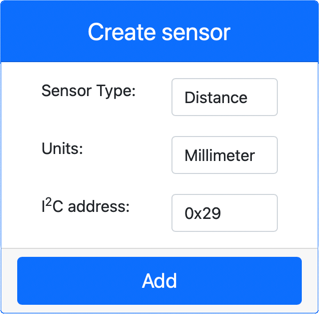

<!--
CO_OP_TRANSLATOR_METADATA:
{
  "original_hash": "7e9f05bdc50a40fd924b1d66934471bf",
  "translation_date": "2025-08-28T02:42:00+00:00",
  "source_file": "4-manufacturing/lessons/4-trigger-fruit-detector/virtual-device-proximity.md",
  "language_code": "br"
}
-->
# Detectar proximidade - Hardware IoT Virtual

Nesta parte da lição, você adicionará um sensor de proximidade ao seu dispositivo IoT virtual e lerá a distância dele.

## Hardware

O dispositivo IoT virtual usará um sensor de distância simulado.

Em um dispositivo IoT físico, você utilizaria um sensor com um módulo de medição a laser para detectar a distância.

### Adicionar o sensor de distância ao CounterFit

Para usar um sensor de distância virtual, você precisa adicionar um ao aplicativo CounterFit.

#### Tarefa - adicionar o sensor de distância ao CounterFit

Adicione o sensor de distância ao aplicativo CounterFit.

1. Abra o código `fruit-quality-detector` no VS Code e certifique-se de que o ambiente virtual está ativado.

1. Instale um pacote adicional do Pip para instalar um shim do CounterFit que pode se comunicar com sensores de distância simulando o pacote [rpi-vl53l0x Pip](https://pypi.org/project/rpi-vl53l0x/), um pacote Python que interage com [um sensor de distância VL53L0X baseado em tempo de voo](https://wiki.seeedstudio.com/Grove-Time_of_Flight_Distance_Sensor-VL53L0X/). Certifique-se de instalar isso a partir de um terminal com o ambiente virtual ativado.

    ```sh
    pip install counterfit-shims-rpi-vl53l0x
    ```

1. Certifique-se de que o aplicativo web CounterFit está em execução.

1. Crie um sensor de distância:

    1. Na caixa *Create sensor* no painel *Sensors*, abra o menu suspenso *Sensor type* e selecione *Distance*.

    1. Deixe as *Units* como `Millimeter`.

    1. Este sensor é um sensor I²C, então defina o endereço como `0x29`. Se você usasse um sensor físico VL53L0X, ele seria codificado para este endereço.

    1. Selecione o botão **Add** para criar o sensor de distância.

    

    O sensor de distância será criado e aparecerá na lista de sensores.

    

## Programar o sensor de distância

O dispositivo IoT virtual agora pode ser programado para usar o sensor de distância simulado.

### Tarefa - programar o sensor de tempo de voo

1. Crie um novo arquivo no projeto `fruit-quality-detector` chamado `distance-sensor.py`.

    > 💁 Uma maneira fácil de simular vários dispositivos IoT é fazer cada um em um arquivo Python diferente e executá-los ao mesmo tempo.

1. Inicie uma conexão com o CounterFit com o seguinte código:

    ```python
    from counterfit_connection import CounterFitConnection
    CounterFitConnection.init('127.0.0.1', 5000)
    ```

1. Adicione o seguinte código abaixo disso:

    ```python
    import time
    
    from counterfit_shims_rpi_vl53l0x.vl53l0x import VL53L0X
    ```

    Isso importa a biblioteca shim do sensor para o sensor de tempo de voo VL53L0X.

1. Abaixo disso, adicione o seguinte código para acessar o sensor:

    ```python
    distance_sensor = VL53L0X()
    distance_sensor.begin()
    ```

    Este código declara um sensor de distância e, em seguida, inicia o sensor.

1. Por fim, adicione um loop infinito para ler as distâncias:

    ```python
    while True:
        distance_sensor.wait_ready()
        print(f'Distance = {distance_sensor.get_distance()} mm')
        time.sleep(1)
    ```

    Este código aguarda um valor estar pronto para ser lido do sensor e, em seguida, o imprime no console.

1. Execute este código.

    > 💁 Não se esqueça de que este arquivo se chama `distance-sensor.py`! Certifique-se de executá-lo via Python, não `app.py`.

1. Você verá as medições de distância aparecerem no console. Altere o valor no CounterFit para ver este valor mudar ou use valores aleatórios.

    ```output
    (.venv) ➜  fruit-quality-detector python distance-sensor.py 
    Distance = 37 mm
    Distance = 42 mm
    Distance = 29 mm
    ```

> 💁 Você pode encontrar este código na pasta [code-proximity/virtual-iot-device](../../../../../4-manufacturing/lessons/4-trigger-fruit-detector/code-proximity/virtual-iot-device).

😀 Seu programa de sensor de proximidade foi um sucesso!

---

**Aviso Legal**:  
Este documento foi traduzido utilizando o serviço de tradução por IA [Co-op Translator](https://github.com/Azure/co-op-translator). Embora nos esforcemos para garantir a precisão, esteja ciente de que traduções automatizadas podem conter erros ou imprecisões. O documento original em seu idioma nativo deve ser considerado a fonte autoritativa. Para informações críticas, recomenda-se a tradução profissional realizada por humanos. Não nos responsabilizamos por quaisquer mal-entendidos ou interpretações equivocadas decorrentes do uso desta tradução.