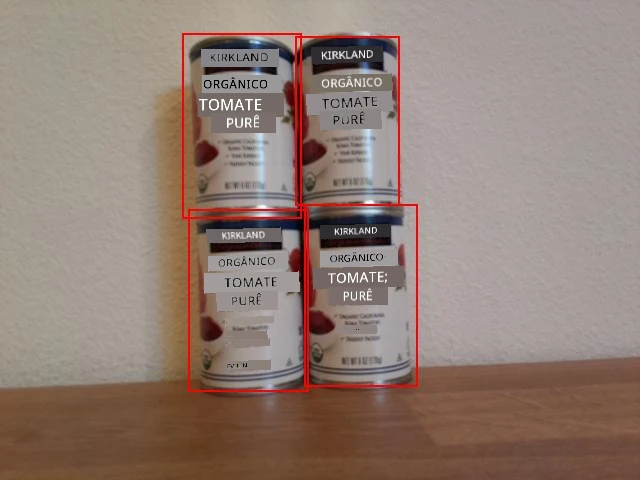

<!--
CO_OP_TRANSLATOR_METADATA:
{
  "original_hash": "0b2ae20b0fc8e73c9598dea937cac038",
  "translation_date": "2025-08-28T03:50:36+00:00",
  "source_file": "5-retail/lessons/2-check-stock-device/wio-terminal-count-stock.md",
  "language_code": "br"
}
-->
# Contar estoque com seu dispositivo IoT - Wio Terminal

Uma combinação de previsões e suas caixas delimitadoras pode ser usada para contar o estoque em uma imagem.

## Contar estoque



Na imagem mostrada acima, as caixas delimitadoras têm uma pequena sobreposição. Se essa sobreposição fosse muito maior, as caixas delimitadoras poderiam indicar o mesmo objeto. Para contar os objetos corretamente, você precisa ignorar caixas com uma sobreposição significativa.

### Tarefa - contar estoque ignorando sobreposição

1. Abra seu projeto `stock-counter` caso ele ainda não esteja aberto.

1. Acima da função `processPredictions`, adicione o seguinte código:

    ```cpp
    const float overlap_threshold = 0.20f;
    ```

    Isso define a porcentagem de sobreposição permitida antes que as caixas delimitadoras sejam consideradas o mesmo objeto. 0.20 define uma sobreposição de 20%.

1. Abaixo disso, e acima da função `processPredictions`, adicione o seguinte código para calcular a sobreposição entre dois retângulos:

    ```cpp
    struct Point {
        float x, y;
    };

    struct Rect {
        Point topLeft, bottomRight;
    };

    float area(Rect rect)
    {
        return abs(rect.bottomRight.x - rect.topLeft.x) * abs(rect.bottomRight.y - rect.topLeft.y);
    }
     
    float overlappingArea(Rect rect1, Rect rect2)
    {
        float left = max(rect1.topLeft.x, rect2.topLeft.x);
        float right = min(rect1.bottomRight.x, rect2.bottomRight.x);
        float top = max(rect1.topLeft.y, rect2.topLeft.y);
        float bottom = min(rect1.bottomRight.y, rect2.bottomRight.y);
    
    
        if ( right > left && bottom > top )
        {
            return (right-left)*(bottom-top);
        }
        
        return 0.0f;
    }
    ```

    Este código define uma estrutura `Point` para armazenar pontos na imagem e uma estrutura `Rect` para definir um retângulo usando uma coordenada superior esquerda e inferior direita. Em seguida, define uma função `area` que calcula a área de um retângulo a partir de uma coordenada superior esquerda e inferior direita.

    Depois, define uma função `overlappingArea` que calcula a área de sobreposição de 2 retângulos. Se eles não se sobrepõem, retorna 0.

1. Abaixo da função `overlappingArea`, declare uma função para converter uma caixa delimitadora em um `Rect`:

    ```cpp
    Rect rectFromBoundingBox(JsonVariant prediction)
    {
        JsonObject bounding_box = prediction["boundingBox"].as<JsonObject>();
    
        float left = bounding_box["left"].as<float>();
        float top = bounding_box["top"].as<float>();
        float width = bounding_box["width"].as<float>();
        float height = bounding_box["height"].as<float>();
    
        Point topLeft = {left, top};
        Point bottomRight = {left + width, top + height};
    
        return {topLeft, bottomRight};
    }
    ```

    Isso pega uma previsão do detector de objetos, extrai a caixa delimitadora e usa os valores da caixa delimitadora para definir um retângulo. O lado direito é calculado a partir da esquerda mais a largura. A parte inferior é calculada como o topo mais a altura.

1. As previsões precisam ser comparadas entre si, e se 2 previsões tiverem uma sobreposição maior que o limite, uma delas precisa ser excluída. O limite de sobreposição é uma porcentagem, então precisa ser multiplicado pelo tamanho da menor caixa delimitadora para verificar se a sobreposição excede a porcentagem dada da caixa delimitadora, e não a porcentagem dada da imagem inteira. Comece excluindo o conteúdo da função `processPredictions`.

1. Adicione o seguinte à função `processPredictions` vazia:

    ```cpp
    std::vector<JsonVariant> passed_predictions;

    for (int i = 0; i < predictions.size(); ++i)
    {
        Rect prediction_1_rect = rectFromBoundingBox(predictions[i]);
        float prediction_1_area = area(prediction_1_rect);
        bool passed = true;

        for (int j = i + 1; j < predictions.size(); ++j)
        {
            Rect prediction_2_rect = rectFromBoundingBox(predictions[j]);
            float prediction_2_area = area(prediction_2_rect);

            float overlap = overlappingArea(prediction_1_rect, prediction_2_rect);
            float smallest_area = min(prediction_1_area, prediction_2_area);

            if (overlap > (overlap_threshold * smallest_area))
            {
                passed = false;
                break;
            }
        }

        if (passed)
        {
            passed_predictions.push_back(predictions[i]);
        }
    }
    ```

    Este código declara um vetor para armazenar as previsões que não se sobrepõem. Em seguida, percorre todas as previsões, criando um `Rect` a partir da caixa delimitadora.

    Depois, este código percorre as previsões restantes, começando pela que vem após a previsão atual. Isso impede que as previsões sejam comparadas mais de uma vez - uma vez que 1 e 2 foram comparadas, não há necessidade de comparar 2 com 1, apenas com 3, 4, etc.

    Para cada par de previsões, a área de sobreposição é calculada. Isso é então comparado à área da menor caixa delimitadora - se a sobreposição exceder a porcentagem limite da menor caixa delimitadora, a previsão é marcada como não aprovada. Se, após comparar todas as sobreposições, a previsão passar nos testes, ela é adicionada à coleção `passed_predictions`.

    > 💁 Esta é uma maneira muito simplista de remover sobreposições, apenas removendo a primeira em um par sobreposto. Para código de produção, você gostaria de adicionar mais lógica aqui, como considerar as sobreposições entre múltiplos objetos ou se uma caixa delimitadora está contida por outra.

1. Depois disso, adicione o seguinte código para enviar detalhes das previsões aprovadas ao monitor serial:

    ```cpp
    for(JsonVariant prediction : passed_predictions)
    {
        String boundingBox = prediction["boundingBox"].as<String>();
        String tag = prediction["tagName"].as<String>();
        float probability = prediction["probability"].as<float>();

        char buff[32];
        sprintf(buff, "%s:\t%.2f%%\t%s", tag.c_str(), probability * 100.0, boundingBox.c_str());
        Serial.println(buff);
    }
    ```

    Este código percorre as previsões aprovadas e imprime seus detalhes no monitor serial.

1. Abaixo disso, adicione código para imprimir o número de itens contados no monitor serial:

    ```cpp
    Serial.print("Counted ");
    Serial.print(passed_predictions.size());
    Serial.println(" stock items.");
    ```

    Isso poderia então ser enviado para um serviço IoT para alertar se os níveis de estoque estiverem baixos.

1. Faça o upload e execute seu código. Aponte a câmera para objetos em uma prateleira e pressione o botão C. Tente ajustar o valor de `overlap_threshold` para ver previsões sendo ignoradas.

    ```output
    Connecting to WiFi..
    Connected!
    Image captured
    Image read to buffer with length 17416
    tomato paste:   35.84%  {"left":0.395631,"top":0.215897,"width":0.180768,"height":0.359364}
    tomato paste:   35.87%  {"left":0.378554,"top":0.583012,"width":0.14824,"height":0.359382}
    tomato paste:   34.11%  {"left":0.699024,"top":0.592617,"width":0.124411,"height":0.350456}
    tomato paste:   35.16%  {"left":0.513006,"top":0.647853,"width":0.187472,"height":0.325817}
    Counted 4 stock items.
    ```

> 💁 Você pode encontrar este código na pasta [code-count/wio-terminal](../../../../../5-retail/lessons/2-check-stock-device/code-count/wio-terminal).

😀 Seu programa de contador de estoque foi um sucesso!

---

**Aviso Legal**:  
Este documento foi traduzido utilizando o serviço de tradução por IA [Co-op Translator](https://github.com/Azure/co-op-translator). Embora nos esforcemos para garantir a precisão, esteja ciente de que traduções automatizadas podem conter erros ou imprecisões. O documento original em seu idioma nativo deve ser considerado a fonte autoritativa. Para informações críticas, recomenda-se a tradução profissional realizada por humanos. Não nos responsabilizamos por quaisquer mal-entendidos ou interpretações equivocadas decorrentes do uso desta tradução.