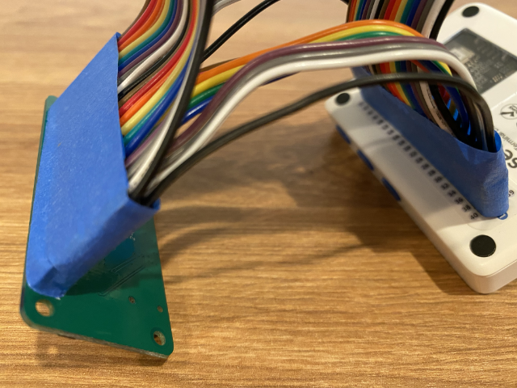

<!--
CO_OP_TRANSLATOR_METADATA:
{
  "original_hash": "93d352de36526b8990e41dd538100324",
  "translation_date": "2025-08-28T03:03:27+00:00",
  "source_file": "6-consumer/lessons/1-speech-recognition/wio-terminal-microphone.md",
  "language_code": "br"
}
-->
# Configure seu microfone e alto-falantes - Wio Terminal

Nesta parte da lição, você adicionará alto-falantes ao seu Wio Terminal. O Wio Terminal já possui um microfone embutido, que pode ser usado para capturar fala.

## Hardware

O Wio Terminal já vem com um microfone embutido, que pode ser usado para capturar áudio para reconhecimento de fala.

Para adicionar um alto-falante, você pode usar o [ReSpeaker 2-Mics Pi Hat](https://www.seeedstudio.com/ReSpeaker-2-Mics-Pi-HAT.html). Esta é uma placa externa que contém 2 microfones MEMS, além de um conector para alto-falante e uma entrada para fones de ouvido.

Você precisará adicionar fones de ouvido, um alto-falante com conector de 3,5 mm ou um alto-falante com conexão JST, como o [Mono Enclosed Speaker - 2W 6 Ohm](https://www.seeedstudio.com/Mono-Enclosed-Speaker-2W-6-Ohm-p-2832.html).

Para conectar o ReSpeaker 2-Mics Pi Hat, você precisará de cabos jumper de 40 pinos (também chamados de macho-macho).

> 💁 Se você estiver confortável com soldagem, pode usar o [40 Pin Raspberry Pi Hat Adapter Board For Wio Terminal](https://www.seeedstudio.com/40-Pin-Raspberry-Pi-Hat-Adapter-Board-For-Wio-Terminal-p-4730.html) para conectar o ReSpeaker.

Você também precisará de um cartão SD para baixar e reproduzir áudio. O Wio Terminal suporta apenas cartões SD de até 16GB, que precisam estar formatados como FAT32 ou exFAT.

### Tarefa - conectar o ReSpeaker Pi Hat

1. Com o Wio Terminal desligado, conecte o ReSpeaker 2-Mics Pi Hat ao Wio Terminal usando os cabos jumper e os soquetes GPIO na parte traseira do Wio Terminal:

    Os pinos precisam ser conectados desta forma:

    

1. Posicione o ReSpeaker e o Wio Terminal com os soquetes GPIO voltados para cima e no lado esquerdo.

1. Comece pelo soquete no canto superior esquerdo do soquete GPIO no ReSpeaker. Conecte um cabo jumper do soquete superior esquerdo do ReSpeaker ao soquete superior esquerdo do Wio Terminal.

1. Repita isso até o final dos soquetes GPIO no lado esquerdo. Certifique-se de que os pinos estejam bem encaixados.

    

    

    > 💁 Se seus cabos jumper estiverem conectados em fitas, mantenha-os juntos - isso facilita garantir que todos os cabos estejam conectados na ordem correta.

1. Repita o processo usando os soquetes GPIO do lado direito no ReSpeaker e no Wio Terminal. Esses cabos precisam passar ao redor dos cabos que já estão conectados.

    

    

    > 💁 Se seus cabos jumper estiverem conectados em fitas, divida-os em duas fitas. Passe uma de cada lado dos cabos já existentes.

    > 💁 Você pode usar fita adesiva para manter os pinos em um bloco, ajudando a evitar que eles se soltem enquanto você os conecta.
    >
    > 

1. Você precisará adicionar um alto-falante.

    * Se estiver usando um alto-falante com cabo JST, conecte-o à porta JST no ReSpeaker.

      

    * Se estiver usando um alto-falante com conector de 3,5 mm ou fones de ouvido, insira-o na entrada de 3,5 mm.

      

### Tarefa - configurar o cartão SD

1. Conecte o cartão SD ao seu computador, usando um leitor externo se o computador não tiver um slot para cartão SD.

1. Formate o cartão SD usando a ferramenta apropriada no seu computador, certificando-se de usar o sistema de arquivos FAT32 ou exFAT.

1. Insira o cartão SD no slot do Wio Terminal, localizado no lado esquerdo, logo abaixo do botão de energia. Certifique-se de que o cartão esteja completamente inserido e faça um clique - você pode precisar de uma ferramenta fina ou outro cartão SD para ajudar a empurrá-lo completamente.

    

    > 💁 Para ejetar o cartão SD, você precisa empurrá-lo levemente para dentro, e ele será ejetado. Você precisará de uma ferramenta fina, como uma chave de fenda de cabeça chata ou outro cartão SD, para fazer isso.

---

**Aviso Legal**:  
Este documento foi traduzido utilizando o serviço de tradução por IA [Co-op Translator](https://github.com/Azure/co-op-translator). Embora nos esforcemos para garantir a precisão, esteja ciente de que traduções automatizadas podem conter erros ou imprecisões. O documento original em seu idioma nativo deve ser considerado a fonte autoritativa. Para informações críticas, recomenda-se a tradução profissional realizada por humanos. Não nos responsabilizamos por quaisquer mal-entendidos ou interpretações equivocadas decorrentes do uso desta tradução.