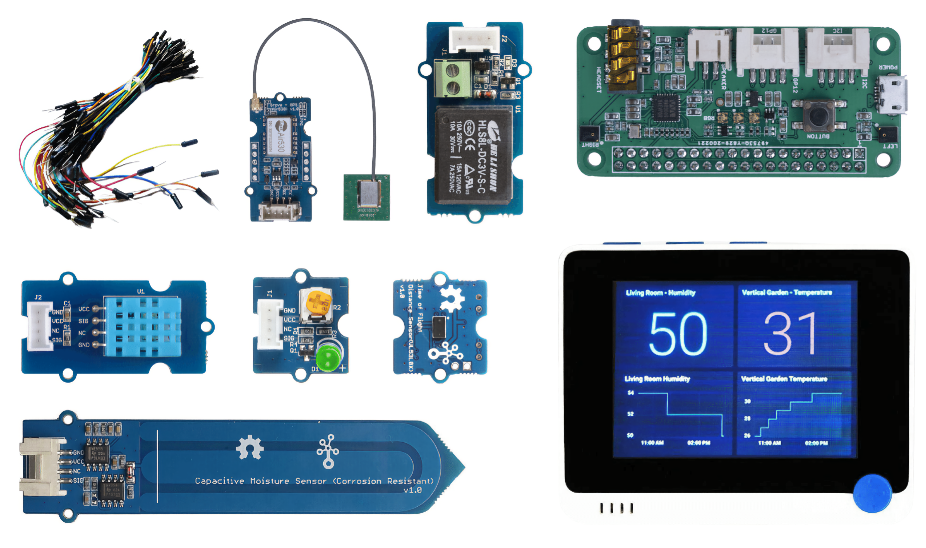

<!--
CO_OP_TRANSLATOR_METADATA:
{
  "original_hash": "3dce18fab38adf93ff30b8c221b1eec5",
  "translation_date": "2025-08-28T02:32:35+00:00",
  "source_file": "hardware.md",
  "language_code": "br"
}
-->
# Hardware

O **T** em IoT significa **Things** (Coisas) e se refere a dispositivos que interagem com o mundo ao nosso redor. Cada projeto é baseado em hardware real disponível para estudantes e entusiastas. Temos duas opções de hardware IoT para usar, dependendo da preferência pessoal, conhecimento ou preferência de linguagem de programação, objetivos de aprendizado e disponibilidade. Também fornecemos uma versão de 'hardware virtual' para aqueles que não têm acesso ao hardware ou queiram aprender mais antes de decidir pela compra.

> 💁 Você não precisa comprar nenhum hardware IoT para concluir as tarefas. É possível fazer tudo usando hardware IoT virtual.

As opções de hardware físico são Arduino ou Raspberry Pi. Cada plataforma tem suas vantagens e desvantagens, que são abordadas em uma das lições iniciais. Se você ainda não decidiu qual plataforma de hardware usar, pode revisar [a lição dois do primeiro projeto](./1-getting-started/lessons/2-deeper-dive/README.md) para decidir qual plataforma de hardware mais lhe interessa.

O hardware específico foi escolhido para reduzir a complexidade das lições e tarefas. Embora outros hardwares possam funcionar, não podemos garantir que todas as tarefas serão compatíveis com seu dispositivo sem hardware adicional. Por exemplo, muitos dispositivos Arduino não possuem Wi-Fi, que é necessário para se conectar à nuvem - o terminal Wio foi escolhido porque já possui Wi-Fi integrado.

Você também precisará de alguns itens não técnicos, como terra ou uma planta em vaso, e frutas ou vegetais.

## Compre os kits

A Seeed Studios gentilmente disponibilizou todo o hardware em kits fáceis de adquirir:

### Arduino - Wio Terminal

**[IoT para iniciantes com Seeed e Microsoft - Kit Inicial Wio Terminal](https://www.seeedstudio.com/IoT-for-beginners-with-Seeed-and-Microsoft-Wio-Terminal-Starter-Kit-p-5006.html)**

### Raspberry Pi

**[IoT para iniciantes com Seeed e Microsoft - Kit Inicial Raspberry Pi 4](https://www.seeedstudio.com/IoT-for-beginners-with-Seeed-and-Microsoft-Raspberry-Pi-Starter-Kit-p-5004.html)**

## Arduino

Todo o código para dispositivos Arduino é escrito em C++. Para concluir todas as tarefas, você precisará do seguinte:

### Hardware Arduino

* [Wio Terminal](https://www.seeedstudio.com/Wio-Terminal-p-4509.html)
* *Opcional* - Cabo USB-C ou adaptador USB-A para USB-C. O terminal Wio possui uma porta USB-C e vem com um cabo USB-C para USB-A. Se o seu PC ou Mac tiver apenas portas USB-C, você precisará de um cabo USB-C ou de um adaptador USB-A para USB-C.

### Sensores e atuadores específicos para Arduino

Esses itens são específicos para o dispositivo Arduino Wio Terminal e não são relevantes para o uso com Raspberry Pi.

* [ArduCam Mini 2MP Plus - OV2640](https://www.arducam.com/product/arducam-2mp-spi-camera-b0067-arduino/)
* [ReSpeaker 2-Mics Pi HAT](https://www.seeedstudio.com/ReSpeaker-2-Mics-Pi-HAT.html)
* [Fios jumper para protoboard](https://www.seeedstudio.com/Breadboard-Jumper-Wire-Pack-241mm-200mm-160mm-117m-p-234.html)
* Fones de ouvido ou outro alto-falante com conector de 3,5 mm, ou um alto-falante JST, como:
  * [Alto-falante Mono Enclosed - 2W 6 Ohm](https://www.seeedstudio.com/Mono-Enclosed-Speaker-2W-6-Ohm-p-2832.html)
* Cartão microSD de 16GB ou menos, junto com um adaptador para usar o cartão SD no computador, caso não tenha um leitor embutido. **NOTA** - O terminal Wio suporta apenas cartões SD de até 16GB, não suporta capacidades maiores.

## Raspberry Pi

Todo o código para dispositivos Raspberry Pi é escrito em Python. Para concluir todas as tarefas, você precisará do seguinte:

### Hardware Raspberry Pi

* [Raspberry Pi](https://www.raspberrypi.org/products/raspberry-pi-4-model-b/)
  > 💁 Versões a partir do Pi 2B devem funcionar com as tarefas destas lições. Se você planeja executar o VS Code diretamente no Pi, então um Pi 4 com 2GB ou mais de RAM é necessário. Se você for acessar o Pi remotamente, qualquer Pi 2B ou superior funcionará.
* Cartão microSD (Você pode adquirir kits de Raspberry Pi que já vêm com um cartão microSD), junto com um adaptador para usar o cartão SD no computador, caso não tenha um leitor embutido.
* Fonte de alimentação USB (Você pode adquirir kits de Raspberry Pi 4 que já vêm com uma fonte de alimentação). Se você estiver usando um Raspberry Pi 4, precisará de uma fonte de alimentação USB-C; dispositivos anteriores precisam de uma fonte de alimentação micro-USB.

### Sensores e atuadores específicos para Raspberry Pi

Esses itens são específicos para o uso com Raspberry Pi e não são relevantes para o dispositivo Arduino.

* [Grove Pi base hat](https://www.seeedstudio.com/Grove-Base-Hat-for-Raspberry-Pi.html)
* [Módulo de câmera Raspberry Pi](https://www.raspberrypi.org/products/camera-module-v2/)
* Microfone e alto-falante:

  Use um dos seguintes (ou equivalente):
  * Qualquer microfone USB com qualquer alto-falante USB, ou alto-falante com cabo de 3,5 mm, ou saída de áudio HDMI se o Raspberry Pi estiver conectado a um monitor ou TV com alto-falantes
  * Qualquer headset USB com microfone embutido
  * [ReSpeaker 2-Mics Pi HAT](https://www.seeedstudio.com/ReSpeaker-2-Mics-Pi-HAT.html) com
    * Fones de ouvido ou outro alto-falante com conector de 3,5 mm, ou um alto-falante JST, como:
    * [Alto-falante Mono Enclosed - 2W 6 Ohm](https://www.seeedstudio.com/Mono-Enclosed-Speaker-2W-6-Ohm-p-2832.html)
  * [Speakerphone USB](https://www.amazon.com/USB-Speakerphone-Conference-Business-Microphones/dp/B07Q3D7F8S/ref=sr_1_1?dchild=1&keywords=m0&qid=1614647389&sr=8-1)
* [Sensor de luz Grove](https://www.seeedstudio.com/Grove-Light-Sensor-v1-2-LS06-S-phototransistor.html)
* [Botão Grove](https://www.seeedstudio.com/Grove-Button.html)

## Sensores e atuadores

A maioria dos sensores e atuadores necessários é usada tanto nos caminhos de aprendizado do Arduino quanto do Raspberry Pi:

* [LED Grove](https://www.seeedstudio.com/Grove-LED-Pack-p-4364.html) x 2
* [Sensor de umidade e temperatura Grove](https://www.seeedstudio.com/Grove-Temperature-Humidity-Sensor-DHT11.html)
* [Sensor capacitivo de umidade do solo Grove](https://www.seeedstudio.com/Grove-Capacitive-Moisture-Sensor-Corrosion-Resistant.html)
* [Relé Grove](https://www.seeedstudio.com/Grove-Relay.html)
* [GPS Grove (Air530)](https://www.seeedstudio.com/Grove-GPS-Air530-p-4584.html)
* [Sensor de distância Time of Flight Grove](https://www.seeedstudio.com/Grove-Time-of-Flight-Distance-Sensor-VL53L0X.html)

## Hardware opcional

As lições sobre irrigação automatizada funcionam usando um relé. Como opção, você pode conectar este relé a uma bomba de água alimentada por USB usando o hardware listado abaixo.

* [Bomba de água 6V](https://www.seeedstudio.com/6V-Mini-Water-Pump-p-1945.html)
* [Terminal USB](https://www.adafruit.com/product/3628)
* Tubos de silicone
* Fios vermelho e preto
* Pequena chave de fenda de cabeça chata

## Hardware virtual

O caminho do hardware virtual fornecerá simuladores para os sensores e atuadores, implementados em Python. Dependendo da disponibilidade do seu hardware, você pode executar isso no seu dispositivo de desenvolvimento normal, como um Mac, PC, ou executá-lo em um Raspberry Pi e simular apenas o hardware que você não possui. Por exemplo, se você tiver a câmera Raspberry Pi, mas não os sensores Grove, será possível executar o código do dispositivo virtual no seu Pi e simular os sensores Grove, mas usar uma câmera física.

O hardware virtual usará o [projeto CounterFit](https://github.com/CounterFit-IoT/CounterFit).

Para concluir essas lições, você precisará de uma webcam, microfone e saída de áudio, como alto-falantes ou fones de ouvido. Esses dispositivos podem ser integrados ou externos e precisam estar configurados para funcionar com seu sistema operacional e disponíveis para uso em todos os aplicativos.

---

**Aviso Legal**:  
Este documento foi traduzido utilizando o serviço de tradução por IA [Co-op Translator](https://github.com/Azure/co-op-translator). Embora nos esforcemos para garantir a precisão, esteja ciente de que traduções automatizadas podem conter erros ou imprecisões. O documento original em seu idioma nativo deve ser considerado a fonte autoritativa. Para informações críticas, recomenda-se a tradução profissional realizada por humanos. Não nos responsabilizamos por quaisquer mal-entendidos ou interpretações equivocadas decorrentes do uso desta tradução.