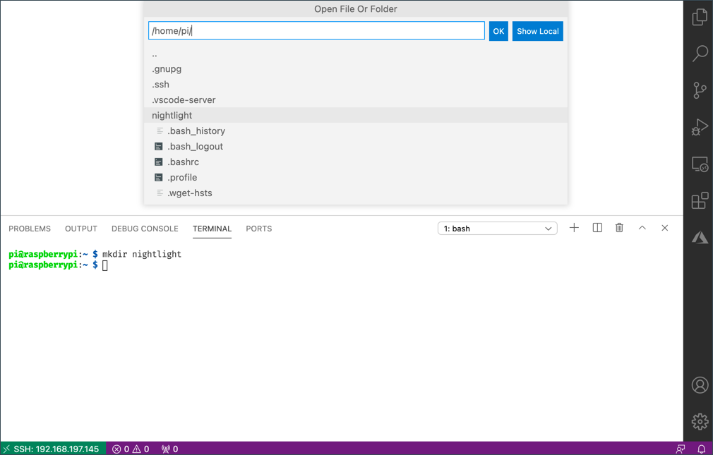

<!--
CO_OP_TRANSLATOR_METADATA:
{
  "original_hash": "8ff0d0a1d29832bb896b9c103b69a452",
  "translation_date": "2025-08-27T22:22:45+00:00",
  "source_file": "1-getting-started/lessons/1-introduction-to-iot/pi.md",
  "language_code": "cs"
}
-->
# Raspberry Pi

[Raspberry Pi](https://raspberrypi.org) je jednodeskový počítač. Můžete k němu připojit senzory a akční členy pomocí široké škály zařízení a ekosystémů. Pro tyto lekce budete používat hardwarový ekosystém nazvaný [Grove](https://www.seeedstudio.com/category/Grove-c-1003.html). Raspberry Pi budete programovat a přistupovat k senzorům Grove pomocí Pythonu.


## Nastavení

Pokud používáte Raspberry Pi jako své IoT zařízení, máte dvě možnosti – můžete projít všechny tyto lekce a programovat přímo na Pi, nebo se můžete připojit vzdáleně k „bezhlavému“ Pi a programovat z vašeho počítače.

Než začnete, musíte také připojit Grove Base Hat k vašemu Pi.

### Úkol - nastavení

Nainstalujte Grove Base Hat na vaše Pi a nakonfigurujte Pi.

1. Připojte Grove Base Hat k vašemu Pi. Zásuvka na hatu se nasazuje na všechny GPIO piny na Pi a zasune se až dolů, aby pevně seděla na základně. Hat zakrývá Pi.

    

1. Rozhodněte se, jak chcete programovat své Pi, a přejděte do příslušné sekce níže:

    * [Práce přímo na vašem Pi](../../../../../1-getting-started/lessons/1-introduction-to-iot)
    * [Vzdálený přístup k programování Pi](../../../../../1-getting-started/lessons/1-introduction-to-iot)

### Práce přímo na vašem Pi

Pokud chcete pracovat přímo na vašem Pi, můžete použít desktopovou verzi Raspberry Pi OS a nainstalovat všechny potřebné nástroje.

#### Úkol - práce přímo na vašem Pi

Připravte své Pi pro vývoj.

1. Postupujte podle pokynů v [průvodci nastavením Raspberry Pi](https://projects.raspberrypi.org/en/projects/raspberry-pi-setting-up) pro nastavení vašeho Pi, připojení klávesnice/myši/monitoru, připojení k WiFi nebo ethernetové síti a aktualizaci softwaru.

Pro programování Pi pomocí senzorů a akčních členů Grove budete potřebovat nainstalovat editor pro psaní kódu zařízení a různé knihovny a nástroje pro interakci s hardwarem Grove.

1. Po restartování Pi spusťte Terminál kliknutím na ikonu **Terminal** v horní liště menu nebo zvolte *Menu -> Accessories -> Terminal*.

1. Spusťte následující příkaz, abyste zajistili, že OS a nainstalovaný software jsou aktuální:

    ```sh
    sudo apt update && sudo apt full-upgrade --yes
    ```

1. Spusťte následující příkazy pro instalaci všech potřebných knihoven pro hardware Grove:

    ```sh
    sudo apt install git python3-dev python3-pip --yes

    git clone https://github.com/Seeed-Studio/grove.py
    cd grove.py
    sudo pip3 install .

    sudo raspi-config nonint do_i2c 0
    ```

    Tím se nejprve nainstaluje Git spolu s Pipem pro instalaci Python balíčků.

    Jednou z výhod Pythonu je možnost instalace [Pip balíčků](https://pypi.org) – což jsou balíčky kódu napsané jinými lidmi a publikované na internetu. Pip balíček můžete nainstalovat na svůj počítač jedním příkazem a poté jej použít ve svém kódu.

    Python balíčky Seeed Grove je třeba nainstalovat ze zdrojového kódu. Tyto příkazy naklonují repozitář obsahující zdrojový kód tohoto balíčku a poté jej nainstalují lokálně.

    > 💁 Ve výchozím nastavení, když nainstalujete balíček, je dostupný všude na vašem počítači, což může vést k problémům s verzemi balíčků – například jedna aplikace závisí na jedné verzi balíčku, která přestane fungovat, když nainstalujete novou verzi pro jinou aplikaci. Pro řešení tohoto problému můžete použít [Python virtuální prostředí](https://docs.python.org/3/library/venv.html), což je v podstatě kopie Pythonu v dedikované složce, a když instalujete Pip balíčky, instalují se pouze do této složky. Virtuální prostředí však nebudete používat na vašem Pi. Instalační skript Grove nainstaluje Python balíčky Grove globálně, takže pokud byste chtěli použít virtuální prostředí, museli byste jej nastavit a poté ručně znovu nainstalovat balíčky Grove uvnitř tohoto prostředí. Je jednodušší používat globální balíčky, zvláště protože mnoho vývojářů Pi pro každý projekt znovu flashuje čistou SD kartu.

    Nakonec to povolí rozhraní I<sup>2</sup>C.

1. Restartujte Pi buď pomocí menu, nebo spuštěním následujícího příkazu v Terminálu:

    ```sh
    sudo reboot
    ```

1. Po restartování Pi znovu spusťte Terminál a spusťte následující příkaz pro instalaci [Visual Studio Code (VS Code)](https://code.visualstudio.com?WT.mc_id=academic-17441-jabenn) – to je editor, který budete používat pro psaní kódu zařízení v Pythonu.

    ```sh
    sudo apt install code
    ```

    Po instalaci bude VS Code dostupný z horního menu.

    > 💁 Můžete použít jakýkoliv Python IDE nebo editor, pokud máte oblíbený nástroj, ale lekce budou obsahovat pokyny založené na použití VS Code.

1. Nainstalujte Pylance. Jedná se o rozšíření pro VS Code, které poskytuje podporu pro Python. Podívejte se na [dokumentaci k rozšíření Pylance](https://marketplace.visualstudio.com/items?WT.mc_id=academic-17441-jabenn&itemName=ms-python.vscode-pylance) pro pokyny k instalaci tohoto rozšíření ve VS Code.

### Vzdálený přístup k programování Pi

Místo programování přímo na Pi může běžet „bezhlavě“, tedy bez připojení klávesnice/myši/monitoru, a můžete jej konfigurovat a programovat z vašeho počítače pomocí Visual Studio Code.

#### Nastavení Pi OS

Pro vzdálené programování je třeba nainstalovat Pi OS na SD kartu.

##### Úkol - nastavení Pi OS

Nastavte bezhlavý Pi OS.

1. Stáhněte si **Raspberry Pi Imager** z [stránky se softwarem Raspberry Pi OS](https://www.raspberrypi.org/software/) a nainstalujte jej.

1. Vložte SD kartu do vašeho počítače, případně použijte adaptér.

1. Spusťte Raspberry Pi Imager.

1. V Raspberry Pi Imageru vyberte tlačítko **CHOOSE OS**, poté zvolte *Raspberry Pi OS (Other)* a následně *Raspberry Pi OS Lite (32-bit)*.

    

    > 💁 Raspberry Pi OS Lite je verze Raspberry Pi OS, která neobsahuje desktopové uživatelské rozhraní ani nástroje založené na UI. Ty nejsou potřeba pro bezhlavé Pi a instalace je díky tomu menší a rychlejší.

1. Vyberte tlačítko **CHOOSE STORAGE** a zvolte svou SD kartu.

1. Spusťte **Advanced Options** stisknutím `Ctrl+Shift+X`. Tyto možnosti umožňují předkonfiguraci Raspberry Pi OS před jeho nahráním na SD kartu.

    1. Zaškrtněte políčko **Enable SSH** a nastavte heslo pro uživatele `pi`. Toto heslo budete později používat pro přihlášení k Pi.

    1. Pokud plánujete připojení k Pi přes WiFi, zaškrtněte políčko **Configure WiFi** a zadejte svůj WiFi SSID a heslo, stejně jako zvolte svou WiFi zemi. Toto není potřeba, pokud budete používat ethernetový kabel. Ujistěte se, že síť, ke které se připojujete, je stejná jako ta, na které je váš počítač.

    1. Zaškrtněte políčko **Set locale settings** a nastavte svou zemi a časové pásmo.

    1. Zvolte tlačítko **SAVE**.

1. Zvolte tlačítko **WRITE** pro nahrání OS na SD kartu. Pokud používáte macOS, budete požádáni o zadání hesla, protože nástroj pro zápis diskových obrazů vyžaduje privilegovaný přístup.

OS bude nahrán na SD kartu a po dokončení bude karta vysunuta operačním systémem a budete upozorněni. Vyjměte SD kartu z počítače, vložte ji do Pi, zapněte Pi a počkejte přibližně 2 minuty, než se správně spustí.

#### Připojení k Pi

Dalším krokem je vzdálený přístup k Pi. To můžete provést pomocí `ssh`, který je dostupný na macOS, Linuxu a novějších verzích Windows.

##### Úkol - připojení k Pi

Vzdálený přístup k Pi.

1. Spusťte Terminál nebo Příkazový řádek a zadejte následující příkaz pro připojení k Pi:

    ```sh
    ssh pi@raspberrypi.local
    ```

    Pokud používáte starší verzi Windows, která nemá `ssh` nainstalovaný, můžete použít OpenSSH. Pokyny k instalaci najdete v [dokumentaci k instalaci OpenSSH](https://docs.microsoft.com//windows-server/administration/openssh/openssh_install_firstuse?WT.mc_id=academic-17441-jabenn).

1. Tento příkaz by vás měl připojit k vašemu Pi a vyžádat si heslo.

    Možnost najít počítače ve vaší síti pomocí `<hostname>.local` je poměrně nová funkce v Linuxu a Windows. Pokud používáte Linux nebo Windows a zobrazí se vám chyby o nenalezení hostitele, budete muset nainstalovat další software pro povolení ZeroConf sítě (také označované Apple jako Bonjour):

    1. Pokud používáte Linux, nainstalujte Avahi pomocí následujícího příkazu:

        ```sh
        sudo apt-get install avahi-daemon
        ```

    1. Pokud používáte Windows, nejjednodušší způsob, jak povolit ZeroConf, je nainstalovat [Bonjour Print Services for Windows](http://support.apple.com/kb/DL999). Můžete také nainstalovat [iTunes for Windows](https://www.apple.com/itunes/download/), abyste získali novější verzi nástroje (která není dostupná samostatně).

    > 💁 Pokud se nemůžete připojit pomocí `raspberrypi.local`, můžete použít IP adresu vašeho Pi. Podívejte se na [dokumentaci k IP adrese Raspberry Pi](https://www.raspberrypi.org/documentation/remote-access/ip-address.md) pro pokyny k několika způsobům, jak získat IP adresu.

1. Zadejte heslo, které jste nastavili v Advanced Options Raspberry Pi Imageru.

#### Konfigurace softwaru na Pi

Jakmile jste připojeni k Pi, musíte zajistit, že OS je aktuální, a nainstalovat různé knihovny a nástroje pro interakci s hardwarem Grove.

##### Úkol - konfigurace softwaru na Pi

Nakonfigurujte nainstalovaný software Pi a nainstalujte knihovny Grove.

1. Z vaší `ssh` relace spusťte následující příkaz pro aktualizaci a poté restartování Pi:

    ```sh
    sudo apt update && sudo apt full-upgrade --yes && sudo reboot
    ```

    Pi bude aktualizováno a restartováno. `ssh` relace skončí, když se Pi restartuje, takže počkejte přibližně 30 sekund a poté se znovu připojte.

1. Znovu připojené `ssh` relace spusťte následující příkazy pro instalaci všech potřebných knihoven pro hardware Grove:

    ```sh
    sudo apt install git python3-dev python3-pip --yes

    git clone https://github.com/Seeed-Studio/grove.py
    cd grove.py
    sudo pip3 install .

    sudo raspi-config nonint do_i2c 0
    ```

    Tím se nejprve nainstaluje Git spolu s Pipem pro instalaci Python balíčků.

    Jednou z výhod Pythonu je možnost instalace [Pip balíčků](https://pypi.org) – což jsou balíčky kódu napsané jinými lidmi a publikované na internetu. Pip balíček můžete nainstalovat na svůj počítač jedním příkazem a poté jej použít ve svém kódu.

    Python balíčky Seeed Grove je třeba nainstalovat ze zdrojového kódu. Tyto příkazy naklonují repozitář obsahující zdrojový kód tohoto balíčku a poté jej nainstalují lokálně.

    > 💁 Ve výchozím nastavení, když nainstalujete balíček, je dostupný všude na vašem počítači, což může vést k problémům s verzemi balíčků – například jedna aplikace závisí na jedné verzi balíčku, která přestane fungovat, když nainstalujete novou verzi pro jinou aplikaci. Pro řešení tohoto problému můžete použít [Python virtuální prostředí](https://docs.python.org/3/library/venv.html), což je v podstatě kopie Pythonu v dedikované složce, a když instalujete Pip balíčky, instalují se pouze do této složky. Virtuální prostředí však nebudete používat na vašem Pi. Instalační skript Grove nainstaluje Python balíčky Grove globálně, takže pokud byste chtěli použít virtuální prostředí, museli byste jej nastavit a poté ručně znovu nainstalovat balíčky Grove uvnitř tohoto prostředí. Je jednodušší používat globální balíčky, zvláště protože mnoho vývojářů Pi pro každý projekt znovu flashuje čistou SD kartu.

    Nakonec to povolí rozhraní I<sup>2</sup>C.

1. Restartujte Pi spuštěním následujícího příkazu:

    ```sh
    sudo reboot
    ```

    `ssh` relace skončí, když se Pi restartuje. Není potřeba se znovu připojovat.

#### Konfigurace VS Code pro vzdálený přístup

Jakmile je Pi nakonfigurováno, můžete se k němu připojit pomocí Visual Studio Code (VS Code) z vašeho počítače – jedná se o bezplatný textový editor pro vývojáře, který budete používat pro psaní kódu zařízení v Pythonu.

##### Úkol - konfigurace VS Code pro vzdálený přístup

Nainstalujte potřebný software a připojte se vzdáleně k vašemu Pi.

1. Nainstalujte VS Code na váš počítač podle [dokumentace VS Code](https://code.visualstudio.com?WT.mc_id=academic-17441-jabenn).

1. Postupujte podle pokynů v [dokumentaci k vzdálenému vývoji pomocí SSH ve VS Code](https://code.visualstudio.com/docs/remote/ssh?WT.mc_id=academic-17441-jabenn) pro instalaci potřebných komponent.

1. Podle stejných pokynů připojte VS Code k Pi.

1. Jakmile jste připojeni, postupujte podle [pokynů pro správu rozšíření](https://code.visualstudio.com/docs/remote/ssh#_managing-extensions?WT.mc_id=academic-17441-jabenn) a nainstalujte [rozšíření Pylance](https://marketplace.visualstudio.com/items?WT.mc_id=academic-17441-jabenn&itemName=ms-python.vscode-pylance) vzdáleně na Pi.

## Hello world
Je tradiční, když začínáte s novým programovacím jazykem nebo technologií, vytvořit aplikaci 'Hello World' – malou aplikaci, která vypíše něco jako text `"Hello World"`, aby se ukázalo, že všechny nástroje jsou správně nastavené.

Aplikace Hello World pro Pi zajistí, že máte správně nainstalovaný Python a Visual Studio Code.

Tato aplikace bude umístěna ve složce `nightlight` a bude znovu použita s různým kódem v pozdějších částech tohoto úkolu k vytvoření aplikace nočního světla.

### Úkol - hello world

Vytvořte aplikaci Hello World.

1. Spusťte VS Code, buď přímo na Pi, nebo na svém počítači a připojte se k Pi pomocí rozšíření Remote SSH.

1. Spusťte terminál VS Code výběrem *Terminal -> New Terminal* nebo stisknutím `` CTRL+` ``. Terminál se otevře v domovském adresáři uživatele `pi`.

1. Spusťte následující příkazy pro vytvoření adresáře pro váš kód a vytvoření Python souboru s názvem `app.py` uvnitř tohoto adresáře:

    ```sh
    mkdir nightlight
    cd nightlight
    touch app.py
    ```

1. Otevřete tuto složku ve VS Code výběrem *File -> Open...* a výběrem složky *nightlight*, poté zvolte **OK**.

    

1. Otevřete soubor `app.py` z průzkumníka VS Code a přidejte následující kód:

    ```python
    print('Hello World!')
    ```

    Funkce `print` vypíše do konzole vše, co jí předáte.

1. Z terminálu VS Code spusťte následující příkaz pro spuštění vaší Python aplikace:

    ```sh
    python app.py
    ```

    > 💁 Možná budete muset explicitně použít `python3` k spuštění tohoto kódu, pokud máte nainstalovaný Python 2 vedle Pythonu 3 (nejnovější verze). Pokud máte nainstalovaný Python 2, pak příkaz `python` spustí Python 2 místo Pythonu 3. Ve výchozím nastavení mají nejnovější verze Raspberry Pi OS pouze nainstalovaný Python 3.

    V terminálu se objeví následující výstup:

    ```output
    pi@raspberrypi:~/nightlight $ python3 app.py
    Hello World!
    ```

> 💁 Tento kód najdete ve složce [code/pi](../../../../../1-getting-started/lessons/1-introduction-to-iot/code/pi).

😀 Vaše 'Hello World' aplikace byla úspěšná!

---

**Prohlášení**:  
Tento dokument byl přeložen pomocí služby AI pro překlady [Co-op Translator](https://github.com/Azure/co-op-translator). Ačkoli se snažíme o přesnost, mějte prosím na paměti, že automatizované překlady mohou obsahovat chyby nebo nepřesnosti. Původní dokument v jeho původním jazyce by měl být považován za autoritativní zdroj. Pro důležité informace se doporučuje profesionální lidský překlad. Neodpovídáme za žádná nedorozumění nebo nesprávné interpretace vyplývající z použití tohoto překladu.