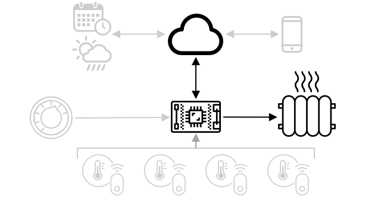

<!--
CO_OP_TRANSLATOR_METADATA:
{
  "original_hash": "71b5040e0b3472f1c0949c9b55f224c0",
  "translation_date": "2025-08-27T22:09:18+00:00",
  "source_file": "1-getting-started/lessons/4-connect-internet/README.md",
  "language_code": "cs"
}
-->
# Připojte své zařízení k internetu


> Sketchnote od [Nitya Narasimhan](https://github.com/nitya). Klikněte na obrázek pro větší verzi.

Tato lekce byla součástí série [Hello IoT](https://youtube.com/playlist?list=PLmsFUfdnGr3xRts0TIwyaHyQuHaNQcb6-) od [Microsoft Reactor](https://developer.microsoft.com/reactor/?WT.mc_id=academic-17441-jabenn). Lekce byla rozdělena do dvou videí - hodinové lekce a hodinového "office hour", kde se podrobněji probíraly části lekce a odpovídalo se na otázky.

[](https://youtu.be/O4dd172mZhs)

[](https://youtu.be/j-cVCzRDE2Q)

> 🎥 Klikněte na obrázky výše pro zhlédnutí videí

## Kvíz před lekcí

[Kvíz před lekcí](https://black-meadow-040d15503.1.azurestaticapps.net/quiz/7)

## Úvod

Písmeno **I** v IoT znamená **Internet** - cloudová konektivita a služby, které umožňují mnoho funkcí IoT zařízení, od sběru měření ze senzorů připojených k zařízení až po odesílání zpráv pro ovládání akčních členů. IoT zařízení se obvykle připojují k jedné cloudové IoT službě pomocí standardního komunikačního protokolu, a tato služba je propojena se zbytkem vaší IoT aplikace, od AI služeb pro chytré rozhodování na základě dat až po webové aplikace pro ovládání nebo reportování.

> 🎓 Data získaná ze senzorů a odeslaná do cloudu se nazývají telemetrie.

IoT zařízení mohou přijímat zprávy z cloudu. Tyto zprávy často obsahují příkazy - tedy instrukce k provedení akce buď interně (například restart nebo aktualizace firmwaru), nebo pomocí akčního členu (například zapnutí světla).

Tato lekce představuje některé komunikační protokoly, které IoT zařízení mohou používat k připojení do cloudu, a typy dat, která mohou odesílat nebo přijímat. Také si prakticky vyzkoušíte obě možnosti, přidáte internetové ovládání ke svému nočnímu světlu a přesunete logiku ovládání LED do 'serverového' kódu běžícího lokálně.

V této lekci se zaměříme na:

* [Komunikační protokoly](../../../../../1-getting-started/lessons/4-connect-internet)
* [Message Queueing Telemetry Transport (MQTT)](../../../../../1-getting-started/lessons/4-connect-internet)
* [Telemetrie](../../../../../1-getting-started/lessons/4-connect-internet)
* [Příkazy](../../../../../1-getting-started/lessons/4-connect-internet)

## Komunikační protokoly

Existuje několik populárních komunikačních protokolů, které IoT zařízení používají k komunikaci s internetem. Nejpopulárnější jsou založeny na publikování/přihlašování zpráv prostřednictvím nějakého typu brokeru. IoT zařízení se připojují k brokeru, publikují telemetrii a přihlašují se k příkazům. Cloudové služby se také připojují k brokeru, přihlašují se ke všem telemetrickým zprávám a publikují příkazy buď konkrétním zařízením, nebo skupinám zařízení.


MQTT je nejpopulárnější komunikační protokol pro IoT zařízení a je pokryt v této lekci. Mezi další protokoly patří AMQP a HTTP/HTTPS.

## Message Queueing Telemetry Transport (MQTT)

[MQTT](http://mqtt.org) je lehký, otevřený standardní protokol pro zasílání zpráv mezi zařízeními. Byl navržen v roce 1999 pro monitorování ropovodů, než byl o 15 let později uvolněn jako otevřený standard společností IBM.

MQTT má jednoho brokeru a více klientů. Všichni klienti se připojují k brokeru, který směruje zprávy relevantním klientům. Zprávy jsou směrovány pomocí pojmenovaných témat, místo aby byly odesílány přímo jednotlivým klientům. Klient může publikovat do tématu a všichni klienti, kteří se k tomuto tématu přihlásí, obdrží zprávu.


✅ Udělejte si průzkum. Pokud máte mnoho IoT zařízení, jak zajistíte, že váš MQTT broker zvládne všechny zprávy?

### Připojte své IoT zařízení k MQTT

Prvním krokem k přidání internetového ovládání k vašemu nočnímu světlu je připojení k MQTT brokeru.

#### Úkol

Připojte své zařízení k MQTT brokeru.

V této části lekce připojíte své IoT noční světlo k internetu, aby mohlo být ovládáno na dálku. Později v této lekci vaše IoT zařízení odešle telemetrickou zprávu přes MQTT na veřejný MQTT broker s úrovní světla, kde ji zachytí serverový kód, který napíšete. Tento kód zkontroluje úroveň světla a odešle zpět příkazovou zprávu zařízení, která mu řekne, aby zapnulo nebo vypnulo LED.

Reálné využití takového nastavení by mohlo být sběr dat z více světelných senzorů před rozhodnutím o zapnutí světel na místě, kde je mnoho světel, například na stadionu. To by mohlo zabránit zapnutí světel, pokud by pouze jeden senzor byl zakrytý mraky nebo ptákem, ale ostatní senzory detekovaly dostatek světla.

✅ Jaké další situace by vyžadovaly vyhodnocení dat z více senzorů před odesláním příkazů?

Namísto řešení složitostí nastavení MQTT brokeru jako součást tohoto úkolu můžete použít veřejný testovací server, který provozuje [Eclipse Mosquitto](https://www.mosquitto.org), open-source MQTT broker. Tento testovací broker je veřejně dostupný na [test.mosquitto.org](https://test.mosquitto.org) a nevyžaduje nastavení účtu, což z něj činí skvělý nástroj pro testování MQTT klientů a serverů.

> 💁 Tento testovací broker je veřejný a není zabezpečený. Kdokoliv může poslouchat, co publikujete, takže by neměl být používán s daty, která je třeba uchovat v soukromí.


Postupujte podle relevantního kroku níže pro připojení vašeho zařízení k MQTT brokeru:

* [Arduino - Wio Terminal](wio-terminal-mqtt.md)
* [Jednodeskový počítač - Raspberry Pi/Virtual IoT device](single-board-computer-mqtt.md)

### Podrobnější pohled na MQTT

Témata mohou mít hierarchii a klienti se mohou přihlašovat k různým úrovním hierarchie pomocí zástupných znaků. Například můžete odesílat telemetrické zprávy o teplotě na téma `/telemetry/temperature` a zprávy o vlhkosti na téma `/telemetry/humidity`, a poté ve své cloudové aplikaci přihlásit k tématu `/telemetry/*`, abyste obdrželi jak teplotní, tak vlhkostní telemetrické zprávy.

Zprávy mohou být odesílány s kvalitou služby (QoS), která určuje záruku doručení zprávy.

* Nejvýše jednou - zpráva je odeslána pouze jednou a klient ani broker nepodnikají žádné další kroky k potvrzení doručení (odeslat a zapomenout).
* Nejméně jednou - zpráva je opakovaně odesílána odesílatelem, dokud není obdrženo potvrzení (potvrzené doručení).
* Přesně jednou - odesílatel a příjemce se zapojí do dvouúrovňového handshake, aby zajistili, že bude přijata pouze jedna kopie zprávy (zaručené doručení).

✅ Jaké situace by vyžadovaly zaručené doručení zprávy oproti odeslání a zapomenutí?

Ačkoliv název obsahuje Message Queueing (MQTT), protokol ve skutečnosti nepodporuje fronty zpráv. To znamená, že pokud se klient odpojí a poté znovu připojí, neobdrží zprávy odeslané během odpojení, kromě těch zpráv, které již začal zpracovávat pomocí procesu QoS. Zprávy mohou mít nastavenou příznakovou hodnotu "retained". Pokud je tato hodnota nastavena, MQTT broker uloží poslední zprávu odeslanou na téma s tímto příznakem a odešle ji všem klientům, kteří se později k tématu přihlásí. Tímto způsobem klienti vždy obdrží nejnovější zprávu.

MQTT také podporuje funkci "keep alive", která kontroluje, zda je připojení stále aktivní během dlouhých mezer mezi zprávami.

> 🦟 [Mosquitto od Eclipse Foundation](https://mosquitto.org) nabízí bezplatný MQTT broker, který si můžete sami spustit pro experimentování s MQTT, spolu s veřejným MQTT brokerem, který můžete použít k testování svého kódu, hostovaným na [test.mosquitto.org](https://test.mosquitto.org).

MQTT připojení mohou být veřejná a otevřená, nebo šifrovaná a zabezpečená pomocí uživatelských jmen a hesel, nebo certifikátů.

> 💁 MQTT komunikuje přes TCP/IP, stejný základní síťový protokol jako HTTP, ale na jiném portu. MQTT můžete také používat přes websockets pro komunikaci s webovými aplikacemi běžícími v prohlížeči, nebo v situacích, kdy firewally nebo jiné síťové pravidla blokují standardní MQTT připojení.

## Telemetrie

Slovo telemetrie pochází z řeckých kořenů a znamená měření na dálku. Telemetrie je akt sběru dat ze senzorů a jejich odesílání do cloudu.

> 💁 Jedno z prvních telemetrických zařízení bylo vynalezeno ve Francii v roce 1874 a odesílalo v reálném čase informace o počasí a hloubce sněhu z Mont Blancu do Paříže. Používalo fyzické dráty, protože bezdrátové technologie tehdy nebyly dostupné.

Podívejme se zpět na příklad chytrého termostatu z Lekce 1.


Termostat má teplotní senzory pro sběr telemetrie. Pravděpodobně by měl jeden teplotní senzor zabudovaný a mohl by se připojit k více externím teplotním senzorům přes bezdrátový protokol, jako je [Bluetooth Low Energy](https://wikipedia.org/wiki/Bluetooth_Low_Energy) (BLE).

Příklad telemetrických dat, která by mohl odesílat, by mohl být:

| Název | Hodnota | Popis |
| ---- | ----- | ----------- |
| `thermostat_temperature` | 18°C | Teplota naměřená zabudovaným teplotním senzorem termostatu |
| `livingroom_temperature` | 19°C | Teplota naměřená vzdáleným teplotním senzorem, který byl pojmenován `livingroom`, aby identifikoval místnost, ve které se nachází |
| `bedroom_temperature` | 21°C | Teplota naměřená vzdáleným teplotním senzorem, který byl pojmenován `bedroom`, aby identifikoval místnost, ve které se nachází |

Cloudová služba může poté použít tato telemetrická data k rozhodování o tom, jaké příkazy odeslat pro ovládání vytápění.

### Odesílání telemetrie z vašeho IoT zařízení

Dalším krokem k přidání internetového ovládání k vašemu nočnímu světlu je odesílání telemetrie úrovně světla na MQTT broker na telemetrické téma.

#### Úkol - odesílání telemetrie z vašeho IoT zařízení

Odesílejte telemetrii úrovně světla na MQTT broker.

Data jsou odesílána kódovaná jako JSON - zkratka pro JavaScript Object Notation, standard pro kódování dat v textu pomocí klíč/hodnota párů.

✅ Pokud jste se s JSON ještě nesetkali, můžete se o něm dozvědět více na [JSON.org dokumentaci](https://www.json.org/).

Postupujte podle relevantního kroku níže pro odesílání telemetrie z vašeho zařízení na MQTT broker:

* [Arduino - Wio Terminal](wio-terminal-telemetry.md)
* [Jednodeskový počítač - Raspberry Pi/Virtual IoT device](single-board-computer-telemetry.md)

### Přijímání telemetrie z MQTT brokeru

Nemá smysl odesílat telemetrii, pokud na druhém konci není nic, co by ji poslouchalo. Telemetrie úrovně světla potřebuje něco, co ji bude poslouchat a zpracovávat data. Tento 'serverový' kód je typ kódu, který nasadíte na cloudovou službu jako součást větší IoT aplikace, ale zde budete tento kód spouštět lokálně na svém počítači (nebo na svém Raspberry Pi, pokud na něm přímo programujete). Serverový kód se skládá z Python aplikace, která poslouchá telemetrické zprávy přes MQTT s úrovněmi světla. Později v této lekci ji nastavíte tak, aby odpovídala příkazovou zprávou s instrukcemi pro zapnutí nebo vypnutí LED.

✅ Udělejte si průzkum: Co se stane s MQTT zprávami, pokud není žádný posluchač?

#### Instalace Pythonu a VS Code

Pokud nemáte Python a VS Code nainstalované lokálně, budete je muset nainstalovat, abyste mohli psát serverový kód. Pokud používáte virtuální IoT zařízení nebo pracujete na svém Raspberry Pi, můžete tento krok přeskočit, protože byste již měli mít vše nainstalováno a nakonfigurováno.

##### Úkol - instalace Pythonu a VS Code

Nainstalujte Python a VS Code.

1. Nainstalujte Python. Podívejte se na [stránku ke stažení Pythonu](https://www.python.org/downloads/) pro pokyny k instalaci nejnovější verze Pythonu.

1. Nainstalujte Visual Studio Code (VS Code). Toto je editor, který budete používat k psaní kódu svého virtuálního zařízení v Pythonu. Podívejte se na [dokumentaci VS Code](https://code.visualstudio.com?WT.mc_id=academic-17441-jabenn) pro pokyny k instalaci VS Code.
💁 Můžete použít jakékoli IDE nebo editor pro Python, pokud máte oblíbený nástroj, ale lekce budou obsahovat pokyny založené na používání VS Code.
1. Nainstalujte rozšíření Pylance pro VS Code. Toto je rozšíření pro VS Code, které poskytuje podporu pro jazyk Python. Pokyny k instalaci tohoto rozšíření ve VS Code naleznete v [dokumentaci k rozšíření Pylance](https://marketplace.visualstudio.com/items?WT.mc_id=academic-17441-jabenn&itemName=ms-python.vscode-pylance).

#### Konfigurace virtuálního prostředí Pythonu

Jednou z výkonných funkcí Pythonu je možnost instalovat [pip balíčky](https://pypi.org) – jedná se o balíčky kódu napsané jinými lidmi a publikované na internetu. Pip balíček můžete nainstalovat na svůj počítač jedním příkazem a poté jej použít ve svém kódu. Budete používat pip k instalaci balíčku pro komunikaci přes MQTT.

Ve výchozím nastavení je po instalaci balíček dostupný všude na vašem počítači, což může vést k problémům s verzemi balíčků – například jedna aplikace závisí na jedné verzi balíčku, která přestane fungovat, když nainstalujete novou verzi pro jinou aplikaci. Aby se tento problém obešel, můžete použít [virtuální prostředí Pythonu](https://docs.python.org/3/library/venv.html), což je v podstatě kopie Pythonu v dedikované složce. Když nainstalujete pip balíčky, budou nainstalovány pouze do této složky.

##### Úkol – konfigurace virtuálního prostředí Pythonu

Nakonfigurujte virtuální prostředí Pythonu a nainstalujte pip balíčky pro MQTT.

1. V terminálu nebo příkazovém řádku spusťte následující příkazy na místě dle vašeho výběru pro vytvoření a přechod do nové složky:

    ```sh
    mkdir nightlight-server
    cd nightlight-server
    ```

1. Nyní spusťte následující příkaz pro vytvoření virtuálního prostředí ve složce `.venv`:

    ```sh
    python3 -m venv .venv
    ```

    > 💁 Musíte explicitně zavolat `python3` pro vytvoření virtuálního prostředí, protože můžete mít nainstalovaný Python 2 vedle Pythonu 3 (nejnovější verze). Pokud máte nainstalovaný Python 2, volání `python` použije Python 2 místo Pythonu 3.

1. Aktivujte virtuální prostředí:

    * Na Windows:
        * Pokud používáte Příkazový řádek nebo Příkazový řádek přes Windows Terminal, spusťte:

            ```cmd
            .venv\Scripts\activate.bat
            ```

        * Pokud používáte PowerShell, spusťte:

            ```powershell
            .\.venv\Scripts\Activate.ps1
            ```

    * Na macOS nebo Linuxu spusťte:

        ```cmd
        source ./.venv/bin/activate
        ```

    > 💁 Tyto příkazy by měly být spuštěny ze stejného místa, kde jste spustili příkaz pro vytvoření virtuálního prostředí. Nikdy nebudete muset přejít do složky `.venv`, vždy byste měli spustit aktivační příkaz a jakékoli příkazy pro instalaci balíčků nebo spuštění kódu ze složky, ve které jste vytvořili virtuální prostředí.

1. Jakmile je virtuální prostředí aktivováno, výchozí příkaz `python` spustí verzi Pythonu, která byla použita k vytvoření virtuálního prostředí. Spusťte následující příkaz pro zjištění verze:

    ```sh
    python --version
    ```

    Výstup bude podobný následujícímu:

    ```output
    (.venv) ➜  nightlight-server python --version
    Python 3.9.1
    ```

    > 💁 Vaše verze Pythonu může být jiná – pokud je to verze 3.6 nebo vyšší, je to v pořádku. Pokud ne, smažte tuto složku, nainstalujte novější verzi Pythonu a zkuste to znovu.

1. Spusťte následující příkazy pro instalaci pip balíčku [Paho-MQTT](https://pypi.org/project/paho-mqtt/), populární MQTT knihovny.

    ```sh
    pip install paho-mqtt
    ```

    Tento pip balíček bude nainstalován pouze ve virtuálním prostředí a nebude dostupný mimo něj.

#### Napište kód serveru

Nyní můžete napsat kód serveru v Pythonu.

##### Úkol – napište kód serveru

Napište kód serveru.

1. V terminálu nebo příkazovém řádku spusťte následující příkaz uvnitř virtuálního prostředí pro vytvoření Python souboru s názvem `app.py`:

    * Na Windows spusťte:

        ```cmd
        type nul > app.py
        ```

    * Na macOS nebo Linuxu spusťte:

        ```cmd
        touch app.py
        ```

1. Otevřete aktuální složku ve VS Code:

    ```sh
    code .
    ```

1. Když se VS Code spustí, aktivuje virtuální prostředí Pythonu. To bude uvedeno ve spodním stavovém řádku:

    

1. Pokud je terminál VS Code již spuštěn při startu VS Code, virtuální prostředí v něm nebude aktivováno. Nejjednodušší je ukončit terminál pomocí tlačítka **Kill the active terminal instance**:

    

1. Spusťte nový terminál VS Code výběrem *Terminal -> New Terminal* nebo stisknutím `` CTRL+` ``. Nový terminál načte virtuální prostředí, přičemž volání aktivačního příkazu se objeví v terminálu. Název virtuálního prostředí (`.venv`) bude také v promptu:

    ```output
    ➜  nightlight-server source .venv/bin/activate
    (.venv) ➜  nightlight 
    ```

1. Otevřete soubor `app.py` v průzkumníku VS Code a přidejte následující kód:

    ```python
    import json
    import time
    
    import paho.mqtt.client as mqtt
    
    id = '<ID>'
    
    client_telemetry_topic = id + '/telemetry'
    client_name = id + 'nightlight_server'
    
    mqtt_client = mqtt.Client(client_name)
    mqtt_client.connect('test.mosquitto.org')
    
    mqtt_client.loop_start()
    
    def handle_telemetry(client, userdata, message):
        payload = json.loads(message.payload.decode())
        print("Message received:", payload)
    
    mqtt_client.subscribe(client_telemetry_topic)
    mqtt_client.on_message = handle_telemetry
    
    while True:
        time.sleep(2)
    ```

    Nahraďte `<ID>` na řádku 6 unikátním ID, které jste použili při vytváření kódu zařízení.

    ⚠️ Toto **musí** být stejné ID, které jste použili na svém zařízení, jinak se kód serveru nepřihlásí k odběru ani nepublikuje na správné téma.

    Tento kód vytvoří MQTT klienta s unikátním názvem a připojí se k brokeru *test.mosquitto.org*. Poté spustí zpracovatelský cyklus, který běží na pozadí a naslouchá zprávám na jakýchkoli přihlášených tématech.

    Klient se poté přihlásí k odběru zpráv na telemetrickém tématu a definuje funkci, která se zavolá, když je přijata zpráva. Když je přijata telemetrická zpráva, zavolá se funkce `handle_telemetry`, která vytiskne přijatou zprávu do konzole.

    Nakonec nekonečný cyklus udržuje aplikaci v chodu. MQTT klient naslouchá zprávám na pozadí a běží po celou dobu, kdy hlavní aplikace běží.

1. V terminálu VS Code spusťte následující příkaz pro spuštění vaší Python aplikace:

    ```sh
    python app.py
    ```

    Aplikace začne naslouchat zprávám z IoT zařízení.

1. Ujistěte se, že vaše zařízení běží a odesílá telemetrické zprávy. Upravte úrovně světla detekované vaším fyzickým nebo virtuálním zařízením. Přijaté zprávy budou vytištěny do terminálu.

    ```output
    (.venv) ➜  nightlight-server python app.py
    Message received: {'light': 0}
    Message received: {'light': 400}
    ```

    Soubor app.py ve virtuálním prostředí nightlight musí běžet, aby soubor app.py ve virtuálním prostředí nightlight-server mohl přijímat odesílané zprávy.

> 💁 Tento kód najdete ve složce [code-server/server](../../../../../1-getting-started/lessons/4-connect-internet/code-server/server).

### Jak často by měla být telemetrie odesílána?

Jedním z důležitých aspektů telemetrie je, jak často měřit a odesílat data? Odpověď zní – záleží na situaci. Pokud měříte často, můžete rychleji reagovat na změny, ale spotřebujete více energie, šířky pásma, generujete více dat a potřebujete více cloudových zdrojů pro zpracování. Je třeba měřit dostatečně často, ale ne příliš často.

Pro termostat je měření každých pár minut pravděpodobně více než dostatečné, protože teploty se tak často nemění. Pokud měříte pouze jednou denně, mohli byste vytápět dům na noční teploty uprostřed slunečného dne, zatímco pokud měříte každou sekundu, budete mít tisíce zbytečně duplicitních měření teploty, což zpomalí internet uživatele a spotřebuje šířku pásma (problém pro lidi s omezenými datovými plány), spotřebuje více energie, což může být problém pro zařízení napájená z baterií, a zvýší náklady na cloudové výpočetní zdroje poskytovatele pro jejich zpracování a ukládání.

Pokud monitorujete data kolem stroje v továrně, jehož selhání by mohlo způsobit katastrofální škody a miliony dolarů ztrát, může být nutné měřit několikrát za sekundu. Je lepší plýtvat šířkou pásma, než přehlédnout telemetrii, která naznačuje, že stroj je třeba zastavit a opravit, než se rozbije.

> 💁 V takové situaci byste mohli zvážit použití edge zařízení pro zpracování telemetrie, aby se snížila závislost na internetu.

### Ztráta připojení

Internetové připojení může být nespolehlivé a výpadky jsou běžné. Co by mělo IoT zařízení dělat v takových případech – mělo by data ztratit, nebo je uložit, dokud nebude připojení obnoveno? Opět platí, že odpověď závisí na situaci.

Pro termostat mohou být data ztracena, jakmile je provedeno nové měření teploty. Topení nezajímá, že před 20 minutami bylo 20,5 °C, pokud je nyní 19 °C – aktuální teplota určuje, zda má být topení zapnuto nebo vypnuto.

Pro stroje byste možná chtěli data uchovat, zejména pokud se používají k hledání trendů. Existují modely strojového učení, které dokážou detekovat anomálie v datových tocích tím, že se podívají na data za určité časové období (například poslední hodinu) a identifikují anomální data. To se často používá pro prediktivní údržbu, která hledá náznaky, že by se něco mohlo brzy rozbít, aby bylo možné provést opravu nebo výměnu dříve, než k tomu dojde. Možná budete chtít, aby každá telemetrie stroje byla odeslána, aby mohla být zpracována pro detekci anomálií, takže jakmile se IoT zařízení znovu připojí, odešle veškerou telemetrii generovanou během výpadku internetu.

Návrháři IoT zařízení by také měli zvážit, zda lze IoT zařízení používat během výpadku internetu nebo ztráty signálu způsobené lokalitou. Chytrý termostat by měl být schopen provádět některá omezená rozhodnutí o řízení vytápění, pokud nemůže odesílat telemetrii do cloudu kvůli výpadku.

[](https://twitter.com/internetofshit/status/1315736960082808832)

Aby MQTT zvládlo ztrátu připojení, musí být zařízení a serverový kód zodpovědné za zajištění doručení zpráv, pokud je to potřeba, například vyžadováním, aby na všechny odeslané zprávy byly odpovězeno dalšími zprávami na odpovědním tématu. Pokud ne, jsou ručně zařazeny do fronty k pozdějšímu přehrání.

## Příkazy

Příkazy jsou zprávy odeslané z cloudu do zařízení, které mu nařizují něco udělat. Většinou to zahrnuje nějaký výstup přes akční člen, ale může to být i instrukce pro samotné zařízení, například restartovat nebo shromáždit další telemetrii a vrátit ji jako odpověď na příkaz.



Termostat by mohl přijmout příkaz z cloudu k zapnutí topení. Na základě telemetrických dat ze všech senzorů cloudová služba rozhodla, že topení by mělo být zapnuto, a tak odešle příslušný příkaz.

### Odesílání příkazů do MQTT brokeru

Dalším krokem pro náš internetem ovládaný noční světlo je, aby serverový kód odeslal příkaz zpět do IoT zařízení k ovládání světla na základě úrovní světla, které detekuje.

1. Otevřete serverový kód ve VS Code.

1. Přidejte následující řádek za deklaraci `client_telemetry_topic` pro definování tématu, na které se budou odesílat příkazy:

    ```python
    server_command_topic = id + '/commands'
    ```

1. Přidejte následující kód na konec funkce `handle_telemetry`:

    ```python
    command = { 'led_on' : payload['light'] < 300 }
    print("Sending message:", command)
    
    client.publish(server_command_topic, json.dumps(command))
    ```

    Tento kód odešle JSON zprávu na příkazové téma s hodnotou `led_on` nastavenou na true nebo false v závislosti na tom, zda je světlo menší než 300. Pokud je světlo menší než 300, odešle se true, aby zařízení zapnulo LED.

1. Spusťte kód jako dříve.

1. Upravte úrovně světla detekované vaším fyzickým nebo virtuálním zařízením. Přijaté zprávy a odeslané příkazy budou zobrazeny v terminálu:

    ```output
    (.venv) ➜  nightlight-server python app.py
    Message received: {'light': 0}
    Sending message: {'led_on': True}
    Message received: {'light': 400}
    Sending message: {'led_on': False}
    ```

> 💁 Telemetrie a příkazy jsou odesílány na jedno téma. To znamená, že telemetrie z více zařízení se objeví na stejném telemetrickém tématu a příkazy pro více zařízení se objeví na stejném příkazovém tématu. Pokud byste chtěli odeslat příkaz konkrétnímu zařízení, mohli byste použít více témat pojmenovaných unikátním ID zařízení, například `/commands/device1`, `/commands/device2`. Tímto způsobem může zařízení naslouchat pouze zprávám určeným pro něj.

> 💁 Tento kód najdete ve složce [code-commands/server](../../../../../1-getting-started/lessons/4-connect-internet/code-commands/server).

### Zpracování příkazů na IoT zařízení

Nyní, když jsou příkazy odesílány ze serveru, můžete přidat kód do IoT zařízení pro jejich zpracování a ovládání LED.

Postupujte podle příslušného kroku níže pro naslouchání příkazům z MQTT brokeru:

* [Arduino - Wio Terminal](wio-terminal-commands.md)
* [Jednodeskový počítač - Raspberry Pi/virtuální IoT zařízení](single-board-computer-commands.md)

Jakmile je tento kód napsán a spuštěn, experimentujte se změnou úrovní světla. Sledujte výstup ze serveru a zařízení a sledujte LED, jak měníte úrovně světla.

### Ztráta připojení

Co by měla cloudová služba dělat, pokud potřebuje odeslat příkaz IoT zařízení, které je offline? Opět platí, že odpověď závisí na situaci.

Pokud nejnovější příkaz přepisuje předchozí, pak mohou být ty předchozí ignorovány. Pokud cloudová služba odešle příkaz k zapnutí topení a poté příkaz k jeho vypnutí, příkaz k zapnutí může být ignorován a znovu neodeslán.

Pokud musí být příkazy zpracovány v pořadí, například pohyb robotického ramene nahoru a poté zavření uchopovače, musí být odeslány v pořadí, jakmile bude připojení obnoveno.

✅ Jak by mohl kód zařízení nebo serveru zajistit, že příkazy budou vždy odeslány a zpracovány ve správném pořadí přes MQTT, pokud je to potřeba?

---

## 🚀 Výzva

Výzvou v posledních třech lekcích bylo vypsat co nejvíce IoT zařízení, která máte doma, ve škole nebo na pracovišti, a rozhodnout, zda jsou postavena na mikrokontrolérech nebo jednodeskových počítačích, nebo dokonce na kombinaci obou, a zamyslet se nad tím, jaké senzory a akční členy používají.
Pro tyto zařízení přemýšlejte, jaké zprávy mohou odesílat nebo přijímat. Jakou telemetrii odesílají? Jaké zprávy nebo příkazy mohou přijímat? Myslíte si, že jsou bezpečné?

## Kvíz po přednášce

[Kvíz po přednášce](https://black-meadow-040d15503.1.azurestaticapps.net/quiz/8)

## Přehled a samostudium

Přečtěte si více o MQTT na [stránce Wikipedie o MQTT](https://wikipedia.org/wiki/MQTT).

Zkuste si sami spustit MQTT broker pomocí [Mosquitto](https://www.mosquitto.org) a připojte se k němu ze svého IoT zařízení a serverového kódu.

> 💁 Tip - ve výchozím nastavení Mosquitto neumožňuje anonymní připojení (tj. připojení bez uživatelského jména a hesla) a neumožňuje připojení z jiných počítačů než toho, na kterém běží.  
> Toto můžete upravit pomocí [konfiguračního souboru `mosquitto.conf`](https://www.mosquitto.org/man/mosquitto-conf-5.html) s následujícím obsahem:
>
> ```sh
> listener 1883 0.0.0.0
> allow_anonymous true
> ```

## Zadání

[Porovnejte a kontrastujte MQTT s jinými komunikačními protokoly](assignment.md)

---

**Prohlášení**:  
Tento dokument byl přeložen pomocí služby pro automatický překlad [Co-op Translator](https://github.com/Azure/co-op-translator). Ačkoli se snažíme o přesnost, mějte na paměti, že automatické překlady mohou obsahovat chyby nebo nepřesnosti. Původní dokument v jeho původním jazyce by měl být považován za autoritativní zdroj. Pro důležité informace doporučujeme profesionální lidský překlad. Neodpovídáme za žádná nedorozumění nebo nesprávné interpretace vyplývající z použití tohoto překladu.