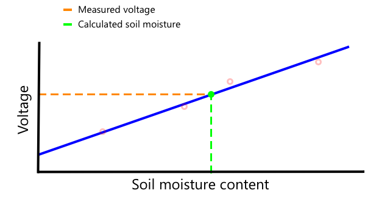

<!--
CO_OP_TRANSLATOR_METADATA:
{
  "original_hash": "4fb20273d299dc8d07a8f06c9cd0cdd9",
  "translation_date": "2025-08-27T22:53:01+00:00",
  "source_file": "2-farm/lessons/2-detect-soil-moisture/README.md",
  "language_code": "cs"
}
-->
C, vyslovováno *I-squared-C*, je protokol pro komunikaci mezi více řadiči a periferiemi, kde každé připojené zařízení může fungovat jako řadič nebo periferie komunikující přes I²C sběrnici (název pro systém přenosu dat). Data jsou posílána jako adresované pakety, přičemž každý paket obsahuje adresu zařízení, pro které je určen.

> 💁 Tento model byl dříve označován jako master/slave, ale tato terminologie se opouští kvůli její spojitosti s otroctvím. [Open Source Hardware Association přijala označení controller/peripheral](https://www.oshwa.org/a-resolution-to-redefine-spi-signal-names/), ale stále můžete narazit na odkazy na starou terminologii.

Zařízení mají adresu, která se používá při připojení k I²C sběrnici, a obvykle je pevně nastavena na zařízení. Například každý typ Grove senzoru od Seeed má stejnou adresu, takže všechny světelné senzory mají stejnou adresu, všechny tlačítka mají stejnou adresu, která se liší od adresy světelného senzoru. Některá zařízení umožňují změnit adresu, například změnou nastavení jumperů nebo propojením pinů.

I²C má sběrnici složenou ze 2 hlavních vodičů spolu s 2 napájecími vodiči:

| Vodič | Název | Popis |
| ---- | --------- | ----------- |
| SDA | Serial Data | Tento vodič slouží k přenosu dat mezi zařízeními. |
| SCL | Serial Clock | Tento vodič posílá hodinový signál rychlostí nastavenou řadičem. |
| VCC | Voltage common collector | Napájení pro zařízení. Je připojeno k vodičům SDA a SCL, aby jim poskytovalo napájení přes pull-up rezistor, který vypíná signál, když žádné zařízení není řadičem. |
| GND | Ground | Poskytuje společnou zem pro elektrický obvod. |

Pro přenos dat jedno zařízení vydá startovací podmínku, aby ukázalo, že je připraveno posílat data. Poté se stane řadičem. Řadič následně pošle adresu zařízení, se kterým chce komunikovat, spolu s informací, zda chce data číst nebo zapisovat. Po přenosu dat řadič pošle stopovací podmínku, aby naznačil, že skončil. Poté se jiné zařízení může stát řadičem a posílat nebo přijímat data.

I2C má omezení rychlosti, s 3 různými režimy běžícími na pevně stanovených rychlostech. Nejrychlejší je režim vysoké rychlosti s maximální rychlostí 3,4 Mbps (megabitů za sekundu), i když jen velmi málo zařízení tuto rychlost podporuje. Například Raspberry Pi je omezeno na rychlý režim s rychlostí 400 Kbps (kilobitů za sekundu). Standardní režim běží na 100 Kbps.

> 💠Pokud používáte Raspberry Pi s Grove Base hat jako své IoT zařízení, na desce uvidíte několik I2C konektorů, které můžete použít ke komunikaci s I2C senzory. Analogové Grove senzory také používají I2C s ADC k odesílání analogových hodnot jako digitálních dat, takže světelný senzor, který jste použili, simuloval analogový pin, přičemž hodnota byla odeslána přes I2C, protože Raspberry Pi podporuje pouze digitální piny.

### Univerzální asynchronní přijímač-vysílač (UART)

UART zahrnuje fyzické obvody, které umožňují komunikaci mezi dvěma zařízeními. Každé zařízení má 2 komunikační piny - vysílací (Tx) a přijímací (Rx), přičemž Tx pin prvního zařízení je připojen k Rx pinu druhého zařízení a Tx pin druhého zařízení je připojen k Rx pinu prvního zařízení. To umožňuje přenos dat v obou směrech.

* Zařízení 1 vysílá data ze svého Tx pinu, která jsou přijímána zařízením 2 na jeho Rx pinu
* Zařízení 1 přijímá data na svém Rx pinu, která jsou vysílána zařízením 2 z jeho Tx pinu

> 🎓 Data jsou odesílána po jednom bitu, což se nazývá *sériová* komunikace. Většina operačních systémů a mikrokontrolérů má *sériové porty*, tedy připojení, která mohou odesílat a přijímat sériová data a jsou dostupná vašemu kódu.

UART zařízení mají [baudovou rychlost](https://wikipedia.org/wiki/Symbol_rate) (také známou jako symbolová rychlost), což je rychlost, jakou budou data odesílána a přijímána v bitech za sekundu. Běžná baudová rychlost je 9 600, což znamená, že každou sekundu je odesláno 9 600 bitů (0 a 1) dat.

UART používá startovací a koncové bity - to znamená, že odesílá startovací bit, aby naznačil, že se chystá odeslat bajt (8 bitů) dat, a poté koncový bit po odeslání 8 bitů.

Rychlost UART závisí na hardwaru, ale ani nejrychlejší implementace nepřekračují 6,5 Mbps (megabitů za sekundu, nebo milionů bitů, 0 nebo 1, odeslaných za sekundu).

UART můžete použít přes GPIO piny - můžete nastavit jeden pin jako Tx a druhý jako Rx, a poté je připojit k jinému zařízení.

> 💁 Pokud používáte Raspberry Pi s Grove Base hat jako své IoT zařízení, na desce uvidíte UART konektor, který můžete použít ke komunikaci se senzory využívajícími protokol UART.

### Sériové periferní rozhraní (SPI)

SPI je navrženo pro komunikaci na krátké vzdálenosti, například na mikrokontroléru pro komunikaci s úložným zařízením, jako je flash paměť. Je založeno na modelu řadič/periferie s jedním řadičem (obvykle procesorem IoT zařízení), který komunikuje s více periferiemi. Řadič vše ovládá výběrem periferie a odesíláním nebo požadováním dat.

> 💠Stejně jako I2C jsou termíny řadič a periferie nedávné změny, takže můžete stále narazit na starší termíny.

Řadiče SPI používají 3 vodiče spolu s 1 extra vodičem na periferii. Periferie používají 4 vodiče. Tyto vodiče jsou:

| Vodič | Název | Popis |
| ---- | --------- | ----------- |
| COPI | Výstup řadiče, vstup periferie | Tento vodič slouží k odesílání dat z řadiče do periferie. |
| CIPO | Vstup řadiče, výstup periferie | Tento vodič slouží k odesílání dat z periferie do řadiče. |
| SCLK | Sériový hodinový signál | Tento vodič odesílá hodinový signál rychlostí nastavenou řadičem. |
| CS   | Výběr čipu | Řadič má více vodičů, jeden na periferii, a každý vodič se připojuje k vodiči CS na odpovídající periferii. |

Vodič CS se používá k aktivaci jedné periferie najednou, komunikaci přes vodiče COPI a CIPO. Když řadič potřebuje změnit periferii, deaktivuje vodič CS připojený k aktuálně aktivní periferii a poté aktivuje vodič připojený k periferii, se kterou chce komunikovat dál.

SPI je *plně duplexní*, což znamená, že řadič může současně odesílat a přijímat data ze stejné periferie pomocí vodičů COPI a CIPO. SPI používá hodinový signál na vodiči SCLK k synchronizaci zařízení, takže na rozdíl od přímého odesílání přes UART nepotřebuje startovací a koncové bity.

Pro SPI nejsou definovány žádné rychlostní limity, přičemž implementace často dokážou přenášet několik megabajtů dat za sekundu.

IoT vývojové sady často podporují SPI přes některé GPIO piny. Například na Raspberry Pi můžete použít GPIO piny 19, 21, 23, 24 a 26 pro SPI.

### Bezdrátové připojení

Některé senzory mohou komunikovat přes standardní bezdrátové protokoly, jako je Bluetooth (hlavně Bluetooth Low Energy, nebo BLE), LoRaWAN (protokol **Lo**ng **Ra**nge s nízkou spotřebou energie) nebo WiFi. Tyto protokoly umožňují vzdáleným senzorům, které nejsou fyzicky připojeny k IoT zařízení, komunikovat.

Jedním z příkladů jsou komerční senzory vlhkosti půdy. Ty měří vlhkost půdy na poli a poté odesílají data přes LoRaWAN do centrálního zařízení, které data zpracuje nebo odešle přes internet. To umožňuje senzoru být vzdálený od IoT zařízení, které spravuje data, čímž se snižuje spotřeba energie a potřeba velkých WiFi sítí nebo dlouhých kabelů.

BLE je populární pro pokročilé senzory, jako jsou fitness trackery, které fungují na zápěstí. Tyto trackery kombinují více senzorů a odesílají data ze senzorů do IoT zařízení, například vašeho telefonu, přes BLE.

✅ Máte na sobě, ve svém domě nebo ve škole nějaké Bluetooth senzory? Mohou to být například teplotní senzory, senzory obsazenosti, sledovače zařízení nebo fitness zařízení.

Jedním z populárních způsobů připojení komerčních zařízení je Zigbee. Zigbee používá WiFi k vytvoření síťových struktur mezi zařízeními, kde každé zařízení se připojuje k co největšímu počtu blízkých zařízení, čímž vytváří velké množství spojení jako pavučina. Když jedno zařízení chce odeslat zprávu na internet, může ji odeslat nejbližším zařízením, která ji poté přeposílají dalším blízkým zařízením a tak dále, dokud nedosáhne koordinátora a může být odeslána na internet.

> 🐝 Název Zigbee odkazuje na taneček včel po návratu do úlu.

## Měření úrovně vlhkosti půdy

Úroveň vlhkosti půdy můžete měřit pomocí senzoru vlhkosti půdy, IoT zařízení a pokojové rostliny nebo blízkého záhonu půdy.

### Úkol - měření vlhkosti půdy

Projděte si příslušný návod k měření vlhkosti půdy pomocí vašeho IoT zařízení:

* [Arduino - Wio Terminal](wio-terminal-soil-moisture.md)
* [Jednodeskový počítač - Raspberry Pi](pi-soil-moisture.md)
* [Jednodeskový počítač - Virtuální zařízení](virtual-device-soil-moisture.md)

## Kalibrace senzoru

Senzory se spoléhají na měření elektrických vlastností, jako je odpor nebo kapacita.

> 🎓 Odpor, měřený v ohmech (Ω), je míra odporu vůči elektrickému proudu, který prochází materiálem. Když je na materiál aplikováno napětí, množství proudu, který jím prochází, závisí na odporu materiálu. Více si můžete přečíst na [stránce o elektrickém odporu na Wikipedii](https://wikipedia.org/wiki/Electrical_resistance_and_conductance).

> 🎓 Kapacita, měřená ve faradech (F), je schopnost komponenty nebo obvodu shromažďovat a ukládat elektrickou energii. Více si můžete přečíst na [stránce o kapacitě na Wikipedii](https://wikipedia.org/wiki/Capacitance).

Tato měření nejsou vždy užitečná - představte si teplotní senzor, který vám poskytne měření 22,5 kΩ! Místo toho je nutné naměřenou hodnotu převést na užitečnou jednotku kalibrací - tedy přiřazením naměřených hodnot k měřené veličině, aby bylo možné nové měření převést na správnou jednotku.

Některé senzory jsou již předkalibrované. Například teplotní senzor, který jste použili v předchozí lekci, byl již kalibrován tak, aby mohl vracet měření teploty ve °C. V továrně by první vyrobený senzor byl vystaven řadě známých teplot a měřen odpor. To by pak bylo použito k vytvoření výpočtu, který může převádět z naměřené hodnoty v Ω (jednotka odporu) na °C.

> 💁 Vzorec pro výpočet odporu z teploty se nazývá [Steinhart–Hartova rovnice](https://wikipedia.org/wiki/Steinhart–Hart_equation).

### Kalibrace senzoru vlhkosti půdy

Vlhkost půdy se měří pomocí gravimetrického nebo objemového obsahu vody.

* Gravimetrický je hmotnost vody v jednotkové hmotnosti půdy, měřená jako počet kilogramů vody na kilogram suché půdy
* Objemový je objem vody v jednotkovém objemu půdy, měřený jako počet kubických metrů vody na kubické metry suché půdy

> 🇺🇸 Pro Američany, díky konzistenci jednotek, lze tyto hodnoty měřit v librách místo kilogramů nebo v kubických stopách místo kubických metrů.

Senzory vlhkosti půdy měří elektrický odpor nebo kapacitu - to se mění nejen podle vlhkosti půdy, ale také podle typu půdy, protože složky v půdě mohou měnit její elektrické vlastnosti. Ideálně by měly být senzory kalibrovány - tedy odebráním hodnot ze senzoru a jejich porovnáním s měřeními získanými vědeckým přístupem. Například laboratoř může vypočítat gravimetrickou vlhkost půdy pomocí vzorků konkrétního pole odebraných několikrát ročně a tyto hodnoty použít ke kalibraci senzoru, přiřazením hodnoty senzoru k gravimetrické vlhkosti půdy.

Výše uvedený graf ukazuje, jak kalibrovat senzor. Napětí je zachyceno pro vzorek půdy, který je poté měřen v laboratoři porovnáním vlhkého hmotnosti se suchou hmotností (měřením hmotnosti vlhké, poté sušením v troubě a měřením suché). Jakmile je odebráno několik hodnot, mohou být vykresleny na grafu a na body může být přizpůsobena čára. Tato čára pak může být použita k převodu hodnot senzoru vlhkosti půdy odebraných IoT zařízením na skutečná měření vlhkosti půdy.

💁 U odporových senzorů vlhkosti půdy napětí roste s rostoucí vlhkostí půdy. U kapacitních senzorů vlhkosti půdy napětí klesá s rostoucí vlhkostí půdy, takže grafy pro tyto senzory by klesaly, nikoli stoupaly.

Výše uvedený graf ukazuje hodnotu napětí ze senzoru vlhkosti půdy, a sledováním této hodnoty k čáře na grafu lze vypočítat skutečnou vlhkost půdy.

Tento přístup znamená, že farmář potřebuje získat jen několik laboratorních měření pro pole, poté může použít IoT zařízení k měření vlhkosti půdy - což výrazně urychluje čas potřebný k měření.

---

## 🚀 Výzva

Odporové a kapacitní senzory vlhkosti půdy mají řadu rozdílů. Jaké jsou tyto rozdíly a který typ (pokud vůbec) je nejlepší pro farmáře? Mění se tato odpověď mezi rozvojovými a rozvinutými zeměmi?

## Kvíz po přednášce

[Kvíz po přednášce](https://black-meadow-040d15503.1.azurestaticapps.net/quiz/12)

## Přehled a samostudium

Přečtěte si o hardwaru a protokolech používaných senzory a aktuátory:

* [GPIO stránka na Wikipedii](https://wikipedia.org/wiki/General-purpose_input/output)
* [UART stránka na Wikipedii](https://wikipedia.org/wiki/Universal_asynchronous_receiver-transmitter)
* [SPI stránka na Wikipedii](https://wikipedia.org/wiki/Serial_Peripheral_Interface)
* [I2C stránka na Wikipedii](https://wikipedia.org/wiki/I²C)
* [Zigbee stránka na Wikipedii](https://wikipedia.org/wiki/Zigbee)

## Zadání

[Kalibrujte svůj senzor](assignment.md)

---

**Prohlášení**:  
Tento dokument byl přeložen pomocí služby AI pro překlady [Co-op Translator](https://github.com/Azure/co-op-translator). Ačkoli se snažíme o přesnost, mějte prosím na paměti, že automatizované překlady mohou obsahovat chyby nebo nepřesnosti. Původní dokument v jeho původním jazyce by měl být považován za autoritativní zdroj. Pro důležité informace se doporučuje profesionální lidský překlad. Neodpovídáme za žádná nedorozumění nebo nesprávné interpretace vyplývající z použití tohoto překladu.