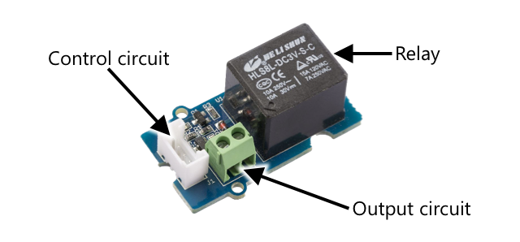

<!--
CO_OP_TRANSLATOR_METADATA:
{
  "original_hash": "f7bb24ba53fb627ddb38a8b24a05e594",
  "translation_date": "2025-08-27T23:27:03+00:00",
  "source_file": "2-farm/lessons/3-automated-plant-watering/README.md",
  "language_code": "cs"
}
-->
# Automatické zavlažování rostlin


> Sketchnote od [Nitya Narasimhan](https://github.com/nitya). Klikněte na obrázek pro větší verzi.

Tato lekce byla součástí [IoT pro začátečníky Projekt 2 - série Digitální zemědělství](https://youtube.com/playlist?list=PLmsFUfdnGr3yCutmcVg6eAUEfsGiFXgcx) od [Microsoft Reactor](https://developer.microsoft.com/reactor/?WT.mc_id=academic-17441-jabenn).

[](https://youtu.be/g9FfZwv9R58)

## Kvíz před lekcí

[Kvíz před lekcí](https://black-meadow-040d15503.1.azurestaticapps.net/quiz/13)

## Úvod

V minulé lekci jste se naučili, jak monitorovat vlhkost půdy. V této lekci se naučíte, jak vytvořit základní komponenty automatického zavlažovacího systému, který reaguje na vlhkost půdy. Také se dozvíte o načasování – jak senzory mohou potřebovat čas na reakci na změny a jak aktuátory mohou potřebovat čas na změnu vlastností měřených senzory.

V této lekci se zaměříme na:

* [Ovládání zařízení s vysokým výkonem z IoT zařízení s nízkým výkonem](../../../../../2-farm/lessons/3-automated-plant-watering)
* [Ovládání relé](../../../../../2-farm/lessons/3-automated-plant-watering)
* [Ovládání rostliny přes MQTT](../../../../../2-farm/lessons/3-automated-plant-watering)
* [Načasování senzorů a aktuátorů](../../../../../2-farm/lessons/3-automated-plant-watering)
* [Přidání načasování do serveru pro ovládání rostlin](../../../../../2-farm/lessons/3-automated-plant-watering)

## Ovládání zařízení s vysokým výkonem z IoT zařízení s nízkým výkonem

IoT zařízení používají nízké napětí. Zatímco to stačí pro senzory a aktuátory s nízkým výkonem, jako jsou LED diody, je to příliš málo na ovládání většího hardwaru, například vodního čerpadla používaného pro zavlažování. I malá čerpadla, která byste mohli použít pro pokojové rostliny, spotřebovávají příliš mnoho proudu pro IoT vývojovou desku a mohly by ji poškodit.

> 🎓 Proud, měřený v ampérech (A), je množství elektřiny, které prochází obvodem. Napětí poskytuje tlak, proud určuje, kolik je tlačeno. Více o proudu si můžete přečíst na [stránce o elektrickém proudu na Wikipedii](https://wikipedia.org/wiki/Electric_current).

Řešením je mít čerpadlo připojené k externímu zdroji napájení a použít aktuátor k zapnutí čerpadla, podobně jako byste zapnuli světlo. K zapnutí vypínače stačí malá množství energie (ve formě energie vašeho těla), což připojí světlo k síťovému napájení běžícímu na 110V/240V.


> 🎓 [Síťová elektřina](https://wikipedia.org/wiki/Mains_electricity) označuje elektřinu dodávanou do domácností a podniků prostřednictvím národní infrastruktury v mnoha částech světa.

✅ IoT zařízení obvykle poskytují 3,3V nebo 5V, při méně než 1 ampéru (1A) proudu. Porovnejte to se síťovou elektřinou, která je nejčastěji na 230V (120V v Severní Americe a 100V v Japonsku) a může napájet zařízení, která spotřebovávají 30A.

Existuje řada aktuátorů, které to dokážou, včetně mechanických zařízení, která můžete připojit k existujícím vypínačům a napodobit prst, který je zapíná. Nejoblíbenější je relé.

### Relé

Relé je elektromechanický spínač, který převádí elektrický signál na mechanický pohyb, který zapne spínač. Jádrem relé je elektromagnet.

> 🎓 [Elektromagnety](https://wikipedia.org/wiki/Electromagnet) jsou magnety, které vznikají průchodem elektřiny cívkou drátu. Když je elektřina zapnuta, cívka se zmagnetizuje. Když je elektřina vypnuta, cívka ztrácí magnetismus.


V relé napájí ovládací obvod elektromagnet. Když je elektromagnet zapnutý, přitáhne páku, která pohne spínačem, uzavře pár kontaktů a dokončí výstupní obvod.


Když je ovládací obvod vypnutý, elektromagnet se vypne, uvolní páku a otevře kontakty, čímž vypne výstupní obvod. Relé jsou digitální aktuátory – vysoký signál relé zapne, nízký signál ho vypne.

Výstupní obvod může být použit k napájení dalšího hardwaru, například zavlažovacího systému. IoT zařízení může relé zapnout, čímž dokončí výstupní obvod napájející zavlažovací systém, a rostliny se zalijí. IoT zařízení může poté relé vypnout, čímž přeruší napájení zavlažovacího systému a zastaví vodu.


Ve videu výše je relé zapnuto. LED na relé se rozsvítí, aby indikovala, že je zapnuto (některé desky relé mají LED diody, které indikují, zda je relé zapnuto nebo vypnuto), a napájení je posláno do čerpadla, které se zapne a pumpuje vodu do rostliny.

> 💁 Relé může být také použito k přepínání mezi dvěma výstupními obvody místo zapínání a vypínání jednoho. Jak se páka pohybuje, přepíná spínač z dokončení jednoho výstupního obvodu na dokončení jiného výstupního obvodu, obvykle sdílejícího společné napájení nebo společné uzemnění.

✅ Udělejte si průzkum: Existuje několik typů relé, s rozdíly, jako je to, zda ovládací obvod relé zapne nebo vypne, když je napájen, nebo více výstupních obvodů. Zjistěte více o těchto různých typech.

Když se páka pohybuje, obvykle slyšíte, jak se dotkne elektromagnetu s dobře definovaným kliknutím.

> 💁 Relé může být zapojeno tak, že vytvoření spojení vlastně přeruší napájení relé, čímž relé vypne, což pak pošle napájení zpět do relé, aby se znovu zapnulo, a tak dále. To znamená, že relé bude kliknout velmi rychle a vydávat bzučivý zvuk. Takto fungovaly některé z prvních bzučáků používaných v elektrických zvoncích.

### Napájení relé

Elektromagnet nepotřebuje mnoho energie k aktivaci a přitažení páky, může být ovládán pomocí 3,3V nebo 5V výstupu z IoT vývojové desky. Výstupní obvod může přenášet mnohem více energie, v závislosti na relé, včetně síťového napětí nebo dokonce vyšších úrovní výkonu pro průmyslové použití. Tímto způsobem může IoT vývojová deska ovládat zavlažovací systém, od malého čerpadla pro jednu rostlinu až po masivní průmyslový systém pro celé komerční farmy.



Obrázek výše ukazuje relé Grove. Ovládací obvod se připojuje k IoT zařízení a zapíná nebo vypíná relé pomocí 3,3V nebo 5V. Výstupní obvod má dva terminály, jeden může být napájení nebo uzemnění. Výstupní obvod může zvládnout až 250V při 10A, což je dost pro řadu zařízení napájených ze sítě. Můžete získat relé, která zvládnou ještě vyšší úrovně výkonu.


Na obrázku výše je čerpadlo napájeno přes relé. Červený drát spojuje +5V terminál USB napájecího zdroje s jedním terminálem výstupního obvodu relé a další červený drát spojuje druhý terminál výstupního obvodu s čerpadlem. Černý drát spojuje čerpadlo s uzemněním USB napájecího zdroje. Když se relé zapne, dokončí obvod, pošle 5V do čerpadla a zapne čerpadlo.

## Ovládání relé

Relé můžete ovládat z vaší IoT vývojové desky.

### Úkol - ovládání relé

Projděte si příslušný návod k ovládání relé pomocí vašeho IoT zařízení:

* [Arduino - Wio Terminal](wio-terminal-relay.md)
* [Jednodeskový počítač - Raspberry Pi](pi-relay.md)
* [Jednodeskový počítač - Virtuální zařízení](virtual-device-relay.md)

## Ovládání rostliny přes MQTT

Doposud bylo vaše relé ovládáno přímo IoT zařízením na základě jednoho měření vlhkosti půdy. V komerčním zavlažovacím systému bude řídicí logika centralizovaná, což umožní rozhodování o zavlažování na základě dat z více senzorů a umožní změnu konfigurace na jednom místě. Pro simulaci tohoto procesu můžete ovládat relé přes MQTT.

### Úkol - ovládání relé přes MQTT

1. Přidejte příslušné MQTT knihovny/pip balíčky a kód do vašeho projektu `soil-moisture-sensor`, aby se připojil k MQTT. Pojmenujte ID klienta jako `soilmoisturesensor_client` s předponou vašeho ID.

    > ⚠️ Můžete se odkazovat na [instrukce pro připojení k MQTT v projektu 1, lekce 4, pokud je to potřeba](../../../1-getting-started/lessons/4-connect-internet/README.md#connect-your-iot-device-to-mqtt).

1. Přidejte příslušný kód zařízení pro odesílání telemetrie s nastavením vlhkosti půdy. Pro telemetrickou zprávu pojmenujte vlastnost `soil_moisture`.

    > ⚠️ Můžete se odkazovat na [instrukce pro odesílání telemetrie do MQTT v projektu 1, lekce 4, pokud je to potřeba](../../../1-getting-started/lessons/4-connect-internet/README.md#send-telemetry-from-your-iot-device).

1. Vytvořte místní serverový kód pro odběr telemetrie a odesílání příkazu k ovládání relé ve složce nazvané `soil-moisture-sensor-server`. Pojmenujte vlastnost v příkazové zprávě `relay_on` a nastavte ID klienta jako `soilmoisturesensor_server` s předponou vašeho ID. Zachovejte stejnou strukturu jako serverový kód, který jste napsali pro projekt 1, lekce 4, protože k tomuto kódu budete přidávat později v této lekci.

    > ⚠️ Můžete se odkazovat na [instrukce pro odesílání telemetrie do MQTT](../../../1-getting-started/lessons/4-connect-internet/README.md#write-the-server-code) a [odesílání příkazů přes MQTT](../../../1-getting-started/lessons/4-connect-internet/README.md#send-commands-to-the-mqtt-broker) v projektu 1, lekce 4, pokud je to potřeba.

1. Přidejte příslušný kód zařízení pro ovládání relé z přijatých příkazů, pomocí vlastnosti `relay_on` ze zprávy. Odesílejte hodnotu true pro `relay_on`, pokud je `soil_moisture` větší než 450, jinak odesílejte false, stejně jako logiku, kterou jste přidali pro IoT zařízení dříve.

    > ⚠️ Můžete se odkazovat na [instrukce pro reakci na příkazy z MQTT v projektu 1, lekce 4, pokud je to potřeba](../../../1-getting-started/lessons/4-connect-internet/README.md#handle-commands-on-the-iot-device).

> 💁 Tento kód najdete ve složce [code-mqtt](../../../../../2-farm/lessons/3-automated-plant-watering/code-mqtt).

Ujistěte se, že kód běží na vašem zařízení a místním serveru, a otestujte ho změnou úrovní vlhkosti půdy, buď změnou hodnot odesílaných virtuálním senzorem, nebo změnou úrovní vlhkosti půdy přidáním vody nebo odstraněním senzoru z půdy.

## Načasování senzorů a aktuátorů

V lekci 3 jste vytvořili noční světlo – LED, která se rozsvítí, jakmile senzor světla detekuje nízkou úroveň světla. Senzor světla detekoval změnu úrovně světla okamžitě a zařízení mohlo rychle reagovat, omezeno pouze délkou zpoždění ve funkci `loop` nebo smyčce `while True:`. Jako IoT vývojář se nemůžete vždy spoléhat na tak rychlou zpětnou vazbu.

### Načasování pro vlhkost půdy

Pokud jste v minulé lekci pracovali s fyzickým senzorem vlhkosti půdy, mohli jste si všimnout, že trvalo několik sekund, než se hodnota vlhkosti půdy snížila poté, co jste zalili rostlinu. To není způsobeno pomalostí senzoru, ale tím, že voda potřebuje čas na prosáknutí půdou.
💁 Pokud jste zalévali příliš blízko senzoru, mohli jste si všimnout, že hodnota rychle klesla a poté se opět zvýšila – to je způsobeno tím, že voda v blízkosti senzoru se rozšířila do zbytku půdy, což snížilo vlhkost půdy v okolí senzoru.


Na diagramu výše je zobrazeno měření vlhkosti půdy s hodnotou 658. Rostlina je zalévána, ale tato hodnota se okamžitě nezmění, protože voda ještě nedosáhla senzoru. Zalévání může dokonce skončit dříve, než voda dosáhne senzoru, a hodnota klesne, aby odrážela novou úroveň vlhkosti.

Pokud byste psali kód pro ovládání zavlažovacího systému pomocí relé na základě úrovní vlhkosti půdy, museli byste vzít tento zpoždění v úvahu a vytvořit chytřejší časování pro vaše IoT zařízení.

✅ Zamyslete se na chvíli, jak byste to mohli udělat.

### Ovládání časování senzoru a aktuátoru

Představte si, že máte za úkol vytvořit zavlažovací systém pro farmu. Na základě typu půdy byla ideální úroveň vlhkosti půdy pro pěstované rostliny stanovena na analogové napětí v rozmezí 400–450.

Mohli byste naprogramovat zařízení podobně jako noční světlo – pokaždé, když senzor naměří hodnotu nad 450, zapne relé, které spustí čerpadlo. Problém je, že voda potřebuje čas, aby se z čerpadla dostala přes půdu k senzoru. Senzor zastaví vodu, když detekuje úroveň 450, ale úroveň vlhkosti bude nadále klesat, protože čerpaná voda stále prosakuje půdou. Výsledkem je plýtvání vodou a riziko poškození kořenů.

✅ Pamatujte – příliš mnoho vody může být pro rostliny stejně špatné jako příliš málo a plýtvá cenným zdrojem.

Lepším řešením je pochopit, že mezi zapnutím aktuátoru a změnou vlastnosti, kterou senzor měří, existuje zpoždění. To znamená, že senzor by měl nejen chvíli počkat, než znovu změří hodnotu, ale aktuátor by měl být vypnutý na určitou dobu před dalším měřením senzoru.

Jak dlouho by mělo být relé zapnuté při každém cyklu? Je lepší být opatrný a zapnout relé jen na krátkou dobu, počkat, až voda prosákne, a poté znovu zkontrolovat úroveň vlhkosti. Koneckonců, můžete vždy znovu zapnout čerpadlo, abyste přidali více vody, ale nemůžete vodu z půdy odebrat.

> 💁 Tento typ časového ovládání je velmi specifický pro IoT zařízení, které stavíte, vlastnost, kterou měříte, a použité senzory a aktuátory.


Například mám jahodovou rostlinu se senzorem vlhkosti půdy a čerpadlem ovládaným relé. Zjistil jsem, že když přidám vodu, trvá asi 20 sekund, než se měření vlhkosti půdy stabilizuje. To znamená, že musím relé vypnout a počkat 20 sekund, než zkontroluji úroveň vlhkosti. Raději budu mít málo vody než příliš mnoho – čerpadlo mohu vždy znovu zapnout, ale nemohu vodu z rostliny odebrat.


To znamená, že nejlepší proces by byl zavlažovací cyklus, který vypadá takto:

* Zapnout čerpadlo na 5 sekund
* Počkat 20 sekund
* Zkontrolovat vlhkost půdy
* Pokud je úroveň stále nad požadovanou hodnotou, opakovat výše uvedené kroky

5 sekund může být pro čerpadlo příliš dlouhá doba, zvláště pokud jsou úrovně vlhkosti jen mírně nad požadovanou hodnotou. Nejlepší způsob, jak zjistit, jaké časování použít, je vyzkoušet to, poté upravit na základě dat ze senzoru, s neustálou zpětnou vazbou. To může dokonce vést k jemnějšímu časování, například zapnutí čerpadla na 1 sekundu za každých 100 nad požadovanou úroveň vlhkosti půdy, místo pevně stanovených 5 sekund.

✅ Udělejte si průzkum: Existují další časové faktory, které je třeba zvážit? Může být rostlina zalévána kdykoli, když je vlhkost půdy příliš nízká, nebo existují konkrétní denní doby, které jsou vhodné a nevhodné pro zalévání rostlin?

> 💁 Předpovědi počasí mohou být také zohledněny při ovládání automatizovaných zavlažovacích systémů pro venkovní pěstování. Pokud se očekává déšť, zavlažování může být odloženo až po skončení deště. V té chvíli může být půda dostatečně vlhká, takže není potřeba zalévat, což je mnohem efektivnější než plýtvání vodou těsně před deštěm.

## Přidání časování do serveru pro ovládání rostlin

Kód serveru může být upraven tak, aby přidal kontrolu nad časováním zavlažovacího cyklu a čekáním na změnu úrovní vlhkosti půdy. Logika serveru pro ovládání časování relé je:

1. Přijmout telemetrickou zprávu
1. Zkontrolovat úroveň vlhkosti půdy
1. Pokud je v pořádku, nedělat nic. Pokud je hodnota příliš vysoká (což znamená, že vlhkost půdy je příliš nízká), pak:
    1. Poslat příkaz k zapnutí relé
    1. Počkat 5 sekund
    1. Poslat příkaz k vypnutí relé
    1. Počkat 20 sekund, než se úroveň vlhkosti půdy stabilizuje

Zavlažovací cyklus, proces od přijetí telemetrické zprávy po připravenost zpracovat úrovně vlhkosti půdy znovu, trvá asi 25 sekund. Posíláme úrovně vlhkosti půdy každých 10 sekund, takže existuje překryv, kdy je zpráva přijata, zatímco server čeká na stabilizaci úrovní vlhkosti půdy, což by mohlo spustit další zavlažovací cyklus.

Existují dvě možnosti, jak tento problém vyřešit:

* Změnit kód IoT zařízení tak, aby posílalo telemetrii pouze každou minutu, tím pádem bude zavlažovací cyklus dokončen před odesláním další zprávy
* Odhlásit se z telemetrie během zavlažovacího cyklu

První možnost není vždy dobrým řešením pro velké farmy. Farmář může chtít zachytit úrovně vlhkosti půdy během zavlažování pro pozdější analýzu, například aby byl informován o průtoku vody v různých oblastech farmy a mohl lépe cílit zavlažování. Druhá možnost je lepší – kód jednoduše ignoruje telemetrii, když ji nemůže využít, ale telemetrie je stále k dispozici pro jiné služby, které ji mohou odebírat.

> 💁 IoT data nejsou posílána pouze z jednoho zařízení do jedné služby, místo toho mnoho zařízení může posílat data do brokeru a mnoho služeb může data z brokeru poslouchat. Například jedna služba může poslouchat data o vlhkosti půdy a ukládat je do databáze pro analýzu později. Jiná služba může poslouchat stejnou telemetrii pro ovládání zavlažovacího systému.

### Úkol – přidání časování do serveru pro ovládání rostlin

Aktualizujte kód serveru tak, aby relé běželo 5 sekund, poté čekalo 20 sekund.

1. Otevřete složku `soil-moisture-sensor-server` ve VS Code, pokud již není otevřená. Ujistěte se, že je aktivováno virtuální prostředí.

1. Otevřete soubor `app.py`

1. Přidejte následující kód do souboru `app.py` pod stávající importy:

    ```python
    import threading
    ```

    Tento příkaz importuje `threading` z knihoven Pythonu, což umožňuje Pythonu vykonávat jiný kód během čekání.

1. Přidejte následující kód před funkci `handle_telemetry`, která zpracovává telemetrické zprávy přijaté serverovým kódem:

    ```python
    water_time = 5
    wait_time = 20
    ```

    Tím se definuje, jak dlouho má relé běžet (`water_time`) a jak dlouho má čekat poté, než zkontroluje vlhkost půdy (`wait_time`).

1. Pod tento kód přidejte následující:

    ```python
    def send_relay_command(client, state):
        command = { 'relay_on' : state }
        print("Sending message:", command)
        client.publish(server_command_topic, json.dumps(command))
    ```

    Tento kód definuje funkci nazvanou `send_relay_command`, která posílá příkaz přes MQTT k ovládání relé. Telemetrie je vytvořena jako slovník, poté převedena na JSON řetězec. Hodnota předaná do `state` určuje, zda má být relé zapnuto nebo vypnuto.

1. Po funkci `send_relay_code` přidejte následující kód:

    ```python
    def control_relay(client):
        print("Unsubscribing from telemetry")
        mqtt_client.unsubscribe(client_telemetry_topic)
    
        send_relay_command(client, True)
        time.sleep(water_time)
        send_relay_command(client, False)
    
        time.sleep(wait_time)
    
        print("Subscribing to telemetry")
        mqtt_client.subscribe(client_telemetry_topic)
    ```

    Tím se definuje funkce pro ovládání relé na základě požadovaného časování. Začíná odhlášením z telemetrie, aby zprávy o vlhkosti půdy nebyly zpracovávány během zavlažování. Poté posílá příkaz k zapnutí relé. Následně čeká po dobu `water_time`, než pošle příkaz k vypnutí relé. Nakonec čeká na stabilizaci úrovní vlhkosti půdy po dobu `wait_time` sekund. Poté se znovu přihlásí k telemetrii.

1. Změňte funkci `handle_telemetry` na následující:

    ```python
    def handle_telemetry(client, userdata, message):
        payload = json.loads(message.payload.decode())
        print("Message received:", payload)
    
        if payload['soil_moisture'] > 450:
            threading.Thread(target=control_relay, args=(client,)).start()
    ```

    Tento kód kontroluje úroveň vlhkosti půdy. Pokud je vyšší než 450, půda potřebuje zalít, takže volá funkci `control_relay`. Tato funkce běží na samostatném vlákně, které běží na pozadí.

1. Ujistěte se, že vaše IoT zařízení běží, poté spusťte tento kód. Změňte úrovně vlhkosti půdy a sledujte, co se děje s relé – mělo by se zapnout na 5 sekund, poté zůstat vypnuté alespoň 20 sekund, zapnout se pouze tehdy, pokud úrovně vlhkosti půdy nejsou dostatečné.

    ```output
    (.venv) ➜  soil-moisture-sensor-server ✗ python app.py
    Message received: {'soil_moisture': 457}
    Unsubscribing from telemetry
    Sending message: {'relay_on': True}
    Sending message: {'relay_on': False}
    Subscribing to telemetry
    Message received: {'soil_moisture': 302}
    ```

    Dobrý způsob, jak to otestovat v simulovaném zavlažovacím systému, je použít suchou půdu, poté ručně nalít vodu, zatímco je relé zapnuté, a přestat nalévat, když se relé vypne.

> 💁 Tento kód najdete ve složce [code-timing](../../../../../2-farm/lessons/3-automated-plant-watering/code-timing).

> 💁 Pokud chcete použít čerpadlo k vytvoření skutečného zavlažovacího systému, můžete použít [6V vodní čerpadlo](https://www.seeedstudio.com/6V-Mini-Water-Pump-p-1945.html) s [USB napájecím terminálem](https://www.adafruit.com/product/3628). Ujistěte se, že napájení do nebo z čerpadla je připojeno přes relé.

---

## 🚀 Výzva

Napadá vás nějaké jiné IoT nebo elektrické zařízení, které má podobný problém, kdy trvá nějakou dobu, než výsledky aktuátoru dosáhnou senzoru? Pravděpodobně máte několik takových zařízení doma nebo ve škole.

* Jaké vlastnosti měří?
* Jak dlouho trvá, než se vlastnost změní po použití aktuátoru?
* Je v pořádku, pokud se vlastnost změní nad požadovanou hodnotu?
* Jak ji lze vrátit zpět na požadovanou hodnotu, pokud je to potřeba?

## Kvíz po přednášce

[Kvíz po přednášce](https://black-meadow-040d15503.1.azurestaticapps.net/quiz/14)

## Přehled & Samostudium

* Přečtěte si více o relé, včetně jejich historického využití v telefonních ústřednách, na [stránce Wikipedia o relé](https://wikipedia.org/wiki/Relay).

## Zadání

[Vybudujte efektivnější zavlažovací cyklus](assignment.md)

---

**Prohlášení**:  
Tento dokument byl přeložen pomocí služby pro automatický překlad [Co-op Translator](https://github.com/Azure/co-op-translator). I když se snažíme o přesnost, mějte na paměti, že automatické překlady mohou obsahovat chyby nebo nepřesnosti. Původní dokument v jeho původním jazyce by měl být považován za autoritativní zdroj. Pro kritické informace se doporučuje profesionální lidský překlad. Nenese odpovědnost za žádné nedorozumění nebo nesprávné interpretace vyplývající z použití tohoto překladu.