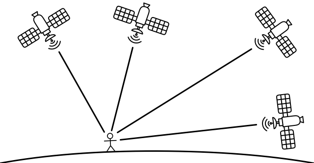

<!--
CO_OP_TRANSLATOR_METADATA:
{
  "original_hash": "52ed2bd997d08040f79a1a6ef2bac958",
  "translation_date": "2025-08-27T21:38:47+00:00",
  "source_file": "3-transport/lessons/1-location-tracking/README.md",
  "language_code": "cs"
}
-->
# Sledování polohy

> Sketchnote od [Nitya Narasimhan](https://github.com/nitya). Klikněte na obrázek pro větší verzi.

## Kvíz před přednáškou

[Kvíz před přednáškou](https://black-meadow-040d15503.1.azurestaticapps.net/quiz/21)

## Úvod

Hlavní proces, jak dostat potraviny od farmáře ke spotřebiteli, zahrnuje nakládání beden s produkty na nákladní auta, lodě, letadla nebo jiná komerční dopravní vozidla a jejich doručení na určité místo – buď přímo zákazníkovi, nebo do centrálního skladu či zpracovatelského centra. Celý tento proces od farmy ke spotřebiteli je součástí procesu nazývaného *dodavatelský řetězec*. Video níže z W. P. Carey School of Business na Arizona State University podrobněji vysvětluje koncept dodavatelského řetězce a jeho řízení.

> 🎥 Klikněte na obrázek výše pro zhlédnutí videa

Přidání IoT zařízení může výrazně zlepšit váš dodavatelský řetězec, umožní vám lépe spravovat, kde se položky nacházejí, plánovat dopravu a manipulaci se zbožím a rychleji reagovat na problémy.

Při správě flotily vozidel, jako jsou nákladní auta, je užitečné vědět, kde se každé vozidlo v daném okamžiku nachází. Vozidla mohou být vybavena GPS senzory, které odesílají svou polohu do IoT systémů, což umožňuje majitelům určit jejich polohu, sledovat trasu, kterou urazila, a vědět, kdy dorazí na místo určení. Většina vozidel operuje mimo dosah WiFi, takže k odesílání těchto dat používají mobilní sítě. Někdy je GPS senzor součástí složitějších IoT zařízení, jako jsou elektronické záznamníky jízd. Tato zařízení sledují, jak dlouho je nákladní auto na cestě, aby zajistila, že řidiči dodržují místní zákony o pracovní době.

V této lekci se naučíte, jak sledovat polohu vozidla pomocí senzoru globálního polohového systému (GPS).

V této lekci se budeme zabývat:

* [Připojenými vozidly](../../../../../3-transport/lessons/1-location-tracking)
* [Geoprostorovými souřadnicemi](../../../../../3-transport/lessons/1-location-tracking)
* [Globálními polohovými systémy (GPS)](../../../../../3-transport/lessons/1-location-tracking)
* [Čtením dat ze senzoru GPS](../../../../../3-transport/lessons/1-location-tracking)
* [NMEA GPS daty](../../../../../3-transport/lessons/1-location-tracking)
* [Dekódováním dat ze senzoru GPS](../../../../../3-transport/lessons/1-location-tracking)

## Připojená vozidla

IoT mění způsob, jakým se zboží přepravuje, tím, že vytváří flotily *připojených vozidel*. Tato vozidla jsou připojena k centrálním IT systémům, které hlásí informace o jejich poloze a dalších senzorových datech. Mít flotilu připojených vozidel přináší řadu výhod:

* Sledování polohy – můžete přesně určit, kde se vozidlo nachází v daném okamžiku, což vám umožní:

  * Získat upozornění, když se vozidlo blíží k cíli, abyste mohli připravit posádku na vykládku
  * Lokalizovat odcizená vozidla
  * Kombinovat data o poloze a trase s dopravními problémy a umožnit přesměrování vozidel během cesty
  * Dodržovat daňové předpisy. Některé země účtují vozidlům poplatky za počet ujetých kilometrů na veřejných silnicích (například [RUC na Novém Zélandu](https://www.nzta.govt.nz/vehicles/licensing-rego/road-user-charges/)), takže vědět, kdy je vozidlo na veřejných vs. soukromých silnicích, usnadňuje výpočet dlužné daně.
  * Vědět, kam poslat údržbářské týmy v případě poruchy

* Telemetrie řidiče – možnost zajistit, že řidiči dodržují rychlostní limity, projíždějí zatáčky přiměřenou rychlostí, brzdí včas a efektivně a jezdí bezpečně. Připojená vozidla mohou mít také kamery pro záznam incidentů. To může být propojeno s pojištěním, což umožňuje snížené sazby pro dobré řidiče.

* Dodržování pracovní doby řidičů – zajištění, že řidiči jezdí pouze po zákonem povolenou dobu na základě časů, kdy zapnou a vypnou motor.

Tyto výhody lze kombinovat – například kombinovat dodržování pracovní doby řidičů se sledováním polohy, aby bylo možné přesměrovat řidiče, pokud nemohou dosáhnout cíle v rámci povolené pracovní doby. Tyto výhody lze také kombinovat s dalšími specifickými telemetrickými údaji o vozidle, jako jsou údaje o teplotě z chladírenských nákladních vozů, což umožňuje přesměrování vozidel, pokud by jejich aktuální trasa znamenala, že zboží nelze udržet v požadované teplotě.

> 🎓 Logistika je proces přepravy zboží z jednoho místa na druhé, například z farmy do supermarketu přes jeden nebo více skladů. Farmář zabalí bedny s rajčaty, které jsou naloženy na nákladní auto, doručeny do centrálního skladu a poté naloženy na druhé nákladní auto, které může obsahovat směs různých druhů produktů, jež jsou následně doručeny do supermarketu.

Základní součástí sledování vozidel je GPS – senzory, které mohou určit jejich polohu kdekoli na Zemi. V této lekci se naučíte, jak používat GPS senzor, počínaje tím, jak definovat polohu na Zemi.

## Geoprostorové souřadnice

Geoprostorové souřadnice se používají k definování bodů na povrchu Země, podobně jako se souřadnice používají k vykreslení pixelu na obrazovce počítače nebo k umístění stehů při vyšívání. Pro jeden bod máte dvojici souřadnic. Například kampus Microsoftu v Redmondu, Washington, USA se nachází na 47.6423109, -122.1390293.

### Zeměpisná šířka a délka

Země je koule – trojrozměrný kruh. Z tohoto důvodu jsou body definovány rozdělením na 360 stupňů, stejně jako geometrie kruhů. Zeměpisná šířka měří počet stupňů od severu k jihu, zeměpisná délka měří počet stupňů od východu k západu.

> 💁 Nikdo přesně neví, proč jsou kruhy rozděleny na 360 stupňů. [Stránka o stupních (úhlech) na Wikipedii](https://wikipedia.org/wiki/Degree_(angle)) pokrývá některé možné důvody.

Zeměpisná šířka se měří pomocí čar, které obkružují Zemi a běží paralelně s rovníkem, rozdělují severní a jižní polokouli na 90° každou. Rovník je na 0°, severní pól je na 90°, také známý jako 90° severní šířky, a jižní pól je na -90°, nebo 90° jižní šířky.

Zeměpisná délka se měří jako počet stupňů na východ a západ. Nulový poledník, označovaný jako *Prime Meridian*, byl v roce 1884 definován jako čára od severního k jižnímu pólu, která prochází [Královskou observatoří v Greenwichi, Anglie](https://wikipedia.org/wiki/Royal_Observatory,_Greenwich).

> 🎓 Poledník je imaginární přímka, která vede od severního pólu k jižnímu pólu a tvoří půlkruh.

Pro měření zeměpisné délky bodu měříte počet stupňů kolem rovníku od Prime Meridian k poledníku, který prochází tímto bodem. Zeměpisná délka se pohybuje od -180°, nebo 180° západní délky, přes 0° na Prime Meridian, až po 180°, nebo 180° východní délky. 180° a -180° označují stejný bod, antimeridián nebo 180. poledník. To je poledník na opačné straně Země od Prime Meridian.

> 💁 Antimeridián by neměl být zaměňován s mezinárodní datovou čarou, která se nachází přibližně na stejném místě, ale není přímá a mění se, aby se přizpůsobila geopolitickým hranicím.

✅ Udělejte si průzkum: Zkuste najít zeměpisnou šířku a délku svého aktuálního umístění.

### Stupně, minuty a sekundy vs. desetinné stupně

Tradičně se měření stupňů zeměpisné šířky a délky provádělo pomocí šedesátkové soustavy, nebo základu 60, což je číselný systém používaný starověkými Babylóňany, kteří jako první měřili a zaznamenávali čas a vzdálenost. Šedesátkovou soustavu pravděpodobně používáte každý den, aniž byste si to uvědomovali – například při dělení hodin na 60 minut a minut na 60 sekund.

Zeměpisná délka a šířka se měří ve stupních, minutách a sekundách, přičemž jedna minuta je 1/60 stupně a jedna sekunda je 1/60 minuty.

Například na rovníku:

* 1° zeměpisné šířky je **111,3 kilometrů**
* 1 minuta zeměpisné šířky je 111,3/60 = **1,855 kilometrů**
* 1 sekunda zeměpisné šířky je 1,855/60 = **0,031 kilometrů**

Symbol pro minutu je jednoduchá čárka, pro sekundu dvojitá čárka. Například 2 stupně, 17 minut a 43 sekund by se psalo jako 2°17'43". Části sekund se uvádějí jako desetinná čísla, například polovina sekundy je 0°0'0.5".

Počítače nepracují v šedesátkové soustavě, takže tyto souřadnice se v GPS datech většinou uvádějí jako desetinné stupně. Například 2°17'43" je 2.295277. Symbol stupně se obvykle vynechává.

Souřadnice bodu se vždy uvádějí jako `zeměpisná šířka, zeměpisná délka`, takže příklad uvedený dříve pro kampus Microsoftu na 47.6423109,-122.117198 má:

* Zeměpisnou šířku 47.6423109 (47.6423109 stupňů severně od rovníku)
* Zeměpisnou délku -122.1390293 (122.1390293 stupňů západně od Prime Meridian).

## Globální polohové systémy (GPS)

GPS systémy využívají více satelitů obíhajících Zemi k určení vaší polohy. Pravděpodobně jste GPS systémy používali, aniž byste si to uvědomovali – například k nalezení své polohy v mapové aplikaci na telefonu, jako je Apple Maps nebo Google Maps, nebo k zjištění, kde se nachází vaše jízda v aplikaci jako Uber nebo Lyft, nebo při používání satelitní navigace (sat-nav) ve vašem autě.

> 🎓 Satelity v „satelitní navigaci“ jsou GPS satelity!

GPS systémy fungují tak, že mají řadu satelitů, které vysílají signál s aktuální polohou každého satelitu a přesným časovým razítkem. Tyto signály jsou vysílány rádiovými vlnami a detekovány anténou v GPS senzoru. GPS senzor tyto signály detekuje a pomocí aktuálního času měří, jak dlouho trvalo, než signál dorazil ze satelitu k senzoru. Protože rychlost rádiových vln je konstantní, GPS senzor může pomocí časového razítka, které bylo odesláno, vypočítat, jak daleko je senzor od satelitu. Kombinací dat z alespoň 3 satelitů s odeslanými polohami je GPS senzor schopen určit svou polohu na Zemi.

> 💁 GPS senzory potřebují antény k detekci rádiových vln. Antény zabudované do nákladních aut a aut s vestavěným GPS jsou umístěny tak, aby měly dobrý signál, obvykle na čelním skle nebo střeše. Pokud používáte samostatný GPS systém, například chytrý telefon nebo IoT zařízení, musíte zajistit, aby anténa zabudovaná do GPS systému nebo telefonu měla jasný výhled na oblohu, například byla namontována na čelním skle.

GPS satelity obíhají Zemi, nejsou na pevném bodě nad senzorem, takže data o poloze zahrnují nadmořskou výšku nad hladinou moře i zeměpisnou šířku a délku.

GPS dříve mělo omezení přesnosti vynucené americkou armádou, která omezovala přesnost na přibližně 5 metrů. Toto omezení bylo v roce 2000 odstraněno, což umožnilo přesnost 30 centimetrů. Tuto přesnost však není vždy možné dosáhnout kvůli rušení signálů.

✅ Pokud máte chytrý telefon, spusťte mapovou aplikaci a zjistěte, jak přesná je vaše poloha. Může chvíli trvat, než váš telefon detekuje více satelitů a získá přesnější polohu.
💁 Satelity obsahují atomové hodiny, které jsou neuvěřitelně přesné, ale každý den se odchylují o 38 mikrosekund (0,0000038 sekundy) ve srovnání s atomovými hodinami na Zemi. To je způsobeno zpomalením času při zvyšující se rychlosti, jak předpověděly Einsteinovy teorie speciální a obecné relativity – satelity se pohybují rychleji než rotace Země. Tato odchylka byla použita k potvrzení předpovědí speciální a obecné relativity a musí být zohledněna při návrhu GPS systémů. Doslova čas na GPS satelitu běží pomaleji.
GPS systémy byly vyvinuty a nasazeny řadou zemí a politických unií, včetně USA, Ruska, Japonska, Indie, EU a Číny. Moderní GPS senzory se mohou připojit k většině těchto systémů, aby získaly rychlejší a přesnější údaje o poloze.

> 🎓 Skupiny satelitů v každém nasazení se označují jako konstelace.

## Čtení dat z GPS senzoru

Většina GPS senzorů posílá data přes UART.

> ⚠️ UART byl probírán v [projektu 2, lekci 2](../../../2-farm/lessons/2-detect-soil-moisture/README.md#universal-asynchronous-receiver-transmitter-uart). Pokud je to potřeba, vraťte se k této lekci.

Pomocí GPS senzoru na vašem IoT zařízení můžete získávat GPS data.

### Úkol - připojte GPS senzor a čtěte GPS data

Postupujte podle příslušného průvodce, abyste mohli číst GPS data pomocí svého IoT zařízení:

* [Arduino - Wio Terminal](wio-terminal-gps-sensor.md)
* [Jednodeskový počítač - Raspberry Pi](pi-gps-sensor.md)
* [Jednodeskový počítač - Virtuální zařízení](virtual-device-gps-sensor.md)

## NMEA GPS data

Když jste spustili svůj kód, mohli jste v výstupu vidět něco, co vypadá jako nesrozumitelný text. Ve skutečnosti se jedná o standardní GPS data, která mají svůj význam.

GPS senzory posílají data pomocí NMEA zpráv podle standardu NMEA 0183. NMEA je zkratka pro [National Marine Electronics Association](https://www.nmea.org), což je americká obchodní organizace, která stanovuje standardy pro komunikaci mezi námořní elektronikou.

> 💁 Tento standard je proprietární a jeho cena začíná na 2 000 USD, ale dostatek informací o něm je veřejně dostupný, takže většina standardu byla zpětně analyzována a může být použita v open source a jiném nekomerčním kódu.

Tyto zprávy jsou textového formátu. Každá zpráva se skládá z *věty*, která začíná znakem `$`, následují 2 znaky označující zdroj zprávy (např. GP pro americký GPS systém, GN pro GLONASS, ruský GPS systém) a 3 znaky označující typ zprávy. Zbytek zprávy tvoří pole oddělená čárkami, která končí znakem nového řádku.

Některé typy zpráv, které lze přijímat, jsou:

| Typ | Popis |
| ---- | ----------- |
| GGA | Data o GPS poloze, včetně zeměpisné šířky, délky a nadmořské výšky GPS senzoru, spolu s počtem satelitů v dosahu pro výpočet této polohy. |
| ZDA | Aktuální datum a čas, včetně místní časové zóny |
| GSV | Podrobnosti o satelitech v dosahu - definované jako satelity, od kterých GPS senzor dokáže přijímat signály |

> 💁 GPS data obsahují časové značky, takže vaše IoT zařízení může získat čas z GPS senzoru, místo aby se spoléhalo na NTP server nebo interní reálný časový modul.

Zpráva GGA obsahuje aktuální polohu ve formátu `(dd)dmm.mmmm`, spolu s jedním znakem označujícím směr. `d` ve formátu znamená stupně, `m` minuty, přičemž sekundy jsou vyjádřeny jako desetinné číslo minut. Například 2°17'43" by bylo 217.716666667 - 2 stupně, 17.716666667 minut.

Znak směru může být `N` nebo `S` pro zeměpisnou šířku, což označuje sever nebo jih, a `E` nebo `W` pro zeměpisnou délku, což označuje východ nebo západ. Například zeměpisná šířka 2°17'43" by měla znak směru `N`, -2°17'43" by měla znak směru `S`.

Například - NMEA věta `$GNGGA,020604.001,4738.538654,N,12208.341758,W,1,3,,164.7,M,-17.1,M,,*67`

* Část zeměpisné šířky je `4738.538654,N`, což se převede na 47.6423109 v desetinných stupních. `4738.538654` je 47.6423109 a směr je `N` (sever), takže jde o kladnou zeměpisnou šířku.

* Část zeměpisné délky je `12208.341758,W`, což se převede na -122.1390293 v desetinných stupních. `12208.341758` je 122.1390293° a směr je `W` (západ), takže jde o zápornou zeměpisnou délku.

## Dekódování dat z GPS senzoru

Místo použití surových NMEA dat je lepší je dekódovat do užitečnějšího formátu. Existuje mnoho open-source knihoven, které vám mohou pomoci extrahovat užitečná data ze surových NMEA zpráv.

### Úkol - dekódujte data z GPS senzoru

Postupujte podle příslušného průvodce, abyste dekódovali data z GPS senzoru pomocí svého IoT zařízení:

* [Arduino - Wio Terminal](wio-terminal-gps-decode.md)
* [Jednodeskový počítač - Raspberry Pi/Virtuální IoT zařízení](single-board-computer-gps-decode.md)

---

## 🚀 Výzva

Napište si vlastní NMEA dekodér! Místo spoléhání se na knihovny třetích stran pro dekódování NMEA vět, dokážete napsat vlastní dekodér, který extrahuje zeměpisnou šířku a délku z NMEA vět?

## Kvíz po lekci

[Kvíz po lekci](https://black-meadow-040d15503.1.azurestaticapps.net/quiz/22)

## Přehled a samostudium

* Přečtěte si více o geosférických souřadnicích na [stránce o geografickém souřadnicovém systému na Wikipedii](https://wikipedia.org/wiki/Geographic_coordinate_system).
* Přečtěte si o hlavních polednících na jiných nebeských tělesech kromě Země na [stránce o hlavním poledníku na Wikipedii](https://wikipedia.org/wiki/Prime_meridian#Prime_meridian_on_other_planetary_bodies).
* Prozkoumejte různé GPS systémy od různých vlád a politických unií, jako jsou EU, Japonsko, Rusko, Indie a USA.

## Zadání

[Prozkoumejte další GPS data](assignment.md)

---

**Prohlášení**:  
Tento dokument byl přeložen pomocí služby pro automatický překlad [Co-op Translator](https://github.com/Azure/co-op-translator). I když se snažíme o přesnost, mějte prosím na paměti, že automatické překlady mohou obsahovat chyby nebo nepřesnosti. Původní dokument v jeho původním jazyce by měl být považován za autoritativní zdroj. Pro důležité informace se doporučuje profesionální lidský překlad. Neodpovídáme za žádná nedorozumění nebo nesprávné interpretace vyplývající z použití tohoto překladu.