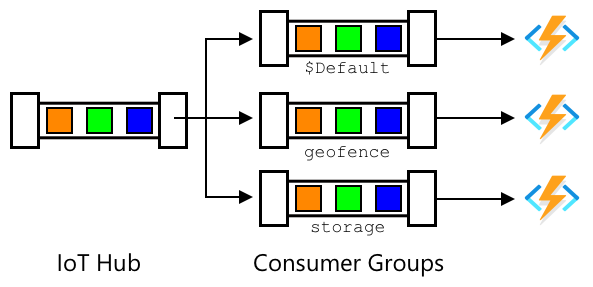

<!--
CO_OP_TRANSLATOR_METADATA:
{
  "original_hash": "078ae664c7b686bf069545e9a5fc95b2",
  "translation_date": "2025-08-27T21:47:19+00:00",
  "source_file": "3-transport/lessons/4-geofences/README.md",
  "language_code": "cs"
}
-->
# Geofencing


> Sketchnote od [Nitya Narasimhan](https://github.com/nitya). Klikněte na obrázek pro větší verzi.

Toto video poskytuje přehled o geofencích a jejich využití v Azure Maps, což jsou témata, která budou pokryta v této lekci:

[](https://www.youtube.com/watch?v=nsrgYhaYNVY)

> 🎥 Klikněte na obrázek výše pro zhlédnutí videa

## Kvíz před lekcí

[Kvíz před lekcí](https://black-meadow-040d15503.1.azurestaticapps.net/quiz/27)

## Úvod

V posledních třech lekcích jste použili IoT k lokalizaci nákladních vozů přepravujících vaše produkty z farmy do zpracovatelského centra. Zaznamenali jste GPS data, odeslali je do cloudu k uložení a zobrazili je na mapě. Dalším krokem ke zvýšení efektivity vašeho dodavatelského řetězce je získání upozornění, když se nákladní vůz blíží ke zpracovatelskému centru, aby tým potřebný k vykládce mohl být připraven s vysokozdvižnými vozíky a dalším vybavením ihned po příjezdu vozidla. Tímto způsobem mohou rychle vyložit náklad a vy nebudete platit za čekání nákladního vozu a řidiče.

V této lekci se naučíte o geofencích – definovaných geospaceálních oblastech, jako je například oblast v dosahu 2 km jízdy od zpracovatelského centra, a jak testovat, zda GPS souřadnice jsou uvnitř nebo vně geofence, abyste mohli zjistit, zda váš GPS senzor dorazil nebo opustil určitou oblast.

V této lekci se zaměříme na:

* [Co jsou geofences](../../../../../3-transport/lessons/4-geofences)
* [Definování geofence](../../../../../3-transport/lessons/4-geofences)
* [Testování bodů vůči geofence](../../../../../3-transport/lessons/4-geofences)
* [Použití geofencí ze serverless kódu](../../../../../3-transport/lessons/4-geofences)

> 🗑 Toto je poslední lekce v tomto projektu, takže po dokončení této lekce a úkolu nezapomeňte vyčistit své cloudové služby. Budete je potřebovat k dokončení úkolu, takže se ujistěte, že nejprve úkol dokončíte.
>
> Pokud potřebujete, podívejte se na [průvodce vyčištěním projektu](../../../clean-up.md) pro pokyny, jak to udělat.

## Co jsou geofences

Geofence je virtuální obvod pro geografickou oblast v reálném světě. Geofences mohou být kruhy definované jako bod a poloměr (například kruh o průměru 100 m kolem budovy) nebo polygon pokrývající oblast, jako je školní zóna, hranice města nebo univerzitní či kancelářský kampus.


> 💁 Možná jste již používali geofences, aniž byste o tom věděli. Pokud jste nastavili připomínku pomocí aplikace iOS Reminders nebo Google Keep na základě polohy, použili jste geofence. Tyto aplikace nastaví geofence na základě zadané polohy a upozorní vás, když váš telefon vstoupí do geofence.

Existuje mnoho důvodů, proč byste chtěli vědět, že vozidlo je uvnitř nebo vně geofence:

* Příprava na vykládku – získání oznámení, že vozidlo dorazilo na místo, umožňuje týmu být připraven na vykládku vozidla, čímž se snižuje čekací doba vozidla. To může umožnit řidiči provést více dodávek za den s menší čekací dobou.
* Daňová compliance – některé země, jako například Nový Zéland, účtují silniční daně za dieselová vozidla na základě hmotnosti vozidla při jízdě pouze po veřejných komunikacích. Použití geofencí umožňuje sledovat ujeté kilometry na veřejných komunikacích oproti soukromým cestám na místech, jako jsou farmy nebo oblasti těžby dřeva.
* Monitorování krádeží – pokud by vozidlo mělo zůstat pouze v určité oblasti, například na farmě, a opustí geofence, mohlo být ukradeno.
* Compliance s polohou – některé části pracovního místa, farmy nebo továrny mohou být nepřístupné pro určitá vozidla, například udržování vozidel přepravujících umělá hnojiva a pesticidy mimo pole s organickými produkty. Pokud je geofence vstoupena, vozidlo je mimo compliance a řidič může být upozorněn.

✅ Dokážete si představit další využití geofencí?

Azure Maps, služba, kterou jste použili v předchozí lekci k vizualizaci GPS dat, vám umožňuje definovat geofences a poté testovat, zda bod je uvnitř nebo vně geofence.

## Definování geofence

Geofences jsou definovány pomocí GeoJSON, stejně jako body, které byly přidány na mapu v předchozí lekci. V tomto případě místo `FeatureCollection` bodů obsahuje `FeatureCollection` s `Polygon`.

```json
{
   "type": "FeatureCollection",
   "features": [
     {
       "type": "Feature",
       "geometry": {
         "type": "Polygon",
         "coordinates": [
           [
             [
               -122.13393688201903,
               47.63829579223815
             ],
             [
               -122.13389128446579,
               47.63782047131512
             ],
             [
               -122.13240802288054,
               47.63783312249837
             ],
             [
               -122.13238388299942,
               47.63829037035086
             ],
             [
               -122.13393688201903,
               47.63829579223815
             ]
           ]
         ]
       },
       "properties": {
         "geometryId": "1"
       }
     }
   ]
}
```

Každý bod na polygonu je definován jako dvojice zeměpisné délky a šířky v poli, a tyto body jsou v poli, které je nastaveno jako `coordinates`. V `Point` v předchozí lekci bylo `coordinates` pole obsahující 2 hodnoty, zeměpisnou šířku a délku, pro `Polygon` je to pole polí obsahující 2 hodnoty, zeměpisnou délku a šířku.

> 💁 Pamatujte, GeoJSON používá `zeměpisná délka, zeměpisná šířka` pro body, nikoli `zeměpisná šířka, zeměpisná délka`

Pole souřadnic polygonu vždy obsahuje o 1 více záznamů než počet bodů na polygonu, přičemž poslední záznam je stejný jako první, čímž se polygon uzavírá. Například pro obdélník by bylo 5 bodů.


Na obrázku výše je obdélník. Souřadnice polygonu začínají vlevo nahoře na 47,-122, poté se posunou doprava na 47,-121, poté dolů na 46,-121, poté doleva na 46,-122, a nakonec zpět na výchozí bod na 47,-122. To dává polygonu 5 bodů – vlevo nahoře, vpravo nahoře, vpravo dole, vlevo dole a nakonec vlevo nahoře pro uzavření.

✅ Zkuste vytvořit GeoJSON polygon kolem vašeho domova nebo školy. Použijte nástroj jako [GeoJSON.io](https://geojson.io/).

### Úkol – definování geofence

Aby bylo možné použít geofence v Azure Maps, musí být nejprve nahrána do vašeho účtu Azure Maps. Po nahrání získáte jedinečné ID, které můžete použít k testování bodu vůči geofence. K nahrání geofencí do Azure Maps je potřeba použít webové API map. Můžete volat webové API Azure Maps pomocí nástroje nazvaného [curl](https://curl.se).

> 🎓 Curl je nástroj příkazového řádku pro provádění požadavků na webové koncové body

1. Pokud používáte Linux, macOS nebo novější verzi Windows 10, pravděpodobně již máte curl nainstalovaný. Spusťte následující příkaz z vašeho terminálu nebo příkazového řádku pro ověření:

    ```sh
    curl --version
    ```

    Pokud nevidíte informace o verzi curl, budete jej muset nainstalovat ze [stránky ke stažení curl](https://curl.se/download.html).

    > 💁 Pokud máte zkušenosti s Postmanem, můžete jej použít místo toho, pokud preferujete.

1. Vytvořte GeoJSON soubor obsahující polygon. Budete jej testovat pomocí vašeho GPS senzoru, takže vytvořte polygon kolem vaší aktuální polohy. Můžete jej vytvořit ručně úpravou příkladu GeoJSON uvedeného výše nebo použít nástroj jako [GeoJSON.io](https://geojson.io/).

    GeoJSON musí obsahovat `FeatureCollection`, obsahující `Feature` s `geometry` typu `Polygon`.

    Musíte také přidat prvek `properties` na stejné úrovni jako prvek `geometry`, a tento musí obsahovat `geometryId`:

    ```json
    "properties": {
        "geometryId": "1"
    }
    ```

    Pokud použijete [GeoJSON.io](https://geojson.io/), budete muset tento prvek ručně přidat do prázdného prvku `properties`, buď po stažení JSON souboru, nebo v JSON editoru v aplikaci.

    Tento `geometryId` musí být v tomto souboru jedinečný. Můžete nahrát více geofencí jako více `Features` v `FeatureCollection` ve stejném GeoJSON souboru, pokud má každá z nich jiný `geometryId`. Polygony mohou mít stejný `geometryId`, pokud jsou nahrány z jiného souboru v jiném čase.

1. Uložte tento soubor jako `geofence.json` a přejděte do místa, kde je uložen, ve vašem terminálu nebo konzoli.

1. Spusťte následující příkaz curl pro vytvoření GeoFence:

    ```sh
    curl --request POST 'https://atlas.microsoft.com/mapData/upload?api-version=1.0&dataFormat=geojson&subscription-key=<subscription_key>' \
         --header 'Content-Type: application/json' \
         --include \
         --data @geofence.json
    ```

    Nahraďte `<subscription_key>` v URL klíčem API pro váš účet Azure Maps.

    URL se používá k nahrání mapových dat prostřednictvím API `https://atlas.microsoft.com/mapData/upload`. Volání zahrnuje parametr `api-version` pro specifikaci, kterou verzi API Azure Maps použít, což umožňuje API měnit se v průběhu času, ale zachovat zpětnou kompatibilitu. Formát dat, která jsou nahrána, je nastaven na `geojson`.

    Tento příkaz provede POST požadavek na API pro nahrání a vrátí seznam hlaviček odpovědi, který zahrnuje hlavičku nazvanou `location`.

    ```output
    content-type: application/json
    location: https://us.atlas.microsoft.com/mapData/operations/1560ced6-3a80-46f2-84b2-5b1531820eab?api-version=1.0
    x-ms-azuremaps-region: West US 2
    x-content-type-options: nosniff
    strict-transport-security: max-age=31536000; includeSubDomains
    x-cache: CONFIG_NOCACHE
    date: Sat, 22 May 2021 21:34:57 GMT
    content-length: 0
    ```

    > 🎓 Při volání webového koncového bodu můžete předat parametry volání přidáním `?` následovaného dvojicemi klíč-hodnota jako `key=value`, oddělenými znakem `&`.

1. Azure Maps tento požadavek nezpracovává okamžitě, takže budete muset zkontrolovat, zda požadavek na nahrání byl dokončen, pomocí URL uvedené v hlavičce `location`. Proveďte GET požadavek na tuto URL pro zjištění stavu. Budete muset přidat váš klíč předplatného na konec URL `location` přidáním `&subscription-key=<subscription_key>` na konec, nahrazením `<subscription_key>` klíčem API pro váš účet Azure Maps. Spusťte následující příkaz:

    ```sh
    curl --request GET '<location>&subscription-key=<subscription_key>'
    ```

    Nahraďte `<location>` hodnotou hlavičky `location` a `<subscription_key>` klíčem API pro váš účet Azure Maps.

1. Zkontrolujte hodnotu `status` v odpovědi. Pokud není `Succeeded`, počkejte minutu a zkuste to znovu.

1. Jakmile se stav vrátí jako `Succeeded`, podívejte se na `resourceLocation` z odpovědi. Tento obsahuje podrobnosti o jedinečném ID (známém jako UDID) pro GeoJSON objekt. UDID je hodnota za `metadata/`, a nezahrnuje `api-version`. Například pokud `resourceLocation` bylo:

    ```json
    {
      "resourceLocation": "https://us.atlas.microsoft.com/mapData/metadata/7c3776eb-da87-4c52-ae83-caadf980323a?api-version=1.0"
    }
    ```

    Pak by UDID bylo `7c3776eb-da87-4c52-ae83-caadf980323a`.

    Uchovejte si kopii tohoto UDID, protože jej budete potřebovat k testování geofence.

## Testování bodů vůči geofence

Jakmile byl polygon nahrán do Azure Maps, můžete testovat bod, zda je uvnitř nebo vně geofence. Uděláte to provedením požadavku na webové API, předáním UDID geofence a zeměpisné šířky a délky bodu k testování.

Při provádění tohoto požadavku můžete také předat hodnotu nazvanou `searchBuffer`. Tato hodnota určuje, jak přesné má být vrácení výsledků. Důvodem je, že GPS není dokonale přesné a někdy mohou být polohy odchýlené o metry nebo více. Výchozí hodnota pro search buffer je 50 m, ale můžete nastavit hodnoty od 0 m do 500 m.

Když jsou výsledky vráceny z volání API, jedna z částí výsledku je `distance`, měřená k nejbližšímu bodu na okraji geofence, s kladnou hodnotou, pokud je bod vně geofence, a zápornou, pokud je uvnitř geofence. Pokud je tato vzdálenost menší než search buffer, skutečná vzdálenost je vrácena v metrech, jinak je hodnota 999 nebo -999. 999 znamená, že bod je vně geofence o více než search buffer, -999 znamená, že je uvnitř geofence o více než search buffer.


Na obrázku výše má geofence 50m search buffer.

* Bod uprostřed geofence, dobře uvnitř search buffer, má vzdálenost **-999**
* Bod dobře vně search buffer má vzdálenost **999**
* Bod uvnitř geofence a uvnitř search buffer, 6m od geofence, má vzdálenost **6m**
* Bod vně geofence a uvnitř search buffer, 39m od geofence, má vzdálenost **39m**

Je důležité znát vzdálenost k okraji geofence a kombinovat ji s dalšími informacemi, jako jsou jiné GPS záznamy, rychlost a silniční data při rozhodování na základě polohy vozidla.

Například si představte GPS záznamy ukazující, že vozidlo jelo po silnici, která končí vedle geofence. Pokud jediná GPS hodnota není přesná a umístí vozidlo uvnitř geofence, přestože tam není žádný přístup pro vozidla, může být ignorována.


Na obrázku je geofence pokrývající část kampusu Microsoftu. Červená čára ukazuje trasu nákladního vozu jedoucího po dálnici 520, s kruhy označujícími GPS záznamy. Většina záznamů je přesná a odpovídá trase po dálnici 520, ale jeden nepřesný záznam se nachází uvnitř geofence. Tento záznam nemůže být správný – neexistují žádné silnice, po kterých by se nákladní vůz mohl náhle odchýlit z dálnice 520 na kampus a poté se vrátit zpět na dálnici 520. Kód, který kontroluje tuto geofence, bude muset vzít v úvahu předchozí záznamy, než začne jednat na základě výsledků testu geofence.

✅ Jaké další údaje byste potřebovali zkontrolovat, abyste zjistili, zda lze GPS záznam považovat za správný?

### Úkol – testování bodů proti geofence

1. Začněte vytvořením URL pro dotaz na webové API. Formát je:

    ```output
    https://atlas.microsoft.com/spatial/geofence/json?api-version=1.0&deviceId=gps-sensor&subscription-key=<subscription-key>&udid=<UDID>&lat=<lat>&lon=<lon>
    ```

    Nahraďte `<subscription_key>` klíčem API pro váš účet Azure Maps.

    Nahraďte `<UDID>` UDID geofence z předchozího úkolu.

    Nahraďte `<lat>` a `<lon>` zeměpisnou šířkou a délkou, které chcete otestovat.

    Toto URL používá API `https://atlas.microsoft.com/spatial/geofence/json` k dotazování na geofence definovanou pomocí GeoJSON. Cílí na verzi API `1.0`. Parametr `deviceId` je povinný a měl by být názvem zařízení, ze kterého pochází zeměpisná šířka a délka.

    Výchozí vyhledávací buffer je 50 m, a můžete jej změnit přidáním dalšího parametru `searchBuffer=<distance>`, kde `<distance>` nastavíte na vzdálenost vyhledávacího bufferu v metrech, od 0 do 500.

1. Použijte curl k provedení GET požadavku na toto URL:

    ```sh
    curl --request GET '<URL>'
    ```

    > 💁 Pokud obdržíte odpověď s kódem `BadRequest` a chybou:
    >
    > ```output
    > Invalid GeoJSON: All feature properties should contain a geometryId, which is used for identifying the geofence.
    > ```
    >
    > pak vašemu GeoJSON chybí sekce `properties` s `geometryId`. Budete muset upravit svůj GeoJSON, poté zopakovat výše uvedené kroky, znovu nahrát a získat nové UDID.

1. Odpověď bude obsahovat seznam `geometries`, jednu pro každý polygon definovaný v GeoJSON použitý k vytvoření geofence. Každá geometrie má 3 zajímavá pole: `distance`, `nearestLat` a `nearestLon`.

    ```output
    {
        "geometries": [
            {
                "deviceId": "gps-sensor",
                "udId": "7c3776eb-da87-4c52-ae83-caadf980323a",
                "geometryId": "1",
                "distance": 999.0,
                "nearestLat": 47.645875,
                "nearestLon": -122.142713
            }
        ],
        "expiredGeofenceGeometryId": [],
        "invalidPeriodGeofenceGeometryId": []
    }
    ```

    * `nearestLat` a `nearestLon` jsou zeměpisná šířka a délka bodu na okraji geofence, který je nejblíže testované poloze.

    * `distance` je vzdálenost od testované polohy k nejbližšímu bodu na okraji geofence. Záporná čísla znamenají uvnitř geofence, kladná venku. Tato hodnota bude menší než 50 (výchozí vyhledávací buffer) nebo 999.

1. Opakujte tento proces několikrát s polohami uvnitř i vně geofence.

## Použití geofence ze serverless kódu

Nyní můžete přidat nový trigger do vaší Functions aplikace, který bude testovat data GPS událostí z IoT Hub proti geofence.

### Consumer groups

Jak si pamatujete z předchozích lekcí, IoT Hub umožňuje přehrávat události, které byly přijaty hubem, ale nebyly zpracovány. Co se ale stane, pokud se připojí více triggerů? Jak bude vědět, který z nich zpracoval které události?

Odpověď je, že to nemůže! Místo toho můžete definovat více samostatných připojení pro čtení událostí, a každé z nich může spravovat přehrávání nepřečtených zpráv. Tyto se nazývají *consumer groups*. Když se připojíte k endpointu, můžete specifikovat, ke které consumer group se chcete připojit. Každá komponenta vaší aplikace se připojí k jiné consumer group.



Teoreticky se může ke každé consumer group připojit až 5 aplikací, a všechny obdrží zprávy, když dorazí. Nejlepší praxí je mít pouze jednu aplikaci přistupující ke každé consumer group, aby se zabránilo duplicitnímu zpracování zpráv a zajistilo, že při restartování budou všechny zařazené zprávy správně zpracovány. Například pokud spustíte svou Functions aplikaci lokálně i v cloudu, obě budou zpracovávat zprávy, což povede k duplicitním blobům uloženým v úložišti.

Pokud zkontrolujete soubor `function.json` pro IoT Hub trigger, který jste vytvořili v dřívější lekci, uvidíte consumer group v sekci vazby triggeru event hubu:

```json
"consumerGroup": "$Default"
```

Když vytvoříte IoT Hub, získáte výchozí consumer group `$Default`. Pokud chcete přidat další trigger, můžete to udělat pomocí nové consumer group.

> 💁 V této lekci použijete jinou funkci k testování geofence než tu, která se používá k ukládání GPS dat. To má ukázat, jak používat consumer groups a oddělit kód, aby byl snazší na čtení a pochopení. V produkční aplikaci existuje mnoho způsobů, jak to můžete navrhnout – umístění obou do jedné funkce, použití triggeru na úložišti k spuštění funkce pro kontrolu geofence, nebo použití více funkcí. Neexistuje „správný způsob“, záleží na zbytku vaší aplikace a vašich potřebách.

### Úkol – vytvoření nové consumer group

1. Spusťte následující příkaz k vytvoření nové consumer group nazvané `geofence` pro váš IoT Hub:

    ```sh
    az iot hub consumer-group create --name geofence \
                                     --hub-name <hub_name>
    ```

    Nahraďte `<hub_name>` názvem, který jste použili pro svůj IoT Hub.

1. Pokud chcete vidět všechny consumer groups pro IoT Hub, spusťte následující příkaz:

    ```sh
    az iot hub consumer-group list --output table \
                                   --hub-name <hub_name>
    ```

    Nahraďte `<hub_name>` názvem, který jste použili pro svůj IoT Hub. Tento příkaz zobrazí všechny consumer groups.

    ```output
    Name      ResourceGroup
    --------  ---------------
    $Default  gps-sensor
    geofence  gps-sensor
    ```

> 💁 Když jste v dřívější lekci spustili monitor událostí IoT Hub, připojil se k výchozí consumer group `$Default`. Proto nemůžete spustit monitor událostí a trigger událostí současně. Pokud chcete spustit obojí, můžete použít jiné consumer groups pro všechny vaše Functions aplikace a ponechat `$Default` pro monitor událostí.

### Úkol – vytvoření nového IoT Hub triggeru

1. Přidejte nový trigger událostí IoT Hub do vaší aplikace `gps-trigger`, kterou jste vytvořili v dřívější lekci. Nazvěte tuto funkci `geofence-trigger`.

    > ⚠️ Můžete se odkazovat na [instrukce pro vytvoření triggeru událostí IoT Hub z projektu 2, lekce 5, pokud je to potřeba](../../../2-farm/lessons/5-migrate-application-to-the-cloud/README.md#create-an-iot-hub-event-trigger).

1. Nakonfigurujte připojovací řetězec IoT Hub v souboru `function.json`. Soubor `local.settings.json` je sdílen mezi všemi triggery v aplikaci Functions.

1. Aktualizujte hodnotu `consumerGroup` v souboru `function.json`, aby odkazovala na novou consumer group `geofence`:

    ```json
    "consumerGroup": "geofence"
    ```

1. Budete potřebovat klíč předplatného pro váš účet Azure Maps v tomto triggeru, takže přidejte nový záznam do souboru `local.settings.json` nazvaný `MAPS_KEY`.

1. Spusťte aplikaci Functions, abyste se ujistili, že se připojuje a zpracovává zprávy. Trigger `iot-hub-trigger` z dřívější lekce bude také běžet a nahrávat blob do úložiště.

    > Aby se zabránilo duplicitním GPS záznamům v blob úložišti, můžete zastavit aplikaci Functions, kterou máte spuštěnou v cloudu. K tomu použijte následující příkaz:
    >
    > ```sh
    > az functionapp stop --resource-group gps-sensor \
    >                     --name <functions_app_name>
    > ```
    >
    > Nahraďte `<functions_app_name>` názvem, který jste použili pro svou Functions aplikaci.
    >
    > Později ji můžete znovu spustit pomocí následujícího příkazu:
    >
    > ```sh
    > az functionapp start --resource-group gps-sensor \
    >                     --name <functions_app_name>
    > ```
    >
    > Nahraďte `<functions_app_name>` názvem, který jste použili pro svou Functions aplikaci.

### Úkol – testování geofence z triggeru

Dříve v této lekci jste použili curl k dotazování na geofence, abyste zjistili, zda se bod nachází uvnitř nebo vně. Podobný webový požadavek můžete provést z vašeho triggeru.

1. Pro dotazování na geofence potřebujete její UDID. Přidejte nový záznam do souboru `local.settings.json` nazvaný `GEOFENCE_UDID` s touto hodnotou.

1. Otevřete soubor `__init__.py` z nového triggeru `geofence-trigger`.

1. Přidejte následující import na začátek souboru:

    ```python
    import json
    import os
    import requests
    ```

    Balíček `requests` umožňuje provádět webové API požadavky. Azure Maps nemá Python SDK, takže musíte provádět webové API požadavky, abyste jej mohli používat z Python kódu.

1. Přidejte následující 2 řádky na začátek metody `main`, abyste získali klíč předplatného Maps:

    ```python
    maps_key = os.environ['MAPS_KEY']
    geofence_udid = os.environ['GEOFENCE_UDID']    
    ```

1. Uvnitř smyčky `for event in events` přidejte následující kód pro získání zeměpisné šířky a délky z každé události:

    ```python
    event_body = json.loads(event.get_body().decode('utf-8'))
    lat = event_body['gps']['lat']
    lon = event_body['gps']['lon']
    ```

    Tento kód převádí JSON z těla události na slovník a poté extrahuje `lat` a `lon` z pole `gps`.

1. Při použití `requests`, místo sestavování dlouhého URL, jak jste to dělali s curl, můžete použít pouze část URL a předat parametry jako slovník. Přidejte následující kód pro definování URL k volání a konfiguraci parametrů:

    ```python
    url = 'https://atlas.microsoft.com/spatial/geofence/json'

    params = {
        'api-version': 1.0,
        'deviceId': 'gps-sensor',
        'subscription-key': maps_key,
        'udid' : geofence_udid,
        'lat' : lat,
        'lon' : lon
    }
    ```

    Položky ve slovníku `params` budou odpovídat klíčovým hodnotám, které jste použili při volání webového API přes curl.

1. Přidejte následující řádky kódu pro volání webového API:

    ```python
    response = requests.get(url, params=params)
    response_body = json.loads(response.text)
    ```

    Toto volá URL s parametry a získává zpět objekt odpovědi.

1. Přidejte následující kód pod tento:

    ```python
    distance = response_body['geometries'][0]['distance']

    if distance == 999:
        logging.info('Point is outside geofence')
    elif distance > 0:
        logging.info(f'Point is just outside geofence by a distance of {distance}m')
    elif distance == -999:
        logging.info(f'Point is inside geofence')
    else:
        logging.info(f'Point is just inside geofence by a distance of {distance}m')
    ```

    Tento kód předpokládá jednu geometrickou oblast a extrahuje vzdálenost z této jediné oblasti. Poté zapisuje různé zprávy na základě vzdálenosti.

1. Spusťte tento kód. V logovacím výstupu uvidíte, zda GPS souřadnice jsou uvnitř nebo vně geofence, s uvedením vzdálenosti, pokud je bod do 50 m. Vyzkoušejte tento kód s různými geofence na základě polohy vašeho GPS senzoru, zkuste senzor přesunout (například připojený k WiFi z mobilního telefonu nebo s různými souřadnicemi na virtuálním IoT zařízení), abyste viděli změny.

1. Až budete připraveni, nasadte tento kód do vaší Functions aplikace v cloudu. Nezapomeňte nasadit nové nastavení aplikace.

    > ⚠️ Můžete se odkazovat na [instrukce pro nahrání nastavení aplikace z projektu 2, lekce 5, pokud je to potřeba](../../../2-farm/lessons/5-migrate-application-to-the-cloud/README.md#task---upload-your-application-settings).

    > ⚠️ Můžete se odkazovat na [instrukce pro nasazení vaší Functions aplikace z projektu 2, lekce 5, pokud je to potřeba](../../../2-farm/lessons/5-migrate-application-to-the-cloud/README.md#task---deploy-your-functions-app-to-the-cloud).

> 💁 Tento kód najdete ve složce [code/functions](../../../../../3-transport/lessons/4-geofences/code/functions).

---

## 🚀 Výzva

V této lekci jste přidali jednu geofence pomocí GeoJSON souboru s jedním polygonem. Můžete nahrát více polygonů najednou, pokud mají různé hodnoty `geometryId` v sekci `properties`.

Zkuste nahrát GeoJSON soubor s více polygonů a upravte svůj kód tak, aby zjistil, ke kterému polygonu jsou GPS souřadnice nejblíže nebo uvnitř.

## Kvíz po přednášce

[Kvíz po přednášce](https://black-meadow-040d15503.1.azurestaticapps.net/quiz/28)

## Přehled & Samostudium

* Přečtěte si více o geofence a některých jejich případech použití na [stránce Geofencing na Wikipedii](https://en.wikipedia.org/wiki/Geo-fence).
* Přečtěte si více o geofencing API Azure Maps na [dokumentaci Microsoft Azure Maps Spatial - Get Geofence](https://docs.microsoft.com/rest/api/maps/spatial/getgeofence?WT.mc_id=academic-17441-jabenn).
* Přečtěte si více o consumer groups v [dokumentaci Microsoftu o funkcích a terminologii v Azure Event Hubs - Event consumers](https://docs.microsoft.com/azure/event-hubs/event-hubs-features?WT.mc_id=academic-17441-jabenn#event-consumers).

## Zadání

[Posílání oznámení pomocí Twilio](assignment.md)

---

**Prohlášení**:  
Tento dokument byl přeložen pomocí služby pro automatický překlad [Co-op Translator](https://github.com/Azure/co-op-translator). Přestože se snažíme o přesnost, mějte na paměti, že automatické překlady mohou obsahovat chyby nebo nepřesnosti. Původní dokument v jeho původním jazyce by měl být považován za autoritativní zdroj. Pro důležité informace doporučujeme profesionální lidský překlad. Neodpovídáme za žádná nedorozumění nebo nesprávné interpretace vyplývající z použití tohoto překladu.