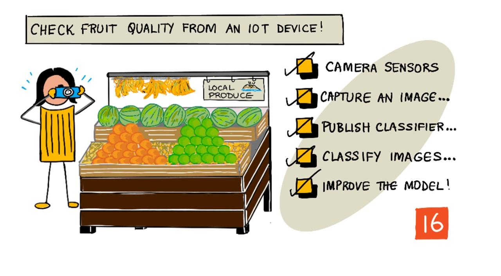

<!--
CO_OP_TRANSLATOR_METADATA:
{
  "original_hash": "557f4ee96b752e0651d2e6e74aa6bd14",
  "translation_date": "2025-08-27T20:54:03+00:00",
  "source_file": "4-manufacturing/lessons/2-check-fruit-from-device/README.md",
  "language_code": "cs"
}
-->
# Kontrola kvality ovoce pomocí IoT zařízení



> Sketchnote od [Nitya Narasimhan](https://github.com/nitya). Klikněte na obrázek pro větší verzi.

## Kvíz před lekcí

[Kvíz před lekcí](https://black-meadow-040d15503.1.azurestaticapps.net/quiz/31)

## Úvod

V minulé lekci jste se naučili o klasifikátorech obrázků a o tom, jak je trénovat k rozpoznávání dobrého a špatného ovoce. Abyste mohli tento klasifikátor obrázků použít v aplikaci IoT, potřebujete být schopni zachytit obrázek pomocí nějakého typu kamery a poslat tento obrázek do cloudu k analýze.

V této lekci se naučíte o kamerových senzorech a o tom, jak je použít s IoT zařízením k zachycení obrázku. Také se naučíte, jak volat klasifikátor obrázků z vašeho IoT zařízení.

V této lekci se zaměříme na:

* [Kamerové senzory](../../../../../4-manufacturing/lessons/2-check-fruit-from-device)
* [Zachycení obrázku pomocí IoT zařízení](../../../../../4-manufacturing/lessons/2-check-fruit-from-device)
* [Publikování vašeho klasifikátoru obrázků](../../../../../4-manufacturing/lessons/2-check-fruit-from-device)
* [Klasifikace obrázků z vašeho IoT zařízení](../../../../../4-manufacturing/lessons/2-check-fruit-from-device)
* [Zlepšení modelu](../../../../../4-manufacturing/lessons/2-check-fruit-from-device)

## Kamerové senzory

Kamerové senzory, jak název napovídá, jsou kamery, které můžete připojit k vašemu IoT zařízení. Mohou pořizovat statické obrázky nebo zachytávat streamované video. Některé vracejí surová obrazová data, jiné komprimují obrazová data do souborů, jako je JPEG nebo PNG. Obvykle jsou kamery, které fungují s IoT zařízeními, mnohem menší a mají nižší rozlišení, než na jaké jste zvyklí, ale můžete získat kamery s vysokým rozlišením, které se vyrovnají špičkovým telefonům. Můžete si pořídit různé vyměnitelné objektivy, sestavy s více kamerami, infračervené termální kamery nebo UV kamery.


Většina kamerových senzorů používá obrazové senzory, kde každý pixel je fotodioda. Objektiv zaostřuje obraz na obrazový senzor a tisíce nebo miliony fotodiod detekují světlo dopadající na každou z nich a zaznamenávají to jako obrazová data.

> 💁 Objektivy obracejí obrazy, kamerový senzor je pak otočí zpět správným směrem. Totéž se děje ve vašich očích – to, co vidíte, je detekováno vzhůru nohama na zadní straně vašeho oka a váš mozek to opravuje.

> 🎓 Obrazový senzor je známý jako senzor s aktivním pixelem (APS) a nejpopulárnějším typem APS je senzor z komplementárního polovodiče na bázi oxidu kovu, nebo CMOS. Možná jste slyšeli termín CMOS senzor používaný pro kamerové senzory.

Kamerové senzory jsou digitální senzory, které posílají obrazová data jako digitální data, obvykle s pomocí knihovny, která zajišťuje komunikaci. Kamery se připojují pomocí protokolů jako SPI, které jim umožňují posílat velké množství dat – obrázky jsou podstatně větší než jednotlivé čísla ze senzorů, jako je senzor teploty.

✅ Jaké jsou omezení velikosti obrázků u IoT zařízení? Zamyslete se nad omezeními, zejména u hardwaru mikrokontrolérů.

## Zachycení obrázku pomocí IoT zařízení

Vaše IoT zařízení můžete použít k zachycení obrázku, který bude klasifikován.

### Úkol – zachycení obrázku pomocí IoT zařízení

Projděte si relevantní návod k zachycení obrázku pomocí vašeho IoT zařízení:

* [Arduino - Wio Terminal](wio-terminal-camera.md)
* [Jednodeskový počítač - Raspberry Pi](pi-camera.md)
* [Jednodeskový počítač - Virtuální zařízení](virtual-device-camera.md)

## Publikování vašeho klasifikátoru obrázků

V minulé lekci jste trénovali svůj klasifikátor obrázků. Než ho budete moci použít z vašeho IoT zařízení, musíte model publikovat.

### Iterace modelu

Když váš model trénoval v minulé lekci, možná jste si všimli, že na záložce **Výkon** se na straně zobrazují iterace. Když jste model poprvé trénovali, viděli jste *Iteraci 1* během trénování. Když jste model zlepšovali pomocí predikčních obrázků, viděli jste *Iteraci 2* během trénování.

Pokaždé, když model trénujete, získáte novou iteraci. To je způsob, jak sledovat různé verze vašeho modelu trénované na různých datových sadách. Když provedete **Rychlý test**, je zde rozbalovací nabídka, kterou můžete použít k výběru iterace, abyste mohli porovnat výsledky napříč více iteracemi.

Když jste s iterací spokojeni, můžete ji publikovat, aby byla dostupná pro použití z externích aplikací. Tímto způsobem můžete mít publikovanou verzi, kterou používají vaše zařízení, a zároveň pracovat na nové verzi přes více iterací, kterou publikujete, až budete s ní spokojeni.

### Úkol – publikování iterace

Iterace se publikují z portálu Custom Vision.

1. Spusťte portál Custom Vision na [CustomVision.ai](https://customvision.ai) a přihlaste se, pokud ho ještě nemáte otevřený. Poté otevřete svůj projekt `fruit-quality-detector`.

1. Vyberte záložku **Výkon** z možností nahoře.

1. Vyberte nejnovější iteraci ze seznamu *Iterace* na straně.

1. Klikněte na tlačítko **Publikovat** pro danou iteraci.

    

1. V dialogu *Publikovat model* nastavte *Predikční zdroj* na zdroj `fruit-quality-detector-prediction`, který jste vytvořili v minulé lekci. Název ponechte jako `Iteration2` a klikněte na tlačítko **Publikovat**.

1. Po publikování klikněte na tlačítko **Predikční URL**. Zobrazí se podrobnosti o predikčním API, které budete potřebovat k volání modelu z vašeho IoT zařízení. Spodní část je označena *Pokud máte soubor s obrázkem*, a to jsou detaily, které potřebujete. Zkopírujte URL, které bude vypadat nějak takto:

    ```output
    https://<location>.api.cognitive.microsoft.com/customvision/v3.0/Prediction/<id>/classify/iterations/Iteration2/image
    ```

    Kde `<location>` bude lokalita, kterou jste použili při vytváření vašeho zdroje Custom Vision, a `<id>` bude dlouhé ID složené z písmen a čísel.

    Také si zkopírujte hodnotu *Prediction-Key*. Toto je bezpečnostní klíč, který musíte předat při volání modelu. Pouze aplikace, které předají tento klíč, mají povolení používat model, všechny ostatní aplikace jsou odmítnuty.

    

✅ Když je publikována nová iterace, bude mít jiný název. Jak si myslíte, že byste změnili iteraci, kterou IoT zařízení používá?

## Klasifikace obrázků z vašeho IoT zařízení

Nyní můžete použít tyto připojovací údaje k volání klasifikátoru obrázků z vašeho IoT zařízení.

### Úkol – klasifikace obrázků z vašeho IoT zařízení

Projděte si relevantní návod k klasifikaci obrázků pomocí vašeho IoT zařízení:

* [Arduino - Wio Terminal](wio-terminal-classify-image.md)
* [Jednodeskový počítač - Raspberry Pi/Virtuální IoT zařízení](single-board-computer-classify-image.md)

## Zlepšení modelu

Může se stát, že výsledky, které získáte při použití kamery připojené k vašemu IoT zařízení, neodpovídají tomu, co byste očekávali. Predikce nejsou vždy tak přesné jako při použití obrázků nahraných z vašeho počítače. To je způsobeno tím, že model byl trénován na jiných datech, než která jsou používána pro predikce.

Abyste dosáhli nejlepších výsledků u klasifikátoru obrázků, chcete model trénovat na obrázcích, které jsou co nejpodobnější obrázkům používaným pro predikce. Pokud jste například použili kameru telefonu k zachycení obrázků pro trénování, kvalita obrázku, ostrost a barvy budou odlišné od kamery připojené k IoT zařízení.


Na obrázku výše byl obrázek banánu vlevo pořízen pomocí kamery Raspberry Pi, zatímco obrázek vpravo byl pořízen stejného banánu na stejném místě pomocí iPhonu. Je zde znatelný rozdíl v kvalitě – obrázek z iPhonu je ostřejší, s jasnějšími barvami a větším kontrastem.

✅ Co dalšího by mohlo způsobit, že obrázky zachycené vaším IoT zařízením mají nesprávné predikce? Zamyslete se nad prostředím, ve kterém může být IoT zařízení použito, jaké faktory mohou ovlivnit zachycený obrázek?

Pro zlepšení modelu ho můžete znovu trénovat pomocí obrázků zachycených z IoT zařízení.

### Úkol – zlepšení modelu

1. Klasifikujte více obrázků zralého i nezralého ovoce pomocí vašeho IoT zařízení.

1. Na portálu Custom Vision znovu trénujte model pomocí obrázků na záložce *Predikce*.

    > ⚠️ Můžete se odkazovat na [instrukce pro znovu trénování vašeho klasifikátoru v lekci 1, pokud je to potřeba](../1-train-fruit-detector/README.md#retrain-your-image-classifier).

1. Pokud vaše obrázky vypadají velmi odlišně od původních použitých pro trénování, můžete všechny původní obrázky smazat tím, že je vyberete na záložce *Trénovací obrázky* a kliknete na tlačítko **Smazat**. Pro výběr obrázku na něj najeďte kurzorem a objeví se zaškrtávací políčko, klikněte na něj pro výběr nebo zrušení výběru obrázku.

1. Trénujte novou iteraci modelu a publikujte ji pomocí výše uvedených kroků.

1. Aktualizujte URL koncového bodu ve vašem kódu a znovu spusťte aplikaci.

1. Opakujte tyto kroky, dokud nebudete spokojeni s výsledky predikcí.

---

## 🚀 Výzva

Jak moc ovlivňuje rozlišení obrázku nebo osvětlení predikci?

Zkuste změnit rozlišení obrázků ve vašem kódu zařízení a zjistěte, zda to má vliv na kvalitu obrázků. Také zkuste změnit osvětlení.

Pokud byste měli vytvořit produkční zařízení na prodej farmám nebo továrnám, jak byste zajistili, že bude poskytovat konzistentní výsledky po celou dobu?

## Kvíz po lekci

[Kvíz po lekci](https://black-meadow-040d15503.1.azurestaticapps.net/quiz/32)

## Přehled & Samostudium

Svůj model Custom Vision jste trénovali pomocí portálu. To závisí na dostupnosti obrázků – a v reálném světě nemusíte být schopni získat trénovací data, která odpovídají tomu, co kamera na vašem zařízení zachytí. Můžete to obejít tím, že budete trénovat přímo z vašeho zařízení pomocí trénovacího API, abyste trénovali model pomocí obrázků zachycených z vašeho IoT zařízení.

* Přečtěte si o trénovacím API v [rychlém startu používání Custom Vision SDK](https://docs.microsoft.com/azure/cognitive-services/custom-vision-service/quickstarts/image-classification?WT.mc_id=academic-17441-jabenn&tabs=visual-studio&pivots=programming-language-python)

## Zadání

[Reagujte na výsledky klasifikace](assignment.md)

---

**Prohlášení**:  
Tento dokument byl přeložen pomocí služby pro automatický překlad [Co-op Translator](https://github.com/Azure/co-op-translator). Ačkoli se snažíme o přesnost, mějte prosím na paměti, že automatické překlady mohou obsahovat chyby nebo nepřesnosti. Původní dokument v jeho původním jazyce by měl být považován za autoritativní zdroj. Pro důležité informace doporučujeme profesionální lidský překlad. Neodpovídáme za žádná nedorozumění nebo nesprávné interpretace vyplývající z použití tohoto překladu.