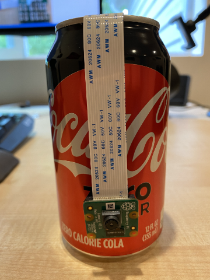

<!--
CO_OP_TRANSLATOR_METADATA:
{
  "original_hash": "c677667095f6133eee418c7e53615d05",
  "translation_date": "2025-08-27T20:55:25+00:00",
  "source_file": "4-manufacturing/lessons/2-check-fruit-from-device/pi-camera.md",
  "language_code": "cs"
}
-->
# Zachycení obrázku - Raspberry Pi

V této části lekce přidáte k Raspberry Pi kamerový senzor a budete z něj číst obrázky.

## Hardware

Raspberry Pi potřebuje kameru.

Kamera, kterou použijete, je [Raspberry Pi Camera Module](https://www.raspberrypi.org/products/camera-module-v2/). Tato kamera je navržena pro práci s Raspberry Pi a připojuje se přes speciální konektor na Pi.

> 💁 Tato kamera využívá [Camera Serial Interface, protokol od Mobile Industry Processor Interface Alliance](https://wikipedia.org/wiki/Camera_Serial_Interface), známý jako MIPI-CSI. Jedná se o speciální protokol pro přenos obrázků.

## Připojení kamery

Kamera se k Raspberry Pi připojuje pomocí plochého kabelu.

### Úkol - připojte kameru


1. Vypněte Raspberry Pi.

1. Připojte plochý kabel, který je součástí kamery, ke kameře. Jemně zatáhněte za černý plastový klip v držáku, aby se trochu vysunul, poté zasuňte kabel do konektoru tak, aby modrá strana směřovala od objektivu a kovové kontakty směrem k objektivu. Jakmile je kabel zcela zasunutý, zatlačte černý plastový klip zpět na místo.

    Animaci, jak otevřít klip a vložit kabel, najdete v [dokumentaci Raspberry Pi Getting Started with the Camera module](https://projects.raspberrypi.org/en/projects/getting-started-with-picamera/2).

    

1. Odstraňte Grove Base Hat z Raspberry Pi.

1. Provlékněte plochý kabel otvorem pro kameru v Grove Base Hat. Ujistěte se, že modrá strana kabelu směřuje k analogovým portům označeným **A0**, **A1** atd.

    

1. Zasuňte plochý kabel do kamerového portu na Raspberry Pi. Opět vytáhněte černý plastový klip nahoru, vložte kabel a poté klip zatlačte zpět. Modrá strana kabelu by měla směřovat k USB a ethernetovým portům.

    

1. Nasaďte zpět Grove Base Hat.

## Programování kamery

Raspberry Pi nyní můžete naprogramovat pro použití kamery pomocí Python knihovny [PiCamera](https://pypi.org/project/picamera/).

### Úkol - povolení režimu starší kamery

Bohužel s vydáním Raspberry Pi OS Bullseye se změnil kamerový software, který je součástí systému, což znamená, že PiCamera již ve výchozím nastavení nefunguje. Pracuje se na náhradě s názvem PiCamera2, ale ta zatím není připravena k použití.

Prozatím můžete přepnout Raspberry Pi do režimu starší kamery, aby PiCamera fungovala. Kamerový port je také ve výchozím nastavení deaktivován, ale zapnutí staršího kamerového softwaru automaticky povolí port.

1. Zapněte Raspberry Pi a počkejte, až se spustí.

1. Spusťte VS Code, buď přímo na Raspberry Pi, nebo se připojte pomocí rozšíření Remote SSH.

1. Spusťte následující příkazy v terminálu:

    ```sh
    sudo raspi-config nonint do_legacy 0
    sudo reboot
    ```

    Tento příkaz přepne nastavení pro povolení staršího kamerového softwaru a poté restartuje Raspberry Pi, aby se změna projevila.

1. Počkejte, až se Raspberry Pi restartuje, a znovu spusťte VS Code.

### Úkol - naprogramujte kameru

Naprogramujte zařízení.

1. V terminálu vytvořte novou složku v domovském adresáři uživatele `pi` s názvem `fruit-quality-detector`. V této složce vytvořte soubor s názvem `app.py`.

1. Otevřete tuto složku ve VS Code.

1. Pro práci s kamerou použijte Python knihovnu PiCamera. Nainstalujte balíček Pip pro tuto knihovnu následujícím příkazem:

    ```sh
    pip3 install picamera
    ```

1. Přidejte následující kód do souboru `app.py`:

    ```python
    import io
    import time
    from picamera import PiCamera
    ```

    Tento kód importuje potřebné knihovny, včetně knihovny `PiCamera`.

1. Pod tento kód přidejte následující kód pro inicializaci kamery:

    ```python
    camera = PiCamera()
    camera.resolution = (640, 480)
    camera.rotation = 0
    
    time.sleep(2)
    ```

    Tento kód vytvoří objekt PiCamera a nastaví rozlišení na 640x480. I když jsou podporována vyšší rozlišení (až 3280x2464), klasifikátor obrázků pracuje s mnohem menšími obrázky (227x227), takže není potřeba zachytávat a odesílat větší obrázky.

    Řádek `camera.rotation = 0` nastavuje rotaci obrázku. Plochý kabel vychází ze spodní části kamery, ale pokud je vaše kamera otočena, aby lépe mířila na objekt, který chcete klasifikovat, můžete tento řádek změnit na počet stupňů rotace.

    

    Například pokud zavěsíte plochý kabel nad něco tak, že je nahoře kamery, nastavte rotaci na 180:

    ```python
    camera.rotation = 180
    ```

    Kamera potřebuje několik sekund na spuštění, proto je zde řádek `time.sleep(2)`.

1. Pod tento kód přidejte následující kód pro zachycení obrázku jako binárních dat:

    ```python
    image = io.BytesIO()
    camera.capture(image, 'jpeg')
    image.seek(0)
    ```

    Tento kód vytvoří objekt `BytesIO` pro uložení binárních dat. Obrázek je přečten z kamery jako soubor JPEG a uložen do tohoto objektu. Objekt má ukazatel pozice, který určuje, kde se v datech nachází, takže řádek `image.seek(0)` posune tento ukazatel zpět na začátek, aby bylo možné později přečíst všechna data.

1. Pod tento kód přidejte následující kód pro uložení obrázku do souboru:

    ```python
    with open('image.jpg', 'wb') as image_file:
        image_file.write(image.read())
    ```

    Tento kód otevře soubor s názvem `image.jpg` pro zápis, poté přečte všechna data z objektu `BytesIO` a zapíše je do souboru.

    > 💁 Obrázek můžete zachytit přímo do souboru místo objektu `BytesIO` předáním názvu souboru volání `camera.capture`. Důvodem použití objektu `BytesIO` je, že později v této lekci můžete obrázek odeslat do svého klasifikátoru obrázků.

1. Namiřte kameru na něco a spusťte tento kód.

1. Obrázek bude zachycen a uložen jako `image.jpg` v aktuální složce. Tento soubor uvidíte v průzkumníku VS Code. Vyberte soubor pro zobrazení obrázku. Pokud je potřeba rotace, upravte řádek `camera.rotation = 0` podle potřeby a pořiďte další snímek.

> 💁 Tento kód najdete ve složce [code-camera/pi](../../../../../4-manufacturing/lessons/2-check-fruit-from-device/code-camera/pi).

😀 Programování kamery bylo úspěšné!

---

**Prohlášení**:  
Tento dokument byl přeložen pomocí služby pro automatický překlad [Co-op Translator](https://github.com/Azure/co-op-translator). Ačkoli se snažíme o přesnost, mějte na paměti, že automatické překlady mohou obsahovat chyby nebo nepřesnosti. Původní dokument v jeho původním jazyce by měl být považován za autoritativní zdroj. Pro důležité informace doporučujeme profesionální lidský překlad. Neodpovídáme za žádná nedorozumění nebo nesprávné interpretace vyplývající z použití tohoto překladu.