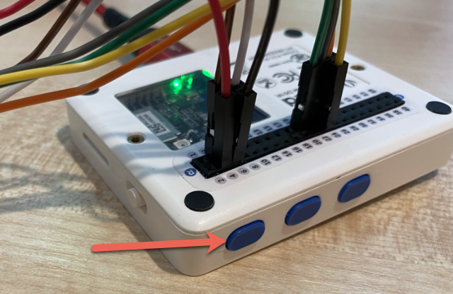

<!--
CO_OP_TRANSLATOR_METADATA:
{
  "original_hash": "160be8c0f558687f6686dca64f10f739",
  "translation_date": "2025-08-27T20:58:20+00:00",
  "source_file": "4-manufacturing/lessons/2-check-fruit-from-device/wio-terminal-camera.md",
  "language_code": "cs"
}
-->
# Zachycení obrázku - Wio Terminal

V této části lekce přidáte ke svému Wio Terminalu kameru a budete z ní zachycovat obrázky.

## Hardware

Wio Terminal potřebuje kameru.

Pou쬴tá kamera je [ArduCam Mini 2MP Plus](https://www.arducam.com/product/arducam-2mp-spi-camera-b0067-arduino/). Jedná se o 2megapixelovou kameru zalo쬰nou na obrazovém senzoru OV2640. Komunikuje přes SPI rozhraní pro zachycení obrázků a pou쮂셨치 I2C pro konfiguraci senzoru.

## Připojení kamery

ArduCam nemá Grove konektor, místo toho se připojuje k SPI a I2C sběrnicím přes GPIO piny na Wio Terminalu.

### Úkol - připojení kamery

Připojte kameru.


1. Piny na spodní straně ArduCam musí být připojeny k GPIO pinům na Wio Terminalu. Aby bylo snazší najít správné piny, připevněte kolem pinů nálepku GPIO pinů, která je součástí Wio Terminalu:

    

1. Pomocí propojovacích vodičů proveďte následující připojení:

    | Pin ArduCAM | Pin Wio Terminal | Popis                                   |
    | ----------- | ---------------- | --------------------------------------- |
    | CS          | 24 (SPI_CS)      | SPI Chip Select                         |
    | MOSI        | 19 (SPI_MOSI)    | SPI Controller Output, Peripheral Input |
    | MISO        | 21 (SPI_MISO)    | SPI Controller Input, Peripheral Output |
    | SCK         | 23 (SPI_SCLK)    | SPI Serial Clock                        |
    | GND         | 6 (GND)          | Zem - 0V                                |
    | VCC         | 4 (5V)           | Napájení 5V                             |
    | SDA         | 3 (I2C1_SDA)     | I2C Serial Data                         |
    | SCL         | 5 (I2C1_SCL)     | I2C Serial Clock                        |

    

    Připojení GND a VCC poskytuje napájení 5V pro ArduCam. Kamera běží na 5V, na rozdíl od Grove senzorů, které běží na 3V. Toto napájení pochází přímo z USB-C připojení, které napájí zařízení.

    > 游누 Pro SPI připojení stále pou쮂셨ají štítky pinů na ArduCam a názvy pinů Wio Terminalu v kódu starší konvenci pojmenování. Instrukce v této lekci budou pou쮂셨at novou konvenci pojmenování, kromě případů, kdy jsou názvy pinů pou쬴ty v kódu.

1. Nyní m콢쬰te připojit Wio Terminal k vašemu počítači.

## Naprogramování zařízení pro připojení ke kameře

Wio Terminal nyní m콢쬰 být naprogramován tak, aby pou쮂셨al připojenou kameru ArduCAM.

### Úkol - naprogramování zařízení pro připojení ke kameře

1. Vytvořte nový projekt Wio Terminal pomocí PlatformIO. Nazvěte tento projekt `fruit-quality-detector`. Přidejte kód do funkce `setup` pro konfiguraci sériového portu.

1. Přidejte kód pro připojení k WiFi, s vašimi WiFi přihlašovacími 칰daji v souboru `config.h`. Nezapome켿te přidat po쬬dované knihovny do souboru `platformio.ini`.

1. Knihovna ArduCam není dostupná jako Arduino knihovna, kterou lze nainstalovat ze souboru `platformio.ini`. Místo toho ji bude potřeba nainstalovat ze zdroje z jejich GitHub stránky. M콢쬰te ji získat buď:

    * Klonováním repozitáře z [https://github.com/ArduCAM/Arduino.git](https://github.com/ArduCAM/Arduino.git)
    * Navštívením repozitáře na GitHubu na [github.com/ArduCAM/Arduino](https://github.com/ArduCAM/Arduino) a sta쬰ním kódu jako zip z tlačítka **Code**

1. Potřebujete pouze slo쬶u `ArduCAM` z tohoto kódu. Zkopírujte celou slo쬶u do slo쬶y `lib` ve vašem projektu.

    > 丘멆잺 Celá slo쬶a musí být zkopírována, tak쬰 kód bude v `lib/ArduCam`. Nekopírujte pouze obsah slo쬶y `ArduCam` do slo쬶y `lib`, zkopírujte celou slo쬶u.

1. Kód knihovny ArduCam funguje pro více typů kamer. Typ kamery, kterou chcete pou쮂셦, je konfigurován pomocí kompilátorových příznaků - tím se udr쬿je velikost knihovny co nejmenší odstraněním kódu pro kamery, které nepou쮂셨치te. Pro konfiguraci knihovny pro kameru OV2640 přidejte následující na konec souboru `platformio.ini`:

    ```ini
    build_flags =
        -DARDUCAM_SHIELD_V2
        -DOV2640_CAM
    ```

    Toto nastavuje 2 kompilátorové příznaky:

      * `ARDUCAM_SHIELD_V2` pro informování knihovny, 쬰 kamera je na Arduino desce, známé jako shield.
      * `OV2640_CAM` pro informování knihovny, aby zahrnula pouze kód pro kameru OV2640.

1. Přidejte hlavičkový soubor do slo쬶y `src` nazvaný `camera.h`. Tento soubor bude obsahovat kód pro komunikaci s kamerou. Přidejte do tohoto souboru následující kód:

    ```cpp
    #pragma once
    
    #include <ArduCAM.h>
    #include <Wire.h>
    
    class Camera
    {
    public:
        Camera(int format, int image_size) : _arducam(OV2640, PIN_SPI_SS)
        {
            _format = format;
            _image_size = image_size;
        }
    
        bool init()
        {
            // Reset the CPLD
            _arducam.write_reg(0x07, 0x80);
            delay(100);
    
            _arducam.write_reg(0x07, 0x00);
            delay(100);
    
            // Check if the ArduCAM SPI bus is OK
            _arducam.write_reg(ARDUCHIP_TEST1, 0x55);
            if (_arducam.read_reg(ARDUCHIP_TEST1) != 0x55)
            {
                return false;
            }
                
            // Change MCU mode
            _arducam.set_mode(MCU2LCD_MODE);
    
            uint8_t vid, pid;
    
            // Check if the camera module type is OV2640
            _arducam.wrSensorReg8_8(0xff, 0x01);
            _arducam.rdSensorReg8_8(OV2640_CHIPID_HIGH, &vid);
            _arducam.rdSensorReg8_8(OV2640_CHIPID_LOW, &pid);
            if ((vid != 0x26) && ((pid != 0x41) || (pid != 0x42)))
            {
                return false;
            }
            
            _arducam.set_format(_format);
            _arducam.InitCAM();
            _arducam.OV2640_set_JPEG_size(_image_size);
            _arducam.OV2640_set_Light_Mode(Auto);
            _arducam.OV2640_set_Special_effects(Normal);
            delay(1000);
    
            return true;
        }
    
        void startCapture()
        {
            _arducam.flush_fifo();
            _arducam.clear_fifo_flag();
            _arducam.start_capture();
        }
    
        bool captureReady()
        {
            return _arducam.get_bit(ARDUCHIP_TRIG, CAP_DONE_MASK);
        }
    
        bool readImageToBuffer(byte **buffer, uint32_t &buffer_length)
        {
            if (!captureReady()) return false;
    
            // Get the image file length
            uint32_t length = _arducam.read_fifo_length();
            buffer_length = length;
    
            if (length >= MAX_FIFO_SIZE)
            {
                return false;
            }
            if (length == 0)
            {
                return false;
            }
    
            // create the buffer
            byte *buf = new byte[length];
    
            uint8_t temp = 0, temp_last = 0;
            int i = 0;
            uint32_t buffer_pos = 0;
            bool is_header = false;
    
            _arducam.CS_LOW();
            _arducam.set_fifo_burst();
            
            while (length--)
            {
                temp_last = temp;
                temp = SPI.transfer(0x00);
                //Read JPEG data from FIFO
                if ((temp == 0xD9) && (temp_last == 0xFF)) //If find the end ,break while,
                {
                    buf[buffer_pos] = temp;
    
                    buffer_pos++;
                    i++;
                    
                    _arducam.CS_HIGH();
                }
                if (is_header == true)
                {
                    //Write image data to buffer if not full
                    if (i < 256)
                    {
                        buf[buffer_pos] = temp;
                        buffer_pos++;
                        i++;
                    }
                    else
                    {
                        _arducam.CS_HIGH();
    
                        i = 0;
                        buf[buffer_pos] = temp;
    
                        buffer_pos++;
                        i++;
    
                        _arducam.CS_LOW();
                        _arducam.set_fifo_burst();
                    }
                }
                else if ((temp == 0xD8) & (temp_last == 0xFF))
                {
                    is_header = true;
    
                    buf[buffer_pos] = temp_last;
                    buffer_pos++;
                    i++;
    
                    buf[buffer_pos] = temp;
                    buffer_pos++;
                    i++;
                }
            }
            
            _arducam.clear_fifo_flag();
    
            _arducam.set_format(_format);
            _arducam.InitCAM();
            _arducam.OV2640_set_JPEG_size(_image_size);
    
            // return the buffer
            *buffer = buf;
        }
    
    private:
        ArduCAM _arducam;
        int _format;
        int _image_size;
    };
    ```

    Toto je nízko칰rov켿ový kód, který konfiguruje kameru pomocí knihoven ArduCam a extrahuje obrázky, kdy je to potřeba, pomocí SPI sběrnice. Tento kód je velmi specifický pro ArduCam, tak쬰 se nemusíte starat o to, jak funguje.

1. V `main.cpp` přidejte následující kód pod ostatní `include` příkazy pro zahrnutí tohoto nového souboru a vytvoření instance třídy kamery:

    ```cpp
    #include "camera.h"

    Camera camera = Camera(JPEG, OV2640_640x480);
    ```

    Toto vytvoří `Camera`, která ukládá obrázky jako JPEGy v rozlišení 640 x 480. Ačkoli jsou podporována vyšší rozlišení (a 3280x2464), klasifikátor obrázků pracuje na mnohem menších obrázcích (227x227), tak쬰 není potřeba zachytávat a odesílat větší obrázky.

1. Přidejte následující kód pod tento pro definování funkce pro nastavení kamery:

    ```cpp
    void setupCamera()
    {
        pinMode(PIN_SPI_SS, OUTPUT);
        digitalWrite(PIN_SPI_SS, HIGH);
    
        Wire.begin();
        SPI.begin();
    
        if (!camera.init())
        {
            Serial.println("Error setting up the camera!");
        }
    }
    ```

    Funkce `setupCamera` začíná konfigurací SPI chip select pinu (`PIN_SPI_SS`) jako vysokého, čím se Wio Terminal stává SPI kontrolérem. Poté spustí I2C a SPI sběrnice. Nakonec inicializuje třídu kamery, která konfiguruje nastavení senzoru kamery a zaji코콘uje, 쬰 vše je správně zapojeno.

1. Zavolejte tuto funkci na konci funkce `setup`:

    ```cpp
    setupCamera();
    ```

1. Sestavte a nahrajte tento kód a zkontrolujte výstup ze sériového monitoru. Pokud uvidíte `Error setting up the camera!`, zkontrolujte zapojení, aby bylo zajištěno, 쬰 všechny kabely spojují správné piny na ArduCam se správnými GPIO piny na Wio Terminalu a všechny propojovací kabely jsou správně usazeny.

## Zachycení obrázku

Wio Terminal nyní m콢쬰 být naprogramován tak, aby zachytil obrázek, kdy je stisknuto tlačítko.

### Úkol - zachycení obrázku

1. Mikrokontroléry spouštějí v치코 kód nepřetr쬴tě, tak쬰 není snadné spustit něco jako pořízení fotografie bez reakce na senzor. Wio Terminal má tlačítka, tak쬰 kamera m콢쬰 být nastavena tak, aby byla spuštěna jedním z tlačítek. Přidejte následující kód na konec funkce `setup` pro konfiguraci tlačítka C (jednoho ze tří tlačítek nahoře, toho nejbl칤쬰 k vypínači).

    

    ```cpp
    pinMode(WIO_KEY_C, INPUT_PULLUP);
    ```

    Re쬴m `INPUT_PULLUP` v podstatě invertuje vstup. Například normálně by tlačítko posílalo nízký signál, kdy není stisknuto, a vysoký signál, kdy je stisknuto. Kdy je nastaveno na `INPUT_PULLUP`, posílá vysoký signál, kdy není stisknuto, a nízký signál, kdy je stisknuto.

1. Před funkcí `loop` přidejte prázdnou funkci pro reakci na stisknutí tlačítka:

    ```cpp
    void buttonPressed()
    {
        
    }
    ```

1. Zavolejte tuto funkci ve funkci `loop`, když je tlačítko stisknuto:

    ```cpp
    void loop()
    {
        if (digitalRead(WIO_KEY_C) == LOW)
        {
            buttonPressed();
            delay(2000);
        }
    
        delay(200);
    }
    ```

    Tento kl칤캜 kontroluje, zda je tlačítko stisknuto. Pokud je stisknuto, je zavolána funkce `buttonPressed` a smyčka se zpozdí o 2 sekundy. Toto je pro umo쬹캩ní času na uvolnění tlačítka, aby dlouhý stisk nebyl zaregistrován dvakrát.

    > 游누 Tlačítko na Wio Terminalu je nastaveno na `INPUT_PULLUP`, tak쬰 posílá vysoký signál, kdy není stisknuto, a nízký signál, kdy je stisknuto.

1. Přidejte následující kód do funkce `buttonPressed`:

    ```cpp
    camera.startCapture();
 
    while (!camera.captureReady())
        delay(100);

    Serial.println("Image captured");

    byte *buffer;
    uint32_t length;

    if (camera.readImageToBuffer(&buffer, length))
    {
        Serial.print("Image read to buffer with length ");
        Serial.println(length);

        delete(buffer);
    }
    ```

    Tento kód zahájí zachycení kamery voláním `startCapture`. Hardware kamery nefunguje tak, 쬰 vrací data, kdy je po쬬dujete, místo toho pošlete instrukci k zahájení zachycení a kamera bude pracovat na pozadí na zachycení obrázku, jeho převodu na JPEG a ulo쬰ní do lokálního bufferu na samotné kameře. Volání `captureReady` poté zkontroluje, zda zachycení obrázku skončilo.

    Jakmile zachycení skončí, data obrázku jsou zkopírována z bufferu na kameře do lokálního bufferu (pole bajtů) pomocí volání `readImageToBuffer`. Délka bufferu je poté odeslána na sériový monitor.

1. Sestavte a nahrajte tento kód a zkontrolujte výstup na sériovém monitoru. Poka쬯칠, kdy stisknete tlačítko C, bude zachycen obrázek a uvidíte velikost obrázku odeslanou na sériový monitor.

    ```output
    Connecting to WiFi..
    Connected!
    Image captured
    Image read to buffer with length 9224
    Image captured
    Image read to buffer with length 11272
    ```

    Různé obrázky budou mít různé velikosti. Jsou komprimovány jako JPEGy a velikost souboru JPEG pro dané rozlišení závisí na tom, co je na obrázku.

> 游누 Tento kód najdete ve slo쬮e [code-camera/wio-terminal](../../../../../4-manufacturing/lessons/2-check-fruit-from-device/code-camera/wio-terminal).

😀 Úspěšně jste zachytili obrázky pomocí svého Wio Terminalu.

## Volitelné - ověření obrázků z kamery pomocí SD karty

Nejjednodušší způsob, jak zobrazit obrázky zachycené kamerou, je zapsat je na SD kartu ve Wio Terminalu a poté je zobrazit na vašem počítači. Proveďte tento krok, pokud máte volnou microSD kartu a microSD slot ve vašem počítači nebo adaptér.

Wio Terminal podporuje pouze microSD karty o velikosti až 16GB. Pokud máte větší SD kartu, nebude fungovat.

### Úkol - ověření obrázků z kamery pomocí SD karty

1. Naformátujte microSD kartu jako FAT32 nebo exFAT pomocí příslušných aplikací na vašem počítači (Disk Utility na macOS, File Explorer na Windows nebo pomocí příkazových nástrojů v Linuxu).

1. Vlo쬾e microSD kartu do slotu těsně pod vypínačem. Ujistěte se, 쬰 je zcela zasunutá, dokud nezaklapne a zůstane na místě, mo쬹치 ji budete muset zatlačit pomocí nehtu nebo tenkého nástroje.

1. Přidejte následující příkazy `include` na začátek souboru `main.cpp`:

    ```cpp
    #include "SD/Seeed_SD.h"
    #include <Seeed_FS.h>
    ```

1. Před funkcí `setup` přidejte následující funkci:

    ```cpp
    void setupSDCard()
    {
        while (!SD.begin(SDCARD_SS_PIN, SDCARD_SPI))
        {
            Serial.println("SD Card Error");
        }
    }
    ```

    Tato funkce konfiguruje SD kartu pomocí SPI sběrnice.

1. Zavolejte tuto funkci z funkce `setup`:

    ```cpp
    setupSDCard();
    ```

1. Přidejte následující kód nad funkci `buttonPressed`:

    ```cpp
    int fileNum = 1;

    void saveToSDCard(byte *buffer, uint32_t length)
    {
        char buff[16];
        sprintf(buff, "%d.jpg", fileNum);
        fileNum++;
    
        File outFile = SD.open(buff, FILE_WRITE );
        outFile.write(buffer, length);
        outFile.close();

        Serial.print("Image written to file ");
        Serial.println(buff);
    }
    ```

    Toto definuje globální proměnnou pro počet souborů. Tato proměnná se pou쮂셨치 pro názvy souborů obrázků, tak쬰 m콢쬰 být zachyceno více obrázků s postupně se zvyšujícími názvy souborů - `1.jpg`, `2.jpg` a tak dále.

    Poté definuje funkci `saveToSDCard`, která přijímá buffer dat bajtů a délku bufferu. Vytvoří se název souboru pomocí počtu souborů a počet souborů se zvýší, aby byl připraven na další soubor. Binární data z bufferu jsou poté zapsána do souboru.

1. Zavolejte funkci `saveToSDCard` z funkce `buttonPressed`. Volání by mělo být **předtím**, než je buffer smazán:

    ```cpp
    Serial.print("Image read to buffer with length ");
    Serial.println(length);

    saveToSDCard(buffer, length);
    
    delete(buffer);
    ```

1. Sestavte a nahrajte tento kód a zkontrolujte výstup na sériovém monitoru. Poka쬯칠, kdy stisknete tlačítko C, bude zachycen obrázek a ulo쬰n na SD kartu.

    ```output
    Connecting to WiFi..
    Connected!
    Image captured
    Image read to buffer with length 16392
    Image written to file 1.jpg
    Image captured
    Image read to buffer with length 14344
    Image written to file 2.jpg
    ```

1. Vypněte microSD kartu a vysu켿te ji mírným zatlačením a uvolněním, a karta vyskočí. Mo쬹치 budete potřebovat tenký nástroj, abyste to udělali. Připojte microSD kartu k vašemu počítači, abyste si mohli prohlédnout obrázky.

    
游누 M콢쬰 trvat několik snímků, ne se vyv치쬰ní bílé kamery samo upraví. Všimnete si toho podle barvy zachycených snímků, první několik m콢쬰 vypadat barevně nesprávně. V쬯y to m콢쬰te obejít změnou kódu tak, aby zachytil několik snímků, které jsou ignorovány ve funkci `setup`.


---

**Upozornění**:  
Tento dokument byl přelo쬰n pomocí slu쬭y pro automatický překlad [Co-op Translator](https://github.com/Azure/co-op-translator). I kdy se sna쮂셠e o přesnost, mějte prosím na paměti, 쬰 automatické překlady mohou obsahovat chyby nebo nepřesnosti. Původní dokument v jeho původním jazyce by měl být pova쬺ván za závazný zdroj. Pro důle쬴té informace se doporučuje profesionální lidský překlad. Neodpovídáme za jakékoli nedorozumění nebo nesprávné interpretace vyplývající z pou쬴tí tohoto překladu.