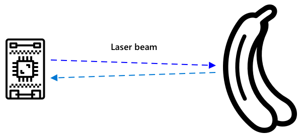

<!--
CO_OP_TRANSLATOR_METADATA:
{
  "original_hash": "f74f4ccb61f00e5f7e9f49c3ed416e36",
  "translation_date": "2025-08-27T20:41:41+00:00",
  "source_file": "4-manufacturing/lessons/4-trigger-fruit-detector/README.md",
  "language_code": "cs"
}
-->
# Spuštění detekce kvality ovoce pomocí senzoru


> Sketchnote od [Nitya Narasimhan](https://github.com/nitya). Klikněte na obrázek pro větší verzi.

## Kvíz před přednáškou

[Kvíz před přednáškou](https://black-meadow-040d15503.1.azurestaticapps.net/quiz/35)

## Úvod

IoT aplikace není jen jedno zařízení, které zachycuje data a odesílá je do cloudu. Často se jedná o více zařízení, která spolupracují na zachycení dat z fyzického světa pomocí senzorů, rozhodují na základě těchto dat a interagují zpět s fyzickým světem prostřednictvím akčních členů nebo vizualizací.

V této lekci se dozvíte více o navrhování složitých IoT aplikací, které zahrnují více senzorů, různé cloudové služby pro analýzu a ukládání dat a zobrazování odpovědí prostřednictvím akčních členů. Naučíte se, jak navrhnout prototyp systému pro kontrolu kvality ovoce, včetně použití senzorů vzdálenosti k aktivaci IoT aplikace, a jaká by byla architektura tohoto prototypu.

V této lekci se zaměříme na:

* [Navrhování složitých IoT aplikací](../../../../../4-manufacturing/lessons/4-trigger-fruit-detector)
* [Návrh systému pro kontrolu kvality ovoce](../../../../../4-manufacturing/lessons/4-trigger-fruit-detector)
* [Spuštění kontroly kvality ovoce pomocí senzoru](../../../../../4-manufacturing/lessons/4-trigger-fruit-detector)
* [Data používaná pro detektor kvality ovoce](../../../../../4-manufacturing/lessons/4-trigger-fruit-detector)
* [Použití vývojářských zařízení k simulaci více IoT zařízení](../../../../../4-manufacturing/lessons/4-trigger-fruit-detector)
* [Přechod do produkce](../../../../../4-manufacturing/lessons/4-trigger-fruit-detector)

> 🗑 Toto je poslední lekce v tomto projektu, takže po dokončení této lekce a úkolu nezapomeňte vyčistit své cloudové služby. Budete je potřebovat k dokončení úkolu, takže se ujistěte, že jej nejprve dokončíte.
>
> Pokud je to nutné, podívejte se na [průvodce vyčištěním projektu](../../../clean-up.md) pro pokyny, jak to provést.

## Navrhování složitých IoT aplikací

IoT aplikace se skládají z mnoha komponent. To zahrnuje různé věci a různé internetové služby.

IoT aplikace lze popsat jako *věci* (zařízení), které odesílají data, jež generují *poznatky*. Tyto *poznatky* vedou k *akcím*, které zlepšují podnikání nebo proces. Příkladem je motor (věc), který odesílá data o teplotě. Tato data se používají k vyhodnocení, zda motor funguje podle očekávání (poznatek). Poznatek se pak využívá k proaktivnímu plánování údržby motoru (akce).

* Různé věci shromažďují různé části dat.
* IoT služby poskytují poznatky z těchto dat, někdy je doplňují daty z dalších zdrojů.
* Tyto poznatky vedou k akcím, včetně ovládání akčních členů v zařízeních nebo vizualizace dat.

### Referenční IoT architektura


Výše uvedený diagram ukazuje referenční IoT architekturu.

> 🎓 *Referenční architektura* je příklad architektury, kterou můžete použít jako vzor při navrhování nových systémů. V tomto případě, pokud byste stavěli nový IoT systém, můžete se řídit referenční architekturou a nahradit vlastní zařízení a služby tam, kde je to vhodné.

* **Věci** jsou zařízení, která shromažďují data ze senzorů, možná interagují se službami na okraji sítě, aby tato data interpretovala, například klasifikátory obrazu pro interpretaci obrazových dat. Data ze zařízení jsou odesílána do IoT služby.
* **Poznatky** pocházejí ze serverless aplikací nebo z analýz prováděných na uložených datech.
* **Akce** mohou být příkazy odeslané zařízením nebo vizualizace dat umožňující lidem činit rozhodnutí.


Výše uvedený diagram ukazuje některé komponenty a služby, které byly dosud v těchto lekcích pokryty, a jak se propojují v referenční IoT architektuře.

* **Věci** - napsali jste kód zařízení pro zachycení dat ze senzorů a analýzu obrazů pomocí Custom Vision, běžící jak v cloudu, tak na zařízení na okraji sítě. Tato data byla odeslána do IoT Hubu.
* **Poznatky** - použili jste Azure Functions k reakci na zprávy odeslané do IoT Hubu a uložili data pro pozdější analýzu do Azure Storage.
* **Akce** - ovládali jste akční členy na základě rozhodnutí učiněných v cloudu a příkazů odeslaných zařízením a vizualizovali jste data pomocí Azure Maps.

✅ Zamyslete se nad jinými IoT zařízeními, která jste používali, například chytré domácí spotřebiče. Jaké jsou věci, poznatky a akce spojené s tímto zařízením a jeho softwarem?

Tento vzor lze rozšířit na libovolnou velikost, přidáním více zařízení a více služeb.

### Data a bezpečnost

Při definování architektury svého systému musíte neustále zvažovat data a bezpečnost.

* Jaká data vaše zařízení odesílá a přijímá?
* Jak by měla být tato data zabezpečena a chráněna?
* Jak by měl být řízen přístup k zařízení a cloudové službě?

✅ Zamyslete se nad bezpečností dat jakéhokoli IoT zařízení, které vlastníte. Kolik z těchto dat je osobních a mělo by být uchováno v soukromí, jak při přenosu, tak při ukládání? Jaká data by neměla být ukládána?

## Návrh systému pro kontrolu kvality ovoce

Pojďme nyní aplikovat koncept věcí, poznatků a akcí na náš detektor kvality ovoce a navrhnout větší aplikaci od začátku do konce.

Představte si, že jste dostali za úkol vytvořit detektor kvality ovoce, který bude použit v zpracovatelském závodě. Ovoce se pohybuje na pásovém dopravníku, kde zaměstnanci v současnosti ručně kontrolují ovoce a odstraňují nezralé plody. Aby se snížily náklady, majitel závodu chce automatizovaný systém.

✅ Jedním z trendů s rozvojem IoT (a technologií obecně) je nahrazování manuálních prací stroji. Proveďte výzkum: Kolik pracovních míst se odhaduje, že bude ztraceno kvůli IoT? Kolik nových pracovních míst vznikne při vývoji IoT zařízení?

Musíte vytvořit systém, kde bude ovoce detekováno při příjezdu na dopravník, následně vyfotografováno a zkontrolováno pomocí AI modelu běžícího na okraji sítě. Výsledky budou odeslány do cloudu a pokud bude ovoce nezralé, bude vydáno upozornění, aby bylo odstraněno.

|   |   |
| - | - |
| **Věci** | Detektor příjezdu ovoce na dopravník<br>Kamera pro fotografování a klasifikaci ovoce<br>Zařízení na okraji sítě běžící klasifikátor<br>Zařízení pro upozornění na nezralé ovoce |
| **Poznatky** | Rozhodnutí o kontrole zralosti ovoce<br>Uložení výsledků klasifikace zralosti<br>Určení potřeby upozornit na nezralé ovoce |
| **Akce** | Odeslání příkazu zařízení k fotografování ovoce a kontrole pomocí klasifikátoru obrazu<br>Odeslání příkazu zařízení k upozornění na nezralé ovoce |

### Prototypování vaší aplikace


Výše uvedený diagram ukazuje referenční architekturu pro tento prototyp aplikace.

* IoT zařízení s proximity senzorem detekuje příjezd ovoce. To odešle zprávu do cloudu, že bylo detekováno ovoce.
* Serverless aplikace v cloudu odešle příkaz jinému zařízení, aby pořídilo fotografii a klasifikovalo obraz.
* IoT zařízení s kamerou pořídí snímek a odešle jej klasifikátoru obrazu běžícímu na okraji sítě. Výsledky jsou poté odeslány do cloudu.
* Serverless aplikace v cloudu uloží tyto informace pro pozdější analýzu, aby zjistila, jaké procento ovoce je nezralé. Pokud je ovoce nezralé, odešle příkaz jinému IoT zařízení, aby upozornilo pracovníky továrny na nezralé ovoce pomocí LED.

> 💁 Celá tato IoT aplikace by mohla být implementována jako jediné zařízení, se všemi logikami pro spuštění klasifikace obrazu a ovládání LED zabudovanými. Mohla by používat IoT Hub pouze ke sledování počtu detekovaných nezralých plodů a konfiguraci zařízení. V této lekci je rozšířena, aby demonstrovala koncepty pro velké IoT aplikace.

Pro prototyp implementujete vše na jednom zařízení. Pokud používáte mikrokontrolér, použijete samostatné zařízení na okraji sítě pro spuštění klasifikátoru obrazu. Většinu věcí, které budete potřebovat k sestavení tohoto systému, jste se již naučili.

## Spuštění kontroly kvality ovoce pomocí senzoru

IoT zařízení potřebuje nějaký spouštěč, který indikuje, kdy je ovoce připraveno ke klasifikaci. Jedním ze spouštěčů by bylo měření, kdy je ovoce na správném místě na dopravníku, měřením vzdálenosti k senzoru.



Proximity senzory mohou být použity k měření vzdálenosti od senzoru k objektu. Obvykle vysílají paprsek elektromagnetického záření, jako je laserový paprsek nebo infračervené světlo, a poté detekují záření odražené od objektu. Čas mezi vysláním paprsku a odrazem signálu lze použít k výpočtu vzdálenosti k senzoru.

> 💁 Pravděpodobně jste již používali proximity senzory, aniž byste o tom věděli. Většina chytrých telefonů vypne obrazovku, když je přiložíte k uchu, aby se zabránilo náhodnému ukončení hovoru ušním lalůčkem. To funguje pomocí proximity senzoru, který detekuje objekt blízko obrazovky během hovoru a deaktivuje dotykové funkce, dokud není telefon v určité vzdálenosti.

### Úkol - spuštění detekce kvality ovoce pomocí senzoru vzdálenosti

Projděte si příslušného průvodce, jak použít proximity senzor k detekci objektu pomocí vašeho IoT zařízení:

* [Arduino - Wio Terminal](wio-terminal-proximity.md)
* [Jednodeskový počítač - Raspberry Pi](pi-proximity.md)
* [Jednodeskový počítač - Virtuální zařízení](virtual-device-proximity.md)

## Data používaná pro detektor kvality ovoce

Prototyp detektoru ovoce má více komponent, které spolu komunikují.


* Proximity senzor měří vzdálenost k ovoci a odesílá ji do IoT Hubu.
* Příkaz k ovládání kamery přichází z IoT Hubu do zařízení s kamerou.
* Výsledky klasifikace obrazu jsou odesílány do IoT Hubu.
* Příkaz k ovládání LED, která upozorňuje na nezralé ovoce, je odesílán z IoT Hubu do zařízení s LED.

Je dobré definovat strukturu těchto zpráv předem, než začnete aplikaci budovat.

> 💁 Téměř každý zkušený vývojář se někdy ve své kariéře setkal s tím, že strávil hodiny, dny nebo dokonce týdny hledáním chyb způsobených rozdíly mezi odesílanými daty a tím, co bylo očekáváno.

Například - pokud odesíláte informace o teplotě, jak byste definovali JSON? Můžete mít pole nazvané `temperature`, nebo můžete použít běžnou zkratku `temp`.

```json
{
    "temperature": 20.7
}
```

ve srovnání s:

```json
{
    "temp": 20.7
}
```

Musíte také zvážit jednotky - je teplota v °C nebo °F? Pokud měříte teplotu pomocí spotřebitelského zařízení a uživatel změní jednotky zobrazení, musíte zajistit, aby jednotky odesílané do cloudu zůstaly konzistentní.

✅ Proveďte výzkum: Jak problémy s jednotkami způsobily havárii Mars Climate Orbiter za 125 milionů dolarů?

Zamyslete se nad daty odesílanými pro detektor kvality ovoce. Jak byste definovali každou zprávu? Kde byste analyzovali data a rozhodovali o tom, jaká data odeslat?

Například - spuštění klasifikace obrazu pomocí proximity senzoru. IoT zařízení měří vzdálenost, ale kde se rozhoduje? Rozhodne zařízení, že ovoce je dostatečně blízko, a odešle zprávu IoT Hubu, aby spustil klasifikaci? Nebo odesílá měření vzdálenosti a nechá IoT Hub rozhodnout?

Odpověď na takové otázky zní - záleží na situaci. Každý případ použití je jiný, a proto jako IoT vývojář musíte rozumět systému, který stavíte, jak se používá a jaká data se detekují.

* Pokud rozhodnutí činí IoT Hub, musíte odesílat více měření vzdálenosti.
* Pokud odesíláte příliš mnoho zpráv, zvyšuje to náklady na IoT Hub a množství šířky pásma potřebné vašimi IoT zařízeními (zejména ve fabrice s miliony zařízení). Může to také zpomalit vaše zařízení.
* Pokud rozhodnutí činí zařízení, budete muset poskytnout způsob, jak zařízení nakonfigurovat pro jemné doladění stroje.

## Použití vývojářských zařízení k simulaci více IoT zařízení

Pro vytvoření prototypu budete potřebovat, aby vaše IoT vývojářská sada fungovala jako více zařízení, odesílala telemetrii a reagovala na příkazy.

### Simulace více IoT zařízení na Raspberry Pi nebo virtuálním IoT hardwaru

Při použití jednodeskového počítače, jako je Raspberry Pi, můžete spustit více aplikací najednou. To znamená, že můžete simulovat více IoT zařízení vytvořením více aplikací, jedné pro každé 'IoT zařízení'. Například můžete implementovat každé zařízení jako samostatný Python soubor a spustit je v různých terminálových relacích.
> 💁 Uvědomte si, že některý hardware nebude fungovat, pokud k němu současně přistupuje více aplikací.
### Simulace více zařízení na mikrokontroléru

Mikrokontroléry jsou složitější na simulaci více zařízení. Na rozdíl od jednodeskových počítačů nemůžete spouštět více aplikací najednou, musíte zahrnout veškerou logiku pro všechna samostatná IoT zařízení do jedné aplikace.

Některé návrhy, jak tento proces usnadnit, jsou:

* Vytvořte jednu nebo více tříd pro každé IoT zařízení – například třídy nazvané `DistanceSensor`, `ClassifierCamera`, `LEDController`. Každá z nich může mít své vlastní metody `setup` a `loop`, které jsou volány hlavními funkcemi `setup` a `loop`.
* Zpracovávejte příkazy na jednom místě a směrujte je do příslušné třídy zařízení podle potřeby.
* V hlavní funkci `loop` budete muset zohlednit časování pro každé zařízení. Například pokud máte jednu třídu zařízení, která potřebuje zpracovávat každých 10 sekund, a jinou, která potřebuje zpracovávat každou 1 sekundu, pak v hlavní funkci `loop` použijte zpoždění 1 sekundy. Každé volání `loop` spustí příslušný kód pro zařízení, které potřebuje zpracovávat každou sekundu, a použijte čítač k počítání každého cyklu, přičemž druhé zařízení zpracujete, když čítač dosáhne 10 (poté čítač resetujete).

## Přechod do produkce

Prototyp bude základem finálního produkčního systému. Některé rozdíly při přechodu do produkce zahrnují:

* Odolné komponenty – použití hardwaru navrženého tak, aby odolal hluku, teplu, vibracím a stresu v továrně.
* Použití interní komunikace – některé komponenty by komunikovaly přímo, čímž by se vyhnuly přenosu do cloudu, a data by se do cloudu posílala pouze pro uložení. Jak se to provádí, závisí na nastavení továrny, buď přímou komunikací, nebo spuštěním části IoT služby na okraji pomocí bránového zařízení.
* Možnosti konfigurace – každá továrna a případ použití je jiný, takže hardware by měl být konfigurovatelný. Například senzor blízkosti může potřebovat detekovat různé druhy ovoce na různých vzdálenostech. Místo pevného nastavení vzdálenosti pro spuštění klasifikace byste chtěli, aby to bylo konfigurovatelné přes cloud, například pomocí dvojčete zařízení.
* Automatizované odstraňování ovoce – místo LED diody, která upozorňuje na nezralé ovoce, by automatizovaná zařízení ovoce odstranila.

✅ Udělejte si průzkum: Jakými dalšími způsoby se produkční zařízení liší od vývojářských sad?

---

## 🚀 Výzva

V této lekci jste se naučili některé koncepty, které potřebujete znát pro návrh IoT systému. Vzpomeňte si na předchozí projekty. Jak zapadají do referenční architektury uvedené výše?

Vyberte jeden z dosavadních projektů a zamyslete se nad návrhem složitějšího řešení, které spojuje více schopností nad rámec toho, co bylo pokryto v projektech. Nakreslete architekturu a zamyslete se nad všemi zařízeními a službami, které byste potřebovali.

Například – zařízení pro sledování vozidel, které kombinuje GPS se senzory pro monitorování věcí, jako jsou teploty v chladírenském voze, časy zapnutí a vypnutí motoru a identita řidiče. Jaká zařízení jsou zapojena, jaké služby jsou zapojeny, jaká data se přenášejí a jaké jsou úvahy o bezpečnosti a ochraně soukromí?

## Kvíz po přednášce

[Kvíz po přednášce](https://black-meadow-040d15503.1.azurestaticapps.net/quiz/36)

## Přehled & Samostudium

* Přečtěte si více o IoT architektuře v [dokumentaci referenční architektury Azure IoT na Microsoft docs](https://docs.microsoft.com/azure/architecture/reference-architectures/iot?WT.mc_id=academic-17441-jabenn)
* Přečtěte si více o dvojčatech zařízení v [dokumentaci IoT Hub na Microsoft docs](https://docs.microsoft.com/azure/iot-hub/iot-hub-devguide-device-twins?WT.mc_id=academic-17441-jabenn)
* Přečtěte si o OPC-UA, komunikačním protokolu stroj-stroj používaném v průmyslové automatizaci na [stránce OPC-UA na Wikipedii](https://wikipedia.org/wiki/OPC_Unified_Architecture)

## Zadání

[Postavte detektor kvality ovoce](assignment.md)

---

**Prohlášení**:  
Tento dokument byl přeložen pomocí služby pro automatický překlad [Co-op Translator](https://github.com/Azure/co-op-translator). I když se snažíme o přesnost, mějte prosím na paměti, že automatické překlady mohou obsahovat chyby nebo nepřesnosti. Původní dokument v jeho původním jazyce by měl být považován za autoritativní zdroj. Pro důležité informace se doporučuje profesionální lidský překlad. Neodpovídáme za žádné nedorozumění nebo nesprávné interpretace vyplývající z použití tohoto překladu.