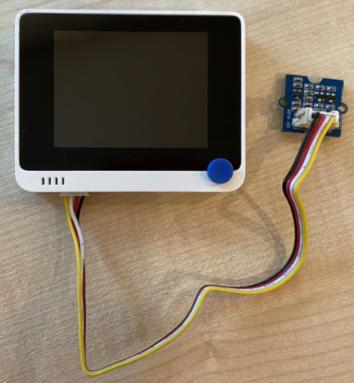

<!--
CO_OP_TRANSLATOR_METADATA:
{
  "original_hash": "288aebb0c59f7be1d2719b8f9660a313",
  "translation_date": "2025-08-27T20:44:11+00:00",
  "source_file": "4-manufacturing/lessons/4-trigger-fruit-detector/wio-terminal-proximity.md",
  "language_code": "cs"
}
-->
# Detekce blízkosti - Wio Terminal

V této části lekce přidáte k Wio Terminalu senzor blízkosti a budete z něj číst vzdálenost.

## Hardware

Wio Terminal potřebuje senzor blízkosti.

Senzor, který použijete, je [Grove Time of Flight distance sensor](https://www.seeedstudio.com/Grove-Time-of-Flight-Distance-Sensor-VL53L0X.html). Tento senzor využívá laserový modul pro měření vzdálenosti. Má rozsah od 10 mm do 2000 mm (1 cm - 2 m) a v tomto rozsahu poskytuje poměrně přesné hodnoty. Vzdálenosti nad 1000 mm jsou hlášeny jako 8109 mm.

Laserový dálkoměr se nachází na zadní straně senzoru, na opačné straně než Grove konektor.

Toto je I²C senzor.

### Připojení senzoru Time of Flight

Grove senzor Time of Flight lze připojit k Wio Terminalu.

#### Úkol - připojte senzor Time of Flight

Připojte senzor Time of Flight.


1. Zasuňte jeden konec Grove kabelu do konektoru na senzoru Time of Flight. Kabel lze zasunout pouze jedním způsobem.

1. S Wio Terminalem odpojeným od počítače nebo jiného zdroje napájení připojte druhý konec Grove kabelu do levého Grove konektoru na Wio Terminalu, když se díváte na obrazovku. Tento konektor je nejblíže k tlačítku napájení. Jedná se o kombinovaný digitální a I²C konektor.



1. Nyní můžete připojit Wio Terminal k počítači.

## Naprogramování senzoru Time of Flight

Wio Terminal nyní může být naprogramován pro použití připojeného senzoru Time of Flight.

### Úkol - naprogramujte senzor Time of Flight

1. Vytvořte nový projekt pro Wio Terminal pomocí PlatformIO. Nazvěte tento projekt `distance-sensor`. Přidejte do funkce `setup` kód pro konfiguraci sériového portu.

1. Přidejte závislost na knihovnu Seeed Grove Time of Flight Distance Sensor do souboru `platformio.ini` projektu:

    ```ini
    lib_deps =
        seeed-studio/Grove Ranging sensor - VL53L0X @ ^1.1.1
    ```

1. V souboru `main.cpp` přidejte následující řádek pod stávající direktivy `include`, abyste deklarovali instanci třídy `Seeed_vl53l0x` pro práci se senzorem Time of Flight:

    ```cpp
    #include "Seeed_vl53l0x.h"
    
    Seeed_vl53l0x VL53L0X;
    ```

1. Přidejte následující kód na konec funkce `setup` pro inicializaci senzoru:

    ```cpp
    VL53L0X.VL53L0X_common_init();
    VL53L0X.VL53L0X_high_accuracy_ranging_init();
    ```

1. Ve funkci `loop` přečtěte hodnotu ze senzoru:

    ```cpp
    VL53L0X_RangingMeasurementData_t RangingMeasurementData;
    memset(&RangingMeasurementData, 0, sizeof(VL53L0X_RangingMeasurementData_t));

    VL53L0X.PerformSingleRangingMeasurement(&RangingMeasurementData);
    ```

    Tento kód inicializuje datovou strukturu pro čtení dat, poté ji předá metodě `PerformSingleRangingMeasurement`, která ji naplní naměřenou vzdáleností.

1. Pod tento kód zapište naměřenou vzdálenost a poté nastavte zpoždění na 1 sekundu:

    ```cpp
    Serial.print("Distance = ");
    Serial.print(RangingMeasurementData.RangeMilliMeter);
    Serial.println(" mm");

    delay(1000);
    ```

1. Sestavte, nahrajte a spusťte tento kód. Na sériovém monitoru budete moci vidět naměřené vzdálenosti. Umístěte objekty blízko senzoru a uvidíte naměřené hodnoty vzdálenosti:

    ```output
    Distance = 29 mm
    Distance = 28 mm
    Distance = 30 mm
    Distance = 151 mm
    ```

    Dálkoměr se nachází na zadní straně senzoru, takže při měření vzdálenosti používejte správnou stranu.

    

> 💁 Tento kód najdete ve složce [code-proximity/wio-terminal](../../../../../4-manufacturing/lessons/4-trigger-fruit-detector/code-proximity/wio-terminal).

😀 Program pro váš senzor blízkosti byl úspěšný!

---

**Prohlášení**:  
Tento dokument byl přeložen pomocí služby pro automatický překlad [Co-op Translator](https://github.com/Azure/co-op-translator). Ačkoli se snažíme o přesnost, mějte prosím na paměti, že automatické překlady mohou obsahovat chyby nebo nepřesnosti. Původní dokument v jeho původním jazyce by měl být považován za autoritativní zdroj. Pro důležité informace se doporučuje profesionální lidský překlad. Neodpovídáme za žádné nedorozumění nebo nesprávné interpretace vyplývající z použití tohoto překladu.