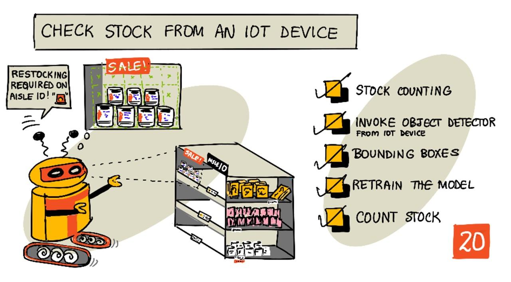
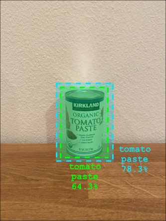

<!--
CO_OP_TRANSLATOR_METADATA:
{
  "original_hash": "1c9e5fa8b7be726c75a97232b1e41c97",
  "translation_date": "2025-08-27T22:42:42+00:00",
  "source_file": "5-retail/lessons/2-check-stock-device/README.md",
  "language_code": "cs"
}
-->
# Kontrola zásob pomocí IoT zařízení



> Náčrt od [Nitya Narasimhan](https://github.com/nitya). Klikněte na obrázek pro větší verzi.

## Kvíz před lekcí

[Kvíz před lekcí](https://black-meadow-040d15503.1.azurestaticapps.net/quiz/39)

## Úvod

V předchozí lekci jste se naučili o různých způsobech využití detekce objektů v maloobchodě. Také jste se naučili, jak natrénovat detektor objektů pro identifikaci zásob. V této lekci se naučíte, jak použít váš detektor objektů z IoT zařízení k počítání zásob.

V této lekci se zaměříme na:

* [Počítání zásob](../../../../../5-retail/lessons/2-check-stock-device)
* [Volání detektoru objektů z IoT zařízení](../../../../../5-retail/lessons/2-check-stock-device)
* [Ohraničující rámečky](../../../../../5-retail/lessons/2-check-stock-device)
* [Přetrénování modelu](../../../../../5-retail/lessons/2-check-stock-device)
* [Počítání zásob](../../../../../5-retail/lessons/2-check-stock-device)

> 🗑 Toto je poslední lekce v tomto projektu, takže po dokončení této lekce a úkolu nezapomeňte vyčistit své cloudové služby. Budete je potřebovat k dokončení úkolu, takže se ujistěte, že jej nejprve dokončíte.
>
> Pokud potřebujete, podívejte se na [průvodce vyčištěním projektu](../../../clean-up.md) pro pokyny, jak to provést.

## Počítání zásob

Detektory objektů mohou být použity pro kontrolu zásob, ať už pro jejich počítání nebo zajištění, že jsou na správném místě. IoT zařízení s kamerami mohou být rozmístěna po celém obchodě, aby monitorovala zásoby, počínaje klíčovými místy, kde je důležité mít zboží doplněné, například v oblastech, kde se skladují malé množství drahých položek.

Například pokud kamera míří na regál, který pojme 8 plechovek rajčatového protlaku, a detektor objektů detekuje pouze 7 plechovek, pak jedna chybí a je třeba ji doplnit.


Na obrázku výše detektor objektů detekoval 7 plechovek rajčatového protlaku na regálu, který pojme 8 plechovek. IoT zařízení může nejen odeslat upozornění na potřebu doplnění, ale dokonce může poskytnout informaci o umístění chybějící položky, což je důležitý údaj, pokud používáte roboty k doplňování regálů.

> 💁 V závislosti na obchodě a oblíbenosti položky by se doplňování pravděpodobně neprovádělo, pokud by chyběla pouze jedna plechovka. Bylo by třeba vytvořit algoritmus, který určí, kdy doplnit zásoby na základě vašeho zboží, zákazníků a dalších kritérií.

✅ V jakých dalších situacích byste mohli kombinovat detekci objektů a roboty?

Někdy se na regálech může objevit nesprávné zboží. Může jít o lidskou chybu při doplňování nebo o zákazníky, kteří si nákup rozmyslí a vrátí položku na první dostupné místo. Pokud jde o trvanlivé zboží, jako jsou konzervy, je to nepříjemnost. Pokud jde o zboží podléhající zkáze, jako jsou mražené nebo chlazené produkty, může to znamenat, že produkt již nelze prodat, protože může být nemožné zjistit, jak dlouho byl mimo mrazák.

Detekce objektů může být použita k detekci neočekávaných položek, a opět upozornit člověka nebo robota, aby položku co nejdříve vrátil na správné místo.


Na obrázku výše byla na regál s rajčatovým protlakem umístěna plechovka baby kukuřice. Detektor objektů ji detekoval, což umožňuje IoT zařízení upozornit člověka nebo robota, aby plechovku vrátil na správné místo.

## Volání detektoru objektů z IoT zařízení

Detektor objektů, který jste natrénovali v předchozí lekci, lze volat z vašeho IoT zařízení.

### Úkol - publikování iterace vašeho detektoru objektů

Iterace se publikují z portálu Custom Vision.

1. Otevřete portál Custom Vision na [CustomVision.ai](https://customvision.ai) a přihlaste se, pokud jej již nemáte otevřený. Poté otevřete svůj projekt `stock-detector`.

1. Vyberte kartu **Performance** z možností nahoře.

1. Vyberte nejnovější iteraci ze seznamu *Iterations* na straně.

1. Klikněte na tlačítko **Publish** pro danou iteraci.

    

1. V dialogu *Publish Model* nastavte *Prediction resource* na zdroj `stock-detector-prediction`, který jste vytvořili v předchozí lekci. Název ponechte jako `Iteration2` a klikněte na tlačítko **Publish**.

1. Po publikování klikněte na tlačítko **Prediction URL**. Zobrazí se podrobnosti o predikčním API, které budete potřebovat k volání modelu z vašeho IoT zařízení. Spodní část je označena *If you have an image file*, a to jsou údaje, které potřebujete. Zkopírujte zobrazenou URL, která bude vypadat například takto:

    ```output
    https://<location>.api.cognitive.microsoft.com/customvision/v3.0/Prediction/<id>/detect/iterations/Iteration2/image
    ```

    Kde `<location>` bude lokalita, kterou jste použili při vytváření zdroje Custom Vision, a `<id>` bude dlouhé ID složené z písmen a čísel.

    Také si zkopírujte hodnotu *Prediction-Key*. Jedná se o bezpečnostní klíč, který musíte předat při volání modelu. Pouze aplikace, které tento klíč předají, mohou model používat, ostatní aplikace budou odmítnuty.

    

✅ Když je publikována nová iterace, bude mít jiný název. Jak myslíte, že byste změnili iteraci, kterou IoT zařízení používá?

### Úkol - volání detektoru objektů z IoT zařízení

Postupujte podle příslušného průvodce níže, abyste použili detektor objektů z vašeho IoT zařízení:

* [Arduino - Wio Terminal](wio-terminal-object-detector.md)
* [Jednodeskový počítač - Raspberry Pi/virtuální zařízení](single-board-computer-object-detector.md)

## Ohraničující rámečky

Při použití detektoru objektů získáte nejen detekované objekty s jejich štítky a pravděpodobnostmi, ale také ohraničující rámečky objektů. Ty definují, kde detektor objektů detekoval objekt s danou pravděpodobností.

> 💁 Ohraničující rámeček je rámeček, který definuje oblast obsahující detekovaný objekt, tedy hranici pro objekt.

Výsledky predikce na kartě **Predictions** v Custom Vision mají ohraničující rámečky nakreslené na obrázku, který byl odeslán k predikci.


Na obrázku výše byly detekovány 4 plechovky rajčatového protlaku. Ve výsledcích je na každý detekovaný objekt v obrázku překryt červený čtverec, který označuje ohraničující rámeček.

✅ Otevřete predikce v Custom Vision a podívejte se na ohraničující rámečky.

Ohraničující rámečky jsou definovány 4 hodnotami - horní, levá, výška a šířka. Tyto hodnoty jsou na škále 0-1, což představuje pozice jako procento velikosti obrázku. Počátek (pozice 0,0) je v levém horním rohu obrázku, takže horní hodnota je vzdálenost od horního okraje a spodní část ohraničujícího rámečku je horní hodnota plus výška.


Výše uvedený obrázek má šířku 600 pixelů a výšku 800 pixelů. Ohraničující rámeček začíná 320 pixelů dolů, což dává horní souřadnici 0,4 (800 x 0,4 = 320). Zleva začíná ohraničující rámeček 240 pixelů, což dává levou souřadnici 0,4 (600 x 0,4 = 240). Výška ohraničujícího rámečku je 240 pixelů, což dává hodnotu výšky 0,3 (800 x 0,3 = 240). Šířka ohraničujícího rámečku je 120 pixelů, což dává hodnotu šířky 0,2 (600 x 0,2 = 120).

| Souřadnice | Hodnota |
| ---------- | ------: |
| Horní      | 0,4     |
| Levá       | 0,4     |
| Výška      | 0,3     |
| Šířka      | 0,2     |

Použití procentuálních hodnot od 0 do 1 znamená, že bez ohledu na to, na jakou velikost je obrázek změněn, ohraničující rámeček začíná 0,4 podél a dolů a má výšku 0,3 a šířku 0,2.

Můžete použít ohraničující rámečky v kombinaci s pravděpodobnostmi k vyhodnocení, jak přesná je detekce. Například detektor objektů může detekovat více objektů, které se překrývají, například detekovat jednu plechovku uvnitř druhé. Váš kód by mohl zkontrolovat ohraničující rámečky, pochopit, že to není možné, a ignorovat jakékoli objekty, které se významně překrývají s jinými objekty.



V příkladu výše jeden ohraničující rámeček označuje předpokládanou plechovku rajčatového protlaku s pravděpodobností 78,3 %. Druhý ohraničující rámeček je o něco menší a je uvnitř prvního rámečku s pravděpodobností 64,3 %. Váš kód může zkontrolovat ohraničující rámečky, zjistit, že se zcela překrývají, a ignorovat nižší pravděpodobnost, protože není možné, aby jedna plechovka byla uvnitř druhé.

✅ Dokážete si představit situaci, kdy je platné detekovat jeden objekt uvnitř druhého?

## Přetrénování modelu

Stejně jako u klasifikátoru obrázků můžete svůj model přetrénovat pomocí dat zachycených vaším IoT zařízením. Použití těchto reálných dat zajistí, že váš model bude dobře fungovat při použití z IoT zařízení.

Na rozdíl od klasifikátoru obrázků nemůžete jednoduše označit obrázek. Místo toho musíte zkontrolovat každý ohraničující rámeček detekovaný modelem. Pokud je rámeček kolem nesprávné věci, je třeba jej odstranit, pokud je na nesprávném místě, je třeba jej upravit.

### Úkol - přetrénování modelu

1. Ujistěte se, že jste zachytili řadu obrázků pomocí svého IoT zařízení.

1. Na kartě **Predictions** vyberte obrázek. Uvidíte červené rámečky označující ohraničující rámečky detekovaných objektů.

1. Projděte každý ohraničující rámeček. Vyberte jej a zobrazí se vyskakovací okno s označením. Použijte úchyty na rozích ohraničujícího rámečku k úpravě velikosti, pokud je to nutné. Pokud je označení nesprávné, odstraňte jej tlačítkem **X** a přidejte správné označení. Pokud ohraničující rámeček neobsahuje objekt, odstraňte jej tlačítkem koše.

1. Po dokončení zavřete editor a obrázek se přesune z karty **Predictions** na kartu **Training Images**. Opakujte proces pro všechny predikce.

1. Použijte tlačítko **Train** k přetrénování modelu. Po dokončení trénování publikujte iteraci a aktualizujte své IoT zařízení, aby používalo URL nové iterace.

1. Znovu nasaďte svůj kód a otestujte své IoT zařízení.

## Počítání zásob

Pomocí kombinace počtu detekovaných objektů a ohraničujících rámečků můžete spočítat zásoby na regálu.

### Úkol - počítání zásob

Postupujte podle příslušného průvodce níže, abyste spočítali zásoby pomocí výsledků z detektoru objektů z vašeho IoT zařízení:

* [Arduino - Wio Terminal](wio-terminal-count-stock.md)
* [Jednodeskový počítač - Raspberry Pi/virtuální zařízení](single-board-computer-count-stock.md)

---

## 🚀 Výzva

Dokážete detekovat nesprávné zboží? Natrénujte svůj model na více objektech a poté aktualizujte svou aplikaci, aby vás upozornila, pokud je detekováno nesprávné zboží.

Možná to posuňte ještě dál a detekujte zboží vedle sebe na stejném regálu a zjistěte, zda něco nebylo umístěno na nesprávné místo definováním limitů na ohraničujících rámečcích.

## Kvíz po lekci

[Kvíz po lekci](https://black-meadow-040d15503.1.azurestaticapps.net/quiz/40)

## Přehled a samostudium

* Zjistěte více o tom, jak navrhnout kompletní systém detekce zásob z průvodce [Out of stock detection at the edge pattern guide on Microsoft Docs](https://docs.microsoft.com/hybrid/app-solutions/pattern-out-of-stock-at-edge?WT.mc_id=academic-17441-jabenn).
* Naučte se další způsoby, jak vytvořit kompletní maloobchodní řešení kombinující řadu IoT a cloudových služeb sledováním [Behind the scenes of a retail solution - Hands On! video on YouTube](https://www.youtube.com/watch?v=m3Pc300x2Mw).

## Úkol

[Použijte svůj detektor objektů na okraji](assignment.md)

---

**Prohlášení**:  
Tento dokument byl přeložen pomocí služby pro automatický překlad [Co-op Translator](https://github.com/Azure/co-op-translator). I když se snažíme o přesnost, mějte prosím na paměti, že automatické překlady mohou obsahovat chyby nebo nepřesnosti. Původní dokument v jeho původním jazyce by měl být považován za autoritativní zdroj. Pro důležité informace se doporučuje profesionální lidský překlad. Neodpovídáme za žádné nedorozumění nebo nesprávné interpretace vyplývající z použití tohoto překladu.