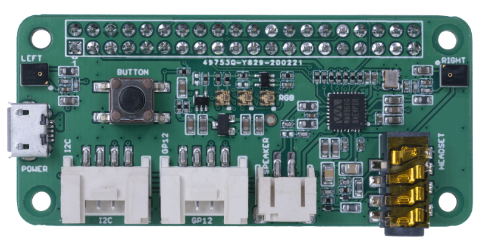

<!--
CO_OP_TRANSLATOR_METADATA:
{
  "original_hash": "93d352de36526b8990e41dd538100324",
  "translation_date": "2025-08-27T21:22:23+00:00",
  "source_file": "6-consumer/lessons/1-speech-recognition/wio-terminal-microphone.md",
  "language_code": "cs"
}
-->
# Nastavení mikrofonu a reproduktorů - Wio Terminal

V této části lekce přidáte reproduktory k vašemu Wio Terminalu. Wio Terminal již má vestavěný mikrofon, který lze použít k zachycení řeči.

## Hardware

Wio Terminal má již vestavěný mikrofon, který lze použít k zachycení zvuku pro rozpoznávání řeči.

Pro přidání reproduktoru můžete použít [ReSpeaker 2-Mics Pi Hat](https://www.seeedstudio.com/ReSpeaker-2-Mics-Pi-HAT.html). Jedná se o externí desku, která obsahuje 2 MEMS mikrofony, konektor pro reproduktor a sluchátkový výstup.

Budete potřebovat připojit buď sluchátka, reproduktor s 3,5mm jackem, nebo reproduktor s JST konektorem, například [Mono Enclosed Speaker - 2W 6 Ohm](https://www.seeedstudio.com/Mono-Enclosed-Speaker-2W-6-Ohm-p-2832.html).

Pro připojení ReSpeaker 2-Mics Pi Hat budete potřebovat 40 pin-to-pin (také označované jako samec-samec) propojovací kabely.

> 💁 Pokud umíte pájet, můžete použít [40 Pin Raspberry Pi Hat Adapter Board For Wio Terminal](https://www.seeedstudio.com/40-Pin-Raspberry-Pi-Hat-Adapter-Board-For-Wio-Terminal-p-4730.html) pro připojení ReSpeakeru.

Budete také potřebovat SD kartu pro stahování a přehrávání zvuku. Wio Terminal podporuje pouze SD karty do velikosti 16 GB, které musí být naformátovány jako FAT32 nebo exFAT.

### Úkol - připojení ReSpeaker Pi Hat

1. S vypnutým Wio Terminalem připojte ReSpeaker 2-Mics Pi Hat k Wio Terminalu pomocí propojovacích kabelů a GPIO konektorů na zadní straně Wio Terminalu:

    Piny musí být připojeny tímto způsobem:

    

1. Umístěte ReSpeaker a Wio Terminal tak, aby GPIO konektory směřovaly nahoru a byly na levé straně.

1. Začněte od konektoru v levém horním rohu GPIO konektoru na ReSpeakeru. Připojte propojovací kabel z levého horního konektoru ReSpeakeru do levého horního konektoru Wio Terminalu.

1. Opakujte tento postup po celé délce GPIO konektorů na levé straně. Ujistěte se, že jsou piny pevně zasunuty.

    

    

    > 💁 Pokud jsou vaše propojovací kabely spojeny do pásků, nechte je pohromadě – usnadní to zajištění správného pořadí připojení všech kabelů.

1. Opakujte proces s pravými GPIO konektory na ReSpeakeru a Wio Terminalu. Tyto kabely musí obcházet již připojené kabely.

    

    

    > 💁 Pokud jsou vaše propojovací kabely spojeny do pásků, rozdělte je na dva pásky. Jeden veďte na každé straně již připojených kabelů.

    > 💁 Můžete použít lepicí pásku k upevnění pinů do bloku, aby se zabránilo jejich uvolnění během připojování.
    >
    > 

1. Budete muset připojit reproduktor.

    * Pokud používáte reproduktor s JST kabelem, připojte jej k JST portu na ReSpeakeru.

      

    * Pokud používáte reproduktor s 3,5mm jackem nebo sluchátka, zasuňte je do 3,5mm jack konektoru.

      

### Úkol - nastavení SD karty

1. Připojte SD kartu k počítači, použijte externí čtečku, pokud nemáte slot na SD kartu.

1. Naformátujte SD kartu pomocí vhodného nástroje na vašem počítači, ujistěte se, že používáte souborový systém FAT32 nebo exFAT.

1. Vložte SD kartu do slotu na SD kartu na levé straně Wio Terminalu, těsně pod tlačítkem napájení. Ujistěte se, že karta je zcela zasunuta a zacvakne – možná budete potřebovat tenký nástroj nebo jinou SD kartu, abyste ji zcela zasunuli.

    

    > 💁 Pro vysunutí SD karty ji musíte mírně zatlačit, aby se vysunula. Budete potřebovat tenký nástroj, například plochý šroubovák nebo jinou SD kartu.

---

**Prohlášení**:  
Tento dokument byl přeložen pomocí služby pro automatický překlad [Co-op Translator](https://github.com/Azure/co-op-translator). Ačkoli se snažíme o přesnost, mějte prosím na paměti, že automatické překlady mohou obsahovat chyby nebo nepřesnosti. Původní dokument v jeho původním jazyce by měl být považován za autoritativní zdroj. Pro důležité informace doporučujeme profesionální lidský překlad. Neodpovídáme za žádné nedorozumění nebo nesprávné interpretace vyplývající z použití tohoto překladu.