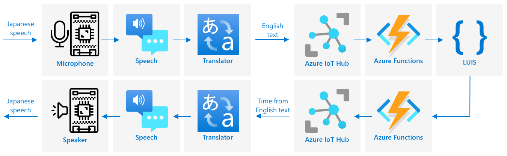

<!--
CO_OP_TRANSLATOR_METADATA:
{
  "original_hash": "c16de27b0074abe81d6a8bad5e5b1a6b",
  "translation_date": "2025-08-27T21:31:18+00:00",
  "source_file": "6-consumer/lessons/4-multiple-language-support/README.md",
  "language_code": "cs"
}
-->
# Podpora více jazyků


> Sketchnote od [Nitya Narasimhan](https://github.com/nitya). Klikněte na obrázek pro větší verzi.

Toto video poskytuje přehled služeb Azure pro práci s řečí, zahrnující převod řeči na text a textu na řeč z předchozích lekcí, stejně jako překlad řeči, což je téma této lekce:

[](https://www.youtube.com/watch?v=h6xbpMPSGEA)

> 🎥 Klikněte na obrázek výše pro zhlédnutí videa

## Kvíz před lekcí

[Kvíz před lekcí](https://black-meadow-040d15503.1.azurestaticapps.net/quiz/47)

## Úvod

V posledních třech lekcích jste se naučili, jak převádět řeč na text, porozumět jazyku a převádět text na řeč, vše za pomoci AI. Další oblastí lidské komunikace, kde může AI pomoci, je překlad jazyků – převod z jednoho jazyka do druhého, například z angličtiny do francouzštiny.

V této lekci se naučíte, jak používat AI k překladu textu, což umožní vašemu chytrému časovači komunikovat s uživateli v různých jazycích.

V této lekci se zaměříme na:

* [Překlad textu](../../../../../6-consumer/lessons/4-multiple-language-support)
* [Služby pro překlad](../../../../../6-consumer/lessons/4-multiple-language-support)
* [Vytvoření zdroje pro překlad](../../../../../6-consumer/lessons/4-multiple-language-support)
* [Podpora více jazyků v aplikacích pomocí překladů](../../../../../6-consumer/lessons/4-multiple-language-support)
* [Překlad textu pomocí AI služby](../../../../../6-consumer/lessons/4-multiple-language-support)

> 🗑 Toto je poslední lekce v tomto projektu, takže po dokončení této lekce a úkolu nezapomeňte vyčistit své cloudové služby. Budete je potřebovat k dokončení úkolu, takže se ujistěte, že jej nejprve dokončíte.
>
> Pokud potřebujete, podívejte se na [průvodce vyčištěním projektu](../../../clean-up.md) pro pokyny, jak to udělat.

## Překlad textu

Překlad textu je problém počítačové vědy, který se zkoumá již více než 70 let, a teprve nyní díky pokrokům v AI a výpočetní síle se blíží řešení, které je téměř stejně dobré jako lidský překlad.

> 💁 Počátky lze vystopovat ještě dále, až k [Al-Kindimu](https://wikipedia.org/wiki/Al-Kindi), arabskému kryptografovi z 9. století, který vyvinul techniky pro překlad jazyků.

### Strojové překlady

Překlad textu začal jako technologie známá jako strojový překlad (MT), která dokáže překládat mezi různými jazykovými páry. MT funguje tak, že nahrazuje slova v jednom jazyce jinými, přičemž přidává techniky pro výběr správného způsobu překladu frází nebo částí vět, když jednoduchý překlad slovo za slovem nedává smysl.

> 🎓 Když překladače podporují překlad mezi jedním jazykem a druhým, nazývají se *jazykové páry*. Různé nástroje podporují různé jazykové páry, které nemusí být kompletní. Například překladač může podporovat angličtinu do španělštiny jako jazykový pár a španělštinu do italštiny jako jazykový pár, ale ne angličtinu do italštiny.

Například překlad „Hello world“ z angličtiny do francouzštiny lze provést substitucí – „Bonjour“ za „Hello“ a „le monde“ za „world“, což vede ke správnému překladu „Bonjour le monde“.

Substituce nefungují, když různé jazyky používají různé způsoby vyjádření stejné věci. Například anglická věta „My name is Jim“ se překládá do francouzštiny jako „Je m'appelle Jim“ – doslova „Já se jmenuji Jim“. „Je“ je francouzsky „já“, „moi“ je „mě“, ale je spojeno se slovesem, protože začíná samohláskou, takže se stává „m'“, „appelle“ znamená „volat“ a „Jim“ se nepřekládá, protože je to jméno, nikoli slovo, které lze přeložit. Pořadí slov se také stává problémem – jednoduchá substituce „Je m'appelle Jim“ se stává „I myself call Jim“, s jiným pořadím slov než v angličtině.

> 💁 Některá slova se nikdy nepřekládají – moje jméno je Jim bez ohledu na to, jaký jazyk se používá k představení. Při překladu do jazyků, které používají různé abecedy nebo různé znaky pro různé zvuky, mohou být slova *transliterována*, což znamená výběr písmen nebo znaků, které odpovídají zvuku tak, aby zněly stejně jako dané slovo.

Idiomy jsou také problémem pro překlad. Jedná se o fráze, které mají pochopený význam odlišný od přímé interpretace slov. Například v angličtině idiom „I've got ants in my pants“ neodkazuje doslovně na mravence v oblečení, ale na neklid. Pokud byste to přeložili do němčiny, zmátli byste posluchače, protože německá verze je „I have bumble bees in the bottom“.

> 💁 Různé lokality přidávají různé složitosti. U idiomu „ants in your pants“ v americké angličtině „pants“ odkazuje na svrchní oděv, v britské angličtině „pants“ znamená spodní prádlo.

✅ Pokud mluvíte více jazyky, zamyslete se nad některými frázemi, které se nedají přímo přeložit.

Systémy strojového překladu spoléhají na rozsáhlé databáze pravidel, která popisují, jak překládat určité fráze a idiomy, spolu se statistickými metodami pro výběr vhodných překladů z možných možností. Tyto statistické metody využívají obrovské databáze děl přeložených lidmi do více jazyků k výběru nejpravděpodobnějšího překladu, což je technika nazývaná *statistický strojový překlad*. Některé z nich používají mezilehlé reprezentace jazyka, což umožňuje překlad jednoho jazyka do mezilehlého, a poté z mezilehlého do jiného jazyka. Tímto způsobem přidání dalších jazyků zahrnuje překlady do a z mezilehlého jazyka, nikoli do a ze všech ostatních jazyků.

### Neuronové překlady

Neuronové překlady využívají sílu AI k překladu, obvykle překládají celé věty pomocí jednoho modelu. Tyto modely jsou trénovány na obrovských datových sadách, které byly přeloženy lidmi, jako jsou webové stránky, knihy a dokumentace OSN.

Neuronové překladové modely jsou obvykle menší než modely strojového překladu, protože nepotřebují obrovské databáze frází a idiomů. Moderní AI služby, které poskytují překlady, často kombinují více technik, míchají statistický strojový překlad a neuronový překlad.

Neexistuje žádný 1:1 překlad pro žádný jazykový pár. Různé překladové modely budou produkovat mírně odlišné výsledky v závislosti na datech použitých k trénování modelu. Překlady nejsou vždy symetrické – pokud přeložíte větu z jednoho jazyka do druhého a poté zpět do prvního jazyka, můžete vidět mírně odlišnou větu jako výsledek.

✅ Vyzkoušejte různé online překladače, jako [Bing Translate](https://www.bing.com/translator), [Google Translate](https://translate.google.com) nebo aplikaci Apple Translate. Porovnejte přeložené verze několika vět. Také zkuste přeložit v jednom a poté přeložit zpět v jiném.

## Služby pro překlad

Existuje řada AI služeb, které lze použít z vašich aplikací k překladu řeči a textu.

### Cognitive services Speech service


Služba Speech, kterou jste používali v předchozích lekcích, má schopnosti překladu pro rozpoznávání řeči. Když rozpoznáváte řeč, můžete požádat nejen o text řeči ve stejném jazyce, ale také v jiných jazycích.

> 💁 Toto je dostupné pouze prostřednictvím SDK služby Speech, REST API nemá vestavěné překlady.

### Cognitive services Translator service


Služba Translator je specializovaná překladová služba, která dokáže překládat text z jednoho jazyka do jednoho nebo více cílových jazyků. Kromě překladu podporuje širokou škálu dalších funkcí, včetně maskování vulgarismů. Umožňuje také poskytnout konkrétní překlad pro určité slovo nebo větu, aby pracovala s termíny, které nechcete překládat, nebo měla specifický známý překlad.

Například při překladu věty „I have a Raspberry Pi“, odkazující na jednodeskový počítač, do jiného jazyka, jako je francouzština, byste chtěli zachovat název „Raspberry Pi“ tak, jak je, a nepřekládat jej, což by vedlo k „J’ai un Raspberry Pi“ místo „J’ai une pi aux framboises“.

## Vytvoření zdroje pro překlad

Pro tuto lekci budete potřebovat zdroj Translator. Použijete REST API k překladu textu.

### Úkol – vytvoření zdroje pro překlad

1. Z vašeho terminálu nebo příkazového řádku spusťte následující příkaz k vytvoření zdroje Translator ve vaší skupině zdrojů `smart-timer`.

    ```sh
    az cognitiveservices account create --name smart-timer-translator \
                                        --resource-group smart-timer \
                                        --kind TextTranslation \
                                        --sku F0 \
                                        --yes \
                                        --location <location>
    ```

    Nahraďte `<location>` místem, které jste použili při vytváření skupiny zdrojů.

1. Získejte klíč pro službu Translator:

    ```sh
    az cognitiveservices account keys list --name smart-timer-translator \
                                           --resource-group smart-timer \
                                           --output table
    ```

    Zkopírujte jeden z klíčů.

## Podpora více jazyků v aplikacích pomocí překladů

V ideálním světě by celá vaše aplikace měla rozumět co nejvíce různým jazykům, od poslechu řeči, přes porozumění jazyku, až po odpovědi řečí. To je hodně práce, takže překladové služby mohou urychlit čas dodání vaší aplikace.



Představte si, že vytváříte chytrý časovač, který používá angličtinu od začátku do konce, rozumí mluvené angličtině a převádí ji na text, provádí porozumění jazyku v angličtině, sestavuje odpovědi v angličtině a odpovídá anglickou řečí. Pokud byste chtěli přidat podporu japonštiny, mohli byste začít překladem mluvené japonštiny na anglický text, poté ponechat jádro aplikace stejné, a nakonec přeložit odpovědní text do japonštiny před jeho vyslovením. To by vám umožnilo rychle přidat podporu japonštiny a později můžete rozšířit na plnou podporu japonštiny od začátku do konce.

> 💁 Nevýhodou spoléhání se na strojový překlad je, že různé jazyky a kultury mají různé způsoby vyjádření stejných věcí, takže překlad nemusí odpovídat výrazu, který očekáváte.

Strojové překlady také otevírají možnosti pro aplikace a zařízení, která mohou překládat obsah vytvořený uživatelem, jakmile je vytvořen. Sci-fi pravidelně představuje „univerzální překladače“, zařízení, která dokážou překládat z mimozemských jazyků do (typicky) americké angličtiny. Tato zařízení jsou méně sci-fi, více vědecký fakt, pokud ignorujete část o mimozemšťanech. Již existují aplikace a zařízení, která poskytují překlad řeči a psaného textu v reálném čase, pomocí kombinací služeb řeči a překladu.

Jedním příkladem je mobilní aplikace [Microsoft Translator](https://www.microsoft.com/translator/apps/?WT.mc_id=academic-17441-jabenn), demonstrovaná v tomto videu:

[](https://www.youtube.com/watch?v=16yAGeP2FuM)

> 🎥 Klikněte na obrázek výše pro zhlédnutí videa

Představte si, že máte takové zařízení k dispozici, zejména při cestování nebo interakci s lidmi, jejichž jazyk neznáte. Automatické překladové zařízení na letištích nebo v nemocnicích by poskytlo tolik potřebné zlepšení přístupnosti.

✅ Proveďte výzkum: Existují nějaká překladová IoT zařízení komerčně dostupná? Co překladové schopnosti zabudované do chytrých zařízení?

> 👽 Ačkoli neexistují žádné skutečné univerzální překladače, které by nám umožnily mluvit s mimozemšťany, [Microsoft Translator podporuje klingonštinu](https://www.microsoft.com/translator/blog/2013/05/14/announcing-klingon-for-bing-translator/?WT.mc_id=academic-17441-jabenn). Qapla’!

## Překlad textu pomocí AI služby

Můžete použít AI službu k přidání této překladové schopnosti do vašeho chytrého časovače.

### Úkol – překlad textu pomocí AI služby

Projděte si relevantní průvodce pro překlad textu na vašem IoT zařízení:

* [Arduino - Wio Terminal](wio-terminal-translate-speech.md)
* [Jednodeskový počítač - Raspberry Pi](pi-translate-speech.md)
* [Jednodeskový počítač - Virtuální zařízení](virtual-device-translate-speech.md)

---

## 🚀 Výzva

Jak mohou strojové překlady přinést užitek jiným IoT aplikacím než chytrým zařízením? Zamyslete se nad různými způsoby, jak mohou překlady pomoci, nejen s mluvenými slovy, ale i s textem.

## Kvíz po lekci

[Kvíz po lekci](https://black-meadow-040d15503.1.azurestaticapps.net/quiz/48)

## Přehled & Samostudium

* Přečtěte si více o strojovém překladu na [stránce o strojovém překladu na Wikipedii](https://wikipedia.org/wiki/Machine_translation)
* Přečtěte si více o neuronovém strojovém překladu na [stránce o neuronovém strojovém překladu na Wikipedii](https://wikipedia.org/wiki/Neural_machine_translation)
* Podívejte se na seznam podporovaných jazyků pro služby řeči Microsoft na [stránce o podpoře jazyků a hlasů pro službu Speech v dokumentaci Microsoft Docs](https://docs.microsoft.com/azure/cognitive-services/speech-service/language-support?WT.mc_id=academic-17441-jabenn)

## Úkol

[Postavte univerzální překladač](assignment.md)

---

**Prohlášení**:  
Tento dokument byl přeložen pomocí služby pro automatický překlad [Co-op Translator](https://github.com/Azure/co-op-translator). Ačkoli se snažíme o přesnost, mějte prosím na paměti, že automatické překlady mohou obsahovat chyby nebo nepřesnosti. Původní dokument v jeho původním jazyce by měl být považován za autoritativní zdroj. Pro důležité informace se doporučuje profesionální lidský překlad. Neodpovídáme za žádná nedorozumění nebo nesprávné interpretace vyplývající z použití tohoto překladu.