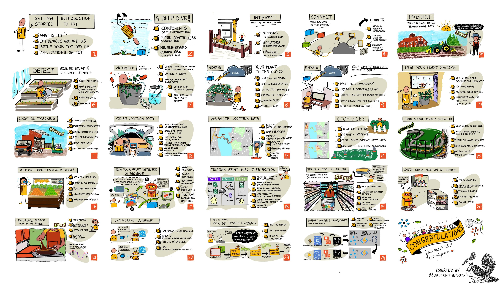

<!--
CO_OP_TRANSLATOR_METADATA:
{
  "original_hash": "859d11be071d66c7da196dd1857d47b4",
  "translation_date": "2025-10-24T09:22:02+00:00",
  "source_file": "README.md",
  "language_code": "cs"
}
-->
[](https://github.com/microsoft/IoT-For-Beginners/blob/master/LICENSE)
[](https://GitHub.com/microsoft/IoT-For-Beginners/graphs/contributors/)
[](https://GitHub.com/microsoft/IoT-For-Beginners/issues/)
[](https://GitHub.com/microsoft/IoT-For-Beginners/pulls/)
[](http://makeapullrequest.com)

[](https://GitHub.com/microsoft/IoT-For-Beginners/watchers/)
[](https://GitHub.com/microsoft/IoT-For-Beginners/network/)
[](https://GitHub.com/microsoft/IoT-For-Beginners/stargazers/)

### P콏ipojte se ke komunit캩 Azure AI Foundry 
[](https://discord.com/invite/ByRwuEEgH4)

Postupujte podle t캩chto krok콢, abyste mohli za캜칤t pou쮂셨at tyto zdroje:
1. **Forkn캩te repozit치콏**: Klikn캩te [](https://GitHub.com/microsoft/IoT-For-Beginners/fork)
2. **Naklonujte repozit치콏**:   `git clone https://github.com/microsoft/IoT-For-Beginners.git`
3. [**P콏ipojte se na Discord Azure AI Foundry a setkejte se s odborn칤ky a dal코칤mi v칳voj치콏i**](https://discord.com/invite/ByRwuEEgH4)


### 游깷 Podpora v칤ce jazyk콢

#### Podporov치no prost콏ednictv칤m GitHub Action (automatizov치no a v쬯y aktu치ln칤)

<!-- CO-OP TRANSLATOR LANGUAGES TABLE START -->
[Arab코tina](../ar/README.md) | [Beng치l코tina](../bn/README.md) | [Bulhar코tina](../bg/README.md) | [Barm코tina (Myanmar)](../my/README.md) | [캛칤n코tina (zjednodu코en치)](../zh/README.md) | [캛칤n코tina (tradi캜n칤, Hongkong)](../hk/README.md) | [캛칤n코tina (tradi캜n칤, Macao)](../mo/README.md) | [캛칤n코tina (tradi캜n칤, Tchaj-wan)](../tw/README.md) | [Chorvat코tina](../hr/README.md) | [캛e코tina](./README.md) | [D치n코tina](../da/README.md) | [Nizozem코tina](../nl/README.md) | [Eston코tina](../et/README.md) | [Fin코tina](../fi/README.md) | [Francouz코tina](../fr/README.md) | [N캩m캜ina](../de/README.md) | [콎e캜tina](../el/README.md) | [Hebrej코tina](../he/README.md) | [Hind코tina](../hi/README.md) | [Ma캞ar코tina](../hu/README.md) | [Indon칠코tina](../id/README.md) | [Ital코tina](../it/README.md) | [Japon코tina](../ja/README.md) | [Korej코tina](../ko/README.md) | [Litev코tina](../lt/README.md) | [Malaj코tina](../ms/README.md) | [Mar치th코tina](../mr/README.md) | [Nep치l코tina](../ne/README.md) | [Nor코tina](../no/README.md) | [Per코tina (Farsi)](../fa/README.md) | [Pol코tina](../pl/README.md) | [Portugal코tina (Braz칤lie)](../br/README.md) | [Portugal코tina (Portugalsko)](../pt/README.md) | [Panj치b코tina (Gurmukhi)](../pa/README.md) | [Rumun코tina](../ro/README.md) | [Ru코tina](../ru/README.md) | [Srb코tina (cyrilice)](../sr/README.md) | [Sloven코tina](../sk/README.md) | [Slovin코tina](../sl/README.md) | [맗an캩l코tina](../es/README.md) | [Svahil코tina](../sw/README.md) | [맜칠d코tina](../sv/README.md) | [Tagalog (Filip칤n코tina)](../tl/README.md) | [Tamil코tina](../ta/README.md) | [Thaj코tina](../th/README.md) | [Ture캜tina](../tr/README.md) | [Ukrajin코tina](../uk/README.md) | [Urdu](../ur/README.md) | [Vietnam코tina](../vi/README.md)
<!-- CO-OP TRANSLATOR LANGUAGES TABLE END -->

# IoT pro za캜치te캜n칤ky - kurikulum

Azure Cloud Advocates ve spole캜nosti Microsoft s pot캩코en칤m nab칤zej칤 12t칳denn칤 kurikulum s 24 lekcemi zam캩콏en칠 na z치klady IoT. Ka쬯치 lekce obsahuje kv칤zy p콏ed a po lekci, p칤semn칠 pokyny k dokon캜en칤 lekce, 콏e코en칤, 칰koly a dal코칤. N치코 p콏칤stup zalo쬰n칳 na projektech v치m umo쬹칤 u캜it se p콏i tvorb캩, co je osv캩d캜en칳 zp콢sob, jak si osvojit nov칠 dovednosti.

Projekty pokr칳vaj칤 cestu potravin od farmy na st콢l. To zahrnuje zem캩d캩lstv칤, logistiku, v칳robu, maloobchod a spot콏ebitele - v코echny obl칤ben칠 oblasti pr콢myslu pro za콏칤zen칤 IoT.



> Sketchnote od [Nitya Narasimhan](https://github.com/nitya). Klikn캩te na obr치zek pro v캩t코칤 verzi.

**Velk칠 d칤ky na코im autor콢m [Jen Fox](https://github.com/jenfoxbot), [Jen Looper](https://github.com/jlooper), [Jim Bennett](https://github.com/jimbobbennett) a na코칤 sketchnote um캩lkyni [Nitya Narasimhan](https://github.com/nitya).**

**D캩kujeme tak칠 na코emu t칳mu [Microsoft Learn Student Ambassadors](https://studentambassadors.microsoft.com?WT.mc_id=academic-17441-jabenn), kte콏칤 revidovali a p콏ekl치dali toto kurikulum - [Aditya Garg](https://github.com/AdityaGarg00), [Anurag Sharma](https://github.com/Anurag-0-1-A), [Arpita Das](https://github.com/Arpiiitaaa), [Aryan Jain](https://www.linkedin.com/in/aryan-jain-47a4a1145/), [Bhavesh Suneja](https://github.com/EliteWarrior315), [Faith Hunja](https://faithhunja.github.io/), [Lateefah Bello](https://www.linkedin.com/in/lateefah-bello/), [Manvi Jha](https://github.com/Severus-Matthew), [Mireille Tan](https://www.linkedin.com/in/mireille-tan-a4834819a/), [Mohammad Iftekher (Iftu) Ebne Jalal](https://github.com/Iftu119), [Mohammad Zulfikar](https://github.com/mohzulfikar), [Priyanshu Srivastav](https://www.linkedin.com/in/priyanshu-srivastav-b067241ba), [Thanmai Gowducheruvu](https://github.com/innovation-platform) a [Zina Kamel](https://www.linkedin.com/in/zina-kamel/).**

Seznamte se s t칳mem!

[](https://youtu.be/-wippUJRi5k)

**Gif vytvo콏il** [Mohit Jaisal](https://linkedin.com/in/mohitjaisal)

> 游꿘 Klikn캩te na obr치zek v칳코e pro video o projektu!

> **U캜itel칠**, [zde najdete n캩kolik n치vrh콢](for-teachers.md), jak toto kurikulum vyu쮂셦. Pokud byste cht캩li vytvo콏it vlastn칤 lekce, p콏idali jsme tak칠 [코ablonu lekce](lesson-template/README.md).

> **[Studenti](https://aka.ms/student-page)**, chcete-li toto kurikulum pou쮂셦 samostatn캩, forkn캩te cel칳 repozit치콏 a dokon캜ete cvi캜en칤 sami, za캜n캩te kv칤zem p콏ed lekc칤, pot칠 si p콏e캜t캩te lekci a dokon캜ete zbytek aktivit. Sna쬾e se vytv치콏et projekty pochopen칤m lekc칤, m칤sto abyste kop칤rovali k칩d 콏e코en칤; tento k칩d je v코ak dostupn칳 ve slo쬶치ch /solutions v ka쬯칠 lekci zam캩콏en칠 na projekt. Dal코칤 mo쬹ost칤 je vytvo콏it studijn칤 skupinu s p콏치teli a proj칤t obsah spole캜n캩. Pro dal코칤 studium doporu캜ujeme [Microsoft Learn](https://docs.microsoft.com/users/jimbobbennett/collections/ke2ehd351jopwr?WT.mc_id=academic-17441-jabenn).

Pro video p콏ehled tohoto kurzu se pod칤vejte na toto video:

[](https://youtube.com/watch?v=bccEMm8gRuc "Promo video")

> 游꿘 Klikn캩te na obr치zek v칳코e pro video o projektu!

## Pedagogika

P콏i tvorb캩 tohoto kurikula jsme se rozhodli pro dva pedagogick칠 principy: zajistit, aby bylo zalo쬰no na projektech, a zahrnout 캜ast칠 kv칤zy. Na konci t칠to s칠rie studenti vytvo콏칤 syst칠m monitorov치n칤 a zavla쬺v치n칤 rostlin, sledova캜 vozidel, chytrou tov치rnu pro sledov치n칤 a kontrolu potravin a hlasem ovl치dan칳 kuchy켿sk칳 캜asova캜, a nau캜칤 se z치klady internetu v캩c칤, v캜etn캩 psan칤 k칩du pro za콏칤zen칤, p콏ipojen칤 ke cloudu, anal칳zy telemetrie a provozov치n칤 AI na okraji.

Zaji코t캩n칤m toho, 쬰 obsah odpov칤d치 projekt콢m, se proces st치v치 pro studenty v칤ce poutav칳m a zvy코uje se retence koncept콢.

Nav칤c n칤zkoprahov칳 kv칤z p콏ed hodinou nastavuje z치m캩r studenta na u캜en칤 dan칠ho t칠matu, zat칤mco druh칳 kv칤z po hodin캩 zaji코콘uje dal코칤 retenci. Toto kurikulum bylo navr쬰no tak, aby bylo flexibiln칤 a z치bavn칠 a mohlo b칳t absolvov치no cel칠 nebo jen 캜치ste캜n캩. Projekty za캜칤naj칤 mal칳mi 칰koly a postupn캩 se st치vaj칤 slo쬴t캩j코칤mi na konci 12t칳denn칤ho cyklu.

Ka쬯칳 projekt je zalo쬰n na re치ln칠m hardwaru dostupn칠m student콢m a nad코enc콢m. Ka쬯칳 projekt se zam캩콏uje na konkr칠tn칤 dom칠nu projektu a poskytuje relevantn칤 z치kladn칤 znalosti. Aby byl v칳voj치콏 칰sp캩코n칳, je u쬴te캜n칠 rozum캩t dom칠n캩, ve kter칠 콏e코칤 probl칠my. Poskytnut칤 t캩chto z치kladn칤ch znalost칤 umo쮄갓je student콢m p콏em칳코let o sv칳ch IoT 콏e코en칤ch a u캜en칤 v kontextu re치ln칳ch probl칠m콢, kter칠 by mohli jako IoT v칳voj치콏i 콏e코it. Studenti se u캜칤 "pro캜" 콏e코en칤, kter치 vytv치콏ej칤, a z칤sk치vaj칤 ocen캩n칤 od koncov칠ho u쬴vatele.

## Hardware

Pro projekty m치me dv캩 mo쬹osti IoT hardwaru v z치vislosti na osobn칤ch preferenc칤ch, znalostech programovac칤ho jazyka nebo preferenc칤ch, vzd캩l치vac칤ch c칤lech a dostupnosti. Poskytli jsme tak칠 verzi "virtu치ln칤ho hardwaru" pro ty, kte콏칤 nemaj칤 p콏칤stup k hardwaru nebo se cht캩j칤 nejprve v칤ce nau캜it, ne se rozhodnou pro n치kup. V칤ce informac칤 a "n치kupn칤 seznam" najdete na [str치nce o hardwaru](./hardware.md), v캜etn캩 odkaz콢 na n치kup kompletn칤ch sad od na코ich p콏치tel v Seeed Studio.

> 游누 Najd캩te na코e [Pravidla chov치n칤](CODE_OF_CONDUCT.md), [Pokyny pro p콏isp칤v치n칤](CONTRIBUTING.md) a [Pokyny pro p콏eklad](TRANSLATIONS.md). Va코e konstruktivn칤 zp캩tn치 vazba je v칤t치na!

## Ka쬯치 lekce obsahuje:

- sketchnote
- voliteln칠 dopl켿kov칠 video
- kv칤z na zah콏치t칤 p콏ed lekc칤
- p칤semnou lekci
- pro lekce zam캩콏en칠 na projekt, podrobn칠 n치vody, jak projekt vytvo콏it
- kontrolu znalost칤
- v칳zvu
- dopl켿kov칠 캜ten칤
- 칰kol
- [kv칤z po lekci](https://ff-quizzes.netlify.app/en/)

> **Pozn치mka ke kv칤z콢m**: V코echny kv칤zy jsou obsa쬰ny ve slo쬮e quiz-app, celkem 48 kv칤z콢 po t콏ech ot치zk치ch. Jsou propojeny v r치mci lekc칤, ale aplikaci kv칤z콢 lze spustit lok치ln캩 nebo nasadit na Azure; postupujte podle pokyn콢 ve slo쬮e `quiz-app`. Postupn캩 jsou lokalizov치ny.

## Lekce

|       |              N치zev projektu              |                       U캜en칠 koncepty                       | C칤le u캜en칤                                                                                                                                                 |                                                        Odkaz na lekci                                                         |
| :---: | :------------------------------------: | :---------------------------------------------------------: | ------------------------------------------------------------------------------------------------------------------------------------------------------------------- | :--------------------------------------------------------------------------------------------------------------------------: |
|  01   | [Za캜칤n치me](./1-getting-started/README.md) |                     칔vod do IoT                     | Nau캜te se z치kladn칤 principy IoT a z치kladn칤 stavebn칤 kameny IoT 콏e코en칤, jako jsou senzory a cloudov칠 slu쬭y, zat칤mco nastavujete sv칠 prvn칤 IoT za콏칤zen칤 |                      [칔vod do IoT](./1-getting-started/lessons/1-introduction-to-iot/README.md)                      |
|  02   | [Za캜칤n치me](./1-getting-started/README.md) |                   Hlub코칤 pohled na IoT                    | Zjist캩te v칤ce o komponent치ch IoT syst칠mu, stejn캩 jako o mikrokontrol칠rech a jednodeskov칳ch po캜칤ta캜칤ch                                                            |                        [Hlub코칤 pohled na IoT](./1-getting-started/lessons/2-deeper-dive/README.md)                         |
|  03   | [Za캜칤n치me](./1-getting-started/README.md) | Interakce s fyzick칳m sv캩tem pomoc칤 senzor콢 a ak캜n칤ch 캜len콢 | Nau캜te se o senzorech pro sb캩r dat z fyzick칠ho sv캩ta a ak캜n칤ch 캜lenech pro zp캩tnou vazbu, zat칤mco stav칤te no캜n칤 sv캩tlo                                           | [Interakce s fyzick칳m sv캩tem pomoc칤 senzor콢 a ak캜n칤ch 캜len콢](./1-getting-started/lessons/3-sensors-and-actuators/README.md) |
|  04   | [Za캜칤n치me](./1-getting-started/README.md) |             P콏ipojte sv칠 za콏칤zen칤 k internetu             | Nau캜te se, jak p콏ipojit IoT za콏칤zen칤 k internetu pro odes칤l치n칤 a p콏ij칤m치n칤 zpr치v p콏ipojen칤m va코eho no캜n칤ho sv캩tla k MQTT brokeru                               |               [P콏ipojte sv칠 za콏칤zen칤 k internetu](./1-getting-started/lessons/4-connect-internet/README.md)                |
|  05   |            [Farma](./2-farm/README.md)            |                    P콏edpov캩캞 r콢stu rostlin                     | Nau캜te se p콏edpov칤dat r콢st rostlin pomoc칤 dat o teplot캩 zachycen칳ch IoT za콏칤zen칤m                                                                                  |                          [P콏edpov캩캞 r콢stu rostlin](./2-farm/lessons/1-predict-plant-growth/README.md)                           |
|  06   |            [Farma](./2-farm/README.md)            |                    Detekce vlhkosti p콢dy                     | Nau캜te se detekovat vlhkost p콢dy a kalibrovat senzor vlhkosti p콢dy                                                                                              |                          [Detekce vlhkosti p콢dy](./2-farm/lessons/2-detect-soil-moisture/README.md)                           |
|  07   |            [Farma](./2-farm/README.md)            |                  Automatick칠 zavla쬺v치n칤 rostlin                   | Nau캜te se automatizovat a 캜asovat zavla쬺v치n칤 pomoc칤 rel칠 a MQTT                                                                                                      |                      [Automatick칠 zavla쬺v치n칤 rostlin](./2-farm/lessons/3-automated-plant-watering/README.md)                       |
|  08   |            [Farma](./2-farm/README.md)            |               Migrace va코칤 rostliny do cloudu               | Nau캜te se o cloudu a cloudov칳ch IoT slu쬭치ch a jak p콏ipojit va코i rostlinu k jedn칠 z nich m칤sto ve콏ejn칠ho MQTT brokeru                                   |               [Migrace va코칤 rostliny do cloudu](./2-farm/lessons/4-migrate-your-plant-to-the-cloud/README.md)                |
|  09   |            [Farma](./2-farm/README.md)            |         Migrace aplika캜n칤 logiky do cloudu         | Nau캜te se, jak m콢쬰te ps치t aplika캜n칤 logiku v cloudu, kter치 reaguje na IoT zpr치vy                                                                          |         [Migrace aplika캜n칤 logiky do cloudu](./2-farm/lessons/5-migrate-application-to-the-cloud/README.md)         |
|  10   |            [Farma](./2-farm/README.md)            |                   Zabezpe캜te svou rostlinu                    | Nau캜te se o bezpe캜nosti v IoT a jak zabezpe캜it svou rostlinu pomoc칤 kl칤캜콢 a certifik치t콢                                                                          |                        [Zabezpe캜te svou rostlinu](./2-farm/lessons/6-keep-your-plant-secure/README.md)                         |
|  11   |       [Doprava](./3-transport/README.md)       |                      Sledov치n칤 polohy                      | Nau캜te se o GPS sledov치n칤 polohy pro IoT za콏칤zen칤                                                                                                                   |                           [Sledov치n칤 polohy](./3-transport/lessons/1-location-tracking/README.md)                           |
|  12   |       [Doprava](./3-transport/README.md)       |                     Ukl치d치n칤 dat o poloze                     | Nau캜te se ukl치dat IoT data pro jejich pozd캩j코칤 vizualizaci nebo anal칳zu                                                                                                      |                         [Ukl치d치n칤 dat o poloze](./3-transport/lessons/2-store-location-data/README.md)                         |
|  13   |       [Doprava](./3-transport/README.md)       |                   Vizualizace dat o poloze                   | Nau캜te se vizualizovat data o poloze na map캩 a jak mapy zobrazuj칤 skute캜n칳 3D sv캩t ve 2 rozm캩rech                                                            |                     [Vizualizace dat o poloze](./3-transport/lessons/3-visualize-location-data/README.md)                     |
|  14   |       [Doprava](./3-transport/README.md)       |                          Geofencing                          | Nau캜te se o geofencingu a jak m콢쬰 b칳t pou쬴t k upozorn캩n칤, kdy se vozidla v dodavatelsk칠m 콏et캩zci bl칤쮂 ke sv칠mu c칤li                                           |                                   [Geofencing](./3-transport/lessons/4-geofences/README.md)                                   |
|  15   |   [V칳roba](./4-manufacturing/README.md)   |               Tr칠nink detektoru kvality ovoce                | Nau캜te se tr칠novat klasifik치tor obr치zk콢 v cloudu pro detekci kvality ovoce                                                                                       |                 [Tr칠nink detektoru kvality ovoce](./4-manufacturing/lessons/1-train-fruit-detector/README.md)                 |
|  16   |   [V칳roba](./4-manufacturing/README.md)   |           Kontrola kvality ovoce z IoT za콏칤zen칤            | Nau캜te se pou쮂셨at detektor kvality ovoce z IoT za콏칤zen칤                                                                                                    |           [Kontrola kvality ovoce z IoT za콏칤zen칤](./4-manufacturing/lessons/2-check-fruit-from-device/README.md)            |
|  17   |   [V칳roba](./4-manufacturing/README.md)   |             Spu코t캩n칤 detektoru ovoce na okraji             | Nau캜te se spou코t캩t detektor kvality ovoce na IoT za콏칤zen칤 na okraji                                                                                                |             [Spu코t캩n칤 detektoru ovoce na okraji](./4-manufacturing/lessons/3-run-fruit-detector-edge/README.md)             |
|  18   |   [V칳roba](./4-manufacturing/README.md)   |        Spu코t캩n칤 detekce kvality ovoce ze senzoru        | Nau캜te se spou코t캩t detekci kvality ovoce ze senzoru                                                                                                        |        [Spu코t캩n칤 detekce kvality ovoce ze senzoru](./4-manufacturing/lessons/4-trigger-fruit-detector/README.md)         |
|  19   |          [Maloobchod](./5-retail/README.md)          |                   Tr칠nink detektoru z치sob                    | Nau캜te se pou쮂셨at detekci objekt콢 k tr칠nov치n칤 detektoru z치sob pro po캜칤t치n칤 z치sob v obchod캩                                                                                |                        [Tr칠nink detektoru z치sob](./5-retail/lessons/1-train-stock-detector/README.md)                         |
|  20   |          [Maloobchod](./5-retail/README.md)          |               Kontrola z치sob z IoT za콏칤zen칤                | Nau캜te se kontrolovat z치soby z IoT za콏칤zen칤 pomoc칤 modelu detekce objekt콢                                                                                         |                     [Kontrola z치sob z IoT za콏칤zen칤](./5-retail/lessons/2-check-stock-device/README.md)                      |
|  21   |        [Spot콏ebitel](./6-consumer/README.md)        |             Rozpozn치v치n칤 콏e캜i pomoc칤 IoT za콏칤zen칤             | Nau캜te se rozpozn치vat 콏e캜 z IoT za콏칤zen칤 pro vytvo콏en칤 chytr칠ho 캜asova캜e                                                                                             |                  [Rozpozn치v치n칤 콏e캜i pomoc칤 IoT za콏칤zen칤](./6-consumer/lessons/1-speech-recognition/README.md)                  |
|  22   |        [Spot콏ebitel](./6-consumer/README.md)        |                     Porozum캩n칤 jazyku                     | Nau캜te se porozum캩t v캩t치m vysloven칳m na IoT za콏칤zen칤                                                                                                           |                        [Porozum캩n칤 jazyku](./6-consumer/lessons/2-language-understanding/README.md)                        |
|  23   |        [Spot콏ebitel](./6-consumer/README.md)        |           Nastaven칤 캜asova캜e a poskytov치n칤 mluven칠 zp캩tn칠 vazby           | Nau캜te se nastavit 캜asova캜 na IoT za콏칤zen칤 a poskytovat mluvenou zp캩tnou vazbu o tom, kdy je 캜asova캜 nastaven a kdy skon캜칤                                                    |                 [Nastaven칤 캜asova캜e a poskytov치n칤 mluven칠 zp캩tn칠 vazby](./6-consumer/lessons/3-spoken-feedback/README.md)                  |
|  24   |        [Spot콏ebitel](./6-consumer/README.md)        |                 Podpora v칤ce jazyk콢                  | Nau캜te se podporovat v칤ce jazyk콢, jak pro mluven칤, tak pro odpov캩di va코eho chytr칠ho 캜asova캜e                                                               |                   [Podpora v칤ce jazyk콢](./6-consumer/lessons/4-multiple-language-support/README.md)                   |

## Offline p콏칤stup

Tuto dokumentaci m콢쬰te spustit offline pomoc칤 [Docsify](https://docsify.js.org/#/). Forkn캩te tento repozit치콏, [nainstalujte Docsify](https://docsify.js.org/#/quickstart) na sv콢j lok치ln칤 po캜칤ta캜 a pot칠 v ko콏enov칠 slo쬮e tohoto repozit치콏e zadejte `docsify serve`. Webov치 str치nka bude spu코t캩na na portu 3000 na va코em localhostu: `localhost:3000`.

## Kv칤z

D캩kujeme komunit캩 za hostov치n칤 interaktivn칤ho kv칤zu, kter칳 testuje va코e znalosti o ka쬯칠 kapitole. Sv칠 znalosti m콢쬰te otestovat [zde](https://ff-quizzes.netlify.app/en/) 

### PDF

Pokud pot콏ebujete, m콢쬰te si vygenerovat PDF tohoto obsahu pro offline p콏칤stup. K tomu se ujist캩te, 쬰 m치te [nainstalovan칳 npm](https://docs.npmjs.com/downloading-and-installing-node-js-and-npm) a spus콘te n치sleduj칤c칤 p콏칤kazy v ko콏enov칠 slo쬮e tohoto repozit치콏e:

```sh
npm i
npm run convert
```

### Prezentace

Pro n캩kter칠 lekce jsou k dispozici prezentace ve slo쬮e [slides](../../slides).


## Dal코칤 kurzy

N치코 t칳m vytv치콏칤 i dal코칤 kurzy! Pod칤vejte se:

<!-- CO-OP TRANSLATOR OTHER COURSES START -->
### Azure / Edge / MCP / Agents
[](https://github.com/microsoft/AZD-for-beginners?WT.mc_id=academic-105485-koreyst)
[](https://github.com/microsoft/edgeai-for-beginners?WT.mc_id=academic-105485-koreyst)
[](https://github.com/microsoft/mcp-for-beginners?WT.mc_id=academic-105485-koreyst)
[](https://github.com/microsoft/ai-agents-for-beginners?WT.mc_id=academic-105485-koreyst)

---
 
### Generativn칤 AI s칠rie
[](https://github.com/microsoft/generative-ai-for-beginners?WT.mc_id=academic-105485-koreyst)
[-9333EA?style=for-the-badge&labelColor=E5E7EB&color=9333EA)](https://github.com/microsoft/Generative-AI-for-beginners-dotnet?WT.mc_id=academic-105485-koreyst)
[-C084FC?style=for-the-badge&labelColor=E5E7EB&color=C084FC)](https://github.com/microsoft/generative-ai-for-beginners-java?WT.mc_id=academic-105485-koreyst)
[-E879F9?style=for-the-badge&labelColor=E5E7EB&color=E879F9)](https://github.com/microsoft/generative-ai-with-javascript?WT.mc_id=academic-105485-koreyst)

---
 
### Z치kladn칤 vzd캩l치v치n칤
[](https://aka.ms/ml-beginners?WT.mc_id=academic-105485-koreyst)  
[](https://aka.ms/datascience-beginners?WT.mc_id=academic-105485-koreyst)  
[](https://aka.ms/ai-beginners?WT.mc_id=academic-105485-koreyst)  
[](https://github.com/microsoft/Security-101?WT.mc_id=academic-96948-sayoung)  
[](https://aka.ms/webdev-beginners?WT.mc_id=academic-105485-koreyst)  
[](https://aka.ms/iot-beginners?WT.mc_id=academic-105485-koreyst)  
[](https://github.com/microsoft/xr-development-for-beginners?WT.mc_id=academic-105485-koreyst)  

---

### S칠rie Copilot  
[](https://aka.ms/GitHubCopilotAI?WT.mc_id=academic-105485-koreyst)  
[](https://github.com/microsoft/mastering-github-copilot-for-dotnet-csharp-developers?WT.mc_id=academic-105485-koreyst)  
[](https://github.com/microsoft/CopilotAdventures?WT.mc_id=academic-105485-koreyst)  

## P콏isuzov치n칤 obr치zk콢  

V코echna p콏isuzov치n칤 obr치zk콢 pou쬴t칳ch v tomto kurzu, kde je to vy쬬dov치no, najdete v [P콏isuzov치n칤](./attributions.md).  

---

**Prohl치코en칤**:  
Tento dokument byl p콏elo쬰n pomoc칤 slu쬭y AI pro p콏eklady [Co-op Translator](https://github.com/Azure/co-op-translator). I kdy se sna쮂셠e o p콏esnost, m캩jte pros칤m na pam캩ti, 쬰 automatizovan칠 p콏eklady mohou obsahovat chyby nebo nep콏esnosti. P콢vodn칤 dokument v jeho rodn칠m jazyce by m캩l b칳t pova쬺v치n za autoritativn칤 zdroj. Pro d콢le쬴t칠 informace se doporu캜uje profesion치ln칤 lidsk칳 p콏eklad. Neodpov칤d치me za 쮂멳n치 nedorozum캩n칤 nebo nespr치vn칠 interpretace vypl칳vaj칤c칤 z pou쬴t칤 tohoto p콏ekladu.