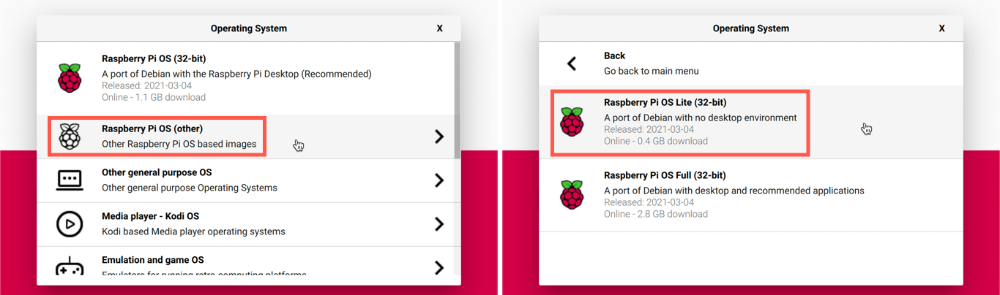

<!--
CO_OP_TRANSLATOR_METADATA:
{
  "original_hash": "8ff0d0a1d29832bb896b9c103b69a452",
  "translation_date": "2025-08-27T21:59:49+00:00",
  "source_file": "1-getting-started/lessons/1-introduction-to-iot/pi.md",
  "language_code": "da"
}
-->
# Raspberry Pi

[Raspberry Pi](https://raspberrypi.org) er en enkeltbrætscomputer. Du kan tilføje sensorer og aktuatorer ved hjælp af en bred vifte af enheder og økosystemer, og i disse lektioner bruger vi et hardware-økosystem kaldet [Grove](https://www.seeedstudio.com/category/Grove-c-1003.html). Du vil programmere din Pi og tilgå Grove-sensorerne ved hjælp af Python.


## Opsætning

Hvis du bruger en Raspberry Pi som din IoT-hardware, har du to muligheder - du kan gennemgå alle disse lektioner og programmere direkte på Pi'en, eller du kan oprette fjernforbindelse til en 'headless' Pi og programmere fra din computer.

Før du begynder, skal du også tilslutte Grove Base Hat til din Pi.

### Opgave - opsætning

Installer Grove Base Hat på din Pi og konfigurer Pi'en.

1. Tilslut Grove Base Hat til din Pi. Stikket på hatten passer over alle GPIO-pins på Pi'en og glider helt ned på pinsene, så den sidder fast på basen. Den dækker Pi'en.

    

1. Beslut, hvordan du vil programmere din Pi, og gå til den relevante sektion nedenfor:

    * [Arbejd direkte på din Pi](../../../../../1-getting-started/lessons/1-introduction-to-iot)
    * [Fjernadgang til at programmere Pi'en](../../../../../1-getting-started/lessons/1-introduction-to-iot)

### Arbejd direkte på din Pi

Hvis du vil arbejde direkte på din Pi, kan du bruge desktopversionen af Raspberry Pi OS og installere alle de nødvendige værktøjer.

#### Opgave - arbejd direkte på din Pi

Opsæt din Pi til udvikling.

1. Følg instruktionerne i [Raspberry Pi opsætningsguiden](https://projects.raspberrypi.org/en/projects/raspberry-pi-setting-up) for at opsætte din Pi, tilslutte den til et tastatur/mus/skærm, tilslutte den til dit WiFi- eller ethernet-netværk og opdatere softwaren.

For at programmere Pi'en med Grove-sensorer og aktuatorer skal du installere en editor til at skrive enhedskoden samt forskellige biblioteker og værktøjer, der interagerer med Grove-hardware.

1. Når din Pi er genstartet, skal du starte Terminalen ved at klikke på **Terminal**-ikonet i topmenuen eller vælge *Menu -> Accessories -> Terminal*.

1. Kør følgende kommando for at sikre, at operativsystemet og den installerede software er opdateret:

    ```sh
    sudo apt update && sudo apt full-upgrade --yes
    ```

1. Kør følgende kommandoer for at installere alle nødvendige biblioteker til Grove-hardware:

    ```sh
    sudo apt install git python3-dev python3-pip --yes

    git clone https://github.com/Seeed-Studio/grove.py
    cd grove.py
    sudo pip3 install .

    sudo raspi-config nonint do_i2c 0
    ```

    Dette starter med at installere Git sammen med Pip til installation af Python-pakker.

    En af de stærke funktioner ved Python er muligheden for at installere [Pip-pakker](https://pypi.org) - disse er pakker med kode skrevet af andre og offentliggjort på internettet. Du kan installere en Pip-pakke på din computer med én kommando og derefter bruge den pakke i din kode.

    Seeed Grove Python-pakkerne skal installeres fra kildekoden. Disse kommandoer kloner repoen, der indeholder kildekoden til denne pakke, og installerer den derefter lokalt.

    > 💁 Som standard, når du installerer en pakke, er den tilgængelig overalt på din computer, hvilket kan føre til problemer med pakkeversioner - som når en applikation afhænger af én version af en pakke, der bryder, når du installerer en ny version til en anden applikation. For at omgå dette problem kan du bruge et [Python-virtuelt miljø](https://docs.python.org/3/library/venv.html), som i bund og grund er en kopi af Python i en dedikeret mappe, og når du installerer Pip-pakker, bliver de kun installeret i den mappe. Du vil ikke bruge virtuelle miljøer, når du bruger din Pi. Grove-installationsscriptet installerer Grove Python-pakkerne globalt, så for at bruge et virtuelt miljø skal du opsætte et virtuelt miljø og derefter manuelt geninstallere Grove-pakkerne i det miljø. Det er nemmere bare at bruge globale pakker, især da mange Pi-udviklere vil genflashe et rent SD-kort til hvert projekt.

    Til sidst aktiveres I<sup>2</sup>C-grænsefladen.

1. Genstart Pi'en enten via menuen eller ved at køre følgende kommando i Terminalen:

    ```sh
    sudo reboot
    ```

1. Når Pi'en er genstartet, skal du genstarte Terminalen og køre følgende kommando for at installere [Visual Studio Code (VS Code)](https://code.visualstudio.com?WT.mc_id=academic-17441-jabenn) - dette er editoren, du vil bruge til at skrive din enhedskode i Python.

    ```sh
    sudo apt install code
    ```

    Når dette er installeret, vil VS Code være tilgængelig fra topmenuen.

    > 💁 Du er fri til at bruge enhver Python IDE eller editor til disse lektioner, hvis du har et foretrukket værktøj, men lektionerne vil give instruktioner baseret på brugen af VS Code.

1. Installer Pylance. Dette er en udvidelse til VS Code, der giver Python-sprogsupport. Se [Pylance-udvidelsesdokumentationen](https://marketplace.visualstudio.com/items?WT.mc_id=academic-17441-jabenn&itemName=ms-python.vscode-pylance) for instruktioner om installation af denne udvidelse i VS Code.

### Fjernadgang til at programmere Pi'en

I stedet for at programmere direkte på Pi'en kan den køre 'headless', det vil sige uden at være tilsluttet et tastatur/mus/skærm, og du kan konfigurere og programmere den fra din computer ved hjælp af Visual Studio Code.

#### Opsæt Pi OS

For at programmere eksternt skal Pi OS installeres på et SD-kort.

##### Opgave - opsæt Pi OS

Opsæt det headless Pi OS.

1. Download **Raspberry Pi Imager** fra [Raspberry Pi OS software-siden](https://www.raspberrypi.org/software/) og installer det.

1. Indsæt et SD-kort i din computer, brug en adapter hvis nødvendigt.

1. Start Raspberry Pi Imager.

1. Fra Raspberry Pi Imager skal du vælge knappen **CHOOSE OS**, derefter vælge *Raspberry Pi OS (Other)*, efterfulgt af *Raspberry Pi OS Lite (32-bit)*.

    

    > 💁 Raspberry Pi OS Lite er en version af Raspberry Pi OS, der ikke har desktop-UI eller UI-baserede værktøjer. Disse er ikke nødvendige for en headless Pi og gør installationen mindre og opstartstiden hurtigere.

1. Vælg knappen **CHOOSE STORAGE**, og vælg derefter dit SD-kort.

1. Start **Advanced Options** ved at trykke på `Ctrl+Shift+X`. Disse muligheder tillader en vis forudkonfiguration af Raspberry Pi OS, før det bliver skrevet til SD-kortet.

    1. Marker afkrydsningsfeltet **Enable SSH**, og indstil en adgangskode til brugeren `pi`. Dette er adgangskoden, du vil bruge til at logge ind på Pi'en senere.

    1. Hvis du planlægger at tilslutte Pi'en via WiFi, skal du markere afkrydsningsfeltet **Configure WiFi** og indtaste dit WiFi SSID og adgangskode samt vælge dit WiFi-land. Du behøver ikke gøre dette, hvis du vil bruge et ethernet-kabel. Sørg for, at det netværk, du tilslutter til, er det samme som din computer er på.

    1. Marker afkrydsningsfeltet **Set locale settings**, og indstil dit land og tidszone.

    1. Vælg knappen **SAVE**.

1. Vælg knappen **WRITE** for at skrive OS til SD-kortet. Hvis du bruger macOS, vil du blive bedt om at indtaste din adgangskode, da det underliggende værktøj, der skriver diskbilleder, kræver privilegeret adgang.

Operativsystemet vil blive skrevet til SD-kortet, og når det er færdigt, vil kortet blive skubbet ud af operativsystemet, og du vil blive underrettet. Fjern SD-kortet fra din computer, indsæt det i Pi'en, tænd for Pi'en og vent cirka 2 minutter, så den kan starte korrekt.

#### Tilslut til Pi'en

Næste trin er at få fjernadgang til Pi'en. Dette kan gøres ved hjælp af `ssh`, som er tilgængelig på macOS, Linux og nyere versioner af Windows.

##### Opgave - tilslut til Pi'en

Få fjernadgang til Pi'en.

1. Start en Terminal eller Kommandoprompt, og indtast følgende kommando for at tilslutte til Pi'en:

    ```sh
    ssh pi@raspberrypi.local
    ```

    Hvis du bruger Windows med en ældre version, der ikke har `ssh` installeret, kan du bruge OpenSSH. Du kan finde installationsinstruktionerne i [OpenSSH installationsdokumentationen](https://docs.microsoft.com//windows-server/administration/openssh/openssh_install_firstuse?WT.mc_id=academic-17441-jabenn).

1. Dette bør tilslutte til din Pi og bede om adgangskoden.

    At kunne finde computere på dit netværk ved hjælp af `<hostname>.local` er en forholdsvis ny funktion i Linux og Windows. Hvis du bruger Linux eller Windows og får fejl om, at værtsnavnet ikke kan findes, skal du installere yderligere software for at aktivere ZeroConf-netværk (også kaldet Bonjour af Apple):

    1. Hvis du bruger Linux, skal du installere Avahi ved hjælp af følgende kommando:

        ```sh
        sudo apt-get install avahi-daemon
        ```

    1. Hvis du bruger Windows, er den nemmeste måde at aktivere ZeroConf på at installere [Bonjour Print Services for Windows](http://support.apple.com/kb/DL999). Du kan også installere [iTunes for Windows](https://www.apple.com/itunes/download/) for at få en nyere version af værktøjet (som ikke er tilgængelig separat).

    > 💁 Hvis du ikke kan tilslutte ved hjælp af `raspberrypi.local`, kan du bruge IP-adressen på din Pi. Se [Raspberry Pi IP-adresse dokumentationen](https://www.raspberrypi.org/documentation/remote-access/ip-address.md) for instruktioner om flere måder at finde IP-adressen på.

1. Indtast den adgangskode, du indstillede i Raspberry Pi Imager Advanced Options.

#### Konfigurer software på Pi'en

Når du er tilsluttet Pi'en, skal du sikre dig, at operativsystemet er opdateret, og installere forskellige biblioteker og værktøjer, der interagerer med Grove-hardware.

##### Opgave - konfigurer software på Pi'en

Konfigurer den installerede Pi-software og installer Grove-bibliotekerne.

1. Fra din `ssh`-session skal du køre følgende kommando for at opdatere og derefter genstarte Pi'en:

    ```sh
    sudo apt update && sudo apt full-upgrade --yes && sudo reboot
    ```

    Pi'en vil blive opdateret og genstartet. `ssh`-sessionen afsluttes, når Pi'en genstartes, så vent cirka 30 sekunder og tilslut igen.

1. Fra den genoprettede `ssh`-session skal du køre følgende kommandoer for at installere alle nødvendige biblioteker til Grove-hardware:

    ```sh
    sudo apt install git python3-dev python3-pip --yes

    git clone https://github.com/Seeed-Studio/grove.py
    cd grove.py
    sudo pip3 install .

    sudo raspi-config nonint do_i2c 0
    ```

    Dette starter med at installere Git sammen med Pip til installation af Python-pakker.

    En af de stærke funktioner ved Python er muligheden for at installere [Pip-pakker](https://pypi.org) - disse er pakker med kode skrevet af andre og offentliggjort på internettet. Du kan installere en Pip-pakke på din computer med én kommando og derefter bruge den pakke i din kode.

    Seeed Grove Python-pakkerne skal installeres fra kildekoden. Disse kommandoer kloner repoen, der indeholder kildekoden til denne pakke, og installerer den derefter lokalt.

    > 💁 Som standard, når du installerer en pakke, er den tilgængelig overalt på din computer, hvilket kan føre til problemer med pakkeversioner - som når en applikation afhænger af én version af en pakke, der bryder, når du installerer en ny version til en anden applikation. For at omgå dette problem kan du bruge et [Python-virtuelt miljø](https://docs.python.org/3/library/venv.html), som i bund og grund er en kopi af Python i en dedikeret mappe, og når du installerer Pip-pakker, bliver de kun installeret i den mappe. Du vil ikke bruge virtuelle miljøer, når du bruger din Pi. Grove-installationsscriptet installerer Grove Python-pakkerne globalt, så for at bruge et virtuelt miljø skal du opsætte et virtuelt miljø og derefter manuelt geninstallere Grove-pakkerne i det miljø. Det er nemmere bare at bruge globale pakker, især da mange Pi-udviklere vil genflashe et rent SD-kort til hvert projekt.

    Til sidst aktiveres I<sup>2</sup>C-grænsefladen.

1. Genstart Pi'en ved at køre følgende kommando:

    ```sh
    sudo reboot
    ```

    `ssh`-sessionen afsluttes, når Pi'en genstartes. Der er ingen grund til at tilslutte igen.

#### Konfigurer VS Code til fjernadgang

Når Pi'en er konfigureret, kan du tilslutte til den ved hjælp af Visual Studio Code (VS Code) fra din computer - dette er en gratis udviklerteksteditor, som du vil bruge til at skrive din enhedskode i Python.

##### Opgave - konfigurer VS Code til fjernadgang

Installer den nødvendige software og tilslut eksternt til din Pi.

1. Installer VS Code på din computer ved at følge [VS Code dokumentationen](https://code.visualstudio.com?WT.mc_id=academic-17441-jabenn).

1. Følg instruktionerne i [VS Code Remote Development using SSH dokumentationen](https://code.visualstudio.com/docs/remote/ssh?WT.mc_id=academic-17441-jabenn) for at installere de nødvendige komponenter.

1. Følg de samme instruktioner for at tilslutte VS Code til Pi'en.

1. Når du er tilsluttet, skal du følge instruktionerne i [managing extensions](https://code.visualstudio.com/docs/remote/ssh#_managing-extensions?WT.mc_id=academic-17441-jabenn) for at installere [Pylance-udvidelsen](https://marketplace.visualstudio.com/items?WT.mc_id=academic-17441-jabenn&itemName=ms-python.vscode-pylance) eksternt på Pi'en.

## Hello world
Det er traditionelt, når man starter med et nyt programmeringssprog eller en ny teknologi, at lave en 'Hello World'-applikation - en lille applikation, der viser noget som teksten `"Hello World"` for at bekræfte, at alle værktøjer er korrekt konfigureret.

Hello World-appen til Pi vil sikre, at du har Python og Visual Studio Code korrekt installeret.

Denne app vil være i en mappe kaldet `nightlight`, og den vil blive genbrugt med forskellig kode i senere dele af denne opgave for at bygge natlygsapplikationen.

### Opgave - hello world

Lav Hello World-appen.

1. Start VS Code, enten direkte på Pi'en eller på din computer og forbundet til Pi'en ved hjælp af Remote SSH-udvidelsen.

1. Åbn VS Code-terminalen ved at vælge *Terminal -> New Terminal* eller ved at trykke `` CTRL+` ``. Den vil åbne i `pi`-brugerens hjemmemappe.

1. Kør følgende kommandoer for at oprette en mappe til din kode og oprette en Python-fil kaldet `app.py` inde i den mappe:

    ```sh
    mkdir nightlight
    cd nightlight
    touch app.py
    ```

1. Åbn denne mappe i VS Code ved at vælge *File -> Open...* og vælge *nightlight*-mappen, og vælg derefter **OK**.

    

1. Åbn `app.py`-filen fra VS Code-udforskeren, og tilføj følgende kode:

    ```python
    print('Hello World!')
    ```

    `print`-funktionen udskriver det, der bliver sendt til den, i konsollen.

1. Fra VS Code-terminalen skal du køre følgende for at køre din Python-app:

    ```sh
    python app.py
    ```

    > 💁 Du skal muligvis eksplicit kalde `python3` for at køre denne kode, hvis du har Python 2 installeret ud over Python 3 (den nyeste version). Hvis du har Python 2 installeret, vil kaldet `python` bruge Python 2 i stedet for Python 3. Som standard har de nyeste versioner af Raspberry Pi OS kun Python 3 installeret.

    Følgende output vil vises i terminalen:

    ```output
    pi@raspberrypi:~/nightlight $ python3 app.py
    Hello World!
    ```

> 💁 Du kan finde denne kode i [code/pi](../../../../../1-getting-started/lessons/1-introduction-to-iot/code/pi)-mappen.

😀 Dit 'Hello World'-program var en succes!

---

**Ansvarsfraskrivelse**:  
Dette dokument er blevet oversat ved hjælp af AI-oversættelsestjenesten [Co-op Translator](https://github.com/Azure/co-op-translator). Selvom vi bestræber os på nøjagtighed, skal du være opmærksom på, at automatiserede oversættelser kan indeholde fejl eller unøjagtigheder. Det originale dokument på dets oprindelige sprog bør betragtes som den autoritative kilde. For kritisk information anbefales professionel menneskelig oversættelse. Vi påtager os ikke ansvar for eventuelle misforståelser eller fejltolkninger, der opstår som følge af brugen af denne oversættelse.