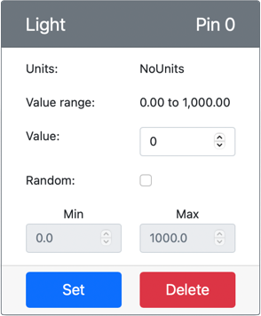

<!--
CO_OP_TRANSLATOR_METADATA:
{
  "original_hash": "11f10c6760fb8202cf368422702fdf70",
  "translation_date": "2025-08-27T22:09:57+00:00",
  "source_file": "1-getting-started/lessons/3-sensors-and-actuators/virtual-device-sensor.md",
  "language_code": "da"
}
-->
# Byg en natlampe - Virtuel IoT-hardware

I denne del af lektionen vil du tilføje en lyssensor til din virtuelle IoT-enhed.

## Virtuel hardware

Natlampen har brug for én sensor, som oprettes i CounterFit-appen.

Sensoren er en **lyssensor**. På en fysisk IoT-enhed ville det være en [fotodiode](https://wikipedia.org/wiki/Photodiode), der konverterer lys til et elektrisk signal. Lyssensorer er analoge sensorer, der sender en heltalsværdi, som angiver en relativ mængde lys, uden at det svarer til en standard måleenhed som [lux](https://wikipedia.org/wiki/Lux).

### Tilføj sensorer til CounterFit

For at bruge en virtuel lyssensor skal du tilføje den til CounterFit-appen.

#### Opgave - tilføj sensorer til CounterFit

Tilføj lyssensoren til CounterFit-appen.

1. Sørg for, at CounterFit-webappen kører fra den tidligere del af denne opgave. Hvis ikke, start den.

1. Opret en lyssensor:

    1. I boksen *Create sensor* i panelet *Sensors*, klik på rullemenuen *Sensor type* og vælg *Light*.

    1. Lad *Units* være indstillet til *NoUnits*.

    1. Sørg for, at *Pin* er indstillet til *0*.

    1. Klik på knappen **Add** for at oprette lyssensoren på Pin 0.

    

    Lyssensoren vil blive oprettet og vises i sensorlisten.

    

## Programmer lyssensoren

Enheden kan nu programmeres til at bruge den indbyggede lyssensor.

### Opgave - programmer lyssensoren

Programmer enheden.

1. Åbn natlampeprojektet i VS Code, som du oprettede i den tidligere del af denne opgave. Luk og genopret terminalen for at sikre, at den kører med det virtuelle miljø, hvis nødvendigt.

1. Åbn filen `app.py`.

1. Tilføj følgende kode øverst i filen `app.py` sammen med de øvrige `import`-udsagn for at importere nogle nødvendige biblioteker:

    ```python
    import time
    from counterfit_shims_grove.grove_light_sensor_v1_2 import GroveLightSensor
    ```

    Udsagnet `import time` importerer Pythons `time`-modul, som vil blive brugt senere i denne opgave.

    Udsagnet `from counterfit_shims_grove.grove_light_sensor_v1_2 import GroveLightSensor` importerer `GroveLightSensor` fra CounterFit Grove shim Python-bibliotekerne. Dette bibliotek indeholder kode til at interagere med en lyssensor oprettet i CounterFit-appen.

1. Tilføj følgende kode nederst i filen for at oprette instanser af klasser, der styrer lyssensoren:

    ```python
    light_sensor = GroveLightSensor(0)
    ```

    Linjen `light_sensor = GroveLightSensor(0)` opretter en instans af klassen `GroveLightSensor`, der forbinder til pin **0** - CounterFit Grove-pinnen, som lyssensoren er tilsluttet.

1. Tilføj en uendelig løkke efter koden ovenfor for at aflæse lyssensorens værdi og udskrive den til konsollen:

    ```python
    while True:
        light = light_sensor.light
        print('Light level:', light)
    ```

    Dette vil aflæse det aktuelle lysniveau ved hjælp af egenskaben `light` fra klassen `GroveLightSensor`. Denne egenskab aflæser den analoge værdi fra pinnen. Værdien udskrives derefter til konsollen.

1. Tilføj en kort pause på ét sekund i slutningen af `while`-løkken, da lysniveauerne ikke behøver at blive kontrolleret kontinuerligt. En pause reducerer enhedens strømforbrug.

    ```python
    time.sleep(1)
    ```

1. Fra VS Code-terminalen skal du køre følgende for at starte din Python-app:

    ```sh
    python3 app.py
    ```

    Lysværdier vil blive udskrevet til konsollen. I starten vil denne værdi være 0.

1. Fra CounterFit-appen skal du ændre værdien af lyssensoren, som vil blive aflæst af appen. Du kan gøre dette på to måder:

    * Indtast et tal i boksen *Value* for lyssensoren, og klik derefter på knappen **Set**. Det tal, du indtaster, vil være den værdi, sensoren returnerer.

    * Marker afkrydsningsfeltet *Random*, og indtast en *Min* og *Max*-værdi, og klik derefter på knappen **Set**. Hver gang sensoren aflæser en værdi, vil den aflæse et tilfældigt tal mellem *Min* og *Max*.

    De værdier, du indstiller, vil blive udskrevet til konsollen. Ændr *Value* eller *Random*-indstillingerne for at få værdien til at ændre sig.

    ```output
    (.venv) ➜  GroveTest python3 app.py 
    Light level: 143
    Light level: 244
    Light level: 246
    Light level: 253
    ```

> 💁 Du kan finde denne kode i mappen [code-sensor/virtual-device](../../../../../1-getting-started/lessons/3-sensors-and-actuators/code-sensor/virtual-device).

😀 Dit natlampeprogram var en succes!

---

**Ansvarsfraskrivelse**:  
Dette dokument er blevet oversat ved hjælp af AI-oversættelsestjenesten [Co-op Translator](https://github.com/Azure/co-op-translator). Selvom vi bestræber os på nøjagtighed, skal du være opmærksom på, at automatiserede oversættelser kan indeholde fejl eller unøjagtigheder. Det originale dokument på dets oprindelige sprog bør betragtes som den autoritative kilde. For kritisk information anbefales professionel menneskelig oversættelse. Vi påtager os ikke ansvar for eventuelle misforståelser eller fejltolkninger, der opstår som følge af brugen af denne oversættelse.