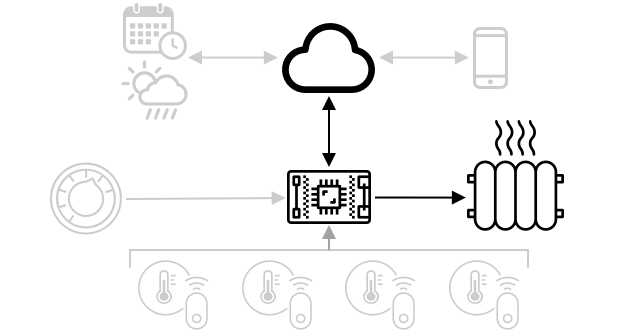

<!--
CO_OP_TRANSLATOR_METADATA:
{
  "original_hash": "71b5040e0b3472f1c0949c9b55f224c0",
  "translation_date": "2025-08-27T21:47:08+00:00",
  "source_file": "1-getting-started/lessons/4-connect-internet/README.md",
  "language_code": "da"
}
-->
# Tilslut din enhed til internettet


> Sketchnote af [Nitya Narasimhan](https://github.com/nitya). Klik på billedet for en større version.

Denne lektion blev undervist som en del af [Hello IoT-serien](https://youtube.com/playlist?list=PLmsFUfdnGr3xRts0TIwyaHyQuHaNQcb6-) fra [Microsoft Reactor](https://developer.microsoft.com/reactor/?WT.mc_id=academic-17441-jabenn). Lektionen blev præsenteret i to videoer - en 1-times lektion og en 1-times spørgetime, hvor dele af lektionen blev uddybet, og spørgsmål blev besvaret.

[](https://youtu.be/O4dd172mZhs)

[](https://youtu.be/j-cVCzRDE2Q)

> 🎥 Klik på billederne ovenfor for at se videoerne

## Quiz før lektionen

[Quiz før lektionen](https://black-meadow-040d15503.1.azurestaticapps.net/quiz/7)

## Introduktion

**I** i IoT står for **Internet** - den cloud-forbindelse og de tjenester, der muliggør mange af funktionerne i IoT-enheder, fra at indsamle målinger fra sensorerne, der er tilsluttet enheden, til at sende beskeder for at styre aktuatorer. IoT-enheder forbinder typisk til en enkelt cloud IoT-tjeneste ved hjælp af en standard kommunikationsprotokol, og denne tjeneste er forbundet til resten af din IoT-applikation, fra AI-tjenester til at træffe smarte beslutninger baseret på dine data, til webapps til kontrol eller rapportering.

> 🎓 Data, der indsamles fra sensorer og sendes til skyen, kaldes telemetri.

IoT-enheder kan modtage beskeder fra skyen. Ofte indeholder disse beskeder kommandoer - altså instruktioner til at udføre en handling enten internt (såsom genstart eller opdatering af firmware) eller ved hjælp af en aktuator (såsom at tænde et lys).

Denne lektion introducerer nogle af de kommunikationsprotokoller, som IoT-enheder kan bruge til at forbinde til skyen, og de typer data, de kan sende eller modtage. Du vil også få praktisk erfaring med begge dele, hvor du tilføjer internetkontrol til din natlampe og flytter LED-styringslogikken til 'server'-kode, der kører lokalt.

I denne lektion dækker vi:

* [Kommunikationsprotokoller](../../../../../1-getting-started/lessons/4-connect-internet)
* [Message Queueing Telemetry Transport (MQTT)](../../../../../1-getting-started/lessons/4-connect-internet)
* [Telemetri](../../../../../1-getting-started/lessons/4-connect-internet)
* [Kommandoer](../../../../../1-getting-started/lessons/4-connect-internet)

## Kommunikationsprotokoller

Der findes en række populære kommunikationsprotokoller, som IoT-enheder bruger til at kommunikere med internettet. De mest populære er baseret på publish/subscribe-messaging via en form for broker. IoT-enheder forbinder til brokeren og publicerer telemetri og abonnerer på kommandoer. Cloud-tjenester forbinder også til brokeren og abonnerer på alle telemetribeskeder og publicerer kommandoer enten til specifikke enheder eller til grupper af enheder.


MQTT er den mest populære kommunikationsprotokol for IoT-enheder og dækkes i denne lektion. Andre protokoller inkluderer AMQP og HTTP/HTTPS.

## Message Queueing Telemetry Transport (MQTT)

[MQTT](http://mqtt.org) er en letvægts, åben standard messaging-protokol, der kan sende beskeder mellem enheder. Den blev designet i 1999 til at overvåge olieledninger og blev frigivet som en åben standard 15 år senere af IBM.

MQTT har en enkelt broker og flere klienter. Alle klienter forbinder til brokeren, og brokeren videresender beskeder til de relevante klienter. Beskeder videresendes ved hjælp af navngivne emner (topics) i stedet for at blive sendt direkte til en individuel klient. En klient kan publicere til et emne, og alle klienter, der abonnerer på det emne, vil modtage beskeden.


✅ Lav noget research. Hvis du har mange IoT-enheder, hvordan kan du sikre, at din MQTT-broker kan håndtere alle beskederne?

### Forbind din IoT-enhed til MQTT

Den første del af at tilføje internetkontrol til din natlampe er at forbinde den til en MQTT-broker.

#### Opgave

Forbind din enhed til en MQTT-broker.

I denne del af lektionen vil du forbinde din IoT-natlampe til internettet for at gøre det muligt at styre den eksternt. Senere i lektionen vil din IoT-enhed sende en telemetribesked over MQTT til en offentlig MQTT-broker med lysniveauet, hvor den vil blive opfanget af noget serverkode, som du vil skrive. Denne kode vil kontrollere lysniveauet og sende en kommando tilbage til enheden, der fortæller den, om LED'en skal tændes eller slukkes.

En reel anvendelse af et sådant setup kunne være at indsamle data fra flere lyssensorer, før man beslutter at tænde lysene i et område med mange lys, såsom et stadion. Dette kunne forhindre, at lysene tændes, hvis kun én sensor er dækket af skyer eller en fugl, mens de andre sensorer registrerer tilstrækkeligt lys.

✅ Hvilke andre situationer kunne kræve, at data fra flere sensorer evalueres, før der sendes kommandoer?

I stedet for at håndtere kompleksiteten ved at opsætte en MQTT-broker som en del af denne opgave, kan du bruge en offentlig testserver, der kører [Eclipse Mosquitto](https://www.mosquitto.org), en open-source MQTT-broker. Denne testbroker er offentligt tilgængelig på [test.mosquitto.org](https://test.mosquitto.org) og kræver ikke, at du opretter en konto, hvilket gør den til et fantastisk værktøj til at teste MQTT-klienter og -servere.

> 💁 Denne testbroker er offentlig og ikke sikker. Enhver kan lytte til, hvad du publicerer, så den bør ikke bruges til data, der skal holdes private.


Følg det relevante trin nedenfor for at forbinde din enhed til MQTT-brokeren:

* [Arduino - Wio Terminal](wio-terminal-mqtt.md)
* [Single-board computer - Raspberry Pi/Virtual IoT device](single-board-computer-mqtt.md)

### En dybere forståelse af MQTT

Emner (topics) kan have en hierarki, og klienter kan abonnere på forskellige niveauer af hierarkiet ved hjælp af wildcards. For eksempel kan du sende temperaturtelemetri til `/telemetry/temperature`-emnet og fugtighedsdata til `/telemetry/humidity`-emnet og derefter i din cloud-app abonnere på `/telemetry/*`-emnet for at modtage både temperatur- og fugtighedsdata.

Beskeder kan sendes med en kvalitet af service (QoS), som bestemmer garantien for, at beskeden modtages.

* Højst én gang - beskeden sendes kun én gang, og klienten og brokeren tager ingen yderligere skridt for at bekræfte levering (fire and forget).
* Mindst én gang - beskeden genforsøges af afsenderen flere gange, indtil bekræftelse modtages (acknowledged delivery).
* Præcis én gang - afsender og modtager engagerer sig i en to-niveau håndtryk for at sikre, at kun én kopi af beskeden modtages (assured delivery).

✅ Hvilke situationer kunne kræve en sikret levering frem for en "fire and forget"-besked?

Selvom navnet er Message Queueing (MQ i MQTT), understøtter det faktisk ikke beskedkøer. Dette betyder, at hvis en klient afbrydes og derefter genforbindes, vil den ikke modtage beskeder sendt under afbrydelsen, undtagen for de beskeder, den allerede var begyndt at behandle ved hjælp af QoS-processen. Beskeder kan have et "retained"-flag sat på dem. Hvis dette er sat, vil MQTT-brokeren gemme den sidste besked sendt på et emne med dette flag og sende det til enhver klient, der senere abonnerer på emnet. På denne måde vil klienterne altid få den nyeste besked.

MQTT understøtter også en "keep alive"-funktion, der tjekker, om forbindelsen stadig er aktiv under lange pauser mellem beskeder.

> 🦟 [Mosquitto fra Eclipse Foundation](https://mosquitto.org) har en gratis MQTT-broker, som du selv kan køre for at eksperimentere med MQTT, sammen med en offentlig MQTT-broker, du kan bruge til at teste din kode, hostet på [test.mosquitto.org](https://test.mosquitto.org).

MQTT-forbindelser kan være offentlige og åbne eller krypterede og sikrede ved hjælp af brugernavne og adgangskoder eller certifikater.

> 💁 MQTT kommunikerer over TCP/IP, det samme underliggende netværksprotokol som HTTP, men på en anden port. Du kan også bruge MQTT over websockets til at kommunikere med webapps, der kører i en browser, eller i situationer, hvor firewalls eller andre netværksregler blokerer standard MQTT-forbindelser.

## Telemetri

Ordet telemetri stammer fra græske rødder og betyder at måle på afstand. Telemetri er handlingen med at indsamle data fra sensorer og sende det til skyen.

> 💁 En af de tidligste telemetrianordninger blev opfundet i Frankrig i 1874 og sendte realtidsdata om vejr og sneforhold fra Mont Blanc til Paris. Den brugte fysiske ledninger, da trådløse teknologier ikke var tilgængelige på det tidspunkt.

Lad os se tilbage på eksemplet med den smarte termostat fra Lektion 1.


Termostaten har temperatursensorer til at indsamle telemetri. Den vil sandsynligvis have en indbygget temperatursensor og kan forbinde til flere eksterne temperatursensorer via en trådløs protokol som [Bluetooth Low Energy](https://wikipedia.org/wiki/Bluetooth_Low_Energy) (BLE).

Et eksempel på telemetridata, den kunne sende, kunne være:

| Navn | Værdi | Beskrivelse |
| ---- | ----- | ----------- |
| `thermostat_temperature` | 18°C | Temperaturen målt af termostatens indbyggede temperatursensor |
| `livingroom_temperature` | 19°C | Temperaturen målt af en fjernsensor, der er navngivet `livingroom` for at identificere rummet |
| `bedroom_temperature` | 21°C | Temperaturen målt af en fjernsensor, der er navngivet `bedroom` for at identificere rummet |

Cloud-tjenesten kan derefter bruge disse telemetridata til at træffe beslutninger om, hvilke kommandoer der skal sendes for at styre opvarmningen.

### Send telemetri fra din IoT-enhed

Den næste del i at tilføje internetkontrol til din natlampe er at sende lysniveau-telemetri til MQTT-brokeren på et telemetri-emne.

#### Opgave - send telemetri fra din IoT-enhed

Send lysniveau-telemetri til MQTT-brokeren.

Data sendes kodet som JSON - en forkortelse for JavaScript Object Notation, en standard til at kode data i tekst ved hjælp af nøgle/værdi-par.

✅ Hvis du ikke er stødt på JSON før, kan du lære mere om det i [JSON.org-dokumentationen](https://www.json.org/).

Følg det relevante trin nedenfor for at sende telemetri fra din enhed til MQTT-brokeren:

* [Arduino - Wio Terminal](wio-terminal-telemetry.md)
* [Single-board computer - Raspberry Pi/Virtual IoT device](single-board-computer-telemetry.md)

### Modtag telemetri fra MQTT-brokeren

Der er ingen mening i at sende telemetri, hvis der ikke er noget i den anden ende til at lytte til det. Lysniveau-telemetrien har brug for noget, der lytter til den for at behandle dataene. Denne 'server'-kode er den slags kode, du vil implementere i en cloud-tjeneste som en del af en større IoT-applikation, men her vil du køre denne kode lokalt på din computer (eller på din Pi, hvis du koder direkte der).

Serverkoden består af en Python-app, der lytter til telemetribeskeder over MQTT med lysniveauer. Senere i denne lektion vil du få den til at svare med en kommando, der instruerer om at tænde eller slukke LED'en.

✅ Lav noget research: Hvad sker der med MQTT-beskeder, hvis der ikke er nogen lytter?

#### Installer Python og VS Code

Hvis du ikke har Python og VS Code installeret lokalt, skal du installere begge dele for at kode serveren. Hvis du bruger en virtuel IoT-enhed eller arbejder på din Raspberry Pi, kan du springe dette trin over, da du allerede bør have det installeret og konfigureret.

##### Opgave - installer Python og VS Code

Installer Python og VS Code.

1. Installer Python. Se [Python-downloadsiden](https://www.python.org/downloads/) for instruktioner om, hvordan du installerer den nyeste version af Python.

2. Installer Visual Studio Code (VS Code). Dette er den editor, du vil bruge til at skrive din virtuelle enhedskode i Python. Se [VS Code-dokumentationen](https://code.visualstudio.com?WT.mc_id=academic-17441-jabenn) for instruktioner om, hvordan du installerer VS Code.
💁 Du er velkommen til at bruge enhver Python IDE eller editor til disse lektioner, hvis du har et foretrukket værktøj, men lektionerne vil give instruktioner baseret på brugen af VS Code.
1. Installer VS Code Pylance-udvidelsen. Dette er en udvidelse til VS Code, der giver understøttelse af Python-sproget. Se [Pylance-udvidelsens dokumentation](https://marketplace.visualstudio.com/items?WT.mc_id=academic-17441-jabenn&itemName=ms-python.vscode-pylance) for instruktioner om, hvordan du installerer denne udvidelse i VS Code.

#### Konfigurer et Python-virtuelt miljø

En af de stærke funktioner ved Python er muligheden for at installere [pip-pakker](https://pypi.org) - det er pakker med kode skrevet af andre og offentliggjort på internettet. Du kan installere en pip-pakke på din computer med én kommando og derefter bruge den i din kode. Du vil bruge pip til at installere en pakke til kommunikation via MQTT.

Som standard, når du installerer en pakke, er den tilgængelig overalt på din computer, og dette kan føre til problemer med pakkeversioner - som f.eks. en applikation, der afhænger af én version af en pakke, som bryder, når du installerer en ny version til en anden applikation. For at omgå dette problem kan du bruge et [Python-virtuelt miljø](https://docs.python.org/3/library/venv.html), som i bund og grund er en kopi af Python i en dedikeret mappe, og når du installerer pip-pakker, bliver de kun installeret i den mappe.

##### Opgave - konfigurer et Python-virtuelt miljø

Konfigurer et Python-virtuelt miljø og installer MQTT-pip-pakkerne.

1. Fra din terminal eller kommandolinje skal du køre følgende på et sted efter eget valg for at oprette og navigere til en ny mappe:

    ```sh
    mkdir nightlight-server
    cd nightlight-server
    ```

1. Kør nu følgende for at oprette et virtuelt miljø i `.venv`-mappen:

    ```sh
    python3 -m venv .venv
    ```

    > 💁 Du skal eksplicit kalde `python3` for at oprette det virtuelle miljø, hvis du har Python 2 installeret ud over Python 3 (den nyeste version). Hvis du har Python 2 installeret, vil kaldet `python` bruge Python 2 i stedet for Python 3.

1. Aktivér det virtuelle miljø:

    * På Windows:
        * Hvis du bruger Command Prompt eller Command Prompt via Windows Terminal, skal du køre:

            ```cmd
            .venv\Scripts\activate.bat
            ```

        * Hvis du bruger PowerShell, skal du køre:

            ```powershell
            .\.venv\Scripts\Activate.ps1
            ```

    * På macOS eller Linux skal du køre:

        ```cmd
        source ./.venv/bin/activate
        ```

    > 💁 Disse kommandoer skal køres fra samme sted, som du kørte kommandoen for at oprette det virtuelle miljø. Du behøver aldrig navigere ind i `.venv`-mappen; du skal altid køre aktiveringskommandoen og eventuelle kommandoer for at installere pakker eller køre kode fra den mappe, du var i, da du oprettede det virtuelle miljø.

1. Når det virtuelle miljø er aktiveret, vil standardkommandoen `python` køre den version af Python, der blev brugt til at oprette det virtuelle miljø. Kør følgende for at få versionen:

    ```sh
    python --version
    ```

    Outputtet vil være lignende følgende:

    ```output
    (.venv) ➜  nightlight-server python --version
    Python 3.9.1
    ```

    > 💁 Din Python-version kan være anderledes - så længe det er version 3.6 eller højere, er du godt kørende. Hvis ikke, skal du slette denne mappe, installere en nyere version af Python og prøve igen.

1. Kør følgende kommandoer for at installere pip-pakken for [Paho-MQTT](https://pypi.org/project/paho-mqtt/), et populært MQTT-bibliotek.

    ```sh
    pip install paho-mqtt
    ```

    Denne pip-pakke vil kun blive installeret i det virtuelle miljø og vil ikke være tilgængelig uden for dette.

#### Skriv serverkoden

Serverkoden kan nu skrives i Python.

##### Opgave - skriv serverkoden

Skriv serverkoden.

1. Fra din terminal eller kommandolinje skal du køre følgende inde i det virtuelle miljø for at oprette en Python-fil kaldet `app.py`:

    * Fra Windows skal du køre:

        ```cmd
        type nul > app.py
        ```

    * På macOS eller Linux skal du køre:

        ```cmd
        touch app.py
        ```

1. Åbn den aktuelle mappe i VS Code:

    ```sh
    code .
    ```

1. Når VS Code starter, vil det aktivere det virtuelle Python-miljø. Dette vil blive rapporteret i den nederste statuslinje:

    

1. Hvis VS Code-terminalen allerede kører, når VS Code starter op, vil den ikke have det virtuelle miljø aktiveret i sig. Det nemmeste er at lukke terminalen ved hjælp af knappen **Kill the active terminal instance**:

    

1. Start en ny VS Code-terminal ved at vælge *Terminal -> New Terminal* eller ved at trykke på `` CTRL+` ``. Den nye terminal vil indlæse det virtuelle miljø, med kaldet til aktivering, der vises i terminalen. Navnet på det virtuelle miljø (`.venv`) vil også være i prompten:

    ```output
    ➜  nightlight-server source .venv/bin/activate
    (.venv) ➜  nightlight 
    ```

1. Åbn `app.py`-filen fra VS Code-udforskeren og tilføj følgende kode:

    ```python
    import json
    import time
    
    import paho.mqtt.client as mqtt
    
    id = '<ID>'
    
    client_telemetry_topic = id + '/telemetry'
    client_name = id + 'nightlight_server'
    
    mqtt_client = mqtt.Client(client_name)
    mqtt_client.connect('test.mosquitto.org')
    
    mqtt_client.loop_start()
    
    def handle_telemetry(client, userdata, message):
        payload = json.loads(message.payload.decode())
        print("Message received:", payload)
    
    mqtt_client.subscribe(client_telemetry_topic)
    mqtt_client.on_message = handle_telemetry
    
    while True:
        time.sleep(2)
    ```

    Erstat `<ID>` på linje 6 med det unikke ID, du brugte, da du oprettede din enhedskode.

    ⚠️ Dette **skal** være det samme ID, som du brugte på din enhed, ellers vil serverkoden ikke abonnere eller publicere til det rigtige emne.

    Denne kode opretter en MQTT-klient med et unikt navn og forbinder til *test.mosquitto.org*-broker. Den starter derefter en behandlingssløjfe, der kører i en baggrundstråd og lytter efter beskeder på alle abonnerede emner.

    Klienten abonnerer derefter på beskeder på telemetriemnet og definerer en funktion, der kaldes, når en besked modtages. Når en telemetribesked modtages, kaldes funktionen `handle_telemetry`, som udskriver den modtagne besked til konsollen.

    Endelig holder en uendelig sløjfe applikationen kørende. MQTT-klienten lytter til beskeder i en baggrundstråd og kører hele tiden, mens hovedapplikationen kører.

1. Fra VS Code-terminalen skal du køre følgende for at køre din Python-app:

    ```sh
    python app.py
    ```

    Appen vil begynde at lytte til beskeder fra IoT-enheden.

1. Sørg for, at din enhed kører og sender telemetribeskeder. Juster lysniveauerne, der registreres af din fysiske eller virtuelle enhed. Modtagne beskeder vil blive udskrevet til terminalen.

    ```output
    (.venv) ➜  nightlight-server python app.py
    Message received: {'light': 0}
    Message received: {'light': 400}
    ```

    `app.py`-filen i nightlight-virtuelle miljø skal køre, for at `app.py`-filen i nightlight-server-virtuelle miljø kan modtage de beskeder, der sendes.

> 💁 Du kan finde denne kode i [code-server/server](../../../../../1-getting-started/lessons/4-connect-internet/code-server/server)-mappen.

### Hvor ofte skal telemetri sendes?

En vigtig overvejelse med telemetri er, hvor ofte data skal måles og sendes? Svaret er - det afhænger. Hvis du måler ofte, kan du reagere hurtigere på ændringer i målinger, men du bruger mere strøm, mere båndbredde, genererer mere data og har brug for flere cloud-ressourcer til at behandle det. Du skal måle ofte nok, men ikke for ofte.

For en termostat er det sandsynligvis mere end nok at måle hvert par minutter, da temperaturer ikke ændrer sig så ofte. Hvis du kun måler én gang om dagen, kan du ende med at opvarme dit hus til nattemperaturer midt på en solrig dag, mens hvis du måler hvert sekund, vil du have tusindvis af unødvendigt duplikerede temperaturmålinger, der vil belaste brugerens internethastighed og båndbredde (et problem for folk med begrænsede båndbreddeplaner), bruge mere strøm, hvilket kan være et problem for batteridrevne enheder som fjernsensorer, og øge omkostningerne ved cloud computing-ressourcer til behandling og lagring.

Hvis du overvåger data omkring en maskine i en fabrik, hvor en fejl kan forårsage katastrofale skader og millioner af dollars i tabt indtjening, kan det være nødvendigt at måle flere gange i sekundet. Det er bedre at spilde båndbredde end at misse telemetri, der indikerer, at en maskine skal stoppes og repareres, før den går i stykker.

> 💁 I denne situation kan du overveje at have en edge-enhed til at behandle telemetrien først for at reducere afhængigheden af internettet.

### Tab af forbindelse

Internetforbindelser kan være upålidelige, med hyppige afbrydelser. Hvad skal en IoT-enhed gøre under disse omstændigheder - skal den miste dataene, eller skal den gemme dem, indtil forbindelsen er genoprettet? Igen, svaret er det afhænger.

For en termostat kan dataene sandsynligvis gå tabt, så snart en ny temperaturmåling er taget. Varmeanlægget er ligeglad med, at det for 20 minutter siden var 20,5°C, hvis temperaturen nu er 19°C; det er temperaturen nu, der afgør, om varmen skal være tændt eller slukket.

For maskiner vil du måske beholde dataene, især hvis de bruges til at lede efter tendenser. Der findes maskinlæringsmodeller, der kan opdage anomalier i datastrømme ved at kigge over data fra en defineret tidsperiode (såsom den sidste time) og finde unormale data. Dette bruges ofte til prædiktiv vedligeholdelse, hvor man leder efter indikationer på, at noget måske snart går i stykker, så man kan reparere eller udskifte det, før det sker. Du vil måske have hver eneste telemetri for en maskine sendt, så den kan behandles for anomali-detektion, så når IoT-enheden kan genoprette forbindelsen, vil den sende al telemetri, der blev genereret under internetafbrydelsen.

IoT-enhedsdesignere bør også overveje, om IoT-enheden kan bruges under en internetafbrydelse eller tab af signal forårsaget af placering. En smart termostat bør kunne træffe nogle begrænsede beslutninger for at kontrollere opvarmning, hvis den ikke kan sende telemetri til skyen på grund af en afbrydelse.

[](https://twitter.com/internetofshit/status/1315736960082808832)

For MQTT til at håndtere tab af forbindelse skal enheden og serverkoden være ansvarlige for at sikre beskedlevering, hvis det er nødvendigt, f.eks. ved at kræve, at alle beskeder, der sendes, besvares med yderligere beskeder på et svar-emne, og hvis ikke, bliver de manuelt køet til at blive afspillet senere.

## Kommandoer

Kommandoer er beskeder sendt af skyen til en enhed, der instruerer den i at gøre noget. Det involverer ofte at give en form for output via en aktuator, men det kan også være en instruktion til selve enheden, såsom at genstarte eller indsamle ekstra telemetri og returnere det som svar på kommandoen.



En termostat kunne modtage en kommando fra skyen om at tænde for varmen. Baseret på telemetridata fra alle sensorer, hvis cloud-tjenesten har besluttet, at varmen skal være tændt, sender den den relevante kommando.

### Send kommandoer til MQTT-broker

Næste trin for vores internetstyrede natlampe er, at serverkoden sender en kommando tilbage til IoT-enheden for at kontrollere lyset baseret på de lysniveauer, den registrerer.

1. Åbn serverkoden i VS Code.

1. Tilføj følgende linje efter deklarationen af `client_telemetry_topic` for at definere, hvilket emne der skal sendes kommandoer til:

    ```python
    server_command_topic = id + '/commands'
    ```

1. Tilføj følgende kode til slutningen af `handle_telemetry`-funktionen:

    ```python
    command = { 'led_on' : payload['light'] < 300 }
    print("Sending message:", command)
    
    client.publish(server_command_topic, json.dumps(command))
    ```

    Dette sender en JSON-besked til kommandoemnet med værdien `led_on` sat til true eller false afhængigt af, om lyset er mindre end 300 eller ej. Hvis lyset er mindre end 300, sendes true for at instruere enheden om at tænde LED'en.

1. Kør koden som før.

1. Juster lysniveauerne, der registreres af din fysiske eller virtuelle enhed. Modtagne beskeder og sendte kommandoer vil blive skrevet til terminalen:

    ```output
    (.venv) ➜  nightlight-server python app.py
    Message received: {'light': 0}
    Sending message: {'led_on': True}
    Message received: {'light': 400}
    Sending message: {'led_on': False}
    ```

> 💁 Telemetri og kommandoer sendes på et enkelt emne hver. Det betyder, at telemetri fra flere enheder vil vises på samme telemetriemne, og kommandoer til flere enheder vil vises på samme kommandoemne. Hvis du ville sende en kommando til en specifik enhed, kunne du bruge flere emner, navngivet med et unikt enheds-id, såsom `/commands/device1`, `/commands/device2`. På den måde kan en enhed lytte til beskeder, der kun er beregnet til den ene enhed.

> 💁 Du kan finde denne kode i [code-commands/server](../../../../../1-getting-started/lessons/4-connect-internet/code-commands/server)-mappen.

### Håndter kommandoer på IoT-enheden

Nu hvor kommandoer sendes fra serveren, kan du tilføje kode til IoT-enheden for at håndtere dem og kontrollere LED'en.

Følg det relevante trin nedenfor for at lytte til kommandoer fra MQTT-broker:

* [Arduino - Wio Terminal](wio-terminal-commands.md)
* [Single-board computer - Raspberry Pi/Virtual IoT device](single-board-computer-commands.md)

Når denne kode er skrevet og kører, kan du eksperimentere med at ændre lysniveauer. Se output fra serveren og enheden, og se LED'en, mens du ændrer lysniveauer.

### Tab af forbindelse

Hvad skal en cloud-tjeneste gøre, hvis den skal sende en kommando til en IoT-enhed, der er offline? Igen, svaret er det afhænger.

Hvis den nyeste kommando overskriver en tidligere, kan de tidligere sandsynligvis ignoreres. Hvis en cloud-tjeneste sender en kommando om at tænde for varmen og derefter sender en kommando om at slukke for den, kan tænd-kommandoen ignoreres og ikke sendes igen.

Hvis kommandoerne skal behandles i rækkefølge, såsom at flytte en robotarm op og derefter lukke en griber, skal de sendes i rækkefølge, når forbindelsen er genoprettet.

✅ Hvordan kunne enheden eller serverkoden sikre, at kommandoer altid sendes og behandles i rækkefølge over MQTT, hvis det er nødvendigt?

---

## 🚀 Udfordring

Udfordringen i de sidste tre lektioner var at liste så mange IoT-enheder som muligt, der findes i dit hjem, skole eller arbejdsplads, og afgøre, om de er bygget omkring mikrocontrollere eller single-board computere, eller endda en blanding af begge, og tænke over, hvilke sensorer og aktuatorer de bruger.
For disse enheder, overvej hvilke beskeder de muligvis sender eller modtager. Hvilken telemetri sender de? Hvilke beskeder eller kommandoer kunne de modtage? Tror du, de er sikre?

## Quiz efter forelæsning

[Quiz efter forelæsning](https://black-meadow-040d15503.1.azurestaticapps.net/quiz/8)

## Gennemgang & Selvstudie

Læs mere om MQTT på [MQTT Wikipedia-siden](https://wikipedia.org/wiki/MQTT).

Prøv selv at køre en MQTT-broker ved hjælp af [Mosquitto](https://www.mosquitto.org) og forbind til den fra din IoT-enhed og serverkode.

> 💁 Tip - som standard tillader Mosquitto ikke anonyme forbindelser (det vil sige forbindelser uden brugernavn og adgangskode) og tillader ikke forbindelser fra computere uden for den, hvor den kører.
> Du kan løse dette med en [`mosquitto.conf` konfigurationsfil](https://www.mosquitto.org/man/mosquitto-conf-5.html) med følgende:
>
> ```sh
> listener 1883 0.0.0.0
> allow_anonymous true
> ```

## Opgave

[Sammenlign og kontraster MQTT med andre kommunikationsprotokoller](assignment.md)

---

**Ansvarsfraskrivelse**:  
Dette dokument er blevet oversat ved hjælp af AI-oversættelsestjenesten [Co-op Translator](https://github.com/Azure/co-op-translator). Selvom vi bestræber os på nøjagtighed, skal du være opmærksom på, at automatiserede oversættelser kan indeholde fejl eller unøjagtigheder. Det originale dokument på dets oprindelige sprog bør betragtes som den autoritative kilde. For kritisk information anbefales professionel menneskelig oversættelse. Vi er ikke ansvarlige for eventuelle misforståelser eller fejltolkninger, der måtte opstå som følge af brugen af denne oversættelse.