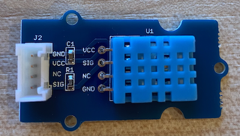

<!--
CO_OP_TRANSLATOR_METADATA:
{
  "original_hash": "7678f7c67b97ee52d5727496dcd7d346",
  "translation_date": "2025-08-27T22:46:23+00:00",
  "source_file": "2-farm/lessons/1-predict-plant-growth/pi-temp.md",
  "language_code": "da"
}
-->
# Mål temperatur - Raspberry Pi

I denne del af lektionen vil du tilføje en temperatursensor til din Raspberry Pi.

## Hardware

Sensoren, du vil bruge, er en [DHT11 fugtigheds- og temperatursensor](https://www.seeedstudio.com/Grove-Temperature-Humidity-Sensor-DHT11.html), som kombinerer 2 sensorer i én pakke. Denne sensor er ret populær, og der findes mange kommercielt tilgængelige sensorer, der kombinerer temperatur, fugtighed og nogle gange atmosfærisk tryk. Temperaturkomponenten er en negativ temperaturkoefficient (NTC) termistor, en termistor hvor modstanden falder, når temperaturen stiger.

Dette er en digital sensor, så den har en indbygget ADC, der skaber et digitalt signal med temperatur- og fugtighedsdata, som mikrocontrolleren kan læse.

### Tilslut temperatursensoren

Grove-temperatursensoren kan tilsluttes Raspberry Pi.

#### Opgave

Tilslut temperatursensoren



1. Sæt den ene ende af et Grove-kabel i stikket på fugtigheds- og temperatursensoren. Det kan kun sættes i på én måde.

1. Med Raspberry Pi slukket, tilslut den anden ende af Grove-kablet til det digitale stik markeret **D5** på Grove Base-hatten, der er tilsluttet Pi'en. Dette stik er det andet fra venstre i rækken af stik ved siden af GPIO-pinnene.


## Programmer temperatursensoren

Enheden kan nu programmeres til at bruge den tilsluttede temperatursensor.

### Opgave

Programmer enheden.

1. Tænd for Pi'en og vent, indtil den er startet op.

1. Start VS Code, enten direkte på Pi'en eller ved at oprette forbindelse via Remote SSH-udvidelsen.

    > ⚠️ Du kan finde [instruktionerne til opsætning og start af VS Code i lektion 1, hvis det er nødvendigt](../../../1-getting-started/lessons/1-introduction-to-iot/pi.md).

1. Fra terminalen skal du oprette en ny mappe i `pi`-brugerens hjemmekatalog kaldet `temperature-sensor`. Opret en fil i denne mappe kaldet `app.py`:

    ```sh
    mkdir temperature-sensor
    cd temperature-sensor
    touch app.py
    ```

1. Åbn denne mappe i VS Code.

1. For at bruge fugtigheds- og temperatursensoren skal en ekstra Pip-pakke installeres. Fra terminalen i VS Code skal du køre følgende kommando for at installere denne Pip-pakke på Pi'en:

    ```sh
    pip3 install seeed-python-dht
    ```

1. Tilføj følgende kode til `app.py`-filen for at importere de nødvendige biblioteker:

    ```python
    import time
    from seeed_dht import DHT
    ```

    `from seeed_dht import DHT`-sætningen importerer `DHT`-sensor-klassen for at interagere med en Grove-temperatursensor fra `seeed_dht`-modulet.

1. Tilføj følgende kode efter ovenstående for at oprette en instans af klassen, der styrer temperatursensoren:

    ```python
    sensor = DHT("11", 5)
    ```

    Dette erklærer en instans af `DHT`-klassen, der styrer den **D**igitale **H**umidity og **T**emperature sensor. Den første parameter angiver, at den sensor, der bruges, er *DHT11*-sensoren - det bibliotek, du bruger, understøtter andre varianter af denne sensor. Den anden parameter angiver, at sensoren er tilsluttet digital port `D5` på Grove Base-hatten.

    > ✅ Husk, alle stikkene har unikke pin-numre. Pins 0, 2, 4 og 6 er analoge pins, pins 5, 16, 18, 22, 24 og 26 er digitale pins.

1. Tilføj en uendelig løkke efter ovenstående kode for at aflæse temperatursensorens værdi og udskrive den til konsollen:

    ```python
    while True:
        _, temp = sensor.read()
        print(f'Temperature {temp}°C')
    ```

    Kaldet til `sensor.read()` returnerer en tuple med fugtighed og temperatur. Du har kun brug for temperaturværdien, så fugtigheden ignoreres. Temperaturværdien udskrives derefter til konsollen.

1. Tilføj en kort pause på ti sekunder i slutningen af `loop`, da temperaturværdierne ikke behøver at blive kontrolleret kontinuerligt. En pause reducerer enhedens strømforbrug.

    ```python
    time.sleep(10)
    ```

1. Fra VS Code-terminalen skal du køre følgende for at køre din Python-app:

    ```sh
    python3 app.py
    ```

    Du bør se temperaturværdier blive udskrevet til konsollen. Brug noget til at varme sensoren op, som at trykke din tommelfinger på den eller bruge en ventilator for at se værdierne ændre sig:

    ```output
    pi@raspberrypi:~/temperature-sensor $ python3 app.py 
    Temperature 26°C
    Temperature 26°C
    Temperature 28°C
    Temperature 30°C
    Temperature 32°C
    ```

> 💁 Du kan finde denne kode i [code-temperature/pi](../../../../../2-farm/lessons/1-predict-plant-growth/code-temperature/pi)-mappen.

😀 Dit program til temperatursensoren var en succes!

---

**Ansvarsfraskrivelse**:  
Dette dokument er blevet oversat ved hjælp af AI-oversættelsestjenesten [Co-op Translator](https://github.com/Azure/co-op-translator). Selvom vi bestræber os på nøjagtighed, skal du være opmærksom på, at automatiserede oversættelser kan indeholde fejl eller unøjagtigheder. Det originale dokument på dets oprindelige sprog bør betragtes som den autoritative kilde. For kritisk information anbefales professionel menneskelig oversættelse. Vi er ikke ansvarlige for eventuelle misforståelser eller fejltolkninger, der opstår som følge af brugen af denne oversættelse.