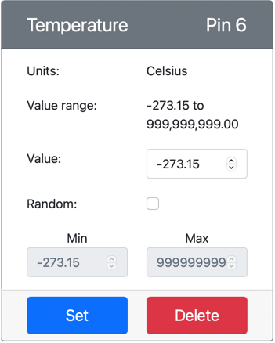

<!--
CO_OP_TRANSLATOR_METADATA:
{
  "original_hash": "70e5a428b607cd5a9a4f422c2a4df03d",
  "translation_date": "2025-08-27T22:51:36+00:00",
  "source_file": "2-farm/lessons/1-predict-plant-growth/virtual-device-temp.md",
  "language_code": "da"
}
-->
# Mål temperatur - Virtuel IoT-hardware

I denne del af lektionen vil du tilføje en temperatursensor til din virtuelle IoT-enhed.

## Virtuel hardware

Den virtuelle IoT-enhed vil bruge en simuleret Grove Digital Humidity and Temperature-sensor. Dette gør denne øvelse identisk med at bruge en Raspberry Pi med en fysisk Grove DHT11-sensor.

Sensoren kombinerer en **temperatursensor** med en **fugtighedssensor**, men i denne øvelse er du kun interesseret i temperatursensor-komponenten. På en fysisk IoT-enhed ville temperatursensoren være en [termistor](https://wikipedia.org/wiki/Thermistor), der måler temperatur ved at registrere ændringer i modstand, når temperaturen ændrer sig. Temperatursensorer er normalt digitale sensorer, der internt konverterer den målte modstand til en temperatur i grader Celsius (eller Kelvin, eller Fahrenheit).

### Tilføj sensorerne til CounterFit

For at bruge en virtuel fugtigheds- og temperatursensor skal du tilføje de to sensorer til CounterFit-appen.

#### Opgave - tilføj sensorerne til CounterFit

Tilføj fugtigheds- og temperatursensorerne til CounterFit-appen.

1. Opret en ny Python-app på din computer i en mappe kaldet `temperature-sensor` med en enkelt fil kaldet `app.py` og et Python-virtuelt miljø, og tilføj CounterFit pip-pakkerne.

    > ⚠️ Du kan henvise til [instruktionerne for at oprette og opsætte et CounterFit Python-projekt i lektion 1, hvis nødvendigt](../../../1-getting-started/lessons/1-introduction-to-iot/virtual-device.md).

1. Installer en ekstra Pip-pakke for at installere en CounterFit shim til DHT11-sensoren. Sørg for, at du installerer dette fra en terminal med det virtuelle miljø aktiveret.

    ```sh
    pip install counterfit-shims-seeed-python-dht
    ```

1. Sørg for, at CounterFit-webappen kører.

1. Opret en fugtighedssensor:

    1. I boksen *Create sensor* i panelet *Sensors*, vælg *Sensor type* og vælg *Humidity*.

    1. Lad *Units* være indstillet til *Percentage*.

    1. Sørg for, at *Pin* er indstillet til *5*.

    1. Vælg knappen **Add** for at oprette fugtighedssensoren på Pin 5.

    

    Fugtighedssensoren vil blive oprettet og vises i sensorlisten.

    

1. Opret en temperatursensor:

    1. I boksen *Create sensor* i panelet *Sensors*, vælg *Sensor type* og vælg *Temperature*.

    1. Lad *Units* være indstillet til *Celsius*.

    1. Sørg for, at *Pin* er indstillet til *6*.

    1. Vælg knappen **Add** for at oprette temperatursensoren på Pin 6.

    

    Temperatursensoren vil blive oprettet og vises i sensorlisten.

    

## Programmer temperatursensor-appen

Temperatursensor-appen kan nu programmeres ved hjælp af CounterFit-sensorerne.

### Opgave - programmer temperatursensor-appen

Programmer temperatursensor-appen.

1. Sørg for, at `temperature-sensor`-appen er åben i VS Code.

1. Åbn filen `app.py`.

1. Tilføj følgende kode øverst i `app.py` for at forbinde appen til CounterFit:

    ```python
    from counterfit_connection import CounterFitConnection
    CounterFitConnection.init('127.0.0.1', 5000)
    ```

1. Tilføj følgende kode til `app.py` for at importere de nødvendige biblioteker:

    ```python
    import time
    from counterfit_shims_seeed_python_dht import DHT
    ```

    `from seeed_dht import DHT`-sætningen importerer `DHT`-sensor-klassen for at interagere med en virtuel Grove-temperatursensor ved hjælp af en shim fra modulet `counterfit_shims_seeed_python_dht`.

1. Tilføj følgende kode efter ovenstående for at oprette en instans af klassen, der styrer den virtuelle fugtigheds- og temperatursensor:

    ```python
    sensor = DHT("11", 5)
    ```

    Dette erklærer en instans af `DHT`-klassen, der styrer den virtuelle **D**igitale **H**umidity og **T**emperature-sensor. Den første parameter fortæller koden, at sensoren, der bruges, er en virtuel *DHT11*-sensor. Den anden parameter fortæller koden, at sensoren er tilsluttet port `5`.

    > 💁 CounterFit simulerer denne kombinerede fugtigheds- og temperatursensor ved at forbinde til 2 sensorer: en fugtighedssensor på den pin, der gives, når `DHT`-klassen oprettes, og en temperatursensor, der kører på den næste pin. Hvis fugtighedssensoren er på pin 5, forventer shimmen, at temperatursensoren er på pin 6.

1. Tilføj en uendelig løkke efter ovenstående kode for at aflæse temperatursensorens værdi og udskrive den til konsollen:

    ```python
    while True:
        _, temp = sensor.read()
        print(f'Temperature {temp}°C')
    ```

    Kaldet til `sensor.read()` returnerer en tuple med fugtighed og temperatur. Du har kun brug for temperaturværdien, så fugtigheden ignoreres. Temperaturværdien udskrives derefter til konsollen.

1. Tilføj en kort pause på ti sekunder i slutningen af `loop`, da temperaturværdierne ikke behøver at blive kontrolleret kontinuerligt. En pause reducerer enhedens strømforbrug.

    ```python
    time.sleep(10)
    ```

1. Fra VS Code-terminalen med et aktiveret virtuelt miljø, kør følgende for at køre din Python-app:

    ```sh
    python app.py
    ```

1. Fra CounterFit-appen skal du ændre værdien af temperatursensoren, der vil blive aflæst af appen. Du kan gøre dette på to måder:

    * Indtast et tal i *Value*-boksen for temperatursensoren, og vælg derefter knappen **Set**. Det tal, du indtaster, vil være den værdi, sensoren returnerer.

    * Marker afkrydsningsfeltet *Random*, og indtast en *Min*- og *Max*-værdi, og vælg derefter knappen **Set**. Hver gang sensoren aflæser en værdi, vil den aflæse et tilfældigt tal mellem *Min* og *Max*.

    Du bør se de værdier, du har indstillet, vises i konsollen. Ændr *Value* eller *Random*-indstillingerne for at se værdien ændre sig.

    ```output
    (.venv) ➜  temperature-sensor python app.py
    Temperature 28.25°C
    Temperature 30.71°C
    Temperature 25.17°C
    ```

> 💁 Du kan finde denne kode i mappen [code-temperature/virtual-device](../../../../../2-farm/lessons/1-predict-plant-growth/code-temperature/virtual-device).

😀 Dit temperatursensorprogram var en succes!

---

**Ansvarsfraskrivelse**:  
Dette dokument er blevet oversat ved hjælp af AI-oversættelsestjenesten [Co-op Translator](https://github.com/Azure/co-op-translator). Selvom vi bestræber os på nøjagtighed, skal det bemærkes, at automatiserede oversættelser kan indeholde fejl eller unøjagtigheder. Det originale dokument på dets oprindelige sprog bør betragtes som den autoritative kilde. For kritisk information anbefales professionel menneskelig oversættelse. Vi påtager os intet ansvar for misforståelser eller fejltolkninger, der måtte opstå som følge af brugen af denne oversættelse.