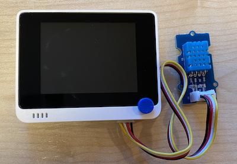

<!--
CO_OP_TRANSLATOR_METADATA:
{
  "original_hash": "59263d094f20b302053888cd236880c3",
  "translation_date": "2025-08-27T22:52:39+00:00",
  "source_file": "2-farm/lessons/1-predict-plant-growth/wio-terminal-temp.md",
  "language_code": "da"
}
-->
# Mål temperatur - Wio Terminal

I denne del af lektionen vil du tilføje en temperatursensor til din Wio Terminal og aflæse temperaturværdier fra den.

## Hardware

Wio Terminalen kræver en temperatursensor.

Sensoren, du vil bruge, er en [DHT11 fugtigheds- og temperatursensor](https://www.seeedstudio.com/Grove-Temperature-Humidity-Sensor-DHT11.html), som kombinerer 2 sensorer i én pakke. Denne sensor er ret populær, og der findes mange kommercielt tilgængelige sensorer, der kombinerer temperatur, fugtighed og nogle gange atmosfærisk tryk. Temperaturkomponenten er en negativ temperaturkoefficient (NTC) termistor, en termistor hvor modstanden falder, når temperaturen stiger.

Dette er en digital sensor, så den har en indbygget ADC, der skaber et digitalt signal med temperatur- og fugtighedsdata, som mikrocontrolleren kan læse.

### Tilslut temperatursensoren

Grove-temperatursensoren kan tilsluttes Wio Terminalens digitale port.

#### Opgave - tilslut temperatursensoren

Tilslut temperatursensoren.


1. Sæt den ene ende af et Grove-kabel i stikket på fugtigheds- og temperatursensoren. Det kan kun sættes i på én måde.

1. Med Wio Terminalen frakoblet fra din computer eller anden strømkilde, tilslut den anden ende af Grove-kablet til den højre Grove-port på Wio Terminalen, når du ser på skærmen. Dette er porten længst væk fra tænd/sluk-knappen.



## Programmer temperatursensoren

Wio Terminalen kan nu programmeres til at bruge den tilsluttede temperatursensor.

### Opgave - programmer temperatursensoren

Programmer enheden.

1. Opret et helt nyt Wio Terminal-projekt ved hjælp af PlatformIO. Kald dette projekt `temperature-sensor`. Tilføj kode i `setup`-funktionen for at konfigurere den serielle port.

    > ⚠️ Du kan finde [instruktionerne til at oprette et PlatformIO-projekt i projekt 1, lektion 1, hvis nødvendigt](../../../1-getting-started/lessons/1-introduction-to-iot/wio-terminal.md#create-a-platformio-project).

1. Tilføj en biblioteksafhængighed for Seeed Grove Fugtigheds- og Temperatursensor-biblioteket til projektets `platformio.ini`-fil:

    ```ini
    lib_deps =
        seeed-studio/Grove Temperature And Humidity Sensor @ 1.0.1
    ```

    > ⚠️ Du kan finde [instruktionerne til at tilføje biblioteker til et PlatformIO-projekt i projekt 1, lektion 4, hvis nødvendigt](../../../1-getting-started/lessons/4-connect-internet/wio-terminal-mqtt.md#install-the-wifi-and-mqtt-arduino-libraries).

1. Tilføj følgende `#include`-direktiver øverst i filen, under den eksisterende `#include <Arduino.h>`:

    ```cpp
    #include <DHT.h>
    #include <SPI.h>
    ```

    Dette importerer filer, der er nødvendige for at interagere med sensoren. `DHT.h`-headerfilen indeholder koden til selve sensoren, og tilføjelsen af `SPI.h`-headeren sikrer, at den kode, der er nødvendig for at kommunikere med sensoren, bliver linket ind, når appen kompileres.

1. Før `setup`-funktionen, deklarer DHT-sensoren:

    ```cpp
    DHT dht(D0, DHT11);
    ```

    Dette deklarerer en instans af `DHT`-klassen, som styrer den **D**igitale **H**umidity og **T**emperature sensor. Denne er tilsluttet port `D0`, den højre Grove-port på Wio Terminalen. Den anden parameter fortæller koden, at den sensor, der bruges, er *DHT11*-sensoren - det bibliotek, du bruger, understøtter andre varianter af denne sensor.

1. I `setup`-funktionen, tilføj kode for at opsætte den serielle forbindelse:

    ```cpp
    void setup()
    {
        Serial.begin(9600);
    
        while (!Serial)
            ; // Wait for Serial to be ready
    
        delay(1000);
    }
    ```

1. I slutningen af `setup`-funktionen, efter den sidste `delay`, tilføj et kald for at starte DHT-sensoren:

    ```cpp
    dht.begin();
    ```

1. I `loop`-funktionen, tilføj kode for at kalde sensoren og udskrive temperaturen til den serielle port:

    ```cpp
    void loop()
    {
        float temp_hum_val[2] = {0};
        dht.readTempAndHumidity(temp_hum_val);
        Serial.print("Temperature: ");
        Serial.print(temp_hum_val[1]);
        Serial.println ("°C");
    
        delay(10000);
    }
    ```

    Denne kode deklarerer et tomt array med 2 floats og sender det til kaldet `readTempAndHumidity` på `DHT`-instansen. Dette kald udfylder arrayet med 2 værdier - fugtigheden placeres i det 0. element i arrayet (husk, at arrays i C++ er 0-baserede, så det 0. element er det 'første' element i arrayet), og temperaturen placeres i det 1. element.

    Temperaturen aflæses fra det 1. element i arrayet og udskrives til den serielle port.

    > 🇺🇸 Temperaturen aflæses i Celsius. For amerikanere, for at konvertere dette til Fahrenheit, divider Celsius-værdien med 5, gang med 9, og læg 32 til. For eksempel bliver en temperaturaflæsning på 20°C til ((20/5)*9) + 32 = 68°F.

1. Byg og upload koden til Wio Terminalen.

    > ⚠️ Du kan finde [instruktionerne til at oprette et PlatformIO-projekt i projekt 1, lektion 1, hvis nødvendigt](../../../1-getting-started/lessons/1-introduction-to-iot/wio-terminal.md#write-the-hello-world-app).

1. Når koden er uploadet, kan du overvåge temperaturen ved hjælp af den serielle monitor:

    ```output
    > Executing task: platformio device monitor <
    
    --- Available filters and text transformations: colorize, debug, default, direct, hexlify, log2file, nocontrol, printable, send_on_enter, time
    --- More details at http://bit.ly/pio-monitor-filters
    --- Miniterm on /dev/cu.usbmodem1201  9600,8,N,1 ---
    --- Quit: Ctrl+C | Menu: Ctrl+T | Help: Ctrl+T followed by Ctrl+H ---
    Temperature: 25.00°C
    Temperature: 25.00°C
    Temperature: 25.00°C
    Temperature: 24.00°C
    ```

> 💁 Du kan finde denne kode i [code-temperature/wio-terminal](../../../../../2-farm/lessons/1-predict-plant-growth/code-temperature/wio-terminal)-mappen.

😀 Dit program til temperatursensoren var en succes!

---

**Ansvarsfraskrivelse**:  
Dette dokument er blevet oversat ved hjælp af AI-oversættelsestjenesten [Co-op Translator](https://github.com/Azure/co-op-translator). Selvom vi bestræber os på at opnå nøjagtighed, skal du være opmærksom på, at automatiserede oversættelser kan indeholde fejl eller unøjagtigheder. Det originale dokument på dets oprindelige sprog bør betragtes som den autoritative kilde. For kritisk information anbefales professionel menneskelig oversættelse. Vi er ikke ansvarlige for eventuelle misforståelser eller fejltolkninger, der måtte opstå som følge af brugen af denne oversættelse.