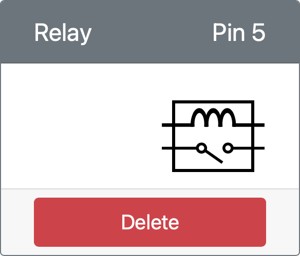

<!--
CO_OP_TRANSLATOR_METADATA:
{
  "original_hash": "f8f541ee945545017a51aaf309aa37c3",
  "translation_date": "2025-08-27T22:56:41+00:00",
  "source_file": "2-farm/lessons/3-automated-plant-watering/virtual-device-relay.md",
  "language_code": "da"
}
-->
# Styr en relæ - Virtuel IoT-hardware

I denne del af lektionen vil du tilføje et relæ til din virtuelle IoT-enhed ud over jordfugtighedssensoren og styre det baseret på jordfugtighedsniveauet.

## Virtuel hardware

Den virtuelle IoT-enhed vil bruge et simuleret Grove-relæ. Dette holder denne øvelse identisk med at bruge en Raspberry Pi med et fysisk Grove-relæ.

På en fysisk IoT-enhed ville relæet være et normalt åbent relæ (hvilket betyder, at udgangskredsløbet er åbent eller afbrudt, når der ikke sendes et signal til relæet). Et relæ som dette kan håndtere udgangskredsløb op til 250V og 10A.

### Tilføj relæet til CounterFit

For at bruge et virtuelt relæ skal du tilføje det til CounterFit-appen.

#### Opgave

Tilføj relæet til CounterFit-appen.

1. Åbn `soil-moisture-sensor`-projektet fra sidste lektion i VS Code, hvis det ikke allerede er åbent. Du vil tilføje til dette projekt.

1. Sørg for, at CounterFit-webappen kører.

1. Opret et relæ:

    1. I *Create actuator*-boksen i *Actuators*-panelet, rul ned i *Actuator type*-boksen og vælg *Relay*.

    1. Sæt *Pin* til *5*.

    1. Vælg **Add**-knappen for at oprette relæet på Pin 5.

    

    Relæet vil blive oprettet og vises i listen over aktuatorer.

    

## Programmer relæet

Jordfugtighedssensor-appen kan nu programmeres til at bruge det virtuelle relæ.

### Opgave

Programmer den virtuelle enhed.

1. Åbn `soil-moisture-sensor`-projektet fra sidste lektion i VS Code, hvis det ikke allerede er åbent. Du vil tilføje til dette projekt.

1. Tilføj følgende kode til `app.py`-filen under de eksisterende imports:

    ```python
    from counterfit_shims_grove.grove_relay import GroveRelay
    ```

    Denne erklæring importerer `GroveRelay` fra Grove Python shim-bibliotekerne for at interagere med det virtuelle Grove-relæ.

1. Tilføj følgende kode under deklarationen af `ADC`-klassen for at oprette en `GroveRelay`-instans:

    ```python
    relay = GroveRelay(5)
    ```

    Dette opretter et relæ ved hjælp af pin **5**, den pin du tilsluttede relæet til.

1. For at teste om relæet fungerer, tilføj følgende til `while True:`-løkken:

    ```python
    relay.on()
    time.sleep(.5)
    relay.off()
    ```

    Koden tænder relæet, venter 0,5 sekunder og slukker derefter relæet.

1. Kør Python-appen. Relæet vil tænde og slukke hvert 10. sekund med en halv sekunds forsinkelse mellem tænding og slukning. Du vil se det virtuelle relæ i CounterFit-appen lukke og åbne, når relæet tændes og slukkes.

    

## Styr relæet ud fra jordfugtighed

Nu hvor relæet fungerer, kan det styres som reaktion på jordfugtighedsaflæsninger.

### Opgave

Styr relæet.

1. Slet de 3 linjer kode, du tilføjede for at teste relæet. Erstat dem med følgende kode på samme sted:

    ```python
    if soil_moisture > 450:
        print("Soil Moisture is too low, turning relay on.")
        relay.on()
    else:
        print("Soil Moisture is ok, turning relay off.")
        relay.off()
    ```

    Denne kode kontrollerer jordfugtighedsniveauet fra jordfugtighedssensoren. Hvis det er over 450, tænder det relæet, og slukker det, hvis det falder under 450.

    > 💁 Husk, at den kapacitive jordfugtighedssensor aflæser: Jo lavere jordfugtighedsniveau, jo mere fugt er der i jorden og omvendt.

1. Kør Python-appen. Du vil se relæet tænde eller slukke afhængigt af jordfugtighedsniveauerne. Ændr *Value* eller *Random*-indstillingerne for jordfugtighedssensoren for at se værdien ændre sig.

    ```output
    Soil Moisture: 638
    Soil Moisture is too low, turning relay on.
    Soil Moisture: 452
    Soil Moisture is too low, turning relay on.
    Soil Moisture: 347
    Soil Moisture is ok, turning relay off.
    ```

> 💁 Du kan finde denne kode i [code-relay/virtual-device](../../../../../2-farm/lessons/3-automated-plant-watering/code-relay/virtual-device)-mappen.

😀 Dit virtuelle jordfugtighedssensorprogram, der styrer et relæ, var en succes!

---

**Ansvarsfraskrivelse**:  
Dette dokument er blevet oversat ved hjælp af AI-oversættelsestjenesten [Co-op Translator](https://github.com/Azure/co-op-translator). Selvom vi bestræber os på nøjagtighed, skal du være opmærksom på, at automatiserede oversættelser kan indeholde fejl eller unøjagtigheder. Det originale dokument på dets oprindelige sprog bør betragtes som den autoritative kilde. For kritisk information anbefales professionel menneskelig oversættelse. Vi påtager os ikke ansvar for eventuelle misforståelser eller fejltolkninger, der opstår som følge af brugen af denne oversættelse.