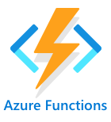

<!--
CO_OP_TRANSLATOR_METADATA:
{
  "original_hash": "5f2d2f4a5a023c93ab34a0cc5b47c0c4",
  "translation_date": "2025-08-27T22:31:05+00:00",
  "source_file": "2-farm/lessons/5-migrate-application-to-the-cloud/README.md",
  "language_code": "da"
}
-->
# Migrer din applikationslogik til skyen


> Sketchnote af [Nitya Narasimhan](https://github.com/nitya). Klik på billedet for en større version.

Denne lektion blev undervist som en del af [IoT for Beginners Project 2 - Digital Agriculture-serien](https://youtube.com/playlist?list=PLmsFUfdnGr3yCutmcVg6eAUEfsGiFXgcx) fra [Microsoft Reactor](https://developer.microsoft.com/reactor/?WT.mc_id=academic-17441-jabenn).

[](https://youtu.be/VVZDcs5u1_I)

## Quiz før lektionen

[Quiz før lektionen](https://black-meadow-040d15503.1.azurestaticapps.net/quiz/17)

## Introduktion

I den sidste lektion lærte du, hvordan du forbinder din plantes jordfugtighedsovervågning og relækontrol til en skybaseret IoT-tjeneste. Det næste skridt er at flytte serverkoden, der styrer relæets timing, til skyen. I denne lektion lærer du, hvordan du gør dette ved hjælp af serverløse funktioner.

I denne lektion dækker vi:

* [Hvad er serverløs?](../../../../../2-farm/lessons/5-migrate-application-to-the-cloud)
* [Opret en serverløs applikation](../../../../../2-farm/lessons/5-migrate-application-to-the-cloud)
* [Opret en IoT Hub-hændelsesudløser](../../../../../2-farm/lessons/5-migrate-application-to-the-cloud)
* [Send direkte metodeanmodninger fra serverløs kode](../../../../../2-farm/lessons/5-migrate-application-to-the-cloud)
* [Udrul din serverløse kode til skyen](../../../../../2-farm/lessons/5-migrate-application-to-the-cloud)

## Hvad er serverløs?

Serverløs, eller serverløs computing, indebærer at oprette små kodeblokke, der køres i skyen som svar på forskellige typer hændelser. Når hændelsen opstår, køres din kode, og den får data om hændelsen. Disse hændelser kan komme fra mange forskellige kilder, herunder webanmodninger, beskeder i en kø, ændringer i en database eller beskeder sendt til en IoT-tjeneste af IoT-enheder.


> 💁 Hvis du tidligere har brugt database-triggere, kan du tænke på dette som noget lignende: kode, der udløses af en hændelse som f.eks. indsættelse af en række.


Din kode køres kun, når hændelsen opstår; der er intet, der holder din kode aktiv på andre tidspunkter. Hændelsen opstår, din kode indlæses og køres. Dette gør serverløs meget skalerbar – hvis mange hændelser opstår samtidig, kan cloud-udbyderen køre din funktion så mange gange, som det er nødvendigt, på tværs af de tilgængelige servere. Ulempen er, at hvis du har brug for at dele information mellem hændelser, skal du gemme det et sted som en database i stedet for at opbevare det i hukommelsen.

Din kode skrives som en funktion, der tager detaljer om hændelsen som en parameter. Du kan bruge en bred vifte af programmeringssprog til at skrive disse serverløse funktioner.

> 🎓 Serverløs kaldes også Functions as a Service (FaaS), da hver hændelsesudløser implementeres som en funktion i koden.

På trods af navnet bruger serverløs faktisk servere. Navnet skyldes, at du som udvikler ikke behøver at bekymre dig om de servere, der er nødvendige for at køre din kode; alt, hvad du skal bekymre dig om, er, at din kode køres som svar på en hændelse. Cloud-udbyderen har en serverløs *runtime*, der håndterer tildeling af servere, netværk, lager, CPU, hukommelse og alt andet, der er nødvendigt for at køre din kode. Denne model betyder, at du ikke betaler pr. server for tjenesten, da der ikke er nogen server. I stedet betaler du for den tid, din kode kører, og den mængde hukommelse, der bruges.

> 💰 Serverløs er en af de billigste måder at køre kode i skyen på. For eksempel tillader en cloud-udbyder på tidspunktet for denne skrivning, at alle dine serverløse funktioner tilsammen kan udføres 1.000.000 gange om måneden, før de begynder at opkræve betaling. Derefter koster det 0,20 USD for hver 1.000.000 udførelser. Når din kode ikke kører, betaler du ikke.

Som IoT-udvikler er den serverløse model ideel. Du kan skrive en funktion, der kaldes som svar på beskeder sendt fra enhver IoT-enhed, der er forbundet til din skyhostede IoT-tjeneste. Din kode vil håndtere alle beskeder, der sendes, men kun køre, når det er nødvendigt.

✅ Kig tilbage på den kode, du skrev som serverkode, der lytter til beskeder over MQTT. Hvordan kunne denne kode køre i skyen ved hjælp af serverløs? Hvordan tror du, koden kunne ændres for at understøtte serverløs computing?

> 💁 Den serverløse model udvides til andre cloud-tjenester ud over at køre kode. For eksempel er serverløse databaser tilgængelige i skyen med en serverløs prismodel, hvor du betaler pr. forespørgsel mod databasen, såsom en forespørgsel eller indsættelse. Prisen baseres typisk på, hvor meget arbejde der udføres for at håndtere forespørgslen. For eksempel vil en enkelt forespørgsel efter en række mod en primær nøgle koste mindre end en kompleks operation, der sammenkæder mange tabeller og returnerer tusindvis af rækker.

## Opret en serverløs applikation

Den serverløse computing-tjeneste fra Microsoft kaldes Azure Functions.



Den korte video nedenfor giver et overblik over Azure Functions.

[](https://www.youtube.com/watch?v=8-jz5f_JyEQ)

> 🎥 Klik på billedet ovenfor for at se videoen.

✅ Tag et øjeblik til at undersøge og læse oversigten over Azure Functions i [Microsoft Azure Functions-dokumentationen](https://docs.microsoft.com/azure/azure-functions/functions-overview?WT.mc_id=academic-17441-jabenn).

For at skrive Azure Functions starter du med en Azure Functions-app i det sprog, du foretrækker. Azure Functions understøtter som standard Python, JavaScript, TypeScript, C#, F#, Java og Powershell. I denne lektion lærer du, hvordan du skriver en Azure Functions-app i Python.

> 💁 Azure Functions understøtter også brugerdefinerede håndterere, så du kan skrive dine funktioner i ethvert sprog, der understøtter HTTP-anmodninger, herunder ældre sprog som COBOL.

Functions-apps består af en eller flere *triggere* – funktioner, der reagerer på hændelser. Du kan have flere triggere i én Functions-app, som alle deler fælles konfiguration. For eksempel kan du i konfigurationsfilen for din Functions-app have forbindelsesdetaljer for din IoT Hub, og alle funktionerne i appen kan bruge dette til at oprette forbindelse og lytte efter hændelser.

### Opgave – installer Azure Functions-værktøjer

> På tidspunktet for denne skrivning fungerer Azure Functions-værktøjerne ikke fuldt ud på Apple Silicon med Python-projekter. Du skal bruge en Intel-baseret Mac, Windows-PC eller Linux-PC i stedet.

En fantastisk funktion ved Azure Functions er, at du kan køre dem lokalt. Den samme runtime, der bruges i skyen, kan køres på din computer, så du kan skrive kode, der reagerer på IoT-beskeder, og køre den lokalt. Du kan endda fejlfinde din kode, mens hændelser håndteres. Når du er tilfreds med din kode, kan den udrulles til skyen.

Azure Functions-værktøjerne er tilgængelige som en CLI, kendt som Azure Functions Core Tools.

1. Installer Azure Functions Core Tools ved at følge instruktionerne i [Azure Functions Core Tools-dokumentationen](https://docs.microsoft.com/azure/azure-functions/functions-run-local?WT.mc_id=academic-17441-jabenn).

1. Installer Azure Functions-udvidelsen til VS Code. Denne udvidelse giver support til at oprette, fejlfinde og udrulle Azure Functions. Se [Azure Functions-udvidelsesdokumentationen](https://marketplace.visualstudio.com/items?WT.mc_id=academic-17441-jabenn&itemName=ms-azuretools.vscode-azurefunctions) for instruktioner om installation af denne udvidelse i VS Code.

Når du udruller din Azure Functions-app til skyen, skal den bruge en lille mængde cloud-lagring til at gemme ting som applikationsfiler og logfiler. Når du kører din Functions-app lokalt, skal du stadig oprette forbindelse til cloud-lagring, men i stedet for at bruge faktisk cloud-lagring kan du bruge en lagringsemulator kaldet [Azurite](https://github.com/Azure/Azurite). Denne kører lokalt, men fungerer som cloud-lagring.

> 🎓 I Azure er den lagring, som Azure Functions bruger, en Azure Storage Account. Disse konti kan gemme filer, blobs, data i tabeller eller data i køer. Du kan dele én lagringskonto mellem mange apps, såsom en Functions-app og en webapp.

1. Azurite er en Node.js-app, så du skal installere Node.js. Du kan finde download- og installationsinstruktioner på [Node.js-websitet](https://nodejs.org/). Hvis du bruger en Mac, kan du også installere det via [Homebrew](https://formulae.brew.sh/formula/node).

1. Installer Azurite ved hjælp af følgende kommando (`npm` er et værktøj, der installeres sammen med Node.js):

    ```sh
    npm install -g azurite
    ```

1. Opret en mappe kaldet `azurite`, som Azurite kan bruge til at gemme data:

    ```sh
    mkdir azurite
    ```

1. Kør Azurite og angiv denne nye mappe:

    ```sh
    azurite --location azurite
    ```

    Azurite-lagringsemulatoren starter og er klar til, at den lokale Functions-runtime kan oprette forbindelse.

    ```output
    ➜  ~ azurite --location azurite  
    Azurite Blob service is starting at http://127.0.0.1:10000
    Azurite Blob service is successfully listening at http://127.0.0.1:10000
    Azurite Queue service is starting at http://127.0.0.1:10001
    Azurite Queue service is successfully listening at http://127.0.0.1:10001
    Azurite Table service is starting at http://127.0.0.1:10002
    Azurite Table service is successfully listening at http://127.0.0.1:10002
    ```

### Opgave – opret et Azure Functions-projekt

Azure Functions CLI kan bruges til at oprette en ny Functions-app.

1. Opret en mappe til din Functions-app, og naviger til den. Kald den `soil-moisture-trigger`.

    ```sh
    mkdir soil-moisture-trigger
    cd soil-moisture-trigger
    ```

1. Opret et Python-virtuelt miljø i denne mappe:

    ```sh
    python3 -m venv .venv
    ```

1. Aktivér det virtuelle miljø:

    * På Windows:
        * Hvis du bruger Command Prompt eller Command Prompt via Windows Terminal, skal du køre:

            ```cmd
            .venv\Scripts\activate.bat
            ```

        * Hvis du bruger PowerShell, skal du køre:

            ```powershell
            .\.venv\Scripts\Activate.ps1
            ```

    * På macOS eller Linux skal du køre:

        ```cmd
        source ./.venv/bin/activate
        ```

    > 💁 Disse kommandoer skal køres fra samme placering, som du kørte kommandoen for at oprette det virtuelle miljø. Du behøver aldrig navigere ind i `.venv`-mappen; du skal altid køre aktiveringskommandoen og eventuelle kommandoer for at installere pakker eller køre kode fra den mappe, hvor du oprettede det virtuelle miljø.

1. Kør følgende kommando for at oprette en Functions-app i denne mappe:

    ```sh
    func init --worker-runtime python soil-moisture-trigger
    ```

    Dette vil oprette tre filer i den aktuelle mappe:

    * `host.json` – dette JSON-dokument indeholder indstillinger for din Functions-app. Du behøver ikke ændre disse indstillinger.
    * `local.settings.json` – dette JSON-dokument indeholder indstillinger, som din app bruger, når den kører lokalt, såsom forbindelsesstrenge til din IoT Hub. Disse indstillinger er kun lokale og bør ikke tilføjes til versionskontrol. Når du udruller appen til skyen, udrulles disse indstillinger ikke; i stedet indlæses dine indstillinger fra applikationsindstillinger. Dette vil blive dækket senere i denne lektion.
    * `requirements.txt` – dette er en [Pip-kravfil](https://pip.pypa.io/en/stable/user_guide/#requirements-files), der indeholder de Pip-pakker, der er nødvendige for at køre din Functions-app.

1. `local.settings.json`-filen har en indstilling for den lagringskonto, som Functions-appen vil bruge. Denne er som standard tom og skal derfor sættes. For at oprette forbindelse til Azurite-lagringsemulatoren lokalt skal du sætte denne værdi til følgende:

    ```json
    "AzureWebJobsStorage": "UseDevelopmentStorage=true",
    ```

1. Installer de nødvendige Pip-pakker ved hjælp af kravfilen:

    ```sh
    pip install -r requirements.txt
    ```

    > 💁 De nødvendige Pip-pakker skal være i denne fil, så når Functions-appen udrulles til skyen, kan runtime sikre, at de korrekte pakker installeres.

1. For at teste, om alt fungerer korrekt, kan du starte Functions-runtime. Kør følgende kommando for at gøre dette:

    ```sh
    func start
    ```

    Du vil se, at runtime starter og rapporterer, at den ikke har fundet nogen jobfunktioner (triggere).

    ```output
    (.venv) ➜  soil-moisture-trigger func start
    Found Python version 3.9.1 (python3).
    
    Azure Functions Core Tools
    Core Tools Version:       3.0.3442 Commit hash: 6bfab24b2743f8421475d996402c398d2fe4a9e0  (64-bit)
    Function Runtime Version: 3.0.15417.0
    
    [2021-05-05T01:24:46.795Z] No job functions found.
    ```
> ⚠️ Hvis du får en firewall-meddelelse, skal du give adgang, da `func`-applikationen skal kunne læse og skrive til dit netværk.
> ⚠️ Hvis du bruger macOS, kan der være advarsler i outputtet:
>
> ```output
    > (.venv) ➜  soil-moisture-trigger func start
    > Found Python version 3.9.1 (python3).
    >
    > Azure Functions Core Tools
    > Core Tools Version:       3.0.3442 Commit hash: 6bfab24b2743f8421475d996402c398d2fe4a9e0  (64-bit)
    > Function Runtime Version: 3.0.15417.0
    >
    > [2021-06-16T08:18:28.315Z] Cannot create directory for shared memory usage: /dev/shm/AzureFunctions
    > [2021-06-16T08:18:28.316Z] System.IO.FileSystem: Access to the path '/dev/shm/AzureFunctions' is denied. Operation not permitted.
    > [2021-06-16T08:18:30.361Z] No job functions found.
    > ```
>
> Du kan ignorere disse, så længe Functions-appen starter korrekt og viser de kørende funktioner. Som nævnt i [dette spørgsmål på Microsoft Docs Q&A](https://docs.microsoft.com/answers/questions/396617/azure-functions-core-tools-error-osx-devshmazurefu.html?WT.mc_id=academic-17441-jabenn) kan det ignoreres.

1. Stop Functions-appen ved at trykke på `ctrl+c`.

1. Åbn den aktuelle mappe i VS Code, enten ved at åbne VS Code og derefter åbne denne mappe, eller ved at køre følgende kommando:

    ```sh
    code .
    ```

    VS Code vil registrere dit Functions-projekt og vise en notifikation, der siger:

    ```output
    Detected an Azure Functions Project in folder "soil-moisture-trigger" that may have been created outside of
    VS Code. Initialize for optimal use with VS Code?
    ```

    

    Vælg **Yes** i denne notifikation.

1. Sørg for, at det virtuelle Python-miljø kører i VS Code-terminalen. Afslut og genstart det, hvis nødvendigt.

## Opret en IoT Hub-hændelsesudløser

Functions-appen er skallen for din serverløse kode. For at reagere på IoT Hub-hændelser kan du tilføje en IoT Hub-udløser til denne app. Denne udløser skal oprette forbindelse til strømmen af meddelelser, der sendes til IoT Hub, og reagere på dem. For at få denne strøm af meddelelser skal din udløser oprette forbindelse til IoT Hubs *event hub-kompatible endpoint*.

IoT Hub er baseret på en anden Azure-tjeneste kaldet Azure Event Hubs. Event Hubs er en tjeneste, der giver dig mulighed for at sende og modtage meddelelser. IoT Hub udvider dette med funktioner til IoT-enheder. Måden, du opretter forbindelse for at læse meddelelser fra IoT Hub, er den samme som ved brug af Event Hubs.

✅ Lav lidt research: Læs oversigten over Event Hubs i [Azure Event Hubs-dokumentationen](https://docs.microsoft.com/azure/event-hubs/event-hubs-about?WT.mc_id=academic-17441-jabenn). Hvordan sammenligner de grundlæggende funktioner sig med IoT Hub?

For at en IoT-enhed kan oprette forbindelse til IoT Hub, skal den bruge en hemmelig nøgle, der sikrer, at kun tilladte enheder kan oprette forbindelse. Det samme gælder, når du opretter forbindelse for at læse meddelelser. Din kode skal bruge en forbindelsesstreng, der indeholder en hemmelig nøgle sammen med detaljer om IoT Hub.

> 💁 Den standardforbindelsesstreng, du får, har **iothubowner**-tilladelser, hvilket giver enhver kode, der bruger den, fulde tilladelser på IoT Hub. Ideelt set bør du oprette forbindelse med det laveste nødvendige tilladelsesniveau. Dette vil blive dækket i næste lektion.

Når din udløser er forbundet, vil koden inde i funktionen blive kaldt for hver meddelelse, der sendes til IoT Hub, uanset hvilken enhed der sendte den. Udløseren vil få meddelelsen som en parameter.

### Opgave - få forbindelsesstrengen til det event hub-kompatible endpoint

1. Kør følgende kommando fra VS Code-terminalen for at få forbindelsesstrengen til IoT Hubs event hub-kompatible endpoint:

    ```sh
    az iot hub connection-string show --default-eventhub \
                                      --output table \
                                      --hub-name <hub_name>
    ```

    Erstat `<hub_name>` med navnet, du brugte til din IoT Hub.

1. Åbn `local.settings.json`-filen i VS Code. Tilføj følgende værdi i `Values`-sektionen:

    ```json
    "IOT_HUB_CONNECTION_STRING": "<connection string>"
    ```

    Erstat `<connection string>` med værdien fra det forrige trin. Du skal tilføje et komma efter linjen ovenfor for at gøre dette til gyldig JSON.

### Opgave - opret en hændelsesudløser

Du er nu klar til at oprette hændelsesudløseren.

1. Kør følgende kommando fra VS Code-terminalen inde fra mappen `soil-moisture-trigger`:

    ```sh
    func new --name iot-hub-trigger --template "Azure Event Hub trigger"
    ```

    Dette opretter en ny funktion kaldet `iot-hub-trigger`. Udløseren vil oprette forbindelse til det event hub-kompatible endpoint på IoT Hub, så du kan bruge en event hub-udløser. Der er ingen specifik IoT Hub-udløser.

Dette vil oprette en mappe inde i mappen `soil-moisture-trigger` kaldet `iot-hub-trigger`, der indeholder denne funktion. Denne mappe vil have følgende filer:

* `__init__.py` - dette er Python-kodefilen, der indeholder udløseren, ved hjælp af standard Python-filnavnekonventionen for at gøre denne mappe til et Python-modul.

    Denne fil vil indeholde følgende kode:

    ```python
    import logging

    import azure.functions as func


    def main(event: func.EventHubEvent):
        logging.info('Python EventHub trigger processed an event: %s',
                    event.get_body().decode('utf-8'))
    ```

    Kernen i udløseren er funktionen `main`. Det er denne funktion, der kaldes med hændelserne fra IoT Hub. Denne funktion har en parameter kaldet `event`, der indeholder en `EventHubEvent`. Hver gang en meddelelse sendes til IoT Hub, kaldes denne funktion og sender meddelelsen som `event` sammen med egenskaber, der svarer til de annoteringer, du så i sidste lektion.

    Kernen i denne funktion logger hændelsen.

* `function.json` - denne fil indeholder konfigurationen for udløseren. Hovedkonfigurationen er i en sektion kaldet `bindings`. En binding er betegnelsen for en forbindelse mellem Azure Functions og andre Azure-tjenester. Denne funktion har en inputbinding til en event hub - den opretter forbindelse til en event hub og modtager data.

    > 💁 Du kan også have outputbindinger, så outputtet fra en funktion sendes til en anden tjeneste. For eksempel kunne du tilføje en outputbinding til en database og returnere IoT Hub-hændelsen fra funktionen, og den vil automatisk blive indsat i databasen.

    ✅ Lav lidt research: Læs om bindinger i [Azure Functions triggers and bindings concepts-dokumentationen](https://docs.microsoft.com/azure/azure-functions/functions-triggers-bindings?WT.mc_id=academic-17441-jabenn&tabs=python).

    Sektionen `bindings` inkluderer konfigurationen for bindingen. De interessante værdier er:

  * `"type": "eventHubTrigger"` - dette fortæller funktionen, at den skal lytte til hændelser fra en Event Hub
  * `"name": "events"` - dette er parameternavnet, der skal bruges til Event Hub-hændelserne. Dette matcher parameternavnet i `main`-funktionen i Python-koden.
  * `"direction": "in"` - dette er en inputbinding, dataene fra event hub kommer ind i funktionen
  * `"connection": ""` - dette definerer navnet på indstillingen for at læse forbindelsesstrengen fra. Når du kører lokalt, vil denne indstilling blive læst fra `local.settings.json`-filen.

    > 💁 Forbindelsesstrengen kan ikke gemmes i `function.json`-filen, den skal læses fra indstillingerne. Dette er for at forhindre, at du ved et uheld eksponerer din forbindelsesstreng.

1. På grund af [en fejl i Azure Functions-skabelonen](https://github.com/Azure/azure-functions-templates/issues/1250) har `function.json` en forkert værdi for feltet `cardinality`. Opdater dette felt fra `many` til `one`:

    ```json
    "cardinality": "one",
    ```

1. Opdater værdien af `"connection"` i `function.json`-filen, så den peger på den nye værdi, du tilføjede til `local.settings.json`-filen:

    ```json
    "connection": "IOT_HUB_CONNECTION_STRING",
    ```

    > 💁 Husk - dette skal pege på indstillingen, ikke indeholde den faktiske forbindelsesstreng.

1. Forbindelsesstrengen indeholder værdien `eventHubName`, så værdien for dette i `function.json`-filen skal ryddes. Opdater denne værdi til en tom streng:

    ```json
    "eventHubName": "",
    ```

### Opgave - kør hændelsesudløseren

1. Sørg for, at du ikke kører IoT Hub-hændelsesmonitoren. Hvis denne kører samtidig med Functions-appen, vil Functions-appen ikke kunne oprette forbindelse og forbruge hændelser.

    > 💁 Flere apps kan oprette forbindelse til IoT Hub-endpoints ved hjælp af forskellige *forbrugergrupper*. Disse dækkes i en senere lektion.

1. For at køre Functions-appen skal du køre følgende kommando fra VS Code-terminalen:

    ```sh
    func start
    ```

    Functions-appen starter op og opdager funktionen `iot-hub-trigger`. Den vil derefter behandle alle hændelser, der allerede er sendt til IoT Hub inden for det seneste døgn.

    ```output
    (.venv) ➜  soil-moisture-trigger func start
    Found Python version 3.9.1 (python3).
    
    Azure Functions Core Tools
    Core Tools Version:       3.0.3442 Commit hash: 6bfab24b2743f8421475d996402c398d2fe4a9e0  (64-bit)
    Function Runtime Version: 3.0.15417.0
    
    Functions:
    
            iot-hub-trigger: eventHubTrigger
    
    For detailed output, run func with --verbose flag.
    [2021-05-05T02:44:07.517Z] Worker process started and initialized.
    [2021-05-05T02:44:09.202Z] Executing 'Functions.iot-hub-trigger' (Reason='(null)', Id=802803a5-eae9-4401-a1f4-176631456ce4)
    [2021-05-05T02:44:09.205Z] Trigger Details: PartitionId: 0, Offset: 1011240-1011632, EnqueueTimeUtc: 2021-05-04T19:04:04.2030000Z-2021-05-04T19:04:04.3900000Z, SequenceNumber: 2546-2547, Count: 2
    [2021-05-05T02:44:09.352Z] Python EventHub trigger processed an event: {"soil_moisture":628}
    [2021-05-05T02:44:09.354Z] Python EventHub trigger processed an event: {"soil_moisture":624}
    [2021-05-05T02:44:09.395Z] Executed 'Functions.iot-hub-trigger' (Succeeded, Id=802803a5-eae9-4401-a1f4-176631456ce4, Duration=245ms)
    ```

    Hver kald til funktionen vil være omgivet af en `Executing 'Functions.iot-hub-trigger'`/`Executed 'Functions.iot-hub-trigger'` blok i outputtet, så du kan se, hvor mange meddelelser der blev behandlet i hvert funktionskald.

1. Sørg for, at din IoT-enhed kører. Du vil se nye jordfugtighedsmeddelelser dukke op i Functions-appen.

1. Stop og genstart Functions-appen. Du vil se, at den ikke vil behandle tidligere meddelelser igen, men kun behandle nye meddelelser.

> 💁 VS Code understøtter også fejlfinding af dine funktioner. Du kan sætte breakpoints ved at klikke på kanten ved starten af hver kodelinje, eller ved at placere markøren på en kodelinje og vælge *Run -> Toggle breakpoint*, eller trykke på `F9`. Du kan starte debuggeren ved at vælge *Run -> Start debugging*, trykke på `F5`, eller vælge *Run and debug*-panelet og vælge **Start debugging**-knappen. Ved at gøre dette kan du se detaljerne for de hændelser, der behandles.

#### Fejlfinding

* Hvis du får følgende fejl:

    ```output
    The listener for function 'Functions.iot-hub-trigger' was unable to start. Microsoft.WindowsAzure.Storage: Connection refused. System.Net.Http: Connection refused. System.Private.CoreLib: Connection refused.
    ```

    Tjek, at Azurite kører, og at du har indstillet `AzureWebJobsStorage` i `local.settings.json`-filen til `UseDevelopmentStorage=true`.

* Hvis du får følgende fejl:

    ```output
    System.Private.CoreLib: Exception while executing function: Functions.iot-hub-trigger. System.Private.CoreLib: Result: Failure Exception: AttributeError: 'list' object has no attribute 'get_body'
    ```

    Tjek, at du har indstillet `cardinality` i `function.json`-filen til `one`.

* Hvis du får følgende fejl:

    ```output
    Azure.Messaging.EventHubs: The path to an Event Hub may be specified as part of the connection string or as a separate value, but not both.  Please verify that your connection string does not have the `EntityPath` token if you are passing an explicit Event Hub name. (Parameter 'connectionString').
    ```

    Tjek, at du har indstillet `eventHubName` i `function.json`-filen til en tom streng.

## Send direkte metodeanmodninger fra serverløs kode

Indtil videre lytter din Functions-app til meddelelser fra IoT Hub ved hjælp af det event hub-kompatible endpoint. Du skal nu sende kommandoer til IoT-enheden. Dette gøres ved at bruge en anden forbindelse til IoT Hub via *Registry Manager*. Registry Manager er et værktøj, der giver dig mulighed for at se, hvilke enheder der er registreret i IoT Hub, og kommunikere med disse enheder ved at sende cloud-til-enhed-meddelelser, direkte metodeanmodninger eller opdatere enhedens tvilling. Du kan også bruge det til at registrere, opdatere eller slette IoT-enheder fra IoT Hub.

For at oprette forbindelse til Registry Manager skal du bruge en forbindelsesstreng.

### Opgave - få Registry Manager-forbindelsesstrengen

1. For at få forbindelsesstrengen skal du køre følgende kommando:

    ```sh
    az iot hub connection-string show --policy-name service \
                                      --output table \
                                      --hub-name <hub_name>
    ```

    Erstat `<hub_name>` med navnet, du brugte til din IoT Hub.

    Forbindelsesstrengen anmodes for *ServiceConnect*-politikken ved hjælp af parameteren `--policy-name service`. Når du anmoder om en forbindelsesstreng, kan du specificere, hvilke tilladelser denne forbindelsesstreng vil tillade. ServiceConnect-politikken giver din kode mulighed for at oprette forbindelse og sende meddelelser til IoT-enheder.

    ✅ Lav lidt research: Læs om de forskellige politikker i [IoT Hub-tilladelsesdokumentationen](https://docs.microsoft.com/azure/iot-hub/iot-hub-devguide-security#iot-hub-permissions?WT.mc_id=academic-17441-jabenn)

1. Åbn `local.settings.json`-filen i VS Code. Tilføj følgende værdi i `Values`-sektionen:

    ```json
    "REGISTRY_MANAGER_CONNECTION_STRING": "<connection string>"
    ```

    Erstat `<connection string>` med værdien fra det forrige trin. Du skal tilføje et komma efter linjen ovenfor for at gøre dette til gyldig JSON.

### Opgave - send en direkte metodeanmodning til en enhed

1. SDK'en til Registry Manager er tilgængelig via en Pip-pakke. Tilføj følgende linje til `requirements.txt`-filen for at tilføje afhængigheden til denne pakke:

    ```sh
    azure-iot-hub
    ```

1. Sørg for, at VS Code-terminalen har det virtuelle miljø aktiveret, og kør følgende kommando for at installere Pip-pakkerne:

    ```sh
    pip install -r requirements.txt
    ```

1. Tilføj følgende imports til `__init__.py`-filen:

    ```python
    import json
    import os
    from azure.iot.hub import IoTHubRegistryManager
    from azure.iot.hub.models import CloudToDeviceMethod
    ```

    Dette importerer nogle systembiblioteker samt bibliotekerne til at interagere med Registry Manager og sende direkte metodeanmodninger.

1. Fjern koden fra `main`-metoden, men behold selve metoden.

1. I `main`-metoden skal du tilføje følgende kode:

    ```python
    body = json.loads(event.get_body().decode('utf-8'))
    device_id = event.iothub_metadata['connection-device-id']

    logging.info(f'Received message: {body} from {device_id}')
    ```

    Denne kode udtrækker indholdet af hændelsen, som indeholder JSON-meddelelsen sendt af IoT-enheden.

    Den henter derefter enhedens ID fra annoteringerne, der sendes med meddelelsen. Indholdet af hændelsen indeholder meddelelsen sendt som telemetri, mens ordbogen `iothub_metadata` indeholder egenskaber, der er indstillet af IoT Hub, såsom enhedens ID for afsenderen og tidspunktet, hvor meddelelsen blev sendt.

    Disse oplysninger logges derefter. Du vil se denne logning i terminalen, når du kører Functions-appen lokalt.

1. Tilføj nedenstående kode:

    ```python
    soil_moisture = body['soil_moisture']

    if soil_moisture > 450:
        direct_method = CloudToDeviceMethod(method_name='relay_on', payload='{}')
    else:
        direct_method = CloudToDeviceMethod(method_name='relay_off', payload='{}')
    ```

    Denne kode henter jordfugtigheden fra meddelelsen. Den kontrollerer derefter jordfugtigheden og opretter afhængigt af værdien en hjælpeklasse til den direkte metodeanmodning for enten `relay_on` eller `relay_off`. Metodeanmodningen behøver ikke en nyttelast, så et tomt JSON-dokument sendes.

1. Tilføj nedenstående kode:

    ```python
    logging.info(f'Sending direct method request for {direct_method.method_name} for device {device_id}')

    registry_manager_connection_string = os.environ['REGISTRY_MANAGER_CONNECTION_STRING']
    registry_manager = IoTHubRegistryManager(registry_manager_connection_string)
    ```
Denne kode indlæser `REGISTRY_MANAGER_CONNECTION_STRING` fra filen `local.settings.json`. Værdierne i denne fil gøres tilgængelige som miljøvariabler, og disse kan læses ved hjælp af funktionen `os.environ`, en funktion der returnerer en ordbog med alle miljøvariabler.

> 💁 Når denne kode implementeres i skyen, vil værdierne i filen `local.settings.json` blive sat som *Application Settings*, og disse kan læses fra miljøvariabler.

Koden opretter derefter en instans af Registry Manager-hjælpeklassen ved hjælp af forbindelsesstrengen.

1. Tilføj følgende kode nedenfor:

    ```python
    registry_manager.invoke_device_method(device_id, direct_method)

    logging.info('Direct method request sent!')
    ```

    Denne kode instruerer registry manageren til at sende en direkte metodeanmodning til den enhed, der sendte telemetrien.

    > 💁 I de versioner af appen, du oprettede i tidligere lektioner ved hjælp af MQTT, blev relækontrolkommandoerne sendt til alle enheder. Koden antog, at du kun ville have én enhed. Denne version af koden sender metodeanmodningen til en enkelt enhed, så den vil fungere, hvis du har flere opsætninger af fugtighedssensorer og relæer, og sender den rigtige direkte metodeanmodning til den rigtige enhed.

1. Kør Functions-appen, og sørg for, at din IoT-enhed sender data. Du vil se meddelelserne blive behandlet og de direkte metodeanmodninger blive sendt. Flyt jordfugtighedssensoren ind og ud af jorden for at se værdierne ændre sig og relæet tænde og slukke.

> 💁 Du kan finde denne kode i mappen [code/functions](../../../../../2-farm/lessons/5-migrate-application-to-the-cloud/code/functions).

## Implementer din serverløse kode i skyen

Din kode fungerer nu lokalt, så næste skridt er at implementere Functions App i skyen.

### Opgave - opret cloud-ressourcerne

Din Functions App skal implementeres til en Functions App-ressource i Azure, som ligger i den Resource Group, du oprettede til din IoT Hub. Du skal også have en Storage Account oprettet i Azure for at erstatte den emulerede, du kører lokalt.

1. Kør følgende kommando for at oprette en storage account:

    ```sh
    az storage account create --resource-group soil-moisture-sensor \
                              --sku Standard_LRS \
                              --name <storage_name> 
    ```

    Erstat `<storage_name>` med et navn til din storage account. Dette skal være globalt unikt, da det udgør en del af URL'en, der bruges til at få adgang til storage account. Du kan kun bruge små bogstaver og tal til dette navn, ingen andre tegn, og det er begrænset til 24 tegn. Brug noget som `sms` og tilføj en unik identifikator til sidst, som nogle tilfældige ord eller dit navn.

    `--sku Standard_LRS` vælger prisniveauet og vælger den billigste general-purpose konto. Der er ikke en gratis lagringsmulighed, og du betaler for det, du bruger. Omkostningerne er relativt lave, med den dyreste lagring til mindre end 0,05 USD pr. måned pr. gigabyte lagret.

    ✅ Læs mere om priser på [Azure Storage Account-prissiden](https://azure.microsoft.com/pricing/details/storage/?WT.mc_id=academic-17441-jabenn)

1. Kør følgende kommando for at oprette en Function App:

    ```sh
    az functionapp create --resource-group soil-moisture-sensor \
                          --runtime python \
                          --functions-version 3 \
                          --os-type Linux \
                          --consumption-plan-location <location> \
                          --storage-account <storage_name> \
                          --name <functions_app_name>
    ```

    Erstat `<location>` med den placering, du brugte, da du oprettede Resource Group i den forrige lektion.

    Erstat `<storage_name>` med navnet på den storage account, du oprettede i det forrige trin.

    Erstat `<functions_app_name>` med et unikt navn til din Functions App. Dette skal være globalt unikt, da det udgør en del af en URL, der kan bruges til at få adgang til Functions App. Brug noget som `soil-moisture-sensor-` og tilføj en unik identifikator til sidst, som nogle tilfældige ord eller dit navn.

    `--functions-version 3` indstiller versionen af Azure Functions, der skal bruges. Version 3 er den nyeste version.

    `--os-type Linux` fortæller Functions runtime at bruge Linux som operativsystem til at hoste disse funktioner. Functions kan hostes på Linux eller Windows, afhængigt af det programmeringssprog, der bruges. Python-apps understøttes kun på Linux.

### Opgave - upload dine applikationsindstillinger

Da du udviklede din Functions App, gemte du nogle indstillinger i filen `local.settings.json` for forbindelsesstrenge til din IoT Hub. Disse skal skrives til Application Settings i din Function App i Azure, så de kan bruges af din kode.

> 🎓 Filen `local.settings.json` er kun til lokale udviklingsindstillinger og bør ikke tjekkes ind i kildekodekontrol, såsom GitHub. Når den implementeres i skyen, bruges Application Settings. Application Settings er nøgle/værdi-par, der hostes i skyen og læses fra miljøvariabler enten i din kode eller af runtime, når din kode forbindes til IoT Hub.

1. Kør følgende kommando for at indstille `IOT_HUB_CONNECTION_STRING`-indstillingen i Functions App Application Settings:

    ```sh
    az functionapp config appsettings set --resource-group soil-moisture-sensor \
                                          --name <functions_app_name> \
                                          --settings "IOT_HUB_CONNECTION_STRING=<connection string>"
    ```

    Erstat `<functions_app_name>` med det navn, du brugte til din Functions App.

    Erstat `<connection string>` med værdien af `IOT_HUB_CONNECTION_STRING` fra din `local.settings.json`-fil.

1. Gentag ovenstående trin, men indstil værdien af `REGISTRY_MANAGER_CONNECTION_STRING` til den tilsvarende værdi fra din `local.settings.json`-fil.

Når du kører disse kommandoer, vil de også udskrive en liste over alle Application Settings for function appen. Du kan bruge dette til at kontrollere, at dine værdier er indstillet korrekt.

> 💁 Du vil se en værdi, der allerede er indstillet for `AzureWebJobsStorage`. I din `local.settings.json`-fil var denne indstillet til en værdi for at bruge den lokale storage emulator. Når du oprettede Functions App, angav du storage account som en parameter, og dette blev automatisk indstillet i denne indstilling.

### Opgave - implementer din Functions App i skyen

Nu hvor Functions App er klar, kan din kode implementeres.

1. Kør følgende kommando fra VS Code-terminalen for at publicere din Functions App:

    ```sh
    func azure functionapp publish <functions_app_name>
    ```

    Erstat `<functions_app_name>` med det navn, du brugte til din Functions App.

Koden vil blive pakket og sendt til Functions App, hvor den vil blive implementeret og startet. Der vil være en masse konsoloutput, der slutter med en bekræftelse af implementeringen og en liste over de implementerede funktioner. I dette tilfælde vil listen kun indeholde triggeren.

```output
Deployment successful.
Remote build succeeded!
Syncing triggers...
Functions in soil-moisture-sensor:
    iot-hub-trigger - [eventHubTrigger]
```

Sørg for, at din IoT-enhed kører. Ændr fugtighedsniveauerne ved at justere jordfugtigheden eller flytte sensoren ind og ud af jorden. Du vil se relæet tænde og slukke, når jordfugtigheden ændrer sig.

---

## 🚀 Udfordring

I den forrige lektion styrede du timing for relæet ved at afmelde dig fra MQTT-meddelelser, mens relæet var tændt, og i en kort periode efter det blev slukket. Du kan ikke bruge denne metode her - du kan ikke afmelde din IoT Hub-trigger.

Overvej forskellige måder, du kunne håndtere dette i din Functions App.

## Quiz efter lektionen

[Quiz efter lektionen](https://black-meadow-040d15503.1.azurestaticapps.net/quiz/18)

## Gennemgang & Selvstudie

* Læs om serverløs computing på [Serverless Computing-siden på Wikipedia](https://wikipedia.org/wiki/Serverless_computing)
* Læs om brug af serverløs i Azure, inklusive nogle flere eksempler, i [Go serverless for your IoT needs Azure-blogindlægget](https://azure.microsoft.com/blog/go-serverless-for-your-iot-needs/?WT.mc_id=academic-17441-jabenn)
* Lær mere om Azure Functions på [Azure Functions YouTube-kanalen](https://www.youtube.com/c/AzureFunctions)

## Opgave

[Tilføj manuel relækontrol](assignment.md)

---

**Ansvarsfraskrivelse**:  
Dette dokument er blevet oversat ved hjælp af AI-oversættelsestjenesten [Co-op Translator](https://github.com/Azure/co-op-translator). Selvom vi bestræber os på nøjagtighed, skal du være opmærksom på, at automatiserede oversættelser kan indeholde fejl eller unøjagtigheder. Det originale dokument på dets oprindelige sprog bør betragtes som den autoritative kilde. For kritisk information anbefales professionel menneskelig oversættelse. Vi påtager os ikke ansvar for eventuelle misforståelser eller fejltolkninger, der opstår som følge af brugen af denne oversættelse.