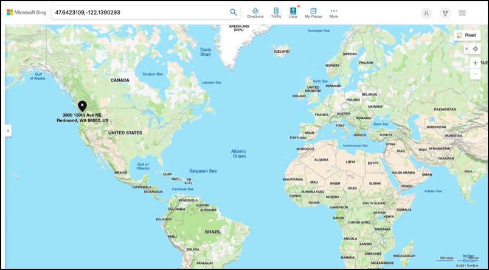

<!--
CO_OP_TRANSLATOR_METADATA:
{
  "original_hash": "52ed2bd997d08040f79a1a6ef2bac958",
  "translation_date": "2025-08-27T21:19:43+00:00",
  "source_file": "3-transport/lessons/1-location-tracking/README.md",
  "language_code": "da"
}
-->
# Sporing af placering

> Sketchnote af [Nitya Narasimhan](https://github.com/nitya). Klik på billedet for en større version.

## Quiz før lektionen

[Quiz før lektionen](https://black-meadow-040d15503.1.azurestaticapps.net/quiz/21)

## Introduktion

Hovedprocessen for at få mad fra en landmand til en forbruger indebærer at læsse kasser med produkter på lastbiler, skibe, fly eller andre kommercielle transportmidler og levere maden et sted - enten direkte til en kunde eller til et centralt knudepunkt eller lager til videre behandling. Hele processen fra landmand til forbruger er en del af en proces kaldet *forsyningskæden*. Videoen nedenfor fra Arizona State University's W. P. Carey School of Business forklarer idéen om forsyningskæden og hvordan den administreres i mere detaljeret grad.

> 🎥 Klik på billedet ovenfor for at se videoen

Tilføjelse af IoT-enheder kan drastisk forbedre din forsyningskæde, hvilket giver dig mulighed for at administrere, hvor varer befinder sig, planlægge transport og varehåndtering bedre og reagere hurtigere på problemer.

Når man administrerer en flåde af køretøjer som lastbiler, er det nyttigt at vide, hvor hvert køretøj befinder sig på et givet tidspunkt. Køretøjer kan udstyres med GPS-sensorer, der sender deres placering til IoT-systemer, hvilket giver ejerne mulighed for at finde deres placering, se den rute, de har taget, og vide, hvornår de vil ankomme til deres destination. De fleste køretøjer opererer uden for WiFi-dækning, så de bruger mobilnetværk til at sende denne type data. Nogle gange er GPS-sensoren indbygget i mere komplekse IoT-enheder som elektroniske logbøger. Disse enheder sporer, hvor længe en lastbil har været i transit for at sikre, at chauffører overholder lokale love om arbejdstid.

I denne lektion vil du lære, hvordan du sporer et køretøjs placering ved hjælp af en Global Positioning System (GPS)-sensor.

I denne lektion dækker vi:

* [Forbundne køretøjer](../../../../../3-transport/lessons/1-location-tracking)
* [Geospatiale koordinater](../../../../../3-transport/lessons/1-location-tracking)
* [Global Positioning Systems (GPS)](../../../../../3-transport/lessons/1-location-tracking)
* [Læs GPS-sensordata](../../../../../3-transport/lessons/1-location-tracking)
* [NMEA GPS-data](../../../../../3-transport/lessons/1-location-tracking)
* [Dekod GPS-sensordata](../../../../../3-transport/lessons/1-location-tracking)

## Forbundne køretøjer

IoT ændrer måden, varer transporteres på, ved at skabe flåder af *forbundne køretøjer*. Disse køretøjer er forbundet til centrale IT-systemer, der rapporterer information om deres placering og andre sensordata. At have en flåde af forbundne køretøjer har en bred vifte af fordele:

* Sporing af placering - du kan finde ud af, hvor et køretøj befinder sig på ethvert tidspunkt, hvilket giver dig mulighed for at:

  * Modtage advarsler, når et køretøj er ved at ankomme til en destination, så et team kan forberede sig på aflæsning
  * Lokalisere stjålne køretøjer
  * Kombinere placering og rutedata med trafikproblemer for at give mulighed for at omdirigere køretøjer midt på rejsen
  * Overholde skat. Nogle lande opkræver køretøjer for den mængde kilometer, der køres på offentlige veje (såsom [New Zealands RUC](https://www.nzta.govt.nz/vehicles/licensing-rego/road-user-charges/)), så det er lettere at beregne skyldig skat, når man ved, hvornår et køretøj er på offentlige veje kontra private veje.
  * Vide, hvor man skal sende vedligeholdelsesteams i tilfælde af nedbrud

* Chaufførtelemetri - sikre, at chauffører overholder hastighedsgrænser, tager sving med passende hastighed, bremser tidligt og effektivt og kører sikkert. Forbundne køretøjer kan også have kameraer til at optage hændelser. Dette kan kobles til forsikring, hvilket giver lavere satser for gode chauffører.

* Overholdelse af chaufførens arbejdstimer - sikre, at chauffører kun kører inden for deres lovligt tilladte timer baseret på de tidspunkter, de tænder og slukker motoren.

Disse fordele kan kombineres - for eksempel ved at kombinere overholdelse af chaufførens arbejdstimer med sporing af placering for at omdirigere chauffører, hvis de ikke kan nå deres destination inden for deres tilladte køretimer. Disse kan også kombineres med anden køretøjsspecifik telemetri, såsom temperaturdata fra temperaturkontrollerede lastbiler, hvilket gør det muligt at omdirigere køretøjer, hvis deres nuværende rute betyder, at varer ikke kan holdes ved den rette temperatur.

> 🎓 Logistik er processen med at transportere varer fra et sted til et andet, såsom fra en gård til et supermarked via et eller flere lagre. En landmand pakker kasser med tomater, der læsses på en lastbil, leveres til et centralt lager og læsses på en anden lastbil, der kan indeholde en blanding af forskellige typer produkter, som derefter leveres til et supermarked.

Den centrale komponent i køretøjssporing er GPS - sensorer, der kan finde deres placering hvor som helst på Jorden. I denne lektion vil du lære, hvordan du bruger en GPS-sensor, begyndende med at lære, hvordan man definerer en placering på Jorden.

## Geospatiale koordinater

Geospatiale koordinater bruges til at definere punkter på Jordens overflade, på samme måde som koordinater kan bruges til at tegne en pixel på en computerskærm eller placere sting i korssting. For et enkelt punkt har du et par koordinater. For eksempel ligger Microsoft Campus i Redmond, Washington, USA på 47.6423109, -122.1390293.

### Breddegrad og længdegrad

Jorden er en kugle - en tredimensionel cirkel. På grund af dette defineres punkter ved at opdele den i 360 grader, det samme som geometrien af cirkler. Breddegrad måler antallet af grader nord til syd, længdegrad måler antallet af grader øst til vest.

> 💁 Ingen ved helt præcist, hvorfor cirkler oprindeligt blev opdelt i 360 grader. [Wikipedia-siden om grader (vinkel)](https://wikipedia.org/wiki/Degree_(angle)) dækker nogle af de mulige årsager.

Breddegrad måles ved hjælp af linjer, der cirkler Jorden og løber parallelt med ækvator, og opdeler den nordlige og sydlige halvkugle i hver 90°. Ækvator er ved 0°, Nordpolen er ved 90°, også kendt som 90° Nord, og Sydpolen er ved -90°, eller 90° Syd.

Længdegrad måles som antallet af grader målt øst og vest. 0°-udgangspunktet for længdegrad kaldes *Prime Meridian* og blev i 1884 defineret som en linje fra Nordpolen til Sydpolen, der går gennem [British Royal Observatory i Greenwich, England](https://wikipedia.org/wiki/Royal_Observatory,_Greenwich).

> 🎓 En meridian er en imaginær lige linje, der går fra Nordpolen til Sydpolen og danner en halvcirkel.

For at måle længdegraden af et punkt måler du antallet af grader rundt om ækvator fra Prime Meridian til en meridian, der passerer gennem det punkt. Længdegrad går fra -180°, eller 180° Vest, gennem 0° ved Prime Meridian, til 180°, eller 180° Øst. 180° og -180° refererer til det samme punkt, antimeridianen eller den 180. meridian. Dette er en meridian på den modsatte side af Jorden fra Prime Meridian.

> 💁 Antimeridianen må ikke forveksles med den internationale datolinje, som ligger omtrent samme sted, men ikke er en lige linje og varierer for at passe til geo-politiske grænser.

✅ Lav lidt research: Prøv at finde bredde- og længdegraden for din nuværende placering.

### Grader, minutter og sekunder vs decimale grader

Traditionelt blev målinger af grader af bredde- og længdegrad udført ved hjælp af sexagesimal nummerering, eller base-60, et nummereringssystem brugt af de gamle babylonere, der foretog de første målinger og registreringer af tid og afstand. Du bruger sexagesimal hver dag, sandsynligvis uden at være klar over det - ved at opdele timer i 60 minutter og minutter i 60 sekunder.

Længde- og breddegrad måles i grader, minutter og sekunder, hvor et minut er 1/60 af en grad, og 1 sekund er 1/60 minut.

For eksempel ved ækvator:

* 1° breddegrad er **111,3 kilometer**
* 1 minut breddegrad er 111,3/60 = **1,855 kilometer**
* 1 sekund breddegrad er 1,855/60 = **0,031 kilometer**

Symbolet for et minut er en enkelt apostrof, for et sekund er det en dobbelt apostrof. 2 grader, 17 minutter og 43 sekunder ville for eksempel blive skrevet som 2°17'43". Dele af sekunder gives som decimaler, for eksempel er en halv sekund 0°0'0.5".

Computere arbejder ikke i base-60, så disse koordinater gives som decimale grader, når GPS-data bruges i de fleste computersystemer. For eksempel er 2°17'43" 2.295277. Gradsymbolet udelades normalt.

Koordinater for et punkt gives altid som `breddegrad, længdegrad`, så eksemplet tidligere med Microsoft Campus på 47.6423109,-122.117198 har:

* En breddegrad på 47.6423109 (47.6423109 grader nord for ækvator)
* En længdegrad på -122.1390293 (122.1390293 grader vest for Prime Meridian).

## Global Positioning Systems (GPS)

GPS-systemer bruger flere satellitter, der kredser om Jorden, til at finde din position. Du har sandsynligvis brugt GPS-systemer uden at vide det - til at finde din placering på en kortapp på din telefon som Apple Maps eller Google Maps, eller til at se, hvor din transport er i en app som Uber eller Lyft, eller når du bruger satellitnavigation (sat-nav) i din bil.

> 🎓 Satellitterne i 'satellitnavigation' er GPS-satellitter!

GPS-systemer fungerer ved at have et antal satellitter, der sender et signal med hver satellits aktuelle position og en præcis tidsstempel. Disse signaler sendes via radiobølger og opfanges af en antenne i GPS-sensoren. En GPS-sensor vil opfange disse signaler og ved hjælp af den aktuelle tid måle, hvor lang tid det tog for signalet at nå sensoren fra satellitten. Da hastigheden af radiobølger er konstant, kan GPS-sensoren bruge tidsstemplet, der blev sendt, til at beregne, hvor langt sensoren er fra satellitten. Ved at kombinere data fra mindst 3 satellitter med de sendte positioner kan GPS-sensoren finde sin placering på Jorden.

> 💁 GPS-sensorer har brug for antenner for at opfange radiobølger. Antennerne, der er indbygget i lastbiler og biler med indbygget GPS, er placeret for at få et godt signal, normalt på forruden eller taget. Hvis du bruger et separat GPS-system, såsom en smartphone eller en IoT-enhed, skal du sikre dig, at antennen, der er indbygget i GPS-systemet eller telefonen, har frit udsyn til himlen, såsom at være monteret på din forrude.

GPS-satellitter kredser om Jorden, ikke på et fast punkt over sensoren, så placeringsdata inkluderer højde over havets overflade samt bredde- og længdegrad.

GPS havde tidligere begrænsninger på nøjagtighed, som blev håndhævet af det amerikanske militær, hvilket begrænsede nøjagtigheden til omkring 5 meter. Denne begrænsning blev fjernet i 2000, hvilket tillod en nøjagtighed på 30 centimeter. Det er dog ikke altid muligt at opnå denne nøjagtighed på grund af interferens med signalerne.

✅ Hvis du har en smartphone, start kortappen og se, hvor præcis din placering er. Det kan tage lidt tid for din telefon at opfange signaler fra flere satellitter for at få en mere præcis placering.
💁 Satellitterne indeholder atomure, der er utroligt præcise, men de afviger med 38 mikrosekunder (0,0000038 sekunder) om dagen sammenlignet med atomure på Jorden. Dette skyldes, at tiden går langsommere, når hastigheden øges, som forudsagt af Einsteins teorier om speciel og generel relativitet - satellitterne bevæger sig hurtigere end Jordens rotation. Denne afvigelse er blevet brugt til at bevise forudsigelserne i speciel og generel relativitet og skal justeres i designet af GPS-systemer. Bogstaveligt talt går tiden langsommere på en GPS-satellit.
GPS-systemer er blevet udviklet og implementeret af en række lande og politiske unioner, herunder USA, Rusland, Japan, Indien, EU og Kina. Moderne GPS-sensorer kan forbinde til de fleste af disse systemer for at opnå hurtigere og mere præcise positioner.

> 🎓 Grupperne af satellitter i hver implementering kaldes konstellationer.

## Læs GPS-sensordata

De fleste GPS-sensorer sender GPS-data via UART.

> ⚠️ UART blev gennemgået i [projekt 2, lektion 2](../../../2-farm/lessons/2-detect-soil-moisture/README.md#universal-asynchronous-receiver-transmitter-uart). Gå tilbage til den lektion, hvis det er nødvendigt.

Du kan bruge en GPS-sensor på din IoT-enhed til at hente GPS-data.

### Opgave - tilslut en GPS-sensor og læs GPS-data

Følg den relevante vejledning for at læse GPS-data med din IoT-enhed:

* [Arduino - Wio Terminal](wio-terminal-gps-sensor.md)
* [Single-board computer - Raspberry Pi](pi-gps-sensor.md)
* [Single-board computer - Virtuel enhed](virtual-device-gps-sensor.md)

## NMEA GPS-data

Når du kørte din kode, så du måske noget, der lignede volapyk i outputtet. Dette er faktisk standard GPS-data, og det har alt sammen en betydning.

GPS-sensorer udsender data ved hjælp af NMEA-beskeder, som følger NMEA 0183-standarden. NMEA er en forkortelse for [National Marine Electronics Association](https://www.nmea.org), en amerikansk handelsorganisation, der fastsætter standarder for kommunikation mellem marinelektronik.

> 💁 Denne standard er proprietær og koster mindst 2.000 USD, men der er nok information i det offentlige domæne til, at det meste af standarden er blevet reverse-engineered og kan bruges i open source og anden ikke-kommerciel kode.

Disse beskeder er tekstbaserede. Hver besked består af en *sætning*, der starter med et `$`-tegn, efterfulgt af 2 tegn, der angiver kilden til beskeden (f.eks. GP for det amerikanske GPS-system, GN for GLONASS, det russiske GPS-system), og 3 tegn, der angiver typen af besked. Resten af beskeden er felter adskilt af kommaer, der slutter med et linjeskift.

Nogle af de typer beskeder, der kan modtages, er:

| Type | Beskrivelse |
| ---- | ----------- |
| GGA | GPS Fix Data, inklusive breddegrad, længdegrad og højde for GPS-sensoren samt antallet af satellitter i sigte for at beregne denne position. |
| ZDA | Den aktuelle dato og tid, inklusive den lokale tidszone |
| GSV | Detaljer om satellitter i sigte - defineret som de satellitter, GPS-sensoren kan opfange signaler fra |

> 💁 GPS-data inkluderer tidsstempler, så din IoT-enhed kan hente tiden fra en GPS-sensor, hvis det er nødvendigt, i stedet for at stole på en NTP-server eller en intern realtidsur.

GGA-beskeden inkluderer den aktuelle position i formatet `(dd)dmm.mmmm`, sammen med et enkelt tegn, der angiver retning. `d` i formatet er grader, `m` er minutter, og sekunder er angivet som decimaler af minutter. For eksempel ville 2°17'43" være 217.716666667 - 2 grader, 17.716666667 minutter.

Retningstegnet kan være `N` eller `S` for breddegrad for at angive nord eller syd, og `E` eller `W` for længdegrad for at angive øst eller vest. For eksempel ville en breddegrad på 2°17'43" have et retningstegn `N`, mens -2°17'43" ville have et retningstegn `S`.

For eksempel - NMEA-sætningen `$GNGGA,020604.001,4738.538654,N,12208.341758,W,1,3,,164.7,M,-17.1,M,,*67`

* Breddegradsdelen er `4738.538654,N`, som konverteres til 47.6423109 i decimalgrader. `4738.538654` er 47.6423109, og retningen er `N` (nord), så det er en positiv breddegrad.

* Længdegradsdelen er `12208.341758,W`, som konverteres til -122.1390293 i decimalgrader. `12208.341758` er 122.1390293°, og retningen er `W` (vest), så det er en negativ længdegrad.

## Dekod GPS-sensordata

I stedet for at bruge de rå NMEA-data er det bedre at dekode dem til et mere brugbart format. Der findes flere open source-biblioteker, du kan bruge til at hjælpe med at udtrække nyttige data fra de rå NMEA-beskeder.

### Opgave - dekod GPS-sensordata

Følg den relevante vejledning for at dekode GPS-sensordata med din IoT-enhed:

* [Arduino - Wio Terminal](wio-terminal-gps-decode.md)
* [Single-board computer - Raspberry Pi/Virtuel IoT-enhed](single-board-computer-gps-decode.md)

---

## 🚀 Udfordring

Skriv din egen NMEA-dekoder! I stedet for at stole på tredjepartsbiblioteker til at dekode NMEA-sætninger, kan du prøve at skrive din egen dekoder til at udtrække breddegrad og længdegrad fra NMEA-sætninger.

## Quiz efter lektionen

[Quiz efter lektionen](https://black-meadow-040d15503.1.azurestaticapps.net/quiz/22)

## Gennemgang & Selvstudie

* Læs mere om geospatiale koordinater på [Geografisk koordinatsystem-siden på Wikipedia](https://wikipedia.org/wiki/Geographic_coordinate_system).
* Læs om nulmeridianer på andre himmellegemer end Jorden på [Nulmeridian-siden på Wikipedia](https://wikipedia.org/wiki/Prime_meridian#Prime_meridian_on_other_planetary_bodies).
* Undersøg de forskellige GPS-systemer fra forskellige regeringer og politiske unioner som EU, Japan, Rusland, Indien og USA.

## Opgave

[Undersøg andre GPS-data](assignment.md)

---

**Ansvarsfraskrivelse**:  
Dette dokument er blevet oversat ved hjælp af AI-oversættelsestjenesten [Co-op Translator](https://github.com/Azure/co-op-translator). Selvom vi bestræber os på nøjagtighed, skal du være opmærksom på, at automatiserede oversættelser kan indeholde fejl eller unøjagtigheder. Det originale dokument på dets oprindelige sprog bør betragtes som den autoritative kilde. For kritisk information anbefales professionel menneskelig oversættelse. Vi er ikke ansvarlige for eventuelle misforståelser eller fejltolkninger, der måtte opstå som følge af brugen af denne oversættelse.