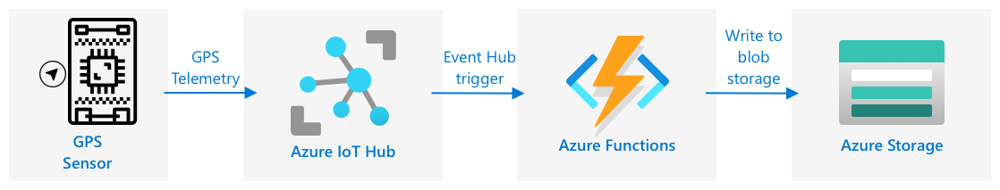

<!--
CO_OP_TRANSLATOR_METADATA:
{
  "original_hash": "e345843ccfeb7261d81500d19c64d476",
  "translation_date": "2025-08-27T21:37:27+00:00",
  "source_file": "3-transport/lessons/2-store-location-data/README.md",
  "language_code": "da"
}
-->
# Gem lokationsdata


> Sketchnote af [Nitya Narasimhan](https://github.com/nitya). Klik på billedet for en større version.

## Quiz før lektionen

[Quiz før lektionen](https://black-meadow-040d15503.1.azurestaticapps.net/quiz/23)

## Introduktion

I den sidste lektion lærte du, hvordan man bruger en GPS-sensor til at indfange lokationsdata. For at bruge disse data til at visualisere placeringen af en lastbil fyldt med mad og dens rejse, skal dataene sendes til en IoT-tjeneste i skyen og derefter gemmes et sted.

I denne lektion vil du lære om de forskellige måder at gemme IoT-data på og lære, hvordan man gemmer data fra din IoT-tjeneste ved hjælp af serverløs kode.

I denne lektion dækker vi:

* [Strukturerede og ustrukturerede data](../../../../../3-transport/lessons/2-store-location-data)
* [Send GPS-data til en IoT Hub](../../../../../3-transport/lessons/2-store-location-data)
* [Hot, warm og cold paths](../../../../../3-transport/lessons/2-store-location-data)
* [Håndter GPS-hændelser med serverløs kode](../../../../../3-transport/lessons/2-store-location-data)
* [Azure Storage Accounts](../../../../../3-transport/lessons/2-store-location-data)
* [Forbind din serverløse kode til lager](../../../../../3-transport/lessons/2-store-location-data)

## Strukturerede og ustrukturerede data

Computersystemer arbejder med data, og disse data kommer i mange forskellige former og størrelser. De kan variere fra enkelte tal til store mængder tekst, videoer og billeder samt IoT-data. Data kan normalt opdeles i en af to kategorier - *strukturerede* data og *ustrukturerede* data.

* **Strukturerede data** er data med en veldefineret, fast struktur, der ikke ændrer sig og som normalt kan mappes til tabeller med relationer. Et eksempel er en persons oplysninger, herunder deres navn, fødselsdato og adresse.

* **Ustrukturerede data** er data uden en veldefineret, fast struktur, herunder data, der ofte kan ændre struktur. Et eksempel er dokumenter som skrevne tekster eller regneark.

✅ Lav lidt research: Kan du komme i tanke om andre eksempler på strukturerede og ustrukturerede data?

> 💁 Der findes også semi-strukturerede data, som er strukturerede, men som ikke passer ind i faste datatabeller.

IoT-data betragtes normalt som ustrukturerede data.

Forestil dig, at du tilføjede IoT-enheder til en flåde af køretøjer for en stor kommerciel gård. Du vil måske bruge forskellige enheder til forskellige typer køretøjer. For eksempel:

* For landbrugskøretøjer som traktorer ønsker du GPS-data for at sikre, at de arbejder på de rigtige marker.
* For leveringslastbiler, der transporterer mad til lagre, ønsker du GPS-data samt hastigheds- og accelerationsdata for at sikre, at chaufføren kører sikkert, samt føreridentitet og start/stop-data for at sikre overholdelse af lokale arbejdstidslove.
* For kølebiler ønsker du også temperaturdata for at sikre, at maden ikke bliver for varm eller kold og dermed ødelægges under transport.

Disse data kan ændre sig konstant. For eksempel, hvis IoT-enheden er i en lastbilskabine, kan de data, den sender, ændre sig, når traileren skiftes, for eksempel kun at sende temperaturdata, når en køletrailer bruges.

✅ Hvilke andre IoT-data kunne indfanges? Tænk på de typer last, som lastbiler kan transportere, samt vedligeholdelsesdata.

Disse data varierer fra køretøj til køretøj, men de sendes alle til den samme IoT-tjeneste til behandling. IoT-tjenesten skal kunne behandle disse ustrukturerede data og gemme dem på en måde, der gør det muligt at søge eller analysere dem, men som også fungerer med forskellige strukturer af disse data.

### SQL vs NoSQL-lagring

Databaser er tjenester, der giver dig mulighed for at gemme og forespørge data. Databaser findes i to typer - SQL og NoSQL.

#### SQL-databaser

De første databaser var Relationelle Database Management Systemer (RDBMS), eller relationelle databaser. Disse er også kendt som SQL-databaser efter Structured Query Language (SQL), der bruges til at interagere med dem for at tilføje, fjerne, opdatere eller forespørge data. Disse databaser består af et skema - et veldefineret sæt tabeller, der minder om et regneark. Hver tabel har flere navngivne kolonner. Når du indsætter data, tilføjer du en række til tabellen og placerer værdier i hver af kolonnerne. Dette holder dataene i en meget fast struktur - selvom du kan lade kolonner stå tomme, skal du tilføje en ny kolonne til databasen og udfylde værdier for de eksisterende rækker, hvis du vil tilføje en ny kolonne. Disse databaser er relationelle - en tabel kan have en relation til en anden.


For eksempel, hvis du gemte en brugers personlige oplysninger i en tabel, ville du have en slags intern unik ID pr. bruger, der bruges i en række i en tabel, der indeholder brugerens navn og adresse. Hvis du derefter ville gemme andre detaljer om den bruger, såsom deres køb, i en anden tabel, ville du have en kolonne i den nye tabel for den brugers ID. Når du slår en bruger op, kan du bruge deres ID til at få deres personlige oplysninger fra én tabel og deres køb fra en anden.

SQL-databaser er ideelle til at gemme strukturerede data og til, når du vil sikre, at dataene matcher dit skema.

✅ Hvis du ikke har brugt SQL før, så tag et øjeblik til at læse om det på [SQL-siden på Wikipedia](https://wikipedia.org/wiki/SQL).

Nogle kendte SQL-databaser er Microsoft SQL Server, MySQL og PostgreSQL.

✅ Lav lidt research: Læs om nogle af disse SQL-databaser og deres funktioner.

#### NoSQL-databaser

NoSQL-databaser kaldes NoSQL, fordi de ikke har den samme faste struktur som SQL-databaser. De er også kendt som dokumentdatabaser, da de kan gemme ustrukturerede data som dokumenter.

> 💁 På trods af deres navn tillader nogle NoSQL-databaser, at du bruger SQL til at forespørge data.


NoSQL-databaser har ikke et foruddefineret skema, der begrænser, hvordan data gemmes. I stedet kan du indsætte enhver form for ustrukturerede data, normalt ved hjælp af JSON-dokumenter. Disse dokumenter kan organiseres i mapper, ligesom filer på din computer. Hvert dokument kan have forskellige felter fra andre dokumenter - for eksempel, hvis du gemte IoT-data fra dine landbrugskøretøjer, kunne nogle have felter for accelerometer- og hastighedsdata, mens andre kunne have felter for temperaturen i traileren. Hvis du tilføjede en ny lastbiltype, såsom en med indbyggede vægte til at spore vægten af den transporterede last, kunne din IoT-enhed tilføje dette nye felt, og det kunne gemmes uden ændringer i databasen.

Nogle kendte NoSQL-databaser inkluderer Azure CosmosDB, MongoDB og CouchDB.

✅ Lav lidt research: Læs om nogle af disse NoSQL-databaser og deres funktioner.

I denne lektion vil du bruge NoSQL-lagring til at gemme IoT-data.

## Send GPS-data til en IoT Hub

I den sidste lektion indfangede du GPS-data fra en GPS-sensor, der var forbundet til din IoT-enhed. For at gemme disse IoT-data i skyen skal du sende dem til en IoT-tjeneste. Igen vil du bruge Azure IoT Hub, den samme IoT-skytjeneste, som du brugte i det forrige projekt.


### Opgave - send GPS-data til en IoT Hub

1. Opret en ny IoT Hub ved hjælp af den gratis version.

    > ⚠️ Du kan henvise til [instruktionerne for at oprette en IoT Hub fra projekt 2, lektion 4](../../../2-farm/lessons/4-migrate-your-plant-to-the-cloud/README.md#create-an-iot-service-in-the-cloud), hvis det er nødvendigt.

    Husk at oprette en ny Ressourcegruppe. Navngiv den nye Ressourcegruppe `gps-sensor`, og giv den nye IoT Hub et unikt navn baseret på `gps-sensor`, såsom `gps-sensor-<dit navn>`.

    > 💁 Hvis du stadig har din IoT Hub fra det forrige projekt, kan du genbruge den. Husk at bruge navnet på denne IoT Hub og Ressourcegruppen, den er i, når du opretter andre tjenester.

1. Tilføj en ny enhed til IoT Hub. Kald denne enhed `gps-sensor`. Tag forbindelsesstrengen for enheden.

1. Opdater din enhedskode til at sende GPS-dataene til den nye IoT Hub ved hjælp af forbindelsesstrengen fra det forrige trin.

    > ⚠️ Du kan henvise til [instruktionerne for at forbinde din enhed til en IoT-tjeneste fra projekt 2, lektion 4](../../../2-farm/lessons/4-migrate-your-plant-to-the-cloud/README.md#connect-your-device-to-the-iot-service), hvis det er nødvendigt.

1. Når du sender GPS-dataene, skal du gøre det som JSON i følgende format:

    ```json
    {
        "gps" :
        {
            "lat" : <latitude>,
            "lon" : <longitude>
        }
    }
    ```

1. Send GPS-data hvert minut, så du ikke bruger din daglige meddelelsesallokering.

Hvis du bruger Wio Terminal, skal du huske at tilføje alle nødvendige biblioteker og indstille tiden ved hjælp af en NTP-server. Din kode skal også sikre, at den har læst alle data fra den serielle port, før den sender GPS-positionen, ved at bruge den eksisterende kode fra den sidste lektion. Brug følgende kode til at konstruere JSON-dokumentet:

```cpp
DynamicJsonDocument doc(1024);
doc["gps"]["lat"] = gps.location.lat();
doc["gps"]["lon"] = gps.location.lng();
```

Hvis du bruger en Virtuel IoT-enhed, skal du huske at installere alle nødvendige biblioteker ved hjælp af et virtuelt miljø.

For både Raspberry Pi og Virtuel IoT-enhed skal du bruge den eksisterende kode fra den sidste lektion til at få bredde- og længdegradsdataene og derefter sende dem i det korrekte JSON-format med følgende kode:

```python
message_json = { "gps" : { "lat":lat, "lon":lon } }
print("Sending telemetry", message_json)
message = Message(json.dumps(message_json))
```

> 💁 Du kan finde denne kode i [code/wio-terminal](../../../../../3-transport/lessons/2-store-location-data/code/wio-terminal), [code/pi](../../../../../3-transport/lessons/2-store-location-data/code/pi) eller [code/virtual-device](../../../../../3-transport/lessons/2-store-location-data/code/virtual-device)-mappen.

Kør din enhedskode, og sørg for, at meddelelser flyder ind i IoT Hub ved hjælp af `az iot hub monitor-events` CLI-kommandoen.

## Hot, warm og cold paths

Data, der flyder fra en IoT-enhed til skyen, behandles ikke altid i realtid. Nogle data skal behandles i realtid, andre kan behandles kort tid senere, og andre kan behandles meget senere. Flowet af data til forskellige tjenester, der behandler dataene på forskellige tidspunkter, kaldes hot, warm og cold paths.

### Hot path

Hot path refererer til data, der skal behandles i realtid eller næsten realtid. Du ville bruge hot path-data til alarmer, såsom at få besked om, at et køretøj nærmer sig et depot, eller at temperaturen i en kølebil er for høj.

For at bruge hot path-data ville din kode reagere på hændelser, så snart de modtages af dine skytjenester.

### Warm path

Warm path refererer til data, der kan behandles kort tid efter modtagelse, for eksempel til rapportering eller kortsigtet analyse. Du ville bruge warm path-data til daglige rapporter om køretøjers kilometertal ved hjælp af data indsamlet dagen før.

Warm path-data gemmes, så snart de modtages af skytjenesten, i en form for lager, der hurtigt kan tilgås.

### Cold path

Cold path refererer til historiske data, der gemmes på lang sigt og kan behandles, når det er nødvendigt. For eksempel kunne du bruge cold path til at få årlige kilometerrapporter for køretøjer eller køre analyser på ruter for at finde den mest optimale rute for at reducere brændstofomkostninger.

Cold path-data gemmes i datalagre - databaser designet til at gemme store mængder data, der aldrig ændres, og som kan forespørges hurtigt og nemt. Du vil normalt have en regelmæssig opgave i din skyapplikation, der kører på et fast tidspunkt hver dag, uge eller måned for at flytte data fra warm path-lager til datalageret.

✅ Tænk over de data, du har indsamlet indtil videre i disse lektioner. Er det hot, warm eller cold path-data?

## Håndter GPS-hændelser med serverløs kode

Når data flyder ind i din IoT Hub, kan du skrive noget serverløs kode til at lytte efter hændelser, der offentliggøres til den Event-Hub-kompatible endpoint. Dette er warm path - disse data vil blive gemt og brugt i den næste lektion til rapportering om rejsen.


### Opgave - håndter GPS-hændelser med serverløs kode

1. Opret en Azure Functions-app ved hjælp af Azure Functions CLI. Brug Python-runtime, og opret den i en mappe kaldet `gps-trigger`, og brug det samme navn til Functions App-projektnavnet. Sørg for at oprette et virtuelt miljø til dette.
> ⚠️ Du kan henvise til [instruktionerne for at oprette et Azure Functions-projekt fra projekt 2, lektion 5](../../../2-farm/lessons/5-migrate-application-to-the-cloud/README.md#create-a-serverless-application), hvis det er nødvendigt.
1. Tilføj en IoT Hub-hændelsesudløser, der bruger IoT Hubs Event Hub-kompatible endpoint.

    > ⚠️ Du kan finde vejledningen til at oprette en IoT Hub-hændelsesudløser fra projekt 2, lektion 5 [her](../../../2-farm/lessons/5-migrate-application-to-the-cloud/README.md#create-an-iot-hub-event-trigger), hvis det er nødvendigt.

1. Angiv forbindelsesstrengen for Event Hub-kompatible endpoint i filen `local.settings.json`, og brug nøglen for denne post i filen `function.json`.

1. Brug Azurite-appen som en lokal lageremulator.

1. Kør din Functions-app for at sikre, at den modtager hændelser fra din GPS-enhed. Sørg for, at din IoT-enhed også kører og sender GPS-data.

    ```output
    Python EventHub trigger processed an event: {"gps": {"lat": 47.73481, "lon": -122.25701}}
    ```

## Azure Storage-konti


Azure Storage-konti er en alsidig lagringstjeneste, der kan gemme data på forskellige måder. Du kan gemme data som blobs, i køer, i tabeller eller som filer – og alt dette på samme tid.

### Blob-lagring

Ordet *Blob* betyder binære store objekter, men bruges som betegnelse for enhver ustruktureret data. Du kan gemme enhver form for data i blob-lagring, fra JSON-dokumenter med IoT-data til billed- og videofiler. Blob-lagring har konceptet *containers*, navngivne "spande", hvor du kan gemme data, svarende til tabeller i en relationsdatabase. Disse containere kan have en eller flere mapper til at gemme blobs, og hver mappe kan indeholde andre mapper, ligesom filer gemmes på din computers harddisk.

Du vil bruge blob-lagring i denne lektion til at gemme IoT-data.

✅ Undersøg: Læs om [Azure Blob Storage](https://docs.microsoft.com/azure/storage/blobs/storage-blobs-overview?WT.mc_id=academic-17441-jabenn)

### Tabel-lagring

Tabel-lagring giver dig mulighed for at gemme semi-struktureret data. Tabel-lagring er faktisk en NoSQL-database, så det kræver ikke et foruddefineret sæt tabeller, men det er designet til at gemme data i en eller flere tabeller med unikke nøgler til at definere hver række.

✅ Undersøg: Læs om [Azure Table Storage](https://docs.microsoft.com/azure/storage/tables/table-storage-overview?WT.mc_id=academic-17441-jabenn)

### Kø-lagring

Kø-lagring giver dig mulighed for at gemme beskeder på op til 64 KB i størrelse i en kø. Du kan tilføje beskeder til bagenden af køen og læse dem fra fronten. Køer gemmer beskeder på ubestemt tid, så længe der stadig er lagerplads, hvilket gør det muligt at gemme beskeder langvarigt og læse dem, når det er nødvendigt. For eksempel, hvis du ville køre en månedlig opgave for at behandle GPS-data, kunne du tilføje dem til en kø hver dag i en måned og derefter behandle alle beskederne i slutningen af måneden.

✅ Undersøg: Læs om [Azure Queue Storage](https://docs.microsoft.com/azure/storage/queues/storage-queues-introduction?WT.mc_id=academic-17441-jabenn)

### Fil-lagring

Fil-lagring er lagring af filer i skyen, og enhver app eller enhed kan oprette forbindelse ved hjælp af standardprotokoller. Du kan skrive filer til fil-lagring og derefter montere det som et drev på din PC eller Mac.

✅ Undersøg: Læs om [Azure File Storage](https://docs.microsoft.com/azure/storage/files/storage-files-introduction?WT.mc_id=academic-17441-jabenn)

## Forbind din serverløse kode til lagring

Din Functions-app skal nu forbindes til blob-lagring for at gemme beskederne fra IoT Hub. Der er to måder at gøre dette på:

* Inde i funktionskoden, forbind til blob-lagring ved hjælp af blob-lagringens Python SDK og skriv data som blobs.
* Brug en output-funktionsbinding til at binde returværdien af funktionen til blob-lagring og få blobben gemt automatisk.

I denne lektion vil du bruge Python SDK til at se, hvordan man interagerer med blob-lagring.



Dataene vil blive gemt som en JSON-blob med følgende format:

```json
{
    "device_id": <device_id>,
    "timestamp" : <time>,
    "gps" :
    {
        "lat" : <latitude>,
        "lon" : <longitude>
    }
}
```

### Opgave - forbind din serverløse kode til lagring

1. Opret en Azure Storage-konto. Navngiv den noget som `gps<dit navn>`.

    > ⚠️ Du kan finde vejledningen til at oprette en storage-konto fra projekt 2, lektion 5 [her](../../../2-farm/lessons/5-migrate-application-to-the-cloud/README.md#task---create-the-cloud-resources), hvis det er nødvendigt.

    Hvis du stadig har en storage-konto fra det tidligere projekt, kan du genbruge denne.

    > 💁 Du vil kunne bruge den samme storage-konto til at udrulle din Azure Functions-app senere i denne lektion.

1. Kør følgende kommando for at få forbindelsesstrengen til storage-kontoen:

    ```sh
    az storage account show-connection-string --output table \
                                              --name <storage_name>
    ```

    Erstat `<storage_name>` med navnet på den storage-konto, du oprettede i det foregående trin.

1. Tilføj en ny post til filen `local.settings.json` for din storage-kontos forbindelsesstreng, ved hjælp af værdien fra det foregående trin. Navngiv den `STORAGE_CONNECTION_STRING`.

1. Tilføj følgende til filen `requirements.txt` for at installere Azure storage Pip-pakkerne:

    ```sh
    azure-storage-blob
    ```

    Installer pakkerne fra denne fil i dit virtuelle miljø.

    > Hvis du får en fejl, så opgrader din Pip-version i dit virtuelle miljø til den nyeste version med følgende kommando, og prøv igen:
    >
    > ```sh
    > pip install --upgrade pip
    > ```

1. I filen `__init__.py` for `iot-hub-trigger`, tilføj følgende import-udsagn:

    ```python
    import json
    import os
    import uuid
    from azure.storage.blob import BlobServiceClient, PublicAccess
    ```

    Modulet `json` fra systemet vil blive brugt til at læse og skrive JSON, modulet `os` fra systemet vil blive brugt til at læse forbindelsesstrengen, og modulet `uuid` fra systemet vil blive brugt til at generere en unik ID for GPS-aflæsningen.

    Pakken `azure.storage.blob` indeholder Python SDK'et til at arbejde med blob-lagring.

1. Før metoden `main`, tilføj følgende hjælpefunktion:

    ```python
    def get_or_create_container(name):
        connection_str = os.environ['STORAGE_CONNECTION_STRING']
        blob_service_client = BlobServiceClient.from_connection_string(connection_str)
    
        for container in blob_service_client.list_containers():
            if container.name == name:
                return blob_service_client.get_container_client(container.name)
        
        return blob_service_client.create_container(name, public_access=PublicAccess.Container)
    ```

    Python blob SDK'et har ikke en hjælpemetode til at oprette en container, hvis den ikke eksisterer. Denne kode vil indlæse forbindelsesstrengen fra filen `local.settings.json` (eller Application Settings, når den er udrullet til skyen), og derefter oprette en `BlobServiceClient`-klasse fra denne for at interagere med blob-lagringskontoen. Den gennemgår derefter alle containere for blob-lagringskontoen og leder efter en med det angivne navn – hvis den finder en, returnerer den en `ContainerClient`-klasse, der kan interagere med containeren for at oprette blobs. Hvis den ikke finder en, oprettes containeren, og klienten for den nye container returneres.

    Når den nye container oprettes, gives offentlig adgang til at forespørge blobs i containeren. Dette vil blive brugt i den næste lektion til at visualisere GPS-data på et kort.

1. I modsætning til jordfugtighed ønsker vi med denne kode at gemme hver hændelse, så tilføj følgende kode inde i løkken `for event in events:` i funktionen `main`, under `logging`-udsagnet:

    ```python
    device_id = event.iothub_metadata['connection-device-id']
    blob_name = f'{device_id}/{str(uuid.uuid1())}.json'
    ```

    Denne kode henter enheds-ID'et fra hændelsesmetadataene og bruger det til at oprette et blob-navn. Blobs kan gemmes i mapper, og enheds-ID'et vil blive brugt som mappenavn, så hver enhed vil have alle sine GPS-hændelser i én mappe. Blob-navnet er denne mappe, efterfulgt af et dokumentnavn, adskilt med skråstreger, svarende til Linux- og macOS-stier (og Windows-stier, men Windows bruger baglæns skråstreger). Dokumentnavnet er en unik ID genereret ved hjælp af Python-modulet `uuid`, med filtypen `json`.

    For eksempel, for enheds-ID'et `gps-sensor`, kunne blob-navnet være `gps-sensor/a9487ac2-b9cf-11eb-b5cd-1e00621e3648.json`.

1. Tilføj følgende kode nedenunder:

    ```python
    container_client = get_or_create_container('gps-data')
    blob = container_client.get_blob_client(blob_name)
    ```

    Denne kode henter container-klienten ved hjælp af hjælpeklassen `get_or_create_container` og får derefter en blob-klientobjekt ved hjælp af blob-navnet. Disse blob-klienter kan referere til eksisterende blobs eller, som i dette tilfælde, til nye blobs.

1. Tilføj følgende kode efter dette:

    ```python
    event_body = json.loads(event.get_body().decode('utf-8'))
    blob_body = {
        'device_id' : device_id,
        'timestamp' : event.iothub_metadata['enqueuedtime'],
        'gps': event_body['gps']
    }
    ```

    Dette opbygger indholdet af blobben, der vil blive skrevet til blob-lagring. Det er et JSON-dokument, der indeholder enheds-ID'et, tidspunktet for hvornår telemetrien blev sendt til IoT Hub, og GPS-koordinaterne fra telemetrien.

    > 💁 Det er vigtigt at bruge beskedens enqueued-tid i stedet for det aktuelle tidspunkt for at få tidspunktet for, hvornår beskeden blev sendt. Den kunne sidde på hubben i et stykke tid, før den blev hentet, hvis Functions-appen ikke kører.

1. Tilføj følgende nedenunder denne kode:

    ```python
    logging.info(f'Writing blob to {blob_name} - {blob_body}')
    blob.upload_blob(json.dumps(blob_body).encode('utf-8'))
    ```

    Denne kode logger, at en blob er ved at blive skrevet med dens detaljer, og uploader derefter blob-indholdet som indholdet af den nye blob.

1. Kør Functions-appen. Du vil se blobs blive skrevet for alle GPS-hændelser i outputtet:

    ```output
    [2021-05-21T01:31:14.325Z] Python EventHub trigger processed an event: {"gps": {"lat": 47.73092, "lon": -122.26206}}
    ...
    [2021-05-21T01:31:14.351Z] Writing blob to gps-sensor/4b6089fe-ba8d-11eb-bc7b-1e00621e3648.json - {'device_id': 'gps-sensor', 'timestamp': '2021-05-21T00:57:53.878Z', 'gps': {'lat': 47.73092, 'lon': -122.26206}}
    ```

    > 💁 Sørg for, at du ikke kører IoT Hub-hændelsesmonitoren samtidig.

> 💁 Du kan finde denne kode i mappen [code/functions](../../../../../3-transport/lessons/2-store-location-data/code/functions).

### Opgave - verificer de uploadede blobs

1. For at se de blobs, der er oprettet, kan du enten bruge [Azure Storage Explorer](https://azure.microsoft.com/features/storage-explorer/?WT.mc_id=academic-17441-jabenn), et gratis værktøj, der giver dig mulighed for at se og administrere dine storage-konti, eller fra CLI.

    1. For at bruge CLI skal du først bruge en kontonøgle. Kør følgende kommando for at få denne nøgle:

        ```sh
        az storage account keys list --output table \
                                     --account-name <storage_name>
        ```

        Erstat `<storage_name>` med navnet på storage-kontoen.

        Kopier værdien af `key1`.

    1. Kør følgende kommando for at liste blobs i containeren:

        ```sh
        az storage blob list --container-name gps-data \
                             --output table \
                             --account-name <storage_name> \
                             --account-key <key1>
        ```

        Erstat `<storage_name>` med navnet på storage-kontoen, og `<key1>` med værdien af `key1`, du kopierede i det sidste trin.

        Dette vil liste alle blobs i containeren:

        ```output
        Name                                                  Blob Type    Blob Tier    Length    Content Type              Last Modified              Snapshot
        ----------------------------------------------------  -----------  -----------  --------  ------------------------  -------------------------  ----------
        gps-sensor/1810d55e-b9cf-11eb-9f5b-1e00621e3648.json  BlockBlob    Hot          45        application/octet-stream  2021-05-21T00:54:27+00:00
        gps-sensor/18293e46-b9cf-11eb-9f5b-1e00621e3648.json  BlockBlob    Hot          45        application/octet-stream  2021-05-21T00:54:28+00:00
        gps-sensor/1844549c-b9cf-11eb-9f5b-1e00621e3648.json  BlockBlob    Hot          45        application/octet-stream  2021-05-21T00:54:28+00:00
        gps-sensor/1894d714-b9cf-11eb-9f5b-1e00621e3648.json  BlockBlob    Hot          45        application/octet-stream  2021-05-21T00:54:28+00:00
        ```

    1. Download en af blobs ved hjælp af følgende kommando:

        ```sh
        az storage blob download --container-name gps-data \
                                 --account-name <storage_name> \
                                 --account-key <key1> \
                                 --name <blob_name> \
                                 --file <file_name>
        ```

        Erstat `<storage_name>` med navnet på storage-kontoen, og `<key1>` med værdien af `key1`, du kopierede i det tidligere trin.

        Erstat `<blob_name>` med det fulde navn fra kolonnen `Name` i outputtet fra det sidste trin, inklusive mappenavnet. Erstat `<file_name>` med navnet på en lokal fil for at gemme blobben til.

    Når den er downloadet, kan du åbne JSON-filen i VS Code, og du vil se blobben, der indeholder GPS-positionsdetaljer:

    ```json
    {"device_id": "gps-sensor", "timestamp": "2021-05-21T00:57:53.878Z", "gps": {"lat": 47.73092, "lon": -122.26206}}
    ```

### Opgave - udrul din Functions-app til skyen

Nu hvor din Functions-app fungerer, kan du udrulle den til skyen.

1. Opret en ny Azure Functions-app, ved hjælp af den storage-konto, du oprettede tidligere. Navngiv den noget som `gps-sensor-` og tilføj en unik identifikator i slutningen, som nogle tilfældige ord eller dit navn.

    > ⚠️ Du kan finde vejledningen til at oprette en Functions-app fra projekt 2, lektion 5 [her](../../../2-farm/lessons/5-migrate-application-to-the-cloud/README.md#task---create-the-cloud-resources), hvis det er nødvendigt.

1. Upload værdierne `IOT_HUB_CONNECTION_STRING` og `STORAGE_CONNECTION_STRING` til Application Settings.

    > ⚠️ Du kan finde vejledningen til at uploade Application Settings fra projekt 2, lektion 5 [her](../../../2-farm/lessons/5-migrate-application-to-the-cloud/README.md#task---upload-your-application-settings), hvis det er nødvendigt.

1. Udrul din lokale Functions-app til skyen.
> ⚠️ Du kan henvise til [instruktionerne for at implementere din Functions-app fra projekt 2, lektion 5](../../../2-farm/lessons/5-migrate-application-to-the-cloud/README.md#task---deploy-your-functions-app-to-the-cloud), hvis det er nødvendigt.
## 🚀 Udfordring

GPS-data er ikke altid helt præcise, og de registrerede positioner kan være forskudt med et par meter eller mere, især i tunneller og områder med høje bygninger.

Overvej, hvordan satellitnavigation kan overvinde dette? Hvilke data har din GPS-enhed, der kan hjælpe den med at lave bedre forudsigelser om din placering?

## Quiz efter forelæsning

[Quiz efter forelæsning](https://black-meadow-040d15503.1.azurestaticapps.net/quiz/24)

## Gennemgang & Selvstudie

* Læs om strukturerede data på [Data model-siden på Wikipedia](https://wikipedia.org/wiki/Data_model)
* Læs om semi-strukturerede data på [Semi-structured data-siden på Wikipedia](https://wikipedia.org/wiki/Semi-structured_data)
* Læs om ustrukturerede data på [Unstructured data-siden på Wikipedia](https://wikipedia.org/wiki/Unstructured_data)
* Læs mere om Azure Storage og de forskellige lagertyper i [Azure Storage-dokumentationen](https://docs.microsoft.com/azure/storage/?WT.mc_id=academic-17441-jabenn)

## Opgave

[Undersøg funktionsbindinger](assignment.md)

---

**Ansvarsfraskrivelse**:  
Dette dokument er blevet oversat ved hjælp af AI-oversættelsestjenesten [Co-op Translator](https://github.com/Azure/co-op-translator). Selvom vi bestræber os på nøjagtighed, skal du være opmærksom på, at automatiserede oversættelser kan indeholde fejl eller unøjagtigheder. Det originale dokument på dets oprindelige sprog bør betragtes som den autoritative kilde. For kritisk information anbefales professionel menneskelig oversættelse. Vi er ikke ansvarlige for eventuelle misforståelser eller fejltolkninger, der opstår som følge af brugen af denne oversættelse.