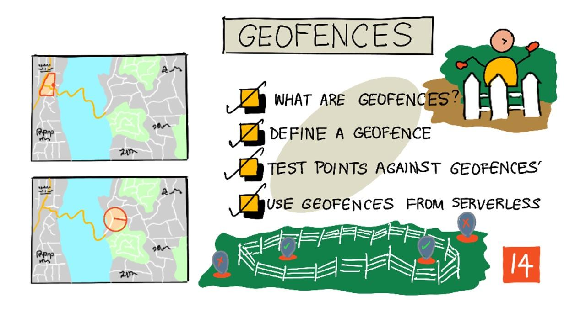

<!--
CO_OP_TRANSLATOR_METADATA:
{
  "original_hash": "078ae664c7b686bf069545e9a5fc95b2",
  "translation_date": "2025-08-27T21:29:33+00:00",
  "source_file": "3-transport/lessons/4-geofences/README.md",
  "language_code": "da"
}
-->
# Geofences



> Sketchnote af [Nitya Narasimhan](https://github.com/nitya). Klik på billedet for en større version.

Denne video giver en oversigt over geofences og hvordan man bruger dem i Azure Maps, emner der vil blive dækket i denne lektion:

[](https://www.youtube.com/watch?v=nsrgYhaYNVY)

> 🎥 Klik på billedet ovenfor for at se videoen

## Quiz før lektionen

[Quiz før lektionen](https://black-meadow-040d15503.1.azurestaticapps.net/quiz/27)

## Introduktion

I de sidste 3 lektioner har du brugt IoT til at lokalisere lastbiler, der transporterer dine varer fra din gård til et bearbejdningscenter. Du har indsamlet GPS-data, sendt dem til skyen for at gemme dem og visualiseret dem på et kort. Det næste skridt i at øge effektiviteten af din forsyningskæde er at få en advarsel, når en lastbil er ved at ankomme til bearbejdningscentret, så mandskabet, der skal losse, kan være klar med gaffeltrucks og andet udstyr, så snart køretøjet ankommer. På den måde kan de losse hurtigt, og du undgår at betale for en lastbil og chauffør, der venter.

I denne lektion vil du lære om geofences - definerede geospatiale områder, såsom et område inden for en 2 km køretid fra et bearbejdningscenter, og hvordan man tester, om GPS-koordinater er inden for eller uden for en geofence, så du kan se, om din GPS-sensor er ankommet til eller har forladt et område.

I denne lektion dækker vi:

* [Hvad er geofences](../../../../../3-transport/lessons/4-geofences)
* [Definér en geofence](../../../../../3-transport/lessons/4-geofences)
* [Test punkter mod en geofence](../../../../../3-transport/lessons/4-geofences)
* [Brug geofences fra serverløs kode](../../../../../3-transport/lessons/4-geofences)

> 🗑 Dette er den sidste lektion i dette projekt, så efter at have gennemført denne lektion og opgaven, skal du huske at rydde op i dine cloud-tjenester. Du skal bruge tjenesterne for at fuldføre opgaven, så sørg for at gøre det først.
>
> Se [guiden til at rydde op i dit projekt](../../../clean-up.md), hvis du har brug for instruktioner til, hvordan du gør dette.

## Hvad er Geofences

En geofence er en virtuel afgrænsning for et geografisk område i den virkelige verden. Geofences kan være cirkler defineret som et punkt og en radius (for eksempel en cirkel på 100 m omkring en bygning) eller en polygon, der dækker et område som en skolezone, bygrænser eller et universitets- eller kontorområde.


> 💁 Du har måske allerede brugt geofences uden at vide det. Hvis du har sat en påmindelse i iOS' påmindelsesapp eller Google Keep baseret på en placering, har du brugt en geofence. Disse apps opsætter en geofence baseret på den angivne placering og giver dig besked, når din telefon træder ind i geofencen.

Der er mange grunde til, at du gerne vil vide, om et køretøj er inden for eller uden for en geofence:

* Forberedelse til losning - at få en notifikation om, at et køretøj er ankommet, gør det muligt for et mandskab at være klar til at losse køretøjet, hvilket reducerer ventetiden. Dette kan gøre det muligt for en chauffør at levere flere gange om dagen med mindre ventetid.
* Skatteoverholdelse - nogle lande, som New Zealand, opkræver vejskat for dieselkøretøjer baseret på køretøjets vægt, når de kører på offentlige veje. Ved hjælp af geofences kan du spore den kørte afstand på offentlige veje i modsætning til private veje på steder som gårde eller skovområder.
* Tyveriovervågning - hvis et køretøj kun bør forblive i et bestemt område, som på en gård, og det forlader geofencen, kan det være blevet stjålet.
* Overholdelse af placering - nogle dele af en arbejdsplads, gård eller fabrik kan være forbudt for visse køretøjer, som at holde køretøjer, der transporterer kunstgødning og pesticider, væk fra marker med økologiske afgrøder. Hvis en geofence krydses, er køretøjet uden for overholdelse, og chaufføren kan blive underrettet.

✅ Kan du tænke på andre anvendelser for geofences?

Azure Maps, den tjeneste du brugte i den sidste lektion til at visualisere GPS-data, giver dig mulighed for at definere geofences og derefter teste, om et punkt er inden for eller uden for geofencen.

## Definér en geofence

Geofences defineres ved hjælp af GeoJSON, ligesom de punkter, der blev tilføjet til kortet i den forrige lektion. I dette tilfælde er det i stedet for en `FeatureCollection` af `Point`-værdier en `FeatureCollection`, der indeholder en `Polygon`.

```json
{
   "type": "FeatureCollection",
   "features": [
     {
       "type": "Feature",
       "geometry": {
         "type": "Polygon",
         "coordinates": [
           [
             [
               -122.13393688201903,
               47.63829579223815
             ],
             [
               -122.13389128446579,
               47.63782047131512
             ],
             [
               -122.13240802288054,
               47.63783312249837
             ],
             [
               -122.13238388299942,
               47.63829037035086
             ],
             [
               -122.13393688201903,
               47.63829579223815
             ]
           ]
         ]
       },
       "properties": {
         "geometryId": "1"
       }
     }
   ]
}
```

Hvert punkt på polygonen defineres som et længdegrad, breddegrad-par i et array, og disse punkter er i et array, der angives som `coordinates`. I en `Point` i den sidste lektion var `coordinates` et array, der indeholdt 2 værdier, breddegrad og længdegrad. For en `Polygon` er det et array af arrays, der indeholder 2 værdier, længdegrad og breddegrad.

> 💁 Husk, GeoJSON bruger `længdegrad, breddegrad` for punkter, ikke `breddegrad, længdegrad`.

Polygonens koordinat-array har altid 1 mere indgang end antallet af punkter på polygonen, hvor den sidste indgang er den samme som den første, hvilket lukker polygonen. For eksempel, for et rektangel ville der være 5 punkter.


I billedet ovenfor er der et rektangel. Polygonens koordinater starter øverst til venstre ved 47,-122, bevæger sig derefter til højre til 47,-121, derefter ned til 46,-121, derefter til venstre til 46,-122 og derefter tilbage til startpunktet ved 47,-122. Dette giver polygonen 5 punkter - øverst til venstre, øverst til højre, nederst til højre, nederst til venstre og derefter øverst til venstre for at lukke den.

✅ Prøv at oprette en GeoJSON-polygon omkring dit hjem eller din skole. Brug et værktøj som [GeoJSON.io](https://geojson.io/).

### Opgave - definér en geofence

For at bruge en geofence i Azure Maps skal den først uploades til din Azure Maps-konto. Når den er uploadet, får du et unikt ID, som du kan bruge til at teste et punkt mod geofencen. For at uploade geofences til Azure Maps skal du bruge maps web-API'en. Du kan kalde Azure Maps web-API'en ved hjælp af et værktøj som [curl](https://curl.se).

> 🎓 Curl er et kommandolinjeværktøj til at lave forespørgsler mod web-endpoints.

1. Hvis du bruger Linux, macOS eller en nyere version af Windows 10, har du sandsynligvis allerede curl installeret. Kør følgende fra din terminal eller kommandolinje for at tjekke:

    ```sh
    curl --version
    ```

    Hvis du ikke ser versionsoplysninger for curl, skal du installere det fra [curl downloads-siden](https://curl.se/download.html).

    > 💁 Hvis du er erfaren med Postman, kan du bruge det i stedet, hvis du foretrækker det.

1. Opret en GeoJSON-fil, der indeholder en polygon. Du vil teste dette ved hjælp af din GPS-sensor, så opret en polygon omkring din nuværende placering. Du kan enten oprette en manuelt ved at redigere GeoJSON-eksemplet givet ovenfor eller bruge et værktøj som [GeoJSON.io](https://geojson.io/).

    GeoJSON skal indeholde en `FeatureCollection`, der indeholder en `Feature` med en `geometry` af typen `Polygon`.

    Du **SKAL** også tilføje et `properties`-element på samme niveau som `geometry`-elementet, og dette skal indeholde en `geometryId`:

    ```json
    "properties": {
        "geometryId": "1"
    }
    ```

    Hvis du bruger [GeoJSON.io](https://geojson.io/), skal du manuelt tilføje dette element til det tomme `properties`-element, enten efter at have downloadet JSON-filen eller i JSON-editoren i appen.

    Denne `geometryId` skal være unik i denne fil. Du kan uploade flere geofences som flere `Features` i `FeatureCollection` i samme GeoJSON-fil, så længe hver har en forskellig `geometryId`. Polygons kan have samme `geometryId`, hvis de uploades fra en anden fil på et andet tidspunkt.

1. Gem denne fil som `geofence.json`, og naviger til, hvor den er gemt, i din terminal eller konsol.

1. Kør følgende curl-kommando for at oprette geofencen:

    ```sh
    curl --request POST 'https://atlas.microsoft.com/mapData/upload?api-version=1.0&dataFormat=geojson&subscription-key=<subscription_key>' \
         --header 'Content-Type: application/json' \
         --include \
         --data @geofence.json
    ```

    Erstat `<subscription_key>` i URL'en med API-nøglen til din Azure Maps-konto.

    URL'en bruges til at uploade kortdata via `https://atlas.microsoft.com/mapData/upload` API'en. Kaldet inkluderer en `api-version`-parameter for at specificere, hvilken Azure Maps API der skal bruges. Dette er for at tillade API'en at ændre sig over tid, men stadig opretholde bagudkompatibilitet. Dataformatet, der uploades, er sat til `geojson`.

    Dette vil køre POST-forespørgslen til upload-API'en og returnere en liste over svaroverskrifter, som inkluderer en overskrift kaldet `location`.

    ```output
    content-type: application/json
    location: https://us.atlas.microsoft.com/mapData/operations/1560ced6-3a80-46f2-84b2-5b1531820eab?api-version=1.0
    x-ms-azuremaps-region: West US 2
    x-content-type-options: nosniff
    strict-transport-security: max-age=31536000; includeSubDomains
    x-cache: CONFIG_NOCACHE
    date: Sat, 22 May 2021 21:34:57 GMT
    content-length: 0
    ```

    > 🎓 Når du kalder et web-endpoint, kan du sende parametre til kaldet ved at tilføje en `?` efterfulgt af nøgle-værdi-par som `key=value`, adskilt af en `&`.

1. Azure Maps behandler ikke dette med det samme, så du skal tjekke for at se, om upload-forespørgslen er færdig ved at bruge URL'en givet i `location`-overskriften. Lav en GET-forespørgsel til denne placering for at se status. Du skal tilføje din abonnementsnøgle til slutningen af `location`-URL'en ved at tilføje `&subscription-key=<subscription_key>` til slutningen, hvor `<subscription_key>` erstattes med API-nøglen til din Azure Maps-konto. Kør følgende kommando:

    ```sh
    curl --request GET '<location>&subscription-key=<subscription_key>'
    ```

    Erstat `<location>` med værdien af `location`-overskriften og `<subscription_key>` med API-nøglen til din Azure Maps-konto.

1. Tjek værdien af `status` i svaret. Hvis den ikke er `Succeeded`, så vent et minut og prøv igen.

1. Når status kommer tilbage som `Succeeded`, kig på `resourceLocation` fra svaret. Dette indeholder detaljer om det unikke ID (kendt som en UDID) for GeoJSON-objektet. UDID er værdien efter `metadata/` og ikke inklusive `api-version`. For eksempel, hvis `resourceLocation` var:

    ```json
    {
      "resourceLocation": "https://us.atlas.microsoft.com/mapData/metadata/7c3776eb-da87-4c52-ae83-caadf980323a?api-version=1.0"
    }
    ```

    Så ville UDID være `7c3776eb-da87-4c52-ae83-caadf980323a`.

    Gem en kopi af denne UDID, da du skal bruge den til at teste geofencen.

## Test punkter mod en geofence

Når polygonen er uploadet til Azure Maps, kan du teste et punkt for at se, om det er inden for eller uden for geofencen. Dette gør du ved at lave en web-API-forespørgsel, hvor du angiver geofencens UDID og punktets breddegrad og længdegrad.

Når du laver denne forespørgsel, kan du også angive en værdi kaldet `searchBuffer`. Dette fortæller Maps API'en, hvor præcis den skal være, når den returnerer resultater. Årsagen til dette er, at GPS ikke er perfekt præcis, og nogle gange kan placeringer være unøjagtige med flere meter eller mere. Standardværdien for søgebufferen er 50 m, men du kan angive værdier fra 0 m til 500 m.

Når resultater returneres fra API-kaldet, er en af delene i resultatet en `distance`, der måles til det nærmeste punkt på kanten af geofencen, med en positiv værdi, hvis punktet er uden for geofencen, og en negativ værdi, hvis det er inden for geofencen. Hvis denne afstand er mindre end søgebufferen, returneres den faktiske afstand i meter. Ellers er værdien 999 eller -999. 999 betyder, at punktet er uden for geofencen med mere end søgebufferen, -999 betyder, at det er inden for geofencen med mere end søgebufferen.


I billedet ovenfor har geofencen en 50 m søgebuffer.

* Et punkt i midten af geofencen, langt inden for søgebufferen, har en afstand på **-999**.
* Et punkt langt uden for søgebufferen har en afstand på **999**.
* Et punkt inden for geofencen og søgebufferen, 6 m fra geofencen, har en afstand på **6 m**.
* Et punkt uden for geofencen og inden for søgebufferen, 39 m fra geofencen, har en afstand på **39 m**.

Det er vigtigt at kende afstanden til kanten af geofencen og kombinere dette med andre oplysninger som andre GPS-aflæsninger, hastighed og vejdata, når man træffer beslutninger baseret på køretøjets placering.

For eksempel, forestil dig GPS-aflæsninger, der viser, at et køretøj kører langs en vej, der ender med at løbe tæt på en geofence. Hvis en enkelt GPS-værdi er unøjagtig og placerer køretøjet inden for geofencen, på trods af at der ikke er nogen adgangsvej, kan den ignoreres.


På billedet ovenfor er der en geofence over en del af Microsoft-campus. Den røde linje viser en lastbil, der kører langs 520, med cirkler, der viser GPS-aflæsningerne. De fleste af disse aflæsninger er præcise og følger 520, men én aflæsning er unøjagtig og befinder sig inden for geofencen. Denne aflæsning kan umuligt være korrekt – der er ingen veje, hvor lastbilen pludselig kan dreje fra 520 ind på campus og derefter tilbage på 520. Koden, der tjekker denne geofence, skal tage de tidligere aflæsninger i betragtning, før den handler på resultaterne af geofence-testen.

✅ Hvilke yderligere data ville du have brug for at tjekke for at afgøre, om en GPS-aflæsning kan betragtes som korrekt?

### Opgave - test punkter mod en geofence

1. Start med at opbygge URL'en til web-API-forespørgslen. Formatet er:

    ```output
    https://atlas.microsoft.com/spatial/geofence/json?api-version=1.0&deviceId=gps-sensor&subscription-key=<subscription-key>&udid=<UDID>&lat=<lat>&lon=<lon>
    ```

    Erstat `<subscription_key>` med API-nøglen til din Azure Maps-konto.

    Erstat `<UDID>` med UDID for geofencen fra den tidligere opgave.

    Erstat `<lat>` og `<lon>` med den bredde- og længdegrad, du vil teste.

    Denne URL bruger API'et `https://atlas.microsoft.com/spatial/geofence/json` til at forespørge en geofence defineret ved hjælp af GeoJSON. Den målretter API-versionen `1.0`. Parameteren `deviceId` er påkrævet og skal være navnet på den enhed, som bredde- og længdegraden stammer fra.

    Standard søgebufferen er 50 m, og du kan ændre dette ved at tilføje en ekstra parameter `searchBuffer=<distance>`, hvor `<distance>` angiver søgebufferens afstand i meter, fra 0 til 500.

1. Brug curl til at lave en GET-forespørgsel til denne URL:

    ```sh
    curl --request GET '<URL>'
    ```

    > 💁 Hvis du får en svarstatuskode `BadRequest` med en fejl:
    >
    > ```output
    > Invalid GeoJSON: All feature properties should contain a geometryId, which is used for identifying the geofence.
    > ```
    >
    > så mangler din GeoJSON sektionen `properties` med `geometryId`. Du skal rette din GeoJSON og derefter gentage ovenstående trin for at genindlæse og få en ny UDID.

1. Svaret vil indeholde en liste over `geometries`, én for hver polygon defineret i GeoJSON, der blev brugt til at oprette geofencen. Hver geometri har 3 interessante felter: `distance`, `nearestLat` og `nearestLon`.

    ```output
    {
        "geometries": [
            {
                "deviceId": "gps-sensor",
                "udId": "7c3776eb-da87-4c52-ae83-caadf980323a",
                "geometryId": "1",
                "distance": 999.0,
                "nearestLat": 47.645875,
                "nearestLon": -122.142713
            }
        ],
        "expiredGeofenceGeometryId": [],
        "invalidPeriodGeofenceGeometryId": []
    }
    ```

    * `nearestLat` og `nearestLon` er bredde- og længdegraden for et punkt på kanten af geofencen, der er tættest på det testede sted.

    * `distance` er afstanden fra det testede sted til det nærmeste punkt på kanten af geofencen. Negative tal betyder inden for geofencen, positive udenfor. Denne værdi vil være mindre end 50 (standard søgebuffer) eller 999.

1. Gentag dette flere gange med placeringer inden for og uden for geofencen.

## Brug geofences fra serverløs kode

Du kan nu tilføje en ny trigger til din Functions-app for at teste IoT Hub GPS-hændelsesdata mod geofencen.

### Forbrugergrupper

Som du måske husker fra tidligere lektioner, giver IoT Hub dig mulighed for at afspille hændelser, der er modtaget af hubben, men ikke behandlet. Men hvad sker der, hvis flere triggere er tilsluttet? Hvordan ved den, hvilke hændelser der er behandlet af hvilken?

Svaret er, at det kan den ikke! I stedet kan du definere flere separate forbindelser til at læse hændelser, og hver af dem kan administrere afspilningen af ulæste meddelelser. Disse kaldes *forbrugergrupper*. Når du opretter forbindelse til endpointet, kan du angive, hvilken forbrugergruppe du vil oprette forbindelse til. Hver komponent i din applikation vil oprette forbindelse til en anden forbrugergruppe.


I teorien kan op til 5 applikationer oprette forbindelse til hver forbrugergruppe, og de vil alle modtage meddelelser, når de ankommer. Det er bedst at have kun én applikation, der tilgår hver forbrugergruppe, for at undgå dobbeltbehandling af meddelelser og sikre, at alle køede meddelelser behandles korrekt ved genstart. For eksempel, hvis du kører din Functions-app lokalt samtidig med, at den kører i skyen, vil begge behandle meddelelser, hvilket fører til dubletter i blob-lageret.

Hvis du gennemgår `function.json`-filen for IoT Hub-triggeren, du oprettede i en tidligere lektion, vil du se forbrugergruppen i event hub-triggerens bindingssektion:

```json
"consumerGroup": "$Default"
```

Når du opretter en IoT Hub, får du `$Default`-forbrugergruppen oprettet som standard. Hvis du vil tilføje en ekstra trigger, kan du gøre dette ved at tilføje en ny forbrugergruppe.

> 💁 I denne lektion vil du bruge en anden funktion til at teste geofencen end den, der bruges til at gemme GPS-data. Dette er for at vise, hvordan man bruger forbrugergrupper og adskiller koden for at gøre den lettere at læse og forstå. I en produktionsapplikation er der mange måder, du kan designe dette på – ved at placere begge i én funktion, bruge en trigger på lagerkontoen til at køre en funktion for at tjekke geofencen eller bruge flere funktioner. Der er ingen 'rigtig måde', det afhænger af resten af din applikation og dine behov.

### Opgave - opret en ny forbrugergruppe

1. Kør følgende kommando for at oprette en ny forbrugergruppe kaldet `geofence` til din IoT Hub:

    ```sh
    az iot hub consumer-group create --name geofence \
                                     --hub-name <hub_name>
    ```

    Erstat `<hub_name>` med navnet på din IoT Hub.

1. Hvis du vil se alle forbrugergrupper for en IoT Hub, skal du køre følgende kommando:

    ```sh
    az iot hub consumer-group list --output table \
                                   --hub-name <hub_name>
    ```

    Erstat `<hub_name>` med navnet på din IoT Hub. Dette vil liste alle forbrugergrupper.

    ```output
    Name      ResourceGroup
    --------  ---------------
    $Default  gps-sensor
    geofence  gps-sensor
    ```

> 💁 Da du kørte IoT Hub-hændelsesmonitoren i en tidligere lektion, oprettede den forbindelse til `$Default`-forbrugergruppen. Dette var grunden til, at du ikke kunne køre hændelsesmonitoren og en hændelsestrigger samtidig. Hvis du vil køre begge, kan du bruge andre forbrugergrupper til alle dine Functions-apps og beholde `$Default` til hændelsesmonitoren.

### Opgave - opret en ny IoT Hub-trigger

1. Tilføj en ny IoT Hub-hændelsestrigger til din `gps-trigger` Functions-app, som du oprettede i en tidligere lektion. Kald denne funktion `geofence-trigger`.

    > ⚠️ Du kan henvise til [instruktionerne for at oprette en IoT Hub-hændelsestrigger fra projekt 2, lektion 5, hvis nødvendigt](../../../2-farm/lessons/5-migrate-application-to-the-cloud/README.md#create-an-iot-hub-event-trigger).

1. Konfigurer IoT Hub-forbindelsesstrengen i `function.json`-filen. `local.settings.json` deles mellem alle triggere i Functions-appen.

1. Opdater værdien af `consumerGroup` i `function.json`-filen til at referere til den nye `geofence`-forbrugergruppe:

    ```json
    "consumerGroup": "geofence"
    ```

1. Du skal bruge abonnementsnøglen til din Azure Maps-konto i denne trigger, så tilføj en ny post til `local.settings.json`-filen kaldet `MAPS_KEY`.

1. Kør Functions-appen for at sikre, at den opretter forbindelse og behandler meddelelser. `iot-hub-trigger` fra den tidligere lektion vil også køre og uploade blobs til lageret.

    > For at undgå dubletter af GPS-aflæsninger i blob-lageret kan du stoppe den Functions-app, du har kørende i skyen. For at gøre dette skal du bruge følgende kommando:
    >
    > ```sh
    > az functionapp stop --resource-group gps-sensor \
    >                     --name <functions_app_name>
    > ```
    >
    > Erstat `<functions_app_name>` med navnet på din Functions-app.
    >
    > Du kan genstarte den senere med følgende kommando:
    >
    > ```sh
    > az functionapp start --resource-group gps-sensor \
    >                     --name <functions_app_name>
    > ```
    >
    > Erstat `<functions_app_name>` med navnet på din Functions-app.

### Opgave - test geofencen fra triggeren

Tidligere i denne lektion brugte du curl til at forespørge en geofence for at se, om et punkt var placeret inden for eller uden for. Du kan lave en lignende webforespørgsel fra din trigger.

1. For at forespørge geofencen skal du bruge dens UDID. Tilføj en ny post til `local.settings.json`-filen kaldet `GEOFENCE_UDID` med denne værdi.

1. Åbn `__init__.py`-filen fra den nye `geofence-trigger`-trigger.

1. Tilføj følgende import øverst i filen:

    ```python
    import json
    import os
    import requests
    ```

    `requests`-pakken giver dig mulighed for at lave web-API-kald. Azure Maps har ikke et Python SDK, så du skal lave web-API-kald for at bruge det fra Python-kode.

1. Tilføj følgende 2 linjer til starten af `main`-metoden for at hente Maps-abonnementsnøglen:

    ```python
    maps_key = os.environ['MAPS_KEY']
    geofence_udid = os.environ['GEOFENCE_UDID']    
    ```

1. Inde i `for event in events`-løkken skal du tilføje følgende for at hente bredde- og længdegraden fra hver hændelse:

    ```python
    event_body = json.loads(event.get_body().decode('utf-8'))
    lat = event_body['gps']['lat']
    lon = event_body['gps']['lon']
    ```

    Denne kode konverterer JSON fra hændelsesindholdet til et dictionary og udtrækker derefter `lat` og `lon` fra `gps`-feltet.

1. Når du bruger `requests`, kan du i stedet for at opbygge en lang URL, som du gjorde med curl, blot bruge URL-delen og sende parametrene som et dictionary. Tilføj følgende kode for at definere URL'en og konfigurere parametrene:

    ```python
    url = 'https://atlas.microsoft.com/spatial/geofence/json'

    params = {
        'api-version': 1.0,
        'deviceId': 'gps-sensor',
        'subscription-key': maps_key,
        'udid' : geofence_udid,
        'lat' : lat,
        'lon' : lon
    }
    ```

    Elementerne i `params`-dictionary vil matche nøgle-værdi-parrene, du brugte, da du kaldte web-API'et via curl.

1. Tilføj følgende linjer kode for at kalde web-API'et:

    ```python
    response = requests.get(url, params=params)
    response_body = json.loads(response.text)
    ```

    Dette kalder URL'en med parametrene og får et svarobjekt tilbage.

1. Tilføj følgende kode nedenfor dette:

    ```python
    distance = response_body['geometries'][0]['distance']

    if distance == 999:
        logging.info('Point is outside geofence')
    elif distance > 0:
        logging.info(f'Point is just outside geofence by a distance of {distance}m')
    elif distance == -999:
        logging.info(f'Point is inside geofence')
    else:
        logging.info(f'Point is just inside geofence by a distance of {distance}m')
    ```

    Denne kode antager én geometri og udtrækker afstanden fra denne enkeltgeometri. Den logger derefter forskellige meddelelser baseret på afstanden.

1. Kør denne kode. Du vil se i loguddataene, om GPS-koordinaterne er inden for eller uden for geofencen, med en afstand, hvis punktet er inden for 50 m. Prøv denne kode med forskellige geofences baseret på placeringen af din GPS-sensor. Prøv at flytte sensoren (for eksempel tilsluttet WiFi fra en mobiltelefon eller med forskellige koordinater på den virtuelle IoT-enhed) for at se ændringer.

1. Når du er klar, skal du implementere denne kode til din Functions-app i skyen. Glem ikke at implementere de nye applikationsindstillinger.

    > ⚠️ Du kan henvise til [instruktionerne for at uploade applikationsindstillinger fra projekt 2, lektion 5, hvis nødvendigt](../../../2-farm/lessons/5-migrate-application-to-the-cloud/README.md#task---upload-your-application-settings).

    > ⚠️ Du kan henvise til [instruktionerne for at implementere din Functions-app fra projekt 2, lektion 5, hvis nødvendigt](../../../2-farm/lessons/5-migrate-application-to-the-cloud/README.md#task---deploy-your-functions-app-to-the-cloud).

> 💁 Du kan finde denne kode i [code/functions](../../../../../3-transport/lessons/4-geofences/code/functions)-mappen.

---

## 🚀 Udfordring

I denne lektion tilføjede du én geofence ved hjælp af en GeoJSON-fil med en enkelt polygon. Du kan uploade flere polygoner på samme tid, så længe de har forskellige `geometryId`-værdier i `properties`-sektionen.

Prøv at uploade en GeoJSON-fil med flere polygoner og juster din kode for at finde ud af, hvilken polygon GPS-koordinaterne er tættest på eller inden i.

## Quiz efter lektionen

[Quiz efter lektionen](https://black-meadow-040d15503.1.azurestaticapps.net/quiz/28)

## Gennemgang & Selvstudie

* Læs mere om geofences og nogle af deres anvendelsesmuligheder på [Geofencing-siden på Wikipedia](https://en.wikipedia.org/wiki/Geo-fence).
* Læs mere om Azure Maps geofencing API på [Microsoft Azure Maps Spatial - Get Geofence-dokumentationen](https://docs.microsoft.com/rest/api/maps/spatial/getgeofence?WT.mc_id=academic-17441-jabenn).
* Læs mere om forbrugergrupper i [Funktioner og terminologi i Azure Event Hubs - Event consumers-dokumentationen på Microsoft Docs](https://docs.microsoft.com/azure/event-hubs/event-hubs-features?WT.mc_id=academic-17441-jabenn#event-consumers).

## Opgave

[Send notifikationer ved hjælp af Twilio](assignment.md)

---

**Ansvarsfraskrivelse**:  
Dette dokument er blevet oversat ved hjælp af AI-oversættelsestjenesten [Co-op Translator](https://github.com/Azure/co-op-translator). Selvom vi bestræber os på nøjagtighed, skal du være opmærksom på, at automatiserede oversættelser kan indeholde fejl eller unøjagtigheder. Det originale dokument på dets oprindelige sprog bør betragtes som den autoritative kilde. For kritisk information anbefales professionel menneskelig oversættelse. Vi påtager os ikke ansvar for eventuelle misforståelser eller fejltolkninger, der opstår som følge af brugen af denne oversættelse.