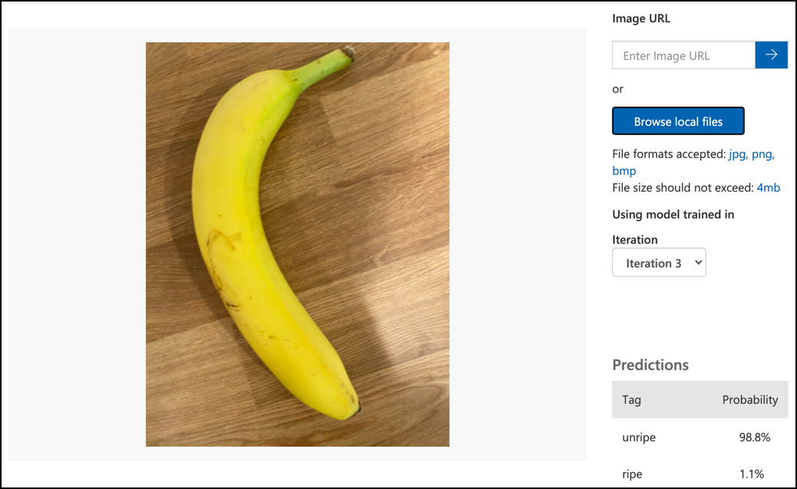

<!--
CO_OP_TRANSLATOR_METADATA:
{
  "original_hash": "f5e63c916d2dd97d58be12aaf76bd9f1",
  "translation_date": "2025-08-27T20:25:30+00:00",
  "source_file": "4-manufacturing/lessons/1-train-fruit-detector/README.md",
  "language_code": "da"
}
-->
# Træn en frugtkvalitetsdetektor


> Sketchnote af [Nitya Narasimhan](https://github.com/nitya). Klik på billedet for en større version.

Denne video giver en oversigt over Azure Custom Vision-tjenesten, som vil blive dækket i denne lektion.

[](https://www.youtube.com/watch?v=TETcDLJlWR4)

> 🎥 Klik på billedet ovenfor for at se videoen

## Quiz før lektionen

[Quiz før lektionen](https://black-meadow-040d15503.1.azurestaticapps.net/quiz/29)

## Introduktion

Den seneste fremgang inden for kunstig intelligens (AI) og maskinlæring (ML) giver nutidens udviklere en bred vifte af muligheder. ML-modeller kan trænes til at genkende forskellige ting på billeder, herunder umodne frugter, og dette kan bruges i IoT-enheder til at hjælpe med at sortere produkter, enten mens de høstes, eller under forarbejdning i fabrikker eller lagre.

I denne lektion vil du lære om billedklassifikation - brugen af ML-modeller til at skelne mellem billeder af forskellige ting. Du vil lære, hvordan man træner en billedklassifikator til at skelne mellem frugt, der er god, og frugt, der er dårlig, enten undermoden, overmoden, beskadiget eller rådden.

I denne lektion dækker vi:

* [Brug af AI og ML til at sortere mad](../../../../../4-manufacturing/lessons/1-train-fruit-detector)
* [Billedklassifikation via maskinlæring](../../../../../4-manufacturing/lessons/1-train-fruit-detector)
* [Træn en billedklassifikator](../../../../../4-manufacturing/lessons/1-train-fruit-detector)
* [Test din billedklassifikator](../../../../../4-manufacturing/lessons/1-train-fruit-detector)
* [Gen-træn din billedklassifikator](../../../../../4-manufacturing/lessons/1-train-fruit-detector)

## Brug af AI og ML til at sortere mad

At brødføde verdens befolkning er svært, især til en pris, der gør mad overkommelig for alle. En af de største omkostninger er arbejdskraft, så landmænd vender sig i stigende grad mod automatisering og værktøjer som IoT for at reducere deres arbejdskraftomkostninger. Høstning i hånden er arbejdskrævende (og ofte hårdt arbejde) og bliver erstattet af maskiner, især i rigere lande. På trods af besparelserne ved at bruge maskiner til at høste, er der en ulempe - evnen til at sortere mad, mens den høstes.

Ikke alle afgrøder modnes jævnt. Tomater, for eksempel, kan stadig have nogle grønne frugter på planten, når størstedelen er klar til høst. Selvom det er spild at høste disse tidligt, er det billigere og lettere for landmanden at høste alt med maskiner og kassere de umodne produkter senere.

✅ Kig på forskellige frugter eller grøntsager, enten der vokser i nærheden af dig på gårde eller i din have, eller i butikker. Er de alle lige modne, eller ser du variation?

Den stigende automatisering af høst flyttede sorteringen af produkter fra marken til fabrikken. Mad ville rejse på lange transportbånd med hold af mennesker, der gennemgik produkterne og fjernede alt, der ikke levede op til kvalitetsstandarderne. Høst blev billigere takket være maskiner, men der var stadig en omkostning ved manuelt at sortere mad.


Den næste udvikling var at bruge maskiner til at sortere, enten indbygget i høstmaskinen eller i forarbejdningsanlæggene. Den første generation af disse maskiner brugte optiske sensorer til at registrere farver og styrede aktuatorer til at skubbe grønne tomater i en affaldsbeholder ved hjælp af arme eller lufttryk, mens røde tomater fortsatte på et netværk af transportbånd.

I denne video, når tomater falder fra et transportbånd til et andet, registreres grønne tomater og skubbes i en beholder ved hjælp af arme.

✅ Hvilke forhold ville du have brug for i en fabrik eller på en mark for at disse optiske sensorer fungerer korrekt?

De nyeste udviklinger af disse sorteringsmaskiner udnytter AI og ML, ved at bruge modeller, der er trænet til at skelne mellem god og dårlig frugt, ikke kun ved åbenlyse farveforskelle som grønne tomater vs røde, men også ved mere subtile forskelle i udseende, der kan indikere sygdom eller skader.

## Billedklassifikation via maskinlæring

Traditionel programmering er, hvor du tager data, anvender en algoritme på dataene og får output. For eksempel, i det sidste projekt tog du GPS-koordinater og en geofence, anvendte en algoritme leveret af Azure Maps og fik et resultat om, hvorvidt punktet var inden for eller uden for geofencen. Du indtaster flere data, du får mere output.


Maskinlæring vender dette om - du starter med data og kendte outputs, og maskinlæringsalgoritmen lærer af dataene. Du kan derefter tage den trænede algoritme, kaldet en *maskinlæringsmodel* eller *model*, og indtaste nye data og få nyt output.

> 🎓 Processen, hvor en maskinlæringsalgoritme lærer af dataene, kaldes *træning*. Input og kendte outputs kaldes *træningsdata*.

For eksempel kunne du give en model millioner af billeder af umodne bananer som input træningsdata, med træningsoutput sat til `umoden`, og millioner af modne bananbilleder som træningsdata med output sat til `moden`. ML-algoritmen vil derefter oprette en model baseret på disse data. Du giver derefter denne model et nyt billede af en banan, og den vil forudsige, om det nye billede er en moden eller en umoden banan.

> 🎓 Resultaterne af ML-modeller kaldes *forudsigelser*.


ML-modeller giver ikke et binært svar, men i stedet sandsynligheder. For eksempel kan en model få et billede af en banan og forudsige `moden` med 99,7% og `umoden` med 0,3%. Din kode ville derefter vælge den bedste forudsigelse og beslutte, at bananen er moden.

Den ML-model, der bruges til at registrere billeder som dette, kaldes en *billedklassifikator* - den får mærkede billeder og klassificerer derefter nye billeder baseret på disse mærker.

> 💁 Dette er en forenkling, og der er mange andre måder at træne modeller på, som ikke altid kræver mærkede outputs, såsom usuperviseret læring. Hvis du vil lære mere om ML, kan du tjekke [ML for begyndere, et 24-lektioners kursus om maskinlæring](https://aka.ms/ML-beginners).

## Træn en billedklassifikator

For at træne en billedklassifikator med succes har du brug for millioner af billeder. Som det viser sig, når du først har en billedklassifikator trænet på millioner eller milliarder af forskellige billeder, kan du genbruge den og gen-træne den ved hjælp af et lille sæt billeder og opnå gode resultater ved hjælp af en proces kaldet *transfer learning*.

> 🎓 Transfer learning er, hvor du overfører læring fra en eksisterende ML-model til en ny model baseret på nye data.

Når en billedklassifikator er blevet trænet til en bred vifte af billeder, er dens interne funktioner gode til at genkende former, farver og mønstre. Transfer learning gør det muligt for modellen at tage det, den allerede har lært om at genkende billeddele, og bruge det til at genkende nye billeder.


Du kan tænke på dette som lidt ligesom børns formbøger, hvor når du først kan genkende en halvcirkel, et rektangel og en trekant, kan du genkende en sejlbåd eller en kat afhængigt af konfigurationen af disse former. Billedklassifikatoren kan genkende formerne, og transfer learning lærer den, hvilken kombination der udgør en båd eller en kat - eller en moden banan.

Der findes en bred vifte af værktøjer, der kan hjælpe dig med dette, herunder cloud-baserede tjenester, der kan hjælpe dig med at træne din model og derefter bruge den via web-API'er.

> 💁 Træning af disse modeller kræver meget computerkraft, normalt via Graphics Processing Units, eller GPU'er. Den samme specialiserede hardware, der får spil på din Xbox til at se fantastiske ud, kan også bruges til at træne maskinlæringsmodeller. Ved at bruge skyen kan du leje tid på kraftfulde computere med GPU'er til at træne disse modeller og få adgang til den computerkraft, du har brug for, kun i den tid, du har brug for det.

## Custom Vision

Custom Vision er et cloud-baseret værktøj til træning af billedklassifikatorer. Det giver dig mulighed for at træne en klassifikator ved kun at bruge et lille antal billeder. Du kan uploade billeder via en webportal, web-API eller et SDK og give hvert billede en *tag*, der angiver klassifikationen af det billede. Du træner derefter modellen og tester den for at se, hvor godt den fungerer. Når du er tilfreds med modellen, kan du udgive versioner af den, der kan tilgås via en web-API eller et SDK.


> 💁 Du kan træne en Custom Vision-model med så lidt som 5 billeder pr. klassifikation, men flere er bedre. Du kan opnå bedre resultater med mindst 30 billeder.

Custom Vision er en del af en række AI-værktøjer fra Microsoft kaldet Cognitive Services. Disse er AI-værktøjer, der kan bruges enten uden nogen træning eller med en lille mængde træning. De inkluderer talegenkendelse og oversættelse, sprogforståelse og billedanalyse. Disse er tilgængelige med en gratis niveau som tjenester i Azure.

> 💁 Det gratis niveau er mere end nok til at oprette en model, træne den og derefter bruge den til udviklingsarbejde. Du kan læse om grænserne for det gratis niveau på [Custom Vision Limits and quotas-siden på Microsoft Docs](https://docs.microsoft.com/azure/cognitive-services/custom-vision-service/limits-and-quotas?WT.mc_id=academic-17441-jabenn).

### Opgave - opret en Cognitive Services-ressource

For at bruge Custom Vision skal du først oprette to Cognitive Services-ressourcer i Azure ved hjælp af Azure CLI, en til Custom Vision-træning og en til Custom Vision-forudsigelse.

1. Opret en Resource Group til dette projekt kaldet `fruit-quality-detector`.

1. Brug følgende kommando til at oprette en gratis Custom Vision-træningsressource:

    ```sh
    az cognitiveservices account create --name fruit-quality-detector-training \
                                        --resource-group fruit-quality-detector \
                                        --kind CustomVision.Training \
                                        --sku F0 \
                                        --yes \
                                        --location <location>
    ```

    Erstat `<location>` med den placering, du brugte, da du oprettede Resource Group.

    Dette vil oprette en Custom Vision-træningsressource i din Resource Group. Den vil blive kaldt `fruit-quality-detector-training` og bruge `F0` sku, som er det gratis niveau. `--yes`-indstillingen betyder, at du accepterer vilkårene og betingelserne for Cognitive Services.

> 💁 Brug `S0` sku, hvis du allerede har en gratis konto, der bruger nogen af Cognitive Services.

1. Brug følgende kommando til at oprette en gratis Custom Vision-forudsigelsesressource:

    ```sh
    az cognitiveservices account create --name fruit-quality-detector-prediction \
                                        --resource-group fruit-quality-detector \
                                        --kind CustomVision.Prediction \
                                        --sku F0 \
                                        --yes \
                                        --location <location>
    ```

    Erstat `<location>` med den placering, du brugte, da du oprettede Resource Group.

    Dette vil oprette en Custom Vision-forudsigelsesressource i din Resource Group. Den vil blive kaldt `fruit-quality-detector-prediction` og bruge `F0` sku, som er det gratis niveau. `--yes`-indstillingen betyder, at du accepterer vilkårene og betingelserne for Cognitive Services.

### Opgave - opret et billedklassifikationsprojekt

1. Åbn Custom Vision-portalen på [CustomVision.ai](https://customvision.ai), og log ind med den Microsoft-konto, du brugte til din Azure-konto.

1. Følg [opret en ny projektsektion i quickstart-guiden til at bygge en klassifikator på Microsoft Docs](https://docs.microsoft.com/azure/cognitive-services/custom-vision-service/getting-started-build-a-classifier?WT.mc_id=academic-17441-jabenn#create-a-new-project) for at oprette et nyt Custom Vision-projekt. Brugergrænsefladen kan ændre sig, og disse dokumenter er altid den mest opdaterede reference.

    Kald dit projekt `fruit-quality-detector`.

    Når du opretter dit projekt, skal du sørge for at bruge den `fruit-quality-detector-training`-ressource, du oprettede tidligere. Brug en *Classification*-projekttype, en *Multiclass*-klassifikationstype og *Food*-domænet.

    

✅ Tag dig tid til at udforske Custom Vision-brugergrænsefladen for din billedklassifikator.

### Opgave - træn dit billedklassifikationsprojekt

For at træne en billedklassifikator skal du bruge flere billeder af frugt, både af god og dårlig kvalitet, som du kan mærke som god og dårlig, såsom en moden og en overmoden banan.
💁 Disse klassifikatorer kan klassificere billeder af hvad som helst, så hvis du ikke har frugt med forskellig kvalitet ved hånden, kan du bruge to forskellige typer frugt eller katte og hunde!
Ideelt set bør hvert billede kun vise frugten, enten med en ensartet baggrund eller en bred vifte af baggrunde. Sørg for, at der ikke er noget i baggrunden, der er specifikt for moden vs umoden frugt.

> 💁 Det er vigtigt ikke at have specifikke baggrunde eller specifikke genstande, der ikke er relateret til det, der klassificeres for hver tag, da klassificeringsmodellen ellers kan ende med at klassificere baseret på baggrunden. Der var engang en klassificeringsmodel for hudkræft, der blev trænet på både normale og kræftsyge modermærker, og de kræftsyge havde alle linealer ved siden af for at måle størrelsen. Det viste sig, at modellen var næsten 100% nøjagtig til at identificere linealer i billeder, ikke kræftsyge modermærker.

Billedklassificeringsmodeller kører ved meget lav opløsning. For eksempel kan Custom Vision tage trænings- og forudsigelsesbilleder op til 10240x10240, men træner og kører modellen på billeder ved 227x227. Større billeder bliver reduceret til denne størrelse, så sørg for, at det, du klassificerer, fylder en stor del af billedet, ellers kan det være for småt i det mindre billede, som modellen bruger.

1. Saml billeder til din klassificeringsmodel. Du skal bruge mindst 5 billeder for hver etiket for at træne modellen, men jo flere, jo bedre. Du skal også bruge nogle ekstra billeder til at teste modellen. Disse billeder skal alle være forskellige billeder af det samme. For eksempel:

    * Brug 2 modne bananer, og tag nogle billeder af hver fra forskellige vinkler, mindst 7 billeder (5 til træning, 2 til test), men helst flere.

        

    * Gentag samme proces med 2 umodne bananer.

    Du bør have mindst 10 træningsbilleder, med mindst 5 modne og 5 umodne, og 4 testbilleder, 2 modne og 2 umodne. Dine billeder skal være png eller jpeg, mindre end 6MB. Hvis du for eksempel tager dem med en iPhone, kan de være højopløsnings-HEIC-billeder, som skal konverteres og muligvis reduceres. Jo flere billeder, jo bedre, og du bør have et lignende antal modne og umodne.

    Hvis du ikke har både modne og umodne frugter, kan du bruge forskellige frugter eller andre genstande, du har til rådighed. Du kan også finde nogle eksempler på billeder i [images](../../../../../4-manufacturing/lessons/1-train-fruit-detector/images)-mappen af modne og umodne bananer, som du kan bruge.

1. Følg [upload og tag billeder-sektionen i quickstart-guiden til at bygge en klassificeringsmodel på Microsoft Docs](https://docs.microsoft.com/azure/cognitive-services/custom-vision-service/getting-started-build-a-classifier?WT.mc_id=academic-17441-jabenn#upload-and-tag-images) for at uploade dine træningsbilleder. Tag de modne frugter som `ripe` og de umodne som `unripe`.

    

1. Følg [træn klassificeringsmodellen-sektionen i quickstart-guiden til at bygge en klassificeringsmodel på Microsoft Docs](https://docs.microsoft.com/azure/cognitive-services/custom-vision-service/getting-started-build-a-classifier?WT.mc_id=academic-17441-jabenn#train-the-classifier) for at træne billedklassificeringsmodellen med dine uploadede billeder.

    Du vil få mulighed for at vælge træningstype. Vælg **Quick Training**.

Modellen vil derefter træne. Det vil tage et par minutter, før træningen er færdig.

> 🍌 Hvis du beslutter dig for at spise din frugt, mens modellen træner, så sørg for, at du har nok billeder til at teste med først!

## Test din billedklassificeringsmodel

Når din model er trænet, kan du teste den ved at give den et nyt billede til klassificering.

### Opgave - test din billedklassificeringsmodel

1. Følg [test din model-dokumentationen på Microsoft Docs](https://docs.microsoft.com/azure/cognitive-services/custom-vision-service/test-your-model?WT.mc_id=academic-17441-jabenn#test-your-model) for at teste din billedklassificeringsmodel. Brug de testbilleder, du oprettede tidligere, ikke nogen af de billeder, du brugte til træning.

    

1. Prøv alle de testbilleder, du har adgang til, og observer sandsynlighederne.

## Gen-træn din billedklassificeringsmodel

Når du tester din model, kan den muligvis ikke give de resultater, du forventer. Billedklassificeringsmodeller bruger maskinlæring til at lave forudsigelser om, hvad der er i et billede, baseret på sandsynligheder for, at bestemte træk ved et billede betyder, at det matcher en bestemt etiket. Den forstår ikke, hvad der er i billedet - den ved ikke, hvad en banan er eller forstår, hvad der gør en banan til en banan i stedet for en båd. Du kan forbedre din model ved at gen-træne den med billeder, den tager fejl af.

Hver gang du laver en forudsigelse ved hjælp af quick test-muligheden, gemmes billedet og resultaterne. Du kan bruge disse billeder til at gen-træne din model.

### Opgave - gen-træn din billedklassificeringsmodel

1. Følg [brug det forudsagte billede til træning-dokumentationen på Microsoft Docs](https://docs.microsoft.com/azure/cognitive-services/custom-vision-service/test-your-model?WT.mc_id=academic-17441-jabenn#use-the-predicted-image-for-training) for at gen-træne din model, ved at bruge den korrekte etiket for hvert billede.

1. Når din model er blevet gen-trænet, test den med nye billeder.

---

## 🚀 Udfordring

Hvad tror du, der ville ske, hvis du brugte et billede af en jordbær med en model, der er trænet på bananer, eller et billede af en oppustelig banan, eller en person i et banankostume, eller endda en gul tegneseriefigur som en fra Simpsons?

Prøv det og se, hvad forudsigelserne er. Du kan finde billeder at prøve med ved hjælp af [Bing Image search](https://www.bing.com/images/trending).

## Quiz efter forelæsning

[Quiz efter forelæsning](https://black-meadow-040d15503.1.azurestaticapps.net/quiz/30)

## Gennemgang & Selvstudie

* Når du trænede din model, ville du have set værdier for *Precision*, *Recall* og *AP*, der vurderer den model, der blev oprettet. Læs om, hvad disse værdier betyder ved hjælp af [evaluér klassificeringsmodellen-sektionen i quickstart-guiden til at bygge en klassificeringsmodel på Microsoft Docs](https://docs.microsoft.com/azure/cognitive-services/custom-vision-service/getting-started-build-a-classifier?WT.mc_id=academic-17441-jabenn#evaluate-the-classifier)
* Læs om, hvordan du kan forbedre din model fra [hvordan du forbedrer din Custom Vision-model på Microsoft Docs](https://docs.microsoft.com/azure/cognitive-services/custom-vision-service/getting-started-improving-your-classifier?WT.mc_id=academic-17441-jabenn)

## Opgave

[Træn din model til flere frugter og grøntsager](assignment.md)

---

**Ansvarsfraskrivelse**:  
Dette dokument er blevet oversat ved hjælp af AI-oversættelsestjenesten [Co-op Translator](https://github.com/Azure/co-op-translator). Selvom vi bestræber os på at sikre nøjagtighed, skal det bemærkes, at automatiserede oversættelser kan indeholde fejl eller unøjagtigheder. Det originale dokument på dets oprindelige sprog bør betragtes som den autoritative kilde. For kritisk information anbefales professionel menneskelig oversættelse. Vi er ikke ansvarlige for eventuelle misforståelser eller fejltolkninger, der måtte opstå som følge af brugen af denne oversættelse.