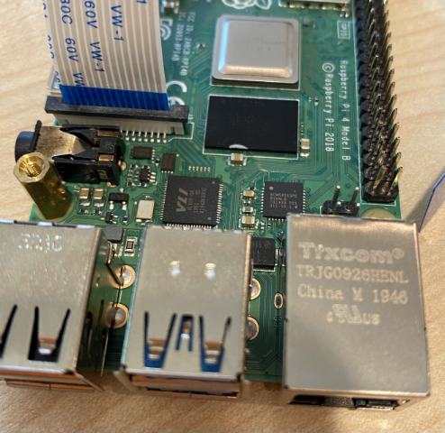

<!--
CO_OP_TRANSLATOR_METADATA:
{
  "original_hash": "c677667095f6133eee418c7e53615d05",
  "translation_date": "2025-08-27T20:42:03+00:00",
  "source_file": "4-manufacturing/lessons/2-check-fruit-from-device/pi-camera.md",
  "language_code": "da"
}
-->
# Tag et billede - Raspberry Pi

I denne del af lektionen vil du tilføje en kamerasensor til din Raspberry Pi og læse billeder fra den.

## Hardware

Raspberry Pi kræver et kamera.

Det kamera, du skal bruge, er et [Raspberry Pi Camera Module](https://www.raspberrypi.org/products/camera-module-v2/). Dette kamera er designet til at fungere med Raspberry Pi og tilsluttes via en dedikeret stik på Pi'en.

> 💁 Dette kamera bruger [Camera Serial Interface, en protokol fra Mobile Industry Processor Interface Alliance](https://wikipedia.org/wiki/Camera_Serial_Interface), kendt som MIPI-CSI. Dette er en dedikeret protokol til at sende billeder.

## Tilslut kameraet

Kameraet kan tilsluttes Raspberry Pi ved hjælp af et fladkabel.

### Opgave - tilslut kameraet


1. Sluk for Pi'en.

1. Tilslut fladkablet, der følger med kameraet, til kameraet. For at gøre dette skal du forsigtigt trække i den sorte plastikklips i holderen, så den kommer lidt ud, og derefter skubbe kablet ind i stikket med den blå side væk fra linsen og metalstifterne mod linsen. Når det er helt inde, skal du skubbe den sorte plastikklips tilbage på plads.

    Du kan finde en animation, der viser, hvordan man åbner klipsen og indsætter kablet, i [Raspberry Pi Getting Started with the Camera module documentation](https://projects.raspberrypi.org/en/projects/getting-started-with-picamera/2).

    

1. Fjern Grove Base Hat fra Pi'en.

1. Før fladkablet gennem kamerahullet i Grove Base Hat. Sørg for, at den blå side af kablet vender mod de analoge porte mærket **A0**, **A1** osv.

    

1. Indsæt fladkablet i kamerastikket på Pi'en. Træk igen den sorte plastikklips op, indsæt kablet, og skub derefter klipsen tilbage på plads. Den blå side af kablet skal vende mod USB- og ethernet-portene.

    

1. Monter Grove Base Hat igen.

## Programmer kameraet

Raspberry Pi kan nu programmeres til at bruge kameraet ved hjælp af [PiCamera](https://pypi.org/project/picamera/) Python-biblioteket.

### Opgave - aktiver legacy-kameratilstand

Desværre ændrede kamerasoftwaren, der fulgte med Raspberry Pi OS Bullseye, sig, hvilket betyder, at PiCamera som standard ikke længere fungerer. Der arbejdes på en erstatning, kaldet PiCamera2, men den er endnu ikke klar til brug.

Indtil videre kan du sætte din Pi i legacy-kameratilstand for at få PiCamera til at fungere. Kamerastikket er også deaktiveret som standard, men aktivering af legacy-kamerasoftwaren aktiverer automatisk stikket.

1. Tænd for Pi'en og vent på, at den starter op.

1. Start VS Code, enten direkte på Pi'en eller via Remote SSH-udvidelsen.

1. Kør følgende kommandoer fra din terminal:

    ```sh
    sudo raspi-config nonint do_legacy 0
    sudo reboot
    ```

    Dette vil ændre en indstilling for at aktivere legacy-kamerasoftwaren og derefter genstarte Pi'en for at gøre indstillingen aktiv.

1. Vent på, at Pi'en genstarter, og start derefter VS Code igen.

### Opgave - programmer kameraet

Programmer enheden.

1. Fra terminalen skal du oprette en ny mappe i `pi`-brugerens hjemmekatalog kaldet `fruit-quality-detector`. Opret en fil i denne mappe kaldet `app.py`.

1. Åbn denne mappe i VS Code.

1. For at interagere med kameraet kan du bruge PiCamera Python-biblioteket. Installer Pip-pakken til dette med følgende kommando:

    ```sh
    pip3 install picamera
    ```

1. Tilføj følgende kode til din `app.py`-fil:

    ```python
    import io
    import time
    from picamera import PiCamera
    ```

    Denne kode importerer nogle nødvendige biblioteker, inklusive `PiCamera`-biblioteket.

1. Tilføj følgende kode nedenfor for at initialisere kameraet:

    ```python
    camera = PiCamera()
    camera.resolution = (640, 480)
    camera.rotation = 0
    
    time.sleep(2)
    ```

    Denne kode opretter et PiCamera-objekt og sætter opløsningen til 640x480. Selvom højere opløsninger understøttes (op til 3280x2464), fungerer billedklassifikatoren på meget mindre billeder (227x227), så der er ingen grund til at fange og sende større billeder.

    Linjen `camera.rotation = 0` angiver rotationen af billedet. Fladkablet kommer ind i bunden af kameraet, men hvis dit kamera blev roteret for at gøre det lettere at pege på det objekt, du vil klassificere, kan du ændre denne linje til antallet af grader af rotation.

    

    For eksempel, hvis du hænger fladkablet over noget, så det er øverst på kameraet, skal du sætte rotationen til 180:

    ```python
    camera.rotation = 180
    ```

    Kameraet tager et par sekunder at starte op, derfor linjen `time.sleep(2)`.

1. Tilføj følgende kode nedenfor for at fange billedet som binære data:

    ```python
    image = io.BytesIO()
    camera.capture(image, 'jpeg')
    image.seek(0)
    ```

    Denne kode opretter et `BytesIO`-objekt til at gemme binære data. Billedet læses fra kameraet som en JPEG-fil og gemmes i dette objekt. Dette objekt har en positionsindikator for at vide, hvor det er i dataene, så der kan skrives mere data til slutningen, hvis det er nødvendigt. Linjen `image.seek(0)` flytter denne position tilbage til starten, så alle data kan læses senere.

1. Tilføj nedenfor dette følgende for at gemme billedet i en fil:

    ```python
    with open('image.jpg', 'wb') as image_file:
        image_file.write(image.read())
    ```

    Denne kode åbner en fil kaldet `image.jpg` til skrivning, læser derefter alle data fra `BytesIO`-objektet og skriver dem til filen.

    > 💁 Du kan fange billedet direkte til en fil i stedet for et `BytesIO`-objekt ved at videregive filnavnet til `camera.capture`-kaldet. Årsagen til at bruge `BytesIO`-objektet er, så du senere i denne lektion kan sende billedet til din billedklassifikator.

1. Peg kameraet på noget og kør denne kode.

1. Et billede vil blive fanget og gemt som `image.jpg` i den aktuelle mappe. Du vil se denne fil i VS Code-udforskeren. Vælg filen for at se billedet. Hvis det skal roteres, opdater linjen `camera.rotation = 0` efter behov og tag et nyt billede.

> 💁 Du kan finde denne kode i [code-camera/pi](../../../../../4-manufacturing/lessons/2-check-fruit-from-device/code-camera/pi)-mappen.

😀 Dit kameraprogram var en succes!

---

**Ansvarsfraskrivelse**:  
Dette dokument er blevet oversat ved hjælp af AI-oversættelsestjenesten [Co-op Translator](https://github.com/Azure/co-op-translator). Selvom vi bestræber os på nøjagtighed, skal du være opmærksom på, at automatiserede oversættelser kan indeholde fejl eller unøjagtigheder. Det originale dokument på dets oprindelige sprog bør betragtes som den autoritative kilde. For kritisk information anbefales professionel menneskelig oversættelse. Vi er ikke ansvarlige for eventuelle misforståelser eller fejltolkninger, der opstår som følge af brugen af denne oversættelse.