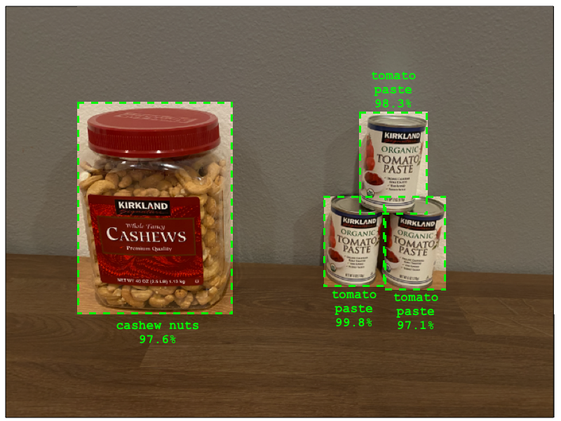

<!--
CO_OP_TRANSLATOR_METADATA:
{
  "original_hash": "8df310a42f902139a01417dacb1ffbef",
  "translation_date": "2025-08-27T22:14:09+00:00",
  "source_file": "5-retail/lessons/1-train-stock-detector/README.md",
  "language_code": "da"
}
-->
# Træn en lagerdetektor

> Sketchnote af [Nitya Narasimhan](https://github.com/nitya). Klik på billedet for en større version.

Denne video giver en oversigt over Object Detection med Azure Custom Vision-tjenesten, en tjeneste der vil blive dækket i denne lektion.

> 🎥 Klik på billedet ovenfor for at se videoen

## Quiz før lektionen

[Quiz før lektionen](https://black-meadow-040d15503.1.azurestaticapps.net/quiz/37)

## Introduktion

I det tidligere projekt brugte du AI til at træne en billedklassifikator - en model, der kan afgøre, om et billede indeholder noget, såsom moden frugt eller umoden frugt. En anden type AI-model, der kan bruges med billeder, er objektgenkendelse. Disse modeller klassificerer ikke et billede med tags, men trænes til at genkende objekter og kan finde dem i billeder. De kan ikke kun opdage, at et objekt er til stede, men også hvor det er i billedet. Dette gør det muligt at tælle objekter i billeder.

I denne lektion vil du lære om objektgenkendelse, herunder hvordan det kan bruges i detailhandel. Du vil også lære, hvordan man træner en objektgenkendelsesmodel i skyen.

I denne lektion dækker vi:

* [Objektgenkendelse](../../../../../5-retail/lessons/1-train-stock-detector)
* [Brug objektgenkendelse i detailhandel](../../../../../5-retail/lessons/1-train-stock-detector)
* [Træn en objektgenkendelsesmodel](../../../../../5-retail/lessons/1-train-stock-detector)
* [Test din objektgenkendelsesmodel](../../../../../5-retail/lessons/1-train-stock-detector)
* [Gen-træn din objektgenkendelsesmodel](../../../../../5-retail/lessons/1-train-stock-detector)

## Objektgenkendelse

Objektgenkendelse indebærer at finde objekter i billeder ved hjælp af AI. I modsætning til billedklassifikatoren, du trænede i det sidste projekt, handler objektgenkendelse ikke om at forudsige det bedste tag for et billede som helhed, men om at finde et eller flere objekter i et billede.

### Objektgenkendelse vs billedklassifikation

Billedklassifikation handler om at klassificere et billede som helhed - hvad er sandsynligheden for, at hele billedet matcher hvert tag. Du får sandsynligheder tilbage for hvert tag, der blev brugt til at træne modellen.

I eksemplet ovenfor klassificeres to billeder ved hjælp af en model, der er trænet til at klassificere bøtter med cashewnødder eller dåser med tomatpuré. Det første billede er en bøtte med cashewnødder og har to resultater fra billedklassifikatoren:

| Tag            | Sandsynlighed |
| -------------- | ------------: |
| `cashewnødder` | 98.4%         |
| `tomatpuré`    | 1.6%          |

Det andet billede er af en dåse tomatpuré, og resultaterne er:

| Tag            | Sandsynlighed |
| -------------- | ------------: |
| `cashewnødder` | 0.7%          |
| `tomatpuré`    | 99.3%         |

Du kunne bruge disse værdier med en tærskelprocent til at forudsige, hvad der var på billedet. Men hvad hvis et billede indeholdt flere dåser tomatpuré eller både cashewnødder og tomatpuré? Resultaterne ville sandsynligvis ikke give dig det, du ønsker. Det er her, objektgenkendelse kommer ind i billedet.

Objektgenkendelse indebærer at træne en model til at genkende objekter. I stedet for at give den billeder, der indeholder objektet, og fortælle den, at hvert billede er ét tag eller et andet, fremhæver du den del af et billede, der indeholder det specifikke objekt, og tagger det. Du kan tagge et enkelt objekt i et billede eller flere. På denne måde lærer modellen, hvordan objektet selv ser ud, ikke kun hvordan billeder, der indeholder objektet, ser ud.

Når du derefter bruger den til at forudsige billeder, får du ikke en liste over tags og procenter tilbage, men en liste over detekterede objekter med deres afgrænsningsboks og sandsynligheden for, at objektet matcher det tildelte tag.

> 🎓 *Afgrænsningsbokse* er boksene omkring et objekt.

Billedet ovenfor indeholder både en bøtte med cashewnødder og tre dåser tomatpuré. Objektgenkendelsesmodellen har fundet cashewnødderne og returneret afgrænsningsboksen, der indeholder cashewnødderne, med sandsynligheden for, at afgrænsningsboksen indeholder objektet, i dette tilfælde 97.6%. Modellen har også fundet tre dåser tomatpuré og giver tre separate afgrænsningsbokse, én for hver fundet dåse, og hver med en sandsynlighedsprocent for, at afgrænsningsboksen indeholder en dåse tomatpuré.

✅ Tænk på nogle forskellige scenarier, hvor du kunne bruge billedbaserede AI-modeller. Hvilke ville kræve klassifikation, og hvilke ville kræve objektgenkendelse?

### Hvordan objektgenkendelse fungerer

Objektgenkendelse bruger komplekse ML-modeller. Disse modeller fungerer ved at opdele billedet i flere celler og derefter kontrollere, om centrum af afgrænsningsboksen er centrum af et billede, der matcher et af de billeder, der blev brugt til at træne modellen. Du kan tænke på dette som en slags billedklassifikation, der køres over forskellige dele af billedet for at finde match.

> 💁 Dette er en drastisk forenkling. Der findes mange teknikker til objektgenkendelse, og du kan læse mere om dem på [Wikipedia-siden om objektgenkendelse](https://wikipedia.org/wiki/Object_detection).

Der findes en række forskellige modeller, der kan udføre objektgenkendelse. En særlig berømt model er [YOLO (You only look once)](https://pjreddie.com/darknet/yolo/), som er utrolig hurtig og kan genkende 20 forskellige klasser af objekter, såsom mennesker, hunde, flasker og biler.

✅ Læs om YOLO-modellen på [pjreddie.com/darknet/yolo/](https://pjreddie.com/darknet/yolo/)

Objektgenkendelsesmodeller kan gen-trænes ved hjælp af transfer learning til at genkende brugerdefinerede objekter.

## Brug objektgenkendelse i detailhandel

Objektgenkendelse har mange anvendelser i detailhandel. Nogle eksempler inkluderer:

* **Lagerkontrol og optælling** - genkende, når lageret er lavt på hylderne. Hvis lageret er for lavt, kan der sendes notifikationer til personalet eller robotter for at genopfylde hylderne.
* **Maskegenkendelse** - i butikker med maskepolitikker under offentlige sundhedshændelser kan objektgenkendelse genkende personer med masker og dem uden.
* **Automatisk fakturering** - genkende varer, der tages fra hylderne i automatiserede butikker, og fakturere kunderne korrekt.
* **Faregenkendelse** - genkende ødelagte genstande på gulve eller spildte væsker og alarmering af rengøringspersonale.

✅ Lav lidt research: Hvad er nogle flere anvendelser af objektgenkendelse i detailhandel?

## Træn en objektgenkendelsesmodel

Du kan træne en objektgenkendelsesmodel ved hjælp af Custom Vision, på en lignende måde som du trænede en billedklassifikator.

### Opgave - opret en objektgenkendelsesmodel

1. Opret en Resource Group til dette projekt kaldet `stock-detector`.

1. Opret en gratis Custom Vision-træningsressource og en gratis Custom Vision-forudsigelsesressource i `stock-detector`-ressourcegruppen. Navngiv dem `stock-detector-training` og `stock-detector-prediction`.

    > 💁 Du kan kun have én gratis trænings- og forudsigelsesressource, så sørg for at rydde op i dit projekt fra de tidligere lektioner.

    > ⚠️ Du kan henvise til [instruktionerne for oprettelse af trænings- og forudsigelsesressourcer fra projekt 4, lektion 1, hvis nødvendigt](../../../4-manufacturing/lessons/1-train-fruit-detector/README.md#task---create-a-cognitive-services-resource).

1. Start Custom Vision-portalen på [CustomVision.ai](https://customvision.ai), og log ind med den Microsoft-konto, du brugte til din Azure-konto.

1. Følg [Opret en ny projektsektion i Build an object detector quickstart på Microsoft Docs](https://docs.microsoft.com/azure/cognitive-services/custom-vision-service/get-started-build-detector?WT.mc_id=academic-17441-jabenn#create-a-new-project) for at oprette et nyt Custom Vision-projekt. UI'en kan ændre sig, og disse dokumenter er altid den mest opdaterede reference.

    Navngiv dit projekt `stock-detector`.

    Når du opretter dit projekt, skal du sørge for at bruge `stock-detector-training`-ressourcen, du oprettede tidligere. Brug projekttypen *Object Detection* og domænet *Products on Shelves*.

    

    ✅ Domænet *Products on Shelves* er specifikt målrettet mod at genkende lager på butikshylder. Læs mere om de forskellige domæner i [Select a domain-dokumentationen på Microsoft Docs](https://docs.microsoft.com/azure/cognitive-services/custom-vision-service/select-domain?WT.mc_id=academic-17441-jabenn#object-detection)

✅ Tag dig tid til at udforske Custom Vision UI for din objektgenkendelsesmodel.

### Opgave - træn din objektgenkendelsesmodel

For at træne din model skal du bruge et sæt billeder, der indeholder de objekter, du vil genkende.

1. Saml billeder, der indeholder det objekt, der skal genkendes. Du skal bruge mindst 15 billeder, der indeholder hvert objekt, der skal genkendes, fra forskellige vinkler og i forskellige lysforhold, men jo flere, jo bedre. Denne objektgenkendelsesmodel bruger domænet *Products on Shelves*, så prøv at placere objekterne, som om de var på en butikshylde. Du vil også have brug for nogle få billeder til at teste modellen. Hvis du genkender mere end ét objekt, vil du gerne have nogle testbilleder, der indeholder alle objekterne.

    > 💁 Billeder med flere forskellige objekter tæller med i minimumskravet på 15 billeder for alle objekterne i billedet.

    Dine billeder skal være png eller jpeg, mindre end 6MB. Hvis du opretter dem med en iPhone, kan de for eksempel være højopløsnings-HEIC-billeder, så de skal konverteres og muligvis formindskes. Jo flere billeder, jo bedre, og du bør have et lignende antal modne og umodne.

    Modellen er designet til produkter på hylder, så prøv at tage billederne af objekterne på hylder.

    Du kan finde nogle eksempler på billeder, du kan bruge, i [images](../../../../../5-retail/lessons/1-train-stock-detector/images)-mappen af cashewnødder og tomatpuré, som du kan bruge.

1. Følg [Upload og tag billeder-sektionen i Build an object detector quickstart på Microsoft Docs](https://docs.microsoft.com/azure/cognitive-services/custom-vision-service/get-started-build-detector?WT.mc_id=academic-17441-jabenn#upload-and-tag-images) for at uploade dine træningsbilleder. Opret relevante tags afhængigt af de typer objekter, du vil genkende.

    

    Når du tegner afgrænsningsbokse for objekter, skal du holde dem stramt omkring objektet. Det kan tage lidt tid at markere alle billederne, men værktøjet vil foreslå, hvad det tror er afgrænsningsboksene, hvilket gør det hurtigere.

    

    > 💁 Hvis du har mere end 15 billeder for hvert objekt, kan du træne efter 15 og derefter bruge funktionen **Suggested tags**. Dette vil bruge den trænede model til at genkende objekterne i de ikke-mærkede billeder. Du kan derefter bekræfte de genkendte objekter eller afvise og gen-tegne afgrænsningsboksene. Dette kan spare *meget* tid.

1. Følg [Træn detektoren-sektionen i Build an object detector quickstart på Microsoft Docs](https://docs.microsoft.com/azure/cognitive-services/custom-vision-service/get-started-build-detector?WT.mc_id=academic-17441-jabenn#train-the-detector) for at træne objektgenkendelsesmodellen på dine mærkede billeder.

    Du vil få et valg af træningstype. Vælg **Quick Training**.

Objektgenkendelsesmodellen vil derefter træne. Det vil tage et par minutter for træningen at blive færdig.

## Test din objektgenkendelsesmodel

Når din objektgenkendelsesmodel er trænet, kan du teste den ved at give den nye billeder for at genkende objekter i.

### Opgave - test din objektgenkendelsesmodel

1. Brug knappen **Quick Test** til at uploade testbilleder og verificere, at objekterne genkendes. Brug de testbilleder, du oprettede tidligere, ikke nogen af de billeder, du brugte til træning.

    

1. Prøv alle de testbilleder, du har adgang til, og observer sandsynlighederne.

## Gen-træn din objektgenkendelsesmodel

Når du tester din objektgenkendelsesmodel, giver den måske ikke de resultater, du forventer, ligesom med billedklassifikatorer i det tidligere projekt. Du kan forbedre din objektgenkendelsesmodel ved at gen-træne den med billeder, den får forkert.

Hver gang du laver en forudsigelse ved hjælp af quick test-muligheden, gemmes billedet og resultaterne. Du kan bruge disse billeder til at gen-træne din model.

1. Brug fanen **Predictions** til at finde de billeder, du brugte til test.

1. Bekræft eventuelle korrekte genkendelser, slet de forkerte og tilføj eventuelle manglende objekter.

1. Gen-træn og gen-test modellen.

---

## 🚀 Udfordring

Hvad ville der ske, hvis du brugte objektgenkendelsesmodellen med lignende udseende genstande, såsom dåser med tomatpuré og hakkede tomater fra samme mærke?

Hvis du har nogle lignende udseende genstande, så test det ved at tilføje billeder af dem til din objektgenkendelsesmodel.

## Quiz efter lektionen
[Post-lecture quiz](https://black-meadow-040d15503.1.azurestaticapps.net/quiz/38)

## Gennemgang & Selvstudie

* Når du trænede din objektdetektor, ville du have set værdier for *Precision*, *Recall* og *mAP*, som vurderer den model, der blev oprettet. Læs om, hvad disse værdier betyder, ved at bruge [sektionen Evaluér detektoren i Hurtigstart for at bygge en objektdetektor på Microsoft Docs](https://docs.microsoft.com/azure/cognitive-services/custom-vision-service/get-started-build-detector?WT.mc_id=academic-17441-jabenn#evaluate-the-detector)
* Læs mere om objektdetektion på [siden om objektdetektion på Wikipedia](https://wikipedia.org/wiki/Object_detection)

## Opgave

[Sammenlign domæner](assignment.md)

---

**Ansvarsfraskrivelse**:  
Dette dokument er blevet oversat ved hjælp af AI-oversættelsestjenesten [Co-op Translator](https://github.com/Azure/co-op-translator). Selvom vi bestræber os på at sikre nøjagtighed, skal det bemærkes, at automatiserede oversættelser kan indeholde fejl eller unøjagtigheder. Det originale dokument på dets oprindelige sprog bør betragtes som den autoritative kilde. For kritisk information anbefales professionel menneskelig oversættelse. Vi påtager os ikke ansvar for eventuelle misforståelser eller fejltolkninger, der måtte opstå som følge af brugen af denne oversættelse.