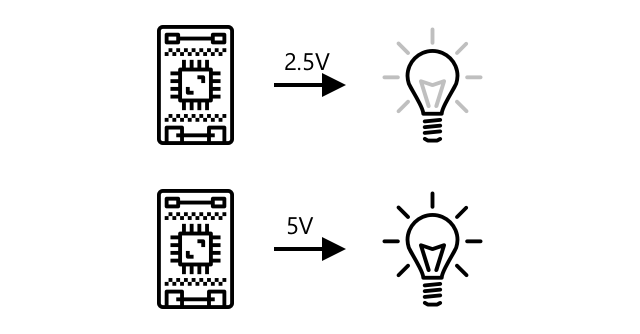

<!--
CO_OP_TRANSLATOR_METADATA:
{
  "original_hash": "e9ee00eb5fc55922a73762acc542166b",
  "translation_date": "2025-08-25T22:03:39+00:00",
  "source_file": "1-getting-started/lessons/3-sensors-and-actuators/README.md",
  "language_code": "de"
}
-->
# Interaktion mit der physischen Welt durch Sensoren und Aktoren


> Sketchnote von [Nitya Narasimhan](https://github.com/nitya). Klicken Sie auf das Bild für eine größere Version.

Diese Lektion wurde als Teil der [Hello IoT-Serie](https://youtube.com/playlist?list=PLmsFUfdnGr3xRts0TIwyaHyQuHaNQcb6-) vom [Microsoft Reactor](https://developer.microsoft.com/reactor/?WT.mc_id=academic-17441-jabenn) unterrichtet. Die Lektion wurde in zwei Videos aufgeteilt - eine einstündige Lektion und eine einstündige Sprechstunde, in der tiefer auf Teile der Lektion eingegangen und Fragen beantwortet wurden.

[](https://youtu.be/Lqalu1v6aF4)

[](https://youtu.be/qR3ekcMlLWA)

> 🎥 Klicken Sie auf die obigen Bilder, um die Videos anzusehen.

## Quiz vor der Lektion

[Quiz vor der Lektion](https://black-meadow-040d15503.1.azurestaticapps.net/quiz/5)

## Einführung

Diese Lektion führt zwei wichtige Konzepte für Ihr IoT-Gerät ein - Sensoren und Aktoren. Sie werden auch praktisch mit beiden arbeiten, indem Sie einen Lichtsensor zu Ihrem IoT-Projekt hinzufügen und dann eine LED einbauen, die durch Lichtpegel gesteuert wird, wodurch Sie effektiv ein Nachtlicht bauen.

In dieser Lektion behandeln wir:

* [Was sind Sensoren?](../../../../../1-getting-started/lessons/3-sensors-and-actuators)
* [Einen Sensor verwenden](../../../../../1-getting-started/lessons/3-sensors-and-actuators)
* [Sensortypen](../../../../../1-getting-started/lessons/3-sensors-and-actuators)
* [Was sind Aktoren?](../../../../../1-getting-started/lessons/3-sensors-and-actuators)
* [Einen Aktor verwenden](../../../../../1-getting-started/lessons/3-sensors-and-actuators)
* [Aktortypen](../../../../../1-getting-started/lessons/3-sensors-and-actuators)

## Was sind Sensoren?

Sensoren sind Hardwaregeräte, die die physische Welt erfassen - das heißt, sie messen eine oder mehrere Eigenschaften ihrer Umgebung und senden die Informationen an ein IoT-Gerät. Sensoren decken eine riesige Bandbreite an Geräten ab, da es so viele Dinge gibt, die gemessen werden können, von natürlichen Eigenschaften wie Lufttemperatur bis hin zu physischen Interaktionen wie Bewegung.

Einige gängige Sensoren sind:

* Temperatursensoren - diese messen die Lufttemperatur oder die Temperatur dessen, worin sie eingetaucht sind. Für Hobbyisten und Entwickler sind diese oft mit Luftdruck und Luftfeuchtigkeit in einem einzigen Sensor kombiniert.
* Tasten - diese erkennen, wenn sie gedrückt wurden.
* Lichtsensoren - diese erkennen Lichtpegel und können für bestimmte Farben, UV-Licht, IR-Licht oder allgemeines sichtbares Licht ausgelegt sein.
* Kameras - diese erfassen eine visuelle Darstellung der Welt, indem sie ein Foto aufnehmen oder ein Video streamen.
* Beschleunigungsmesser - diese erkennen Bewegungen in mehreren Richtungen.
* Mikrofone - diese erfassen Geräusche, entweder allgemeine Geräuschpegel oder gerichtete Geräusche.

✅ Recherchieren Sie. Welche Sensoren hat Ihr Telefon?

Alle Sensoren haben eines gemeinsam - sie wandeln das, was sie erfassen, in ein elektrisches Signal um, das von einem IoT-Gerät interpretiert werden kann. Wie dieses elektrische Signal interpretiert wird, hängt vom Sensor sowie vom Kommunikationsprotokoll ab, das zur Kommunikation mit dem IoT-Gerät verwendet wird.

## Einen Sensor verwenden

Folgen Sie der entsprechenden Anleitung unten, um einen Sensor zu Ihrem IoT-Gerät hinzuzufügen:

* [Arduino - Wio Terminal](wio-terminal-sensor.md)
* [Einplatinencomputer - Raspberry Pi](pi-sensor.md)
* [Einplatinencomputer - Virtuelles Gerät](virtual-device-sensor.md)

## Sensortypen

Sensoren sind entweder analog oder digital.

### Analoge Sensoren

Einige der grundlegendsten Sensoren sind analoge Sensoren. Diese Sensoren erhalten eine Spannung vom IoT-Gerät, die Sensorbauteile passen diese Spannung an, und die Spannung, die vom Sensor zurückgegeben wird, wird gemessen, um den Sensorwert zu erhalten.

> 🎓 Spannung ist ein Maß dafür, wie stark der Antrieb ist, Elektrizität von einem Ort zu einem anderen zu bewegen, z. B. vom Pluspol einer Batterie zum Minuspol. Zum Beispiel hat eine Standard-AA-Batterie 1,5V (V ist das Symbol für Volt) und kann Elektrizität mit einer Kraft von 1,5V von ihrem Pluspol zu ihrem Minuspol bewegen. Unterschiedliche elektrische Hardware benötigt unterschiedliche Spannungen, um zu funktionieren, z. B. kann eine LED mit 2-3V leuchten, aber eine 100W-Glühbirne würde 240V benötigen. Mehr über Spannung können Sie auf der [Wikipedia-Seite über Spannung](https://wikipedia.org/wiki/Voltage) lesen.

Ein Beispiel hierfür ist ein Potentiometer. Dies ist ein Drehregler, den Sie zwischen zwei Positionen drehen können, und der Sensor misst die Drehung.


Das IoT-Gerät sendet ein elektrisches Signal an das Potentiometer mit einer Spannung, z. B. 5 Volt (5V). Wenn das Potentiometer angepasst wird, ändert sich die Spannung, die auf der anderen Seite herauskommt. Stellen Sie sich vor, Sie haben ein Potentiometer, das als Drehregler von 0 bis [11](https://wikipedia.org/wiki/Up_to_eleven) beschriftet ist, wie ein Lautstärkeregler an einem Verstärker. Wenn das Potentiometer in der vollständig ausgeschalteten Position (0) ist, kommen 0V (0 Volt) heraus. Wenn es in der vollständig eingeschalteten Position (11) ist, kommen 5V (5 Volt) heraus.

> 🎓 Dies ist eine Vereinfachung, und Sie können mehr über Potentiometer und veränderliche Widerstände auf der [Wikipedia-Seite über Potentiometer](https://wikipedia.org/wiki/Potentiometer) lesen.

Die Spannung, die aus dem Sensor kommt, wird dann vom IoT-Gerät gelesen, und das Gerät kann darauf reagieren. Je nach Sensor kann diese Spannung ein beliebiger Wert sein oder einer standardisierten Einheit entsprechen. Beispielsweise ändert ein analoger Temperatursensor, der auf einem [Thermistor](https://wikipedia.org/wiki/Thermistor) basiert, seinen Widerstand in Abhängigkeit von der Temperatur. Die Ausgangsspannung kann dann durch Berechnungen im Code in eine Temperatur in Kelvin und entsprechend in °C oder °F umgewandelt werden.

✅ Was glauben Sie, passiert, wenn der Sensor eine höhere Spannung zurückgibt, als gesendet wurde (z. B. von einer externen Stromquelle)? ⛔️ TESTEN SIE DAS NICHT AUS.

#### Analog-Digital-Umwandlung

IoT-Geräte sind digital - sie können nicht mit analogen Werten arbeiten, sondern nur mit 0 und 1. Das bedeutet, dass analoge Sensorwerte in ein digitales Signal umgewandelt werden müssen, bevor sie verarbeitet werden können. Viele IoT-Geräte verfügen über Analog-Digital-Wandler (ADCs), um analoge Eingaben in digitale Darstellungen ihrer Werte umzuwandeln. Sensoren können auch über eine Anschlussplatine mit ADCs arbeiten. Beispielsweise verbinden sich analoge Sensoren im Seeed Grove-Ökosystem mit einem Raspberry Pi über spezifische Ports auf einem 'Hat', das auf dem Pi sitzt und mit den GPIO-Pins des Pi verbunden ist. Dieses Hat verfügt über einen ADC, der die Spannung in ein digitales Signal umwandelt, das über die GPIO-Pins des Pi gesendet werden kann.

Stellen Sie sich vor, Sie haben einen analogen Lichtsensor, der mit einem IoT-Gerät verbunden ist, das mit 3,3V arbeitet und einen Wert von 1V zurückgibt. Diese 1V bedeuten in der digitalen Welt nichts und müssen daher umgewandelt werden. Die Spannung wird mit einer Skala, die vom Gerät und Sensor abhängt, in einen analogen Wert umgewandelt. Ein Beispiel ist der Seeed Grove-Lichtsensor, der Werte von 0 bis 1.023 ausgibt. Für diesen Sensor, der mit 3,3V arbeitet, würde eine Ausgangsspannung von 1V einem Wert von 300 entsprechen. Ein IoT-Gerät kann mit 300 als analogem Wert nichts anfangen, daher würde der Wert vom Grove-Hat in `0000000100101100`, die Binärdarstellung von 300, umgewandelt. Dies würde dann vom IoT-Gerät verarbeitet.

✅ Wenn Sie Binärzahlen nicht kennen, recherchieren Sie ein wenig, um zu lernen, wie Zahlen durch 0 und 1 dargestellt werden. Die [BBC Bitesize Einführung in Binärzahlen](https://www.bbc.co.uk/bitesize/guides/zwsbwmn/revision/1) ist ein großartiger Ausgangspunkt.

Aus der Perspektive des Programmierens wird dies normalerweise von Bibliotheken gehandhabt, die mit den Sensoren geliefert werden, sodass Sie sich nicht selbst um diese Umwandlung kümmern müssen. Für den Grove-Lichtsensor würden Sie die Python-Bibliothek verwenden und die `light`-Eigenschaft aufrufen oder die Arduino-Bibliothek verwenden und `analogRead` aufrufen, um einen Wert von 300 zu erhalten.

### Digitale Sensoren

Digitale Sensoren erfassen wie analoge Sensoren die Welt um sie herum durch Änderungen der elektrischen Spannung. Der Unterschied besteht darin, dass sie ein digitales Signal ausgeben, entweder indem sie nur zwei Zustände messen oder einen eingebauten ADC verwenden. Digitale Sensoren werden immer häufiger, um die Notwendigkeit eines ADCs entweder in einer Anschlussplatine oder im IoT-Gerät selbst zu vermeiden.

Der einfachste digitale Sensor ist ein Knopf oder Schalter. Dies ist ein Sensor mit zwei Zuständen, ein oder aus.


Pins an IoT-Geräten wie GPIO-Pins können dieses Signal direkt als 0 oder 1 messen. Wenn die gesendete Spannung mit der zurückgegebenen Spannung übereinstimmt, wird der Wert 1 gelesen, andernfalls wird der Wert 0 gelesen. Es ist keine Umwandlung des Signals erforderlich, es kann nur 1 oder 0 sein.

> 💁 Spannungen sind nie exakt, insbesondere da die Bauteile in einem Sensor einen gewissen Widerstand haben, daher gibt es normalerweise eine Toleranz. Beispielsweise arbeiten die GPIO-Pins eines Raspberry Pi mit 3,3V und lesen ein Rücksignal über 1,8V als 1, unter 1,8V als 0.

* 3,3V gehen in den Knopf. Der Knopf ist aus, also kommen 0V heraus, was einen Wert von 0 ergibt.
* 3,3V gehen in den Knopf. Der Knopf ist an, also kommen 3,3V heraus, was einen Wert von 1 ergibt.

Fortschrittlichere digitale Sensoren lesen analoge Werte und wandeln sie dann mit eingebauten ADCs in digitale Signale um. Beispielsweise verwendet ein digitaler Temperatursensor immer noch ein Thermoelement wie ein analoger Sensor und misst immer noch die Änderung der Spannung, die durch den Widerstand des Thermoelements bei der aktuellen Temperatur verursacht wird. Anstatt einen analogen Wert zurückzugeben und sich auf das Gerät oder die Anschlussplatine zu verlassen, um ihn in ein digitales Signal umzuwandeln, wandelt ein im Sensor eingebauter ADC den Wert um und sendet ihn als Reihe von 0 und 1 an das IoT-Gerät. Diese 0 und 1 werden auf die gleiche Weise wie das digitale Signal für einen Knopf gesendet, wobei 1 die volle Spannung und 0 0V darstellt.


Das Senden digitaler Daten ermöglicht es Sensoren, komplexer zu werden und detailliertere Daten zu senden, sogar verschlüsselte Daten für sichere Sensoren. Ein Beispiel ist eine Kamera. Dies ist ein Sensor, der ein Bild aufnimmt und es als digitale Daten, die dieses Bild enthalten, normalerweise in einem komprimierten Format wie JPEG, an das IoT-Gerät sendet. Sie kann sogar Videos streamen, indem sie Bilder aufnimmt und entweder das vollständige Bild Bild für Bild oder einen komprimierten Videostream sendet.

## Was sind Aktoren?

Aktoren sind das Gegenteil von Sensoren - sie wandeln ein elektrisches Signal von Ihrem IoT-Gerät in eine Interaktion mit der physischen Welt um, wie z. B. das Abgeben von Licht oder Ton oder das Bewegen eines Motors.

Einige gängige Aktoren sind:

* LED - diese geben Licht ab, wenn sie eingeschaltet werden.
* Lautsprecher - diese geben Töne basierend auf dem gesendeten Signal ab, von einem einfachen Summer bis zu einem Lautsprecher, der Musik abspielen kann.
* Schrittmotor - diese wandeln ein Signal in eine definierte Drehung um, z. B. das Drehen eines Reglers um 90°.
* Relais - diese sind Schalter, die durch ein elektrisches Signal ein- oder ausgeschaltet werden können. Sie ermöglichen es einer kleinen Spannung von einem IoT-Gerät, größere Spannungen zu schalten.
* Bildschirme - diese sind komplexere Aktoren und zeigen Informationen auf einem Multi-Segment-Display an. Bildschirme reichen von einfachen LED-Anzeigen bis hin zu hochauflösenden Videomonitoren.

✅ Recherchieren Sie. Welche Aktoren hat Ihr Telefon?

## Einen Aktor verwenden

Folgen Sie der entsprechenden Anleitung unten, um einen Aktor zu Ihrem IoT-Gerät hinzuzufügen, der durch den Sensor gesteuert wird, um ein IoT-Nachtlicht zu bauen. Es wird Lichtpegel vom Lichtsensor erfassen und einen Aktor in Form einer LED verwenden, um Licht abzugeben, wenn der erkannte Lichtpegel zu niedrig ist.


* [Arduino - Wio Terminal](wio-terminal-actuator.md)
* [Einplatinencomputer - Raspberry Pi](pi-actuator.md)
* [Einplatinencomputer - Virtuelles Gerät](virtual-device-actuator.md)

## Aktortypen

Wie Sensoren sind Aktoren entweder analog oder digital.

### Analoge Aktoren

Analoge Aktoren nehmen ein analoges Signal und wandeln es in eine Art Interaktion um, wobei sich die Interaktion je nach angelegter Spannung ändert.

Ein Beispiel ist ein dimmbares Licht, wie Sie es vielleicht in Ihrem Haus haben. Die Menge der angelegten Spannung bestimmt, wie hell es leuchtet.


Wie bei Sensoren arbeiten IoT-Geräte mit digitalen Signalen, nicht mit analogen. Das bedeutet, dass ein IoT-Gerät einen Digital-zu-Analog-Wandler (DAC) benötigt, entweder direkt im Gerät oder auf einer Anschlussplatine, um ein analoges Signal zu senden. Dieser Wandler konvertiert die 0en und 1en des IoT-Geräts in eine analoge Spannung, die der Aktuator verwenden kann.

✅ Was denkst du, passiert, wenn das IoT-Gerät eine höhere Spannung sendet, als der Aktuator verarbeiten kann?  
⛔️ TESTE DAS NICHT AUS.

#### Pulsweitenmodulation

Eine weitere Möglichkeit, digitale Signale eines IoT-Geräts in ein analoges Signal umzuwandeln, ist die Pulsweitenmodulation (PWM). Dabei werden viele kurze digitale Impulse gesendet, die wie ein analoges Signal wirken.

Zum Beispiel kannst du PWM verwenden, um die Geschwindigkeit eines Motors zu steuern.

Stell dir vor, du steuerst einen Motor mit einer 5V-Stromversorgung. Du sendest einen kurzen Impuls an deinen Motor, indem du die Spannung für zwei Hundertstelsekunden (0,02s) auf hoch (5V) schaltest. In dieser Zeit kann sich der Motor um ein Zehntel einer Umdrehung oder 36° drehen. Das Signal pausiert dann für zwei Hundertstelsekunden (0,02s), indem ein niedriges Signal (0V) gesendet wird. Jeder Zyklus von "an" und "aus" dauert 0,04s. Der Zyklus wiederholt sich.


Das bedeutet, dass in einer Sekunde 25 5V-Impulse von jeweils 0,02s gesendet werden, die den Motor drehen, gefolgt von jeweils 0,02s Pause mit 0V, in denen der Motor nicht dreht. Jeder Impuls dreht den Motor um ein Zehntel einer Umdrehung, was bedeutet, dass der Motor 2,5 Umdrehungen pro Sekunde vollendet. Du hast ein digitales Signal verwendet, um den Motor mit 2,5 Umdrehungen pro Sekunde oder 150 [Umdrehungen pro Minute](https://wikipedia.org/wiki/Revolutions_per_minute) (eine nicht standardisierte Maßeinheit für Rotationsgeschwindigkeit) zu drehen.

```output
25 pulses per second x 0.1 rotations per pulse = 2.5 rotations per second
2.5 rotations per second x 60 seconds in a minute = 150rpm
```

> 🎓 Wenn ein PWM-Signal die Hälfte der Zeit "an" und die andere Hälfte "aus" ist, spricht man von einem [50%-Duty-Cycle](https://wikipedia.org/wiki/Duty_cycle). Duty-Cycles werden als Prozentsatz der Zeit gemessen, in der das Signal im "an"-Zustand im Vergleich zum "aus"-Zustand ist.


Du kannst die Motorgeschwindigkeit ändern, indem du die Länge der Impulse veränderst. Zum Beispiel kannst du bei demselben Motor die Zykluszeit von 0,04s beibehalten, aber die "an"-Impulse auf 0,01s halbieren und die "aus"-Impulse auf 0,03s verlängern. Du hast dieselbe Anzahl von Impulsen pro Sekunde (25), aber jeder "an"-Impuls ist halb so lang. Ein halb so langer Impuls dreht den Motor nur um ein Zwanzigstel einer Umdrehung, und bei 25 Impulsen pro Sekunde vollendet der Motor 1,25 Umdrehungen pro Sekunde oder 75 U/min. Durch die Änderung der Impulslänge eines digitalen Signals hast du die Geschwindigkeit eines analogen Motors halbiert.

```output
25 pulses per second x 0.05 rotations per pulse = 1.25 rotations per second
1.25 rotations per second x 60 seconds in a minute = 75rpm
```

✅ Wie würdest du die Motorrotation gleichmäßig halten, insbesondere bei niedrigen Geschwindigkeiten? Würdest du eine kleine Anzahl langer Impulse mit langen Pausen oder viele sehr kurze Impulse mit sehr kurzen Pausen verwenden?

> 💁 Einige Sensoren verwenden ebenfalls PWM, um analoge Signale in digitale Signale umzuwandeln.

> 🎓 Du kannst mehr über Pulsweitenmodulation auf der [Wikipedia-Seite zur Pulsweitenmodulation](https://wikipedia.org/wiki/Pulse-width_modulation) lesen.

### Digitale Aktuatoren

Digitale Aktuatoren, wie digitale Sensoren, haben entweder zwei Zustände, die durch eine hohe oder niedrige Spannung gesteuert werden, oder sie haben einen eingebauten DAC, der ein digitales Signal in ein analoges umwandeln kann.

Ein einfacher digitaler Aktuator ist eine LED. Wenn ein Gerät ein digitales Signal von 1 sendet, wird eine hohe Spannung gesendet, die die LED zum Leuchten bringt. Wenn ein digitales Signal von 0 gesendet wird, fällt die Spannung auf 0V und die LED erlischt.


✅ Welche anderen einfachen 2-Zustands-Aktuatoren fallen dir ein? Ein Beispiel ist ein Solenoid, ein Elektromagnet, der aktiviert werden kann, um Dinge wie das Bewegen eines Türbolzens zum Verriegeln/Entriegeln einer Tür zu erledigen.

Fortgeschrittenere digitale Aktuatoren, wie Bildschirme, benötigen digitale Daten, die in bestimmten Formaten gesendet werden. Sie werden normalerweise mit Bibliotheken geliefert, die es einfacher machen, die richtigen Daten zu senden, um sie zu steuern.

---

## 🚀 Herausforderung

Die Herausforderung in den letzten beiden Lektionen bestand darin, so viele IoT-Geräte wie möglich zu finden, die sich in deinem Zuhause, deiner Schule oder deinem Arbeitsplatz befinden, und zu entscheiden, ob sie auf Mikrocontrollern oder Einplatinencomputern basieren oder sogar eine Mischung aus beiden sind.

Für jedes Gerät, das du aufgelistet hast: Welche Sensoren und Aktuatoren sind daran angeschlossen? Was ist der Zweck jedes Sensors und Aktuators, der mit diesen Geräten verbunden ist?

## Quiz nach der Lektion

[Quiz nach der Lektion](https://black-meadow-040d15503.1.azurestaticapps.net/quiz/6)

## Überprüfung & Selbststudium

* Lies über Elektrizität und Schaltkreise auf [ThingLearn](http://thinglearn.jenlooper.com/curriculum/).  
* Informiere dich über die verschiedenen Arten von Temperatursensoren im [Seeed Studios Leitfaden für Temperatursensoren](https://www.seeedstudio.com/blog/2019/10/14/temperature-sensors-for-arduino-projects/).  
* Lies über LEDs auf der [Wikipedia-Seite zu LEDs](https://wikipedia.org/wiki/Light-emitting_diode).  

## Aufgabe

[Recherchiere Sensoren und Aktuatoren](assignment.md)

**Haftungsausschluss**:  
Dieses Dokument wurde mit dem KI-Übersetzungsdienst [Co-op Translator](https://github.com/Azure/co-op-translator) übersetzt. Obwohl wir uns um Genauigkeit bemühen, beachten Sie bitte, dass automatisierte Übersetzungen Fehler oder Ungenauigkeiten enthalten können. Das Originaldokument in seiner ursprünglichen Sprache sollte als maßgebliche Quelle betrachtet werden. Für kritische Informationen wird eine professionelle menschliche Übersetzung empfohlen. Wir übernehmen keine Haftung für Missverständnisse oder Fehlinterpretationen, die sich aus der Nutzung dieser Übersetzung ergeben.