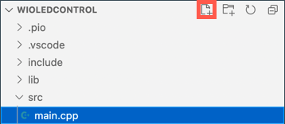

<!--
CO_OP_TRANSLATOR_METADATA:
{
  "original_hash": "d6faf0e8d3c2d6d20c0aef2a305dab18",
  "translation_date": "2025-08-25T22:00:34+00:00",
  "source_file": "1-getting-started/lessons/4-connect-internet/wio-terminal-mqtt.md",
  "language_code": "de"
}
-->
# Steuern Sie Ihr Nachtlicht über das Internet - Wio Terminal

Das IoT-Gerät muss so programmiert werden, dass es über MQTT mit *test.mosquitto.org* kommuniziert, um Telemetriedaten mit den Lichtmesswerten zu senden und Befehle zum Steuern der LED zu empfangen.

In diesem Teil der Lektion verbinden Sie Ihr Wio Terminal mit einem MQTT-Broker.

## Installieren der WiFi- und MQTT-Arduino-Bibliotheken

Um mit dem MQTT-Broker zu kommunizieren, müssen Sie einige Arduino-Bibliotheken installieren, um den WiFi-Chip im Wio Terminal zu nutzen und mit MQTT zu kommunizieren. Bei der Entwicklung für Arduino-Geräte können Sie eine Vielzahl von Bibliotheken verwenden, die Open-Source-Code enthalten und eine breite Palette von Funktionen implementieren. Seeed veröffentlicht Bibliotheken für das Wio Terminal, die die Kommunikation über WiFi ermöglichen. Andere Entwickler haben Bibliotheken veröffentlicht, um mit MQTT-Brokern zu kommunizieren, und Sie werden diese mit Ihrem Gerät verwenden.

Diese Bibliotheken werden als Quellcode bereitgestellt, der automatisch in PlatformIO importiert und für Ihr Gerät kompiliert werden kann. Auf diese Weise funktionieren Arduino-Bibliotheken auf jedem Gerät, das das Arduino-Framework unterstützt, vorausgesetzt, das Gerät verfügt über die spezifische Hardware, die von der Bibliothek benötigt wird. Einige Bibliotheken, wie die Seeed-WiFi-Bibliotheken, sind spezifisch für bestimmte Hardware.

Bibliotheken können global installiert und bei Bedarf kompiliert werden oder in ein bestimmtes Projekt integriert werden. Für diese Aufgabe werden die Bibliotheken in das Projekt installiert.

✅ Weitere Informationen zur Bibliotheksverwaltung und wie Sie Bibliotheken finden und installieren können, finden Sie in der [PlatformIO-Bibliotheksdokumentation](https://docs.platformio.org/en/latest/librarymanager/index.html).

### Aufgabe - Installieren der WiFi- und MQTT-Arduino-Bibliotheken

Installieren Sie die Arduino-Bibliotheken.

1. Öffnen Sie das Nachtlicht-Projekt in VS Code.

1. Fügen Sie Folgendes am Ende der Datei `platformio.ini` hinzu:

    ```ini
    lib_deps =
        seeed-studio/Seeed Arduino rpcWiFi @ 1.0.5
        seeed-studio/Seeed Arduino FS @ 2.1.1
        seeed-studio/Seeed Arduino SFUD @ 2.0.2
        seeed-studio/Seeed Arduino rpcUnified @ 2.1.3
        seeed-studio/Seeed_Arduino_mbedtls @ 3.0.1
    ```

    Dies importiert die Seeed-WiFi-Bibliotheken. Die Syntax `@ <Nummer>` bezieht sich auf eine spezifische Versionsnummer der Bibliothek.

    > 💁 Sie können die `@ <Nummer>` entfernen, um immer die neueste Version der Bibliotheken zu verwenden, aber es gibt keine Garantie, dass spätere Versionen mit dem unten stehenden Code funktionieren. Der hier gezeigte Code wurde mit dieser Version der Bibliotheken getestet.

    Das ist alles, was Sie tun müssen, um die Bibliotheken hinzuzufügen. Beim nächsten Build des Projekts lädt PlatformIO den Quellcode dieser Bibliotheken herunter und kompiliert ihn in Ihr Projekt.

1. Fügen Sie Folgendes zu den `lib_deps` hinzu:

    ```ini
    knolleary/PubSubClient @ 2.8
    ```

    Dies importiert [PubSubClient](https://github.com/knolleary/pubsubclient), einen Arduino-MQTT-Client.

## Verbindung mit WiFi herstellen

Das Wio Terminal kann nun mit WiFi verbunden werden.

### Aufgabe - Verbindung mit WiFi herstellen

Verbinden Sie das Wio Terminal mit WiFi.

1. Erstellen Sie eine neue Datei im Ordner `src` mit dem Namen `config.h`. Sie können dies tun, indem Sie den Ordner `src` oder die Datei `main.cpp` darin auswählen und die Schaltfläche **Neue Datei** im Explorer auswählen. Diese Schaltfläche erscheint nur, wenn sich der Cursor über dem Explorer befindet.

    

1. Fügen Sie folgenden Code in diese Datei ein, um Konstanten für Ihre WiFi-Zugangsdaten zu definieren:

    ```cpp
    #pragma once

    #include <string>
    
    using namespace std;
    
    // WiFi credentials
    const char *SSID = "<SSID>";
    const char *PASSWORD = "<PASSWORD>";
    ```

    Ersetzen Sie `<SSID>` durch die SSID Ihres WiFi. Ersetzen Sie `<PASSWORD>` durch Ihr WiFi-Passwort.

1. Öffnen Sie die Datei `main.cpp`.

1. Fügen Sie die folgenden `#include`-Direktiven am Anfang der Datei hinzu:

    ```cpp
    #include <PubSubClient.h>
    #include <rpcWiFi.h>
    #include <SPI.h>
    
    #include "config.h"
    ```

    Dies schließt Header-Dateien für die zuvor hinzugefügten Bibliotheken sowie die Config-Header-Datei ein. Diese Header-Dateien sind erforderlich, um PlatformIO anzuweisen, den Code aus den Bibliotheken einzubinden. Ohne das explizite Einbinden dieser Header-Dateien wird ein Teil des Codes nicht kompiliert, und Sie erhalten Compiler-Fehler.

1. Fügen Sie den folgenden Code oberhalb der Funktion `setup` hinzu:

    ```cpp
    void connectWiFi()
    {
        while (WiFi.status() != WL_CONNECTED)
        {
            Serial.println("Connecting to WiFi..");
            WiFi.begin(SSID, PASSWORD);
            delay(500);
        }
    
        Serial.println("Connected!");
    }
    ```

    Dieser Code läuft in einer Schleife, solange das Gerät nicht mit WiFi verbunden ist, und versucht, sich mit der SSID und dem Passwort aus der Config-Header-Datei zu verbinden.

1. Fügen Sie einen Aufruf dieser Funktion am Ende der Funktion `setup` hinzu, nachdem die Pins konfiguriert wurden.

    ```cpp
    connectWiFi();
    ```

1. Laden Sie diesen Code auf Ihr Gerät hoch, um zu überprüfen, ob die WiFi-Verbindung funktioniert. Sie sollten dies im seriellen Monitor sehen.

    ```output
    > Executing task: platformio device monitor <
    
    --- Available filters and text transformations: colorize, debug, default, direct, hexlify, log2file, nocontrol, printable, send_on_enter, time
    --- More details at http://bit.ly/pio-monitor-filters
    --- Miniterm on /dev/cu.usbmodem1101  9600,8,N,1 ---
    --- Quit: Ctrl+C | Menu: Ctrl+T | Help: Ctrl+T followed by Ctrl+H ---
    Connecting to WiFi..
    Connected!
    ```

## Verbindung mit MQTT herstellen

Sobald das Wio Terminal mit WiFi verbunden ist, kann es sich mit dem MQTT-Broker verbinden.

### Aufgabe - Verbindung mit MQTT herstellen

Verbinden Sie sich mit dem MQTT-Broker.

1. Fügen Sie den folgenden Code am Ende der Datei `config.h` hinzu, um die Verbindungsdetails für den MQTT-Broker zu definieren:

    ```cpp
    // MQTT settings
    const string ID = "<ID>";
    
    const string BROKER = "test.mosquitto.org";
    const string CLIENT_NAME = ID + "nightlight_client";
    ```

    Ersetzen Sie `<ID>` durch eine eindeutige ID, die als Name dieses Geräte-Clients verwendet wird und später für die Themen, die dieses Gerät veröffentlicht und abonniert. Der Broker *test.mosquitto.org* ist öffentlich und wird von vielen Menschen genutzt, einschließlich anderer Schüler, die diese Aufgabe bearbeiten. Eine eindeutige MQTT-Client-ID und eindeutige Themennamen stellen sicher, dass Ihr Code nicht mit dem anderer kollidiert. Sie benötigen diese ID auch, wenn Sie später den Servercode für diese Aufgabe erstellen.

    > 💁 Sie können eine Website wie [GUIDGen](https://www.guidgen.com) verwenden, um eine eindeutige ID zu generieren.

    Der `BROKER` ist die URL des MQTT-Brokers.

    Der `CLIENT_NAME` ist ein eindeutiger Name für diesen MQTT-Client auf dem Broker.

1. Öffnen Sie die Datei `main.cpp` und fügen Sie den folgenden Code unterhalb der Funktion `connectWiFi` und oberhalb der Funktion `setup` hinzu:

    ```cpp
    WiFiClient wioClient;
    PubSubClient client(wioClient);
    ```

    Dieser Code erstellt einen WiFi-Client mit den WiFi-Bibliotheken des Wio Terminals und verwendet ihn, um einen MQTT-Client zu erstellen.

1. Fügen Sie unterhalb dieses Codes Folgendes hinzu:

    ```cpp
    void reconnectMQTTClient()
    {
        while (!client.connected())
        {
            Serial.print("Attempting MQTT connection...");
    
            if (client.connect(CLIENT_NAME.c_str()))
            {
                Serial.println("connected");
            }
            else
            {
                Serial.print("Retying in 5 seconds - failed, rc=");
                Serial.println(client.state());
                
                delay(5000);
            }
        }
    }
    ```

    Diese Funktion testet die Verbindung zum MQTT-Broker und stellt die Verbindung wieder her, falls sie nicht besteht. Sie läuft in einer Schleife, solange keine Verbindung besteht, und versucht, sich mit dem eindeutigen Client-Namen aus der Config-Header-Datei zu verbinden.

    Wenn die Verbindung fehlschlägt, wird nach 5 Sekunden ein neuer Versuch unternommen.

1. Fügen Sie den folgenden Code unterhalb der Funktion `reconnectMQTTClient` hinzu:

    ```cpp
    void createMQTTClient()
    {
        client.setServer(BROKER.c_str(), 1883);
        reconnectMQTTClient();
    }
    ```

    Dieser Code legt den MQTT-Broker für den Client fest und richtet den Callback ein, der ausgeführt wird, wenn eine Nachricht empfangen wird. Anschließend wird versucht, eine Verbindung zum Broker herzustellen.

1. Rufen Sie die Funktion `createMQTTClient` in der Funktion `setup` auf, nachdem die WiFi-Verbindung hergestellt wurde.

1. Ersetzen Sie die gesamte Funktion `loop` durch Folgendes:

    ```cpp
    void loop()
    {
        reconnectMQTTClient();
        client.loop();
    
        delay(2000);
    }
    ```

    Dieser Code beginnt damit, die Verbindung zum MQTT-Broker wiederherzustellen. Diese Verbindungen können leicht unterbrochen werden, daher ist es sinnvoll, regelmäßig zu prüfen und bei Bedarf erneut zu verbinden. Anschließend wird die Methode `loop` des MQTT-Clients aufgerufen, um eingehende Nachrichten zu verarbeiten, die auf dem abonnierten Thema warten. Diese App ist single-threaded, daher können Nachrichten nicht in einem Hintergrund-Thread empfangen werden. Es muss daher Zeit im Haupt-Thread für die Verarbeitung von Nachrichten eingeplant werden, die auf der Netzwerkverbindung warten.

    Schließlich sorgt eine Verzögerung von 2 Sekunden dafür, dass die Lichtwerte nicht zu häufig gesendet werden, was den Stromverbrauch des Geräts reduziert.

1. Laden Sie den Code auf Ihr Wio Terminal hoch und verwenden Sie den seriellen Monitor, um zu sehen, wie das Gerät eine Verbindung zu WiFi und MQTT herstellt.

    ```output
    > Executing task: platformio device monitor <
    
    source /Users/jimbennett/GitHub/IoT-For-Beginners/1-getting-started/lessons/4-connect-internet/code-mqtt/wio-terminal/nightlight/.venv/bin/activate
    --- Available filters and text transformations: colorize, debug, default, direct, hexlify, log2file, nocontrol, printable, send_on_enter, time
    --- More details at http://bit.ly/pio-monitor-filters
    --- Miniterm on /dev/cu.usbmodem1201  9600,8,N,1 ---
    --- Quit: Ctrl+C | Menu: Ctrl+T | Help: Ctrl+T followed by Ctrl+H ---
    Connecting to WiFi..
    Connected!
    Attempting MQTT connection...connected
    ```

> 💁 Sie finden diesen Code im Ordner [code-mqtt/wio-terminal](../../../../../1-getting-started/lessons/4-connect-internet/code-mqtt/wio-terminal).

😀 Sie haben Ihr Gerät erfolgreich mit einem MQTT-Broker verbunden.

**Haftungsausschluss**:  
Dieses Dokument wurde mit dem KI-Übersetzungsdienst [Co-op Translator](https://github.com/Azure/co-op-translator) übersetzt. Obwohl wir uns um Genauigkeit bemühen, beachten Sie bitte, dass automatisierte Übersetzungen Fehler oder Ungenauigkeiten enthalten können. Das Originaldokument in seiner ursprünglichen Sprache sollte als maßgebliche Quelle betrachtet werden. Für kritische Informationen wird eine professionelle menschliche Übersetzung empfohlen. Wir übernehmen keine Haftung für Missverständnisse oder Fehlinterpretationen, die sich aus der Nutzung dieser Übersetzung ergeben.