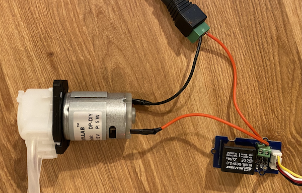

<!--
CO_OP_TRANSLATOR_METADATA:
{
  "original_hash": "f7bb24ba53fb627ddb38a8b24a05e594",
  "translation_date": "2025-08-25T21:23:53+00:00",
  "source_file": "2-farm/lessons/3-automated-plant-watering/README.md",
  "language_code": "de"
}
-->
# Automatische Pflanzenbewässerung


> Sketchnote von [Nitya Narasimhan](https://github.com/nitya). Klicken Sie auf das Bild für eine größere Version.

Diese Lektion wurde als Teil der [IoT for Beginners Project 2 - Digital Agriculture Serie](https://youtube.com/playlist?list=PLmsFUfdnGr3yCutmcVg6eAUEfsGiFXgcx) des [Microsoft Reactor](https://developer.microsoft.com/reactor/?WT.mc_id=academic-17441-jabenn) unterrichtet.

[](https://youtu.be/g9FfZwv9R58)

## Quiz vor der Lektion

[Quiz vor der Lektion](https://black-meadow-040d15503.1.azurestaticapps.net/quiz/13)

## Einführung

In der letzten Lektion haben Sie gelernt, wie man die Bodenfeuchtigkeit überwacht. In dieser Lektion lernen Sie, wie man die Kernkomponenten eines automatisierten Bewässerungssystems baut, das auf die Bodenfeuchtigkeit reagiert. Außerdem erfahren Sie mehr über Zeitsteuerung – wie Sensoren Zeit benötigen, um auf Änderungen zu reagieren, und wie Aktoren Zeit brauchen, um die von Sensoren gemessenen Eigenschaften zu verändern.

In dieser Lektion behandeln wir:

* [Steuerung von Hochleistungsgeräten mit einem Niedrigleistungs-IoT-Gerät](../../../../../2-farm/lessons/3-automated-plant-watering)
* [Steuerung eines Relais](../../../../../2-farm/lessons/3-automated-plant-watering)
* [Steuerung Ihrer Pflanze über MQTT](../../../../../2-farm/lessons/3-automated-plant-watering)
* [Timing von Sensoren und Aktoren](../../../../../2-farm/lessons/3-automated-plant-watering)
* [Hinzufügen von Timing zu Ihrem Pflanzensteuerungsserver](../../../../../2-farm/lessons/3-automated-plant-watering)

## Steuerung von Hochleistungsgeräten mit einem Niedrigleistungs-IoT-Gerät

IoT-Geräte verwenden eine niedrige Spannung. Während dies für Sensoren und Niedrigleistungsaktoren wie LEDs ausreicht, ist es zu wenig, um größere Hardware wie eine Wasserpumpe für die Bewässerung zu steuern. Selbst kleine Pumpen, die Sie für Zimmerpflanzen verwenden könnten, ziehen zu viel Strom für ein IoT-Entwicklungskit und würden die Platine beschädigen.

> 🎓 Strom, gemessen in Ampere (A), ist die Menge an Elektrizität, die durch einen Stromkreis fließt. Spannung sorgt für den Antrieb, Strom ist die Menge, die geschoben wird. Mehr über Strom können Sie auf der [Wikipedia-Seite über elektrischen Strom](https://wikipedia.org/wiki/Electric_current) lesen.

Die Lösung besteht darin, eine Pumpe an eine externe Stromversorgung anzuschließen und einen Aktor zu verwenden, um die Pumpe einzuschalten, ähnlich wie Sie ein Licht einschalten würden. Es braucht nur eine winzige Menge Energie (in Form der Energie in Ihrem Körper), um mit Ihrem Finger einen Schalter umzulegen, und dieser verbindet das Licht mit dem Stromnetz, das mit 110V/240V läuft.


> 🎓 [Netzstrom](https://wikipedia.org/wiki/Mains_electricity) bezeichnet die Elektrizität, die in vielen Teilen der Welt über nationale Infrastrukturen an Haushalte und Unternehmen geliefert wird.

✅ IoT-Geräte können normalerweise 3,3V oder 5V bei weniger als 1 Ampere (1A) Strom liefern. Vergleichen Sie dies mit Netzstrom, der meist bei 230V (120V in Nordamerika und 100V in Japan) liegt und Geräte mit bis zu 30A Strom versorgen kann.

Es gibt eine Reihe von Aktoren, die dies ermöglichen, einschließlich mechanischer Geräte, die Sie an vorhandene Schalter anbringen können, um das Umlegen eines Schalters zu simulieren. Am beliebtesten ist ein Relais.

### Relais

Ein Relais ist ein elektromechanischer Schalter, der ein elektrisches Signal in eine mechanische Bewegung umwandelt, die einen Schalter betätigt. Der Kern eines Relais ist ein Elektromagnet.

> 🎓 [Elektromagnete](https://wikipedia.org/wiki/Electromagnet) sind Magnete, die durch das Leiten von Elektrizität durch eine Drahtspule erzeugt werden. Wenn der Strom eingeschaltet wird, wird die Spule magnetisiert. Wenn der Strom ausgeschaltet wird, verliert die Spule ihre Magnetisierung.


In einem Relais versorgt ein Steuerkreis den Elektromagneten mit Strom. Wenn der Elektromagnet eingeschaltet ist, zieht er einen Hebel, der einen Schalter bewegt, ein Paar Kontakte schließt und einen Ausgangskreis vervollständigt.


Wenn der Steuerkreis ausgeschaltet ist, schaltet sich der Elektromagnet aus, gibt den Hebel frei und öffnet die Kontakte, wodurch der Ausgangskreis ausgeschaltet wird. Relais sind digitale Aktoren – ein hohes Signal schaltet das Relais ein, ein niedriges Signal schaltet es aus.

Der Ausgangskreis kann verwendet werden, um zusätzliche Hardware wie ein Bewässerungssystem mit Strom zu versorgen. Das IoT-Gerät kann das Relais einschalten, den Ausgangskreis schließen, der das Bewässerungssystem mit Strom versorgt, und die Pflanzen werden bewässert. Das IoT-Gerät kann dann das Relais ausschalten, die Stromversorgung des Bewässerungssystems unterbrechen und das Wasser abstellen.


Im obigen Video wird ein Relais eingeschaltet. Eine LED am Relais leuchtet auf, um anzuzeigen, dass es eingeschaltet ist (einige Relaisplatinen haben LEDs, die anzeigen, ob das Relais ein- oder ausgeschaltet ist), und Strom wird zur Pumpe geleitet, die eingeschaltet wird und Wasser in eine Pflanze pumpt.

> 💁 Relais können auch verwendet werden, um zwischen zwei Ausgangskreisen umzuschalten, anstatt einen ein- oder auszuschalten. Wenn sich der Hebel bewegt, bewegt er einen Schalter, der einen Ausgangskreis schließt und einen anderen öffnet, normalerweise mit einer gemeinsamen Strom- oder Masseverbindung.

✅ Machen Sie eine Recherche: Es gibt verschiedene Arten von Relais, mit Unterschieden wie der Steuerung, ob das Relais bei Stromzufuhr ein- oder ausgeschaltet wird, oder mit mehreren Ausgangskreisen. Finden Sie mehr über diese verschiedenen Typen heraus.

Wenn sich der Hebel bewegt, können Sie normalerweise hören, wie er mit einem gut definierten Klickgeräusch Kontakt mit dem Elektromagneten macht.

> 💁 Ein Relais kann so verdrahtet werden, dass das Schließen der Verbindung tatsächlich die Stromzufuhr zum Relais unterbricht, wodurch das Relais ausgeschaltet wird, das dann wieder Strom zum Relais sendet, wodurch es wieder eingeschaltet wird, und so weiter. Dies bedeutet, dass das Relais unglaublich schnell klickt und ein Summgeräusch erzeugt. So funktionierten einige der ersten Summer, die in elektrischen Türklingeln verwendet wurden.

### Relaisleistung

Der Elektromagnet benötigt nicht viel Strom, um aktiviert zu werden und den Hebel zu ziehen. Er kann mit der 3,3V- oder 5V-Ausgabe eines IoT-Entwicklungskits gesteuert werden. Der Ausgangskreis kann jedoch viel mehr Strom führen, je nach Relais, einschließlich Netzspannung oder sogar höherer Leistungsstufen für industrielle Anwendungen. So kann ein IoT-Entwicklungskit ein Bewässerungssystem steuern, von einer kleinen Pumpe für eine einzelne Pflanze bis hin zu einem riesigen industriellen System für eine ganze kommerzielle Farm.


Das obige Bild zeigt ein Grove-Relais. Der Steuerkreis wird an ein IoT-Gerät angeschlossen und schaltet das Relais mit 3,3V oder 5V ein oder aus. Der Ausgangskreis hat zwei Anschlüsse, von denen einer Strom oder Masse sein kann. Der Ausgangskreis kann bis zu 250V bei 10A handhaben, genug für eine Reihe von netzbetriebenen Geräten. Es gibt Relais, die noch höhere Leistungsstufen bewältigen können.



Im obigen Bild wird eine Pumpe über ein Relais mit Strom versorgt. Ein rotes Kabel verbindet den +5V-Anschluss einer USB-Stromversorgung mit einem Anschluss des Ausgangskreises des Relais, und ein weiteres rotes Kabel verbindet den anderen Anschluss des Ausgangskreises mit der Pumpe. Ein schwarzes Kabel verbindet die Pumpe mit der Masse der USB-Stromversorgung. Wenn das Relais eingeschaltet wird, schließt es den Stromkreis, sendet 5V an die Pumpe und schaltet die Pumpe ein.

## Steuerung eines Relais

Sie können ein Relais von Ihrem IoT-Entwicklungskit aus steuern.

### Aufgabe – Steuerung eines Relais

Arbeiten Sie die entsprechende Anleitung durch, um ein Relais mit Ihrem IoT-Gerät zu steuern:

* [Arduino - Wio Terminal](wio-terminal-relay.md)
* [Einplatinencomputer - Raspberry Pi](pi-relay.md)
* [Einplatinencomputer - Virtuelles Gerät](virtual-device-relay.md)

## Steuerung Ihrer Pflanze über MQTT

Bisher wird Ihr Relais direkt vom IoT-Gerät basierend auf einer einzigen Bodenfeuchtigkeitsmessung gesteuert. In einem kommerziellen Bewässerungssystem wird die Steuerlogik zentralisiert, sodass Entscheidungen zur Bewässerung auf Basis von Daten mehrerer Sensoren getroffen werden können und Konfigurationen an einem einzigen Ort geändert werden können. Um dies zu simulieren, können Sie das Relais über MQTT steuern.

### Aufgabe – Steuerung des Relais über MQTT

1. Fügen Sie die entsprechenden MQTT-Bibliotheken/Pip-Pakete und den Code zu Ihrem `soil-moisture-sensor`-Projekt hinzu, um eine Verbindung zu MQTT herzustellen. Benennen Sie die Client-ID als `soilmoisturesensor_client`, vorangestellt mit Ihrer ID.

    > ⚠️ Sie können sich bei Bedarf auf [die Anweisungen zum Herstellen einer Verbindung zu MQTT in Projekt 1, Lektion 4](../../../1-getting-started/lessons/4-connect-internet/README.md#connect-your-iot-device-to-mqtt) beziehen.

1. Fügen Sie den entsprechenden Gerätecode hinzu, um Telemetriedaten mit den Bodenfeuchtigkeitseinstellungen zu senden. Benennen Sie die Eigenschaft der Telemetriedaten als `soil_moisture`.

    > ⚠️ Sie können sich bei Bedarf auf [die Anweisungen zum Senden von Telemetriedaten an MQTT in Projekt 1, Lektion 4](../../../1-getting-started/lessons/4-connect-internet/README.md#send-telemetry-from-your-iot-device) beziehen.

1. Erstellen Sie lokalen Servercode, um Telemetriedaten zu abonnieren und einen Befehl zur Steuerung des Relais zu senden, in einem Ordner namens `soil-moisture-sensor-server`. Benennen Sie die Eigenschaft in der Befehlsnachricht als `relay_on` und setzen Sie die Client-ID als `soilmoisturesensor_server`, vorangestellt mit Ihrer ID. Behalten Sie die gleiche Struktur wie beim Servercode, den Sie für Projekt 1, Lektion 4 geschrieben haben, da Sie diesen Code später in dieser Lektion erweitern werden.

    > ⚠️ Sie können sich bei Bedarf auf [die Anweisungen zum Senden von Telemetriedaten an MQTT](../../../1-getting-started/lessons/4-connect-internet/README.md#write-the-server-code) und [zum Senden von Befehlen über MQTT](../../../1-getting-started/lessons/4-connect-internet/README.md#send-commands-to-the-mqtt-broker) in Projekt 1, Lektion 4 beziehen.

1. Fügen Sie den entsprechenden Gerätecode hinzu, um das Relais basierend auf empfangenen Befehlen zu steuern, und verwenden Sie die Eigenschaft `relay_on` aus der Nachricht. Senden Sie `true` für `relay_on`, wenn die `soil_moisture` größer als 450 ist, andernfalls senden Sie `false`, wie in der Logik, die Sie zuvor für das IoT-Gerät hinzugefügt haben.

    > ⚠️ Sie können sich bei Bedarf auf [die Anweisungen zum Reagieren auf Befehle von MQTT in Projekt 1, Lektion 4](../../../1-getting-started/lessons/4-connect-internet/README.md#handle-commands-on-the-iot-device) beziehen.

> 💁 Sie finden diesen Code im Ordner [code-mqtt](../../../../../2-farm/lessons/3-automated-plant-watering/code-mqtt).

Stellen Sie sicher, dass der Code auf Ihrem Gerät und dem lokalen Server läuft, und testen Sie ihn, indem Sie die Bodenfeuchtigkeitswerte ändern, entweder durch Ändern der Werte, die vom virtuellen Sensor gesendet werden, oder durch Ändern der Feuchtigkeitswerte des Bodens, indem Sie Wasser hinzufügen oder den Sensor aus dem Boden entfernen.

## Timing von Sensoren und Aktoren

In Lektion 3 haben Sie ein Nachtlicht gebaut – eine LED, die sich einschaltet, sobald ein niedriger Lichtpegel von einem Lichtsensor erkannt wird. Der Lichtsensor erkannte eine Änderung der Lichtverhältnisse sofort, und das Gerät konnte schnell reagieren, nur begrenzt durch die Länge der Verzögerung in der `loop`-Funktion oder der `while True:`-Schleife. Als IoT-Entwickler können Sie sich nicht immer auf eine so schnelle Rückkopplungsschleife verlassen.

### Timing für Bodenfeuchtigkeit

Wenn Sie die letzte Lektion zur Bodenfeuchtigkeit mit einem physischen Sensor durchgeführt haben, haben Sie möglicherweise bemerkt, dass es einige Sekunden dauerte, bis der Bodenfeuchtigkeitswert nach dem Gießen Ihrer Pflanze sank. Dies liegt nicht daran, dass der Sensor langsam ist, sondern daran, dass es Zeit braucht, bis das Wasser in den Boden einsickert.
💁 Wenn Sie zu nah am Sensor gegossen haben, haben Sie möglicherweise bemerkt, dass die Messwerte schnell gesunken und dann wieder gestiegen sind – dies wird dadurch verursacht, dass das Wasser in der Nähe des Sensors sich im restlichen Boden verteilt und die Bodenfeuchtigkeit am Sensor verringert.


Im obigen Diagramm zeigt eine Bodenfeuchtigkeitsmessung 658 an. Die Pflanze wird bewässert, aber dieser Wert ändert sich nicht sofort, da das Wasser den Sensor noch nicht erreicht hat. Das Bewässern kann sogar abgeschlossen sein, bevor das Wasser den Sensor erreicht und der Wert sinkt, um den neuen Feuchtigkeitsstand widerzuspiegeln.

Wenn Sie Code schreiben würden, um ein Bewässerungssystem über ein Relais basierend auf Bodenfeuchtigkeitswerten zu steuern, müssten Sie diese Verzögerung berücksichtigen und eine intelligentere Zeitsteuerung in Ihr IoT-Gerät einbauen.

✅ Nehmen Sie sich einen Moment Zeit, um darüber nachzudenken, wie Sie dies umsetzen könnten.

### Steuerung von Sensor- und Aktuatorzeiten

Stellen Sie sich vor, Sie hätten die Aufgabe, ein Bewässerungssystem für eine Farm zu entwickeln. Basierend auf der Bodenart wurde festgestellt, dass der ideale Bodenfeuchtigkeitswert für die angebauten Pflanzen einem analogen Spannungswert von 400-450 entspricht.

Sie könnten das Gerät genauso programmieren wie ein Nachtlicht – immer wenn der Sensor einen Wert über 450 anzeigt, schalten Sie ein Relais ein, um eine Pumpe zu aktivieren. Das Problem ist, dass Wasser eine Weile braucht, um von der Pumpe durch den Boden zum Sensor zu gelangen. Der Sensor stoppt das Wasser, wenn er einen Wert von 450 erkennt, aber der Feuchtigkeitswert wird weiter sinken, da das gepumpte Wasser weiterhin durch den Boden sickert. Das Endergebnis ist verschwendetes Wasser und das Risiko von Wurzelschäden.

✅ Denken Sie daran – zu viel Wasser kann genauso schlecht für Pflanzen sein wie zu wenig und verschwendet eine wertvolle Ressource.

Die bessere Lösung besteht darin, zu verstehen, dass es eine Verzögerung zwischen dem Einschalten des Aktuators und der Änderung der Eigenschaft gibt, die der Sensor misst. Das bedeutet, dass der Sensor nicht nur eine Weile warten sollte, bevor er den Wert erneut misst, sondern der Aktuator auch eine Weile ausgeschaltet bleiben muss, bevor die nächste Sensor-Messung durchgeführt wird.

Wie lange sollte das Relais jedes Mal eingeschaltet sein? Es ist besser, vorsichtig zu sein und das Relais nur für kurze Zeit einzuschalten, dann zu warten, bis das Wasser durchgesickert ist, und dann die Feuchtigkeitswerte erneut zu überprüfen. Schließlich können Sie immer wieder Wasser hinzufügen, aber Sie können kein Wasser aus dem Boden entfernen.

> 💁 Diese Art der Zeitsteuerung ist sehr spezifisch für das IoT-Gerät, das Sie entwickeln, die Eigenschaft, die Sie messen, sowie die verwendeten Sensoren und Aktuatoren.


Zum Beispiel habe ich eine Erdbeerpflanze mit einem Bodenfeuchtigkeitssensor und einer Pumpe, die von einem Relais gesteuert wird. Ich habe beobachtet, dass es etwa 20 Sekunden dauert, bis sich die Bodenfeuchtigkeitsmessung stabilisiert, wenn ich Wasser hinzufüge. Das bedeutet, dass ich das Relais ausschalten und 20 Sekunden warten muss, bevor ich die Feuchtigkeitswerte überprüfe. Ich habe lieber zu wenig Wasser als zu viel – ich kann die Pumpe jederzeit wieder einschalten, aber ich kann kein Wasser aus der Pflanze entfernen.


Das bedeutet, dass der beste Prozess für einen Bewässerungszyklus etwa so aussieht:

* Pumpe für 5 Sekunden einschalten
* 20 Sekunden warten
* Bodenfeuchtigkeit überprüfen
* Wenn der Wert immer noch über dem benötigten Niveau liegt, die obigen Schritte wiederholen

5 Sekunden könnten für die Pumpe zu lang sein, insbesondere wenn die Feuchtigkeitswerte nur leicht über dem erforderlichen Niveau liegen. Der beste Weg, um herauszufinden, welche Zeitsteuerung verwendet werden sollte, ist, es auszuprobieren und dann anzupassen, wenn Sie Sensordaten haben, mit einem konstanten Feedback-Loop. Dies kann sogar zu einer granulareren Zeitsteuerung führen, wie z. B. die Pumpe für 1 Sekunde für jeweils 100 über dem erforderlichen Bodenfeuchtigkeitswert einzuschalten, anstatt für feste 5 Sekunden.

✅ Recherchieren Sie: Gibt es andere zeitliche Überlegungen? Kann die Pflanze jederzeit bewässert werden, wenn die Bodenfeuchtigkeit zu niedrig ist, oder gibt es bestimmte Tageszeiten, die gut oder schlecht für die Bewässerung von Pflanzen sind?

> 💁 Wettervorhersagen können ebenfalls berücksichtigt werden, wenn automatisierte Bewässerungssysteme für den Außenanbau gesteuert werden. Wenn Regen erwartet wird, kann die Bewässerung bis nach dem Regen verschoben werden. Zu diesem Zeitpunkt ist der Boden möglicherweise feucht genug, sodass keine Bewässerung erforderlich ist – viel effizienter, als Wasser zu verschwenden, indem man kurz vor dem Regen bewässert.

## Zeitsteuerung zu Ihrem Pflanzensteuerungsserver hinzufügen

Der Servercode kann so modifiziert werden, dass er die Zeitsteuerung des Bewässerungszyklus und das Warten auf die Änderung der Bodenfeuchtigkeitswerte berücksichtigt. Die Serverlogik zur Steuerung der Relaiszeit ist:

1. Telemetrie-Nachricht empfangen
1. Bodenfeuchtigkeitswert überprüfen
1. Wenn der Wert in Ordnung ist, nichts tun. Wenn der Wert zu hoch ist (was bedeutet, dass die Bodenfeuchtigkeit zu niedrig ist), dann:
    1. Befehl senden, um das Relais einzuschalten
    1. 5 Sekunden warten
    1. Befehl senden, um das Relais auszuschalten
    1. 20 Sekunden warten, bis sich die Bodenfeuchtigkeitswerte stabilisiert haben

Der Bewässerungszyklus, der Prozess vom Empfang der Telemetrie-Nachricht bis zur erneuten Verarbeitung der Bodenfeuchtigkeitswerte, dauert etwa 25 Sekunden. Wir senden alle 10 Sekunden Bodenfeuchtigkeitswerte, sodass es eine Überlappung gibt, bei der eine Nachricht empfangen wird, während der Server darauf wartet, dass sich die Bodenfeuchtigkeitswerte stabilisieren, was einen weiteren Bewässerungszyklus starten könnte.

Es gibt zwei Möglichkeiten, dies zu umgehen:

* Den IoT-Gerätecode so ändern, dass Telemetrie nur jede Minute gesendet wird, damit der Bewässerungszyklus abgeschlossen ist, bevor die nächste Nachricht gesendet wird
* Während des Bewässerungszyklus die Telemetrie abbestellen

Die erste Option ist nicht immer eine gute Lösung für große Farmen. Der Landwirt möchte möglicherweise die Bodenfeuchtigkeitswerte erfassen, während der Boden bewässert wird, um sie später zu analysieren, z. B. um sich des Wasserflusses in verschiedenen Bereichen der Farm bewusst zu sein und gezieltere Bewässerung zu ermöglichen. Die zweite Option ist besser – der Code ignoriert einfach Telemetrie, wenn er sie nicht verwenden kann, aber die Telemetrie ist weiterhin für andere Dienste verfügbar, die sie abonnieren könnten.

> 💁 IoT-Daten werden nicht nur von einem Gerät an einen Dienst gesendet, sondern viele Geräte können Daten an einen Broker senden, und viele Dienste können die Daten vom Broker empfangen. Zum Beispiel könnte ein Dienst Bodenfeuchtigkeitsdaten hören und sie in einer Datenbank für eine spätere Analyse speichern. Ein anderer Dienst könnte dieselbe Telemetrie hören, um ein Bewässerungssystem zu steuern.

### Aufgabe – Zeitsteuerung zu Ihrem Pflanzensteuerungsserver hinzufügen

Aktualisieren Sie Ihren Servercode, um das Relais für 5 Sekunden laufen zu lassen und dann 20 Sekunden zu warten.

1. Öffnen Sie den Ordner `soil-moisture-sensor-server` in VS Code, falls er nicht bereits geöffnet ist. Stellen Sie sicher, dass die virtuelle Umgebung aktiviert ist.

1. Öffnen Sie die Datei `app.py`

1. Fügen Sie den folgenden Code unterhalb der bestehenden Importe in die Datei `app.py` ein:

    ```python
    import threading
    ```

    Diese Anweisung importiert `threading` aus den Python-Bibliotheken. Threading ermöglicht es Python, anderen Code auszuführen, während es wartet.

1. Fügen Sie den folgenden Code vor der Funktion `handle_telemetry` hinzu, die Telemetrie-Nachrichten verarbeitet, die vom Servercode empfangen werden:

    ```python
    water_time = 5
    wait_time = 20
    ```

    Dies definiert, wie lange das Relais laufen soll (`water_time`) und wie lange danach gewartet werden soll, um die Bodenfeuchtigkeit zu überprüfen (`wait_time`).

1. Fügen Sie unterhalb dieses Codes Folgendes hinzu:

    ```python
    def send_relay_command(client, state):
        command = { 'relay_on' : state }
        print("Sending message:", command)
        client.publish(server_command_topic, json.dumps(command))
    ```

    Dieser Code definiert eine Funktion namens `send_relay_command`, die einen Befehl über MQTT sendet, um das Relais zu steuern. Die Telemetrie wird als Wörterbuch erstellt und dann in einen JSON-String umgewandelt. Der Wert, der in `state` übergeben wird, bestimmt, ob das Relais ein- oder ausgeschaltet werden soll.

1. Fügen Sie nach der Funktion `send_relay_code` den folgenden Code hinzu:

    ```python
    def control_relay(client):
        print("Unsubscribing from telemetry")
        mqtt_client.unsubscribe(client_telemetry_topic)
    
        send_relay_command(client, True)
        time.sleep(water_time)
        send_relay_command(client, False)
    
        time.sleep(wait_time)
    
        print("Subscribing to telemetry")
        mqtt_client.subscribe(client_telemetry_topic)
    ```

    Dies definiert eine Funktion zur Steuerung des Relais basierend auf der erforderlichen Zeitsteuerung. Sie beginnt damit, die Telemetrie abzubestellen, sodass Bodenfeuchtigkeitsnachrichten nicht verarbeitet werden, während die Bewässerung stattfindet. Anschließend sendet sie einen Befehl, um das Relais einzuschalten. Danach wartet sie für die `water_time`, bevor sie einen Befehl sendet, um das Relais auszuschalten. Schließlich wartet sie für `wait_time` Sekunden, bis sich die Bodenfeuchtigkeitswerte stabilisiert haben. Danach wird die Telemetrie erneut abonniert.

1. Ändern Sie die Funktion `handle_telemetry` wie folgt:

    ```python
    def handle_telemetry(client, userdata, message):
        payload = json.loads(message.payload.decode())
        print("Message received:", payload)
    
        if payload['soil_moisture'] > 450:
            threading.Thread(target=control_relay, args=(client,)).start()
    ```

    Dieser Code überprüft den Bodenfeuchtigkeitswert. Wenn er größer als 450 ist, benötigt der Boden Wasser, und die Funktion `control_relay` wird aufgerufen. Diese Funktion wird in einem separaten Thread ausgeführt, der im Hintergrund läuft.

1. Stellen Sie sicher, dass Ihr IoT-Gerät läuft, und führen Sie dann diesen Code aus. Ändern Sie die Bodenfeuchtigkeitswerte und beobachten Sie, was mit dem Relais passiert – es sollte für 5 Sekunden eingeschaltet werden und dann mindestens 20 Sekunden ausgeschaltet bleiben, wobei es nur eingeschaltet wird, wenn die Bodenfeuchtigkeitswerte nicht ausreichen.

    ```output
    (.venv) ➜  soil-moisture-sensor-server ✗ python app.py
    Message received: {'soil_moisture': 457}
    Unsubscribing from telemetry
    Sending message: {'relay_on': True}
    Sending message: {'relay_on': False}
    Subscribing to telemetry
    Message received: {'soil_moisture': 302}
    ```

    Eine gute Möglichkeit, dies in einem simulierten Bewässerungssystem zu testen, besteht darin, trockenen Boden zu verwenden und dann manuell Wasser hinzuzufügen, während das Relais eingeschaltet ist, und das Hinzufügen von Wasser zu stoppen, wenn das Relais ausgeschaltet wird.

> 💁 Sie finden diesen Code im Ordner [code-timing](../../../../../2-farm/lessons/3-automated-plant-watering/code-timing).

> 💁 Wenn Sie eine Pumpe verwenden möchten, um ein echtes Bewässerungssystem zu bauen, können Sie eine [6V-Wasserpumpe](https://www.seeedstudio.com/6V-Mini-Water-Pump-p-1945.html) mit einer [USB-Terminal-Stromversorgung](https://www.adafruit.com/product/3628) verwenden. Stellen Sie sicher, dass die Stromversorgung zur oder von der Pumpe über das Relais verbunden ist.

---

## 🚀 Herausforderung

Können Sie sich andere IoT- oder elektrische Geräte vorstellen, die ein ähnliches Problem haben, bei dem es eine Weile dauert, bis die Ergebnisse des Aktuators den Sensor erreichen? Sie haben wahrscheinlich ein paar davon in Ihrem Haus oder Ihrer Schule.

* Welche Eigenschaften messen sie?
* Wie lange dauert es, bis sich die Eigenschaft nach der Verwendung eines Aktuators ändert?
* Ist es in Ordnung, wenn sich die Eigenschaft über den erforderlichen Wert hinaus ändert?
* Wie kann sie bei Bedarf wieder auf den erforderlichen Wert zurückgebracht werden?

## Quiz nach der Vorlesung

[Quiz nach der Vorlesung](https://black-meadow-040d15503.1.azurestaticapps.net/quiz/14)

## Überprüfung & Selbststudium

* Lesen Sie mehr über Relais, einschließlich ihrer historischen Verwendung in Telefonvermittlungen, auf der [Wikipedia-Seite über Relais](https://wikipedia.org/wiki/Relay).

## Aufgabe

[Entwickeln Sie einen effizienteren Bewässerungszyklus](assignment.md)

**Haftungsausschluss**:  
Dieses Dokument wurde mit dem KI-Übersetzungsdienst [Co-op Translator](https://github.com/Azure/co-op-translator) übersetzt. Obwohl wir uns um Genauigkeit bemühen, beachten Sie bitte, dass automatisierte Übersetzungen Fehler oder Ungenauigkeiten enthalten können. Das Originaldokument in seiner ursprünglichen Sprache sollte als maßgebliche Quelle betrachtet werden. Für kritische Informationen wird eine professionelle menschliche Übersetzung empfohlen. Wir übernehmen keine Haftung für Missverständnisse oder Fehlinterpretationen, die sich aus der Nutzung dieser Übersetzung ergeben.