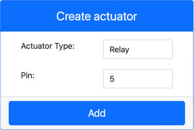

<!--
CO_OP_TRANSLATOR_METADATA:
{
  "original_hash": "f8f541ee945545017a51aaf309aa37c3",
  "translation_date": "2025-08-25T21:28:48+00:00",
  "source_file": "2-farm/lessons/3-automated-plant-watering/virtual-device-relay.md",
  "language_code": "de"
}
-->
# Steuerung eines Relais - Virtuelle IoT-Hardware

In diesem Teil der Lektion fügen Sie Ihrem virtuellen IoT-Gerät zusätzlich zum Bodenfeuchtigkeitssensor ein Relais hinzu und steuern es basierend auf dem Bodenfeuchtigkeitswert.

## Virtuelle Hardware

Das virtuelle IoT-Gerät wird ein simuliertes Grove-Relais verwenden. Dies hält das Labor identisch mit der Verwendung eines Raspberry Pi mit einem physischen Grove-Relais.

Bei einem physischen IoT-Gerät wäre das Relais ein normalerweise offenes Relais (das bedeutet, dass der Ausgangskreis offen oder getrennt ist, wenn kein Signal an das Relais gesendet wird). Ein solches Relais kann Ausgangskreise bis zu 250V und 10A handhaben.

### Relais zu CounterFit hinzufügen

Um ein virtuelles Relais zu verwenden, müssen Sie es zur CounterFit-App hinzufügen.

#### Aufgabe

Fügen Sie das Relais zur CounterFit-App hinzu.

1. Öffnen Sie das `soil-moisture-sensor`-Projekt aus der letzten Lektion in VS Code, falls es noch nicht geöffnet ist. Sie werden dieses Projekt erweitern.

1. Stellen Sie sicher, dass die CounterFit-Web-App läuft.

1. Erstellen Sie ein Relais:

    1. Wählen Sie im Feld *Create actuator* im Bereich *Actuators* im Dropdown-Menü *Actuator type* die Option *Relay* aus.

    1. Setzen Sie den *Pin* auf *5*.

    1. Wählen Sie die Schaltfläche **Add**, um das Relais auf Pin 5 zu erstellen.

    

    Das Relais wird erstellt und erscheint in der Aktuatorenliste.

    

## Relais programmieren

Die Bodenfeuchtigkeitssensor-App kann jetzt so programmiert werden, dass sie das virtuelle Relais verwendet.

### Aufgabe

Programmieren Sie das virtuelle Gerät.

1. Öffnen Sie das `soil-moisture-sensor`-Projekt aus der letzten Lektion in VS Code, falls es noch nicht geöffnet ist. Sie werden dieses Projekt erweitern.

1. Fügen Sie den folgenden Code unter den bestehenden Imports in die Datei `app.py` ein:

    ```python
    from counterfit_shims_grove.grove_relay import GroveRelay
    ```

    Diese Anweisung importiert das `GroveRelay` aus den Grove Python Shim-Bibliotheken, um mit dem virtuellen Grove-Relais zu interagieren.

1. Fügen Sie den folgenden Code unter der Deklaration der `ADC`-Klasse ein, um eine `GroveRelay`-Instanz zu erstellen:

    ```python
    relay = GroveRelay(5)
    ```

    Dies erstellt ein Relais, das Pin **5** verwendet, den Pin, an den Sie das Relais angeschlossen haben.

1. Um zu testen, ob das Relais funktioniert, fügen Sie Folgendes in die `while True:`-Schleife ein:

    ```python
    relay.on()
    time.sleep(.5)
    relay.off()
    ```

    Der Code schaltet das Relais ein, wartet 0,5 Sekunden und schaltet es dann wieder aus.

1. Führen Sie die Python-App aus. Das Relais wird alle 10 Sekunden ein- und ausgeschaltet, mit einer halben Sekunde Verzögerung zwischen Ein- und Ausschalten. Sie werden sehen, wie das virtuelle Relais in der CounterFit-App geschlossen und geöffnet wird, wenn das Relais ein- und ausgeschaltet wird.

    

## Relais basierend auf Bodenfeuchtigkeit steuern

Jetzt, da das Relais funktioniert, kann es basierend auf den Bodenfeuchtigkeitswerten gesteuert werden.

### Aufgabe

Steuern Sie das Relais.

1. Löschen Sie die 3 Codezeilen, die Sie hinzugefügt haben, um das Relais zu testen. Ersetzen Sie sie durch den folgenden Code an derselben Stelle:

    ```python
    if soil_moisture > 450:
        print("Soil Moisture is too low, turning relay on.")
        relay.on()
    else:
        print("Soil Moisture is ok, turning relay off.")
        relay.off()
    ```

    Dieser Code überprüft den Bodenfeuchtigkeitswert vom Bodenfeuchtigkeitssensor. Wenn er über 450 liegt, wird das Relais eingeschaltet, und wenn er unter 450 fällt, wird es ausgeschaltet.

    > 💁 Denken Sie daran: Der kapazitive Bodenfeuchtigkeitssensor liest niedrigere Werte, je mehr Feuchtigkeit im Boden vorhanden ist, und umgekehrt.

1. Führen Sie die Python-App aus. Sie werden sehen, wie das Relais je nach Bodenfeuchtigkeitswerten ein- oder ausgeschaltet wird. Ändern Sie die *Value*- oder *Random*-Einstellungen des Bodenfeuchtigkeitssensors, um den Wert zu ändern.

    ```output
    Soil Moisture: 638
    Soil Moisture is too low, turning relay on.
    Soil Moisture: 452
    Soil Moisture is too low, turning relay on.
    Soil Moisture: 347
    Soil Moisture is ok, turning relay off.
    ```

> 💁 Sie finden diesen Code im Ordner [code-relay/virtual-device](../../../../../2-farm/lessons/3-automated-plant-watering/code-relay/virtual-device).

😀 Ihr Programm zur Steuerung eines virtuellen Bodenfeuchtigkeitssensors mit einem Relais war ein Erfolg!

**Haftungsausschluss**:  
Dieses Dokument wurde mit dem KI-Übersetzungsdienst [Co-op Translator](https://github.com/Azure/co-op-translator) übersetzt. Obwohl wir uns um Genauigkeit bemühen, beachten Sie bitte, dass automatisierte Übersetzungen Fehler oder Ungenauigkeiten enthalten können. Das Originaldokument in seiner ursprünglichen Sprache sollte als maßgebliche Quelle betrachtet werden. Für kritische Informationen wird eine professionelle menschliche Übersetzung empfohlen. Wir übernehmen keine Haftung für Missverständnisse oder Fehlinterpretationen, die sich aus der Nutzung dieser Übersetzung ergeben.