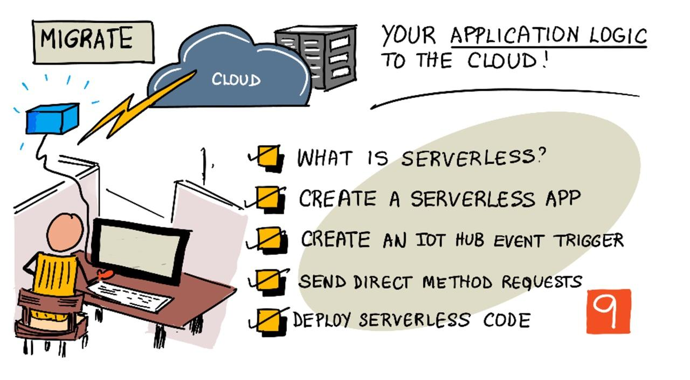

<!--
CO_OP_TRANSLATOR_METADATA:
{
  "original_hash": "5f2d2f4a5a023c93ab34a0cc5b47c0c4",
  "translation_date": "2025-08-25T21:30:50+00:00",
  "source_file": "2-farm/lessons/5-migrate-application-to-the-cloud/README.md",
  "language_code": "de"
}
-->
# Migrieren Sie Ihre Anwendungslogik in die Cloud



> Sketchnote von [Nitya Narasimhan](https://github.com/nitya). Klicken Sie auf das Bild für eine größere Version.

Diese Lektion wurde als Teil der [IoT für Anfänger Projekt 2 - Digital Agriculture Serie](https://youtube.com/playlist?list=PLmsFUfdnGr3yCutmcVg6eAUEfsGiFXgcx) vom [Microsoft Reactor](https://developer.microsoft.com/reactor/?WT.mc_id=academic-17441-jabenn) unterrichtet.

[](https://youtu.be/VVZDcs5u1_I)

## Quiz vor der Lektion

[Quiz vor der Lektion](https://black-meadow-040d15503.1.azurestaticapps.net/quiz/17)

## Einführung

In der letzten Lektion haben Sie gelernt, wie Sie die Überwachung der Bodenfeuchtigkeit Ihrer Pflanzen und die Relaissteuerung mit einem cloudbasierten IoT-Dienst verbinden. Der nächste Schritt besteht darin, den Servercode, der die Zeitsteuerung des Relais kontrolliert, in die Cloud zu verlagern. In dieser Lektion lernen Sie, wie Sie dies mit serverlosen Funktionen umsetzen können.

In dieser Lektion behandeln wir:

* [Was ist Serverless?](../../../../../2-farm/lessons/5-migrate-application-to-the-cloud)
* [Erstellen einer serverlosen Anwendung](../../../../../2-farm/lessons/5-migrate-application-to-the-cloud)
* [Erstellen eines IoT Hub-Ereignisauslösers](../../../../../2-farm/lessons/5-migrate-application-to-the-cloud)
* [Senden von direkten Methodenanforderungen aus serverlosem Code](../../../../../2-farm/lessons/5-migrate-application-to-the-cloud)
* [Bereitstellen Ihres serverlosen Codes in der Cloud](../../../../../2-farm/lessons/5-migrate-application-to-the-cloud)

## Was ist Serverless?

Serverless, oder serverloses Computing, bedeutet, kleine Codeblöcke zu erstellen, die in der Cloud als Reaktion auf verschiedene Arten von Ereignissen ausgeführt werden. Wenn das Ereignis eintritt, wird Ihr Code ausgeführt und erhält Daten über das Ereignis. Diese Ereignisse können von vielen verschiedenen Quellen stammen, einschließlich Webanfragen, Nachrichten in einer Warteschlange, Änderungen an Daten in einer Datenbank oder Nachrichten, die von IoT-Geräten an einen IoT-Dienst gesendet werden.


> 💁 Wenn Sie zuvor Datenbank-Trigger verwendet haben, können Sie sich dies ähnlich vorstellen: Code wird durch ein Ereignis wie das Einfügen einer Zeile ausgelöst.


Ihr Code wird nur ausgeführt, wenn das Ereignis eintritt; zu anderen Zeiten bleibt er inaktiv. Das Ereignis tritt ein, Ihr Code wird geladen und ausgeführt. Dies macht Serverless sehr skalierbar – wenn viele Ereignisse gleichzeitig auftreten, kann der Cloud-Anbieter Ihre Funktion so oft wie nötig gleichzeitig auf beliebigen verfügbaren Servern ausführen. Der Nachteil ist, dass Sie, wenn Sie Informationen zwischen Ereignissen teilen müssen, diese irgendwo speichern müssen, z. B. in einer Datenbank, anstatt sie im Speicher zu halten.

Ihr Code wird als Funktion geschrieben, die Details über das Ereignis als Parameter erhält. Sie können eine Vielzahl von Programmiersprachen verwenden, um diese serverlosen Funktionen zu schreiben.

> 🎓 Serverless wird auch als Functions as a Service (FaaS) bezeichnet, da jeder Ereignisauslöser als Funktion im Code implementiert wird.

Trotz des Namens verwendet Serverless tatsächlich Server. Der Name kommt daher, dass Sie als Entwickler sich nicht um die Server kümmern müssen, die benötigt werden, um Ihren Code auszuführen. Alles, was Sie interessiert, ist, dass Ihr Code als Reaktion auf ein Ereignis ausgeführt wird. Der Cloud-Anbieter hat eine serverlose *Runtime*, die die Zuweisung von Servern, Netzwerk, Speicher, CPU, Arbeitsspeicher und alles andere, was zur Ausführung Ihres Codes erforderlich ist, verwaltet. Dieses Modell bedeutet, dass Sie nicht pro Server für den Dienst bezahlen können, da es keinen Server gibt. Stattdessen zahlen Sie für die Zeit, in der Ihr Code ausgeführt wird, und die Menge an genutztem Speicher.

> 💰 Serverless ist eine der günstigsten Möglichkeiten, Code in der Cloud auszuführen. Zum Beispiel erlaubt ein Cloud-Anbieter zum Zeitpunkt des Schreibens, dass alle Ihre serverlosen Funktionen zusammen 1.000.000 Mal pro Monat ausgeführt werden, bevor Kosten anfallen. Danach werden US$0,20 für jeweils 1.000.000 Ausführungen berechnet. Wenn Ihr Code nicht läuft, zahlen Sie nichts.

Für IoT-Entwickler ist das serverlose Modell ideal. Sie können eine Funktion schreiben, die auf Nachrichten reagiert, die von einem beliebigen IoT-Gerät gesendet werden, das mit Ihrem cloudbasierten IoT-Dienst verbunden ist. Ihr Code wird alle gesendeten Nachrichten verarbeiten, aber nur dann ausgeführt, wenn er benötigt wird.

✅ Schauen Sie sich den Code an, den Sie als Servercode geschrieben haben, der Nachrichten über MQTT empfängt. Wie könnte dieser Code in der Cloud mit Serverless ausgeführt werden? Wie könnte der Code geändert werden, um serverloses Computing zu unterstützen?

> 💁 Das serverlose Modell wird auch auf andere Cloud-Dienste ausgeweitet, zusätzlich zur Codeausführung. Zum Beispiel sind serverlose Datenbanken in der Cloud verfügbar, die ein serverloses Preismodell verwenden, bei dem Sie pro Anfrage gegen die Datenbank zahlen, wie z. B. eine Abfrage oder ein Einfügen. Die Preise basieren in der Regel darauf, wie viel Arbeit erforderlich ist, um die Anfrage zu bearbeiten. Zum Beispiel kostet eine einzelne Auswahl einer Zeile anhand eines Primärschlüssels weniger als eine komplizierte Operation, die viele Tabellen verbindet und Tausende von Zeilen zurückgibt.

## Erstellen einer serverlosen Anwendung

Der serverlose Computing-Dienst von Microsoft heißt Azure Functions.


Das kurze Video unten bietet eine Übersicht über Azure Functions.

[](https://www.youtube.com/watch?v=8-jz5f_JyEQ)

> 🎥 Klicken Sie auf das Bild oben, um das Video anzusehen.

✅ Nehmen Sie sich einen Moment Zeit, um zu recherchieren und lesen Sie die Übersicht über Azure Functions in der [Microsoft Azure Functions Dokumentation](https://docs.microsoft.com/azure/azure-functions/functions-overview?WT.mc_id=academic-17441-jabenn).

Um Azure Functions zu schreiben, beginnen Sie mit einer Azure Functions-App in der Sprache Ihrer Wahl. Azure Functions unterstützt standardmäßig Python, JavaScript, TypeScript, C#, F#, Java und Powershell. In dieser Lektion lernen Sie, wie Sie eine Azure Functions-App in Python schreiben.

> 💁 Azure Functions unterstützt auch benutzerdefinierte Handler, sodass Sie Ihre Funktionen in jeder Sprache schreiben können, die HTTP-Anfragen unterstützt, einschließlich älterer Sprachen wie COBOL.

Functions-Apps bestehen aus einem oder mehreren *Triggers* – Funktionen, die auf Ereignisse reagieren. Sie können mehrere Trigger in einer Functions-App haben, die alle eine gemeinsame Konfiguration teilen. Zum Beispiel können Sie in der Konfigurationsdatei Ihrer Functions-App die Verbindungsdetails Ihres IoT Hubs haben, und alle Funktionen in der App können diese verwenden, um sich zu verbinden und auf Ereignisse zu hören.

### Aufgabe – Installieren der Azure Functions-Tools

> Zum Zeitpunkt des Schreibens funktionieren die Azure Functions-Code-Tools mit Python-Projekten nicht vollständig auf Apple Silicon. Sie müssen stattdessen einen Intel-basierten Mac, Windows-PC oder Linux-PC verwenden.

Ein großartiges Feature von Azure Functions ist, dass Sie sie lokal ausführen können. Die gleiche Runtime, die in der Cloud verwendet wird, kann auf Ihrem Computer ausgeführt werden, sodass Sie Code schreiben können, der auf IoT-Nachrichten reagiert, und ihn lokal ausführen. Sie können Ihren Code sogar debuggen, während Ereignisse verarbeitet werden. Sobald Sie mit Ihrem Code zufrieden sind, kann er in die Cloud bereitgestellt werden.

Die Azure Functions-Tools sind als CLI verfügbar, bekannt als Azure Functions Core Tools.

1. Installieren Sie die Azure Functions Core Tools, indem Sie den Anweisungen in der [Azure Functions Core Tools Dokumentation](https://docs.microsoft.com/azure/azure-functions/functions-run-local?WT.mc_id=academic-17441-jabenn) folgen.

1. Installieren Sie die Azure Functions-Erweiterung für VS Code. Diese Erweiterung bietet Unterstützung für das Erstellen, Debuggen und Bereitstellen von Azure Functions. Lesen Sie die [Azure Functions-Erweiterungsdokumentation](https://marketplace.visualstudio.com/items?WT.mc_id=academic-17441-jabenn&itemName=ms-azuretools.vscode-azurefunctions) für Anweisungen zur Installation dieser Erweiterung in VS Code.

Wenn Sie Ihre Azure Functions-App in der Cloud bereitstellen, benötigt sie eine kleine Menge Cloud-Speicher, um Dinge wie Anwendungsdateien und Protokolldateien zu speichern. Wenn Sie Ihre Functions-App lokal ausführen, müssen Sie dennoch eine Verbindung zu Cloud-Speicher herstellen. Statt tatsächlichem Cloud-Speicher können Sie jedoch einen Speicheremulator namens [Azurite](https://github.com/Azure/Azurite) verwenden. Dieser läuft lokal, verhält sich aber wie Cloud-Speicher.

> 🎓 In Azure ist der Speicher, den Azure Functions verwendet, ein Azure Storage Account. Diese Konten können Dateien, Blobs, Daten in Tabellen oder Daten in Warteschlangen speichern. Sie können ein Storage Account zwischen vielen Apps teilen, wie z. B. einer Functions-App und einer Web-App.

1. Azurite ist eine Node.js-App, daher müssen Sie Node.js installieren. Sie finden die Download- und Installationsanweisungen auf der [Node.js-Website](https://nodejs.org/). Wenn Sie einen Mac verwenden, können Sie es auch über [Homebrew](https://formulae.brew.sh/formula/node) installieren.

1. Installieren Sie Azurite mit folgendem Befehl (`npm` ist ein Tool, das bei der Installation von Node.js installiert wird):

    ```sh
    npm install -g azurite
    ```

1. Erstellen Sie einen Ordner namens `azurite`, den Azurite zum Speichern von Daten verwenden soll:

    ```sh
    mkdir azurite
    ```

1. Starten Sie Azurite und übergeben Sie ihm diesen neuen Ordner:

    ```sh
    azurite --location azurite
    ```

    Der Azurite-Speicheremulator wird gestartet und ist bereit, sich mit der lokalen Functions-Runtime zu verbinden.

    ```output
    ➜  ~ azurite --location azurite  
    Azurite Blob service is starting at http://127.0.0.1:10000
    Azurite Blob service is successfully listening at http://127.0.0.1:10000
    Azurite Queue service is starting at http://127.0.0.1:10001
    Azurite Queue service is successfully listening at http://127.0.0.1:10001
    Azurite Table service is starting at http://127.0.0.1:10002
    Azurite Table service is successfully listening at http://127.0.0.1:10002
    ```

### Aufgabe – Erstellen eines Azure Functions-Projekts

Die Azure Functions CLI kann verwendet werden, um eine neue Functions-App zu erstellen.

1. Erstellen Sie einen Ordner für Ihre Functions-App und navigieren Sie zu diesem. Nennen Sie ihn `soil-moisture-trigger`.

    ```sh
    mkdir soil-moisture-trigger
    cd soil-moisture-trigger
    ```

1. Erstellen Sie eine Python-virtuelle Umgebung in diesem Ordner:

    ```sh
    python3 -m venv .venv
    ```

1. Aktivieren Sie die virtuelle Umgebung:

    * Unter Windows:
        * Wenn Sie die Eingabeaufforderung oder die Eingabeaufforderung über Windows Terminal verwenden, führen Sie aus:

            ```cmd
            .venv\Scripts\activate.bat
            ```

        * Wenn Sie PowerShell verwenden, führen Sie aus:

            ```powershell
            .\.venv\Scripts\Activate.ps1
            ```

    * Unter macOS oder Linux führen Sie aus:

        ```cmd
        source ./.venv/bin/activate
        ```

    > 💁 Diese Befehle sollten von demselben Ort aus ausgeführt werden, an dem Sie den Befehl zum Erstellen der virtuellen Umgebung ausgeführt haben. Sie müssen niemals in den `.venv`-Ordner navigieren. Sie sollten immer den Aktivierungsbefehl und alle Befehle zum Installieren von Paketen oder Ausführen von Code von dem Ordner aus ausführen, in dem Sie die virtuelle Umgebung erstellt haben.

1. Führen Sie den folgenden Befehl aus, um eine Functions-App in diesem Ordner zu erstellen:

    ```sh
    func init --worker-runtime python soil-moisture-trigger
    ```

    Dadurch werden drei Dateien im aktuellen Ordner erstellt:

    * `host.json` – dieses JSON-Dokument enthält Einstellungen für Ihre Functions-App. Sie müssen diese Einstellungen nicht ändern.
    * `local.settings.json` – dieses JSON-Dokument enthält Einstellungen, die Ihre App beim lokalen Ausführen verwenden würde, wie z. B. Verbindungszeichenfolgen für Ihren IoT Hub. Diese Einstellungen sind nur lokal und sollten nicht in die Quellcodeverwaltung aufgenommen werden. Wenn Sie die App in der Cloud bereitstellen, werden diese Einstellungen nicht bereitgestellt. Stattdessen werden Ihre Einstellungen aus den Anwendungseinstellungen geladen. Dies wird später in dieser Lektion behandelt.
    * `requirements.txt` – dies ist eine [Pip-Anforderungsdatei](https://pip.pypa.io/en/stable/user_guide/#requirements-files), die die Pip-Pakete enthält, die zum Ausführen Ihrer Functions-App erforderlich sind.

1. Die Datei `local.settings.json` hat eine Einstellung für das Speicherkonto, das die Functions-App verwenden wird. Diese Einstellung ist standardmäßig leer und muss gesetzt werden. Um eine Verbindung zum lokalen Speicheremulator Azurite herzustellen, setzen Sie diesen Wert auf Folgendes:

    ```json
    "AzureWebJobsStorage": "UseDevelopmentStorage=true",
    ```

1. Installieren Sie die erforderlichen Pip-Pakete mit der Anforderungsdatei:

    ```sh
    pip install -r requirements.txt
    ```

    > 💁 Die erforderlichen Pip-Pakete müssen in dieser Datei enthalten sein, damit die Runtime beim Bereitstellen der Functions-App in der Cloud sicherstellen kann, dass sie die richtigen Pakete installiert.

1. Um zu testen, ob alles korrekt funktioniert, können Sie die Functions-Runtime starten. Führen Sie den folgenden Befehl aus, um dies zu tun:

    ```sh
    func start
    ```

    Sie werden sehen, wie die Runtime startet und meldet, dass sie keine Jobfunktionen (Trigger) gefunden hat.

    ```output
    (.venv) ➜  soil-moisture-trigger func start
    Found Python version 3.9.1 (python3).
    
    Azure Functions Core Tools
    Core Tools Version:       3.0.3442 Commit hash: 6bfab24b2743f8421475d996402c398d2fe4a9e0  (64-bit)
    Function Runtime Version: 3.0.15417.0
    
    [2021-05-05T01:24:46.795Z] No job functions found.
    ```
> ⚠️ Wenn Sie eine Firewall-Benachrichtigung erhalten, gewähren Sie Zugriff, da die Anwendung `func` Zugriff auf Ihr Netzwerk benötigt, um lesen und schreiben zu können.
> ⚠️ Wenn Sie macOS verwenden, können Warnungen im Output erscheinen:
>
> ```output
    > (.venv) ➜  soil-moisture-trigger func start
    > Found Python version 3.9.1 (python3).
    >
    > Azure Functions Core Tools
    > Core Tools Version:       3.0.3442 Commit hash: 6bfab24b2743f8421475d996402c398d2fe4a9e0  (64-bit)
    > Function Runtime Version: 3.0.15417.0
    >
    > [2021-06-16T08:18:28.315Z] Cannot create directory for shared memory usage: /dev/shm/AzureFunctions
    > [2021-06-16T08:18:28.316Z] System.IO.FileSystem: Access to the path '/dev/shm/AzureFunctions' is denied. Operation not permitted.
    > [2021-06-16T08:18:30.361Z] No job functions found.
    > ```
>
> Diese können ignoriert werden, solange die Functions-App korrekt startet und die laufenden Funktionen auflistet. Wie in [dieser Frage auf Microsoft Docs Q&A](https://docs.microsoft.com/answers/questions/396617/azure-functions-core-tools-error-osx-devshmazurefu.html?WT.mc_id=academic-17441-jabenn) erwähnt, können diese ignoriert werden.

1. Stoppen Sie die Functions-App, indem Sie `ctrl+c` drücken.

1. Öffnen Sie den aktuellen Ordner in VS Code, entweder indem Sie VS Code öffnen und dann diesen Ordner öffnen oder indem Sie den folgenden Befehl ausführen:

    ```sh
    code .
    ```

    VS Code erkennt Ihr Functions-Projekt und zeigt eine Benachrichtigung an, die besagt:

    ```output
    Detected an Azure Functions Project in folder "soil-moisture-trigger" that may have been created outside of
    VS Code. Initialize for optimal use with VS Code?
    ```

    

    Wählen Sie **Ja** in dieser Benachrichtigung aus.

1. Stellen Sie sicher, dass die Python-virtuelle Umgebung im VS Code-Terminal läuft. Beenden und starten Sie sie bei Bedarf neu.

## Erstellen eines IoT Hub Event-Triggers

Die Functions-App ist die Hülle Ihres serverlosen Codes. Um auf IoT Hub-Ereignisse zu reagieren, können Sie dieser App einen IoT Hub-Trigger hinzufügen. Dieser Trigger muss sich mit dem Nachrichtenstrom verbinden, der an den IoT Hub gesendet wird, und darauf reagieren. Um diesen Nachrichtenstrom zu erhalten, muss Ihr Trigger sich mit dem *Event Hub-kompatiblen Endpunkt* des IoT Hubs verbinden.

IoT Hub basiert auf einem anderen Azure-Dienst namens Azure Event Hubs. Event Hubs ist ein Dienst, der das Senden und Empfangen von Nachrichten ermöglicht. IoT Hub erweitert dies um Funktionen für IoT-Geräte. Die Art und Weise, wie Sie sich verbinden, um Nachrichten vom IoT Hub zu lesen, ist dieselbe wie bei der Verwendung von Event Hubs.

✅ Machen Sie eine Recherche: Lesen Sie die Übersicht über Event Hubs in der [Azure Event Hubs-Dokumentation](https://docs.microsoft.com/azure/event-hubs/event-hubs-about?WT.mc_id=academic-17441-jabenn). Wie vergleichen sich die grundlegenden Funktionen mit dem IoT Hub?

Damit sich ein IoT-Gerät mit dem IoT Hub verbinden kann, muss es einen geheimen Schlüssel verwenden, der sicherstellt, dass nur zugelassene Geräte eine Verbindung herstellen können. Dasselbe gilt, wenn Sie sich verbinden, um Nachrichten zu lesen. Ihr Code benötigt eine Verbindungszeichenfolge, die einen geheimen Schlüssel sowie Details des IoT Hubs enthält.

> 💁 Die Standard-Verbindungszeichenfolge, die Sie erhalten, hat **iothubowner**-Berechtigungen, die jedem Code, der sie verwendet, vollständige Berechtigungen für den IoT Hub geben. Idealerweise sollten Sie sich mit dem niedrigsten erforderlichen Berechtigungsniveau verbinden. Dies wird in der nächsten Lektion behandelt.

Sobald Ihr Trigger verbunden ist, wird der Code innerhalb der Funktion für jede Nachricht aufgerufen, die an den IoT Hub gesendet wird, unabhängig davon, welches Gerät sie gesendet hat. Der Trigger wird die Nachricht als Parameter übergeben.

### Aufgabe - Holen Sie sich die Event Hub-kompatible Endpunkt-Verbindungszeichenfolge

1. Führen Sie im VS Code-Terminal den folgenden Befehl aus, um die Verbindungszeichenfolge für den Event Hub-kompatiblen Endpunkt des IoT Hubs zu erhalten:

    ```sh
    az iot hub connection-string show --default-eventhub \
                                      --output table \
                                      --hub-name <hub_name>
    ```

    Ersetzen Sie `<hub_name>` durch den Namen, den Sie für Ihren IoT Hub verwendet haben.

1. Öffnen Sie in VS Code die Datei `local.settings.json`. Fügen Sie den folgenden zusätzlichen Wert innerhalb des Abschnitts `Values` hinzu:

    ```json
    "IOT_HUB_CONNECTION_STRING": "<connection string>"
    ```

    Ersetzen Sie `<connection string>` durch den Wert aus dem vorherigen Schritt. Sie müssen nach der vorherigen Zeile ein Komma hinzufügen, um gültiges JSON zu erstellen.

### Aufgabe - Erstellen eines Event-Triggers

Sie sind jetzt bereit, den Event-Trigger zu erstellen.

1. Führen Sie im VS Code-Terminal den folgenden Befehl aus dem Ordner `soil-moisture-trigger` aus:

    ```sh
    func new --name iot-hub-trigger --template "Azure Event Hub trigger"
    ```

    Dies erstellt eine neue Funktion namens `iot-hub-trigger`. Der Trigger wird sich mit dem Event Hub-kompatiblen Endpunkt des IoT Hubs verbinden, sodass Sie einen Event Hub-Trigger verwenden können. Es gibt keinen spezifischen IoT Hub-Trigger.

Dies erstellt einen Ordner innerhalb des Ordners `soil-moisture-trigger` namens `iot-hub-trigger`, der diese Funktion enthält. Dieser Ordner enthält die folgenden Dateien:

* `__init__.py` - Dies ist die Python-Code-Datei, die den Trigger enthält und den Standard-Python-Dateinamenkonventionen folgt, um diesen Ordner in ein Python-Modul zu verwandeln.

    Diese Datei enthält den folgenden Code:

    ```python
    import logging

    import azure.functions as func


    def main(event: func.EventHubEvent):
        logging.info('Python EventHub trigger processed an event: %s',
                    event.get_body().decode('utf-8'))
    ```

    Der Kern des Triggers ist die Funktion `main`. Diese Funktion wird mit den Ereignissen des IoT Hubs aufgerufen. Die Funktion hat einen Parameter namens `event`, der ein `EventHubEvent` enthält. Jedes Mal, wenn eine Nachricht an den IoT Hub gesendet wird, wird diese Funktion aufgerufen und übergibt diese Nachricht als `event` zusammen mit Eigenschaften, die den Anmerkungen entsprechen, die Sie in der letzten Lektion gesehen haben.

    Der Kern dieser Funktion protokolliert das Ereignis.

* `function.json` - Diese Datei enthält Konfigurationen für den Trigger. Die Hauptkonfiguration befindet sich in einem Abschnitt namens `bindings`. Ein Binding ist der Begriff für eine Verbindung zwischen Azure Functions und anderen Azure-Diensten. Diese Funktion hat ein Eingabe-Binding zu einem Event Hub - sie verbindet sich mit einem Event Hub und empfängt Daten.

    > 💁 Sie können auch Ausgabe-Bindings haben, sodass die Ausgabe einer Funktion an einen anderen Dienst gesendet wird. Zum Beispiel könnten Sie ein Ausgabe-Binding zu einer Datenbank hinzufügen und das IoT Hub-Ereignis von der Funktion zurückgeben, und es wird automatisch in die Datenbank eingefügt.

    ✅ Machen Sie eine Recherche: Lesen Sie über Bindings in der [Azure Functions triggers and bindings concepts documentation](https://docs.microsoft.com/azure/azure-functions/functions-triggers-bindings?WT.mc_id=academic-17441-jabenn&tabs=python).

    Der Abschnitt `bindings` enthält Konfigurationen für das Binding. Die interessanten Werte sind:

  * `"type": "eventHubTrigger"` - Dies sagt der Funktion, dass sie Ereignisse von einem Event Hub hören soll.
  * `"name": "events"` - Dies ist der Parametername, der für die Event Hub-Ereignisse verwendet werden soll. Dies entspricht dem Parameternamen in der Funktion `main` im Python-Code.
  * `"direction": "in"` - Dies ist ein Eingabe-Binding, die Daten vom Event Hub kommen in die Funktion.
  * `"connection": ""` - Dies definiert den Namen der Einstellung, aus der die Verbindungszeichenfolge gelesen werden soll. Beim lokalen Ausführen wird diese Einstellung aus der Datei `local.settings.json` gelesen.

    > 💁 Die Verbindungszeichenfolge kann nicht in der Datei `function.json` gespeichert werden, sie muss aus den Einstellungen gelesen werden. Dies soll verhindern, dass Sie Ihre Verbindungszeichenfolge versehentlich offenlegen.

1. Aufgrund [eines Fehlers in der Azure Functions-Vorlage](https://github.com/Azure/azure-functions-templates/issues/1250) hat die Datei `function.json` einen falschen Wert für das Feld `cardinality`. Aktualisieren Sie dieses Feld von `many` auf `one`:

    ```json
    "cardinality": "one",
    ```

1. Aktualisieren Sie den Wert von `"connection"` in der Datei `function.json`, sodass er auf den neuen Wert verweist, den Sie der Datei `local.settings.json` hinzugefügt haben:

    ```json
    "connection": "IOT_HUB_CONNECTION_STRING",
    ```

    > 💁 Denken Sie daran - dies muss auf die Einstellung verweisen, nicht die tatsächliche Verbindungszeichenfolge enthalten.

1. Die Verbindungszeichenfolge enthält den Wert `eventHubName`, daher muss der Wert dafür in der Datei `function.json` geleert werden. Aktualisieren Sie diesen Wert auf eine leere Zeichenfolge:

    ```json
    "eventHubName": "",
    ```

### Aufgabe - Führen Sie den Event-Trigger aus

1. Stellen Sie sicher, dass Sie den IoT Hub-Ereignismonitor nicht ausführen. Wenn dieser gleichzeitig mit der Functions-App läuft, kann die Functions-App keine Verbindung herstellen und Ereignisse konsumieren.

    > 💁 Mehrere Apps können sich mit den IoT Hub-Endpunkten über verschiedene *Consumer Groups* verbinden. Diese werden in einer späteren Lektion behandelt.

1. Um die Functions-App auszuführen, führen Sie den folgenden Befehl aus dem VS Code-Terminal aus:

    ```sh
    func start
    ```

    Die Functions-App wird gestartet und erkennt die Funktion `iot-hub-trigger`. Sie wird dann alle Ereignisse verarbeiten, die in den letzten 24 Stunden an den IoT Hub gesendet wurden.

    ```output
    (.venv) ➜  soil-moisture-trigger func start
    Found Python version 3.9.1 (python3).
    
    Azure Functions Core Tools
    Core Tools Version:       3.0.3442 Commit hash: 6bfab24b2743f8421475d996402c398d2fe4a9e0  (64-bit)
    Function Runtime Version: 3.0.15417.0
    
    Functions:
    
            iot-hub-trigger: eventHubTrigger
    
    For detailed output, run func with --verbose flag.
    [2021-05-05T02:44:07.517Z] Worker process started and initialized.
    [2021-05-05T02:44:09.202Z] Executing 'Functions.iot-hub-trigger' (Reason='(null)', Id=802803a5-eae9-4401-a1f4-176631456ce4)
    [2021-05-05T02:44:09.205Z] Trigger Details: PartitionId: 0, Offset: 1011240-1011632, EnqueueTimeUtc: 2021-05-04T19:04:04.2030000Z-2021-05-04T19:04:04.3900000Z, SequenceNumber: 2546-2547, Count: 2
    [2021-05-05T02:44:09.352Z] Python EventHub trigger processed an event: {"soil_moisture":628}
    [2021-05-05T02:44:09.354Z] Python EventHub trigger processed an event: {"soil_moisture":624}
    [2021-05-05T02:44:09.395Z] Executed 'Functions.iot-hub-trigger' (Succeeded, Id=802803a5-eae9-4401-a1f4-176631456ce4, Duration=245ms)
    ```

    Jeder Aufruf der Funktion wird von einem Block `Executing 'Functions.iot-hub-trigger'`/`Executed 'Functions.iot-hub-trigger'` im Output umgeben, sodass Sie sehen können, wie viele Nachrichten in jedem Funktionsaufruf verarbeitet wurden.

1. Stellen Sie sicher, dass Ihr IoT-Gerät läuft. Sie werden neue Bodenfeuchtigkeitsnachrichten in der Functions-App sehen.

1. Stoppen und starten Sie die Functions-App neu. Sie werden sehen, dass sie keine vorherigen Nachrichten erneut verarbeitet, sondern nur neue Nachrichten.

> 💁 VS Code unterstützt auch das Debuggen Ihrer Functions. Sie können Breakpoints setzen, indem Sie auf den Rand am Anfang jeder Codezeile klicken, den Cursor auf eine Codezeile setzen und *Run -> Toggle breakpoint* auswählen oder `F9` drücken. Sie können den Debugger starten, indem Sie *Run -> Start debugging* auswählen, `F5` drücken oder den Bereich *Run and debug* auswählen und die **Start debugging**-Schaltfläche drücken. Dadurch können Sie die Details der verarbeiteten Ereignisse sehen.

#### Fehlerbehebung

* Wenn Sie den folgenden Fehler erhalten:

    ```output
    The listener for function 'Functions.iot-hub-trigger' was unable to start. Microsoft.WindowsAzure.Storage: Connection refused. System.Net.Http: Connection refused. System.Private.CoreLib: Connection refused.
    ```

    Überprüfen Sie, ob Azurite läuft und Sie `AzureWebJobsStorage` in der Datei `local.settings.json` auf `UseDevelopmentStorage=true` gesetzt haben.

* Wenn Sie den folgenden Fehler erhalten:

    ```output
    System.Private.CoreLib: Exception while executing function: Functions.iot-hub-trigger. System.Private.CoreLib: Result: Failure Exception: AttributeError: 'list' object has no attribute 'get_body'
    ```

    Überprüfen Sie, ob Sie `cardinality` in der Datei `function.json` auf `one` gesetzt haben.

* Wenn Sie den folgenden Fehler erhalten:

    ```output
    Azure.Messaging.EventHubs: The path to an Event Hub may be specified as part of the connection string or as a separate value, but not both.  Please verify that your connection string does not have the `EntityPath` token if you are passing an explicit Event Hub name. (Parameter 'connectionString').
    ```

    Überprüfen Sie, ob Sie `eventHubName` in der Datei `function.json` auf eine leere Zeichenfolge gesetzt haben.

## Senden von direkten Methodenanforderungen aus serverlosem Code

Bisher hört Ihre Functions-App Nachrichten vom IoT Hub über den Event Hub-kompatiblen Endpunkt. Jetzt müssen Sie Befehle an das IoT-Gerät senden. Dies geschieht über eine andere Verbindung zum IoT Hub über den *Registry Manager*. Der Registry Manager ist ein Tool, mit dem Sie sehen können, welche Geräte beim IoT Hub registriert sind, und mit diesen Geräten kommunizieren können, indem Sie Cloud-to-Device-Nachrichten, direkte Methodenanforderungen senden oder den Device Twin aktualisieren. Sie können ihn auch verwenden, um IoT-Geräte beim IoT Hub zu registrieren, zu aktualisieren oder zu löschen.

Um eine Verbindung zum Registry Manager herzustellen, benötigen Sie eine Verbindungszeichenfolge.

### Aufgabe - Holen Sie sich die Registry Manager-Verbindungszeichenfolge

1. Um die Verbindungszeichenfolge zu erhalten, führen Sie den folgenden Befehl aus:

    ```sh
    az iot hub connection-string show --policy-name service \
                                      --output table \
                                      --hub-name <hub_name>
    ```

    Ersetzen Sie `<hub_name>` durch den Namen, den Sie für Ihren IoT Hub verwendet haben.

    Die Verbindungszeichenfolge wird für die *ServiceConnect*-Richtlinie mit dem Parameter `--policy-name service` angefordert. Wenn Sie eine Verbindungszeichenfolge anfordern, können Sie angeben, welche Berechtigungen diese Verbindungszeichenfolge zulässt. Die ServiceConnect-Richtlinie ermöglicht Ihrem Code, sich zu verbinden und Nachrichten an IoT-Geräte zu senden.

    ✅ Machen Sie eine Recherche: Lesen Sie über die verschiedenen Richtlinien in der [IoT Hub-Berechtigungsdokumentation](https://docs.microsoft.com/azure/iot-hub/iot-hub-devguide-security#iot-hub-permissions?WT.mc_id=academic-17441-jabenn)

1. Öffnen Sie in VS Code die Datei `local.settings.json`. Fügen Sie den folgenden zusätzlichen Wert innerhalb des Abschnitts `Values` hinzu:

    ```json
    "REGISTRY_MANAGER_CONNECTION_STRING": "<connection string>"
    ```

    Ersetzen Sie `<connection string>` durch den Wert aus dem vorherigen Schritt. Sie müssen nach der vorherigen Zeile ein Komma hinzufügen, um gültiges JSON zu erstellen.

### Aufgabe - Senden einer direkten Methodenanforderung an ein Gerät

1. Das SDK für den Registry Manager ist über ein Pip-Paket verfügbar. Fügen Sie die folgende Zeile zur Datei `requirements.txt` hinzu, um die Abhängigkeit von diesem Paket hinzuzufügen:

    ```sh
    azure-iot-hub
    ```

1. Stellen Sie sicher, dass das VS Code-Terminal die virtuelle Umgebung aktiviert hat, und führen Sie den folgenden Befehl aus, um die Pip-Pakete zu installieren:

    ```sh
    pip install -r requirements.txt
    ```

1. Fügen Sie die folgenden Importe zur Datei `__init__.py` hinzu:

    ```python
    import json
    import os
    from azure.iot.hub import IoTHubRegistryManager
    from azure.iot.hub.models import CloudToDeviceMethod
    ```

    Dies importiert einige Systembibliotheken sowie die Bibliotheken, um mit dem Registry Manager zu interagieren und direkte Methodenanforderungen zu senden.

1. Entfernen Sie den Code aus der Methode `main`, aber behalten Sie die Methode selbst.

1. Fügen Sie in der Methode `main` den folgenden Code hinzu:

    ```python
    body = json.loads(event.get_body().decode('utf-8'))
    device_id = event.iothub_metadata['connection-device-id']

    logging.info(f'Received message: {body} from {device_id}')
    ```

    Dieser Code extrahiert den Body des Ereignisses, der die JSON-Nachricht enthält, die vom IoT-Gerät gesendet wurde.

    Anschließend wird die Geräte-ID aus den Anmerkungen abgerufen, die mit der Nachricht übergeben wurden. Der Body des Ereignisses enthält die als Telemetrie gesendete Nachricht, das `iothub_metadata`-Dictionary enthält Eigenschaften, die vom IoT Hub gesetzt wurden, wie z. B. die Geräte-ID des Absenders und die Zeit, zu der die Nachricht gesendet wurde.

    Diese Informationen werden dann protokolliert. Sie sehen diese Protokollierung im Terminal, wenn Sie die Functions-App lokal ausführen.

1. Fügen Sie darunter den folgenden Code hinzu:

    ```python
    soil_moisture = body['soil_moisture']

    if soil_moisture > 450:
        direct_method = CloudToDeviceMethod(method_name='relay_on', payload='{}')
    else:
        direct_method = CloudToDeviceMethod(method_name='relay_off', payload='{}')
    ```

    Dieser Code ruft die Bodenfeuchtigkeit aus der Nachricht ab. Anschließend wird die Bodenfeuchtigkeit überprüft, und je nach Wert wird eine Hilfsklasse für die direkte Methodenanforderung für die direkte Methode `relay_on` oder `relay_off` erstellt. Die Methodenanforderung benötigt keine Nutzlast, daher wird ein leeres JSON-Dokument gesendet.

1. Fügen Sie darunter den folgenden Code hinzu:

    ```python
    logging.info(f'Sending direct method request for {direct_method.method_name} for device {device_id}')

    registry_manager_connection_string = os.environ['REGISTRY_MANAGER_CONNECTION_STRING']
    registry_manager = IoTHubRegistryManager(registry_manager_connection_string)
    ```
Dieser Code lädt die `REGISTRY_MANAGER_CONNECTION_STRING` aus der Datei `local.settings.json`. Die Werte in dieser Datei werden als Umgebungsvariablen verfügbar gemacht und können mit der Funktion `os.environ` gelesen werden, die ein Wörterbuch aller Umgebungsvariablen zurückgibt.

> 💁 Wenn dieser Code in die Cloud bereitgestellt wird, werden die Werte in der Datei `local.settings.json` als *Application Settings* festgelegt und können aus den Umgebungsvariablen gelesen werden.

Der Code erstellt dann eine Instanz der Registry Manager-Hilfsklasse mithilfe der Verbindungszeichenfolge.

1. Fügen Sie darunter den folgenden Code hinzu:

    ```python
    registry_manager.invoke_device_method(device_id, direct_method)

    logging.info('Direct method request sent!')
    ```

    Dieser Code weist den Registry Manager an, die direkte Methodenanforderung an das Gerät zu senden, das die Telemetrie gesendet hat.

    > 💁 In den Versionen der App, die Sie in früheren Lektionen mit MQTT erstellt haben, wurden die Befehle zur Steuerung des Relais an alle Geräte gesendet. Der Code ging davon aus, dass Sie nur ein Gerät haben. Diese Version des Codes sendet die Methodenanforderung an ein einzelnes Gerät und funktioniert daher auch, wenn Sie mehrere Setups mit Feuchtigkeitssensoren und Relais haben, indem die richtige direkte Methodenanforderung an das richtige Gerät gesendet wird.

1. Starten Sie die Functions-App und stellen Sie sicher, dass Ihr IoT-Gerät Daten sendet. Sie werden sehen, wie die Nachrichten verarbeitet und die direkten Methodenanforderungen gesendet werden. Bewegen Sie den Bodenfeuchtigkeitssensor in die Erde und wieder heraus, um die Werte zu ändern und das Relais ein- und auszuschalten.

> 💁 Sie finden diesen Code im Ordner [code/functions](../../../../../2-farm/lessons/5-migrate-application-to-the-cloud/code/functions).

## Bereitstellung Ihres serverlosen Codes in der Cloud

Ihr Code funktioniert jetzt lokal, der nächste Schritt ist die Bereitstellung der Functions-App in der Cloud.

### Aufgabe - Erstellen der Cloud-Ressourcen

Ihre Functions-App muss in einer Functions-App-Ressource in Azure bereitgestellt werden, die sich in der Ressourcengruppe befindet, die Sie für Ihren IoT Hub erstellt haben. Außerdem benötigen Sie ein Speicherkonto, das in Azure erstellt wird, um das lokal emulierte zu ersetzen.

1. Führen Sie den folgenden Befehl aus, um ein Speicherkonto zu erstellen:

    ```sh
    az storage account create --resource-group soil-moisture-sensor \
                              --sku Standard_LRS \
                              --name <storage_name> 
    ```

    Ersetzen Sie `<storage_name>` durch einen Namen für Ihr Speicherkonto. Dieser muss global eindeutig sein, da er Teil der URL ist, die zum Zugriff auf das Speicherkonto verwendet wird. Sie können nur Kleinbuchstaben und Zahlen für diesen Namen verwenden, keine anderen Zeichen, und er ist auf 24 Zeichen begrenzt. Verwenden Sie etwas wie `sms` und fügen Sie am Ende eine eindeutige Kennung hinzu, z. B. einige zufällige Wörter oder Ihren Namen.

    Die Option `--sku Standard_LRS` wählt die Preiskategorie aus und legt ein kostengünstiges allgemeines Speicherkonto fest. Es gibt keine kostenlose Speicherkategorie, und Sie zahlen für das, was Sie nutzen. Die Kosten sind relativ niedrig, wobei der teuerste Speicher weniger als 0,05 US-Dollar pro Monat pro gespeichertes Gigabyte kostet.

    ✅ Informieren Sie sich über die Preise auf der [Azure Storage Account Pricing-Seite](https://azure.microsoft.com/pricing/details/storage/?WT.mc_id=academic-17441-jabenn).

1. Führen Sie den folgenden Befehl aus, um eine Functions-App zu erstellen:

    ```sh
    az functionapp create --resource-group soil-moisture-sensor \
                          --runtime python \
                          --functions-version 3 \
                          --os-type Linux \
                          --consumption-plan-location <location> \
                          --storage-account <storage_name> \
                          --name <functions_app_name>
    ```

    Ersetzen Sie `<location>` durch den Standort, den Sie beim Erstellen der Ressourcengruppe in der vorherigen Lektion verwendet haben.

    Ersetzen Sie `<storage_name>` durch den Namen des Speicherkontos, das Sie im vorherigen Schritt erstellt haben.

    Ersetzen Sie `<functions_app_name>` durch einen eindeutigen Namen für Ihre Functions-App. Dieser muss global eindeutig sein, da er Teil einer URL ist, die zum Zugriff auf die Functions-App verwendet werden kann. Verwenden Sie etwas wie `soil-moisture-sensor-` und fügen Sie am Ende eine eindeutige Kennung hinzu, z. B. einige zufällige Wörter oder Ihren Namen.

    Die Option `--functions-version 3` legt die Version von Azure Functions fest, die verwendet werden soll. Version 3 ist die neueste Version.

    Die Option `--os-type Linux` weist die Functions-Laufzeit an, Linux als Betriebssystem für das Hosting dieser Funktionen zu verwenden. Funktionen können je nach verwendeter Programmiersprache auf Linux oder Windows gehostet werden. Python-Apps werden nur auf Linux unterstützt.

### Aufgabe - Hochladen Ihrer Anwendungseinstellungen

Während Sie Ihre Functions-App entwickelt haben, haben Sie einige Einstellungen in der Datei `local.settings.json` gespeichert, z. B. die Verbindungszeichenfolgen für Ihren IoT Hub. Diese müssen in den Application Settings Ihrer Functions-App in Azure geschrieben werden, damit sie von Ihrem Code verwendet werden können.

> 🎓 Die Datei `local.settings.json` ist nur für lokale Entwicklungseinstellungen gedacht und sollte nicht in die Quellcodeverwaltung wie GitHub eingecheckt werden. Bei der Bereitstellung in der Cloud werden Application Settings verwendet. Application Settings sind Schlüssel/Wert-Paare, die in der Cloud gehostet werden und entweder in Ihrem Code oder von der Laufzeit gelesen werden, wenn Ihr Code mit dem IoT Hub verbunden wird.

1. Führen Sie den folgenden Befehl aus, um die Einstellung `IOT_HUB_CONNECTION_STRING` in den Application Settings der Functions-App festzulegen:

    ```sh
    az functionapp config appsettings set --resource-group soil-moisture-sensor \
                                          --name <functions_app_name> \
                                          --settings "IOT_HUB_CONNECTION_STRING=<connection string>"
    ```

    Ersetzen Sie `<functions_app_name>` durch den Namen, den Sie für Ihre Functions-App verwendet haben.

    Ersetzen Sie `<connection string>` durch den Wert von `IOT_HUB_CONNECTION_STRING` aus Ihrer Datei `local.settings.json`.

1. Wiederholen Sie den obigen Schritt, aber setzen Sie den Wert von `REGISTRY_MANAGER_CONNECTION_STRING` auf den entsprechenden Wert aus Ihrer Datei `local.settings.json`.

Wenn Sie diese Befehle ausführen, wird auch eine Liste aller Application Settings für die Functions-App ausgegeben. Sie können diese verwenden, um zu überprüfen, ob Ihre Werte korrekt gesetzt sind.

> 💁 Sie werden einen bereits gesetzten Wert für `AzureWebJobsStorage` sehen. In Ihrer Datei `local.settings.json` war dies auf einen Wert gesetzt, um den lokalen Speicheremulator zu verwenden. Beim Erstellen der Functions-App übergeben Sie das Speicherkonto als Parameter, und dieser wird automatisch in dieser Einstellung gesetzt.

### Aufgabe - Bereitstellen Ihrer Functions-App in der Cloud

Jetzt, da die Functions-App bereit ist, kann Ihr Code bereitgestellt werden.

1. Führen Sie den folgenden Befehl aus dem VS Code-Terminal aus, um Ihre Functions-App zu veröffentlichen:

    ```sh
    func azure functionapp publish <functions_app_name>
    ```

    Ersetzen Sie `<functions_app_name>` durch den Namen, den Sie für Ihre Functions-App verwendet haben.

Der Code wird gepackt und an die Functions-App gesendet, wo er bereitgestellt und gestartet wird. Es wird eine Menge Konsolenausgabe geben, die mit einer Bestätigung der Bereitstellung und einer Liste der bereitgestellten Funktionen endet. In diesem Fall enthält die Liste nur den Trigger.

```output
Deployment successful.
Remote build succeeded!
Syncing triggers...
Functions in soil-moisture-sensor:
    iot-hub-trigger - [eventHubTrigger]
```

Stellen Sie sicher, dass Ihr IoT-Gerät läuft. Ändern Sie die Feuchtigkeitswerte, indem Sie die Bodenfeuchtigkeit anpassen oder den Sensor in die Erde hinein- und herausbewegen. Sie werden sehen, wie das Relais ein- und ausgeschaltet wird, wenn sich die Bodenfeuchtigkeit ändert.

---

## 🚀 Herausforderung

In der vorherigen Lektion haben Sie das Timing für das Relais verwaltet, indem Sie sich von MQTT-Nachrichten abgemeldet haben, während das Relais eingeschaltet war, und für kurze Zeit, nachdem es ausgeschaltet wurde. Diese Methode können Sie hier nicht verwenden – Sie können Ihren IoT Hub-Trigger nicht abmelden.

Überlegen Sie sich verschiedene Möglichkeiten, wie Sie dies in Ihrer Functions-App handhaben könnten.

## Quiz nach der Vorlesung

[Quiz nach der Vorlesung](https://black-meadow-040d15503.1.azurestaticapps.net/quiz/18)

## Rückblick & Selbststudium

* Lesen Sie mehr über serverloses Computing auf der [Serverless Computing-Seite auf Wikipedia](https://wikipedia.org/wiki/Serverless_computing).
* Lesen Sie über die Verwendung von Serverless in Azure, einschließlich weiterer Beispiele, im [Azure-Blogbeitrag "Go serverless for your IoT needs"](https://azure.microsoft.com/blog/go-serverless-for-your-iot-needs/?WT.mc_id=academic-17441-jabenn).
* Erfahren Sie mehr über Azure Functions auf dem [Azure Functions YouTube-Kanal](https://www.youtube.com/c/AzureFunctions).

## Aufgabe

[Manuelle Relaissteuerung hinzufügen](assignment.md)

**Haftungsausschluss**:  
Dieses Dokument wurde mit dem KI-Übersetzungsdienst [Co-op Translator](https://github.com/Azure/co-op-translator) übersetzt. Obwohl wir uns um Genauigkeit bemühen, beachten Sie bitte, dass automatisierte Übersetzungen Fehler oder Ungenauigkeiten enthalten können. Das Originaldokument in seiner ursprünglichen Sprache sollte als maßgebliche Quelle betrachtet werden. Für kritische Informationen wird eine professionelle menschliche Übersetzung empfohlen. Wir übernehmen keine Haftung für Missverständnisse oder Fehlinterpretationen, die sich aus der Nutzung dieser Übersetzung ergeben.