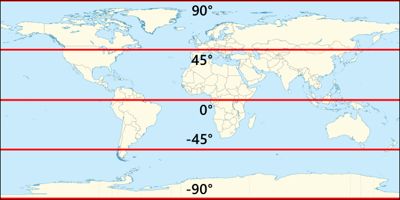
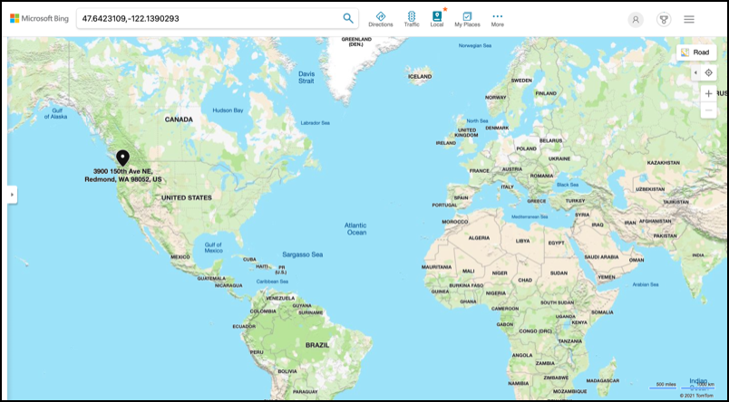

<!--
CO_OP_TRANSLATOR_METADATA:
{
  "original_hash": "52ed2bd997d08040f79a1a6ef2bac958",
  "translation_date": "2025-08-25T22:59:20+00:00",
  "source_file": "3-transport/lessons/1-location-tracking/README.md",
  "language_code": "de"
}
-->
# Standortverfolgung

> Sketchnote von [Nitya Narasimhan](https://github.com/nitya). Klicken Sie auf das Bild für eine größere Version.

## Quiz vor der Vorlesung

[Quiz vor der Vorlesung](https://black-meadow-040d15503.1.azurestaticapps.net/quiz/21)

## Einführung

Der Hauptprozess, um Lebensmittel vom Bauernhof zum Verbraucher zu bringen, umfasst das Beladen von Kisten mit Produkten auf Lastwagen, Schiffe, Flugzeuge oder andere kommerzielle Transportmittel und die Lieferung der Lebensmittel an einen Ort – entweder direkt an einen Kunden oder an ein zentrales Lager oder eine Verarbeitungsstelle. Der gesamte End-to-End-Prozess vom Bauernhof zum Verbraucher ist Teil eines Prozesses, der als *Lieferkette* bezeichnet wird. Das folgende Video der W. P. Carey School of Business der Arizona State University erklärt das Konzept der Lieferkette und wie sie im Detail verwaltet wird.

> 🎥 Klicken Sie auf das Bild oben, um das Video anzusehen.

Das Hinzufügen von IoT-Geräten kann Ihre Lieferkette erheblich verbessern, indem es Ihnen ermöglicht, den Standort von Artikeln zu verwalten, den Transport und die Warenhandhabung besser zu planen und schneller auf Probleme zu reagieren.

Wenn Sie eine Fahrzeugflotte wie Lastwagen verwalten, ist es hilfreich zu wissen, wo sich jedes Fahrzeug zu einem bestimmten Zeitpunkt befindet. Fahrzeuge können mit GPS-Sensoren ausgestattet werden, die ihren Standort an IoT-Systeme senden, sodass die Besitzer ihren Standort genau bestimmen, die zurückgelegte Route sehen und wissen können, wann sie ihr Ziel erreichen. Die meisten Fahrzeuge bewegen sich außerhalb der WLAN-Abdeckung und nutzen daher Mobilfunknetze, um diese Art von Daten zu senden. Manchmal ist der GPS-Sensor in komplexere IoT-Geräte wie elektronische Fahrtenbücher integriert. Diese Geräte verfolgen, wie lange ein Lastwagen unterwegs war, um sicherzustellen, dass die Fahrer die örtlichen Gesetze zu Arbeitszeiten einhalten.

In dieser Lektion lernen Sie, wie Sie den Standort eines Fahrzeugs mithilfe eines Global Positioning System (GPS)-Sensors verfolgen können.

In dieser Lektion behandeln wir:

* [Verbundene Fahrzeuge](../../../../../3-transport/lessons/1-location-tracking)
* [Geokoordinaten](../../../../../3-transport/lessons/1-location-tracking)
* [Global Positioning Systems (GPS)](../../../../../3-transport/lessons/1-location-tracking)
* [GPS-Sensordaten auslesen](../../../../../3-transport/lessons/1-location-tracking)
* [NMEA-GPS-Daten](../../../../../3-transport/lessons/1-location-tracking)
* [GPS-Sensordaten dekodieren](../../../../../3-transport/lessons/1-location-tracking)

## Verbundene Fahrzeuge

IoT verändert die Art und Weise, wie Waren transportiert werden, durch die Schaffung von Flotten aus *verbundenen Fahrzeugen*. Diese Fahrzeuge sind mit zentralen IT-Systemen verbunden und melden Informationen über ihren Standort sowie andere Sensordaten. Eine Flotte verbundener Fahrzeuge bietet eine Vielzahl von Vorteilen:

* Standortverfolgung – Sie können jederzeit genau bestimmen, wo sich ein Fahrzeug befindet, und dadurch:

  * Benachrichtigungen erhalten, wenn ein Fahrzeug kurz vor der Ankunft an einem Ziel steht, um ein Team für das Entladen vorzubereiten
  * Gestohlene Fahrzeuge lokalisieren
  * Standort- und Routendaten mit Verkehrsproblemen kombinieren, um Fahrzeuge während der Fahrt umzuleiten
  * Steuerkonformität sicherstellen. Einige Länder berechnen Fahrzeugen die gefahrenen Kilometer auf öffentlichen Straßen (wie [Neuseelands RUC](https://www.nzta.govt.nz/vehicles/licensing-rego/road-user-charges/)), sodass es einfacher ist, die geschuldete Steuer zu berechnen, wenn man weiß, wann ein Fahrzeug auf öffentlichen Straßen im Vergleich zu privaten Straßen unterwegs ist.
  * Wissen, wohin Wartungsteams im Falle einer Panne geschickt werden müssen

* Fahrerdaten – sicherstellen, dass Fahrer Geschwindigkeitsbegrenzungen einhalten, Kurven mit angemessener Geschwindigkeit nehmen, frühzeitig und effizient bremsen und sicher fahren. Verbundene Fahrzeuge können auch Kameras haben, um Vorfälle aufzuzeichnen. Dies kann mit Versicherungen verknüpft werden, um günstigere Tarife für gute Fahrer zu erhalten.

* Einhaltung der Fahrerarbeitszeiten – sicherstellen, dass Fahrer nur für die gesetzlich erlaubten Stunden fahren, basierend auf den Zeiten, zu denen sie den Motor ein- und ausschalten.

Diese Vorteile können kombiniert werden – beispielsweise die Einhaltung der Fahrerarbeitszeiten mit der Standortverfolgung, um Fahrer umzuleiten, wenn sie ihr Ziel nicht innerhalb der erlaubten Fahrzeiten erreichen können. Diese können auch mit anderen fahrzeugspezifischen Telemetriedaten kombiniert werden, wie z. B. Temperaturdaten von temperaturgesteuerten Lastwagen, um Fahrzeuge umzuleiten, wenn ihre aktuelle Route bedeutet, dass Waren nicht bei der richtigen Temperatur gehalten werden können.

> 🎓 Logistik ist der Prozess des Transports von Waren von einem Ort zum anderen, z. B. von einem Bauernhof zu einem Supermarkt über ein oder mehrere Lagerhäuser. Ein Bauer packt Kisten mit Tomaten, die auf einen Lastwagen geladen, zu einem zentralen Lager geliefert und auf einen zweiten Lastwagen verladen werden, der möglicherweise eine Mischung verschiedener Arten von Produkten enthält, die dann an einen Supermarkt geliefert werden.

Die Kernkomponente der Fahrzeugverfolgung ist GPS – Sensoren, die ihren Standort überall auf der Erde bestimmen können. In dieser Lektion lernen Sie, wie Sie einen GPS-Sensor verwenden, beginnend mit der Definition eines Standorts auf der Erde.

## Geokoordinaten

Geokoordinaten werden verwendet, um Punkte auf der Erdoberfläche zu definieren, ähnlich wie Koordinaten verwendet werden können, um einen Pixel auf einem Computerbildschirm zu zeichnen oder Stiche in einer Kreuzsticharbeit zu positionieren. Für einen einzelnen Punkt haben Sie ein Koordinatenpaar. Zum Beispiel befindet sich der Microsoft Campus in Redmond, Washington, USA bei 47.6423109, -122.1390293.

### Breitengrad und Längengrad

Die Erde ist eine Kugel – ein dreidimensionaler Kreis. Aus diesem Grund werden Punkte definiert, indem sie in 360 Grad unterteilt werden, genau wie die Geometrie von Kreisen. Der Breitengrad misst die Anzahl der Grad von Norden nach Süden, der Längengrad misst die Anzahl der Grad von Osten nach Westen.

> 💁 Niemand weiß wirklich den ursprünglichen Grund, warum Kreise in 360 Grad unterteilt sind. Die [Wikipedia-Seite über Winkelgrad](https://wikipedia.org/wiki/Degree_(angle)) behandelt einige der möglichen Gründe.

Der Breitengrad wird mit Linien gemessen, die die Erde umkreisen und parallel zum Äquator verlaufen, wobei die nördliche und südliche Hemisphäre jeweils in 90° unterteilt wird. Der Äquator liegt bei 0°, der Nordpol bei 90°, auch bekannt als 90° Nord, und der Südpol bei -90°, oder 90° Süd.

Der Längengrad wird als Anzahl der Grad gemessen, die nach Osten und Westen gemessen werden. Der Ursprung des Längengrads bei 0° wird als *Nullmeridian* bezeichnet und wurde 1884 als eine Linie vom Nord- zum Südpol definiert, die durch das [Britische Königliche Observatorium in Greenwich, England](https://wikipedia.org/wiki/Royal_Observatory,_Greenwich) verläuft.

> 🎓 Ein Meridian ist eine imaginäre gerade Linie, die vom Nordpol zum Südpol verläuft und einen Halbkreis bildet.

Um den Längengrad eines Punktes zu messen, misst man die Anzahl der Grad entlang des Äquators vom Nullmeridian zu einem Meridian, der durch diesen Punkt verläuft. Der Längengrad reicht von -180°, oder 180° West, über 0° am Nullmeridian bis zu 180°, oder 180° Ost. 180° und -180° beziehen sich auf denselben Punkt, den Antimeridian oder 180. Meridian. Dies ist ein Meridian auf der gegenüberliegenden Seite der Erde vom Nullmeridian.

> 💁 Der Antimeridian ist nicht mit der Internationalen Datumsgrenze zu verwechseln, die sich ungefähr an derselben Position befindet, aber keine gerade Linie ist und sich um geopolitische Grenzen herum anpasst.

✅ Recherchieren Sie: Versuchen Sie, die Breitengrad- und Längengradkoordinaten Ihres aktuellen Standorts zu finden.

### Grad, Minuten und Sekunden vs Dezimalgrad

Traditionell wurden Messungen von Breitengrad- und Längengradgraden mit sexagesimaler Nummerierung oder Basis-60 durchgeführt, einem Nummerierungssystem, das von den alten Babyloniern verwendet wurde, die die ersten Messungen und Aufzeichnungen von Zeit und Entfernung durchführten. Sie verwenden sexagesimal wahrscheinlich jeden Tag, ohne es zu merken – Stunden in 60 Minuten und Minuten in 60 Sekunden unterteilen.

Längengrad und Breitengrad werden in Grad, Minuten und Sekunden gemessen, wobei eine Minute 1/60 eines Grades und 1 Sekunde 1/60 einer Minute ist.

Zum Beispiel am Äquator:

* 1° Breitengrad entspricht **111,3 Kilometern**
* 1 Minute Breitengrad entspricht 111,3/60 = **1,855 Kilometern**
* 1 Sekunde Breitengrad entspricht 1,855/60 = **0,031 Kilometern**

Das Symbol für eine Minute ist ein einfacher Strich, für eine Sekunde ein doppelter Strich. 2 Grad, 17 Minuten und 43 Sekunden würden beispielsweise als 2°17'43" geschrieben. Teile von Sekunden werden als Dezimalzahlen angegeben, beispielsweise ist eine halbe Sekunde 0°0'0,5".

Computer arbeiten nicht mit Basis-60, daher werden diese Koordinaten in den meisten Computersystemen als Dezimalgrad angegeben, wenn GPS-Daten verwendet werden. Zum Beispiel ist 2°17'43" gleich 2,295277. Das Grad-Symbol wird normalerweise weggelassen.

Koordinaten für einen Punkt werden immer als `Breitengrad, Längengrad` angegeben, sodass das frühere Beispiel des Microsoft Campus bei 47.6423109,-122.117198 folgende Werte hat:

* Einen Breitengrad von 47.6423109 (47.6423109 Grad nördlich des Äquators)
* Einen Längengrad von -122.1390293 (122.1390293 Grad westlich des Nullmeridians).

## Global Positioning Systems (GPS)

GPS-Systeme verwenden mehrere Satelliten, die die Erde umkreisen, um Ihren Standort zu bestimmen. Sie haben wahrscheinlich GPS-Systeme verwendet, ohne es zu wissen – um Ihren Standort in einer Karten-App auf Ihrem Telefon wie Apple Maps oder Google Maps zu finden, um zu sehen, wo Ihr Fahrzeug in einer Mitfahr-App wie Uber oder Lyft ist oder beim Einsatz von Satellitennavigation (Sat-Nav) in Ihrem Auto.

> 🎓 Die Satelliten in der 'Satellitennavigation' sind GPS-Satelliten!

GPS-Systeme funktionieren, indem eine Anzahl von Satelliten ein Signal mit der aktuellen Position jedes Satelliten und einem genauen Zeitstempel senden. Diese Signale werden über Funkwellen gesendet und von einer Antenne im GPS-Sensor empfangen. Ein GPS-Sensor erkennt diese Signale und misst anhand der aktuellen Zeit, wie lange es gedauert hat, bis das Signal vom Satelliten den Sensor erreicht hat. Da die Geschwindigkeit von Funkwellen konstant ist, kann der GPS-Sensor mithilfe des gesendeten Zeitstempels berechnen, wie weit der Sensor vom Satelliten entfernt ist. Durch die Kombination der Daten von mindestens drei Satelliten mit den gesendeten Positionen kann der GPS-Sensor seinen Standort auf der Erde genau bestimmen.

> 💁 GPS-Sensoren benötigen Antennen, um Funkwellen zu erkennen. Die Antennen, die in Lastwagen und Autos mit eingebautem GPS verwendet werden, sind so positioniert, dass sie ein gutes Signal empfangen, normalerweise an der Windschutzscheibe oder auf dem Dach. Wenn Sie ein separates GPS-System verwenden, wie ein Smartphone oder ein IoT-Gerät, müssen Sie sicherstellen, dass die Antenne im GPS-System oder Telefon eine klare Sicht auf den Himmel hat, z. B. wenn sie an der Windschutzscheibe montiert ist.

GPS-Satelliten umkreisen die Erde und befinden sich nicht an einem festen Punkt über dem Sensor, sodass Standortdaten auch die Höhe über dem Meeresspiegel sowie Breitengrad und Längengrad umfassen.

GPS hatte früher Einschränkungen hinsichtlich der Genauigkeit, die vom US-Militär durchgesetzt wurden und die Genauigkeit auf etwa 5 Meter begrenzten. Diese Einschränkung wurde im Jahr 2000 aufgehoben, wodurch eine Genauigkeit von 30 Zentimetern möglich wurde. Diese Genauigkeit ist jedoch nicht immer erreichbar, da die Signale gestört werden können.

✅ Wenn Sie ein Smartphone haben, starten Sie die Karten-App und sehen Sie, wie genau Ihr Standort ist. Es kann eine kurze Zeit dauern, bis Ihr Telefon mehrere Satelliten erkennt, um einen genaueren Standort zu erhalten.
💁 Die Satelliten enthalten Atomuhren, die unglaublich genau sind, aber sie driften täglich um 38 Mikrosekunden (0,0000038 Sekunden) im Vergleich zu Atomuhren auf der Erde, da die Zeit langsamer vergeht, wenn die Geschwindigkeit zunimmt, wie es Einsteins Theorien der speziellen und allgemeinen Relativitätstheorie vorhersagen – die Satelliten bewegen sich schneller als die Erdrotation. Dieses Driftverhalten wurde genutzt, um die Vorhersagen der speziellen und allgemeinen Relativitätstheorie zu bestätigen, und muss bei der Konstruktion von GPS-Systemen berücksichtigt werden. Tatsächlich läuft die Zeit auf einem GPS-Satelliten langsamer.
GPS-Systeme wurden von einer Reihe von Ländern und politischen Vereinigungen entwickelt und eingesetzt, darunter die USA, Russland, Japan, Indien, die EU und China. Moderne GPS-Sensoren können sich mit den meisten dieser Systeme verbinden, um schnellere und genauere Standortbestimmungen zu ermöglichen.

> 🎓 Die Satellitengruppen in jeder Konstellation werden als "Konstellationen" bezeichnet.

## GPS-Sensordaten auslesen

Die meisten GPS-Sensoren senden GPS-Daten über UART.

> ⚠️ UART wurde in [Projekt 2, Lektion 2](../../../2-farm/lessons/2-detect-soil-moisture/README.md#universal-asynchronous-receiver-transmitter-uart) behandelt. Sie können bei Bedarf auf diese Lektion zurückgreifen.

Sie können einen GPS-Sensor auf Ihrem IoT-Gerät verwenden, um GPS-Daten zu erhalten.

### Aufgabe - GPS-Sensor anschließen und GPS-Daten auslesen

Arbeiten Sie die entsprechende Anleitung durch, um GPS-Daten mit Ihrem IoT-Gerät auszulesen:

* [Arduino - Wio Terminal](wio-terminal-gps-sensor.md)
* [Einplatinencomputer - Raspberry Pi](pi-gps-sensor.md)
* [Einplatinencomputer - Virtuelles Gerät](virtual-device-gps-sensor.md)

## NMEA-GPS-Daten

Wenn Sie Ihren Code ausgeführt haben, haben Sie möglicherweise etwas gesehen, das wie wirres Zeug aussieht. Tatsächlich handelt es sich dabei um standardisierte GPS-Daten, die alle eine Bedeutung haben.

GPS-Sensoren geben Daten mithilfe von NMEA-Nachrichten aus, die dem NMEA 0183-Standard entsprechen. NMEA steht für die [National Marine Electronics Association](https://www.nmea.org), eine US-amerikanische Handelsorganisation, die Standards für die Kommunikation zwischen maritimen Elektronikgeräten festlegt.

> 💁 Dieser Standard ist proprietär und kostet mindestens 2.000 US-Dollar, aber genügend Informationen darüber sind öffentlich zugänglich, sodass der Großteil des Standards rückentwickelt wurde und in Open-Source- und anderen nicht-kommerziellen Codes verwendet werden kann.

Diese Nachrichten sind textbasiert. Jede Nachricht besteht aus einem *Satz*, der mit einem `$`-Zeichen beginnt, gefolgt von 2 Zeichen, die die Quelle der Nachricht angeben (z. B. GP für das US-GPS-System, GN für GLONASS, das russische GPS-System), und 3 Zeichen, die den Nachrichtentyp angeben. Der Rest der Nachricht besteht aus Feldern, die durch Kommas getrennt sind und mit einem Zeilenumbruch enden.

Einige der Nachrichtentypen, die empfangen werden können, sind:

| Typ | Beschreibung |
| ---- | ----------- |
| GGA | GPS-Fix-Daten, einschließlich der Breiten- und Längengrad sowie der Höhe des GPS-Sensors, zusammen mit der Anzahl der Satelliten, die für die Berechnung dieses Fixes verwendet werden. |
| ZDA | Das aktuelle Datum und die Uhrzeit, einschließlich der lokalen Zeitzone |
| GSV | Details zu den sichtbaren Satelliten - definiert als die Satelliten, von denen der GPS-Sensor Signale empfangen kann |

> 💁 GPS-Daten enthalten Zeitstempel, sodass Ihr IoT-Gerät die Zeit bei Bedarf von einem GPS-Sensor abrufen kann, anstatt sich auf einen NTP-Server oder eine interne Echtzeituhr zu verlassen.

Die GGA-Nachricht enthält den aktuellen Standort im Format `(dd)dmm.mmmm`, zusammen mit einem einzelnen Zeichen zur Angabe der Richtung. Das `d` im Format steht für Grad, das `m` für Minuten, wobei Sekunden als Dezimalstellen der Minuten angegeben werden. Zum Beispiel würde 2°17'43" als 217.716666667 dargestellt - 2 Grad, 17.716666667 Minuten.

Das Richtungszeichen kann `N` oder `S` für Breitengrad sein, um Nord oder Süd anzugeben, und `E` oder `W` für Längengrad, um Ost oder West anzugeben. Zum Beispiel hätte ein Breitengrad von 2°17'43" ein Richtungszeichen von `N`, -2°17'43" hätte ein Richtungszeichen von `S`.

Beispiel - die NMEA-Nachricht `$GNGGA,020604.001,4738.538654,N,12208.341758,W,1,3,,164.7,M,-17.1,M,,*67`

* Der Breitengrad-Teil ist `4738.538654,N`, was in Dezimalgrad 47.6423109 ergibt. `4738.538654` entspricht 47.6423109, und die Richtung ist `N` (Nord), also ist es ein positiver Breitengrad.

* Der Längengrad-Teil ist `12208.341758,W`, was in Dezimalgrad -122.1390293 ergibt. `12208.341758` entspricht 122.1390293°, und die Richtung ist `W` (West), also ist es ein negativer Längengrad.

## GPS-Sensordaten dekodieren

Anstatt die rohen NMEA-Daten zu verwenden, ist es besser, sie in ein nützlicheres Format zu dekodieren. Es gibt mehrere Open-Source-Bibliotheken, die Ihnen helfen können, nützliche Daten aus den rohen NMEA-Nachrichten zu extrahieren.

### Aufgabe - GPS-Sensordaten dekodieren

Arbeiten Sie die entsprechende Anleitung durch, um GPS-Sensordaten mit Ihrem IoT-Gerät zu dekodieren:

* [Arduino - Wio Terminal](wio-terminal-gps-decode.md)
* [Einplatinencomputer - Raspberry Pi/Virtuelles IoT-Gerät](single-board-computer-gps-decode.md)

---

## 🚀 Herausforderung

Schreiben Sie Ihren eigenen NMEA-Dekoder! Anstatt sich auf Drittanbieter-Bibliotheken zu verlassen, um NMEA-Sätze zu dekodieren, können Sie Ihren eigenen Dekoder schreiben, um Breitengrad und Längengrad aus NMEA-Sätzen zu extrahieren.

## Quiz nach der Lektion

[Quiz nach der Lektion](https://black-meadow-040d15503.1.azurestaticapps.net/quiz/22)

## Überprüfung & Selbststudium

* Lesen Sie mehr über geographische Koordinaten auf der [Seite zum geographischen Koordinatensystem auf Wikipedia](https://wikipedia.org/wiki/Geographic_coordinate_system).
* Informieren Sie sich über die Nullmeridiane auf anderen Himmelskörpern außer der Erde auf der [Seite zum Nullmeridian auf Wikipedia](https://wikipedia.org/wiki/Prime_meridian#Prime_meridian_on_other_planetary_bodies).
* Recherchieren Sie die verschiedenen GPS-Systeme von verschiedenen Weltregierungen und politischen Vereinigungen wie der EU, Japan, Russland, Indien und den USA.

## Aufgabe

[Untersuchen Sie andere GPS-Daten](assignment.md)

**Haftungsausschluss**:  
Dieses Dokument wurde mit dem KI-Übersetzungsdienst [Co-op Translator](https://github.com/Azure/co-op-translator) übersetzt. Obwohl wir uns um Genauigkeit bemühen, beachten Sie bitte, dass automatisierte Übersetzungen Fehler oder Ungenauigkeiten enthalten können. Das Originaldokument in seiner ursprünglichen Sprache sollte als maßgebliche Quelle betrachtet werden. Für kritische Informationen wird eine professionelle menschliche Übersetzung empfohlen. Wir übernehmen keine Haftung für Missverständnisse oder Fehlinterpretationen, die sich aus der Nutzung dieser Übersetzung ergeben.