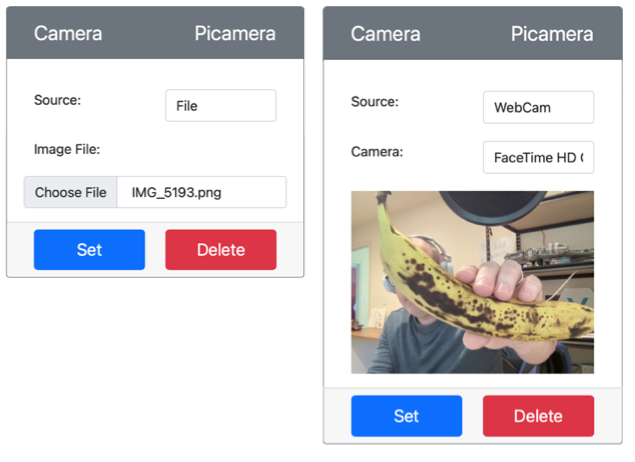

<!--
CO_OP_TRANSLATOR_METADATA:
{
  "original_hash": "3ba7150ffc4a6999f6c3cfb4906ec7df",
  "translation_date": "2025-08-25T21:01:10+00:00",
  "source_file": "4-manufacturing/lessons/2-check-fruit-from-device/virtual-device-camera.md",
  "language_code": "de"
}
-->
# Ein Bild aufnehmen - Virtuelle IoT-Hardware

In diesem Teil der Lektion fügen Sie Ihrem virtuellen IoT-Gerät einen Kamerasensor hinzu und lesen Bilder davon aus.

## Hardware

Das virtuelle IoT-Gerät verwendet eine simulierte Kamera, die entweder Bilder aus Dateien oder von Ihrer Webcam sendet.

### Kamera zu CounterFit hinzufügen

Um eine virtuelle Kamera zu verwenden, müssen Sie eine in der CounterFit-App hinzufügen.

#### Aufgabe - Kamera zu CounterFit hinzufügen

Fügen Sie die Kamera zur CounterFit-App hinzu.

1. Erstellen Sie eine neue Python-App auf Ihrem Computer in einem Ordner namens `fruit-quality-detector` mit einer einzigen Datei namens `app.py` und einer Python-virtuellen Umgebung. Fügen Sie die CounterFit-Pip-Pakete hinzu.

    > ⚠️ Sie können [die Anweisungen zum Erstellen und Einrichten eines CounterFit-Python-Projekts in Lektion 1 bei Bedarf](../../../1-getting-started/lessons/1-introduction-to-iot/virtual-device.md) nachlesen.

1. Installieren Sie ein zusätzliches Pip-Paket, um einen CounterFit-Shim zu installieren, der Kamerasensoren simulieren kann, indem er einige Funktionen des [Picamera-Pip-Pakets](https://pypi.org/project/picamera/) nachahmt. Stellen Sie sicher, dass Sie dies in einem Terminal mit aktivierter virtueller Umgebung ausführen.

    ```sh
    pip install counterfit-shims-picamera
    ```

1. Stellen Sie sicher, dass die CounterFit-Web-App läuft.

1. Erstellen Sie eine Kamera:

    1. Wählen Sie im Feld *Sensor erstellen* im Bereich *Sensoren* im Dropdown-Menü *Sensortyp* die Option *Kamera* aus.

    1. Setzen Sie den *Namen* auf `Picamera`.

    1. Wählen Sie die Schaltfläche **Hinzufügen**, um die Kamera zu erstellen.

    

    Die Kamera wird erstellt und erscheint in der Sensorenliste.

    

## Die Kamera programmieren

Das virtuelle IoT-Gerät kann nun so programmiert werden, dass es die virtuelle Kamera verwendet.

### Aufgabe - Die Kamera programmieren

Programmieren Sie das Gerät.

1. Stellen Sie sicher, dass die `fruit-quality-detector`-App in VS Code geöffnet ist.

1. Öffnen Sie die Datei `app.py`.

1. Fügen Sie den folgenden Code oben in `app.py` ein, um die App mit CounterFit zu verbinden:

    ```python
    from counterfit_connection import CounterFitConnection
    CounterFitConnection.init('127.0.0.1', 5000)
    ```

1. Fügen Sie den folgenden Code in Ihre `app.py`-Datei ein:

    ```python
    import io
    from counterfit_shims_picamera import PiCamera
    ```

    Dieser Code importiert einige benötigte Bibliotheken, einschließlich der `PiCamera`-Klasse aus der Bibliothek counterfit_shims_picamera.

1. Fügen Sie den folgenden Code darunter ein, um die Kamera zu initialisieren:

    ```python
    camera = PiCamera()
    camera.resolution = (640, 480)
    camera.rotation = 0
    ```

    Dieser Code erstellt ein PiCamera-Objekt und setzt die Auflösung auf 640x480. Obwohl höhere Auflösungen unterstützt werden, arbeitet der Bildklassifikator mit viel kleineren Bildern (227x227), sodass es nicht notwendig ist, größere Bilder aufzunehmen und zu senden.

    Die Zeile `camera.rotation = 0` legt die Rotation des Bildes in Grad fest. Wenn Sie das Bild von der Webcam oder der Datei drehen müssen, passen Sie diesen Wert entsprechend an. Zum Beispiel, wenn Sie das Bild einer Banane von einer Webcam im Querformat ins Hochformat ändern möchten, setzen Sie `camera.rotation = 90`.

1. Fügen Sie den folgenden Code darunter ein, um das Bild als Binärdaten zu erfassen:

    ```python
    image = io.BytesIO()
    camera.capture(image, 'jpeg')
    image.seek(0)
    ```

    Dieser Code erstellt ein `BytesIO`-Objekt, um Binärdaten zu speichern. Das Bild wird von der Kamera als JPEG-Datei gelesen und in diesem Objekt gespeichert. Dieses Objekt hat einen Positionsindikator, der angibt, wo es sich in den Daten befindet, damit später mehr Daten hinzugefügt werden können. Die Zeile `image.seek(0)` setzt diese Position zurück an den Anfang, damit alle Daten später gelesen werden können.

1. Fügen Sie darunter den folgenden Code ein, um das Bild in einer Datei zu speichern:

    ```python
    with open('image.jpg', 'wb') as image_file:
        image_file.write(image.read())
    ```

    Dieser Code öffnet eine Datei namens `image.jpg` zum Schreiben, liest dann alle Daten aus dem `BytesIO`-Objekt und schreibt diese in die Datei.

    > 💁 Sie können das Bild direkt in einer Datei speichern, anstatt ein `BytesIO`-Objekt zu verwenden, indem Sie den Dateinamen an den Aufruf `camera.capture` übergeben. Der Grund für die Verwendung des `BytesIO`-Objekts ist, dass Sie das Bild später in dieser Lektion an Ihren Bildklassifikator senden können.

1. Konfigurieren Sie das Bild, das die Kamera in CounterFit erfassen soll. Sie können entweder die *Quelle* auf *Datei* setzen und eine Bilddatei hochladen, oder die *Quelle* auf *WebCam* setzen, sodass Bilder von Ihrer Webcam erfasst werden. Stellen Sie sicher, dass Sie die Schaltfläche **Setzen** auswählen, nachdem Sie ein Bild oder Ihre Webcam ausgewählt haben.

    

1. Ein Bild wird aufgenommen und als `image.jpg` im aktuellen Ordner gespeichert. Sie sehen diese Datei im Explorer von VS Code. Wählen Sie die Datei aus, um das Bild anzuzeigen. Falls es gedreht werden muss, passen Sie die Zeile `camera.rotation = 0` entsprechend an und machen Sie ein weiteres Bild.

> 💁 Sie finden diesen Code im Ordner [code-camera/virtual-iot-device](../../../../../4-manufacturing/lessons/2-check-fruit-from-device/code-camera/virtual-iot-device).

😀 Ihr Kamera-Programm war ein Erfolg!

**Haftungsausschluss**:  
Dieses Dokument wurde mit dem KI-Übersetzungsdienst [Co-op Translator](https://github.com/Azure/co-op-translator) übersetzt. Obwohl wir uns um Genauigkeit bemühen, beachten Sie bitte, dass automatisierte Übersetzungen Fehler oder Ungenauigkeiten enthalten können. Das Originaldokument in seiner ursprünglichen Sprache sollte als maßgebliche Quelle betrachtet werden. Für kritische Informationen wird eine professionelle menschliche Übersetzung empfohlen. Wir übernehmen keine Haftung für Missverständnisse oder Fehlinterpretationen, die sich aus der Nutzung dieser Übersetzung ergeben.