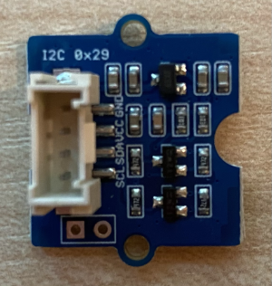

<!--
CO_OP_TRANSLATOR_METADATA:
{
  "original_hash": "288aebb0c59f7be1d2719b8f9660a313",
  "translation_date": "2025-08-25T21:13:45+00:00",
  "source_file": "4-manufacturing/lessons/4-trigger-fruit-detector/wio-terminal-proximity.md",
  "language_code": "de"
}
-->
# Nähe erkennen - Wio Terminal

In diesem Teil der Lektion fügen Sie Ihrem Wio Terminal einen Näherungssensor hinzu und lesen die Entfernung davon ab.

## Hardware

Das Wio Terminal benötigt einen Näherungssensor.

Der Sensor, den Sie verwenden werden, ist ein [Grove Time of Flight Distanzsensor](https://www.seeedstudio.com/Grove-Time-of-Flight-Distance-Sensor-VL53L0X.html). Dieser Sensor verwendet ein Laser-Entfernungsmessmodul, um Distanzen zu erkennen. Der Sensor hat einen Messbereich von 10 mm bis 2000 mm (1 cm - 2 m) und liefert in diesem Bereich recht genaue Werte. Entfernungen über 1000 mm werden als 8109 mm gemeldet.

Der Laser-Entfernungsmesser befindet sich auf der Rückseite des Sensors, gegenüber der Grove-Buchse.

Dies ist ein I²C-Sensor.

### Den Time of Flight Sensor anschließen

Der Grove Time of Flight Sensor kann an das Wio Terminal angeschlossen werden.

#### Aufgabe - Den Time of Flight Sensor anschließen

Schließen Sie den Time of Flight Sensor an.



1. Stecken Sie ein Ende eines Grove-Kabels in die Buchse des Time of Flight Sensors. Es passt nur in einer Richtung.

1. Verbinden Sie, während das Wio Terminal nicht mit Ihrem Computer oder einer anderen Stromquelle verbunden ist, das andere Ende des Grove-Kabels mit der linken Grove-Buchse des Wio Terminals, wenn Sie auf den Bildschirm schauen. Dies ist die Buchse, die sich am nächsten zum Ein-/Ausschalter befindet. Es handelt sich um eine kombinierte digitale und I²C-Buchse.


1. Sie können das Wio Terminal nun mit Ihrem Computer verbinden.

## Den Time of Flight Sensor programmieren

Das Wio Terminal kann jetzt so programmiert werden, dass es den angeschlossenen Time of Flight Sensor verwendet.

### Aufgabe - Den Time of Flight Sensor programmieren

1. Erstellen Sie ein brandneues Wio Terminal Projekt mit PlatformIO. Nennen Sie dieses Projekt `distance-sensor`. Fügen Sie im `setup`-Abschnitt Code hinzu, um die serielle Schnittstelle zu konfigurieren.

1. Fügen Sie eine Bibliotheksabhängigkeit für die Seeed Grove Time of Flight Distanzsensor-Bibliothek zur `platformio.ini`-Datei des Projekts hinzu:

    ```ini
    lib_deps =
        seeed-studio/Grove Ranging sensor - VL53L0X @ ^1.1.1
    ```

1. Fügen Sie in `main.cpp` unter den bestehenden Include-Direktiven Folgendes hinzu, um eine Instanz der Klasse `Seeed_vl53l0x` zu deklarieren, die mit dem Time of Flight Sensor interagiert:

    ```cpp
    #include "Seeed_vl53l0x.h"
    
    Seeed_vl53l0x VL53L0X;
    ```

1. Fügen Sie Folgendes am Ende der `setup`-Funktion hinzu, um den Sensor zu initialisieren:

    ```cpp
    VL53L0X.VL53L0X_common_init();
    VL53L0X.VL53L0X_high_accuracy_ranging_init();
    ```

1. Lesen Sie in der `loop`-Funktion einen Wert vom Sensor aus:

    ```cpp
    VL53L0X_RangingMeasurementData_t RangingMeasurementData;
    memset(&RangingMeasurementData, 0, sizeof(VL53L0X_RangingMeasurementData_t));

    VL53L0X.PerformSingleRangingMeasurement(&RangingMeasurementData);
    ```

    Dieser Code initialisiert eine Datenstruktur, in die die Daten eingelesen werden, und übergibt sie an die Methode `PerformSingleRangingMeasurement`, wo sie mit der Entfernungsangabe gefüllt wird.

1. Schreiben Sie unterhalb dieses Codes die Entfernungsangabe aus und fügen Sie eine Verzögerung von 1 Sekunde hinzu:

    ```cpp
    Serial.print("Distance = ");
    Serial.print(RangingMeasurementData.RangeMilliMeter);
    Serial.println(" mm");

    delay(1000);
    ```

1. Bauen, laden und führen Sie diesen Code aus. Sie können die Entfernungsangaben im seriellen Monitor sehen. Positionieren Sie Objekte in der Nähe des Sensors, und Sie werden die Entfernungsangabe sehen:

    ```output
    Distance = 29 mm
    Distance = 28 mm
    Distance = 30 mm
    Distance = 151 mm
    ```

    Der Entfernungsmesser befindet sich auf der Rückseite des Sensors. Achten Sie also darauf, die richtige Seite zu verwenden, wenn Sie die Entfernung messen.

    

> 💁 Sie finden diesen Code im Ordner [code-proximity/wio-terminal](../../../../../4-manufacturing/lessons/4-trigger-fruit-detector/code-proximity/wio-terminal).

😀 Ihr Programm für den Näherungssensor war ein Erfolg!

**Haftungsausschluss**:  
Dieses Dokument wurde mit dem KI-Übersetzungsdienst [Co-op Translator](https://github.com/Azure/co-op-translator) übersetzt. Obwohl wir uns um Genauigkeit bemühen, beachten Sie bitte, dass automatisierte Übersetzungen Fehler oder Ungenauigkeiten enthalten können. Das Originaldokument in seiner ursprünglichen Sprache sollte als maßgebliche Quelle betrachtet werden. Für kritische Informationen wird eine professionelle menschliche Übersetzung empfohlen. Wir übernehmen keine Haftung für Missverständnisse oder Fehlinterpretationen, die sich aus der Nutzung dieser Übersetzung ergeben.